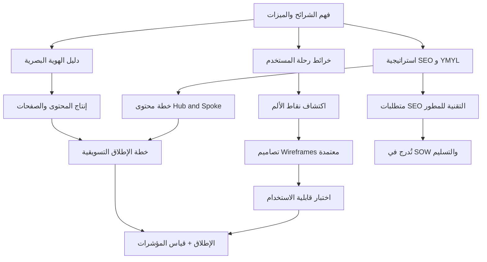

# 06 · التصميم والتسويق

> [!abstract] ماذا ستتعلّم هنا
> - تفهم الفرق بين **تجربة المستخدم (UX)** و**تجربة العميل (CX)**، ولماذا يفشل المنتج الجيد بتجربة سيئة.
> - تتقن أدوات هذه المرحلة: [[Brand Guidelines|دليل الهوية البصرية]] (Brand Guidelines)، خرائط رحلة المستخدم (User Journey Maps)، واستراتيجية تحسين محركات البحث (SEO).
> - تعرف لماذا يُعدّ موقع طبي/مالي موقع **YMYL** ولماذا يخضع لأعلى معايير **E-E-A-T** من جوجل.
> - تربط التصميم بالتسويق: كيف تتحوّل نقاط الألم في الرحلة إلى ميزات، وكيف يصبح SEO متطلبًا تقنيًا يُبنى من الأساس.
> - تميّز متى يكون SEO عائدًا مستدامًا ومتى تحتاج الإعلانات المدفوعة لتنشيط البداية.
>
> ارجع دائمًا لبوصلة الكفاءات: [[مدير المشاريع البرمجية الحديث]].

## 🧭 المفهوم ببساطة
تخيّل أنك بنيت مطعمًا فاخرًا: الطعام ممتاز والمطبخ نظيف. لكن اللافتة باهتة، والقائمة مبعثرة، والنادل لا يبتسم، ولا أحد يعرف أن المطعم افتُتح أصلًا. سيغلق أبوابه رغم جودة الطعام. **التصميم** هو ديكور المطعم وقائمته وسهولة الطلب فيه، و**التسويق** هو اللافتة والإعلان والكلمة الطيبة التي تجلب الزبائن.

مرحلة التصميم والتسويق (Design & Marketing) هي التي تجعل المنتج **جميلًا وسهلًا ومعروفًا**. تنقسم إلى شقّين متكاملين:
- **التصميم/التجربة**: كيف يبدو المنتج وكيف يشعر المستخدم أثناء استعماله (الهوية البصرية + UX/CX + رحلة المستخدم).
- **التسويق/الاكتشاف**: كيف يجد الناس المنتج ويثقون به (SEO + خطة الإطلاق + المحتوى).

بعبارة واحدة: هذه المرحلة تحوّل "منتجًا يعمل" إلى "منتجًا يحبّه الناس ويجدونه".

## 🧩 قاموس سريع للمصطلحات
| المصطلح (عربي) | English | المعنى ببساطة |
|---|---|---|
| الهوية البصرية | Brand Guidelines | كتاب قواعد الشعار والألوان والخطوط والنبرة |
| تجربة المستخدم | UX (User Experience) | سهولة وراحة التفاعل **داخل** المنصة |
| تجربة العميل | CX (Customer Experience) | الرحلة الكاملة مع علامتك قبل وأثناء وبعد |
| [[User Journey Map|خريطة رحلة المستخدم]] | User Journey Map | جدول يرصد خطوات المستخدم ومشاعره ونقاط ألمه |
| نقطة الألم | [[Pain Point]] | لحظة إحباط أو عائق يواجهه المستخدم |
| تحسين محركات البحث | SEO | جعل الموقع يظهر عاليًا في نتائج جوجل مجانًا |
| YMYL | [[YMYL|Your Money or Your Life]] | مواقع تمسّ صحة/مال الناس، جوجل يدقّقها بصرامة |
| E-E-A-T | Experience, Expertise, Authoritativeness, Trust | معايير جوجل للخبرة والموثوقية والثقة |
| صفحة الهبوط | Landing Page | صفحة مخصّصة لشريحة واحدة لدفعها لإجراء |
| NPS | [[NPS|Net Promoter Score]] | مؤشر صافي الترويج: يقيس مدى استعداد العميل للتوصية بك |
| DoR / DoD | [[Definition of Ready]] / [[Definition of Done]] | شرط دخول المهمة للتنفيذ (جاهزة) / شرط اعتبارها مكتملة (منجزة) |

## ⛓️ لماذا تأتي هنا وتقود للتالية
تعتمد هذه المرحلة على مخرجات **النطاق والمتطلبات** (من هم المستخدمون؟ ما الميزات؟) وعلى **التخطيط** (متى نطلق؟). فبدون فهم الشرائح لا تُرسم رحلة مستخدم صادقة، وبدون معرفة الميزات لا تُكتب معايير قبول التصميم. كما تتقاطع مع **الجودة والاختبار**: التصاميم (Wireframes) تُعتمد قبل البرمجة، وتُختبر قابلية الاستخدام (Usability Testing) على [[Staging vs Production Environment|Staging]].

وتقود للتالي بقوة عبر ثلاثة مسارات:
- متطلبات **SEO التقنية** تُدرج في [[SOW|نطاق العمل]] (SOW) وقائمة **التسليم** (مرحلة 07) لتصبح ملزمة تعاقديًا.
- مؤشرات UX/CX وSEO تتغذّى في لوحة **الأداء ([[OKR]]/[[KPI]])** بمرحلة 10.
- خطة الإطلاق تنشّط **العمليات** بعد الانطلاق.

باختصار: ما يُهمَل هنا يصعب إصلاحه لاحقًا (خاصة الجزء التقني من SEO).

## 📊 مخطّط سير العمل

## 📂 مستندات هذه المرحلة — واحدًا واحدًا

📂 مستندات هذه المرحلة (في مستودع المشروع)

### 1) دليل الهوية البصرية (Brand Guidelines)
> [!info] ما هو ولماذا
> كتاب قواعد يضبط الشعار والألوان والخطوط والنبرة، حتى يطبّق المنفّذ هويتك **بدقة** بدل الاجتهاد. بدونه يخرج كل مصمم بلون وخط مختلف فتضيع هوية العلامة.
- **📥 من أين تجمع معلوماته**: من صاحب العلامة/العميل (الشعار، الألوان المعتمدة)، ومن قرارات الإدارة حول النبرة (طبية رسمية موثوقة).
- **🛠️ كيف ترتّبه**: أقسام واضحة — الشعار ومساحة حمايته، جدول ألوان بأكواد HEX، الخطوط العربية والإنجليزية، النبرة، وملاحظات RTL.
- **🎯 فائدته**: اتساق بصري عبر كل الصفحات والمواد، وسرعة في إنتاج التصاميم، ومرجع يُحتكم إليه عند الخلاف.
> [!example] من عافية
> شدّد الدليل على **RTL أصيل** (تصميم عربي-أولاً وليس قلب تصميم إنجليزي)، ونبرة "طبية رسمية موثوقة" تناسب جمهورًا صحيًا متحفّظًا.

الملف: «01-دليل-الهوية-البصرية»

### 2) دليل تجربة المستخدم والعميل (UX/CX)
> [!info] ما هو ولماذا
> يشرح الفرق بين UX (التفاعل داخل المنصة) وCX (الرحلة الكاملة مع العلامة)، ولماذا **الاثنان** عامل نجاح أو فشل في تبنّي المنصة — لا رفاهية.
- **📥 من أين تجمع معلوماته**: من مقابلات 3–5 أشخاص من كل شريحة، ومن ملاحظات الدعم، ومن مبادئ UX العالمية.
- **🛠️ كيف ترتّبه**: جدول يقارن UX وCX، ثم مبادئ UX تُشترط على المنفّذ (البساطة، RTL، الوضوح، الاستجابة، السرعة، إمكانية الوصول)، ثم مؤشرات القياس.
- **🎯 فائدته**: يمنع فشل التبنّي، ويحوّل التجربة الممتازة لكل شريحة إلى ميزة تنافسية يصعب تقليدها.
> [!example] من عافية
> لأنها منصة متعددة الأطراف، لكل شريحة من **الشرائح السبع** (المستشفى، مندوب الشركة الطبية، الطبيب/موظف الإمداد، الصيدلية، مقدم التدريب، الباحث عن عمل، مدير المنصة) **رحلة مختلفة** — فلا تُصمَّم تجربة واحدة للجميع، واشتُرط اعتماد الـ Wireframes قبل البرمجة.

الملف: «04-دليل-تجربة-المستخدم-والعميل-UX-CX»

### 3) خريطة رحلة المستخدم + دليل استخدامها
> [!info] ما هو ولماذا
> قالب جاهز يرصد كيف يتنقّل كل نوع مستخدم عبر المنصة، أين يشعر بالإحباط، وأين فرص التحسين. نقاط الألم هي **كنز التحسين الحقيقي**.
- **📥 من أين تجمع معلوماته**: من مقابلات حقيقية مع المستخدمين (لا تخمين من المكتب)، ومن بيانات الاستخدام لاحقًا.
- **🛠️ كيف ترتّبه**: صف لكل مرحلة (اكتشاف → تسجيل → استكشاف → إجراء → متابعة → ترشيح) بأعمدة: ما يفعله، نقطة التماس، ما يشعر به، نقطة الألم، الفرصة، المؤشر، المسؤول، الأولوية.
- **🎯 فائدته**: يحوّل المشاعر السلبية (😟) إلى مهام تحسين ومعايير قبول، ويربط كل مرحلة بمؤشر يُتابَع.
> [!example] من عافية
> طُلب رسم خريطة **منفصلة لكل شريحة** (7 شرائح)، مع تركيز على رحلة الجوال أولًا لأن غالبية المستخدمين عليه.

الملفات: قالب `05-قالب-خريطة-رحلة-المستخدم.csv` ودليله «06-دليل-استخدام-خريطة-رحلة-المستخدم»

### 4) استراتيجية SEO و YMYL + دليل استخدام ملفات SEO
> [!info] ما هو ولماذا
> الرؤية الكاملة لتحسين محركات البحث لموقع طبي/مالي (YMYL). تغطّي:
> - السلطة الموضوعية ([[Hub and Spoke Content Model|Hub & Spoke]]).
> - الـ Technical SEO الإلزامي.
> - نية الزائر.
> - الروابط الخلفية.
> - الاستراتيجية الهجينة (SEO ومدفوع).
- **📥 من أين تجمع معلوماته**: من تحليل الكلمات المفتاحية، ومن نية الشرائح، ومن معايير جوجل E-E-A-T، ومن المستشار التقني للمتطلبات.
- **🛠️ كيف ترتّبه**: وثيقة استراتيجية (`07`) + دليل تشغيلي يربط الملفات الأربعة (`11`)، مع متطلبات تقنية قابلة للتحقق تُدرج في SOW.
- **🎯 فائدته**: عملاء مجانيون مستدامون بعد 12–18 شهرًا، وثقة ومصداقية، وبنية تقنية لا يمكن إضافتها بسهولة لاحقًا.
> [!example] من عافية
> صُنّفت المنصة **YMYL** بالكامل (تمسّ صحة وأموال الناس)، فأُلزم المطوّر بـ 20 متطلب SEO تقني (Crawl، Mobile-First، HTTPS، Schema الطبي) قبل الاستلام، مع بدء الإعلانات المدفوعة فورًا بالتوازي.

الملفات: «07-استراتيجية-SEO-و-YMYL» و«11-دليل-استخدام-ملفات-SEO». سجلات مرافقة: `08-خطة-محتوى-SEO-Content-Hub.csv` · `09-متطلبات-SEO-التقنية-للمطوّر.csv` و`.xlsx` (النسخة التفاعلية للفحص) · `10-سجل-الروابط-الخلفية-Backlinks.csv`.

### 5) خطة الإطلاق التسويقية + محتوى الصفحات
> [!info] ما هو ولماذا
> خطة تنقل المنصة من "جاهزة تقنيًا" إلى "معروفة ومستخدَمة": ما قبل الإطلاق (تشويق)، الشركاء الأوائل ([[Pilot Launch|Pilot]] Partners)، يوم الإطلاق، ومؤشرات النجاح. ويرافقها سجل نصوص الصفحات.
- **📥 من أين تجمع معلوماته**: من مدير التسويق، ومن قائمة الجهات المستهدفة، ومن خطة المحتوى، ومن الهوية البصرية للنبرة.
- **🛠️ كيف ترتّبه**: مراحل زمنية (تشويق → إطلاق → ما بعد) + جدول للشركاء الأوائل + قائمة مهام + مؤشرات (جهات مسجّلة، مواعيد محجوزة، زوّار).
- **🎯 فائدته**: إطلاق منظّم بدل ضجيج يخبو بعد يوم، وتفعيل مبكر للمنصة عبر شركاء حقيقيين.
> [!example] من عافية
> استهدفت الخطة مستشفيات وشركات وصيدليات كـ **شركاء أوائل** للانضمام عند الإطلاق، مع حملة مدفوعة اختيارية يوم الانطلاق لجلب أول 100–500 مشترك.

الملفات: «03-خطة-إطلاق-تسويقية» وسجل `02-محتوى-الصفحات.csv`.

## ⏱️ إدارة وقت هذه المهمة
| حجم المشروع | المدة التقريبية (دوليًا) |
|---|---|
| صغير (موقع تعريفي بسيط) | أيام–أسبوع لتجهيز هوية مبسّطة + صفحات + أساسيات SEO |
| متوسط (منصة بشرائح محدودة) | أسبوعان–4 أسابيع للهوية + رحلات المستخدم + استراتيجية SEO + خطة إطلاق |
| كبير (منصة متعددة الأطراف كعافية) | أسابيع–أشهر، وبعضها (SEO المحتوى) عمل **مستمر** لا ينتهي بالإطلاق |

- **من يُنتج المستند وكيف يتعاونون**: عادة 3–5 أدوار — مسؤول تسويق (قيادة)، مصمم UX/UI، كاتب محتوى/SEO، مطوّر (لتطبيق متطلبات SEO التقنية)، ومدير المشروع (تنسيق واعتماد). التعاون تكراري: المصمم يرسم Wireframes → المستخدمون يختبرون → المطوّر ينفّذ → التسويق يطلق. في فريق صغير قد يجمع شخص عدة أدوار.
- **أي ملفات تراجع**: دليل الهوية (`01`) قبل أي تصميم، خرائط الرحلة (`05`) قبل كتابة معايير القبول، متطلبات SEO التقنية (`09`) قبل توقيع SOW، وخطة الإطلاق (`03`) قبل الانطلاق.
- **صيغ الملفات**:

| النوع | الصيغة المناسبة | لماذا |
|---|---|---|
| السجلات (رحلة، محتوى SEO، روابط، متطلبات) | Excel / CSV | فلترة وتلوين شرطي ومشاركة سهلة |
| الأدلة (هوية، UX/CX، SEO) | Word / Markdown | نص غني ومرجعي وسهل التحديث |
| المستندات الرسمية (اعتماد التصميم، عقود) | PDF | ثبات الشكل عند التوقيع والأرشفة |

> **ملاحظة**: الدقة أهم من السرعة — خطأ في الهوية أو في متطلبات SEO التقنية يكلّف إعادة بناء لاحقًا.

## 🌐 ما تقوله المعايير الحديثة
> [!quote] خلاصة بحث 2026
> - **YMYL أشدّ صرامة**: بعد التحديثات الأخيرة على إرشادات مقيّمي الجودة، يُقاس المحتوى الطبي بمعيار مصداقية أعلى بكثير. الأساس: **E-E-A-T** — سِيَر كتّاب مؤهّلين، مراجعة طبية موقّعة باسم، واستشهاد بمصادر أولية.
> - **بحث الذكاء الاصطناعي ([[GEO]])**: محرّكات مثل Google [[AI Overviews]] وPerplexity تفضّل محتوى "يجيب أولًا" (Answer-First) مع مخطط FAQ Schema — ما يرفع فرص الاقتباس في الإجابات المولّدة.
> - **النية المحلية**: نسبة كبيرة من عمليات البحث الصحية ذات نية محلية — فالـ Local SEO ليس اختياريًا لأي جهة لها موقع فعلي.
> - **إطلاق يُقاس بالبيانات**: نجاح الإطلاق يُحكم بالمؤشرات لا بالانطباع، والتعاون بين الفرق هو "الغراء" الذي يجمع الرسائل والتجربة.
>
> هذا يتقاطع مع [[مدير المشاريع البرمجية الحديث|مثلث كفاءات PMI]] (تقنية + قيادة + إدارة إستراتيجية للأعمال): التصميم/التسويق ليس مهمة تقنية فقط، بل قرار استراتيجي يخدم قيمة الأعمال.

## ➕ لإكمال الصورة — تحسينات مقترحة
> [!todo] فجوات مقابل المعايير وكيف تكملها
> - **لا يوجد تقويم محتوى تشغيلي**: الملفات تخطّط "ماذا" ننشر لكن لا تحدّد إيقاع النشر و"متى/من". الحل: اعتمد قالب [[تقويم المحتوى التسويقي (Content Calendar)]] لتحويل الخطة إلى نشر منتظم بعد الإطلاق.
> - **لا خطة صريحة لاختبار قابلية الاستخدام (Usability Testing)**: يُذكر الاختبار كمبدأ لكن دون سيناريو/عدد مشاركين/معايير نجاح موثّقة. الحل: صمّم جلسات 5 مستخدمين لكل شريحة على Staging قبل الإطلاق (يرتبط بـ [[20 - Quality Management]]).
> - **غياب سِيَر كتّاب ومراجعة طبية موقّعة (E-E-A-T)**: معيار 2026 يشترط مؤلفًا مؤهّلًا ومراجعًا مختصًا للمحتوى الطبي. الحل: أضف حقول "الكاتب/المراجع الطبي" لخطة المحتوى.
> - **لا تهيئة صريحة لبحث الذكاء الاصطناعي (GEO/FAQ Schema)**: الحل: اشترط محتوى Answer-First ومخطط FAQ ضمن متطلبات `09`.
> - **إدارة مخاطر التسويق غير مذكورة**: (تأخر شريك أساسي، رفض إعلان، شكوى محتوى طبي). الحل: أدرجها في [[19 - Risk Management]] وواصل الجهات عبر [[21 - Stakeholder Communication]].

## 🎬 سيناريوهان
> [!success] الطريقة الصحيحة — نورة
> نورة، مديرة المشروع، رفضت البدء بالبرمجة قبل اعتماد الـ Wireframes. رسم فريقها خريطة رحلة **لكل شريحة**، فاكتشفوا أن تسجيل الشركات الطبية طويل ومرهق (نقطة ألم). بسّطوه لتسجيل تدريجي، وأدرجوا متطلبات SEO التقنية في SOW قبل التوقيع. عند الإطلاق، بدأوا حملة مدفوعة مستهدفة بالتوازي مع بناء المحتوى. النتيجة: تبنٍّ سريع، وبعد عام بدأت الزيارات العضوية المجانية تتراكم.

> [!failure] الطريقة الخاطئة — سامي
> سامي أطلق المنصة بحماس دون دليل هوية (كل صفحة بلون وخط)، ودون خرائط رحلة (صمّم تجربة واحدة لكل الشرائح)، وأجّل SEO التقني "لما بعد التطوير". النتيجة: هوية مشوّشة، تسجيل معقّد نفّر المستشفيات، وموقع YMYL غير مهيّأ لم يظهر في جوجل — فاضطر لإعادة بناء تقنية مكلفة وظلّ يدفع للإعلانات بلا زيارات مجانية.

## 🧩 قرارات تفاعلية (فكّر ثم افتح)
> [!question]- الميزانية محدودة وعليك الاختيار: (أ) توظيف خبير UX متفرّغ · (ب) اشتراط مبادئ UX على المنفّذ + اعتماد التصاميم قبل البرمجة + اختبارها مع مستخدمين حقيقيين · (ج) تأجيل UX لما بعد الإطلاق.
> ✅ **الأفضل: (ب)**.
> **لماذا؟** لست مضطرًا لخبير متفرّغ الآن، لكن تأجيل UX (ج) يقتل التبنّي خصوصًا مع جمهور صحي متحفّظ. الحدّ الأدنى الفعّال: اشترط المبادئ، اعتمد الـ Wireframes قبل البرمجة، واختبرها مع 5 مستخدمين لكل شريحة.
> **السيناريو المثالي**: تدمج مبادئ UX في معايير القبول وDoR/DoD، وتجعل التغذية الراجعة حلقة مستمرة بعد الإطلاق.

> [!question]- SEO يحتاج 12–18 شهرًا ليثمر، والإدارة تريد عملاء الآن: (أ) ركّز على SEO فقط وانتظر · (ب) ركّز على الإعلانات المدفوعة فقط · (ج) استراتيجية هجينة: مدفوع فورًا + SEO يُبنى بالتوازي.
> ✅ **الأفضل: (ج)**.
> **لماذا؟** الاكتفاء بالمدفوع (ب) يوقف الزيارات بتوقف الدفع، والاكتفاء بـ SEO (أ) يترك المنصة بلا عملاء لأشهر. الهجين يجلب أول عملاء فورًا ويبني الأساس المستدام معًا.
> **السيناريو المثالي**: حملات دقيقة تستهدف مدراء المستشفيات لجلب أول 100–500 مشترك، وبالتوازي محتوى Hub & Spoke ومتطلبات SEO التقنية مبنية من الأساس.

## 🧠 أسئلة تفكير ناقد وعصف ذهني (بلا إجابة واحدة)
> [!question] فكّر بعمق
> - كيف توازن بين "تجربة موحّدة بسيطة" و"تجربة مخصّصة لكل شريحة" في منصة متعددة الأطراف؟
> - إذا تعارضت جمالية الهوية البصرية مع سرعة التحميل، أيهما تقدّم ولماذا؟
> - كيف تبني E-E-A-T لعلامة **جديدة** لا تاريخ لها بعد في القطاع الطبي؟
> - متى يكون الإنفاق على الإعلانات المدفوعة تبديدًا بدل استثمار؟

> [!tip] إطار الإجابة
> 1. **حدّد المتغيّرات**: من المتأثر؟ ما القيود (وقت/ميزانية/تقنية)؟
> 2. **وازن المفاضلات**: كل خيار له تكلفة وعائد — قدّرهما كمّيًا قدر الإمكان.
> 3. **اربط بالهدف**: أي خيار يخدم قيمة الأعمال والتبنّي طويل المدى؟
> 4. **قِس وكرّر**: اختر، اقس بمؤشر واضح، ثم صحّح.
> **مثال اتجاه**: للتخصيص مقابل التوحيد — وحّد الأساسيات (التنقّل، الأزرار، السرعة) وخصّص نقاط القرار الحرجة لكل شريحة (صفحات الهبوط والرسائل).

## ❓ نقاط للمراجعة (استرجاع)
> [!question]- ما الفرق الجوهري بين UX و CX؟
> UX هو التفاعل **داخل** المنصة (سهولة الشاشات والتدفق)، وCX هو الرحلة **الكاملة** مع العلامة قبل وأثناء وبعد. UX جزء من CX.

> [!question]- لماذا تُصنّف عافية موقع YMYL؟
> لأنها تؤثر على **صحة** الناس (قطاع طبي) و**أموالهم** (اشتراكات ومعاملات)، فيطبّق عليها جوجل أعلى معايير التدقيق (E-E-A-T) قبل ترتيبها.

> [!question]- لماذا يجب بناء Technical SEO من الأساس لا لاحقًا؟
> لأن الجزء التقني (بنية الروابط، السرعة، Schema، الأمان) لا يمكن إضافته بسهولة بعد التطوير، وإهماله يعني إعادة بناء مكلفة وخسارة الأرشفة.

> [!question]- ما نموذج Hub & Spoke ولماذا؟
> محور رئيسي (Hub) دليل شامل، تتفرّع منه مقالات (Spokes) متخصّصة مترابطة داخليًا — لبناء **سلطة موضوعية** يريدها جوجل بدل مقالة واحدة معزولة.

> [!question]- لماذا نرسم خريطة رحلة منفصلة لكل شريحة؟
> لأن كل شريحة (مستشفى/مندوب/صيدلية/باحث عمل) لها أهداف ونقاط ألم مختلفة؛ تجربة واحدة للجميع تُهمل احتياجات معظمهم وتضعف التبنّي.

> [!question]- ما الاستراتيجية الهجينة في التسويق؟
> المزج بين **الإعلانات المدفوعة** (نتائج فورية لتنشيط البداية) و**SEO** (أساس مجاني مستدام يُبنى بالتوازي ويثمر بعد 12–18 شهرًا).

## 💼 من أسئلة المقابلات
> [!question]- كيف تطلق منتجًا جديدًا من الصفر؟
> **نموذج إجابة**: أبدأ بفهم الشرائح ورحلاتها، ثم أبني الرسالة والتموضع (Positioning)، وأجهّز الهوية والمحتوى وصفحات الهبوط. أختار قنوات مناسبة (مدفوع فوري + SEO مستدام)، وأحدّد مؤشرات نجاح مسبقًا (تسجيلات، تفعيل، احتفاظ). أطلق بمرحلة تجريبية مع شركاء أوائل، أقيس، ثم أوسّع.

> [!question]- كيف تقيس نجاح إطلاق؟
> **نموذج إجابة**: بمؤشرات مربوطة بالهدف — لجذب: زيارات وتكلفة الاكتساب؛ للتفعيل: معدل إكمال التسجيل وأول إجراء؛ للاحتفاظ: العودة وNPS. لا أحكم بالانطباع بل بالبيانات، وأقارن بالأهداف المحدّدة مسبقًا.

> [!question]- حدّثني عن مشروع قدت فيه فرقًا بأولويات متعارضة، كيف واءمت بينها؟
> **نموذج إجابة (STAR)**: الموقف: إطلاق يتطلب تنسيق تصميم وتطوير وتسويق بمواعيد متضاربة. المهمة: مواءمة الجميع على خطة واحدة. الإجراء: خريطة طريق مشتركة، ومعايير قبول واضحة، واجتماعات مزامنة قصيرة. النتيجة: إطلاق في الموعد بجودة متفق عليها.

> [!question]- كيف تضمن اتساق العلامة عبر فرق ومصمّمين مختلفين؟
> **نموذج إجابة**: بدليل هوية بصرية مُلزم (ألوان/خطوط/نبرة/RTL) يُدرج في عقد المنفّذ، مع مكتبة مكوّنات معتمدة ومراجعة تصميم قبل التنفيذ.

> [!tip] استخدم إطار STAR
> في الأسئلة السلوكية، رتّب إجابتك: **الموقف (Situation) → المهمة (Task) → الإجراء (Action) → النتيجة (Result)** — يجعل جوابك محدّدًا ومقنعًا بأرقام.

> [!note] ملاحظة عن المصدر
> بعض الأسئلة أعلاه مُقتبسة ومُكيَّفة من سياق **تسويق المنتج (Product Marketing)** لتخدم دور **مدير المشروع (PM)** في مرحلة التصميم والتسويق.

## 🧪 من مبتدئ إلى محترف
> [!success] مسار التدرّج
> - **مبتدئ**: تعرف الفرق بين UX وCX، وتملأ قالب رحلة مستخدم واحدًا، وتفهم أن SEO يجعلك تظهر في جوجل.
> - **متوسّط**: ترسم رحلات لكل شريحة وتحوّل نقاط الألم إلى معايير قبول، وتبني دليل هوية، وتصيغ خطة محتوى Hub & Spoke، وتدرج متطلبات SEO التقنية في SOW.
> - **محترف**: تقود استراتيجية تصميم/تسويق متكاملة تربط التجربة بالأعمال؛ تبني E-E-A-T لعلامة جديدة، وتهيّئ المحتوى لبحث الذكاء الاصطناعي (GEO)، وتدير مزيجًا هجينًا (مدفوع + عضوي) بقرارات مبنية على المؤشرات، وتغلق الحلقة مع الجودة والأداء.

## 🔗 ربط بالمفاهيم
- [[15 - Roadmap]]
- [[19 - Risk Management]]
- [[20 - Quality Management]]
- [[21 - Stakeholder Communication]]
- [[11 - User Stories]]
- [[مدير المشاريع البرمجية الحديث]]

## 📌 بطاقة مرجعية سريعة
| المحور | الخلاصة |
|---|---|
| الشقّان | تصميم/تجربة (هوية + UX/CX + رحلة) · تسويق/اكتشاف (SEO + إطلاق + محتوى) |
| القاعدة الذهبية للتصميم | اعتمد الـ Wireframes واختبرها **قبل** البرمجة |
| القاعدة الذهبية لـ SEO | Technical SEO يُبنى من الأساس، لا يُضاف لاحقًا |
| YMYL/E-E-A-T | موقع صحي/مالي = أعلى معايير الثقة والموثوقية |
| الاستراتيجية | هجينة: مدفوع فوري + SEO مستدام بالتوازي |
| يغذّي | التسليم (SOW) · الأداء (KPI) · العمليات |

> [!tip] قواعد ذهبية
> - **التجربة تصنع التبنّي**: منتج جيد بتجربة سيئة = فشل. صمّم لكل شريحة.
> - **ابنِ من الأساس**: الهوية ومتطلبات SEO التقنية تُقرّر مبكرًا لأن إصلاحها لاحقًا مكلف.
> - **قِس لا تخمّن**: كل قرار تصميم/تسويق يُحكم بمؤشر واضح.

> [!quote] مصادر
> - [Healthcare SEO Playbook for 2026 — Bloom Consulting](https://bloomconsulting.agency/the-healthcare-seo-playbook-for-2026-strategies-to-make-you-unavoidable/)
> - [2026 Healthcare SEO Strategy: Win AI Search and Patient Traffic — BizIQ](https://biziq.com/blog/the-ultimate-healthcare-seo-strategy-for-the-ai-era/)
> - [Top Product Marketing Manager Interview Questions — Exponent](https://www.tryexponent.com/blog/top-product-marketing-manager-interview-questions)
> - [Product Marketing Manager Interview Questions — Indeed](https://www.indeed.com/hire/interview-questions/product-marketing-manager)
