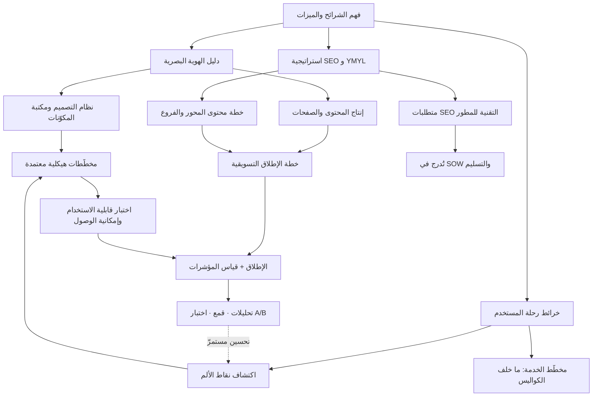
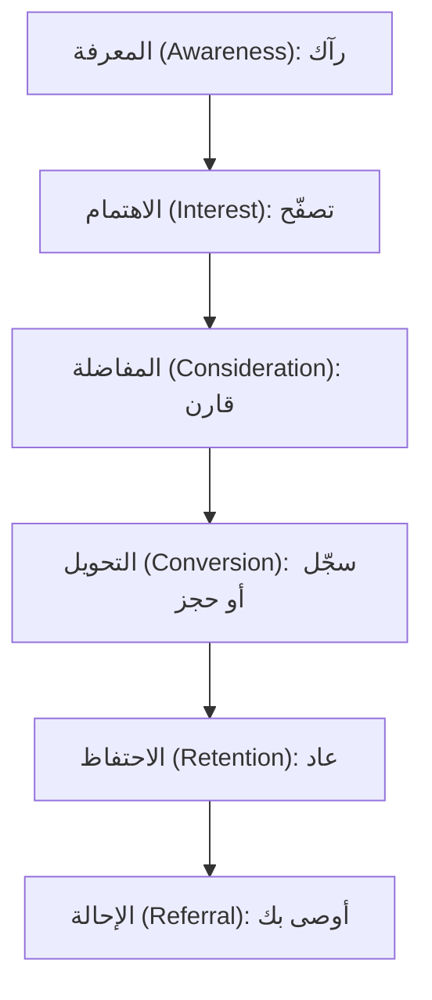

# 06 · التصميم وتجربة المستخدم والتسويق

> [!abstract] ماذا ستتعلّم هنا
> - تفهم الفرق بين **تجربة المستخدم (UX)** و**واجهة المستخدم (UI)** و**تجربة العميل (CX)**، ولماذا يفشل المنتج الجيد بتجربة سيئة.
> - تتقن أدوات هذه المرحلة: [[Brand Guidelines|دليل الهوية البصرية]] (Brand Guidelines)، و**نظام التصميم (Design System)**، وخرائط رحلة المستخدم (User Journey Maps)، و**مخطّط الخدمة (Service Blueprint)**، واستراتيجية تحسين محركات البحث (SEO).
> - تعرف **إمكانية الوصول (Accessibility)** ولماذا هي في منصّة صحية شرطُ استعمال لا تحسينًا اختياريًّا.
> - تعرف لماذا يُعدّ موقع طبي/مالي موقع **YMYL** وما موضع **E-E-A-T** من إرشادات جوجل — بلا مبالغة في وصفه «معيارًا».
> - تربط التصميم بالتسويق: كيف تتحوّل نقاط الألم في الرحلة إلى ميزات، وكيف يصبح SEO متطلبًا تقنيًا يُبنى من الأساس.
> - تميّز متى يكون SEO عائدًا مستدامًا ومتى تحتاج الإعلانات المدفوعة لتنشيط البداية، وتعرف **مزيج القنوات** الثلاث (مملوكة · مكتسبة · مدفوعة).
> - تُغلق الحلقة بـ**التصميم المبني على البيانات**: القياس، والقمع، واختبار A/B، وتحسين التحويل.
>
> ارجع دائمًا لبوصلة الكفاءات: [[مدير المشاريع البرمجية الحديث]].

---

## 🧭 المفهوم ببساطة

تخيّل أنك بنيت مطعمًا فاخرًا: الطعام ممتاز والمطبخ نظيف. لكن اللافتة باهتة، والقائمة مبعثرة، والنادل لا يبتسم، ولا أحد يعرف أن المطعم افتُتح أصلًا. سيغلق أبوابه رغم جودة الطعام. **التصميم** هو ديكور المطعم وقائمته وسهولة الطلب فيه، و**التسويق** هو اللافتة والإعلان والكلمة الطيبة التي تجلب الزبائن.

وهذه المرحلة هي التي تجعل المنتج **جميلًا وسهلًا ومعروفًا**، وتقوم على **ثلاثة محاور** متكاملة:

1. **التصميم والتجربة** — كيف يبدو المنتج وكيف يشعر المستخدم أثناء استعماله: الهوية البصرية، وواجهة المستخدم ونظامها، وتجربة المستخدم والعميل، ورحلاته.
2. **التسويق والاكتشاف** — كيف يجد الناس المنتج ويثقون به: تحسين محركات البحث، والمحتوى، ومزيج القنوات، وخطة الإطلاق.
3. **التصميم المبني على البيانات** — كيف نعرف أن ما صمّمناه وسوّقناه يعمل فعلًا: القياس، والقمع، والاختبار، والتحسين المستمرّ.

بعبارة واحدة: هذه المرحلة تحوّل "منتجًا يعمل" إلى "منتجًا يحبّه الناس ويجدونه" — **ثم تُثبت ذلك بالأرقام لا بالانطباع**.

---

## 🧩 قاموس سريع للمصطلحات

| المصطلح (عربي) | English | المعنى ببساطة |
|---|---|---|
| الهوية البصرية | Brand Guidelines | كتاب قواعد الشعار والألوان والخطوط والنبرة |
| تجربة المستخدم | UX (User Experience) | سهولة وراحة التفاعل **داخل** المنصة |
| واجهة المستخدم | UI (User Interface) | الطبقة المرئية التي يلمسها المستخدم: الأزرار والشاشات والحالات |
| نظام التصميم | Design System | مصدر الحقيقة للواجهة: رموز التصميم + مكتبة مكوّنات + قواعد استعمال |
| مكتبة المكوّنات | Component Library | المكوّنات المبرمَجة القابلة لإعادة الاستعمال (زرّ · حقل · جدول) |
| المخطّط الهيكلي | Wireframe | رسم أوّلي للبنية والترتيب بلا ألوان ولا تفاصيل بصرية |
| التصميم المتجاوب | Responsive Design | أن تتكيّف الواجهة مع كل مقاس شاشة بلا كسر |
| إمكانية الوصول | Accessibility (a11y) | أن يستطيع ذوو الإعاقة استعمال المنتج فعلًا |
| تجربة العميل | CX (Customer Experience) | الرحلة الكاملة مع علامتك قبل وأثناء وبعد |
| [[User Journey Map\|خريطة رحلة المستخدم]] | User Journey Map | جدول يرصد خطوات المستخدم ومشاعره ونقاط ألمه |
| مخطّط الخدمة | Service Blueprint | ما يجري **داخل** المنظّمة خلف كل خطوة يراها العميل |
| نقطة الألم | [[Pain Point]] | لحظة إحباط أو عائق يواجهه المستخدم |
| تحسين محركات البحث | SEO | جعل الموقع يظهر عاليًا في نتائج جوجل مجانًا |
| مزيج القنوات | Owned · Earned · Paid | قنوات تملكها · تكسبها · تدفع لها |
| YMYL | [[YMYL\|Your Money or Your Life]] | مواقع تمسّ صحة/مال الناس، تُقيَّم بأشدّ معايير الجودة |
| E-E-A-T | Experience, Expertise, Authoritativeness, Trust | إشارات جودة في **إرشادات مقيّمي جوجل** — لا لائحة متطلبات إلزامية |
| صفحة الهبوط | Landing Page | صفحة مخصّصة لشريحة واحدة لدفعها لإجراء |
| قمع التحويل | Conversion Funnel | مسار الزائر من المعرفة إلى الإحالة، ونسبة من يعبر كل مرحلة |
| اختبار A/B | A/B Testing | عرض نسختين على شريحتين متكافئتين ومقارنة النتيجة |
| خريطة الحرارة | Heatmap | تمثيل بصري لمواضع النقر والتمرير والانتباه |
| NPS | [[NPS\|Net Promoter Score]] | مؤشر صافي الترويج: يقيس مدى استعداد العميل للتوصية بك |
| DoR / DoD | [[Definition of Ready]] / [[Definition of Done]] | شرط دخول المهمة للتنفيذ (جاهزة) / شرط اعتبارها مكتملة (منجزة) |

> [!info] اصطلاح ثابت في هذا الفصل
> ثلاثة مواضع كانت تتذبذب فيها الصياغة، وقد ثُبِّتت على صيغة واحدة:
> - **العربية أوّلًا ثم الإنجليزية بين قوسين** عند أوّل ظهور، ثم العربية وحدها — فلا يُكتب `Technical SEO` ابتداءً بل «تحسين محركات البحث التقني (Technical SEO)» ثم «SEO التقني».
> - **المخطّط الهيكلي (Wireframe)** مفردًا، و**المخطّطات الهيكلية** جمعًا — لا `Wireframes` عربيًّا مُعرَّبة بـ«الـ».
> - **نموذج المحور والفروع (Hub & Spoke)** بهذا الرسم وحده — لا `Hub and Spoke` تارةً و`Hub & Spoke` تارةً.
> - **مدّة إثمار SEO تُكتب `12–18 شهرًا`** في كل الفصل بهذه الصيغة والشرطة نفسها.

---

## ⛓️ لماذا تأتي هنا وتقود للتالية

تعتمد هذه المرحلة على مخرجات **النطاق والمتطلبات** (من هم المستخدمون؟ ما الميزات؟) وعلى **التخطيط** (متى نطلق؟). فبدون فهم الشرائح لا تُرسم رحلة مستخدم صادقة، وبدون معرفة الميزات لا تُكتب معايير قبول التصميم. كما تتقاطع مع **الجودة والاختبار**: المخطّطات الهيكلية تُعتمد قبل البرمجة، وتُختبر قابلية الاستخدام (Usability Testing) على [[Staging vs Production Environment|Staging]].

وتقود للتالي بقوة عبر ثلاثة مسارات:

- متطلبات **SEO التقنية وإمكانية الوصول** تُدرج في [[SOW|نطاق العمل]] (SOW) وقائمة **التسليم** (مرحلة 07) لتصبح ملزمة تعاقديًا.
- مؤشرات UX/CX وSEO تتغذّى في لوحة **الأداء ([[OKR]]/[[KPI]])** بمرحلة 10.
- خطة الإطلاق تنشّط **العمليات** بعد الانطلاق.

باختصار: ما يُهمَل هنا يصعب إصلاحه لاحقًا — وأشدّه ثلاثة: **الجزء التقني من SEO**، و**نظام التصميم**، و**إمكانية الوصول**؛ فكلّها بنية لا تُضاف بطبقة دهان في النهاية.

---

## 📊 مخطّط سير العمل

---

## 📂 مستندات هذه المرحلة — واحدًا واحدًا

📂 مستندات هذه المرحلة (في مستودع المشروع)

> [!info] كيف يُقرأ هذا القسم
> الوثائق **من (1) إلى (5)** موجودة فعلًا في ملفّات المشروع. أمّا **(6) و(7) و(8)** فهي **طبقة مرجعية أضفناها**: لا وجود لها في ملفّات عافية، وغيابها هو بعينه أكبر فجوات هذه المرحلة. وأرقام الملفّات (`01-…` · `09-…`) ترتيبها في المجلّد لا ترتيب قراءتها.

### 1) دليل الهوية البصرية (Brand Guidelines)

> [!info] ما هو ولماذا
> كتاب قواعد يضبط الشعار والألوان والخطوط والنبرة، حتى يطبّق المنفّذ هويتك **بدقة** بدل الاجتهاد. بدونه يخرج كل مصمم بلون وخط مختلف فتضيع هوية العلامة.

- **📥 من أين تجمع معلوماته**: من صاحب العلامة/العميل (الشعار، الألوان المعتمدة)، ومن قرارات الإدارة حول النبرة (طبية رسمية موثوقة).
- **🛠️ كيف ترتّبه**: أقسام واضحة — الشعار ومساحة حمايته، جدول ألوان بأكواد HEX، الخطوط العربية والإنجليزية، النبرة، وملاحظات RTL.
- **🎯 فائدته**: اتساق بصري عبر كل الصفحات والمواد، وسرعة في إنتاج التصاميم، ومرجع يُحتكم إليه عند الخلاف.

> [!example] من عافية
> شدّد الدليل على **RTL أصيل** (تصميم عربي-أولاً وليس قلب تصميم إنجليزي)، ونبرة "طبية رسمية موثوقة" تناسب جمهورًا صحيًا متحفّظًا.

الملف: «01-دليل-الهوية-البصرية»

### 2) دليل تجربة المستخدم والعميل (UX/CX)

> [!info] ما هو ولماذا
> يشرح الفرق بين UX (التفاعل داخل المنصة) وCX (الرحلة الكاملة مع العلامة)، ولماذا **الاثنان** عامل نجاح أو فشل في تبنّي المنصة — لا رفاهية.

- **📥 من أين تجمع معلوماته**: من مقابلات 3–5 أشخاص من كل شريحة، ومن ملاحظات الدعم، ومن مبادئ UX العالمية.
- **🛠️ كيف ترتّبه**: جدول يقارن UX وCX، ثم مبادئ UX تُشترط على المنفّذ (البساطة، RTL، الوضوح، الاستجابة، السرعة، إمكانية الوصول)، ثم مؤشرات القياس.
- **🎯 فائدته**: يمنع فشل التبنّي، ويحوّل التجربة الممتازة لكل شريحة إلى ميزة تنافسية يصعب تقليدها.

> [!example] من عافية
> لأنها منصة متعددة الأطراف، لكل شريحة من **الشرائح السبع** (المستشفى، مندوب الشركة الطبية، الطبيب/موظف الإمداد، الصيدلية، مقدم التدريب، الباحث عن عمل، مدير المنصة) **رحلة مختلفة** — فلا تُصمَّم تجربة واحدة للجميع، واشتُرط اعتماد المخطّطات الهيكلية قبل البرمجة.

الملف: «04-دليل-تجربة-المستخدم-والعميل-UX-CX»

### 3) خريطة رحلة المستخدم + دليل استخدامها

> [!info] ما هو ولماذا
> قالب جاهز يرصد كيف يتنقّل كل نوع مستخدم عبر المنصة، أين يشعر بالإحباط، وأين فرص التحسين. نقاط الألم هي **كنز التحسين الحقيقي**.

- **📥 من أين تجمع معلوماته**: من مقابلات حقيقية مع المستخدمين (لا تخمين من المكتب)، ومن بيانات الاستخدام لاحقًا.
- **🛠️ كيف ترتّبه**: صف لكل مرحلة (اكتشاف → تسجيل → استكشاف → إجراء → متابعة → ترشيح) بأعمدة: ما يفعله، نقطة التماس، ما يشعر به، نقطة الألم، الفرصة، المؤشر، المسؤول، الأولوية.
- **🎯 فائدته**: يحوّل المشاعر السلبية (😟) إلى مهام تحسين ومعايير قبول، ويربط كل مرحلة بمؤشر يُتابَع.

> [!example] من عافية
> طُلب رسم خريطة **منفصلة لكل شريحة** (7 شرائح)، مع تركيز على رحلة الجوال أولًا لأن غالبية المستخدمين عليه.

الملفات: قالب `05-قالب-خريطة-رحلة-المستخدم.csv` ودليله «06-دليل-استخدام-خريطة-رحلة-المستخدم»

### 4) استراتيجية SEO و YMYL + دليل استخدام ملفات SEO

> [!info] ما هو ولماذا
> الرؤية الكاملة لتحسين محركات البحث لموقع طبي/مالي (YMYL). تغطّي:
> - السلطة الموضوعية عبر [[Hub and Spoke Content Model|نموذج المحور والفروع]] (Hub & Spoke).
> - **تحسين محركات البحث التقني (Technical SEO)** الإلزامي.
> - نية الزائر.
> - الروابط الخلفية.
> - الاستراتيجية الهجينة (SEO ومدفوع).

- **📥 من أين تجمع معلوماته**: من تحليل الكلمات المفتاحية، ومن نية الشرائح، ومن إرشادات جوجل لمقيّمي الجودة (E-E-A-T)، ومن المستشار التقني للمتطلبات.
- **🛠️ كيف ترتّبه**: وثيقة استراتيجية (`07`) + دليل تشغيلي يربط الملفات الأربعة (`11`)، مع متطلبات تقنية قابلة للتحقق تُدرج في SOW.
- **🎯 فائدته**: عملاء مجانيون مستدامون بعد **12–18 شهرًا**، وثقة ومصداقية، وبنية تقنية لا يمكن إضافتها بسهولة لاحقًا.

> [!example] من عافية
> صُنّفت المنصة **YMYL** بالكامل (تمسّ صحة وأموال الناس)، فأُلزم المطوّر بـ 20 متطلب SEO تقني (Crawl، Mobile-First، HTTPS، Schema الطبي) قبل الاستلام، مع بدء الإعلانات المدفوعة فورًا بالتوازي.

الملفات: «07-استراتيجية-SEO-و-YMYL» و«11-دليل-استخدام-ملفات-SEO». سجلات مرافقة: `08-خطة-محتوى-SEO-Content-Hub.csv` · `09-متطلبات-SEO-التقنية-للمطوّر.csv` و`.xlsx` (النسخة التفاعلية للفحص) · `10-سجل-الروابط-الخلفية-Backlinks.csv`.

### 5) خطة الإطلاق التسويقية + محتوى الصفحات

> [!info] ما هو ولماذا
> خطة تنقل المنصة من "جاهزة تقنيًا" إلى "معروفة ومستخدَمة": ما قبل الإطلاق (تشويق)، الشركاء الأوائل ([[Pilot Launch|Pilot]] Partners)، يوم الإطلاق، ومؤشرات النجاح. ويرافقها سجل نصوص الصفحات.

- **📥 من أين تجمع معلوماته**: من مدير التسويق، ومن قائمة الجهات المستهدفة، ومن خطة المحتوى، ومن الهوية البصرية للنبرة.
- **🛠️ كيف ترتّبه**: مراحل زمنية (تشويق → إطلاق → ما بعد) + جدول للشركاء الأوائل + قائمة مهام + مؤشرات (جهات مسجّلة، مواعيد محجوزة، زوّار).
- **🎯 فائدته**: إطلاق منظّم بدل ضجيج يخبو بعد يوم، وتفعيل مبكر للمنصة عبر شركاء حقيقيين.

> [!example] من عافية
> استهدفت الخطة مستشفيات وشركات وصيدليات كـ **شركاء أوائل** للانضمام عند الإطلاق، مع حملة مدفوعة اختيارية يوم الانطلاق لجلب أول 100–500 مشترك.

الملفات: «03-خطة-إطلاق-تسويقية» وسجل `02-محتوى-الصفحات.csv`.

### 6) واجهة المستخدم ونظام التصميم وإمكانية الوصول

> [!info] إضافة مرجعية — الفجوة الأكبر في هذه المرحلة
> ملفّات عافية تشرح **تجربة** المستخدم (UX) ولا تشرح **واجهته** (UI)، ولا تذكر نظام تصميم ولا إمكانية وصول. وهذا أكبر نقص في المرحلة، لأن هذه الثلاثة **بنية** لا تُضاف لاحقًا: فمن بنى ثلاثين شاشة بلا نظام تصميم، أعاد بناءها لا تحسينها.

**الفرق الذي يُخلط فيه دائمًا:** الهوية البصرية تقول **كيف تبدو العلامة** (شعار · ألوان · نبرة)، ونظام التصميم يقول **كيف تُبنى الواجهة** (زرٌّ بأي مقاس وأي حالات وأي سلوك عند الخطأ). فالأولى لا تُغني عن الثاني، وأكثر الفرق تكتفي بالأولى فتخرج بثلاثين نسخة من الزرّ الواحد.

- **📥 من أين تجمع معلوماته**: من الهوية البصرية (الأساس البصري)، ومن جرد الشاشات الحالية، ومن معايير W3C لإمكانية الوصول.
- **🛠️ كيف ترتّبه** — أربع طبقات:
  1. **رموز التصميم (Design Tokens):** الألوان والمسافات وأحجام الخطّ ونصف الأقطار قيمًا مسمّاة لا أرقامًا متناثرة.
  2. **مكتبة المكوّنات (Component Library):** كل مكوّن بحالاته الستّ — الطبيعية · التحويم · التركيز · المعطَّلة · التحميل · الخطأ. **والحالات هي ما يُنسى**، فتظهر الشاشة جميلة في العرض ومرتبكة في الاستعمال.
  3. **قواعد الاستعمال:** متى تستعمل هذا المكوّن ومتى لا تستعمله، وأنماط النماذج والرسائل والفراغ (Empty States).
  4. **التصميم المتجاوب (Responsive):** نقاط انكسار معلومة، **ومنهج الجوّال أوّلًا (Mobile-First)** — يُصمَّم للشاشة الصغيرة ثم يُوسَّع، لا العكس.
- **🎯 فائدته**: اتّساق بلا مراجعة يدوية، وسرعة في بناء الشاشات الجديدة، وتقليل الجدل في المراجعات — لأن الخلاف يصير حول قاعدة مكتوبة لا حول ذوق.

> [!warning] إمكانية الوصول (Accessibility) — شرط استعمال لا تحسين اختياري
> المرجع الحاكم هو **إرشادات W3C لإمكانية الوصول (WCAG)**، وأحدث نسخة مستقرّة منها **2.2**، ولها ثلاثة مستويات: A ثم **AA** (وهو المستوى المعتمَد عمليًّا في أكثر الالتزامات) ثم AAA. وأكثر ما يسقط فيه المشاريع ستّة:
>
> 1. **تباين الألوان:** لا يقلّ عن **4.5:1** للنصّ العادي و**3:1** للنصّ الكبير — والنصّ الرماديّ الأنيق على أبيض هو أشيع مخالفة.
> 2. **التشغيل بلوحة المفاتيح:** كل ما يُنقر بالفأرة يجب أن يُبلَغ بـ`Tab` ويُفعَّل بـ`Enter`.
> 3. **ظهور مؤشّر التركيز (Focus):** وإخفاؤه لأنه «يشوّه الشكل» خطأ شائع يجعل التنقّل بلوحة المفاتيح عمياء.
> 4. **قارئ الشاشة:** نصوص بديلة للصور، وتسميات للحقول، وبنية عناوين صحيحة.
> 5. **ألّا يُنقل المعنى باللون وحده:** فحقلٌ خاطئ يُعلَّم بأيقونة ونصّ لا بإطار أحمر فقط — وإلّا لم يره **عمى الألوان**.
> 6. **مقاس منطقة اللمس:** صغير الأزرار على الجوّال يُسقط الاستعمال قبل أن يُسقط الامتثال.
>
> **وفي منصّة صحية خصوصًا** يكون بين المستخدمين كبار سنّ وضعاف بصر ومرضى في حالات لا يُحسنون فيها التركيز — فإمكانية الوصول هنا ليست امتثالًا شكليًّا، بل **شرطًا لأن تُستعمل المنصّة أصلًا**.

> [!example] من عافية — كيف كان يمكن أن تُصاغ متطلبات الاستلام
> تُضاف إلى متطلبات المطوّر بنودٌ قابلة للفحص لا للتفسير: «تجتاز الشاشات الحرجة الستّ مستوى **WCAG 2.2 AA**» · «يعمل مسار الحجز كاملًا بلوحة المفاتيح وحدها» · «كل مكوّن مبنيّ من مكتبة المكوّنات المعتمدة لا من CSS خاصّ بالصفحة».

### 7) مخطّط الخدمة (Service Blueprint)

> [!info] إضافة مرجعية — ما لا تراه خريطة الرحلة
> **خريطة رحلة المستخدم تعرض ما يراه العميل. ومخطّط الخدمة يعرض ما يجري داخل المنظّمة ليحدث ذلك.** وهذا الفرق هو بعينه ما يهمّ مدير المشروع، لأن أكثر نقاط الألم لا تُصلَح بتغيير شاشة، بل بتغيير **إجراء خلف الشاشة**.

**طبقاته الأربع** لكل خطوة من خطوات الرحلة:

| الطبقة | ما فيها | مثال من عافية |
| --- | --- | --- |
| **1. فعل العميل** | ما يفعله المستخدم | يرفع المستشفى وثائق التسجيل |
| **2. الواجهة الأمامية (Frontstage)** | ما يراه من النظام أو الموظّفين | شاشة الرفع ورسالة «قيد المراجعة» |
| **3. الكواليس (Backstage)** | عملٌ لا يراه العميل | موظّف امتثال يراجع الوثائق يدويًّا |
| **4. عمليات المساندة** | أنظمة وسياسات تسند ما سبق | سياسة التحقّق · نظام التخزين · [[PDPL]] |

**والفائدة العملية في سطر:** حين يشكو المستشفى أن التسجيل «بطيء»، لا تُصلح خريطةُ الرحلة شيئًا لأنها تقول «ينتظر ويشعر بالإحباط». أمّا مخطّط الخدمة فيُري أن الانتظار سببه **مراجعة يدوية بموظّف واحد** — فيصير الحلّ إجراءً أو توظيفًا أو أتمتة، لا تحسينًا بصريًّا لشاشة الانتظار.

> [!tip] متى ترسمه؟
> بعد خريطة الرحلة مباشرةً، **ولأخطر ثلاث رحلات فقط** لا لكلّها؛ فرسمه مكلف، وأكثر قيمته في الرحلات التي يتداخل فيها عملٌ بشريّ مع النظام.

### 8) مزيج القنوات (Owned · Earned · Paid)

> [!info] إضافة مرجعية — التسويق أوسع من SEO
> يركّز الفصل على تحسين محركات البحث لأنه أهمّ قناة **مملوكة** في منصّة كهذه، لكنّ الاقتصار عليه يعطي صورة ناقصة. والقنوات ثلاث لا واحدة، ولكلٍّ منها اقتصادُها:

| القناة | ما هي | أمثلة | ميزتها | حدّها |
| --- | --- | --- | --- | --- |
| **مملوكة (Owned)** | ما تملكه وتتحكّم فيه | الموقع · المدوّنة · القائمة البريدية | لا تكلفة لكل زيارة، وأثرها تراكميّ | بطيئة (12–18 شهرًا لـSEO) |
| **مكتسبة (Earned)** | ما يقوله غيرك عنك بلا دفع | تغطية صحفية · توصية طبيب · روابط خلفية | أعلى الثلاث مصداقيةً | لا تُشترى ولا تُضمن |
| **مدفوعة (Paid)** | ما تدفع مقابل ظهوره | إعلانات البحث · وسائل التواصل · الرعايات | نتائج فورية وقابلة للضبط | تتوقّف بتوقّف الدفع |

**والقاعدة التي تجمعها:** المدفوعة تشتري **الوقت**، والمملوكة تبني **الأصل**، والمكتسبة تبني **الثقة**. ولهذا كانت الاستراتيجية الهجينة صحيحة: مدفوعٌ يُشغّل المنصّة اليوم، ومملوكٌ يُبنى بالتوازي ليحلّ محلّه بعد **12–18 شهرًا**. **ومن اكتفى بالمدفوع سنتين، وجد نفسه في السنة الثالثة يدفع أكثر ولا يملك شيئًا.**

> [!example] من عافية
> المكتسبة هنا أثمن ممّا تبدو: **توصية مستشفى واحد لمستشفًى آخر** تفوق في أثرها حملةً مدفوعة كاملة، لأن القرار في القطاع الصحي قرار مؤسّسيّ يتحرّك بالثقة لا بالإعلان.

---

## 📈 التصميم المبني على البيانات (Data-Driven Design)

هذا المحور هو **الحلقة التي تصل التصميم بالتسويق بالتحسين المستمرّ**. فبدونه يبقى الشقّان السابقان رأيًا حسنًا: صمّمنا ما ظنناه سهلًا، وسوّقنا بما ظنناه مقنعًا، ولا أحد يعرف أيّهما صحّ.

### أوّلًا: القياس — ماذا نجمع، وبأي أداة؟

| الأداة | تجيب عن | ولا تجيب عن |
| --- | --- | --- |
| **Google Analytics 4 (GA4)** | ماذا يفعل الزائر **داخل** الموقع (أحداث · مسارات · تحويل) | لماذا فعله |
| **Google Search Console** | كيف يظهر موقعك **في البحث** (استعلامات · نقرات · فهرسة) | ما يجري بعد دخوله |
| **خرائط الحرارة (Heatmaps)** | أين يُنقر ويُمرَّر ويُتجاهَل | نيّة المستخدم |
| **تسجيل الجلسات (Session Recording)** | كيف تعثّر مستخدمٌ بعينه فعلًا | هل هو نمط عامّ |
| **المقابلات والاختبار** | **لماذا** | كم مرّة يحدث |

> [!warning] الفرق الذي يُخلط فيه دائمًا
> **GA4 وSearch Console أداتان مختلفتان لا نسختان من أداة.** الأولى تبدأ حيث دخل الزائر موقعك، والثانية تنتهي عند دخوله. فمن نظر في واحدة وحدها رأى نصف المسار — وأشيع خطأ هو تفسير هبوط الزيارات في GA4 بلا فتح Search Console لمعرفة: أهبطت **الظهور** في البحث، أم هبطت **النقرات** مع بقاء الظهور؟ فالأولى مشكلة ترتيب، والثانية مشكلة عنوان ووصف.

**وقاعدة الأحداث (Events):** يقوم القياس الحديث على أحداث تُسمّى وتُتّفق عليها **قبل** البناء لا بعده — تسجيل مكتمل · حجز مؤكَّد · دفع ناجح. ومن أطلق ثم فكّر في القياس، جمع بيانات ثلاثة أشهر لا تصلح للمقارنة.

### ثانيًا: القمع — أين نفقد الناس؟

القمع (Funnel) يحوّل السؤال الغامض «لماذا الأداء ضعيف؟» إلى سؤال محدَّد: **في أي مرحلة بالضبط ننزف؟**

**وقاعدة قراءته:** لا يُقرأ القمع بالأعداد المطلقة بل **بنسبة العبور بين مرحلتين**. فألف زائر و10 تسجيلات ليست مشكلة زيارات، بل مشكلة **تحويل**؛ ومضاعفة الإنفاق الإعلاني حينها تضاعف الخسارة لا النتيجة. **والقاعدة العملية: أصلح أضيق حلقة أوّلًا** — فتحسين مرحلة تمرّ منها 8% أثمن بكثير من تحسين مرحلة تمرّ منها 80%.

> [!tip] وللمنتجات الرقمية صيغة أشهر
> **AARRR** (الاكتساب · التفعيل · الاحتفاظ · الإحالة · الإيراد) — وهي القمع نفسه بترتيب يناسب المنتج لا الحملة التسويقية، وتُضيف **التفعيل (Activation)**: أن يبلغ المستخدم أوّل لحظة قيمة حقيقية، وهي في عافية **أوّل موعد يُحجز ويتمّ**، لا مجرّد إتمام التسجيل.

### ثالثًا: الاختبار والتحسين

- **اختبار A/B:** نسختان على شريحتين متكافئتين، ويُقاس فرق النتيجة. وشرطه الذي يُغفَل: **حجم عيّنة كافٍ ومدّة كافية** — فالفرق الذي يظهر بعد يومين على مئتَي زائر ليس نتيجة بل ضجيج.
- **متى لا يصلح A/B أصلًا؟** حين يكون حجم الزيارات صغيرًا — وهي حال أكثر المنصّات المؤسّسية في سنتها الأولى، ومنها عافية. فالبديل حينها **الاختبار النوعي**: خمسة مستخدمين من كل شريحة يكشفون أكثر عيوب الاستعمال، وهو أسرع وأرخص وأصدق من رقم لا يبلغ دلالة إحصائية.
- **تحسين التحويل (CRO):** دورة متكرّرة لا حملة: **لاحِظ ← افترض ← اختبر ← قِس ← عمّم أو ألغِ**. وأثمن ما فيها أن الفرضية تُكتب **قبل** الاختبار، وإلّا فُسِّرت النتيجة بعده بما يوافق الهوى.

> [!warning] المعيار العملي لهذا المحور
> اسأل عن أي قرار تصميم أو تسويق اتُّخذ هذا الشهر: **أي رقم تغيّر بعده؟** فإن لم يكن قبله رقم، ولا بعده رقم، فقد استُبدل رأيٌ برأي وسُمّي تحسينًا. **والقياس الذي لا يسبق التغيير لا يُثبت شيئًا بعده.**

---

## ⏱️ إدارة وقت هذه المهمة

| حجم المشروع | المدة التقريبية (دوليًا) |
|---|---|
| صغير (موقع تعريفي بسيط) | أيام–أسبوع لتجهيز هوية مبسّطة + صفحات + أساسيات SEO |
| متوسط (منصة بشرائح محدودة) | أسبوعان–4 أسابيع للهوية + رحلات المستخدم + استراتيجية SEO + خطة إطلاق |
| كبير (منصة متعددة الأطراف كعافية) | أسابيع–أشهر، وبعضها (محتوى SEO) عمل **مستمر** لا ينتهي بالإطلاق |

- **من يُنتج المستند وكيف يتعاونون**: عادة 3–5 أدوار — مسؤول تسويق (قيادة)، مصمم UX/UI، كاتب محتوى/SEO، مطوّر (لتطبيق متطلبات SEO التقنية وإمكانية الوصول)، ومدير المشروع (تنسيق واعتماد). التعاون تكراري: المصمم يرسم المخطّطات الهيكلية → المستخدمون يختبرون → المطوّر ينفّذ → التسويق يطلق → البيانات تُعيد الدورة. في فريق صغير قد يجمع شخص عدة أدوار.
- **أي ملفات تراجع**: دليل الهوية (`01`) قبل أي تصميم، خرائط الرحلة (`05`) قبل كتابة معايير القبول، متطلبات SEO التقنية (`09`) قبل توقيع SOW، وخطة الإطلاق (`03`) قبل الانطلاق.
- **صيغ الملفات**:

| النوع | الصيغة المناسبة | لماذا |
|---|---|---|
| السجلات (رحلة، محتوى SEO، روابط، متطلبات) | Excel / CSV | فلترة وتلوين شرطي ومشاركة سهلة |
| الأدلة (هوية، UX/CX، SEO) | Word / Markdown | نص غني ومرجعي وسهل التحديث |
| المستندات الرسمية (اعتماد التصميم، عقود) | PDF | ثبات الشكل عند التوقيع والأرشفة |

> **ملاحظة**: الدقة أهم من السرعة — خطأ في الهوية أو في متطلبات SEO التقنية يكلّف إعادة بناء لاحقًا.

---

## 🌐 ما تقوله المعايير الحديثة

> [!quote] خلاصة بحث 2026
> - **YMYL أشدّ تدقيقًا**: المحتوى الطبي يُقاس بمصداقية أعلى بكثير، وأبرز إشاراته: سِيَر كتّاب مؤهّلين، ومراجعة طبية موقّعة باسم، واستشهاد بمصادر أولية.
> - **بحث الذكاء الاصطناعي**: محرّكات مثل Google [[AI Overviews]] وPerplexity تفضّل محتوى «يجيب أوّلًا» (Answer-First) مع مخطّط FAQ — ما يرفع فرص الاقتباس في الإجابات المولّدة. ويسمّي بعض المختصّين هذا التوجّه **ما يُعرف اصطلاحًا بـ GEO** ([[GEO|Generative Engine Optimization]]).
> - **النية المحلية**: نسبة كبيرة من عمليات البحث الصحية ذات نية محلية — فالـ Local SEO ليس اختياريًا لأي جهة لها موقع فعلي.
> - **الأداء جزء من التجربة**: مؤشّرات الويب الأساسية (Core Web Vitals) تقيس سرعة ظهور أكبر عنصر (LCP)، واستجابة التفاعل (INP)، واستقرار التخطيط البصري (CLS) — وهي تجربة مستخدم قبل أن تكون رقمًا تقنيًّا.
> - **إطلاق يُقاس بالبيانات**: نجاح الإطلاق يُحكم بالمؤشرات لا بالانطباع، والتعاون بين الفرق هو "الغراء" الذي يجمع الرسائل والتجربة.

> [!info] إضافة مرجعية — تحرير دقيق لمصطلحين يُساء استعمالهما
> **1. E-E-A-T ليس «معيارًا» ولا لائحة متطلبات.** هو مفهومٌ وارد في **إرشادات جوجل لمقيّمي جودة البحث** — وهي وثيقة يستعملها مقيّمون بشريّون لتقييم جودة النتائج، **ولا تُطبَّق بوصفها قواعد ترتيب مباشرة**. والصياغة الدقيقة: *توصي إرشادات جوجل بأن تُظهر المواقع — وخاصّة مواقع YMYL — خبرةً وتجربةً وموثوقيةً وسلطةً واضحة، لأن ذلك يوافق نوع المحتوى الذي تسعى جوجل إلى إبرازه.* أمّا «يشترط» و«معيار 2026» فصياغتان توهمان بوجود التزام رسميّ لا وجود له.
> **2. GEO ليس معيارًا مثل SEO.** هو **مصطلح متداول عند بعض المختصّين** لوصف تهيئة المحتوى لمحرّكات الإجابة والنماذج التوليدية، ولا يقابله معيار منشور ولا وثائق رسمية من مزوّدي البحث. فيُقدَّم دائمًا بصيغة «ما يُعرف اصطلاحًا بـ GEO»، ولا يُعرض كأنه مقابلٌ ناضج لـSEO.

هذا يتقاطع مع [[مدير المشاريع البرمجية الحديث|مثلث كفاءات PMI]] (تقنية + قيادة + إدارة إستراتيجية للأعمال): التصميم/التسويق ليس مهمة تقنية فقط، بل قرار استراتيجي يخدم قيمة الأعمال.

---

## ➕ لإكمال الصورة — تحسينات مقترحة

> [!todo] فجوات مقابل المعايير وكيف تكملها
> - **لا نظام تصميم ولا معايير إمكانية وصول**: وهي أكبر الفجوات — الحل في القسم (6) أعلاه: رموز تصميم، ومكتبة مكوّنات بحالاتها، وبنود **WCAG 2.2 AA** قابلة للفحص في متطلبات الاستلام.
> - **لا مخطّط خدمة (Service Blueprint)**: خرائط الرحلة ترصد شعور العميل ولا ترصد سبب الانتظار داخل المنظّمة — الحل في القسم (7).
> - **لا يوجد تقويم محتوى تشغيلي**: الملفات تخطّط "ماذا" ننشر لكن لا تحدّد إيقاع النشر و"متى/من". الحل: اعتمد قالب [[تقويم المحتوى التسويقي (Content Calendar)]] لتحويل الخطة إلى نشر منتظم بعد الإطلاق.
> - **لا خطة صريحة لاختبار قابلية الاستخدام (Usability Testing)**: يُذكر الاختبار كمبدأ لكن دون سيناريو/عدد مشاركين/معايير نجاح موثّقة. الحل: صمّم جلسات 5 مستخدمين لكل شريحة على Staging قبل الإطلاق (يرتبط بـ [[20 - Quality Management]]).
> - **لا سِيَر كتّاب ولا مراجعة طبية موقّعة**: وهي من أظهر إشارات E-E-A-T للمحتوى الطبي. الحل: أضف حقول "الكاتب/المراجع الطبي" لخطة المحتوى.
> - **لا تهيئة صريحة لمحرّكات الإجابة (محتوى Answer-First ومخطّط FAQ)**: الحل: اشترطها ضمن متطلبات `09`.
> - **لا خطة قياس قبل الإطلاق**: لا أحداث مسمّاة ولا قمع معرَّف — الحل في محور **التصميم المبني على البيانات** أعلاه، ويُنفَّذ **قبل** الإطلاق لا بعده.
> - **إدارة مخاطر التسويق غير مذكورة**: (تأخر شريك أساسي، رفض إعلان، شكوى محتوى طبي). الحل: أدرجها في [[19 - Risk Management]] وواصل الجهات عبر [[21 - Stakeholder Communication]].

---

## 🎬 سيناريوهان

> [!success] الطريقة الصحيحة — سلمى
> سلمى، مديرة المشروع، رفضت البدء بالبرمجة قبل اعتماد المخطّطات الهيكلية. رسم فريقها خريطة رحلة **لكل شريحة**، فاكتشفوا أن تسجيل الشركات الطبية طويل ومرهق (نقطة ألم). بسّطوه لتسجيل تدريجي، وأدرجوا متطلبات SEO التقنية في SOW قبل التوقيع. عند الإطلاق، بدأوا حملة مدفوعة مستهدفة بالتوازي مع بناء المحتوى. النتيجة: تبنٍّ سريع، وبعد عام بدأت الزيارات العضوية المجانية تتراكم.

**ولماذا نجحت سلمى؟** لأربعة أسباب:

1. **اعتمدت التصميم قبل البرمجة** — فصار التعديل بتحريك مستطيل لا بإعادة كتابة شيفرة.
2. **فصلت الشرائح** — فلم تُصمَّم تجربة واحدة لسبعة جماهير مختلفة الأهداف.
3. **حوّلت نقطة الألم إلى قرار** — فالخريطة عندها أداة تغيير لا وثيقة تُعرض.
4. **جعلت المتطلبات التقنية تعاقدية** — فما دخل SOW يُطالَب به، وما بقي توصيةً يُؤجَّل إلى ما لا نهاية.

> [!failure] الطريقة الخاطئة — سامي
> سامي أطلق المنصة بحماس دون دليل هوية (كل صفحة بلون وخط)، ودون خرائط رحلة (صمّم تجربة واحدة لكل الشرائح)، وأجّل SEO التقني "لما بعد التطوير". النتيجة: هوية مشوّشة، تسجيل معقّد نفّر المستشفيات، وموقع YMYL غير مهيّأ لم يظهر في جوجل — فاضطر لإعادة بناء تقنية مكلفة وظلّ يدفع للإعلانات بلا زيارات مجانية.

**ولماذا فشل سامي؟** ولم يكن كسلًا، بل أربعة قرارات بدت معقولة يومَها:

1. **قدّم السرعة على الأساس** — والأساس هنا (هوية · نظام تصميم · SEO تقني) هو وحده ما لا يُضاف لاحقًا.
2. **افترض مستخدمًا واحدًا** — وهو أسهل افتراض وأكثرها كلفة في منصّة متعدّدة الأطراف.
3. **أجّل ما لا يُرى** — فالبنية التقنية لا يطلبها أحد في الاجتماع، ولا يُحاسَب على غيابها إلّا بعد أشهر.
4. **لم يقس شيئًا** — فلمّا ضعف الأداء لم يعرف أين ينزف: أفي الزيارة أم في التسجيل أم في أوّل استعمال؟

---

## 🧩 قرارات تفاعلية (فكّر ثم افتح)

> [!question]- الميزانية محدودة وعليك الاختيار: (أ) توظيف خبير UX متفرّغ · (ب) اشتراط مبادئ UX على المنفّذ + اعتماد التصاميم قبل البرمجة + اختبارها مع مستخدمين حقيقيين · (ج) تأجيل UX لما بعد الإطلاق.
> ✅ **الأفضل: (ب)**.
> **لماذا؟** لست مضطرًا لخبير متفرّغ الآن، لكن تأجيل UX (ج) يقتل التبنّي خصوصًا مع جمهور صحي متحفّظ. الحدّ الأدنى الفعّال: اشترط المبادئ، اعتمد المخطّطات الهيكلية قبل البرمجة، واختبرها مع 5 مستخدمين لكل شريحة.
> **السيناريو المثالي**: تدمج مبادئ UX في معايير القبول وDoR/DoD، وتجعل التغذية الراجعة حلقة مستمرة بعد الإطلاق.

> [!question]- SEO يحتاج **12–18 شهرًا** ليثمر، والإدارة تريد عملاء الآن: (أ) ركّز على SEO فقط وانتظر · (ب) ركّز على الإعلانات المدفوعة فقط · (ج) استراتيجية هجينة: مدفوع فورًا + SEO يُبنى بالتوازي.
> ✅ **الأفضل: (ج)**.
> **لماذا؟** الاكتفاء بالمدفوع (ب) يوقف الزيارات بتوقف الدفع، والاكتفاء بـ SEO (أ) يترك المنصة بلا عملاء لأشهر. الهجين يجلب أول عملاء فورًا ويبني الأساس المستدام معًا — وهو **مزيج القنوات** بعينه: المدفوع يشتري الوقت، والمملوك يبني الأصل.
> **السيناريو المثالي**: حملات دقيقة تستهدف مدراء المستشفيات لجلب أول 100–500 مشترك، وبالتوازي محتوى نموذج المحور والفروع ومتطلبات SEO التقنية مبنية من الأساس.

> [!question]- انخفض معدّل إكمال التسجيل. ماذا تفعل أوّلًا؟ (أ) تعيد تصميم الشاشة · (ب) تزيد الإنفاق الإعلاني لتعويض العدد · (ج) تفتح القمع وتحدّد الخطوة التي يتوقّف عندها الناس
> ✅ **الأفضل: (ج)**.
> **لماذا؟** إعادة التصميم (أ) علاجٌ قبل التشخيص، وقد تُصلح شاشة سليمة وتترك الخطوة المعطوبة. وزيادة الإنفاق (ب) **تضاعف الخسارة**: فأنت تدفع لجلب مزيدٍ من الناس إلى تسريب لم يُسدّ. والصواب أن تُقرأ نسبة العبور بين الخطوات، **فأصلح أضيق حلقة أوّلًا**، ثم تحقّق من أن الرقم تحسّن فعلًا.

---

## 🧠 أسئلة تفكير ناقد وعصف ذهني (بلا إجابة واحدة)

> [!question] فكّر بعمق
> - كيف توازن بين "تجربة موحّدة بسيطة" و"تجربة مخصّصة لكل شريحة" في منصة متعددة الأطراف؟
> - إذا تعارضت جمالية الهوية البصرية مع سرعة التحميل، أيهما تقدّم ولماذا؟
> - كيف تبني إشارات الخبرة والموثوقية لعلامة **جديدة** لا تاريخ لها بعد في القطاع الطبي؟
> - متى يكون الإنفاق على الإعلانات المدفوعة تبديدًا بدل استثمار؟
> - إذا تعارضت زيادة التحويل الفوري مع وضوح المعلومة الطبية، أيّهما تقدّم في منصّة صحية؟

> [!tip] إطار الإجابة
> 1. **حدّد المتغيّرات**: من المتأثر؟ ما القيود (وقت/ميزانية/تقنية)؟
> 2. **وازن المفاضلات**: كل خيار له تكلفة وعائد — قدّرهما كمّيًا قدر الإمكان.
> 3. **اربط بالهدف**: أي خيار يخدم قيمة الأعمال والتبنّي طويل المدى؟
> 4. **قِس وكرّر**: اختر، اقس بمؤشر واضح، ثم صحّح.
> **مثال اتجاه**: للتخصيص مقابل التوحيد — وحّد الأساسيات (التنقّل، الأزرار، السرعة) وخصّص نقاط القرار الحرجة لكل شريحة (صفحات الهبوط والرسائل).

---

## ❓ نقاط للمراجعة (استرجاع)

> [!question]- ما الفرق الجوهري بين UX و CX؟
> UX هو التفاعل **داخل** المنصة (سهولة الشاشات والتدفق)، وCX هو الرحلة **الكاملة** مع العلامة قبل وأثناء وبعد. UX جزء من CX.

> [!question]- وما موضع UI من هذين؟
> **UI هي الطبقة المرئية**: الأزرار والشاشات والحالات. فهي **جزء من UX** لا مرادف له — إذ قد تكون الواجهة جميلة والتجربة سيئة (مسار طويل، رسائل خطأ غامضة)، والعكس نادر: فالواجهة الرديئة تُفسد التجربة غالبًا.

> [!question]- ما الفرق بين دليل الهوية البصرية ونظام التصميم؟
> الهوية تقول **كيف تبدو العلامة** (شعار · ألوان · نبرة)، ونظام التصميم يقول **كيف تُبنى الواجهة** (المكوّنات وحالاتها وقواعد استعمالها ورموز التصميم). والأولى لا تُغني عن الثاني، ومن اكتفى بها خرج بنسخ متعدّدة من الزرّ الواحد.

> [!question]- لماذا تُعدّ إمكانية الوصول شرطًا لا تحسينًا في منصّة صحية؟
> لأن جمهورها فيه كبار سنّ وضعاف بصر ومرضى في حالات ضعف تركيز — فالنصّ منخفض التباين أو المسار الذي لا يعمل بلوحة المفاتيح **يمنع الاستعمال** لا يُنقص جماله. والمرجع الحاكم WCAG، ومستواه المعتمَد عمليًّا **AA**.

> [!question]- ما الفرق بين خريطة رحلة المستخدم ومخطّط الخدمة؟
> الخريطة تعرض **ما يراه العميل** ويشعر به، والمخطّط يعرض **ما يجري داخل المنظّمة** خلف كل خطوة (واجهة أمامية · كواليس · عمليات مساندة). فالأولى تكشف الألم، والثاني يكشف **سببه** حين يكون إجراءً داخليًّا لا شاشة.

> [!question]- لماذا تُصنّف عافية موقع YMYL؟
> لأنها تؤثر على **صحة** الناس (قطاع طبي) و**أموالهم** (اشتراكات ومعاملات)، فتخضع لأشدّ تدقيق في تقييم الجودة، وتُطلب فيها إشارات الخبرة والموثوقية (E-E-A-T) أظهرَ ممّا تُطلب في غيرها.

> [!question]- لماذا يجب بناء SEO التقني من الأساس لا لاحقًا؟
> لأن الجزء التقني (بنية الروابط، السرعة، Schema، الأمان) لا يمكن إضافته بسهولة بعد التطوير، وإهماله يعني إعادة بناء مكلفة وخسارة الأرشفة.

> [!question]- ما نموذج المحور والفروع (Hub & Spoke) ولماذا؟
> محور رئيسي (Hub) دليل شامل، تتفرّع منه مقالات (Spokes) متخصّصة مترابطة داخليًا — لبناء **سلطة موضوعية** بدل مقالة واحدة معزولة.

> [!question]- ما القنوات الثلاث في مزيج التسويق، وما اقتصاد كلٍّ منها؟
> **مملوكة** تبني أصلًا تراكميًّا وتبطئ في الإثمار · **مكتسبة** أعلاها مصداقيةً ولا تُشترى · **مدفوعة** فورية وتتوقّف بتوقّف الدفع. والقاعدة: المدفوعة تشتري الوقت، والمملوكة تبني الأصل، والمكتسبة تبني الثقة.

> [!question]- لماذا لا يُقرأ القمع بالأعداد المطلقة؟
> لأن المعنى في **نسبة العبور** بين مرحلتين: ألف زائر و10 تسجيلات مشكلةُ تحويل لا مشكلة زيارات؛ ومضاعفة الإعلان حينها تضاعف الخسارة. **والقاعدة: أصلح أضيق حلقة أوّلًا.**

> [!question]- متى لا يصلح اختبار A/B؟
> حين لا تكفي الزيارات لبلوغ دلالة إحصائية — وهي حال أكثر المنصّات المؤسّسية في سنتها الأولى. والبديل حينها الاختبار النوعي مع خمسة مستخدمين لكل شريحة.

> [!question]- ما الاستراتيجية الهجينة في التسويق؟
> المزج بين **الإعلانات المدفوعة** (نتائج فورية لتنشيط البداية) و**SEO** (أساس مجاني مستدام يُبنى بالتوازي ويثمر بعد **12–18 شهرًا**).

---

## 💼 من أسئلة المقابلات

> [!question]- كيف تطلق منتجًا جديدًا من الصفر؟
> **نموذج إجابة**: أبدأ بفهم الشرائح ورحلاتها، ثم أبني الرسالة والتموضع (Positioning)، وأجهّز الهوية والمحتوى وصفحات الهبوط. أختار قنوات مناسبة (مدفوع فوري + SEO مستدام)، وأحدّد مؤشرات نجاح مسبقًا (تسجيلات، تفعيل، احتفاظ). أطلق بمرحلة تجريبية مع شركاء أوائل، أقيس، ثم أوسّع.

> [!question]- كيف تقيس نجاح إطلاق؟
> **نموذج إجابة**: بمؤشرات مربوطة بالهدف — لجذب: زيارات وتكلفة الاكتساب؛ للتفعيل: معدل إكمال التسجيل وأول إجراء؛ للاحتفاظ: العودة وNPS. لا أحكم بالانطباع بل بالبيانات، وأقارن بالأهداف المحدّدة مسبقًا.

> [!question]- كيف تتعامل مع متطلبات إمكانية الوصول في مشروع ضيق الوقت؟
> **نموذج إجابة**: لا أعاملها بندًا واحدًا يُؤجَّل، بل أفصلها طبقتين: **ما يُبنى في الأساس** (بنية عناوين صحيحة · تسميات الحقول · تشغيل بلوحة المفاتيح · تباين مطابق) وكلفته قرب الصفر إن بُني صحيحًا من البداية؛ **وما يُحسَّن تدريجيًّا** (تجربة قارئ الشاشة الكاملة على كل مسار). ثم أُدرج الطبقة الأولى في معايير القبول لأنها لا تُضاف لاحقًا إلا بإعادة بناء.

> [!question]- حدّثني عن مشروع قدت فيه فرقًا بأولويات متعارضة، كيف واءمت بينها؟
> **نموذج إجابة (STAR)**: الموقف: إطلاق يتطلب تنسيق تصميم وتطوير وتسويق بمواعيد متضاربة. المهمة: مواءمة الجميع على خطة واحدة. الإجراء: خريطة طريق مشتركة، ومعايير قبول واضحة، واجتماعات مزامنة قصيرة. النتيجة: إطلاق في الموعد بجودة متفق عليها.

> [!question]- كيف تضمن اتساق العلامة عبر فرق ومصمّمين مختلفين؟
> **نموذج إجابة**: بدليل هوية بصرية مُلزم (ألوان/خطوط/نبرة/RTL) يُدرج في عقد المنفّذ، **وبنظام تصميم ومكتبة مكوّنات معتمدة** تُبنى منها الشاشات، مع مراجعة تصميم قبل التنفيذ.

> [!tip] استخدم إطار STAR
> في الأسئلة السلوكية، رتّب إجابتك: **الموقف (Situation) → المهمة (Task) → الإجراء (Action) → النتيجة (Result)** — يجعل جوابك محدّدًا ومقنعًا بأرقام.

> [!note] ملاحظة عن المصدر
> بعض الأسئلة أعلاه مُقتبسة ومُكيَّفة من سياق **تسويق المنتج (Product Marketing)** لتخدم دور **مدير المشروع (PM)** في مرحلة التصميم والتسويق.

---

## 🧪 من مبتدئ إلى محترف

> [!success] مسار التدرّج
> - **مبتدئ**: تعرف الفرق بين UI وUX وCX، وتملأ قالب رحلة مستخدم واحدًا، وتفهم أن SEO يجعلك تظهر في جوجل.
> - **متوسّط**: ترسم رحلات لكل شريحة وتحوّل نقاط الألم إلى معايير قبول، وتبني دليل هوية ونظام تصميم أوّليًّا، وتصوغ خطة محتوى المحور والفروع، وتدرج متطلبات SEO التقنية وإمكانية الوصول في SOW.
> - **محترف**: تقود استراتيجية تصميم/تسويق متكاملة تربط التجربة بالأعمال؛ تبني إشارات الموثوقية لعلامة جديدة، وتهيّئ المحتوى لمحرّكات الإجابة، وتدير مزيجًا هجينًا بقرارات مبنية على المؤشرات، **وتغلق الحلقة ببيانات القمع واختبار الفرضيات** لا بالانطباع.

---

## 🔗 ربط بالمفاهيم

- [[15 - Roadmap]]
- [[19 - Risk Management]]
- [[20 - Quality Management]]
- [[21 - Stakeholder Communication]]
- [[11 - User Stories]]
- [[مدير المشاريع البرمجية الحديث]]

---

## 📌 بطاقة مرجعية سريعة

| المحور | الخلاصة |
|---|---|
| المحاور الثلاثة | تصميم وتجربة (هوية + نظام تصميم + UI/UX/CX + رحلة) · تسويق واكتشاف (SEO + مزيج قنوات + إطلاق) · بيانات (قياس + قمع + اختبار) |
| القاعدة الذهبية للتصميم | اعتمد المخطّطات الهيكلية واختبرها **قبل** البرمجة |
| القاعدة الذهبية للواجهة | مكوّن واحد معتمَد بحالاته الستّ، لا ثلاثون نسخة من الزرّ |
| القاعدة الذهبية لـ SEO | SEO التقني يُبنى من الأساس، لا يُضاف لاحقًا |
| YMYL / E-E-A-T | موقع صحي/مالي = أشدّ تدقيق، وإشارات موثوقية أظهر (لا لائحة إلزامية) |
| إمكانية الوصول | WCAG 2.2 مستوى AA بندًا قابلًا للفحص في متطلبات الاستلام |
| الاستراتيجية | هجينة: مدفوع فوري + مملوك مستدام (12–18 شهرًا) + مكتسب يبني الثقة |
| يغذّي | التسليم (SOW) · الأداء (KPI) · العمليات |

> [!tip] قواعد ذهبية
> - **التجربة تصنع التبنّي**: منتج جيد بتجربة سيئة = فشل. صمّم لكل شريحة.
> - **ابنِ من الأساس**: الهوية ونظام التصميم وإمكانية الوصول ومتطلبات SEO التقنية تُقرّر مبكرًا لأن إصلاحها لاحقًا مكلف.
> - **قِس لا تخمّن**: كل قرار تصميم/تسويق يُحكم بمؤشر واضح — والرقم يُلتقط **قبل** التغيير لا بعده.

---

## 🧠 كيف يفكر مدير المشروع في هذه المرحلة؟

ما سبق **ما يفعله** مدير المشروع هنا. وهذا **كيف يفكّر** — وأربعة أسئلة تدور في رأسه أمام كل قرار تصميم أو تسويق:

1. **لمن أصمّم هذه الشاشة بالضبط؟** فالجواب «للمستخدم» ليس جوابًا في منصّة لها سبع شرائح؛ والتجربة الواحدة للجميع تُرضي أكثرهم قليلًا ولا تُرضي أحدهم كفاية.
2. **أهذا قرار بنية أم قرار مظهر؟** فقرارات البنية (نظام التصميم · SEO التقني · إمكانية الوصول) تُتّخذ مبكرًا لأن تأجيلها إعادةُ بناء، وقرارات المظهر تُؤجَّل بلا ثمن. **والخلط بينهما هو ما يجعل الفرق تتناقش في لون الزرّ وتؤجّل ما لا يُضاف لاحقًا.**
3. **بأي رقم سأعرف أن هذا نجح؟** فإن لم يوجد رقم قبل التغيير، لن يوجد بعده حكمٌ — وسيُحسم النقاش بمن يتكلّم أكثر.
4. **ما الذي أشتريه بهذا الإنفاق: وقتًا أم أصلًا؟** فالمدفوع يشتري وقتًا يُستهلك، والمملوك يبني أصلًا يبقى — وكلاهما مشروع، والخطأ أن تظنّ أنك تبني وأنت تستأجر.

> [!warning] المعيار العملي
> افتح آخر ثلاثة قرارات تصميم اتُّخذت في مشروعك واسأل عن كلٍّ منها: **على أي بيانات بُني؟** فإن كان الجواب في الثلاثة «رأي أحدهم في اجتماع»، فليس عندك تصميم مبنيّ على البيانات مهما كان لديك من لوحات تحليلات. **والتحليلات التي لا تُقرأ قبل القرار زينةٌ لا أداة.**

---

> [!quote] المراجع الأولى (وثائق الجهات نفسها)
> - [Search Quality Rater Guidelines — Google (PDF)](https://static.googleusercontent.com/media/guidelines.raterhub.com/en//searchqualityevaluatorguidelines.pdf) — الوثيقة التي ورد فيها مفهوم E-E-A-T وتصنيف YMYL، وهي **إرشادات تقييم** لا قواعد ترتيب.
> - [Google Search Central — Documentation](https://developers.google.com/search/docs) — المرجع الرسمي لكل ما يخصّ الفهرسة والزحف والبيانات المنظَّمة (Schema).
> - [Web Content Accessibility Guidelines (WCAG) 2.2 — W3C](https://www.w3.org/TR/WCAG22/) — المواصفة الحاكمة لإمكانية الوصول ومستوياتها الثلاثة.
> - [Core Web Vitals — web.dev](https://web.dev/articles/vitals) — تعريف LCP وINP وCLS وحدودها.

> [!quote] مصادر مساندة (أمثلة واتجاهات لا تأصيل مفاهيم)
> - [Healthcare SEO Playbook for 2026 — Bloom Consulting](https://bloomconsulting.agency/the-healthcare-seo-playbook-for-2026-strategies-to-make-you-unavoidable/)
> - [2026 Healthcare SEO Strategy: Win AI Search and Patient Traffic — BizIQ](https://biziq.com/blog/the-ultimate-healthcare-seo-strategy-for-the-ai-era/)
> - [Top Product Marketing Manager Interview Questions — Exponent](https://www.tryexponent.com/blog/top-product-marketing-manager-interview-questions)
> - [Product Marketing Manager Interview Questions — Indeed](https://www.indeed.com/hire/interview-questions/product-marketing-manager)
