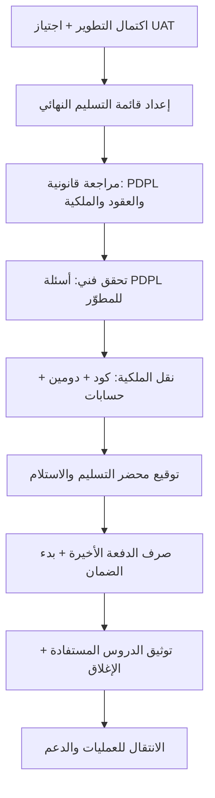

# 07 · التسليم والقانوني

> [!abstract] ماذا ستتعلّم هنا
> - كيف تُغلق المشروع رسميًّا وتنقل الملكية بلا "خيوط عالقة".
> - الفرق بين **الإغلاق (Closure)** الموجّه للراعي و**التسليم ([[Closure vs Handover|Handover]])** الموجّه للتشغيل.
> - كيف تحمي نفسك قانونيًّا في منصة صحية سعودية عبر نظام **PDPL** (نظام حماية البيانات الشخصية).
> - كيف تبني **قائمة تسليم**، **محضر استلام**، و**عقد معالجة بيانات (DPA)** يحميك.
> - لماذا "لا تدفع الدفعة الأخيرة" قبل اكتمال التسليم — وأداة الضغط الوحيدة المتبقية بيدك.
>
> 🔗 هذه المرحلة جزء من رحلة [[مدير المشاريع البرمجية الحديث]].

---

## 🧭 المفهوم ببساطة

تخيّل أنك اشتريت شقة على المخطط. اليوم موعد الاستلام. لن تكتفي بأن يقول لك المقاول "خلصت، تفضّل" — بل تدخل بقائمة تفتيش: هل الكهرباء تعمل؟ أين مفاتيح كل الأبواب؟ أين ضمان المصعد؟ وقبل أن توقّع "استلمت" وتدفع آخر دفعة، تتأكد أن كل شيء سليم. وبعد التوقيع تبدأ سنة الضمان.

**مرحلة التسليم والقانوني** هي هذا بالضبط، لكن لمنتج رقمي.

- **التسليم (Handover):** نقل المخرجات (الكود، الدومين، الحسابات، الوثائق) إلى مالكها الجديد بحيث يستطيع تشغيله وصيانته وحده.
- **الإغلاق (Closure):** إنهاء المشروع رسميًّا بقبول موثّق من الراعي، وتوثيق الدروس، وحلّ الالتزامات.
- **الجانب القانوني (Legal & Compliance):** التأكد من أن العقود والملكية الفكرية وحماية البيانات كلها مُحكمة — خاصة أن عافية منصة صحية تحمل بيانات حساسة تحت مظلة **PDPL** السعودي.

باختصار: هنا يتحوّل "شغل شغّال" إلى "منتج تملكه أنت وتحميك أنظمته".

---

## 🧩 قاموس سريع للمصطلحات

| المصطلح (عربي) | English | المعنى ببساطة |
|---|---|---|
| قائمة التسليم | Handover Checklist | قائمة تحقق بكل ما يجب أن تستلمه قبل الدفع |
| محضر التسليم والاستلام | Acceptance Certificate | ورقة موقّعة تُثبت أنك استلمت وقبلت |
| PDPL | [[PDPL|Personal Data Protection Law]] | نظام حماية البيانات الشخصية السعودي (إلزامي) |
| المتحكم | Controller | من يقرّر لماذا وكيف تُعالج البيانات (أنت/المنصة) |
| المعالج | Processor | من يعالج البيانات نيابةً عنك (المطوّر/الاستضافة) |
| عقد معالجة البيانات | DPA | عقد يُلزم المعالج بحماية بياناتك |
| سجل المعالجة | [[ROPA]] | سجل بكل أنشطة معالجة البيانات (يُحفظ 5 سنوات) |
| الملكية الفكرية | Intellectual Property | حقك في الكود المصدري والمخرجات (حقوق تأليف) |
| ملكية الدومين | Domain Ownership | أصل مسجَّل باسمك تعاقديًّا، وليس ملكية فكرية |

---

## ⛓️ لماذا تأتي هنا وتقود للتالية

**ما قبلها (المتطلبات):** لا تستطيع تسليم شيء لم يُختبر. هذه المرحلة تبني على ما سبقها:

- **الجودة والاختبار:** اجتياز [[UAT]] شرط للتسليم.
- **التنفيذ والتتبّع:** المخرجات جاهزة ومكتملة.
- **الحوكمة والعقود:** الـ [[SOW]] يحدّد ما يُسلَّم وجدول الدفعات.

**ما تحتاجه جاهزًا:** معايير قبول واضحة، عقد موقّع، ومخرجات مكتملة موثّقة.

**ما تقود إليه:** بعد التسليم يبدأ **الدعم والضمان** و**العمليات (Operations)** — تشغيل يومي مستقر. كما تُغذّي **التوثيق التقني** و**المالية** (صرف الدفعة الأخيرة يعتمد على اكتمال التسليم). التسليم السيّئ = فوضى تشغيلية وفواتير صيانة مفاجئة.

---

## 📊 مخطّط سير العمل

---

## 📂 مستندات هذه المرحلة — واحدًا واحدًا

📂 مستندات هذه المرحلة (في مستودع المشروع)

### 1) قائمة التسليم النهائي (Handover Checklist)

> [!info] ما هو ولماذا
> قائمة تحقق تجمع كل ما يجب أن تستلمه قبل صرف آخر دفعة: الكود، الدومين، الحسابات، الوثائق، والتحقق النهائي. هي درعك ضد "استلمت واجهة تعمل لكن لا أملك شيئًا فعليًّا".

- **📥 من أين تجمع معلوماته:** من العرض/العقد (بند "الملكية الكاملة")، من المطوّر (بيانات الوصول)، ومن نتائج UAT.
- **🛠️ كيف ترتّبه:** جدول checkboxes مقسّم لفئات (كود / دومين / حسابات / وثائق / تحقق / دعم)؛ لا يُشطب بند إلا بدليل.
- **🎯 فائدته:** يحوّل "الملكية" من كلام إلى بنود قابلة للتحقق، ويربط الدفع باكتمالها.

> [!example] من عافية
> نصّ العرض على "Complete ownership of source code and domain". القائمة تُفعّل ذلك عمليًّا: الكود على مستودع باسمكم بصلاحية Admin، نقل الدومين، بيانات السيرفر وقاعدة البيانات، وحسابات بوابات الدفع وZoom باسم شركتكم.

«01-قائمة-التسليم-النهائي»

### 2) ملاحظات قانونية وامتثال

> [!info] ما هو ولماذا
> ورقة تجمع النقاط القانونية الواجب مراجعتها مع مختص: العقد، الملكية الفكرية، حماية البيانات (PDPL)، التراخيص، والمدفوعات. ليست استشارة قانونية بل خارطة طريق للمراجعة.

- **📥 من أين تجمع معلوماته:** من العقد/العرض، من طبيعة النشاط (منصة صحية سعودية)، ومن متطلبات الجهات (سدايا، SAMA).
- **🛠️ كيف ترتّبه:** أقسام حسب المجال (عقد / بيانات / تراخيص / مدفوعات)، كل بند سؤال يُجاب عنه مع مختص.
- **🎯 فائدته:** يمنع المفاجآت القانونية بعد التسليم (نزاع ملكية، غرامة بيانات، ترخيص ناقص).

> [!example] من عافية
> القرار الاستراتيجي: **استبدال مرجع HIPAA بـ PDPL** لأنه الملزم فعليًّا في السعودية وميزة تنافسية عند التعاقد مع المستشفيات. وتنبيه حرج: المطوّر في الإمارات = نقل بيانات عبر الحدود، يُفضّل استضافة داخل السعودية.

«02-ملاحظات-قانونية-وامتثال»

### 3) مصفوفة مسؤوليات البيانات PDPL

> [!info] ما هو ولماذا
> جدول (ملف CSV) يوزّع مسؤولية كل نوع بيانات: من يجمعها، دوره حسب PDPL (متحكم/معالج)، من المسؤول عن دقتها وأمنها وإخطار سدايا. هي "خريطة المسؤولية" التي تحسم النزاعات قبل وقوعها.

- **📥 من أين تجمع معلوماته:** من دليل PDPL، من واقع تدفق البيانات، ومن أدوار الأطراف (منصة/بائع/مطوّر/استضافة).
- **🛠️ كيف ترتّبه:** صف لكل نوع بيانات (بيانات طبيب، مريض، دفع، حجوزات Zoom...) وأعمدة للأدوار والمسؤوليات.
- **🎯 فائدته:** يحدّد بدقة "من يُخطر سدايا" و"من يضمن الدقة" — أساس عقد الـ DPA.

> [!example] من عافية
> DR-07: تطوير الكود → المطوّر **معالج** يُخطر المنصة فورًا (لا يُخطر سدايا). DR-03: بيانات المريض → المنصة **متحكم** بضوابط مشددة. الملف: `03-مصفوفة-مسؤوليات-البيانات-PDPL.csv`.

### 4) دليل الامتثال PDPL

> [!info] ما هو ولماذا
> الدليل الكامل لتطبيق نظام حماية البيانات الشخصية السعودي: المتحكم مقابل المعالج، حقوق أصحاب البيانات، إخطار الخروقات (72 ساعة)، سجل المعالجة (ROPA)، ونقل البيانات عبر الحدود.

- **📥 من أين تجمع معلوماته:** من نظام PDPL ولائحته (هيئة سدايا)، ومن واقع المنصة.
- **🛠️ كيف ترتّبه:** أقسام: لماذا PDPL، المفهوم الجوهري، الالتزامات العملية (checklist)، الضوابط التقنية، الوثائق المطلوبة.
- **🎯 فائدته:** يجعل إجابتكم للمستشفيات "نعم، متوافقون، وإليكم الدليل" — تحوّل الامتثال لميزة تنافسية.

> [!example] من عافية
> غرامات PDPL تصل **5 ملايين ريال**. الدليل يوضح أن ادعاء "HIPAA Compliant" الغامض كان وعدًا تسويقيًّا، بينما PDPL هو الواقع الملزم منذ سبتمبر 2024.

«04-دليل-الامتثال-PDPL»

### 5) فقرة إخلاء المسؤولية واتفاقية الاستخدام

> [!info] ما هو ولماذا
> صياغة قانونية جاهزة لتوزيع مسؤولية البيانات بين المنصة والبائعين، مبنية على مفهوم "المتحكم/المعالج". تحمي المنصة من أخطاء بيانات مصدرها البائع.

- **📥 من أين تجمع معلوماته:** من دليل PDPL، ومصفوفة البيانات، ومراجعة مستشار قانوني.
- **🛠️ كيف ترتّبه:** تعريفات → توزيع المسؤولية → إخلاء المسؤولية → بنود إضافية (اختصاص قضائي، تحديث السياسات).
- **🎯 فائدته:** يضع مسؤولية دقة البيانات على البائع، والأمن التقني على المنصة، ويربط ذلك ببند تعويض (Indemnification).

> [!example] من عافية
> يقرّ البائع (مستشفى/شركة) بمسؤوليته الوحيدة عن دقة بيانات أطبائه ومنتجاته، ويعوّض المنصة عن أي غرامة سدايا تنشأ عن إخلاله. تُربط بآلية "الموافقة" عند التسجيل.

«05-فقرة-إخلاء-المسؤولية-اتفاقية-الاستخدام»

### 6) قائمة أسئلة PDPL للمطوّر

> [!info] ما هو ولماذا
> قائمة تحقق فني (Technical Due Diligence) تُرسل للمطوّر لتحويل ادعاء "متوافق" الغامض إلى **أدلة فنية قابلة للتحقق**: التشفير، ضبط الوصول، الإخطار، النسخ الاحتياطي، وموقع البيانات.

- **📥 من أين تجمع معلوماته:** من دليل PDPL، ومن أفضل ممارسات أمن التطبيقات.
- **🛠️ كيف ترتّبه:** جداول بالأسئلة + عمود الإجابة + عمود "الدليل المطلوب"؛ تُقيّم كل إجابة ✅/⚠️/❌.
- **🎯 فائدته:** أي "نعم" بلا دليل = علامة استفهام؛ يكشف الفجوات قبل الدفع والتسليم.

> [!example] من عافية
> القسم 7 (موقع البيانات) هو الأحرج: "أين تُستضاف السيرفرات؟ هل يصل فريق الإمارات لبيانات الإنتاج؟" — إجاباته تحدّد قرار الاستضافة داخل السعودية.

«06-قائمة-أسئلة-PDPL-للمطوّر»

### 7) سياسة الخصوصية للمنصة

> [!info] ما هو ولماذا
> مسودة سياسة خصوصية جاهزة للنشر ومتوافقة مع PDPL: ما البيانات التي تُجمع، لماذا، كيف تُحمى، وحقوق المستخدم. وثيقة عامة تُعرض على كل مستخدم.

- **📥 من أين تجمع معلوماته:** من أنواع البيانات الفعلية، ومن متطلبات PDPL، ومراجعة قانونية.
- **🛠️ كيف ترتّبه:** أقسام مرقّمة (البيانات، أسس المعالجة، المشاركة، الحقوق، الأمن، الاحتفاظ، الكوكيز، التواصل).
- **🎯 فائدته:** يحقّق شرط الشفافية في PDPL، ويبني ثقة المستخدم.

> [!example] من عافية
> تنص على الرد على طلبات أصحاب البيانات خلال 30 يومًا، وإخطار سدايا خلال 72 ساعة عند الخرق، وعدم بيع البيانات لأي طرف. تُربط بآلية الموافقة عند التسجيل.

«07-سياسة-الخصوصية-للمنصة»

### 8) شروط الاستخدام للمنصة

> [!info] ما هو ولماذا
> مسودة شروط استخدام (Terms of Service) تنظّم العلاقة بين المنصة والمستخدمين والبائعين، وتوضح دور المنصة كـ"وسيط تقني" لا كطرف في الخدمات الطبية.

- **📥 من أين تجمع معلوماته:** من نموذج العمل، وفقرات إخلاء المسؤولية، ومراجعة قانونية.
- **🛠️ كيف ترتّبه:** مقدمة وقبول → تعريفات → طبيعة المنصة → التزامات المستخدم → المحتوى → إخلاء المسؤولية → القانون الحاكم.
- **🎯 فائدته:** يحدّ من مسؤولية المنصة عن أفعال البائعين، ويضع قواعد اللعبة قبل النزاع.

> [!example] من عافية
> تؤكد أن عافية وسيط تقني لا يضمن جودة الخدمات الطبية للبائعين، وأن أي تعامل بين المستخدم والبائع على مسؤوليتهما.

«08-شروط-الاستخدام-للمنصة»

### 9) حقوق المخرجات المصدرية ومراجعة الكود

> [!info] ما هو ولماذا
> ورقة تجيب: هل يحق لي المطالبة بكل المخرجات (Schema، الكود على Git)؟ هل ألزمهم بمعايير عمل؟ وهل أعيّن مبرمجًا مستقلًا لمراجعة الكود؟ — جوهر حماية الملكية الفكرية.

- **📥 من أين تجمع معلوماته:** من العرض/العقد، ومن تحليل مخاطر جودة الكود.
- **🛠️ كيف ترتّبه:** أسئلة رئيسية → جداول المخرجات الواجبة → معايير هندسية مشترطة → خيارات المراجعة التقنية.
- **🎯 فائدته:** يمنع "كابوس الصيانة المكلفة" ويضمن استلام كود مصدري نظيف غير مشفّر.

> [!example] من عافية
> التوصية: عيّن **مستشارًا تقنيًا مستقلًا (Tech Advisor)** يراجع الكود على Git دوريًّا ويعتمد المخرجات قبل كل دفعة — "ليس مصروفًا بل تأمين". واشترط رفع الكود على Git من البداية لا دفعة واحدة في النهاية.

«09-حقوق-المخرجات-المصدرية-ومراجعة-الكود»

> [!tip] ملفات إضافية بالمجلد
> `03-مصفوفة-مسؤوليات-البيانات-PDPL.csv` (سجل قابل للفرز لتوزيع مسؤولية كل نوع بيانات).

---

## ⏱️ إدارة وقت هذه المهمة

| حجم المشروع | المدة التقريبية (دوليًّا) |
|---|---|
| صغير | ساعات إلى أيام (قائمة تسليم + محضر بسيط) |
| متوسط | أيام إلى أسبوعين (مراجعة قانونية + DPA + نقل ملكية) |
| كبير | أسابيع إلى أشهر (تدقيق امتثال، DPIA، تراخيص قطاعية) |

**من يُنتج المستند وكيف يتعاونون:** غالبًا 3–5 أطراف. **مدير المشروع** ينسّق ويصيغ قائمة التسليم والمحضر. **المستشار القانوني** يراجع العقود وPDPL. **المطوّر (المعالج)** يجيب على أسئلة التحقق الفني وينقل الملكية. **المستشار التقني** يراجع الكود ويعتمد المخرجات. **الراعي/العميل** يوقّع القبول. التعاون تسلسلي: تحقق فني → مراجعة قانونية → نقل ملكية → توقيع.

**أي ملفات تراجع:** قائمة التسليم النهائي، مصفوفة البيانات، وأسئلة PDPL — راجعها قبل أي توقيع أو دفع.

| نوع المستند | الصيغة المناسبة |
|---|---|
| السجلات (مصفوفة البيانات، ROPA، الدروس المستفادة) | Excel / CSV |
| الأدلة والقوائم (دليل PDPL، قائمة التسليم) | Word / Markdown |
| الوثائق الرسمية (المحضر، DPA، سياسة الخصوصية، الشروط) | PDF موقّع |

> [!warning] الدقة قبل السرعة
> خطأ قانوني أو بند ملكية ناقص قد يكلّف غرامة أو نزاعًا يفوق عمر المشروع كله. راجعْ، وثّق، ثم وقّع.

---

## 🌐 ما تقوله المعايير الحديثة

> [!quote] خلاصة بحث 2026
> - **الفرق الجوهري:** الإغلاق (Closure) موجّه للراعي وعن السلطة، بينما التسليم (Handover) موجّه لفريق التشغيل وعن الاستمرارية.
> - **أبرز عوامل النجاح:** إشراك فريق التشغيل مبكرًا، ووقت كافٍ لنقل المعرفة، وتقييم واقعي للجاهزية قبل التسليم.
> - **حزمة التسليم (Handover Pack):** تضم إجراءات التشغيل (SOPs/Runbooks)، وجهات الاتصال، وقائمة المشكلات المعروفة.
> - **تحذير لافت:** كثير من فوائد المشاريع لا تتحقق كاملةً بسبب سوء التخطيط للانتقال وضعف نقل المعرفة.
> - **من جانب الامتثال:** أصبح PDPL السعودي ملزمًا بالكامل، ويجعل عقد معالجة البيانات (DPA) وإخطار الخروقات خلال 72 ساعة متطلبات لا خيارات.

هذا يتقاطع مع [[مدير المشاريع البرمجية الحديث|مثلث كفاءات PMI]]: مهارات فنية (تحقق تقني وأمني)، قيادية (إدارة أصحاب المصلحة وقت التوقيع)، وإدارة أعمال إستراتيجية (تحويل الامتثال لميزة تنافسية).

---

## ➕ لإكمال الصورة — تحسينات مقترحة

> [!todo] ما ينقص مقابل المعايير وكيف تكمله
> - **محضر تسليم واستلام رسمي:** القائمة موجودة لكن لا يوجد قالب محضر موقّع يحسم القبول وبدء الضمان → أنشئ [[محضر التسليم والاستلام (Handover Acceptance Certificate)]].
> - **عقد معالجة بيانات (DPA):** مذكور مرارًا كمطلوب لكن بلا قالب تفصيلي → أنشئ [[عقد معالجة البيانات (DPA)]].
> - **سجل الدروس المستفادة:** الإغلاق ناقص بلا توثيق للدروس يمنع تكرار الأخطاء → أنشئ [[سجل الدروس المستفادة (Lessons Learned Register)]].
> - **حزمة التسليم للتشغيل (Handover Pack / Runbooks):** أضف إجراءات تشغيل وقائمة مشكلات معروفة لتغذية مرحلة العمليات.
> - **إدارة المخاطر المتبقية:** وثّق المخاطر المفتوحة عند التسليم بدل إغلاقها فجأة → راجع [[19 - Risk Management]].
> - **تواصل أصحاب المصلحة عند الإغلاق:** خطة إعلان الإغلاق وتسليم المسؤوليات → راجع [[21 - Stakeholder Communication]].
> - **معايير القبول والجودة:** اربط التسليم بمعايير قبول موثّقة → راجع [[20 - Quality Management]].

---

## 🎬 سيناريوهان

> [!success] القصة الصحيحة
> **مها**، مديرة مشروع عافية، رفضت صرف الدفعة الأخيرة قبل اكتمال قائمة التسليم. أرسلت أسئلة PDPL التقنية للمطوّر وطلبت أدلة لا ادعاءات، فاكتشفت أن الاستضافة خارج السعودية. أصرّت على النقل داخل المملكة وعقد DPA يُلزم المطوّر بالإخطار الفوري. وقّعت محضر استلام صنّف كل مخرَج وحدّد بدء الضمان. النتيجة: منصة مملوكة بالكامل، متوافقة مع PDPL، وأصبحت "[[Alignment|التوافق]]" ورقة بيع أمام المستشفيات.

> [!failure] القصة الخاطئة
> **فهد**، مدير مشروع منصة منافسة، صرف الدفعة الأخيرة فرحًا بأن "الموقع يعمل". لم يطلب الكود على Git باسمه، ووثق بادعاء "HIPAA Compliant" دون دليل. بعد شهرين طلب تعديلًا بسيطًا فاكتشف أن الكود مشفّر ومرهون لدى المطوّر، والدومين باسمهم. ثم وقع تسريب بيانات ولم يكن هناك DPA يحدّد من يُخطر سدايا — فتحمّل هو المسؤولية والغرامة. النتيجة: نظام لا يملكه ونزاع قانوني مكلف.

---

## 🧩 قرارات تفاعلية (فكّر ثم افتح)

> [!question]- الموقف: المطوّر جاهز للتسليم لكنه يرفض رفع الكود على Git باسمك ويقول "سأعطيك ملفًا مضغوطًا في النهاية". أمامك: (أ) تقبل الملف المضغوط لتسريع التسليم · (ب) تصرّ على مستودع Git باسمك بصلاحية Admin الآن · (ج) تؤجل القرار للدفعة الأخيرة
> ✅ **الأفضل: (ب).**
> **لماذا؟** الملف المضغوط في النهاية قد يكون كودًا مشفّرًا أو ناقصًا لا تكتشف مشكلته إلا متأخرًا. الوصول لـ Git من الآن يتيح مراقبة التقدّم الحقيقي ويثبت الملكية.
> **السيناريو المثالي:** تشترط في العقد رفعًا دوريًّا على مستودع باسمك بصلاحية Admin، ويراجعه مستشارك التقني أولًا بأول.

> [!question]- الموقف: منصة صحية سعودية، والمطوّر في الإمارات والاستضافة في أوروبا. أمامك: (أ) تكمل كما هي فالنظام يعمل · (ب) تنقل الاستضافة داخل السعودية وتوقّع DPA · (ج) تكتفي بسياسة خصوصية جميلة على الموقع
> ✅ **الأفضل: (ب).**
> **لماذا؟** بيانات صحية سعودية + استضافة ووصول خارج المملكة = نقل بيانات عبر الحدود مقيّد بـ PDPL، وقد يعرّضك لغرامة تصل 5 ملايين ريال. سياسة الخصوصية وحدها لا تحمي إن كان الأساس التقني مخالفًا.
> **السيناريو المثالي:** استضافة داخل السعودية، عقد DPA يحدّد المعالج والمعالج الفرعي وآلية الإخطار، وتقييم أثر (DPIA) للمعالجة الحساسة.

---

## 🧠 أسئلة تفكير ناقد وعصف ذهني (بلا إجابة واحدة)

> [!question] للنقاش
> - متى يكون الإصرار على "الملكية الكاملة" مكلفًا أكثر من نفعه، ومتى يكون شرطًا لا تنازل عنه؟
> - كيف توازن بين سرعة إغلاق المشروع وبين الدقة القانونية في منصة تحمل بيانات حساسة؟
> - هل تحويل الامتثال (PDPL) إلى "ميزة تسويقية" أخلاقي دائمًا، أم قد يخلق توقعات يصعب الوفاء بها؟
> - من يتحمّل مسؤولية خرق بيانات مصدره خطأ بائع (مستشفى) أدخل بيانات دون موافقة — المنصة أم البائع؟

> [!tip] إطار الإجابة (4 خطوات)
> 1. **حدّد الأطراف والأدوار:** من المتحكم ومن المعالج ومن البائع؟ الأدوار تحسم المسؤولية.
> 2. **قِس المخاطر مقابل الكلفة:** احتمال × أثر (غرامة/نزاع/فقد ملكية) مقابل كلفة الإجراء الوقائي.
> 3. **ارجع للمرجع الملزم:** PDPL والعقد وSOW — لا الرأي الشخصي.
> 4. **اختر ووثّق:** قرار مكتوب بمبرّر وأثر، مع مالك ومهلة.
> **مثال اتجاه:** لخرق مصدره بائع → المسؤولية توزّعها مصفوفة البيانات وفقرة الإخلاء: البائع مسؤول عن دقة/قانونية بياناته ويعوّض المنصة، بينما المنصة مسؤولة عن الأمن التقني والإخطار.

---

## ❓ نقاط للمراجعة (استرجاع)

> [!question]- ما الفرق بين الإغلاق (Closure) والتسليم (Handover)؟
> الإغلاق موجّه للراعي وعن إنهاء المشروع رسميًّا بقبول موثّق. التسليم موجّه لفريق التشغيل وعن استمرارية تشغيل المنتج بعد المشروع.

> [!question]- من يُخطر سدايا عند خرق البيانات، وخلال كم؟
> **المتحكم** (المنصة) يُخطر سدايا خلال **72 ساعة**. المعالج (المطوّر) يُخطر المتحكم فورًا فقط.

> [!question]- لماذا لا تُصرف الدفعة الأخيرة قبل اكتمال قائمة التسليم؟
> لأن حجب الدفعة هو أداة الضغط الوحيدة المتبقية لضمان نقل الملكية كاملة (كود، دومين، حسابات) وإغلاق كل الملاحظات.

> [!question]- لماذا استُبدل مرجع HIPAA بـ PDPL في عافية؟
> لأن PDPL ملزم قانونيًّا في السعودية (غرامات حتى 5 ملايين ريال) وتسأل عنه المستشفيات، بينما HIPAA أمريكي غير ملزم كان مجرد وعد تسويقي غير قابل للتحقق.

> [!question]- ما "المتحكم" و"المعالج" في PDPL؟
> المتحكم من يقرّر لماذا وكيف تُعالج البيانات (المنصة). المعالج من يعالجها نيابةً عنه (المطوّر، الاستضافة). التقسيم أساس توزيع المسؤولية وعقد الـ DPA.

> [!question]- لماذا يُنصح بتعيين مستشار تقني مستقل لمراجعة الكود؟
> لأنك لا تستطيع الحكم على جودة الكود الداخلية بنفسك، والاعتماد على كلمة المنفّذ تضارب مصالح. اكتشاف المشاكل الآن أرخص من فاتورة صيانة لاحقة — "تأمين لا مصروف".

---

## 💼 من أسئلة المقابلات

> [!question]- كيف تضمن تسليمًا سلسًا للمشروع إلى فريق التشغيل؟
> أبدأ نقل المعرفة مبكرًا لا في اللحظة الأخيرة، وأبني حزمة تسليم (إجراءات تشغيل، جهات اتصال، قائمة مشكلات معروفة)، وأقيّم جاهزية الفريق واقعيًّا، ثم أوثّق القبول بمحضر موقّع قبل الانتقال.

> [!question]- ما الخطوات التي تتبعها لإغلاق مشروع رسميًّا؟
> التحقق من تحقّق الأهداف مقابل المتوقع، إغلاق العقود والدفعات، الحصول على قبول موثّق من الراعي، عقد جلسة دروس مستفادة وتحديث أصول المؤسسة، وأرشفة الوثائق.

> [!question]- كيف تتعامل مع مورّد يدّعي التوافق مع معيار حماية بيانات دون دليل؟
> أحوّل الادعاء إلى تحقّق فني (Due Diligence): قائمة أسئلة تطلب "نعم/لا + دليل"، وأصنّف كل بند (مطبّق بدليل / جزئي / غير مطبّق)، وأوثّق الالتزامات في عقد DPA، ولا أعتمد أي "نعم" بلا دليل.

> [!question]- ماذا تفعل لو رفض العميل التوقيع على محضر الاستلام رغم اجتياز كل المعايير؟
> أرجع لمعايير القبول في العقد وأدلة UAT، وأميّز بين عيب حقيقي يُصلَح وطلب جديد يُدار كـ [[Change Request]] منفصل، فلا أدع طلبًا [[Out of Scope|خارج النطاق]] يعطّل التوقيع وبدء الضمان.

> [!tip] إطار STAR
> رتّب إجابتك: **Situation** (الموقف) · **Task** (مهمتك) · **Action** (ما فعلته) · **Result** (النتيجة). يجعل جوابك ملموسًا ومقنعًا.

---

## 🧪 من مبتدئ إلى محترف

> [!success] مسار التدرّج
> - **مبتدئ:** تعرف أن التسليم يحتاج قائمة تحقق، وتفهم أن هناك جانبًا قانونيًّا. تملأ قائمة التسليم وتتأكد من نقل الكود والدومين.
> - **متوسّط:** تربط الدفع بالتسليم، تُجري تحققًا فنيًّا (أسئلة PDPL)، تصيغ محضر استلام، وتفرّق بين المتحكم والمعالج. تدير الملاحظات ([[Snag List]]) وبدء الضمان.
> - **محترف:** تصمّم منظومة امتثال متكاملة (DPA، ROPA، DPIA)، تحوّل الامتثال لميزة تنافسية، تدير نقل المعرفة وحزمة التسليم للتشغيل، وتوثّق الدروس المستفادة كأصل مؤسسي. تتفاوض على بنود الملكية والاختصاص القضائي عبر الحدود بثقة.

---

## 🔗 ربط بالمفاهيم

- [[19 - Risk Management]]
- [[20 - Quality Management]]
- [[21 - Stakeholder Communication]]
- [[10 - Sprint Retrospective]]
- [[مدير المشاريع البرمجية الحديث]]

---

## 📌 بطاقة مرجعية سريعة

| العنصر | الخلاصة |
|---|---|
| الهدف | نقل ملكية كاملة + إغلاق رسمي + حماية قانونية |
| القاعدة الذهبية | لا دفعة أخيرة قبل اكتمال قائمة التسليم |
| المرجع الملزم | PDPL السعودي (غرامات حتى 5 ملايين ريال) |
| الأدوار | متحكم (المنصة) · معالج (المطوّر/الاستضافة) |
| المهل الحرجة | خرق: 72 ساعة لسدايا · طلبات: 30 يومًا · ROPA: 5 سنوات |
| المخرج الحاسم | محضر تسليم موقّع يبدأ الضمان |

> [!tip] قواعد ذهبية
> 1. **الملكية بالدليل لا بالوعد** — كود على Git باسمك، ودومين باسمك، وأدلة فنية لا ادعاءات.
> 2. **الامتثال حماية وميزة** — PDPL يحميك من الغرامة ويفتح لك أبواب التعاقد.
> 3. **وقّع ثم ادفع، لا العكس** — المحضر الموقّع هو خط النهاية، والدفعة الأخيرة أداة ضغطك.

---

> [!quote] مصادر
> - نظام حماية البيانات الشخصية (PDPL) ولائحته التنفيذية — الهيئة السعودية للبيانات والذكاء الاصطناعي (سدايا): المصدر الرسمي لأرقام الامتثال (إخطار الخرق خلال 72 ساعة، الرد على الطلبات خلال 30 يومًا، الاحتفاظ بسجل المعالجة، والغرامات). راجع النص الرسمي للتحقق من الأرقام السارية.
> - [Project Handover & Transition: Best Practice Guide — plprojects.co.uk](https://plprojects.co.uk/project-handover-transition-best-practices/)
> - [What is a project handover? Steps, checklist, best practices — Plane](https://plane.so/blog/what-is-a-project-handover-steps-checklist-and-best-practices)
> - [How to ensure smooth project closure and handover — PRINCE2](https://www.prince2.com/usa/blog/project-closure-and-handover)
> - [20 Questions to Ask When Closing a Project — People First PM](https://peoplefirstprojectmanagement.com/20-questions-to-ask-when-closing-a-project/)
