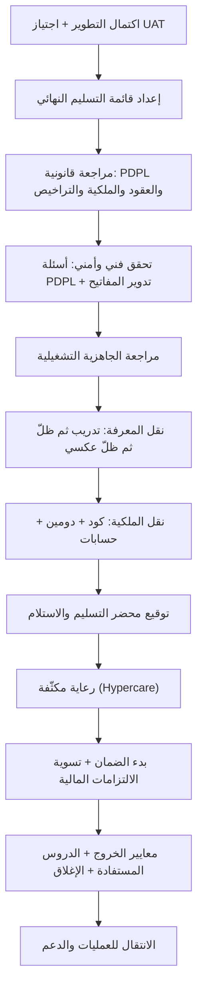

# 07 · التسليم والقانوني

> [!abstract] ماذا ستتعلّم هنا
> - كيف تُغلق المشروع رسميًّا وتنقل الملكية بلا "خيوط عالقة".
> - الفرق بين **الإغلاق (Closure)** الموجّه للراعي و**التسليم ([[Closure vs Handover|Handover]])** الموجّه للتشغيل.
> - **التسليم الحقيقي** أوسع من نقل الكود: نقل المعرفة، والجاهزية التشغيلية، والانتقال إلى التشغيل، والرعاية المكثّفة (Hypercare)، والتسليم الأمني، واستمرارية الأعمال.
> - الفرق الذي يقع فيه كثير من المديرين: **الضمان (Warranty) مقابل الدعم (Support)** — ومعهما Hypercare.
> - **معايير الخروج (Exit Criteria)**: بأي شروط يُعدّ المشروع منتهيًا فعلًا؟ و**الإغلاق المالي** الذي يُنسى دائمًا.
> - كيف تحمي نفسك قانونيًّا في منصة صحية سعودية عبر نظام **PDPL** (نظام حماية البيانات الشخصية)، وكيف تراجع **تراخيص المصادر المفتوحة**.
> - كيف تبني **قائمة تسليم**، **محضر استلام**، و**عقد معالجة بيانات (DPA)** يحميك.
> - لماذا **لا تُغلق الالتزامات المالية النهائية** قبل تحقّق شروط التسليم والقبول المنصوص عليها في العقد.
>
> 🔗 هذه المرحلة جزء من رحلة [[مدير المشاريع البرمجية الحديث]].

---

## 🧭 المفهوم ببساطة

تخيّل أنك اشتريت شقة على المخطط. اليوم موعد الاستلام. لن تكتفي بأن يقول لك المقاول "خلصت، تفضّل" — بل تدخل بقائمة تفتيش: هل الكهرباء تعمل؟ أين مفاتيح كل الأبواب؟ أين ضمان المصعد؟ وقبل أن توقّع "استلمت" وتدفع آخر دفعة، تتأكد أن كل شيء سليم. وبعد التوقيع تبدأ سنة الضمان.

**مرحلة التسليم والقانوني** هي هذا بالضبط، لكن لمنتج رقمي.

- **التسليم (Handover):** نقل المخرجات (الكود، الدومين، الحسابات، الوثائق) إلى مالكها الجديد بحيث يستطيع تشغيله وصيانته وحده.
- **الإغلاق (Closure):** إنهاء المشروع رسميًّا بقبول موثّق من الراعي، وتوثيق الدروس، وحلّ الالتزامات.
- **الجانب القانوني (Legal & Compliance):** التأكد من أن العقود والملكية الفكرية وحماية البيانات كلها مُحكمة — خاصة أن عافية منصة صحية تحمل بيانات حساسة تحت مظلة **PDPL** السعودي.

باختصار: هنا يتحوّل "شغل شغّال" إلى "منتج تملكه أنت وتحميك أنظمته".

> [!warning] وأشيع سوء فهم لهذه المرحلة
> أن يُظنّ التسليم **حدثًا** يقع يوم التوقيع، وهو في الحقيقة **مرحلة** لها ما قبلها وما بعدها. فالتوقيع ينقل الورق، ولا ينقل **القدرة على التشغيل** — وهذه لا تنتقل إلا بنقل معرفة وجاهزية تشغيلية وفترة إسناد. ومن سلّم كودًا ووثائق ثم انصرف، سلّم أصلًا لا يعرف مالكه كيف يشغّله.

---

## 🧩 قاموس سريع للمصطلحات

| المصطلح (عربي) | English | المعنى ببساطة |
|---|---|---|
| قائمة التسليم | Handover Checklist | قائمة تحقق بكل ما يجب أن تستلمه قبل الدفع |
| محضر التسليم والاستلام | Acceptance Certificate | ورقة موقّعة تُثبت أنك استلمت وقبلت |
| معايير الخروج | Exit Criteria | الشروط التي بتحقّقها يُعدّ المشروع منتهيًا |
| نقل المعرفة | Knowledge Transfer | نقل القدرة على التشغيل لا الملفّات وحدها |
| الجاهزية التشغيلية | Operational Readiness | هل التشغيل جاهز؟ (مراقبة · نسخ · مناوبة · تصعيد) |
| الانتقال إلى التشغيل | Service Transition | انتقال المسؤولية من فريق المشروع إلى فريق التشغيل |
| الرعاية المكثّفة | Hypercare | أسابيع استنفار بعد الإطلاق، بين المشروع والتشغيل |
| الضمان | Warranty | إصلاح **عيوب** ما سُلِّم، مدّةً محدّدة، بلا مقابل |
| الدعم | Support | تشغيل ومساعدة و**طلبات جديدة**، بعقد ومقابل |
| المبلغ المحتجَز | Retention | نسبة من العقد تُحبس ضمانًا وتُفرج بشروط |
| دليل التشغيل | Runbook | خطوات تشغيل الحالات المتكرّرة خطوةً خطوة |
| المناوبة | On-call | من يُتّصل به خارج الدوام عند العطل |
| زمن التعافي المستهدف | RTO | أقصى انقطاع مقبول قبل عودة الخدمة |
| نقطة التعافي المستهدفة | RPO | أقصى قدر بيانات يُقبل فقدُه |
| قائمة مكوّنات البرمجية | SBOM | جرد كل مكتبة مستعمَلة وترخيصها |
| PDPL | [[PDPL\|Personal Data Protection Law]] | نظام حماية البيانات الشخصية السعودي (إلزامي) |
| المتحكم | Controller | من يقرّر لماذا وكيف تُعالج البيانات (أنت/المنصة) |
| المعالج | Processor | من يعالج البيانات نيابةً عنك (المطوّر/الاستضافة) |
| عقد معالجة البيانات | DPA | عقد يُلزم المعالج بحماية بياناتك |
| سجل المعالجة | [[ROPA]] | سجل بكل أنشطة معالجة البيانات (يُحفظ 5 سنوات) |
| الملكية الفكرية | Intellectual Property | حقك في الكود المصدري والمخرجات (حقوق تأليف) |
| ملكية الدومين | Domain Ownership | أصل مسجَّل باسمك تعاقديًّا، وليس ملكية فكرية |

---

## ⛓️ لماذا تأتي هنا وتقود للتالية

**ما قبلها (المتطلبات):** لا تستطيع تسليم شيء لم يُختبر. هذه المرحلة تبني على ما سبقها:

- **الجودة والاختبار:** اجتياز [[UAT]] شرط للتسليم.
- **التنفيذ والتتبّع:** المخرجات جاهزة ومكتملة.
- **الحوكمة والعقود:** الـ [[SOW]] يحدّد ما يُسلَّم وجدول الدفعات.

**ما تحتاجه جاهزًا:** معايير قبول واضحة، عقد موقّع، ومخرجات مكتملة موثّقة.

**ما تقود إليه:** بعد التسليم يبدأ **الدعم والضمان** و**العمليات (Operations)** — تشغيل يومي مستقر. كما تُغذّي **التوثيق التقني** و**المالية** (صرف الدفعة الأخيرة يعتمد على اكتمال التسليم). التسليم السيّئ = فوضى تشغيلية وفواتير صيانة مفاجئة.

---

## 📊 مخطّط سير العمل

---

## 📂 مستندات هذه المرحلة — واحدًا واحدًا

📂 مستندات هذه المرحلة (في مستودع المشروع)

### 1) قائمة التسليم النهائي (Handover Checklist)

> [!info] ما هو ولماذا
> قائمة تحقق تجمع كل ما يجب أن تستلمه قبل صرف آخر دفعة: الكود، الدومين، الحسابات، الوثائق، والتحقق النهائي. هي درعك ضد "استلمت واجهة تعمل لكن لا أملك شيئًا فعليًّا".

- **📥 من أين تجمع معلوماته:** من العرض/العقد (بند "الملكية الكاملة")، من المطوّر (بيانات الوصول)، ومن نتائج UAT.
- **🛠️ كيف ترتّبه:** جدول checkboxes مقسّم لفئات (كود / دومين / حسابات / وثائق / تحقق / دعم)؛ لا يُشطب بند إلا بدليل.
- **🎯 فائدته:** يحوّل "الملكية" من كلام إلى بنود قابلة للتحقق، ويربط الدفع باكتمالها.

> [!example] من عافية
> نصّ العرض على "Complete ownership of source code and domain". القائمة تُفعّل ذلك عمليًّا: الكود على مستودع باسمكم بصلاحية Admin، نقل الدومين، بيانات السيرفر وقاعدة البيانات، وحسابات بوابات الدفع وZoom باسم شركتكم.

«01-قائمة-التسليم-النهائي»

### 2) ملاحظات قانونية وامتثال

> [!info] ما هو ولماذا
> ورقة تجمع النقاط القانونية الواجب مراجعتها مع مختص: العقد، الملكية الفكرية، حماية البيانات (PDPL)، التراخيص، والمدفوعات. ليست استشارة قانونية بل خارطة طريق للمراجعة.

- **📥 من أين تجمع معلوماته:** من العقد/العرض، من طبيعة النشاط (منصة صحية سعودية)، ومن متطلبات الجهات (سدايا، SAMA).
- **🛠️ كيف ترتّبه:** أقسام حسب المجال (عقد / بيانات / تراخيص / مدفوعات)، كل بند سؤال يُجاب عنه مع مختص.
- **🎯 فائدته:** يمنع المفاجآت القانونية بعد التسليم (نزاع ملكية، غرامة بيانات، ترخيص ناقص).

> [!example] من عافية
> القرار الاستراتيجي: **استبدال مرجع HIPAA بـ PDPL** لأنه الملزم فعليًّا في السعودية وميزة تنافسية عند التعاقد مع المستشفيات. وتنبيه حرج: المطوّر في الإمارات = نقل بيانات عبر الحدود، يُفضّل استضافة داخل السعودية.

«02-ملاحظات-قانونية-وامتثال»

### 3) مصفوفة مسؤوليات البيانات PDPL

> [!info] ما هو ولماذا
> جدول (ملف CSV) يوزّع مسؤولية كل نوع بيانات: من يجمعها، دوره حسب PDPL (متحكم/معالج)، من المسؤول عن دقتها وأمنها وإخطار سدايا. هي "خريطة المسؤولية" التي تحسم النزاعات قبل وقوعها.

- **📥 من أين تجمع معلوماته:** من دليل PDPL، من واقع تدفق البيانات، ومن أدوار الأطراف (منصة/بائع/مطوّر/استضافة).
- **🛠️ كيف ترتّبه:** صف لكل نوع بيانات (بيانات طبيب، مريض، دفع، حجوزات Zoom...) وأعمدة للأدوار والمسؤوليات.
- **🎯 فائدته:** يحدّد بدقة "من يُخطر سدايا" و"من يضمن الدقة" — أساس عقد الـ DPA.

> [!example] من عافية
> DR-07: تطوير الكود → المطوّر **معالج** يُخطر المنصة فورًا (لا يُخطر سدايا). DR-03: بيانات المريض → المنصة **متحكم** بضوابط مشددة. الملف: `03-مصفوفة-مسؤوليات-البيانات-PDPL.csv`.

### 4) دليل الامتثال PDPL

> [!info] ما هو ولماذا
> الدليل الكامل لتطبيق نظام حماية البيانات الشخصية السعودي: المتحكم مقابل المعالج، حقوق أصحاب البيانات، إخطار الخروقات (72 ساعة)، سجل المعالجة (ROPA)، ونقل البيانات عبر الحدود.

- **📥 من أين تجمع معلوماته:** من نظام PDPL ولائحته (هيئة سدايا)، ومن واقع المنصة.
- **🛠️ كيف ترتّبه:** أقسام: لماذا PDPL، المفهوم الجوهري، الالتزامات العملية (checklist)، الضوابط التقنية، الوثائق المطلوبة.
- **🎯 فائدته:** يجعل إجابتكم للمستشفيات "نعم، متوافقون، وإليكم الدليل" — تحوّل الامتثال لميزة تنافسية.

> [!example] من عافية
> غرامات PDPL تصل **5 ملايين ريال**. الدليل يوضح أن ادعاء "HIPAA Compliant" الغامض كان وعدًا تسويقيًّا، بينما PDPL هو الواقع الملزم منذ سبتمبر 2024.

«04-دليل-الامتثال-PDPL»

### 5) فقرة إخلاء المسؤولية واتفاقية الاستخدام

> [!info] ما هو ولماذا
> صياغة قانونية جاهزة لتوزيع مسؤولية البيانات بين المنصة والبائعين، مبنية على مفهوم "المتحكم/المعالج". تحمي المنصة من أخطاء بيانات مصدرها البائع.

- **📥 من أين تجمع معلوماته:** من دليل PDPL، ومصفوفة البيانات، ومراجعة مستشار قانوني.
- **🛠️ كيف ترتّبه:** تعريفات → توزيع المسؤولية → إخلاء المسؤولية → بنود إضافية (اختصاص قضائي، تحديث السياسات).
- **🎯 فائدته:** يضع مسؤولية دقة البيانات على البائع، والأمن التقني على المنصة، ويربط ذلك ببند تعويض (Indemnification).

> [!example] من عافية
> يقرّ البائع (مستشفى/شركة) بمسؤوليته الوحيدة عن دقة بيانات أطبائه ومنتجاته، ويعوّض المنصة عن أي غرامة سدايا تنشأ عن إخلاله. تُربط بآلية "الموافقة" عند التسجيل.

«05-فقرة-إخلاء-المسؤولية-اتفاقية-الاستخدام»

### 6) قائمة أسئلة PDPL للمطوّر

> [!info] ما هو ولماذا
> قائمة تحقق فني (Technical Due Diligence) تُرسل للمطوّر لتحويل ادعاء "متوافق" الغامض إلى **أدلة فنية قابلة للتحقق**: التشفير، ضبط الوصول، الإخطار، النسخ الاحتياطي، وموقع البيانات.

- **📥 من أين تجمع معلوماته:** من دليل PDPL، ومن أفضل ممارسات أمن التطبيقات.
- **🛠️ كيف ترتّبه:** جداول بالأسئلة + عمود الإجابة + عمود "الدليل المطلوب"؛ تُقيّم كل إجابة ✅/⚠️/❌.
- **🎯 فائدته:** أي "نعم" بلا دليل = علامة استفهام؛ يكشف الفجوات قبل الدفع والتسليم.

> [!example] من عافية
> القسم 7 (موقع البيانات) هو الأحرج: "أين تُستضاف السيرفرات؟ هل يصل فريق الإمارات لبيانات الإنتاج؟" — إجاباته تحدّد قرار الاستضافة داخل السعودية.

«06-قائمة-أسئلة-PDPL-للمطوّر»

### 7) سياسة الخصوصية للمنصة

> [!info] ما هو ولماذا
> مسودة سياسة خصوصية جاهزة للنشر ومتوافقة مع PDPL: ما البيانات التي تُجمع، لماذا، كيف تُحمى، وحقوق المستخدم. وثيقة عامة تُعرض على كل مستخدم.

- **📥 من أين تجمع معلوماته:** من أنواع البيانات الفعلية، ومن متطلبات PDPL، ومراجعة قانونية.
- **🛠️ كيف ترتّبه:** أقسام مرقّمة (البيانات، أسس المعالجة، المشاركة، الحقوق، الأمن، الاحتفاظ، الكوكيز، التواصل).
- **🎯 فائدته:** يحقّق شرط الشفافية في PDPL، ويبني ثقة المستخدم.

> [!example] من عافية
> تنص على الرد على طلبات أصحاب البيانات خلال 30 يومًا، وإخطار سدايا خلال 72 ساعة عند الخرق، وعدم بيع البيانات لأي طرف. تُربط بآلية الموافقة عند التسجيل.

«07-سياسة-الخصوصية-للمنصة»

### 8) شروط الاستخدام للمنصة

> [!info] ما هو ولماذا
> مسودة شروط استخدام (Terms of Service) تنظّم العلاقة بين المنصة والمستخدمين والبائعين، وتوضح دور المنصة كـ"وسيط تقني" لا كطرف في الخدمات الطبية.

- **📥 من أين تجمع معلوماته:** من نموذج العمل، وفقرات إخلاء المسؤولية، ومراجعة قانونية.
- **🛠️ كيف ترتّبه:** مقدمة وقبول → تعريفات → طبيعة المنصة → التزامات المستخدم → المحتوى → إخلاء المسؤولية → القانون الحاكم.
- **🎯 فائدته:** يحدّ من مسؤولية المنصة عن أفعال البائعين، ويضع قواعد اللعبة قبل النزاع.

> [!example] من عافية
> تؤكد أن عافية وسيط تقني لا يضمن جودة الخدمات الطبية للبائعين، وأن أي تعامل بين المستخدم والبائع على مسؤوليتهما.

«08-شروط-الاستخدام-للمنصة»

### 9) حقوق المخرجات المصدرية ومراجعة الكود

> [!info] ما هو ولماذا
> ورقة تجيب: هل يحق لي المطالبة بكل المخرجات (Schema، الكود على Git)؟ هل ألزمهم بمعايير عمل؟ وهل أعيّن مبرمجًا مستقلًا لمراجعة الكود؟ — جوهر حماية الملكية الفكرية.

- **📥 من أين تجمع معلوماته:** من العرض/العقد، ومن تحليل مخاطر جودة الكود.
- **🛠️ كيف ترتّبه:** أسئلة رئيسية → جداول المخرجات الواجبة → معايير هندسية مشترطة → خيارات المراجعة التقنية.
- **🎯 فائدته:** يمنع "كابوس الصيانة المكلفة" ويضمن استلام كود مصدري نظيف غير مشفّر.

> [!example] من عافية
> التوصية: عيّن **مستشارًا تقنيًا مستقلًا (Tech Advisor)** يراجع الكود على Git دوريًّا ويعتمد المخرجات قبل كل دفعة — "ليس مصروفًا بل تأمين". واشترط رفع الكود على Git من البداية لا دفعة واحدة في النهاية.

«09-حقوق-المخرجات-المصدرية-ومراجعة-الكود»

> [!tip] ملفات إضافية بالمجلد
> `03-مصفوفة-مسؤوليات-البيانات-PDPL.csv` (سجل قابل للفرز لتوزيع مسؤولية كل نوع بيانات).

---

## 🚚 التسليم الحقيقي — ما وراء نقل الكود

> [!info] إضافة مرجعية — الفجوة الكبرى في هذه المرحلة
> الوثائق التسع أعلاه تُحكم **الجانب القانوني ونقل الأصول**، وهما نصف التسليم. أمّا نصفه الآخر — **نقل القدرة على التشغيل** — فلا وجود له في ملفّات المشروع. وهذا القسم يسدّ ذلك، وهو **أكثر ما يفرّق بين تسليمٍ ينجح وتسليمٍ يوقّع ثم ينهار بعد شهر**.

### أوّلًا: نقل المعرفة (Knowledge Transfer)

سلّم الكود كاملًا، ووثّقه، وسلّم الحسابات — ثم بعد أسبوعين وقع عطل، فلم يعرف أحدٌ من أين يبدأ. **لأن ما نُقل كان ملفّات، وما لم يُنقل هو القدرة.**

ونقل المعرفة سلّم من أربع درجات، لا تُقفز:

| # | الدرجة | من يفعل؟ | من يشاهد؟ | متى تنتقل للتالية؟ |
| --- | --- | --- | --- | --- |
| 1 | **جلسات تدريب** | فريق المشروع يشرح | فريق التشغيل | حين تُغطّى المسارات الحرجة كلّها |
| 2 | **الظلّ (Shadowing)** | فريق المشروع ينفّذ | فريق التشغيل يراقب | حين تختفي أسئلة «ما هذا؟» |
| 3 | **الظلّ العكسي (Reverse Shadowing)** | **فريق التشغيل ينفّذ** | فريق المشروع يراقب ويصحّح | حين يمرّ يومٌ بلا تدخّل |
| 4 | **تشغيل مستقلّ تحت المراقبة** | فريق التشغيل وحده | لا أحد — والدعم عند الطلب | حين تنتهي مدّة الرعاية المكثّفة |

**والدرجة الثالثة هي المحكّ**، وهي أوّل ما يُحذف عند ضيق الوقت. فالتدريب والمشاهدة يُنتجان **إحساسًا** بالفهم، والتنفيذ وحده يُنتج **دليلًا** عليه. ومن سلّم بعد الدرجة الثانية سلّم فريقًا يظنّ أنه يعرف.

> [!tip] القاعدة العملية
> **نقل المعرفة يبدأ قبل التسليم بأسابيع لا يومه.** وأصدق مقياس لنجاحه سؤال واحد: *هل يستطيع فريق التشغيل أن يحلّ عطلًا حقيقيًّا بلا أن يتّصل بالمنفّذ؟* — فإن كان الجواب لا، فما جرى عرضٌ لا نقل.

### ثانيًا: الجاهزية التشغيلية (Operational Readiness)

السؤال في هذه المرحلة ليس **«هل انتهى المشروع؟»** بل **«هل التشغيل جاهز؟»** — وهما سؤالان مختلفان تمامًا، وقد ينتهي المشروع كاملًا والتشغيل غير جاهز إطلاقًا.

> [!success] مراجعة الجاهزية التشغيلية — لا تسليم قبل اكتمالها
> - ✅ **دليل تشغيل (Runbook)** للحالات المتكرّرة: النشر · التراجع · إعادة التشغيل · استعادة نسخة.
> - ✅ **مراقبة وتنبيه (Monitoring & Alerting)**: من يُنبَّه؟ وعلى أي عتبة؟ وإلى أي قناة؟
> - ✅ **نسخ احتياطي مختبَر** — لا وجود نسخة، بل **استعادة جُرِّبت فعلًا** ومعلومٌ كم استغرقت.
> - ✅ **إجراء استجابة للحوادث** بمستويات خطورة معرَّفة ومسؤول لكل مستوى.
> - ✅ **مناوبة (On-call)**: من يُتّصل به الساعة الثانية ليلًا، وبأي رقم، وما بديله؟
> - ✅ **مصفوفة تصعيد**: متى يُرفع العطل، وإلى من، وبعد كم؟
> - ✅ **صلاحيات ووصول** لفريق التشغيل بحسابات باسمهم لا بحساب مشترك.
> - ✅ **قائمة المشكلات المعروفة** وحلولها المؤقّتة — فما يعرفه المنفّذ ولا يكتبه يضيع يوم انصرافه.

> [!warning] المعيار العملي
> **أطفئ خدمةً في بيئة الاختبار ولا تخبر أحدًا.** فإن لم يصل تنبيه، وإن لم يعرف أحدٌ ما يفعل، فالتشغيل غير جاهز مهما اكتملت الوثائق. **فالجاهزية تُختبر ولا تُعلن.**

### ثالثًا: الانتقال إلى التشغيل (Service Transition)

نقل المسؤولية من **فريق المشروع** إلى **فريق التشغيل** ليس لحظةً في تقويم، بل **مرحلة لها مدخلات ومخرجات ومالك**. وهي في أدبيات [[ITIL]] مرحلة قائمة بذاتها.

| الوجه | قبل الانتقال | بعد الانتقال |
| --- | --- | --- |
| **من يملك المنتج؟** | مدير المشروع | مالك الخدمة (Service Owner) |
| **كيف يدخل العمل؟** | مهام في السبرنت | طلبات وحوادث وتغييرات |
| **كيف يُقاس النجاح؟** | نطاق وزمن وكلفة | توافر الخدمة ورضا المستخدم وزمن الاستجابة |
| **من يقرّر الأولوية؟** | مالك المنتج | إدارة الخدمة وفق اتفاقية مستوى الخدمة |
| **ما مصير الفريق؟** | يتفرّق أو ينتقل لمشروع آخر | فريق تشغيل ثابت |

> [!info] إضافة مرجعية — دقّة اصطلاحية
> **«انتقال الخدمة» (Service Transition) اسمُ مرحلةٍ في ITIL v3.** أمّا **ITIL 4** فأعاد بناء الإطار حول سلسلة قيمة الخدمة، وصار المعنى موزّعًا على نشاط **«التصميم والانتقال» (Design & Transition)** وممارسات مثل تمكين التغيير وإدارة الإصدار. فالمفهوم قائم في النسختين، **والاسم هو الذي تغيّر** — ومن قرأه في مرجع قديم فقد قرأ نسخةً سابقة لا خاطئة.

### رابعًا: الرعاية المكثّفة (Hypercare) — وما الفرق بينها وبين الضمان والدعم؟

بين يوم الإطلاق واستقرار التشغيل فترةٌ يبقى فيها فريق المشروع **مستنفَرًا**: أسبوع أو أسبوعان أو ثلاثون يومًا بحسب حجم النظام. وهذه ليست ضمانًا ولا دعمًا، بل **مرحلة انتقالية** لها بدايةٌ ونهايةٌ معلنتان.

| الوجه | **الرعاية المكثّفة (Hypercare)** | **الضمان (Warranty)** | **الدعم (Support)** |
| --- | --- | --- | --- |
| **ما هي؟** | استنفار مؤقّت بعد الإطلاق | إصلاح عيوب ما سُلِّم | تشغيل ومساعدة وطلبات جديدة |
| **متى؟** | من الإطلاق إلى الاستقرار (أسبوعان–30 يومًا) | مدّة تعاقدية بعد القبول (3–12 شهرًا غالبًا) | ما بقيت الخدمة تعمل |
| **من ينفّذها؟** | فريق المشروع نفسه | المنفّذ | فريق التشغيل أو عقد دعم |
| **ما نطاقها؟** | كل شيء: عطل · سؤال · تدريب · تعديل صغير | **العيوب فقط** — ما خالف المواصفة المتّفق عليها | الحوادث والطلبات والتحسينات |
| **من يدفع؟** | مشمولة في العقد غالبًا | بلا مقابل داخل المدّة | بعقد ومقابل |
| **ما نهايتها؟** | معيار خروج معلَن (مثل: أسبوع بلا عطل حرج) | انقضاء المدّة | لا تنتهي |

> [!warning] الخلط الذي يكلّف كثيرًا
> **الضمان ليس دعمًا مجّانيًّا.** فطلب «أضيفوا لنا حقلًا في التقرير» ليس عيبًا يُصلَح بالضمان، بل **طلب تغيير** يُقدَّر ويُسعَّر. ومن لم يفصل بينهما في العقد، وجد فريق المنفّذ ينفّذ طلبات جديدة باسم الضمان شهورًا — أو وجد نفسه يخاصم على إصلاح عيبٍ حقيقيّ سُمّي طلبًا. **والفصل يكون بالتعريف المكتوب لا بحسن النيّة:** ما خالف المواصفة عيب، وما زاد عليها طلب.

### خامسًا: التسليم الأمني (Security Handover)

أخطر ما يبقى بعد التسليم ليس كودًا ناقصًا، بل **مفاتيح في يد من انصرف**. فالمنفّذ الذي غادر ولا يزال يملك وصولًا إلى الإنتاج خطرٌ قائم لا حادثةٌ محتملة.

- **تدوير كل الأسرار (Rotation):** كلمات المرور، ومفاتيح الوصول للبنية التحتية، ومفاتيح واجهات البرمجة (API Keys)، ورموز الدفع. **والتدوير لا الحذف** — فالمفتاح الذي عرفه أحدهم يُعدّ منكشفًا حتى يُستبدل.
- **خزنة أسرار (Password Vault / Secrets Manager):** لا ملفّات نصّية، ولا رسائل، ولا متغيّرات بيئة في مستودع الكود.
- **الشهادات (Certificates):** من يملك تجديد شهادة التشفير؟ ومتى تنتهي؟ **وأشيع انقطاعٍ في السنة الأولى بعد التسليم سببه شهادة انتهت ولم يكن لها مالك.**
- **التحقّق بخطوتين (MFA):** مفعَّل على كل حساب إداري: الاستضافة، والدومين، وبوابة الدفع، ومستودع الكود.
- **جرد الوصول:** قائمة بكل من يملك صلاحية، وإلغاء وصول فريق المنفّذ في اليوم المتّفق عليه — **ويُوثَّق الإلغاء بدليل لا بوعد**.

### سادسًا: استمرارية الأعمال والتعافي (Business Continuity & DR)

النسخة الاحتياطية التي لم تُختبر ليست نسخة، بل **افتراضًا**. وثلاثة أسئلة تُحسم قبل التسليم:

1. **ما زمن التعافي المستهدف (RTO)؟** أقصى انقطاع تحتمله الخدمة — وفي منصّة حجوزات طبية يُقاس بالساعات لا بالأيام.
2. **ما نقطة التعافي المستهدفة (RPO)؟** أقصى قدر بيانات يُقبل فقده — فنسخة يومية تعني احتمال فقد يوم كامل من الحجوزات.
3. **متى جُرِّبت الاستعادة آخر مرّة، وكم استغرقت؟** وهذا وحده الجواب الذي يُصدَّق.

> [!example] من عافية
> في منصّة تربط مستشفيات وأطباء، **فقدُ يومٍ من الحجوزات ليس خسارة بيانات فحسب**: مرضى حضروا لمواعيد لا وجود لها في النظام، وأطباء انتظروا من لم يأتِ. فتُحدَّد `RPO` بالساعة لا باليوم، ويُختبر التعافي **قبل** التوقيع لا بعده.

### سابعًا: تراخيص المصادر المفتوحة (Open Source Compliance)

تملك الكود الذي كُتب لك — **ولا تملك المكتبات التي بُني عليها**، وإنما تستعملها بشروط تراخيصها. وأكثر المشاريع لا تفتح هذا الباب أصلًا حتى يفتحه عليها مستثمرٌ أو مشترٍ في تدقيقه.

| نوع الترخيص | أمثلة | ما يعنيه عمليًّا |
| --- | --- | --- |
| **متساهل (Permissive)** | MIT · BSD · Apache 2.0 | استعمال حرّ مع الإبقاء على إشعار الحقوق. وApache 2.0 يضيف **منح براءات صريحًا** وإبقاء ملفّ `NOTICE` |
| **حقوق متروكة (Copyleft)** | GPL · LGPL | قد يُلزمك — **عند التوزيع** — بإتاحة شيفرتك بالترخيص نفسه |
| **حقوق متروكة شبكية** | **AGPL** | يمتدّ الالتزام إلى **الاستعمال عبر الشبكة** لا التوزيع وحده — وهذا يمسّ منصّات SaaS مباشرةً |

> [!warning] البند الذي يجب أن يكون في العقد
> **جرد مكتبات وتراخيصها (SBOM) يُسلَّم مع الكود**، ويُقرّ المنفّذ خطّيًّا بأن ما استعمله لا يفرض التزامًا يخالف نموذج عمل المنصّة. وأخطر ما يُغفَل **AGPL** تحديدًا في منتجٍ يُقدَّم خدمةً عبر الشبكة، لأن أثره لا ينتظر توزيعًا. **وهذه مراجعة قانونية-تقنية معًا** — لا يكفي فيها رأي مبرمج ولا رأي محامٍ منفردًا.

---

## 🏁 الإغلاق — بأي شرط يُعدّ المشروع منتهيًا؟

### أوّلًا: معايير الخروج (Exit Criteria)

القبول (Acceptance) يقول إن **المخرَج** مقبول. ومعايير الخروج تقول إن **المشروع** انتهى — وهما ليسا سواءً: فقد تُقبل المخرجات كلّها ويبقى المشروع مفتوحًا بعقدٍ لم يُغلق ومخاطرَ لم تُسوَّ.

> [!success] يُعدّ المشروع منتهيًا إذا…
> - ✅ **كل المخرجات المتعاقد عليها مكتملة** ومقبولة بمحضر موقَّع.
> - ✅ **لا أخطاء حرجة مفتوحة**، وما بقي من ملاحظات مصنَّف ومتَّفق على مصيره.
> - ✅ **نقل المعرفة تمّ** واجتاز اختباره (تشغيل مستقلّ فعليّ).
> - ✅ **الوثائق سُلِّمت** — تشغيلية وتقنية وقانونية.
> - ✅ **الجاهزية التشغيلية مكتملة** ومُختبَرة لا معلَنة.
> - ✅ **العقود أُغلقت** والالتزامات المالية سُوِّيت وفق شروطها.
> - ✅ **المخاطر الحرجة أُغلقت** أو نُقلت رسميًّا إلى سجلّ مخاطر التشغيل بمالك جديد.
> - ✅ **الدروس المستفادة وُثِّقت** وأُودعت حيث تُسترجَع.

> [!tip] المخاطر لا «تنتهي» بانتهاء المشروع
> أشيع خطأ في الإغلاق أن يُغلق سجلّ المخاطر لأن المشروع أُغلق. والصواب أن كل خطر مفتوح إمّا أن **يُسوَّى**، وإمّا أن **يُسلَّم** إلى مالكٍ في التشغيل باسمه — والثالث (أن يُشطب بلا قرار) هو الذي يعود حادثةً بعد ثلاثة أشهر.

### ثانيًا: الإغلاق المالي (Financial Closure)

يُنسى دائمًا لأنه لا يظهر للمستخدم ولا يلمسه الفريق التقني، وهو أكثر ما يبقى مفتوحًا بعد انصراف الجميع:

1. **إغلاق أوامر الشراء** (Purchase Orders) التي بقيت مفتوحة، وتحرير ما حُجز عليها.
2. **الفواتير النهائية** — استلامًا ومطابقةً وسدادًا وفق الشروط.
3. **تسوية المطالبات والخلافات** المالية إن وُجدت، وتوثيق التسوية.
4. **الإفراج عن المبلغ المحتجَز (Retention)** بحسب شرطه: مدّة الضمان، أو إغلاق الملاحظات، أو كليهما.
5. **إغلاق الاشتراكات والحسابات المؤقّتة** التي فُتحت للمشروع وتستمرّ في السحب بعده.
6. **ردّ الميزانية غير المستهلكة** وإغلاق مركز التكلفة، ورفع التقرير المالي الختامي.

> [!info] إضافة مرجعية — تحرير دقيق لقاعدة «لا تدفع الدفعة الأخيرة»
> القاعدة الشائعة صحيحة في أكثر الأحوال، **وليست مطلقة**. فبعض العقود تربط الدفعة النهائية بالقبول، وبعضها يستبقي **نسبة محتجَزة (Retention)** تُفرج بعد مدّة الضمان، وبعضها يجعل الدفعة مستحقّة عند القبول ويعلّق التزامات أخرى. **فالصياغة الدقيقة:** *لا تُغلق الالتزامات المالية النهائية قبل تحقّق شروط التسليم والقبول المنصوص عليها في العقد.*
> **وكذلك «أداة الضغط الوحيدة»** لا تصحّ على إطلاقها: فمعها **ضمانات بنكية**، و**غرامات تأخير**، و**نسبة محتجَزة**، و**حقوق فسخ**، و**التزامات تعاقدية مستمرّة** (ضمان · دعم · سرّية). **والأدقّ:** أن الدفعة النهائية **من أقوى** أدوات ضمان استكمال التسليم، لا وحدها.

### ثالثًا: الدروس المستفادة — كيف تُدار لا كيف تُكتب

الدرس المكتوب في ملفّ لا يقرؤه أحد ليس درسًا بل أرشيفًا. وإدارته تقتضي **حقولًا** لا نصًّا:

| الحقل | لماذا هو لازم؟ |
| --- | --- |
| **ما وقع** | الواقعة مجرّدةً عن اللوم |
| **السبب الجذري (Root Cause)** | فالعَرَض يتكرّر ما بقي سببه |
| **الأثر** | بالمال أو الوقت أو المخاطرة، لا بالانطباع |
| **الدرس** | الحكم القابل للتعميم |
| **الإجراء (Action)** | ما الذي سيتغيّر فعلًا؟ |
| **المالك** | اسم واحد |
| **تاريخ الاستحقاق** | فالإجراء بلا تاريخ أمنية |
| **موضع الحفظ (Repository)** | أين يُودَع ليُسترجَع |

> [!warning] المعيار العملي
> **الدرس الذي لا يظهر في قالبٍ أو قائمة تحقّق لم يُستفَد منه.** فأنفع مصير للدرس ليس أن يُحفظ في سجلّ، بل أن **يتحوّل إلى بند في قائمة التسليم**، أو سؤالٍ في بوّابة الجودة، أو شرطٍ في العقد القادم. **والسجلّ الذي لا يُقرأ عند بدء المشروع التالي، لم يُكتب أصلًا.**

---

## ⏱️ إدارة وقت هذه المهمة

| حجم المشروع | المدة التقريبية (دوليًّا) |
|---|---|
| صغير | ساعات إلى أيام (قائمة تسليم + محضر بسيط) |
| متوسط | أيام إلى أسبوعين (مراجعة قانونية + DPA + نقل ملكية) |
| كبير | أسابيع إلى أشهر (تدقيق امتثال، DPIA، تراخيص قطاعية) |

**وما يُنسى من الجدول دائمًا** ثلاثة: **نقل المعرفة** (أسابيع لا أيام)، و**الرعاية المكثّفة** (أسبوعان–30 يومًا بعد الإطلاق)، و**الإغلاق المالي** (قد يمتدّ بعد انصراف الفريق التقني كلّه). ومن جدول لمرحلة التسليم يومين، جدول للتوقيع لا للتسليم.

**من يُنتج المستند وكيف يتعاونون:** غالبًا 3–5 أطراف. **مدير المشروع** ينسّق ويصيغ قائمة التسليم والمحضر. **المستشار القانوني** يراجع العقود وPDPL والتراخيص. **المطوّر (المعالج)** يجيب على أسئلة التحقق الفني وينقل الملكية. **المستشار التقني** يراجع الكود ويعتمد المخرجات. **فريق التشغيل** يستقبل نقل المعرفة ويحكم على الجاهزية. **الراعي/العميل** يوقّع القبول. التعاون تسلسلي: تحقق فني → مراجعة قانونية → جاهزية تشغيلية ونقل معرفة → نقل ملكية → توقيع → رعاية مكثّفة.

**أي ملفات تراجع:** قائمة التسليم النهائي، مصفوفة البيانات، وأسئلة PDPL — راجعها قبل أي توقيع أو دفع.

| نوع المستند | الصيغة المناسبة |
|---|---|
| السجلات (مصفوفة البيانات، ROPA، الدروس المستفادة) | Excel / CSV |
| الأدلة والقوائم (دليل PDPL، قائمة التسليم، دليل التشغيل) | Word / Markdown |
| الوثائق الرسمية (المحضر، DPA، سياسة الخصوصية، الشروط) | PDF موقّع |

> [!warning] الدقة قبل السرعة
> خطأ قانوني أو بند ملكية ناقص قد يكلّف غرامة أو نزاعًا يفوق عمر المشروع كله. راجعْ، وثّق، ثم وقّع.

---

## 🌐 ما تقوله المعايير الحديثة

> [!quote] خلاصة بحث 2026
> - **الفرق الجوهري:** الإغلاق (Closure) موجّه للراعي وعن السلطة، بينما التسليم (Handover) موجّه لفريق التشغيل وعن الاستمرارية.
> - **أبرز عوامل النجاح:** إشراك فريق التشغيل مبكرًا، ووقت كافٍ لنقل المعرفة، وتقييم واقعي للجاهزية قبل التسليم.
> - **حزمة التسليم (Handover Pack):** تضم إجراءات التشغيل (SOPs/Runbooks)، وجهات الاتصال، وقائمة المشكلات المعروفة.
> - **تحذير لافت:** كثير من فوائد المشاريع لا تتحقق كاملةً بسبب سوء التخطيط للانتقال وضعف نقل المعرفة.
> - **من جانب الامتثال:** أصبح PDPL السعودي ملزمًا بالكامل، ويجعل عقد معالجة البيانات (DPA) وإخطار الخروقات خلال 72 ساعة متطلبات لا خيارات.

هذا يتقاطع مع [[مدير المشاريع البرمجية الحديث|مثلث كفاءات PMI]]: مهارات فنية (تحقق تقني وأمني)، قيادية (إدارة أصحاب المصلحة وقت التوقيع)، وإدارة أعمال إستراتيجية (تحويل الامتثال لميزة تنافسية).

---

## ➕ لإكمال الصورة — تحسينات مقترحة

> [!todo] ما ينقص مقابل المعايير وكيف تكمله
> - **محضر تسليم واستلام رسمي:** القائمة موجودة لكن لا يوجد قالب محضر موقّع يحسم القبول وبدء الضمان → أنشئ [[محضر التسليم والاستلام (Handover Acceptance Certificate)]].
> - **عقد معالجة بيانات (DPA):** مذكور مرارًا كمطلوب لكن بلا قالب تفصيلي → أنشئ [[عقد معالجة البيانات (DPA)]].
> - **سجل الدروس المستفادة:** الإغلاق ناقص بلا توثيق للدروس يمنع تكرار الأخطاء → أنشئ [[سجل الدروس المستفادة (Lessons Learned Register)]] بحقوله الثمانية أعلاه.
> - **حزمة التسليم للتشغيل (Handover Pack / Runbooks):** أضف إجراءات تشغيل وقائمة مشكلات معروفة لتغذية مرحلة العمليات — ويقابلها [[دليل الاستجابة للحوادث (Incident Runbook)]].
> - **خطة نقل معرفة مكتوبة:** بجدول جلسات ومسؤولين ومعيار اجتياز (تشغيل مستقلّ)، لا «سنشرح لهم قبل التسليم».
> - **مراجعة تراخيص المصادر المفتوحة (SBOM):** بندًا تعاقديًّا يُسلَّم مع الكود، وأخطره AGPL في منتج يُقدَّم عبر الشبكة.
> - **اتفاقية مستوى خدمة للدعم بعد التسليم:** لفصل الضمان عن الدعم بمقاييس مكتوبة → [[اتفاقية مستوى الخدمة (SLA)]].
> - **إدارة المخاطر المتبقية:** وثّق المخاطر المفتوحة عند التسليم بدل إغلاقها فجأة، وانقل مالكها إلى التشغيل → راجع [[19 - Risk Management]].
> - **تواصل أصحاب المصلحة عند الإغلاق:** خطة إعلان الإغلاق وتسليم المسؤوليات → راجع [[21 - Stakeholder Communication]].
> - **معايير القبول والجودة:** اربط التسليم بمعايير قبول موثّقة → راجع [[20 - Quality Management]].

---

## 🎬 سيناريوهان

> [!success] القصة الصحيحة
> **سلمى**، مديرة مشروع عافية، رفضت إغلاق الالتزامات المالية النهائية قبل اكتمال قائمة التسليم وشروط القبول في العقد. أرسلت أسئلة PDPL التقنية للمطوّر وطلبت أدلة لا ادعاءات، فاكتشفت أن الاستضافة خارج السعودية. أصرّت على النقل داخل المملكة وعقد DPA يُلزم المطوّر بالإخطار الفوري. وقّعت محضر استلام صنّف كل مخرَج وحدّد بدء الضمان. النتيجة: منصة مملوكة بالكامل، متوافقة مع PDPL، وأصبحت "[[Alignment|التوافق]]" ورقة بيع أمام المستشفيات.
>
> **وما فعلته ولم يظهر في التوقيع:** بدأت **نقل المعرفة قبل شهر**، وأجرت **ظلًّا عكسيًّا** شغّل فيه فريقها النظام بنفسه أسبوعًا، ودوّرت كل المفاتيح يوم التسليم، وجرّبت **استعادة نسخة احتياطية فعليًّا** قبل التوقيع لا بعده.

> [!failure] القصة الخاطئة
> **فهد**، مدير مشروع منصة منافسة، صرف الدفعة الأخيرة فرحًا بأن "الموقع يعمل". لم يطلب الكود على Git باسمه، ووثق بادعاء "HIPAA Compliant" دون دليل. بعد شهرين طلب تعديلًا بسيطًا فاكتشف أن الكود مشفّر ومرهون لدى المطوّر، والدومين باسمهم. ثم وقع تسريب بيانات ولم يكن هناك DPA يحدّد من يُخطر سدايا — فتحمّل هو المسؤولية والغرامة. النتيجة: نظام لا يملكه ونزاع قانوني مكلف.
>
> **وما لم يُذكر في الحكاية وكان أشدّ أثرًا:** أن مفاتيح الإنتاج بقيت عند المنفّذ بعد انتهاء العلاقة، وأن شهادة التشفير انتهت بعد أحد عشر شهرًا بلا مالك يجدّدها، فتوقّفت المنصّة يومًا كاملًا — **بلا اختراق ولا عطل برمجيّ، بل بتاريخ انتهاء كان مكتوبًا منذ البداية.**

---

## 🧩 قرارات تفاعلية (فكّر ثم افتح)

> [!question]- الموقف: المطوّر جاهز للتسليم لكنه يرفض رفع الكود على Git باسمك ويقول "سأعطيك ملفًا مضغوطًا في النهاية". أمامك: (أ) تقبل الملف المضغوط لتسريع التسليم · (ب) تصرّ على مستودع Git باسمك بصلاحية Admin الآن · (ج) تؤجل القرار للدفعة الأخيرة
> ✅ **الأفضل: (ب).**
> **لماذا؟** الملف المضغوط في النهاية قد يكون كودًا مشفّرًا أو ناقصًا لا تكتشف مشكلته إلا متأخرًا. الوصول لـ Git من الآن يتيح مراقبة التقدّم الحقيقي ويثبت الملكية.
> **السيناريو المثالي:** تشترط في العقد رفعًا دوريًّا على مستودع باسمك بصلاحية Admin، ويراجعه مستشارك التقني أولًا بأول.

> [!question]- الموقف: منصة صحية سعودية، والمطوّر في الإمارات والاستضافة في أوروبا. أمامك: (أ) تكمل كما هي فالنظام يعمل · (ب) تنقل الاستضافة داخل السعودية وتوقّع DPA · (ج) تكتفي بسياسة خصوصية جميلة على الموقع
> ✅ **الأفضل: (ب).**
> **لماذا؟** بيانات صحية سعودية + استضافة ووصول خارج المملكة = نقل بيانات عبر الحدود مقيّد بـ PDPL، وقد يعرّضك لغرامة تصل 5 ملايين ريال. سياسة الخصوصية وحدها لا تحمي إن كان الأساس التقني مخالفًا.
> **السيناريو المثالي:** استضافة داخل السعودية، عقد DPA يحدّد المعالج والمعالج الفرعي وآلية الإخطار، وتقييم أثر (DPIA) للمعالجة الحساسة.

> [!question]- الموقف: بعد التسليم بأسبوع، طلب فريق التشغيل «إضافة عمود في التقرير» وقال المنفّذ إنها خارج الضمان. أمامك: (أ) تُلزمه بها فالضمان قائم · (ب) تقبل أنها طلب تغيير وتُسعّرها · (ج) تُدرجها في الرعاية المكثّفة
> ✅ **الأفضل: (ب) — مع تحفّظ.**
> **لماذا؟** الضمان يغطّي **ما خالف المواصفة**، وعمودٌ جديد زيادة عليها لا عيب فيها. أمّا (ج) فتصحّ **فقط** إن كانت الرعاية المكثّفة منصوصًا في نطاقها على التعديلات الصغيرة — وهو ما يجب أن يُكتب في العقد لا أن يُفترض. والخطأ الحقيقي وقع قبل ذلك: **ألّا يكون في العقد تعريف مكتوب يفصل العيب عن الطلب.**

---

## 🧠 أسئلة تفكير ناقد وعصف ذهني (بلا إجابة واحدة)

> [!question] للنقاش
> - متى يكون الإصرار على "الملكية الكاملة" مكلفًا أكثر من نفعه، ومتى يكون شرطًا لا تنازل عنه؟
> - كيف توازن بين سرعة إغلاق المشروع وبين الدقة القانونية في منصة تحمل بيانات حساسة؟
> - هل تحويل الامتثال (PDPL) إلى "ميزة تسويقية" أخلاقي دائمًا، أم قد يخلق توقعات يصعب الوفاء بها؟
> - من يتحمّل مسؤولية خرق بيانات مصدره خطأ بائع (مستشفى) أدخل بيانات دون موافقة — المنصة أم البائع؟
> - إذا لم يكن فريق التشغيل جاهزًا وقد حلّ موعد التسليم التعاقدي، فما الذي تؤجّله: التوقيع أم الانتقال؟

> [!tip] إطار الإجابة (4 خطوات)
> 1. **حدّد الأطراف والأدوار:** من المتحكم ومن المعالج ومن البائع؟ الأدوار تحسم المسؤولية.
> 2. **قِس المخاطر مقابل الكلفة:** احتمال × أثر (غرامة/نزاع/فقد ملكية) مقابل كلفة الإجراء الوقائي.
> 3. **ارجع للمرجع الملزم:** PDPL والعقد وSOW — لا الرأي الشخصي.
> 4. **اختر ووثّق:** قرار مكتوب بمبرّر وأثر، مع مالك ومهلة.
> **مثال اتجاه:** لخرق مصدره بائع → المسؤولية توزّعها مصفوفة البيانات وفقرة الإخلاء: البائع مسؤول عن دقة/قانونية بياناته ويعوّض المنصة، بينما المنصة مسؤولة عن الأمن التقني والإخطار.

---

## ❓ نقاط للمراجعة (استرجاع)

> [!question]- ما الفرق بين الإغلاق (Closure) والتسليم (Handover)؟
> الإغلاق موجّه للراعي وعن إنهاء المشروع رسميًّا بقبول موثّق. التسليم موجّه لفريق التشغيل وعن استمرارية تشغيل المنتج بعد المشروع.

> [!question]- ما الفرق بين الضمان والدعم والرعاية المكثّفة؟
> **الضمان** إصلاح عيوبِ ما سُلِّم مدّةً محدّدة بلا مقابل. **والدعم** تشغيل ومساعدة وطلبات جديدة بعقد ومقابل. **والرعاية المكثّفة** مرحلة انتقالية قصيرة بعد الإطلاق يبقى فيها فريق المشروع مستنفَرًا حتى الاستقرار. والخلط بين الأولين أشيعها: **ما خالف المواصفة عيب، وما زاد عليها طلب.**

> [!question]- ما الدرجات الأربع لنقل المعرفة، وأيّها المحكّ؟
> تدريب ← ظلّ (يشاهدون) ← **ظلّ عكسي (ينفّذون وأنت تراقب)** ← تشغيل مستقلّ. والثالثة هي المحكّ وأوّل ما يُحذف عند ضيق الوقت — فالمشاهدة تُنتج إحساسًا بالفهم، والتنفيذ يُنتج دليلًا عليه.

> [!question]- ما «الجاهزية التشغيلية»، وكيف تُختبر؟
> أن يكون التشغيل قادرًا فعلًا: دليل تشغيل، ومراقبة وتنبيه، ونسخ مختبَرة، وإجراء حوادث، ومناوبة، ومصفوفة تصعيد. **وتُختبر لا تُعلن:** أطفئ خدمةً في بيئة الاختبار ولا تخبر أحدًا، وانظر أيصل تنبيه وأيعرف أحدٌ ما يفعل.

> [!question]- من يُخطر سدايا عند خرق البيانات، وخلال كم؟
> **المتحكم** (المنصة) يُخطر سدايا خلال **72 ساعة**. المعالج (المطوّر) يُخطر المتحكم فورًا فقط.

> [!question]- لماذا لا تُغلق الالتزامات المالية النهائية قبل تحقّق شروط القبول؟
> لأن الالتزام المالي المفتوح **من أقوى** أدوات ضمان استكمال التسليم — لا وحدها، فمعه الضمانات البنكية وغرامات التأخير والنسبة المحتجَزة وحقوق الفسخ. والصياغة تتبع العقد: بعضه يربط الدفعة بالقبول، وبعضه يستبقي **نسبة محتجَزة (Retention)** تُفرج بعد مدّة الضمان.

> [!question]- ما الذي يجب تدويره في التسليم الأمني، ولماذا لا يكفي الحذف؟
> كلمات المرور ومفاتيح البنية التحتية ومفاتيح واجهات البرمجة ورموز الدفع والشهادات. **ولا يكفي الحذف** لأن السرّ الذي اطّلع عليه أحدهم يُعدّ منكشفًا حتى يُستبدل — فالعلاج **تدويره** لا إخفاؤه.

> [!question]- ما الفرق بين RTO و RPO؟
> **RTO** أقصى انقطاع مقبول قبل عودة الخدمة (زمن). **RPO** أقصى قدر بيانات يُقبل فقده (بيانات). فنسخة يومية تعني `RPO` يومًا كاملًا — وفي منصّة حجوزات يعني ذلك مرضى حضروا لمواعيد لا وجود لها.

> [!question]- لماذا تُراجَع تراخيص المصادر المفتوحة، وأيّها أخطر على منصّة SaaS؟
> لأنك تملك الكود المكتوب لك ولا تملك المكتبات التي بُني عليها. وأخطرها على منصّة تُقدَّم عبر الشبكة **AGPL**، لأن التزامه يمتدّ إلى **الاستعمال الشبكي** لا التوزيع وحده — بخلاف MIT وApache 2.0 المتساهلين.

> [!question]- ما «معايير الخروج»، وبم تختلف عن القبول؟
> القبول يحكم على **المخرَج**، ومعايير الخروج تحكم على **المشروع**: مخرجات مكتملة · لا أخطاء حرجة · نقل معرفة مجتاز · وثائق مسلَّمة · جاهزية تشغيلية · عقود مغلقة والتزامات مسوّاة · مخاطر حرجة مغلقة أو منقولة بمالك · دروس موثَّقة.

> [!question]- لماذا استُبدل مرجع HIPAA بـ PDPL في عافية؟
> لأن PDPL ملزم قانونيًّا في السعودية (غرامات حتى 5 ملايين ريال) وتسأل عنه المستشفيات، بينما HIPAA أمريكي غير ملزم كان مجرد وعد تسويقي غير قابل للتحقق.

> [!question]- ما "المتحكم" و"المعالج" في PDPL؟
> المتحكم من يقرّر لماذا وكيف تُعالج البيانات (المنصة). المعالج من يعالجها نيابةً عنه (المطوّر، الاستضافة). التقسيم أساس توزيع المسؤولية وعقد الـ DPA.

> [!question]- لماذا يُنصح بتعيين مستشار تقني مستقل لمراجعة الكود؟
> لأنك لا تستطيع الحكم على جودة الكود الداخلية بنفسك، والاعتماد على كلمة المنفّذ تضارب مصالح. اكتشاف المشاكل الآن أرخص من فاتورة صيانة لاحقة — "تأمين لا مصروف".

---

## 💼 من أسئلة المقابلات

> [!question]- كيف تضمن تسليمًا سلسًا للمشروع إلى فريق التشغيل؟
> أبدأ نقل المعرفة مبكرًا لا في اللحظة الأخيرة، وأتدرّج فيه إلى **ظلّ عكسي** يشغّل فيه فريق التشغيل النظام بنفسه، وأبني حزمة تسليم (إجراءات تشغيل، جهات اتصال، قائمة مشكلات معروفة)، وأُجري **مراجعة جاهزية تشغيلية** مختبَرة لا معلَنة، ثم أوثّق القبول بمحضر موقّع، وأُتبعه **رعاية مكثّفة** بمعيار خروج معلن.

> [!question]- ما الخطوات التي تتبعها لإغلاق مشروع رسميًّا؟
> التحقق من تحقّق الأهداف مقابل المتوقع، وتطبيق **معايير خروج** مكتوبة، وإغلاق العقود و**الإغلاق المالي** (أوامر الشراء، الفواتير، التسويات، الإفراج عن المحتجَز)، والحصول على قبول موثّق من الراعي، وتسوية المخاطر المفتوحة أو نقل ملكيتها، وعقد جلسة دروس مستفادة تُترجَم إلى إجراءات بمالك وتاريخ، وأرشفة الوثائق.

> [!question]- كيف تفصل الضمان عن الدعم في العقد؟
> بتعريف مكتوب: الضمان لإصلاح ما **خالف المواصفة** خلال مدّة محدّدة، والدعم لما **زاد عليها** بعقد ومقابل. وأُلحق بذلك مصفوفة أمثلة توضّح الحدود، ومسارًا لطلبات التغيير — فالخلاف يقع دائمًا في المنطقة الرمادية، ووجود أمثلة مكتوبة يمنع أكثره.

> [!question]- كيف تتعامل مع مورّد يدّعي التوافق مع معيار حماية بيانات دون دليل؟
> أحوّل الادعاء إلى تحقّق فني (Due Diligence): قائمة أسئلة تطلب "نعم/لا + دليل"، وأصنّف كل بند (مطبّق بدليل / جزئي / غير مطبّق)، وأوثّق الالتزامات في عقد DPA، ولا أعتمد أي "نعم" بلا دليل.

> [!question]- ماذا تفعل لو رفض العميل التوقيع على محضر الاستلام رغم اجتياز كل المعايير؟
> أرجع لمعايير القبول في العقد وأدلة UAT، وأميّز بين عيب حقيقي يُصلَح وطلب جديد يُدار كـ [[Change Request]] منفصل، فلا أدع طلبًا [[Out of Scope|خارج النطاق]] يعطّل التوقيع وبدء الضمان.

> [!tip] إطار STAR
> رتّب إجابتك: **Situation** (الموقف) · **Task** (مهمتك) · **Action** (ما فعلته) · **Result** (النتيجة). يجعل جوابك ملموسًا ومقنعًا.

---

## 🧪 من مبتدئ إلى محترف

> [!success] مسار التدرّج
> - **مبتدئ:** تعرف أن التسليم يحتاج قائمة تحقق، وتفهم أن هناك جانبًا قانونيًّا. تملأ قائمة التسليم وتتأكد من نقل الكود والدومين.
> - **متوسّط:** تربط الدفع بشروط القبول التعاقدية، تُجري تحققًا فنيًّا (أسئلة PDPL)، تصيغ محضر استلام، وتفرّق بين المتحكم والمعالج، **وبين الضمان والدعم**. تدير الملاحظات ([[Snag List]]) وبدء الضمان.
> - **محترف:** تصمّم منظومة امتثال متكاملة (DPA، ROPA، DPIA)، وتقود **انتقالًا إلى التشغيل** كاملًا: خطة نقل معرفة بدرجاتها، ومراجعة جاهزية تشغيلية مختبَرة، ورعاية مكثّفة بمعيار خروج، وتسليمًا أمنيًّا بتدوير كامل، ومراجعة تراخيص مفتوحة المصدر، وإغلاقًا ماليًّا لا يبقي التزامًا مفتوحًا. وتحوّل الدروس المستفادة إلى **بنود في قوالب المشروع القادم** لا سجلًّا يُؤرشف.

---

## 🔗 ربط بالمفاهيم

- [[19 - Risk Management]]
- [[20 - Quality Management]]
- [[21 - Stakeholder Communication]]
- [[10 - Sprint Retrospective]]
- [[مدير المشاريع البرمجية الحديث]]

---

## 📌 بطاقة مرجعية سريعة

| العنصر | الخلاصة |
|---|---|
| الهدف | نقل ملكية كاملة **وقدرة تشغيل** + إغلاق رسمي + حماية قانونية |
| القاعدة الذهبية | لا تُغلق الالتزامات المالية النهائية قبل تحقّق شروط التسليم والقبول في العقد |
| النصف المنسيّ | نقل المعرفة · الجاهزية التشغيلية · الرعاية المكثّفة · التسليم الأمني |
| ثلاثيّة ما بعد الإطلاق | رعاية مكثّفة (انتقال) ← ضمان (عيوب) ← دعم (طلبات) |
| المرجع الملزم | PDPL السعودي (غرامات حتى 5 ملايين ريال) |
| الأدوار | متحكم (المنصة) · معالج (المطوّر/الاستضافة) |
| المهل الحرجة | خرق: 72 ساعة لسدايا · طلبات: 30 يومًا · ROPA: 5 سنوات |
| المخرج الحاسم | محضر تسليم موقّع يبدأ الضمان + معايير خروج مستوفاة |

> [!tip] قواعد ذهبية
> 1. **الملكية بالدليل لا بالوعد** — كود على Git باسمك، ودومين باسمك، وأدلة فنية لا ادعاءات.
> 2. **الامتثال يقلّل المخاطرة ولا يُلغيها** — الالتزام بمتطلبات PDPL يخفض المخاطر القانونية والتنظيمية ويفتح أبواب التعاقد، **لكنه لا يمنع وقوع مخالفة ولا يرفع المسؤولية إن وقع خرق**.
> 3. **وقّع ثم أغلق ماليًّا، لا العكس** — والمحضر الموقّع خط النهاية، والالتزام المالي المفتوح **من أقوى** أدوات الضمان لا وحدها.
> 4. **سلّم قدرةً لا ملفّات** — فالتسليم الذي لا يستطيع بعده فريق التشغيل حلّ عطل بلا المنفّذ، تسليمٌ لم يقع.

---

## 🧠 كيف يفكر مدير المشروع في هذه المرحلة؟

ما سبق **ما يفعله** مدير المشروع في التسليم. وهذا **كيف يفكّر** — وأربعة أسئلة تدور في رأسه قبل أن يوقّع:

1. **ماذا يبقى عندي لو انصرف المنفّذ غدًا؟** فالجواب هو تعريف التسليم كلّه: كود أملكه، ووصولٌ باسمي، ومعرفةٌ عند فريقي، وقدرةٌ على التشغيل — لا وثائق تصف ما لا أستطيع فعله.
2. **ما الذي ما زال يملكه غيري؟** مفتاح · حساب · دومين · شهادة · مستودع. **وكلّ ما لم يُدوَّر يُعدّ باقيًا في يده** حتى يُثبت العكس.
3. **من مالك هذا البند بعد الإغلاق؟** فكل خطر وكل عقد وكل شهادة تنتهي وكل ملاحظة مؤجّلة **يجب أن تخرج من المشروع باسمٍ يحملها** — وما خرج بلا اسم عاد حادثةً بعد أشهر.
4. **أهذا عيبٌ أم طلب؟** فهذا السؤال يتكرّر كل أسبوع طوال الضمان، وجوابه ليس اجتهادًا وقتيًّا بل **تعريفًا كُتب في العقد قبل أن يُحتاج إليه**.

> [!warning] المعيار العملي
> بعد أسبوع من التوقيع، **اطلب من فريق التشغيل أن ينشر تحديثًا صغيرًا بنفسه**. فإن احتاجوا إلى المنفّذ في أي خطوة، فما جرى نقلُ أصول لا نقل مسؤولية — **والورقة موقَّعة، والتسليم لم يتمّ.**

---

> [!quote] مصادر
> - نظام حماية البيانات الشخصية (PDPL) ولائحته التنفيذية — الهيئة السعودية للبيانات والذكاء الاصطناعي (سدايا): المصدر الرسمي لأرقام الامتثال (إخطار الخرق خلال 72 ساعة، الرد على الطلبات خلال 30 يومًا، الاحتفاظ بسجل المعالجة، والغرامات). راجع النص الرسمي للتحقق من الأرقام السارية.
> - [ITIL 4 — Axelos/PeopleCert](https://www.peoplecert.org/ways-to-get-certified/itil) — مرجع الانتقال إلى التشغيل وممارسات إدارة الخدمة (وفيه تحوّل «Service Transition» من مرحلة في v3 إلى «Design & Transition» في ITIL 4).
> - [Open Source Licenses — Open Source Initiative](https://opensource.org/licenses) — النصوص المعتمدة لتراخيص المصادر المفتوحة وتصنيفها.
> - [Project Handover & Transition: Best Practice Guide — plprojects.co.uk](https://plprojects.co.uk/project-handover-transition-best-practices/)
> - [What is a project handover? Steps, checklist, best practices — Plane](https://plane.so/blog/what-is-a-project-handover-steps-checklist-and-best-practices)
> - [How to ensure smooth project closure and handover — PRINCE2](https://www.prince2.com/usa/blog/project-closure-and-handover)
> - [20 Questions to Ask When Closing a Project — People First PM](https://peoplefirstprojectmanagement.com/20-questions-to-ask-when-closing-a-project/)
