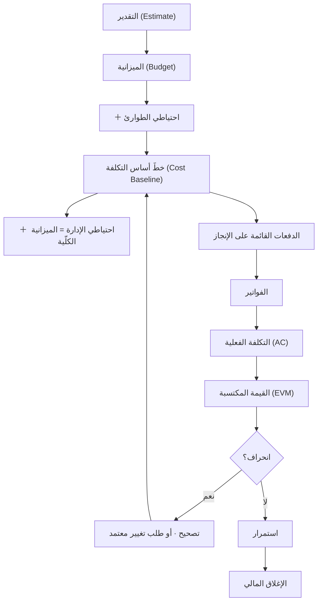
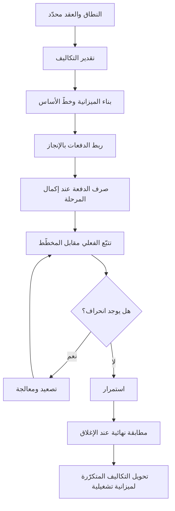

# 08 · إدارة التكاليف

> [!abstract] ماذا ستتعلّم هنا
> - كيف تُقدّر تكلفة المشروع وتضعها في **ميزانية** (Budget) واضحة، مع **مثال محسوب** كامل.
> - الفرق بين تكلفة **استثمارية أولية** (One-off / [[CapEx vs OpEx|CapEx]]) وتكلفة **تشغيلية متكرّرة** (Operating / OpEx).
> - كيف تربط **الدفعات** (Payments) بالإنجاز لا بالتواريخ.
> - ما **احتياطي الطوارئ** و**احتياطي الإدارة**، ومن يملك الإذن بكلٍّ منهما.
> - كيف **تراقب التكلفة وتتحكّم بها** أثناء التنفيذ عبر مقارنة المخطّط بالفعلي.
> - **القيمة المكتسبة** ([[EVM|Earned Value Management]]) برموزها ومعادلاتها و**مثال رقميّ محلول**.
> - **التدفّق النقدي** وفرقه عن الميزانية — بجدول شهريّ.
>
> 🔗 هذه المرحلة جزء من رحلة [[مدير المشاريع البرمجية الحديث]].

> [!info] حدّ هذا الفصل — إدارة تكاليف مشروع لا إدارة مالية مؤسسة
> ما هنا هو **إدارة تكاليف المشروع (Project Cost Management)**: تقديرٌ وميزانيةٌ ومراقبةٌ لمشروع محدَّد له بداية ونهاية. **وليس** الإدارة المالية للمؤسّسة ولا المحاسبة ولا الضرائب ولا القوائم المالية — فتلك مجالات أخرى لها أهلها، وإنما يلتقي بها هذا الفصل في نقاط (كالفواتير والتصنيف المحاسبي) يُنبَّه عليها في موضعها.

---

## 🧭 المفهوم ببساطة

تخيّل أنك تبني بيتًا. قبل أن تضع أول حجر، تحتاج أن تعرف: كم سيكلّف؟ ومتى تدفع للمقاول؟ وماذا لو ارتفع سعر الحديد في المنتصف؟ ثم بعد أن تسكن، تظهر فواتير جديدة كل شهر: كهرباء، ماء، صيانة. **إدارة تكاليف المشروع** تفعل الشيء نفسه للمشروع التقني.

**هذه المرحلة** (Project Cost Management) = ثلاث مهام مترابطة:

1. **التقدير** (Estimating): كم سيكلّف كل بند؟
2. **الميزانية** (Budgeting): تجميع التقديرات في رقم مرجعي (خطّ أساس / [[Baseline]]).
3. **المراقبة والتحكّم** (Cost Monitoring and Control): متابعة الصرف الفعلي مقابل المخطّط، والتصرّف عند الانحراف.

وتضيف بُعدًا مهمًّا في المشاريع الرقمية: **فصل تكلفة البناء الاستثمارية الأولية عن التكاليف التشغيلية المتكرّرة** التي تستمر بعد التسليم (استضافة، رسائل SMS، رسوم بوابة الدفع).

> [!warning] تنبيه حول CapEx/OpEx
> نستخدم هنا CapEx/OpEx كتبسيط تعليمي للتمييز بين «تكلفة استثمارية أولية» و«تكلفة متكرّرة». لكن دقيقًا: التصنيف المحاسبي CapEx مقابل OpEx يعتمد على **هل تُرسمَل التكلفة (تُوزّع على سنوات) أم تُصرَف فورًا**، لا على تكرار الدفع. فرسوم بناء موقع لمرة واحدة قد تُصنَّف OpEx (مصروفًا فوريًّا) حسب السياسة المحاسبية. عند التعامل مع محاسب، افصل بين «مرة/متكرّر» و«رأسمالي/تشغيلي».

---

## 🧵 رحلة المال في المشروع

كل ما في هذا الفصل حلقاتٌ في سلسلة واحدة، ومن رآها كاملةً عرف موضع كل رقم:

**والمهمّ في هذا الرسم سهمان:** أن خطّ الأساس **يشمل احتياطي الطوارئ ولا يشمل احتياطي الإدارة**، وأن السهم الراجع إليه يمرّ **بطلب تغيير معتمد** لا بقرار تشغيليّ.

---

## 🧩 قاموس سريع للمصطلحات

| المصطلح (عربي) | English | المعنى ببساطة |
|---|---|---|
| الميزانية / خطّ الأساس | Budget / Cost Baseline | الرقم المرجعي المعتمد الذي نقيس عليه |
| تكلفة استثمارية أولية | CapEx / One-off | تُدفع مرّة (بناء المنصة = 14٬700 AED) |
| تكلفة تشغيلية | OpEx / Operating Cost | متكرّرة بعد التسليم (استضافة، SMS، Zoom) |
| دفعة قائمة على الإنجاز | [[Milestone-based Payment]] | تُصرف عند اكتمال مرحلة لا عند تاريخ |
| مراقبة التكلفة والتحكّم بها | Cost Monitoring and Control | متابعة الفعلي مقابل المخطّط والتصحيح |
| احتياطي الطوارئ | [[Contingency Reserve]] | لمخاطر **معروفة**، داخل خطّ الأساس، بيد مدير المشروع |
| احتياطي الإدارة | Management Reserve | لما **لم يُتوقَّع**، خارج خطّ الأساس، بيد الراعي |
| القيمة المكتسبة | Earned Value (EVM) | قياس التقدّم بالمال المُنجَز فعليًا |
| انحراف التكلفة | Cost Variance (CV) | الفرق بين ما أنجزته وما صرفته |
| التدفّق النقدي | Cash Flow | توقيت دخول وخروج المال عبر الزمن |
| التكلفة الكلّية للملكية | [[TCO]] | كلفة البناء + كلفة التشغيل عبر عمر المنتج |

---

## ⛓️ لماذا تأتي هنا وتقود للتالية

**قبلها (المتطلّبات):** لا يمكن تسعير شيء غير معرّف. يجب أن يكون **النطاق** (Scope) والعرض/العقد مع المورّد محدَّدين، وأن تكون **المراحل** (Milestones مثل M7 - التسليم) معروفة حتى تُربط الدفعات بها بدل ربطها بتواريخ اعتباطية.

**بعدها (تُغذّي التالية):**

- **التنفيذ** (Execution): تُعطيه جدول التزام مالي واضح (متى تُستحق كل دفعة وبأي شرط).
- **الإغلاق** (Closure): تُغذّيه بمطابقة نهائية بين ما دُفع وما خُطّط.
- **التشغيل** (Operations): تُورِّثه قائمة التكاليف المتكرّرة التي يجب تحويلها إلى **ميزانية تشغيلية سنوية**.
- **التسليم والقانوني** (07): ترتبط به مباشرة لأن الالتزامات المالية النهائية لا تُغلق قبل تحقّق شروط التسليم والقبول في العقد.

---

## 📊 مخطّط سير العمل

---

## 📂 مستندات هذه المرحلة — واحدًا واحدًا

📂 مستندات هذه المرحلة (في مستودع المشروع)

> [!note] لماذا مستندان فقط؟
> أنتجت هذه المرحلة فعليًّا مستندين اثنين فقط لأن عافية مشروع صغير بميزانية بسيطة ودفعتين — وليس لأن هناك محتوى ناقصًا. المشروع الأكبر يحتاج مستندات إضافية (خطة إدارة تكاليف، توقّع تدفّق نقدي، تتبّع EVM)؛ انظر قسم [«لإكمال الصورة — تحسينات مقترحة»](#➕-لإكمال-الصورة--تحسينات-مقترحة) أدناه.

### 1) سجلّ تتبّع الدفعات

> [!info] ما هو ولماذا
> جدول بيانات (CSV) يسجّل كل **دفعة** متّفق عليها: وصفها، مبلغها، الضريبة، الإجمالي، تاريخ الاستحقاق، **المرحلة المرتبطة بها**، تاريخ الدفع الفعلي، الحالة، ورقم الفاتورة. هدفه: ألا تُصرف دفعة إلا مقابل إنجاز، وأن يبقى الطرفان على نفس الصفحة.

- **📥 من أين تجمع معلوماته:** من **العقد/العرض** (قيمة 14٬700 AED وتقسيمها 50% مقدّم + 50% نهائي)، ومن **جدول المراحل** (بدء العمل، M7 - التسليم)، ومن **الفواتير** الصادرة فعليًا.
- **🛠️ كيف ترتّبه:** صفٌّ لكل دفعة، مع عمود صريح «مرتبطة بمرحلة» وعمود «الحالة» (مستحقّة/مدفوعة)؛ صفّ إجمالي في الأسفل يجمع المبالغ والضريبة.
- **🎯 فائدته:** يحوّل الدفع إلى **بوابة** (Payment Gate): لا صرف قبل اكتمال المرحلة المرتبطة — رافعة تفاوضية وحماية للطرفين.
- ملف: `01-تتبع-الدفعات.csv`

> [!example] من عافية
> دفعتان فقط: **الدفعة 1** مقدّم 50% (7٬000 + 350 ضريبة = 7٬350) عند بدء العمل، و**الدفعة 2** نهائي 50% عند «الإكمال والاعتماد» مرتبطة بمرحلة **M7 - التسليم**. الإجمالي 14٬700 AED. الربط بالإنجاز (لا بتاريخ) يضمن ألا تُصرف الدفعة الأخيرة قبل اجتياز قائمة التسليم النهائي.

«سجلّ تتبّع الدفعات»

### 2) الميزانية والتكاليف التشغيلية والمتكرّرة

> [!info] ما هو ولماذا
> جدول بيانات (CSV) يفصل **تكلفة البناء الاستثمارية الأولية** عن **التكاليف التشغيلية المتكرّرة** التي ستظهر بعد التسليم. هدفه: ألا يُفاجأ المالك بفواتير متكرّرة لم تُحسب، وأن يفهم أن «14٬700 لبناء المنصة» ليست كامل كلفة الملكية.

- **📥 من أين تجمع معلوماته:** من **العرض** (تطوير المنصة)، ومن **المورّدين التشغيليين** (Zoom، بوابة الدفع، مزوّد الاستضافة، الدومين، خدمة SMS)، ومن **المستشار القانوني** (استشارة [[PDPL]])، ومن **فريق التسويق** (المحتوى والتصوير).
- **🛠️ كيف ترتّبه:** أعمدة: البند، النوع (أساسي/تشغيلي/تسويق/لمرة)، التكلفة المتوقعة، التكرار (مرة/شهري/سنوي/مستمر)، المسؤول، وملاحظات. صنّف كل بند بنوعه بوضوح.
- **🎯 فائدته:** يكشف **التكلفة الكلية للملكية** ([[TCO|Total Cost of Ownership]]) ويؤسّس لميزانية تشغيلية سنوية بعد انتهاء العروض المجانية (كالاستضافة المجانية لسنة).
- ملف: `02-ميزانية-وتكاليف-إضافية.csv`

> [!example] من عافية
> البند الأساسي = تطوير المنصة 14٬700 AED (مرة واحدة). أما التشغيلي فيشمل: حساب Zoom للسمنارات (شهري/سنوي)، رسوم بوابة الدفع (نسبة من كل معاملة)، الاستضافة **بعد** السنة المجانية (سنوي)، تجديد الدومين، وخدمة SMS (حسب الاستخدام). درس محوري: **«المجاني لسنة» ليس مجانيًا للأبد** — يجب تحويله لبند ميزانية قبل انتهاء العرض.

«الميزانية والتكاليف الإضافية»

---

## 🧮 الجانب الكمّي — أربعة أمثلة محسوبة

> [!info] إضافة مرجعية — لماذا هذا القسم؟
> إدارة التكاليف مجالٌ **كمّيّ بطبيعته**، وشرحه الوصفيّ وحده يُفهَم ولا يُستعمَل. وهذه أربعة أمثلة صغيرة مقصودة البساطة: ميزانية، واحتياطيان، وقيمة مكتسبة، وتدفّق نقديّ. **والأرقام مبسَّطة للتعليم لا مأخوذة من عقد.**

### 1) مثال: بناء ميزانية بسيطة

مشروع صغير من أربع حزم عمل:

| البند | التقدير |
| --- | --- |
| التصميم | 15٬000 |
| الواجهة الأمامية | 30٬000 |
| الخلفية والتكاملات | 35٬000 |
| الاختبار والنشر | 10٬000 |
| **مجموع تقديرات العمل** | **90٬000** |
| **+ احتياطي الطوارئ (10%)** | **9٬000** |
| **= خطّ أساس التكلفة (Cost Baseline)** | **99٬000** |
| **+ احتياطي الإدارة (نحو 5%)** | **5٬000** |
| **= الميزانية الكلّية للمشروع** | **104٬000** |

**والسطران الأخيران هما ما يُغفَل غالبًا** — وهما موضع القسم التالي.

### 2) الاحتياطيان: الطوارئ والإدارة

ليسا اسمين لشيء واحد، بل يختلفان في **سببهما ومالكهما وموضعهما من خطّ الأساس**:

| الوجه | **احتياطي الطوارئ (Contingency)** | **احتياطي الإدارة (Management Reserve)** |
| --- | --- | --- |
| **لماذا؟** | لمخاطر **معروفة** مرصودة في سجلّ المخاطر | لما **لم يُتوقَّع** أصلًا |
| **مثاله** | «قد يتأخّر تكامل بوابة الدفع أسبوعين» | تغيّر تنظيميّ مفاجئ يفرض إعادة بناء |
| **أين موضعه؟** | **داخل** خطّ أساس التكلفة | **خارجه**، وداخل الميزانية الكلّية |
| **من يأذن بصرفه؟** | **مدير المشروع** بلا استئذان | **الراعي أو الإدارة** |
| **وما أثر صرفه؟** | لا يغيّر خطّ الأساس | **يغيّره** — فيمرّ بطلب تغيير معتمد |

> [!warning] خطّ الأساس لا يتغيّر إلا بضبط التغيير المعتمد
> **لا يُعدَّل خطّ أساس التكلفة (Cost Baseline) إلا عبر ضبط التغيير المعتمد ([[Change Control]]).** ومن حرّكه كلّما تجاوز الصرف، محا معنى القياس نفسه: إذ يصير الفعليّ مطابقًا للمخطّط دائمًا، ويبقى المشروع «ضمن الميزانية» حتى اليوم الذي ينفد فيه المال. **فالانحراف يُعالَج ولا يُلغى بتحريك المرجع.**

### 3) مثال محلول: القيمة المكتسبة (EVM)

**الرموز أوّلًا** — وهي ثلاثة أرقام تُقاس، وأربعة تُشتقّ منها:

| الرمز | الاسم | المعنى | المعادلة |
| --- | --- | --- | --- |
| **PV** | Planned Value | قيمة ما **كان يفترض** أن يُنجَز حتى الآن | — |
| **EV** | Earned Value | قيمة ما **أُنجز فعلًا** (بسعر الميزانية) | — |
| **AC** | Actual Cost | ما **صُرف فعلًا** حتى الآن | — |
| **CV** | Cost Variance | انحراف التكلفة | `EV − AC` |
| **CPI** | Cost Performance Index | كفاءة الإنفاق | `EV ÷ AC` |
| **SV** | Schedule Variance | انحراف الجدول (بالمال) | `EV − PV` |
| **SPI** | Schedule Performance Index | كفاءة الجدول | `EV ÷ PV` |

**والمثال:** ميزانية المشروع (BAC) = **100٬000**. وبعد شهر:

- كان **مخطَّطًا** أن يُنجَز ما قيمته 45٬000 → **PV = 45٬000**
- **أُنجز** فعلًا ما قيمته 40٬000 → **EV = 40٬000**
- **صُرف** فعلًا 50٬000 → **AC = 50٬000**

| المؤشّر | الحساب | الناتج | ماذا يعني؟ |
| --- | --- | --- | --- |
| **CV** | 40٬000 − 50٬000 | **−10٬000** | صرفتَ عشرة آلاف زائدة عن قيمة ما أنجزت |
| **CPI** | 40٬000 ÷ 50٬000 | **0.80** | كل ريال تصرفه ينتج **80 هللة** من العمل |
| **SV** | 40٬000 − 45٬000 | **−5٬000** | متأخّر عن الخطّة بما قيمته خمسة آلاف |
| **SPI** | 40٬000 ÷ 45٬000 | **0.89** | تسير بنحو **89٪** من الوتيرة المخطَّطة |
| **EAC** | 100٬000 ÷ 0.80 | **125٬000** | لو استمرّ الأداء كما هو، سينتهي المشروع بـ125 ألفًا |

**والقراءة في سطر واحد:** أنت **متأخّر ومتجاوز معًا**، ولو بقي الحال على ما هو عليه فالتجاوز المتوقّع **25٪**. وأهمّ رقم في الجدول ليس `CPI` بل **`EAC`** — لأنه وحده يحوّل الملاحظة إلى قرار: أتطلب اعتمادًا إضافيًّا؟ أم تقلّص النطاق؟ أم تعيد التفاوض؟

> [!info] إضافة مرجعية — حدّان على قراءة هذه المؤشّرات
> 1. **`SPI` يقيس الجدول بوحدة المال لا بالزمن**، ويصير مضلّلًا قرب النهاية: فكلّما اقتربت `EV` من `BAC` اقترب `SPI` من 1 ولو كان المشروع متأخّرًا شهورًا. **فيُقرأ مع الجدول لا بديلًا عنه.**
> 2. **`EV` تعتمد على طريقة احتساب الإنجاز**، ومنها قاعدة **0/100** (لا تُحسب المهمّة حتى تكتمل) وهي الأنسب للمهام القصيرة لأنها تقطع التقدير الذاتيّ («أظنّها 70٪ منجزة»).

### 4) مثال: التدفّق النقدي — وأين يختلف عن الميزانية؟

**الميزانية تقول كم**، و**التدفّق النقدي يقول متى** — والمشروع يسقط بالثاني قبل الأول. فقد تكون ميزانيتك سليمة تمامًا وتعجز عن السداد في شهرٍ بعينه.

| الشهر | مدفوعات | متحصّلات | صافي الشهر | **التراكمي** |
| --- | --- | --- | --- | --- |
| 1 | −7٬350 (دفعة مقدّمة) | 0 | −7٬350 | **−7٬350** |
| 2 | −1٬500 (تشغيل ومحتوى) | 0 | −1٬500 | **−8٬850** |
| 3 | −1٬500 | 0 | −1٬500 | **−10٬350** |
| 4 | −7٬350 (دفعة التسليم) | +2٬000 (أوّل اشتراكات) | −5٬350 | **−15٬700** |
| 5 | −1٬500 | +6٬000 | +4٬500 | **−11٬200** |
| 6 | −1٬500 | +9٬000 | +7٬500 | **−3٬700** |

**وثلاث قراءات لا تظهر في جدول الميزانية إطلاقًا:**

1. **أعمق نقطة سيولة** هي الشهر الرابع (−15٬700) — وهذا هو المبلغ الذي يجب أن يكون متاحًا فعلًا، لا إجمالي الميزانية.
2. **نقطة التعادل النقدي** بعد الشهر السادس تقريبًا، لا يوم الإطلاق.
3. **اجتماع دفعتين مع تكاليف تشغيل في شهر واحد** هو ما يصنع الأزمة — ولهذا تُوزَّع الدفعات على مراحل أكثر حين يضيق النقد، لا لأن ذلك أدقّ محاسبيًّا بل لأنه **أخفّ على السيولة**.

---

## ⚖️ ليس هذا… بل هذا

خمسة تحوّلات تفصل بين إدارة تكاليف بدائية وأخرى ناضجة:

| ❌ ليس هذا | ✅ بل هذا | لماذا؟ |
| --- | --- | --- |
| الدفع حسب **التاريخ** | الدفع حسب **الإنجاز** | التاريخ يمرّ سواء أُنجز العمل أو لم يُنجَز |
| اختيار **السعر الأقلّ** | اختيار **القيمة الأفضل** | الأرخص كثيرًا ما يكون قالبًا جاهزًا تدفع ثمنه في الصيانة |
| **مجّاني للأبد** | **مجّاني مؤقّتًا** | العرض المجاني تكلفة مؤجّلة لا معدومة |
| ميزانية **البناء** | **التكلفة الكلّية للملكية** | البناء دفعةٌ واحدة، والتشغيل يستمرّ سنوات |
| «تجاوزنا» بالانطباع | `CPI` و`EAC` **بالأرقام** | الانطباع لا يُقنع راعيًا ولا يُنتج قرارًا |

---

## ☠️ أخطاء يقع فيها مدير المشروع

سبعة أخطاء تتكرّر في مشاريع المنصّات تحديدًا، وكلّها تبدو صغيرة يومَ وقوعها:

1. **عدم حساب تكلفة الدعم والتشغيل بعد التسليم** — فتُعتمَد ميزانية بناءٍ وتُدار على أنها ميزانية منتج.
2. **نسيان رسوم التجديد** — دومين، وشهادات، واشتراكات سنوية، **وأشيعها الاستضافة بعد سنتها المجانية**.
3. **تجاهل الضريبة** — فتظهر الأرقام في الميزانية بلا ضريبة وتصل الفواتير بها.
4. **عدم وجود احتياطي** — فأوّل خطر يقع يتحوّل إلى طلب اعتماد إضافيّ محرج.
5. **ربط الدفعات بالتاريخ** بدل الإنجاز — وهو الخطأ الذي يُفقدك الرافعة كلّها.
6. **إهمال التكاليف المتغيّرة** كنسبة بوابة الدفع — فهي صغيرة عند إطلاق المنصّة وتكبر بنجاحها.
7. **تحريك خطّ الأساس عند كل تجاوز** — فيبقى المشروع «ضمن الميزانية» إلى يوم نفادها.

---

## ⏱️ إدارة وقت هذه المهمة

| حجم المشروع | مدة إعداد الجانب المالي (تقديري دولي) |
|---|---|
| صغير | ساعات إلى يومين (جدول دفعات + قائمة تكاليف) |
| متوسط | أيام إلى أسبوعين (خطة تكاليف + خطّ أساس + تتبّع دوري) |
| كبير | أسابيع إلى أشهر (تقدير مفصّل، EVM، تدفّق نقدي، تدقيق) |

**من يُنتج المستند وكيف يتعاونون:** في مشروع صغير كعافية، **شخص إلى شخصين**: مدير المشروع يبني الجداول، والمالك/الجهة المالية (GM) يعتمد الأرقام وسلطة الصرف. في مشروع أكبر يدخل **محلّل تكاليف** أو **محاسب مشروع**. التعاون يسير هكذا: المورّد يعطي التسعير ← مدير المشروع يحوّله لجدول دفعات مرتبط بالإنجاز ← المالك يعتمد ← المحاسب يطابق الفواتير الفعلية دوريًا.

**أي ملفات تراجع:** راجع **العقد/العرض** (لقيم الدفعات)، و**جدول المراحل** من مرحلة التخطيط (لربط الدفعات)، و**قائمة التسليم النهائي** من مرحلة 07 (لشرط الدفعة الأخيرة).

**صيغ الملفات:**

| النوع | الصيغة المناسبة | لماذا |
|---|---|---|
| سجلّات الدفعات والميزانية | Excel / CSV | حساب تلقائي وفرز وتجميع |
| الأدلة والخطط الحاكمة | Word / Markdown | نصّ قابل للقراءة والتحديث |
| الفواتير والعقود الرسمية | PDF | صيغة رسمية ثابتة لا تُعدّل |

> [!note] الدقّة قبل السرعة
> في المال، خطأ في رقم أو في ربط دفعة بمرحلة خاطئة قد يكلّف آلاف الدراهم أو نزاعًا تعاقديًّا. راجِع مرّتين، ووثّق مصدر كل رقم.

---

## 🌐 ما تقوله المعايير الحديثة

> [!quote]
> تُجمع الممارسات الحديثة (2026) على عدّة أفكار أساسية لضبط التكلفة:
> - **لماذا القيمة المكتسبة (EVM) هي المعيار الذهبي؟** لأنها تدمج النطاق والجدول والكلفة في مقياس واحد موضوعي.
> - **المؤشّران الأساسيان:** مؤشّر أداء التكلفة (CPI) ومؤشّر أداء الجدول (SPI).
> - **الأثر المثبت:** تربط دراسات متعددة أنظمة ضبط التكلفة المنظّمة بتقليل ملموس في تجاوزات الميزانية.
> - **ابدأ بخطّ أساس دقيق:** ثبّت الرقم المرجعي أولًا قبل أي قياس.
> - **قاعدة 0/100 للمهام القصيرة** (أقل من أسبوعين): لا تحسب المهمة منجزة إلا عند اكتمالها 100%، لتقليل الذاتية.
> - **تقرير أسبوعي للإدارة** لرصد الانحراف مبكّرًا.
>
> هذا يتّصل مباشرة بـ [[مدير المشاريع البرمجية الحديث|مثلث كفاءات PMI]]: المهارات التقنية (بناء الميزانية وEVM) + القيادة (التفاوض على الدفعات) + الفطنة الاستراتيجية (فهم التكلفة الكلية للملكية).

---

## ➕ لإكمال الصورة — تحسينات مقترحة

> [!todo] ما الذي ينقص مقابل المعايير؟
> - **لا توجد خطة إدارة تكاليف حاكمة:** المشروع فيه سجلّ دفعات وقائمة تكاليف، لكن لا وثيقة تحدّد وحدة القياس وحدود التجاوز وسلطة الاعتماد. أنشأتُ لها وثيقة تعليمية: [[خطة إدارة التكاليف (Cost Management Plan)]].
> - **لا قياس بالقيمة المكتسبة (EVM):** لا يوجد تتبّع لـ [[CPI and SPI|CPI/SPI]]. اربط الانحراف المالي بالمخاطر عبر [[19 - Risk Management]].
> - **لا احتياطي معلَن:** لا احتياطي طوارئ داخل خطّ الأساس ولا احتياطي إدارة خارجه — فأوّل مخاطرة تقع تصير طلب اعتماد إضافيّ.
> - **لا توقّع للتدفّق النقدي (Cash Flow Forecast):** الدفعتان معروفتان، لكن لا جدول زمني يوضّح متى يخرج المال مقابل متى يدخل الاشتراك — مهم عند إضافة التكاليف التشغيلية.
> - **التكاليف التشغيلية بلا أرقام:** أغلب بنود التشغيل في الملف بلا تكلفة متوقعة («حساب Zoom»، «الاستضافة بعد السنة»). المطلوب طلب عروض أسعار وتحويلها إلى **ميزانية تشغيلية سنوية** معتمدة.
> - **لا ربط بمسؤول للمتابعة:** استخدم [[مصفوفة المسؤوليات (RACI)]] لتعيين من يراقب كل بند تشغيلي ومتى يجدّده، حتى لا تنتهي عروض مجانية دون تجديد. وللتصعيد عند تجاوز الميزانية استعن بـ [[مسار التصعيد (Escalation Path)]].

---

## 🎬 سيناريوهان

> [!success] السيناريو الصحيح
> **سلمى**، مديرة المشروع، رفضت ربط الدفعة الأخيرة بتاريخ ثابت وأصرّت على ربطها بمرحلة **M7 - التسليم** واكتمال قائمة التسليم. كما بنت جدولًا للتكاليف التشغيلية وطلبت عروض أسعار للاستضافة **قبل** انتهاء السنة المجانية بشهرين. النتيجة: المنصة سُلّمت مكتملة قبل صرف الدفعة، ولم تُفاجأ الجهة بأي فاتورة استضافة، وتحوّلت التكاليف المتكرّرة إلى ميزانية سنوية معتمدة بهدوء.

> [!failure] السيناريو الخاطئ
> **خالد**، مسؤول مالي متعجّل، صرف الدفعة النهائية عند «تاريخ الاستحقاق» دون التأكد من اكتمال التسليم لأن التقويم قال إن الموعد حان. وتجاهل بنود التكاليف التشغيلية باعتبارها «مجانية». النتيجة: انتهت سنة الاستضافة المجانية فتوقّفت المنصة فجأة، وطالب المورّد بمبالغ لإصلاح ميزات ناقصة بعد أن قبض كامل المبلغ — ففقد خالد كل رافعة تفاوضية.

---

## 🧩 قرارات تفاعلية (فكّر ثم افتح)

> [!question]- المورّد يطلب صرف الدفعة النهائية لأن «التاريخ حان» رغم أن قائمة التسليم لم تكتمل. ماذا تفعل؟ (أ) تدفع احترامًا للتاريخ · (ب) ترفض وتربط الدفع بإكمال المرحلة · (ج) تدفع نصفها
> ✅ **الخيار (ب).**
> **لماذا؟** الدفعات في هذا المشروع **قائمة على الإنجاز** لا على تواريخ. صرف الدفعة قبل اكتمال التسليم يُفقدك الرافعة الأقوى لضمان الجودة. التاريخ مجرد تقدير؛ الشرط الحقيقي هو «الإكمال والاعتماد».
> **السيناريو المثالي:** أظهِر بند العقد وسجلّ الدفعات الذي ينص على الربط بـ M7، واعرض جدولًا واضحًا: «فور اجتياز قائمة التسليم، تُصرف الدفعة خلال 48 ساعة».

> [!question]- العرض يقدّم استضافة مجانية لسنة. كيف تعامل هذه التكلفة في الميزانية؟ (أ) تتجاهلها لأنها مجانية · (ب) تسجّلها بصفر · (ج) تسجّلها كبند تشغيلي سنوي يبدأ بعد 12 شهرًا
> ✅ **الخيار (ج).**
> **لماذا؟** «مجاني لسنة» يعني تكلفة مؤجّلة لا تكلفة معدومة. تسجيلها بصفر أو تجاهلها يخلق فجوة ميزانية مفاجئة في السنة الثانية قد توقف الخدمة.
> **السيناريو المثالي:** أدرِج البند في جدول التكاليف التشغيلية مع تكرار «سنوي» وملاحظة «يبدأ بعد انتهاء العرض المجاني»، واطلب عرض سعر مبكّرًا لتثبيت رقم تقديري.

> [!question]- بعد شهرين: `CPI = 0.85` و`SPI = 0.95`. والراعي يسأل: «هل نحن بخير؟» ماذا تجيب؟ (أ) نعم، الفارق بسيط · (ب) نحن ضمن الميزانية لأننا لم نتجاوزها بعد · (ج) نحن ننفق أسرع مما ننجز، والتجاوز المتوقّع نحو 18٪
> ✅ **الخيار (ج).**
> **لماذا؟** `CPI = 0.85` تعني أن كل ريال يُنتج 85 هللة من العمل، و`EAC = BAC ÷ 0.85` أي تجاوزًا متوقّعًا نحو **18٪** عند الاستمرار على الوتيرة نفسها. أمّا (ب) فمغالطة شائعة: **ألّا تكون قد تجاوزت بعدُ ليس دليلًا على أنك لن تتجاوز** — فالميزانية لم تنفد لأن العمل لم يكتمل. **والجواب الصحيح يذكر رقمًا واحدًا: `EAC`.**

---

## 🧠 أسئلة تفكير ناقد وعصف ذهني (بلا إجابة واحدة)

> [!question] للتأمّل
> - المنصة تعتمد على بوابة دفع تأخذ «نسبة من كل معاملة». كيف تحوّل هذه التكلفة المتغيّرة إلى رقم قابل للتخطيط في ميزانية سنوية؟
> - لو ارتفع سعر الاستضافة 40% بعد السنة المجانية، ما البدائل، وكيف تقارنها ماليًّا لا عاطفيًّا؟
> - هل الأفضل دفعتان (50/50) أم ثلاث دفعات مرتبطة بمراحل أدقّ؟ ما المقايضة بين حماية المالك وتدفّق المورّد النقدي؟
> - متى يكون احتياطي 10% تبديدًا، ومتى يكون 10% غير كافٍ أصلًا؟ وبأي شيء تقرّر النسبة؟

> [!tip] إطار الإجابة
> 1. **حدّد نوع التكلفة:** ثابتة أم متغيّرة؟ لمرة أم متكرّرة؟
> 2. **قدّر بالسيناريوهات:** ضع تقديرًا متفائلًا/متوسّطًا/متحفّظًا بدل رقم واحد.
> 3. **قِس الأثر على التدفّق النقدي:** متى يخرج المال ومتى يدخل الدخل المقابل؟
> 4. **اربط بقرار:** ما العتبة التي تغيّر خيارك (مثلًا: إن تجاوز الارتفاع 30% نغيّر المزوّد)؟
> مثال اتجاه: لتكلفة بوابة الدفع، اضرب النسبة في **حجم معاملات متوقّع** بثلاثة سيناريوهات، وأدرِج المتوسّط في الميزانية مع مراجعة ربع سنوية.

---

## ❓ نقاط للمراجعة (استرجاع)

> [!question]- لماذا تُربط الدفعات بالإنجاز لا بالتواريخ؟
> لأن الربط بالإنجاز يجعل الدفع مشروطًا بعمل تمّ فعلًا، فيبقى للمالك رافعة لضمان الجودة. التاريخ قد يحين دون اكتمال العمل.

> [!question]- ما الفرق بين التكلفة الاستثمارية الأولية والتكلفة التشغيلية؟
> الأولى تُدفع مرة كبناء المنصة (14٬700 AED). والتشغيلية متكرّرة بعد التسليم كالاستضافة وSMS وبوابة الدفع. ومجموعهما عبر عمر المنتج هو **التكلفة الكلّية للملكية**.

> [!question]- ما «خطّ الأساس» (Cost Baseline) ولماذا نحتاجه؟ ومتى يتغيّر؟
> هو الميزانية المعتمدة المرجعية التي نقيس عليها الفعلي؛ بدونه لا معنى لقول «تجاوزنا». **ولا يتغيّر إلا بضبط تغيير معتمد** — ومن حرّكه عند كل تجاوز محا القياس نفسه.

> [!question]- ما الفرق بين احتياطي الطوارئ واحتياطي الإدارة؟
> **الطوارئ** لمخاطر معروفة، **داخل** خطّ الأساس، يصرفه مدير المشروع. **والإدارة** لما لم يُتوقَّع، **خارج** خطّ الأساس وداخل الميزانية الكلّية، يأذن به الراعي، **وصرفه يغيّر خطّ الأساس** فيمرّ بطلب تغيير.

> [!question]- احسب: `BAC = 200٬000` · `PV = 80٬000` · `EV = 70٬000` · `AC = 60٬000`. ما الحال؟
> `CV = 70 − 60 = +10٬000` · `CPI = 70 ÷ 60 = 1.17` · `SV = 70 − 80 = −10٬000` · `SPI = 70 ÷ 80 = 0.875` · `EAC = 200 ÷ 1.17 ≈ 171٬000`.
> **والقراءة:** **أرخص ممّا خُطّط وأبطأ منه** — تنفق بكفاءة لكنك متأخّر. وهذا نمط شائع سببه غالبًا **نقص موارد** لا كفاءة إنفاق: الفريق أصغر مما ينبغي، فالإنفاق أقلّ والإنجاز أبطأ.

> [!question]- ما الفرق بين الميزانية والتدفّق النقدي؟
> الميزانية تقول **كم** إجمالًا، والتدفّق النقدي يقول **متى** يخرج المال ويدخل. وقد تكون الميزانية سليمة ويعجز المشروع عن السداد في شهر بعينه — **وأعمق نقطة سيولة** هي المبلغ الذي يلزم توفّره فعلًا، لا الإجمالي.

> [!question]- لماذا يُعدّ عرض «الاستضافة المجانية لسنة» فخًّا محتملًا؟
> لأنه تكلفة مؤجّلة لا معدومة؛ إن لم تُسجّل كبند تشغيلي سنوي يبدأ بعد 12 شهرًا، تظهر فجوة ميزانية مفاجئة قد توقف الخدمة.

> [!question]- ما مؤشّرا القيمة المكتسبة الأساسيان وماذا يقولان؟ وما حدّ أحدهما؟
> CPI (أداء التكلفة): أكبر من 1 يعني كفاءة إنفاق. SPI (أداء الجدول): أكبر من 1 يعني أسرع من الخطة. **وحدّ SPI** أنه يقيس الجدول بوحدة المال، فيقترب من 1 كلّما اقترب المشروع من نهايته ولو كان متأخّرًا — فيُقرأ مع الجدول لا بديلًا عنه.

---

## 💼 من أسئلة المقابلات

> [!question]- كيف تبني ميزانية مشروع من الصفر؟
> **نموذج إجابة:** أبدأ من النطاق المعتمد، وأقسّمه إلى حزم عمل، وأقدّر كلفة كل حزمة بمزيج من البيانات التاريخية وحكم الخبراء وعروض المورّدين. أجمّعها ثم أضيف **احتياطي طوارئ** فيصير المجموع **خطّ أساس التكلفة**، ويُضاف فوقه **احتياطي إدارة** فتكتمل الميزانية الكلّية. ثم أفصل التكاليف الاستثمارية عن التشغيلية، وأربط الدفعات بالإنجاز، وأثبّت آلية تتبّع دورية.

> [!question]- كيف تتعامل مع تجاوز الميزانية أثناء التنفيذ؟
> **نموذج إجابة:** أكتشفه مبكّرًا عبر مقارنة الفعلي بخطّ الأساس (CV وCPI)، وأحسب **EAC** لأقدّر أثره عند الاكتمال لا عند اليوم. أحلّل السبب الجذري، وأقيّم خيارات: خفض نطاق أقل أولوية، أو إعادة تفاوض، أو صرف احتياطي، أو طلب اعتماد إضافي بمبرّر. **ولا أحرّك خطّ الأساس** إلا بطلب تغيير معتمد.

> [!question]- كيف تتوقّع التكلفة المتبقّية للمشروع؟
> **نموذج إجابة:** أستخدم البيانات التاريخية لاستخلاص الأنماط، وأراجعها مع الفريق بحكم الخبراء، وأحسب **تقدير عند الإكمال** (EAC) بناءً على أداء التكلفة الحالي (`BAC ÷ CPI`) حين يكون الانحراف نمطًا مستمرًّا. ثم أقارن الناتج بالميزانية المعتمدة لأقرّر إن كنّا سنلتزم بها.

> [!question]- أعطني مثالًا حقيقيًّا ضبطت فيه تكلفة مشروع.
> **نموذج إجابة (بأرقام):** في منصة رقمية، اكتشفت أن رسوم بوابة دفع متغيّرة كانت تُستهلك دون تقدير. حوّلتها إلى ثلاثة سيناريوهات حجم معاملات، أدرجت المتوسّط في ميزانية ربع سنوية، وتفاوضت على نسبة أقل — فخفّضت التكلفة المتوقّعة 15% وأزلت المفاجآت.

> [!tip] إطار STAR
> رتّب إجابتك: **الموقف** (Situation) ← **المهمة** (Task) ← **الإجراء** (Action) ← **النتيجة** (Result)، ودعّمها بأرقام (نِسب، مبالغ، فروق) — فالإجابات المالية القوية كمّية لا انطباعية.

---

## 🧪 من مبتدئ إلى محترف

> [!success] مسار التدرّج
> - **مبتدئ:** يعرف الفرق بين التكلفة الاستثمارية والتشغيلية، ويملأ سجلّ دفعات بسيطًا، ويربط دفعة بإنجاز.
> - **متوسّط:** يبني ميزانية بخطّ أساس واحتياطي، ويفصل التكاليف بأنواعها، ويتابع الفعلي مقابل المخطّط شهريًّا، ويعدّ ميزانية تشغيلية سنوية.
> - **محترف:** يطبّق **القيمة المكتسبة** بحساب CPI/SPI وEAC ويقرأ حدودها، يبني توقّع تدفّق نقدي بسيناريوهات ويعرف أعمق نقطة سيولة، يحرس خطّ الأساس من التحريك غير المعتمد، ويربط الانحراف المالي بسجلّ المخاطر، ويستخدم البيانات المالية كرافعة تفاوض واستراتيجية.

---

## ✅ قائمة تحقّق قبل إغلاق الجانب المالي

> [!success] راجعها بندًا بندًا
> - ☐ **الميزانية معتمدة** من صاحب الصلاحية، لا مقترحة في عرض تقديمي.
> - ☐ **خطّ الأساس محفوظ** بنسخة مجمّدة يمكن الرجوع إليها.
> - ☐ **الدفعات قائمة على الإنجاز** ومربوطة بمراحل معرَّفة.
> - ☐ **الاحتياطيان محسوبان** ومعلومٌ من يأذن بكلٍّ منهما.
> - ☐ **التكاليف التشغيلية مقدَّرة بأرقام** لا بأسماء بنود.
> - ☐ **الضرائب محسوبة** في كل بند لا في الإجمالي فقط.
> - ☐ **التكاليف المتكرّرة معروفة** بتواريخ تجديدها ومالكها.
> - ☐ **التدفّق النقدي مرسوم** ومعلومٌ فيه أعمق شهر.
> - ☐ **آلية التتبّع متّفق عليها**: من يحدّث الأرقام، ومتى، وإلى من تُرفع.

---

## 🔗 ربط بالمفاهيم

- [[19 - Risk Management]]
- [[20 - Quality Management]]
- [[21 - Stakeholder Communication]]
- [[15 - Roadmap]]
- [[04 - Waterfall]]
- [[مدير المشاريع البرمجية الحديث]]

---

## 📌 بطاقة مرجعية سريعة

| العنصر | الخلاصة |
|---|---|
| هدف المرحلة | تقدير + ميزانية + مراقبة التكلفة والتحكّم بها |
| القاعدة الذهبية | ادفع مقابل **إنجاز** لا مقابل **تاريخ** |
| التقسيم الأهم | استثماري أوّلي (CapEx) مقابل تشغيلي متكرّر (OpEx) |
| الاحتياطيان | طوارئ (داخل خطّ الأساس · مدير المشروع) · إدارة (خارجه · الراعي) |
| المقياس الحديث | القيمة المكتسبة: `CPI = EV÷AC` · `SPI = EV÷PV` · `EAC = BAC÷CPI` |
| القاعدة الحاكمة | لا يتغيّر خطّ الأساس إلا بضبط تغيير معتمد |
| فخّ شائع | «المجاني لسنة» تكلفة مؤجّلة لا معدومة |
| مثال عافية | 14٬700 AED تطوير + تكاليف تشغيلية متكرّرة |

> [!tip] قواعد ذهبية
> 1. لا تصرف دفعة قبل اكتمال المرحلة المرتبطة بها.
> 2. كل تكلفة «مجانية مؤقتًا» تُسجَّل كبند مستقبلي بتاريخ بدء.
> 3. **خطّ الأساس مرجعٌ يُقاس عليه لا رقمٌ يُحرَّك** — والانحراف يُعالَج ولا يُلغى بتحريك المرجع.
> 4. الدقّة قبل السرعة: وثّق مصدر كل رقم وراجعه مرّتين.

---

## 🧠 كيف يفكر مدير المشروع في هذه المرحلة؟

ما سبق **ما يفعله** مدير المشروع في إدارة التكاليف. وهذا **كيف يفكّر** — وأربعة أسئلة تدور في رأسه أمام كل رقم:

1. **ما مصدر هذا الرقم؟** عرضُ مورّد، أم تقديرٌ من الفريق، أم تخمينٌ ورثه من عرض تسويقيّ؟ **فالرقم بلا سند لا يُبنى عليه التزام.**
2. **هل هذه تكلفة مرّة أم تكلفة تتكرّر؟** فأخطر ما في المشاريع الرقمية أن يُدار **منتجٌ** بميزانية **بناء** — فتظهر الفواتير المتكرّرة في السنة الثانية بلا موضع في أي جدول.
3. **متى يخرج المال ومتى يدخل؟** فالمشروع لا يسقط لأن ميزانيته صغيرة، بل لأن **أعمق شهرٍ فيه** جاء قبل أوّل متحصَّل.
4. **إن استمرّ الأداء كما هو، فبكم ينتهي؟** وهذا سؤال `EAC` — وهو وحده الذي يحوّل المتابعة من **وصفٍ لما مضى** إلى **قرارٍ فيما بقي**.

> [!warning] المعيار العملي
> اسأل نفسك: **لو سألني الراعي الآن «بكم سينتهي المشروع؟» فهل عندي رقم بسند؟** فإن كان الجواب «ما زلنا ضمن الميزانية»، فأنت تصف **ما لم يُنفَق بعد**، ولا تصف **ما سيُنفَق**. **والميزانية التي لم تُتجاوز بعدُ ليست ميزانية لن تُتجاوز.**

---

> [!quote] مصادر
> - دليل **PMBOK** (إصدار PMI) — مجال معرفة **إدارة تكاليف المشروع**: التقدير، وتحديد الميزانية، وضبط التكاليف، وتعريفا احتياطي الطوارئ واحتياطي الإدارة وموضعهما من خطّ الأساس.
> - [Practice Standard for Earned Value Management — PMI](https://www.pmi.org/) — المرجع المعياري لرموز EVM ومعادلاتها (PV · EV · AC · CPI · SPI · EAC).
> - [Ultimate guide to Earned Value Management in 2026 — Hello Bonsai](https://www.hellobonsai.com/blog/earned-value)
> - [Project Cost Management: How to Estimate, Budget, and Control Costs — Invensis](https://www.invensislearning.com/blog/project-cost-management/)
> - [Budget Management Interview Questions — Indeed](https://uk.indeed.com/career-advice/interviewing/budget-management-interview-questions)
