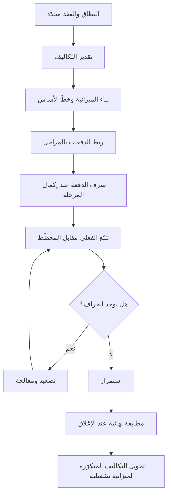

# 08 · المالية

> [!abstract] ماذا ستتعلّم هنا
> - كيف تُقدّر تكلفة المشروع وتضعها في **ميزانية** (Budget) واضحة.
> - الفرق بين تكلفة **لمرة واحدة** (One-off / [[CapEx vs OpEx|CapEx]]) وتكلفة **تشغيلية مستمرة** (Operating / OpEx).
> - كيف تربط **الدفعات** (Payments) بمراحل التسليم (Milestones) بدل التواريخ العشوائية.
> - كيف **تضبط التكلفة** أثناء التنفيذ عبر مقارنة المخطّط بالفعلي.
> - أساسيات **القيمة المكتسبة** ([[EVM|Earned Value Management]]) لقياس الصحّة المالية بموضوعية.
>
> 🔗 هذه المرحلة جزء من رحلة [[مدير المشاريع البرمجية الحديث]].

## 🧭 المفهوم ببساطة

تخيّل أنك تبني بيتًا. قبل أن تضع أول حجر، تحتاج أن تعرف: كم سيكلّف؟ ومتى تدفع للمقاول؟ وماذا لو ارتفع سعر الحديد في المنتصف؟ ثم بعد أن تسكن، تظهر فواتير جديدة كل شهر: كهرباء، ماء، صيانة. **إدارة مالية المشروع** تفعل الشيء نفسه للمشروع التقني.

**المرحلة المالية** (Project Cost Management) = ثلاث مهام مترابطة:
1. **التقدير** (Estimating): كم سيكلّف كل بند؟
2. **الميزانية** (Budgeting): تجميع التقديرات في رقم مرجعي (خطّ أساس / [[Baseline]]).
3. **الضبط** (Cost Control): متابعة الصرف الفعلي مقابل المخطّط، والتصرّف عند الانحراف.

وتضيف بُعدًا مهمًّا في المشاريع الرقمية: **فصل تكلفة البناء لمرة واحدة عن التكاليف التشغيلية** التي تستمر بعد التسليم (استضافة، رسائل SMS، رسوم بوابة الدفع).

> [!warning] تنبيه حول CapEx/OpEx
> نستخدم هنا CapEx/OpEx كتبسيط تعليمي للتمييز بين «تكلفة لمرة واحدة» و«تكلفة متكرّرة». لكن دقيقًا: التصنيف المحاسبي CapEx مقابل OpEx يعتمد على **هل تُرسمَل التكلفة (تُوزّع على سنوات) أم تُصرَف فورًا**، لا على تكرار الدفع. فرسوم بناء موقع لمرة واحدة قد تُصنَّف OpEx (مصروفًا فوريًّا) حسب السياسة المحاسبية. عند التعامل مع محاسب، افصل بين «مرة/متكرّر» و«رأسمالي/تشغيلي».

## 🧩 قاموس سريع للمصطلحات

| المصطلح (عربي) | English | المعنى ببساطة |
|---|---|---|
| الميزانية / خطّ الأساس | Budget / Cost Baseline | الرقم المرجعي المعتمد الذي نقيس عليه |
| تكلفة لمرة واحدة | CapEx / One-off | تُدفع مرّة (بناء المنصة = 14٬700 AED) |
| تكلفة تشغيلية | OpEx / Operating Cost | متكرّرة بعد التسليم (استضافة، SMS، Zoom) |
| دفعة مرتبطة بمرحلة | [[Milestone-based Payment]] | تُصرف عند اكتمال مرحلة لا عند تاريخ |
| ضبط التكلفة | Cost Control | متابعة الفعلي مقابل المخطّط والتصحيح |
| القيمة المكتسبة | Earned Value (EVM) | قياس التقدّم بالمال المُنجَز فعليًا |
| انحراف التكلفة | Cost Variance (CV) | الفرق بين المخطّط والمصروف الفعلي |
| التدفّق النقدي | Cash Flow | توقيت دخول وخروج المال عبر الزمن |

## ⛓️ لماذا تأتي هنا وتقود للتالية

**قبلها (المتطلّبات):** لا يمكن تسعير شيء غير معرّف. يجب أن يكون **النطاق** (Scope) والعرض/العقد مع المورّد محدَّدين، وأن تكون **المراحل** (Milestones مثل M7 - التسليم) معروفة حتى تُربط الدفعات بها بدل ربطها بتواريخ اعتباطية.

**بعدها (تُغذّي التالية):**
- **التنفيذ** (Execution): تُعطيه جدول التزام مالي واضح (متى تُستحق كل دفعة وبأي شرط).
- **الإغلاق** (Closure): تُغذّيه بمطابقة نهائية بين ما دُفع وما خُطّط.
- **التشغيل** (Operations): تُورِّثه قائمة التكاليف المتكرّرة التي يجب تحويلها إلى **ميزانية تشغيلية سنوية**.
- **التسليم والقانوني** (07): ترتبط به مباشرة لأن الدفعة النهائية لا تُصرف قبل اكتمال قائمة التسليم.

## 📊 مخطّط سير العمل

## 📂 مستندات هذه المرحلة — واحدًا واحدًا

📂 مستندات هذه المرحلة (في مستودع المشروع)

> [!note] لماذا مستندان فقط؟
> أنتجت هذه المرحلة فعليًّا مستندين اثنين فقط لأن عافية مشروع صغير بميزانية بسيطة ودفعتين — وليس لأن هناك محتوى ناقصًا. المشروع الأكبر يحتاج مستندات إضافية (خطة إدارة تكاليف، توقّع تدفّق نقدي، تتبّع EVM)؛ انظر قسم [«لإكمال الصورة — تحسينات مقترحة»](#➕-لإكمال-الصورة--تحسينات-مقترحة) أدناه.

### 1) سجلّ تتبّع الدفعات

> [!info] ما هو ولماذا
> جدول بيانات (CSV) يسجّل كل **دفعة** متّفق عليها: وصفها، مبلغها، الضريبة، الإجمالي، تاريخ الاستحقاق، **المرحلة المرتبطة بها**، تاريخ الدفع الفعلي، الحالة، ورقم الفاتورة. هدفه: ألا تُصرف دفعة إلا مقابل إنجاز، وأن يبقى الطرفان على نفس الصفحة.

- **📥 من أين تجمع معلوماته:** من **العقد/العرض** (قيمة 14٬700 AED وتقسيمها 50% مقدّم + 50% نهائي)، ومن **جدول المراحل** (بدء العمل، M7 - التسليم)، ومن **الفواتير** الصادرة فعليًا.
- **🛠️ كيف ترتّبه:** صفٌّ لكل دفعة، مع عمود صريح «مرتبطة بمرحلة» وعمود «الحالة» (مستحقّة/مدفوعة)؛ صفّ إجمالي في الأسفل يجمع المبالغ والضريبة.
- **🎯 فائدته:** يحوّل الدفع إلى **بوابة** (Payment Gate): لا صرف قبل اكتمال المرحلة المرتبطة — رافعة تفاوضية وحماية للطرفين.
- ملف: `01-تتبع-الدفعات.csv`

> [!example] من عافية
> دفعتان فقط: **الدفعة 1** مقدّم 50% (7٬000 + 350 ضريبة = 7٬350) عند بدء العمل، و**الدفعة 2** نهائي 50% عند «الإكمال والاعتماد» مرتبطة بمرحلة **M7 - التسليم**. الإجمالي 14٬700 AED. الربط بالمرحلة (لا بتاريخ) يضمن ألا تُصرف الدفعة الأخيرة قبل اجتياز قائمة التسليم النهائي.

«سجلّ تتبّع الدفعات»

### 2) الميزانية والتكاليف الإضافية

> [!info] ما هو ولماذا
> جدول بيانات (CSV) يفصل **تكلفة البناء لمرة واحدة** عن **التكاليف التشغيلية المستمرة** التي ستظهر بعد التسليم. هدفه: ألا يُفاجأ المالك بفواتير متكرّرة لم تُحسب، وأن يفهم أن «14٬700 لبناء المنصة» ليست كامل كلفة الملكية.

- **📥 من أين تجمع معلوماته:** من **العرض** (تطوير المنصة)، ومن **المورّدين التشغيليين** (Zoom، بوابة الدفع، مزوّد الاستضافة، الدومين، خدمة SMS)، ومن **المستشار القانوني** (استشارة [[PDPL]])، ومن **فريق التسويق** (المحتوى والتصوير).
- **🛠️ كيف ترتّبه:** أعمدة: البند، النوع (أساسي/تشغيلي/تسويق/لمرة)، التكلفة المتوقعة، التكرار (مرة/شهري/سنوي/مستمر)، المسؤول، وملاحظات. صنّف كل بند بنوعه بوضوح.
- **🎯 فائدته:** يكشف **التكلفة الكلية للملكية** ([[TCO|Total Cost of Ownership]]) ويؤسّس لميزانية تشغيلية سنوية بعد انتهاء العروض المجانية (كالاستضافة المجانية لسنة).
- ملف: `02-ميزانية-وتكاليف-إضافية.csv`

> [!example] من عافية
> البند الأساسي = تطوير المنصة 14٬700 AED (مرة واحدة). أما التشغيلي فيشمل: حساب Zoom للسمنارات (شهري/سنوي)، رسوم بوابة الدفع (نسبة من كل معاملة)، الاستضافة **بعد** السنة المجانية (سنوي)، تجديد الدومين، وخدمة SMS (حسب الاستخدام). درس محوري: **«المجاني لسنة» ليس مجانيًا للأبد** — يجب تحويله لبند ميزانية قبل انتهاء العرض.

«الميزانية والتكاليف الإضافية»

## ⏱️ إدارة وقت هذه المهمة

| حجم المشروع | مدة إعداد الجانب المالي (تقديري دولي) |
|---|---|
| صغير | ساعات إلى يومين (جدول دفعات + قائمة تكاليف) |
| متوسط | أيام إلى أسبوعين (خطة تكاليف + خطّ أساس + تتبّع دوري) |
| كبير | أسابيع إلى أشهر (تقدير مفصّل، EVM، تدفّق نقدي، تدقيق) |

**من يُنتج المستند وكيف يتعاونون:** في مشروع صغير كعافية، **شخص إلى شخصين**: مدير المشروع يبني الجداول، والمالك/الجهة المالية (GM) يعتمد الأرقام وسلطة الصرف. في مشروع أكبر يدخل **محلّل تكاليف** أو **محاسب مشروع**. التعاون يسير هكذا: المورّد يعطي التسعير ← مدير المشروع يحوّله لجدول دفعات مرتبط بمراحل ← المالك يعتمد ← المحاسب يطابق الفواتير الفعلية دوريًا.

**أي ملفات تراجع:** راجع **العقد/العرض** (لقيم الدفعات)، و**جدول المراحل** من مرحلة التخطيط (لربط الدفعات)، و**قائمة التسليم النهائي** من مرحلة 07 (لشرط الدفعة الأخيرة).

**صيغ الملفات:**

| النوع | الصيغة المناسبة | لماذا |
|---|---|---|
| سجلّات الدفعات والميزانية | Excel / CSV | حساب تلقائي وفرز وتجميع |
| الأدلة والخطط الحاكمة | Word / Markdown | نصّ قابل للقراءة والتحديث |
| الفواتير والعقود الرسمية | PDF | صيغة رسمية ثابتة لا تُعدّل |

> [!note] الدقّة قبل السرعة
> في المال، خطأ في رقم أو في ربط دفعة بمرحلة خاطئة قد يكلّف آلاف الدراهم أو نزاعًا تعاقديًّا. راجِع مرّتين، ووثّق مصدر كل رقم.

## 🌐 ما تقوله المعايير الحديثة

> [!quote]
> تُجمع الممارسات الحديثة (2026) على عدّة أفكار أساسية لضبط التكلفة:
> - **لماذا القيمة المكتسبة (EVM) هي المعيار الذهبي؟** لأنها تدمج النطاق والجدول والكلفة في مقياس واحد موضوعي.
> - **المؤشّران الأساسيان:** مؤشّر أداء التكلفة (CPI) ومؤشّر أداء الجدول (SPI).
> - **الأثر المثبت:** تربط دراسات متعددة أنظمة ضبط التكلفة المنظّمة بتقليل ملموس في تجاوزات الميزانية.
> - **ابدأ بخطّ أساس دقيق:** ثبّت الرقم المرجعي أولًا قبل أي قياس.
> - **قاعدة 0/100 للمهام القصيرة** (أقل من أسبوعين): لا تحسب المهمة منجزة إلا عند اكتمالها 100%، لتقليل الذاتية.
> - **تقرير أسبوعي للإدارة** لرصد الانحراف مبكّرًا.
>
> هذا يتّصل مباشرة بـ [[مدير المشاريع البرمجية الحديث|مثلث كفاءات PMI]]: المهارات التقنية (بناء الميزانية وEVM) + القيادة (التفاوض على الدفعات) + الفطنة الاستراتيجية (فهم التكلفة الكلية للملكية).

## ➕ لإكمال الصورة — تحسينات مقترحة

> [!todo] ما الذي ينقص مقابل المعايير؟
> - **لا توجد خطة إدارة تكاليف حاكمة:** المشروع فيه سجلّ دفعات وقائمة تكاليف، لكن لا وثيقة تحدّد وحدة القياس وحدود التجاوز وسلطة الاعتماد. أنشأتُ لها وثيقة تعليمية: [[خطة إدارة التكاليف (Cost Management Plan)]].
> - **لا قياس بالقيمة المكتسبة (EVM):** لا يوجد تتبّع لـ [[CPI and SPI|CPI/SPI]]. اربط الانحراف المالي بالمخاطر عبر [[19 - Risk Management]].
> - **لا توقّع للتدفّق النقدي (Cash Flow Forecast):** الدفعتان معروفتان، لكن لا جدول زمني يوضّح متى يخرج المال مقابل متى يدخل الاشتراك — مهم عند إضافة التكاليف التشغيلية.
> - **التكاليف التشغيلية بلا أرقام:** أغلب بنود التشغيل في الملف بلا تكلفة متوقعة («حساب Zoom»، «الاستضافة بعد السنة»). المطلوب طلب عروض أسعار وتحويلها إلى **ميزانية تشغيلية سنوية** معتمدة.
> - **لا ربط بمسؤول للمتابعة:** استخدم [[مصفوفة المسؤوليات (RACI)]] لتعيين من يراقب كل بند تشغيلي ومتى يجدّده، حتى لا تنتهي عروض مجانية دون تجديد. وللتصعيد عند تجاوز الميزانية استعن بـ [[مسار التصعيد (Escalation Path)]].

## 🎬 سيناريوهان

> [!success] السيناريو الصحيح
> **سارة**، مديرة المشروع، رفضت ربط الدفعة الأخيرة بتاريخ ثابت وأصرّت على ربطها بمرحلة **M7 - التسليم** واكتمال قائمة التسليم. كما بنت جدولًا للتكاليف التشغيلية وطلبت عروض أسعار للاستضافة **قبل** انتهاء السنة المجانية بشهرين. النتيجة: المنصة سُلّمت مكتملة قبل صرف الدفعة، ولم تُفاجأ الجهة بأي فاتورة استضافة، وتحوّلت التكاليف المتكرّرة إلى ميزانية سنوية معتمدة بهدوء.

> [!failure] السيناريو الخاطئ
> **خالد**، مسؤول مالي متعجّل، صرف الدفعة النهائية عند «تاريخ الاستحقاق» دون التأكد من اكتمال التسليم لأن التقويم قال إن الموعد حان. وتجاهل بنود التكاليف التشغيلية باعتبارها «مجانية». النتيجة: انتهت سنة الاستضافة المجانية فتوقّفت المنصة فجأة، وطالب المورّد بمبالغ لإصلاح ميزات ناقصة بعد أن قبض كامل المبلغ — ففقد خالد كل رافعة تفاوضية.

## 🧩 قرارات تفاعلية (فكّر ثم افتح)

> [!question]- المورّد يطلب صرف الدفعة النهائية لأن «التاريخ حان» رغم أن قائمة التسليم لم تكتمل. ماذا تفعل؟ (أ) تدفع احترامًا للتاريخ · (ب) ترفض وتربط الدفع بإكمال المرحلة · (ج) تدفع نصفها
> ✅ **الخيار (ب).**
> **لماذا؟** الدفعات في هذا المشروع **مرتبطة بمراحل** لا بتواريخ. صرف الدفعة قبل اكتمال التسليم يُفقدك الرافعة الوحيدة لضمان الجودة. التاريخ مجرد تقدير؛ الشرط الحقيقي هو «الإكمال والاعتماد».
> **السيناريو المثالي:** أظهِر بند العقد وسجلّ الدفعات الذي ينص على الربط بـ M7، واعرض جدولًا واضحًا: «فور اجتياز قائمة التسليم، تُصرف الدفعة خلال 48 ساعة».

> [!question]- العرض يقدّم استضافة مجانية لسنة. كيف تعامل هذه التكلفة في الميزانية؟ (أ) تتجاهلها لأنها مجانية · (ب) تسجّلها بصفر · (ج) تسجّلها كبند تشغيلي سنوي يبدأ بعد 12 شهرًا
> ✅ **الخيار (ج).**
> **لماذا؟** «مجاني لسنة» يعني تكلفة مؤجّلة لا تكلفة معدومة. تسجيلها بصفر أو تجاهلها يخلق فجوة ميزانية مفاجئة في السنة الثانية قد توقف الخدمة.
> **السيناريو المثالي:** أدرِج البند في جدول التكاليف التشغيلية مع تكرار «سنوي» وملاحظة «يبدأ بعد انتهاء العرض المجاني»، واطلب عرض سعر مبكّرًا لتثبيت رقم تقديري.

## 🧠 أسئلة تفكير ناقد وعصف ذهني (بلا إجابة واحدة)

> [!question] للتأمّل
> - المنصة تعتمد على بوابة دفع تأخذ «نسبة من كل معاملة». كيف تحوّل هذه التكلفة المتغيّرة إلى رقم قابل للتخطيط في ميزانية سنوية؟
> - لو ارتفع سعر الاستضافة 40% بعد السنة المجانية، ما البدائل، وكيف تقارنها ماليًّا لا عاطفيًّا؟
> - هل الأفضل دفعتان (50/50) أم ثلاث دفعات مرتبطة بمراحل أدقّ؟ ما المقايضة بين حماية المالك وتدفّق المورّد النقدي؟

> [!tip] إطار الإجابة
> 1. **حدّد نوع التكلفة:** ثابتة أم متغيّرة؟ لمرة أم متكرّرة؟
> 2. **قدّر بالسيناريوهات:** ضع تقديرًا متفائلًا/متوسّطًا/متحفّظًا بدل رقم واحد.
> 3. **قِس الأثر على التدفّق النقدي:** متى يخرج المال ومتى يدخل الدخل المقابل؟
> 4. **اربط بقرار:** ما العتبة التي تغيّر خيارك (مثلًا: إن تجاوز الارتفاع 30% نغيّر المزوّد)؟
> مثال اتجاه: لتكلفة بوابة الدفع، اضرب النسبة في **حجم معاملات متوقّع** بثلاثة سيناريوهات، وأدرِج المتوسّط في الميزانية مع مراجعة ربع سنوية.

## ❓ نقاط للمراجعة (استرجاع)

> [!question]- لماذا تُربط الدفعات بالمراحل (Milestones) لا بالتواريخ؟
> لأن الربط بالمرحلة يجعل الدفع مشروطًا بالإنجاز الفعلي، فيبقى للمالك رافعة لضمان الجودة. التاريخ قد يحين دون اكتمال العمل.

> [!question]- ما الفرق بين التكلفة لمرة واحدة والتكلفة التشغيلية؟
> لمرة واحدة (CapEx) تُدفع مرة كبناء المنصة (14٬700 AED). التشغيلية (OpEx) متكرّرة بعد التسليم كالاستضافة وSMS وبوابة الدفع.

> [!question]- ما «خطّ الأساس» (Cost Baseline) ولماذا نحتاجه؟
> هو الميزانية المعتمدة المرجعية التي نقيس عليها الفعلي. بدونه لا معنى لقول «تجاوزنا» لأننا نقارن بلا شيء.

> [!question]- لماذا يُعدّ عرض «الاستضافة المجانية لسنة» فخًّا محتملًا؟
> لأنه تكلفة مؤجّلة لا معدومة؛ إن لم تُسجّل كبند تشغيلي سنوي يبدأ بعد 12 شهرًا، تظهر فجوة ميزانية مفاجئة قد توقف الخدمة.

> [!question]- ما مؤشّرا القيمة المكتسبة الأساسيان وماذا يقولان؟
> CPI (مؤشّر أداء التكلفة): أكبر من 1 يعني ضمن الميزانية. SPI (مؤشّر أداء الجدول): أكبر من 1 يعني أسرع من الخطة. معًا يعطيان صورة موضوعية للصحّة المالية والزمنية.

## 💼 من أسئلة المقابلات

> [!question]- كيف تبني ميزانية مشروع من الصفر؟
> **نموذج إجابة:** أبدأ من النطاق المعتمد، وأقسّمه إلى حزم عمل، وأقدّر كلفة كل حزمة بمزيج من البيانات التاريخية وحكم الخبراء وعروض المورّدين. أجمّعها في **خطّ أساس**، أضيف احتياطيًا للطوارئ، ثم أفصل التكاليف لمرة واحدة عن التشغيلية. أخيرًا أربط الدفعات بمراحل التسليم وأثبّت آلية تتبّع دورية.

> [!question]- كيف تتعامل مع تجاوز الميزانية أثناء التنفيذ؟
> **نموذج إجابة:** أكتشفه مبكّرًا عبر مقارنة الفعلي بخطّ الأساس (وحساب انحراف التكلفة CV وCPI). أحلّل السبب الجذري، وأقيّم خيارات: خفض نطاق أقل أولوية، إعادة تفاوض، أو طلب اعتماد إضافي مع مبرّر. لا أخفي الانحراف بل أصعّده مع خطة معالجة.

> [!question]- كيف تتوقّع التكلفة المتبقّية للمشروع؟
> **نموذج إجابة:** أستخدم البيانات التاريخية لاستخلاص الأنماط، وأراجعها مع الفريق بحكم الخبراء، وأحسب **تقدير عند الإكمال** (EAC) بناءً على أداء التكلفة الحالي (CPI). ثم أقارن الناتج بالميزانية المعتمدة لأقرّر إن كنّا سنلتزم بها.

> [!question]- أعطني مثالًا حقيقيًّا ضبطت فيه تكلفة مشروع.
> **نموذج إجابة (بأرقام):** في منصة رقمية، اكتشفت أن رسوم بوابة دفع متغيّرة كانت تُستهلك دون تقدير. حوّلتها إلى ثلاثة سيناريوهات حجم معاملات، أدرجت المتوسّط في ميزانية ربع سنوية، وتفاوضت على نسبة أقل — فخفّضت التكلفة المتوقّعة 15% وأزلت المفاجآت.

> [!tip] إطار STAR
> رتّب إجابتك: **الموقف** (Situation) ← **المهمة** (Task) ← **الإجراء** (Action) ← **النتيجة** (Result)، ودعّمها بأرقام (نِسب، مبالغ، فروق) — فالإجابات المالية القوية كمّية لا انطباعية.

## 🧪 من مبتدئ إلى محترف

> [!success] مسار التدرّج
> - **مبتدئ:** يعرف الفرق بين التكلفة لمرة واحدة والتشغيلية، ويملأ سجلّ دفعات بسيطًا، ويربط دفعة بمرحلة.
> - **متوسّط:** يبني ميزانية بخطّ أساس، ويفصل التكاليف بأنواعها، ويتابع الفعلي مقابل المخطّط شهريًّا، ويعدّ ميزانية تشغيلية سنوية.
> - **محترف:** يطبّق **القيمة المكتسبة** (EVM) بحساب CPI/SPI وEAC، يبني توقّع تدفّق نقدي بسيناريوهات، يربط الانحراف المالي بسجلّ المخاطر، ويستخدم البيانات المالية كرافعة تفاوض واستراتيجية.

## 🔗 ربط بالمفاهيم

- [[19 - Risk Management]]
- [[20 - Quality Management]]
- [[21 - Stakeholder Communication]]
- [[15 - Roadmap]]
- [[04 - Waterfall]]
- [[مدير المشاريع البرمجية الحديث]]

## 📌 بطاقة مرجعية سريعة

| العنصر | الخلاصة |
|---|---|
| هدف المرحلة | تقدير + ميزانية + ضبط التكلفة |
| القاعدة الذهبية | ادفع مقابل **مرحلة** لا مقابل **تاريخ** |
| التقسيم الأهم | لمرة واحدة (CapEx) مقابل تشغيلي (OpEx) |
| المقياس الحديث | القيمة المكتسبة (CPI / SPI) |
| فخّ شائع | «المجاني لسنة» تكلفة مؤجّلة لا معدومة |
| مثال عافية | 14٬700 AED تطوير + تكاليف تشغيلية متكرّرة |

> [!tip] قواعد ذهبية
> 1. لا تصرف دفعة قبل اكتمال المرحلة المرتبطة بها.
> 2. كل تكلفة «مجانية مؤقتًا» تُسجَّل كبند مستقبلي بتاريخ بدء.
> 3. الدقّة قبل السرعة: وثّق مصدر كل رقم وراجعه مرّتين.

> [!quote] مصادر
> - [Ultimate guide to Earned Value Management in 2026 — Hello Bonsai](https://www.hellobonsai.com/blog/earned-value)
> - [Project Cost Management: How to Estimate, Budget, and Control Costs — Invensis](https://www.invensislearning.com/blog/project-cost-management/)
> - [Budget Management Interview Questions — Indeed](https://uk.indeed.com/career-advice/interviewing/budget-management-interview-questions)
