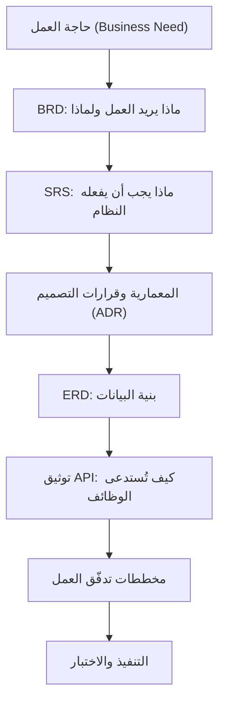
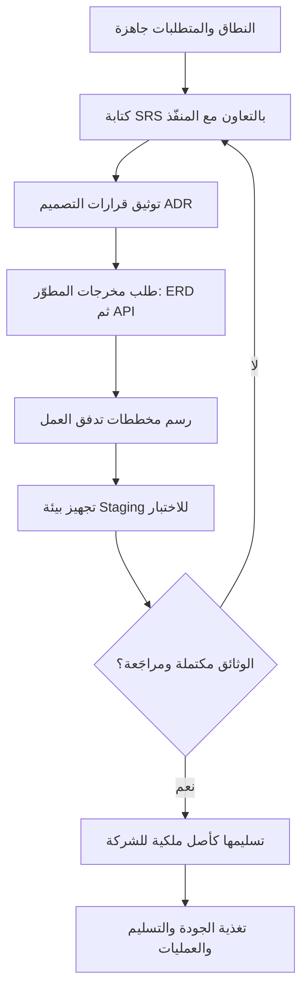

# 09 · التوثيق التقني

> [!abstract] ماذا ستتعلّم هنا
> - **ما دورك أنت** في هذه المرحلة، ومَن يكتب كل وثيقة فعلًا.
> - **سلسلة الوثائق**: من حاجة العمل إلى التنفيذ، وأيّها يسبق أيًّا.
> - الفرق الدقيق بين **[[BRD]]** و**SRS** و**وثيقة التصميم (SDD/TDD)** — وهو أكثر ما يُخلط فيه.
> - كيف توثّق **واجهات البرمجة (API)** و**هيكل قاعدة البيانات (ERD)** و**قرارات التصميم (ADR)**.
> - كيف ترسم **مخططات تدفق العمل (Workflow)** بلغة Mermaid ومتى تطلبها من المطوّر.
> - كيف تجعل التوثيق **أصلًا معرفيًّا دائمًا للشركة**.
> - رؤية شاملة لدور مدير المشروع في هذه المرحلة عبر [[مدير المشاريع البرمجية الحديث]].

> [!info] دور مدير المشروع في هذه المرحلة — اقرأه قبل كل شيء
> **مدير المشروع لا يكتب معظم الوثائق التقنية بنفسه**، وإنما **يضمن وجودها**، و**يحدّد مسؤول إعدادها**، و**يراجع اكتمالها واتّساقها** مع العقد والمتطلبات، و**يجعل تسليمها جزءًا من مخرجات المشروع**.
>
> فالـ ERD يرسمه مهندس البيانات أو المطوّر، وADR يكتبه المهندس المعماري أو القائد التقني، وتوثيق API يولّده المطوّر، وSRS يكتبه محلّل النظم أو محلّل الأعمال. **ودورك أن يوجد كلٌّ منها بجودة كافية، وأن يصير مِلكًا للشركة لا معرفةً في رأس شخص.**
>
> **وهذا الفصل في حقيقته أوسع من «التوثيق»:** فهو أقرب إلى **إدارة المعرفة الهندسية (Engineering Knowledge Management)** — معمارية وقرارات وبيئات وواجهات — لا مجرّد كتابة مستندات.

---

## 🧭 المفهوم ببساطة

تخيّل أنك اشتريت سيارة فارهة، لكن الوكيل رفض أن يعطيك **دفتر الصيانة** ومخطط الأسلاك الكهربائية. أول عطل بسيط سيجعلك رهينة عنده: لا تعرف كيف بُنيت، ولا يستطيع أي ميكانيكي آخر إصلاحها. هذا بالضبط ما يحدث للمشروع البرمجي بلا توثيق تقني.

**التوثيق التقني (Technical Documentation)** هو مجموعة المستندات التي تشرح كيف بُني النظام من الداخل: بنيته (Architecture)، قاعدة بياناته، واجهاته البرمجية، وقرارات تصميمه. باختصار: هو «الخريطة الهندسية» للمنتج. مع هذه الخريطة يستطيع أي فريق تطوير آخر أن يفهم النظام، يصلحه، ويطوّره — دون العودة الإجبارية لمن بناه أول مرة.

وغياب هذه الوثائق هو أكبر مصدر لخطر **الاحتجاز التقني ([[Vendor Lock-in]])**: أن تصير الشركة معتمدة على مورّد واحد لا لجودته، بل لأن أحدًا غيره لا يفهم ما بناه. **وهذا هو التعريف الحاكم لهذا المصطلح في الفصل كلّه**، وما يأتي بعده إشارةٌ إليه لا إعادة له.

---

## 🧵 سلسلة الوثائق — أيّها يسبق أيًّا؟

أكثر ما يربك المبتدئ ليس معنى كل وثيقة، بل **موضعها من غيرها**. وهذه السلسلة تختصر ذلك:

**وقاعدة السلسلة:** كل وثيقة **مدخَلٌ** للتي بعدها لا نسخةٌ منها. فمن رسم ERD قبل أن يستقرّ SRS، رسم بنية بيانات لنظام لم يُعرف بعدُ ما يفعله — وأعاد رسمها مرّتين.

> [!tip] ترتيب هذا الفصل يتبع السلسلة لا ترقيم الملفّات
> الأرقام في العناوين أدناه هي **ترتيب الملفّات في مجلّد المشروع**، وقد رُتّبت هنا بترتيب **العمل**: من SRS إلى القرارات إلى البيانات إلى الواجهات إلى التدفّقات إلى البيئة التي تُختبر فيها. فلا تستغرب أن يأتي الملف `05` قبل الملف `02`.

---

## 🧩 قاموس سريع للمصطلحات

| المصطلح (عربي) | English | المعنى ببساطة |
|---|---|---|
| مواصفات المتطلبات البرمجية | SRS – [[Software Requirements Specification]] | وثيقة تحدّد بدقة ما يجب أن يفعله النظام وأداؤه وقيوده |
| وثيقة تصميم البرمجية | SDD / TDD | كيف سيُبنى النظام داخليًّا (للمهندسين) |
| توثيق واجهات البرمجة | API Documentation | دليل يشرح نقاط النهاية (Endpoints) ومدخلاتها ومخرجاتها |
| مخطط الكيانات والعلاقات | ERD – [[ERD\|Entity Relationship Diagram]] | خريطة جداول قاعدة البيانات والعلاقات بينها |
| سجل قرار معماري | ADR – Architecture Decision Record | تسجيل قرار تقني + سببه + البدائل المرفوضة |
| مخطط تدفق العمل | Workflow Diagram | رسم يوضّح خطوات عملية من أولها لآخرها |
| بيئة التجهيز/الاختبار | [[Staging vs Production Environment\|Staging Environment]] | نسخة مطابقة للإنتاج لاختبار الميزات قبل إطلاقها |
| البيئة الحيّة | Production | النسخة التي يستخدمها العملاء فعليًا |
| [[Vendor Lock-in\|الاحتجاز لدى المورّد]] | Vendor Lock-in | الاعتماد القسري على مورّد واحد (شُرح أعلاه) |
| متطلب وظيفي | FR – Functional Requirement | متطلب يصف وظيفة محدّدة يجب أن يؤدّيها النظام |
| مصفوفة تتبّع المتطلبات | RTM – [[RTM\|Requirements Traceability Matrix]] | جدول يربط كل متطلب بمعيار قبول وحالة اختبار لتتبّعه |
| نقطة اتصال واحدة | SPOC – [[SPOC\|Single Point of Contact]] | شخص واحد مسؤول عن التواصل حول موضوع محدّد لتفادي التشتّت |
| هدف زمن التعافي / هدف نقطة التعافي | RTO / RPO | RTO: كم من الوقت مسموح حتى يعود النظام بعد عطل. RPO: كم من البيانات مسموح فقدانه (منذ آخر نسخة احتياطية) |

---

## 👥 من يكتب ماذا؟ ودور مدير المشروع في كلٍّ منها

| الوثيقة | يكتبها عادةً | يعتمدها | ودورك أنت |
| --- | --- | --- | --- |
| **SRS** | محلّل النظم أو محلّل الأعمال | مالك المنتج والمنفّذ | أن توجد، وأن يكون كل متطلب فيها **قابلًا للاختبار** |
| **ADR** | المهندس المعماري أو القائد التقني | القائد التقني | أن تُعقد الجلسة، وأن يُسجَّل **سبب** كل قرار وبدائله |
| **ERD** | مهندس البيانات أو المطوّر | القائد التقني | أن تُسلَّم بصيغة قابلة للفتح لا صورة، وأن تُحدَّث |
| **توثيق API** | المطوّر (غالبًا مولَّد آليًّا) | القائد التقني | أن يكون **مخرَجًا تعاقديًّا** مربوطًا بدفعة |
| **تدفّقات العمل** | محلّل الأعمال مع المطوّر | مالك المنتج | أن تكشف الثغرات قبل البرمجة لا بعدها |
| **بيئة Staging** | مهندس التشغيل (DevOps) | القائد التقني | أن توجد قاعدة صريحة: لا شيء يصل الإنتاج قبل المرور بها |

**والخلاصة في سطر:** أنت **لا تُنتج** هذه الوثائق، بل **تُنتج وجودها** — بالعقد، وبالمراجعة، وبربطها بالتسليم.

---

## ⛓️ لماذا تأتي هنا وتقود للتالية

هذه المرحلة تعتمد على مخرجات سبقتها: **النطاق والمتطلبات** ([[02 - النطاق والمتطلبات|النطاق]] و[[11 - User Stories|قصص المستخدم]]) تحدّد «ماذا» يريد العمل، وقرارات **التصميم** توضّح «كيف». بدون نطاق واضح، تصبح وثيقة SRS مجرد تخمين. كما تتطلّب تعاونًا وثيقًا مع المنفّذ لأنه صاحب المعرفة التقنية الفعلية.

وتغذّي هذه المرحلة ما بعدها: **الجودة والاختبار** ([[05 - الجودة والاختبار]]) تبني حالات الاختبار من متطلبات SRS ومعايير القبول، و**التسليم** ([[07 - التسليم والقانوني]]) يشترط تسليم هذه الوثائق كمخرَج إلزامي، و**العمليات** ([[11 - العمليات]]) تعتمد عليها في الصيانة. باختصار: التوثيق التقني هو الجسر بين «فكرة المشروع» و«استمراريته».

---

## 📊 مخطّط سير العمل

---

## 📂 مستندات هذه المرحلة — واحدًا واحدًا

📂 مستندات هذه المرحلة (في مستودع المشروع)

### 5) وثيقة مواصفات المتطلبات (SRS)

> [!info] ما هو ولماذا
> تجيب عن سؤال واحد: **«ما الذي يجب أن يفعله النظام؟»** — فتصف الوظائف، والمتطلبات غير الوظيفية (أداء وأمان وتوافر)، والقيود، والواجهات الخارجية. وهي **عقد بين أصحاب المصلحة والمنفّذ** على السلوك المطلوب، لا على طريقة بنائه.

> [!warning] فرقٌ يُخلط فيه كثيرًا — وثلاث وثائق لا اثنتان
> | الوثيقة | تجيب عن | لمن تُكتب |
> | --- | --- | --- |
> | **BRD** | **لماذا** نبني، وما الذي يريده العمل | الإدارة وأصحاب المصلحة |
> | **SRS** | **ماذا** يجب أن يفعل النظام (وظائف · قيود · متطلبات غير وظيفية · واجهات) | أصحاب المصلحة والمنفّذ معًا |
> | **SDD / TDD** | **كيف** سيُبنى داخليًّا (المعمارية · الوحدات · الخوارزميات) | المهندسون |
>
> **وما يقع فيه أكثر النصوص** أن يُقال إن SRS تصف «كيف سيُبنى النظام تقنيًّا» — وهذا وصف **وثيقة التصميم** لا وثيقة المتطلبات. والمرجع الحاكم هنا **ISO/IEC/IEEE 29148:2018** (خلف IEEE 830)، وفيه أن مواصفات المتطلبات تصف **ما يجب أن يتحقّق** لا تفاصيل التنفيذ الداخلي.

- **📥 من أين تجمع معلوماته:** من BRD ونطاق المشروع، وبالتعاون مع المنفّذ في القيود التقنية (تكاملات، استضافة)، ومن المتطلبات التنظيمية ([[PDPL]]).
- **🛠️ كيف ترتّبه:** أقسام مرقّمة هرميًا مع جداول لكل فئة، **وكل متطلب غير وظيفي مقيس برقم**، وكل متطلب وظيفي له معرّف يُتتبَّع في RTM.
- **🎯 فائدته:** يسدّ الفجوة بين ما فُهم وما بُني (قيّم التحليل التفصيلي الحالي بـ 3/10)، ويصبح مرجع الاختبار والتسليم.
- **الملف:** «وثيقة المتطلبات التقنية SRS»

> [!example] من عافية
> صُحّح ادعاء الامتثال: المرجع الفعلي في السعودية هو **PDPL** وليس HIPAA، ويُفضّل استضافة البيانات داخل المملكة. وحُدّدت تكاملات واقعية: Zoom، بوابة دفع تدعم مدى، SMS، بريد.

### 7) قالب SRS الشامل ومواصفاته

> [!info] ما هو ولماذا
> قالب SRS احترافي قابل لإعادة الاستخدام في أي مشروع، ووثيقة مواصفات تصف بنيته لإعادة توليده بالذكاء الاصطناعي. جوهره: كتابة كل متطلب كـ **حالة استخدام (Use Case)** بحالة طبيعية واستثنائية.

- **📥 من أين تجمع معلوماته:** من تحليل مستندات SRS احترافية، وإضافات الإدارة الحديثة (SPOC، RTM، [[RTO and RPO|RTO/RPO]]).
- **🛠️ كيف ترتّبه:** أقسام بالترتيب: غلاف، أصحاب مصلحة، تعريفات، مقدمة، وصف عام، تحليل النظام، خصائص النظام، ملاحق.
- **🎯 فائدته:** يرفع جودة SRS ويجعله موحّدًا وقابلًا للتتبّع عبر RTM.
- **الملفات:** «قالب SRS الشامل» · «مواصفات قالب SRS»

> [!example] من عافية
> يكمّل القالب المبسّط بتفصيل أعمق، خاصة في حالات الاستخدام (Happy Path مقابل Exceptions)، وربط كل FR بمعيار قبول وحالة اختبار في RTM.

### 6) قرارات تصميم النظام (System Design / ADR)

> [!info] ما هو ولماذا
> الأسئلة والمعايير التي تُبنى عليها القرارات التقنية (اللغة، القاعدة، بوابة الدفع، الاستضافة). كل قرار يُسجّل كـ **ADR**: قرار + سبب + بدائل مرفوضة.

- **📥 من أين تجمع معلوماته:** من المنفّذ عبر جلسة تحقّق مبنية على 5 معايير حاكمة، ومن قيود السوق والامتثال.
- **🛠️ كيف ترتّبه:** لكل قرار بطاقة ADR موحّدة (السياق/القرار/البدائل/الانعكاسات).
- **🎯 فائدته:** يمنع القرارات العشوائية «لأن المطوّر اعتاد عليها»، ويحفظ سبب كل قرار للمستقبل — **فالقرار الذي نُسي سببه يُعاد فتحه كل عام**.
- **الملف:** «قرارات تصميم النظام System Design»

> [!example] من عافية
> بُرزت خمسة قرارات حرجة: هل تدعم بوابة الدفع **مدى**؟ هل الاستضافة داخل السعودية (لأجل PDPL)؟ هل التطبيق API-first؟ كيف تُؤمّن البيانات الصحية؟ قالب جاهز أم تطوير من الصفر؟

### 3) هيكل قاعدة البيانات (ERD)

> [!info] ما هو ولماذا
> مخطط يوضّح جداول قاعدة البيانات والعلاقات بينها. بدونه تصبح صيانة النظام شبه مستحيلة، وتبقى الشركة رهينة المنفّذ (الاحتجاز التقني).

- **📥 من أين تجمع معلوماته:** من المنفّذ (المخطط البصري، ملف SQL، الفهارس والمفاتيح، استراتيجية النسخ الاحتياطي).
- **🛠️ كيف ترتّبه:** جدول بالكيانات الرئيسية + علاقاتها، ثم مخطط ERD بصري بأداة مثل dbdiagram.io أو MySQL Workbench.
- **🎯 فائدته:** يفهم أي مطوّر جديد بنية البيانات فورًا، ويسهّل التطوير والتدقيق الأمني.
- **الملف:** «هيكل قاعدة البيانات ERD»

> [!example] من عافية
> استُخلصت الكيانات من الأنظمة السبعة في النطاق: users، vendors، bookings، zoom_meetings، subscriptions، payments، courses، jobs وغيرها، مع مخطط علاقات نصّي يُستبدل لاحقًا بمخطط بصري من المنفّذ.

### 2) توثيق واجهات البرمجة (API Documentation)

> [!info] ما هو ولماذا
> دليل يشرح كل نقطة نهاية (Endpoint) في النظام: المسار، النوع (POST/GET)، المدخلات، المخرجات، وأكواد الأخطاء. ضروري للصيانة المستقبلية وأي تطوير لاحق (تطبيق جوال مثلًا).

- **📥 من أين تجمع معلوماته:** يملؤه المطوّر (المنفّذ)، ويُطلب كمخرَج إلزامي ضمن التسليم (SOW).
- **🛠️ كيف ترتّبه:** نموذج موحّد لكل Endpoint + جدول شامل بكل النقاط المطلوبة وحالتها. يُفضّل توليده تلقائيًا بأدوات مثل Scribe أو L5-Swagger (OpenAPI) في مشاريع Laravel.
- **🎯 فائدته:** يحرّر الشركة من الاعتماد على المطوّر الأصلي، ويسرّع أي دمج أو تطوير لاحق.
- **الملف:** «توثيق API»

> [!example] من عافية
> حُدّد Base URL و«JSON» كصيغة، ونُبّه إلى نقص **حدّ معدّل الطلبات (Rate Limiting)** في العرض. أُدرجت قائمة نقاط نهاية واقعية: تسجيل دخول، حجوزات، رابط Zoom، مدفوعات، وظائف، بحث.

### 4) مخططات تدفق العمل (Workflow)

> [!info] ما هو ولماذا
> رسوم توضّح كيف تسير العمليات الأساسية خطوة بخطوة (حجز، تحقّق، دفع، توظيف). تمنع سوء تفسير المطوّر للمتطلبات.

- **📥 من أين تجمع معلوماته:** من فهم رحلة المستخدم في المتطلبات + جلسات مع المنفّذ لتأكيد التدفق الفعلي.
- **🛠️ كيف ترتّبه:** مخططات بصيغة Mermaid النصية (قابلة للنسخ والتعديل والحفظ في Git).
- **🎯 فائدته:** لغة مشتركة بين الإدارة والمطوّر تختصر الشرح وتكشف الثغرات (مثل نقطة [[KYC]]).
- **الملف:** «مخطط تدفق العمل Workflow»

> [!example] من عافية
> رُسمت أربعة تدفّقات: حجز موعد افتراضي، تسجيل المزوّد والتحقّق (KYC)، الدفع والاشتراك، ونشر وظيفة والتقديم. ونُبّه إلى ضرورة تأكيد نقاط ناقصة: KYC، ومراقبة المحتوى، والنزاعات والاسترداد.

### 1) بيئة الاختبار (Staging)

> [!info] ما هو ولماذا
> وثيقة تحدّد البيئات الثلاث (Development / Staging / Production) وقواعد الانتقال بينها. هدفها: ألا تُختبر أي ميزة على النسخة الحيّة مباشرة، وأن يتوفّر مكان آمن لاختبار القبول ([[UAT]]).

- **📥 من أين تجمع معلوماته:** من المنفّذ (روابط البيئات، طريقة النشر Deployment، من يملك صلاحية النشر) ومن اتفاقية العمل ([[SOW]]).
- **🛠️ كيف ترتّبه:** جدول للبيئات الثلاث، قائمة تحقّق لمتطلبات Staging، جدول حسابات اختبار (مزوّد/عميل/مدير) مع حفظ كلمات المرور في مدير كلمات مرور آمن.
- **🎯 فائدته:** يمنع الأعطال أمام العملاء، ويجعل اختبار القبول ممكنًا، ويحمي خصوصية البيانات (بيانات وهمية فقط).
- **الملف:** «بيئة الاختبار Staging»

> [!example] من عافية
> أشار التحليل إلى غياب مرحلة UAT في العرض الأصلي، وأن بيئة Staging شرط أساسي لها. لذلك حُدّدت ثلاث بيئات وقاعدة صريحة: «أي ميزة تمرّ عبر Staging قبل Production» مع حسابات اختبار للأدوار الثلاثة.

> [!note] ملفات مرافقة بصيغ أخرى (تُذكر بالاسم فقط)
> - `09-وثيقة-SRS-عافية-معبأة.doc` — نسخة SRS معبأة كاملة بصيغة Word.
> - `09-وثيقة-SRS-عافية-معبأة.html` — نفس الوثيقة المعبأة بصيغة HTML.

---

## ⏱️ إدارة وقت هذه المهمة

| حجم المشروع | المدة التقريبية (دوليًا) |
|---|---|
| صغير | أيام (SRS مختصر + توثيق API أساسي) |
| متوسط | أسبوع إلى أسبوعين (SRS كامل + ERD + ADR + تدفقات) |
| كبير | أسابيع إلى أشهر (توثيق مستمر يتطوّر مع كل إصدار) |

**من يُنتج المستند وكيف يتعاونون:** انظر جدول **«من يكتب ماذا؟»** أعلاه. وآلية التعاون واحدة في كل الوثائق: جلسة تحقّق ← المختصّ يعبّئ ← مدير المشروع يراجع ويعيد ← اعتماد ← ربط بالتسليم.

**أي ملفات تراجع:** راجع دائمًا مقابل [[02 - النطاق والمتطلبات|النطاق]] (هل غطّى SRS كل المتطلبات؟)، ومقابل معايير القبول ([[05 - الجودة والاختبار]])، ومقابل [[07 - التسليم والقانوني|بنود التسليم]] (هل هذه المخرجات مشترطة في العقد؟).

**صيغ الملفات:**

| نوع المستند | الصيغة المناسبة |
|---|---|
| السجلات (نقاط النهاية، الكيانات، حالة المخرجات) | Excel / CSV |
| الأدلة والقوالب (SRS، ADR، Workflow) | Word / Markdown |
| الوثائق الرسمية للتسليم | PDF |
| المخططات (ERD، Workflow) | Mermaid (نص) + صورة PNG/SVG |

> [!warning] الدقة قبل السرعة
> التوثيق التقني وثيقة مرجعية طويلة العمر. خطأ فيها يتكرّر في كل صيانة لاحقة. راجِع بدقّة ولا تتعجّل الاعتماد.

---

## 🌐 ما تقوله المعايير والممارسات الحديثة

> [!info] فرّق بين الثلاثة قبل أن تقرأ
> ما يلي ثلاثة أنواع لا نوع واحد: **معيار** منشور من جهة معيارية، و**ممارسة** واسعة الانتشار بلا صفة رسمية، و**توصية** اجتهادية. والخلط بينها هو ما يجعل الفرق تُلزم نفسها بما ليس ملزِمًا، وتتساهل فيما هو ملزم.

> [!quote] 📏 معيار
> **ISO/IEC/IEEE 29148:2018** — هندسة المتطلبات، وهو خلَف **IEEE 830**. ومنه: أن تكون المتطلبات **غير غامضة** و**قابلة للتحقّق** و**متتبَّعة**، وأن تصف **ما يجب أن يتحقّق** لا تفاصيل التنفيذ. ويقابله في التصميم **IEEE 1016** لوثيقة تصميم البرمجية، وفي وصف المعمارية **ISO/IEC/IEEE 42010**.

> [!quote] 🛠️ ممارسات واسعة الانتشار (لا معايير)
> - **[[Docs as Code]]:** تُكتب الوثائق بلغة Markdown، وتُحفظ في Git، وتُراجَع في طلبات الدمج (PR). **ممارسة هندسية شائعة جدًّا، وليست معيارًا رسميًّا.**
> - **سجلات القرار المعماري (ADR):** أسلوب متداول لحفظ «لماذا» اتُّخذ كل قرار، انتشر من مقالة لمايكل نايجارد ثم صار عرفًا — لا مواصفة.
> - **Mermaid** لغةً افتراضية للمخططات النصّية لأنها تعيش مع الكود وتُراجَع معه.
> - **OpenAPI** صيغةً شائعة لتوليد توثيق API آليًّا.

> [!quote] 💡 توصيات عملية
> - توثيق API يُكتب **لمستهلكه**، وSRS **لأصحاب المصلحة**، ووثيقة التصميم **للمهندسين** — ومن كتب الثلاثة بلسان واحد أضاع الثلاثة.
> - اجعل تحديث الوثيقة جزءًا من **تعريف الاكتمال** لكل إصدار، وإلّا تخلّفت عن الكود خلال أشهر.

يرتبط هذا مباشرة بـ [[مدير المشاريع البرمجية الحديث|مثلث كفاءات PMI]]: **المعرفة التقنية** (فهم SRS وERD)، و**القيادة** (إدارة التعاون مع المنفّذ)، و**إدارة الأعمال الاستراتيجية** (تحويل التوثيق إلى أصل يحمي استثمار الشركة).

---

## ➕ لإكمال الصورة — تحسينات مقترحة

> [!todo] ما ينقص مقارنة بالمعايير وكيف نكمله
> - **سجل قرار معماري مستقل (ADR):** القالب موجود داخل ملف قرارات التصميم، لكن يُفضّل فصله كأداة تعليمية قائمة بذاتها وتطبيقه فعليًا لكل قرار حرج. راجع الوثيقة المكمّلة: [[سجل قرار معماري (ADR)]].
> - **لا وثيقة تصميم (SDD/TDD) مستقلّة:** الفصل فيه SRS وADR، ولا وثيقة تصف **كيف** بُني النظام داخليًّا — وهي ما يحتاجه فريق يرث الشيفرة.
> - **دفتر تشغيل (Runbook):** خطوات النشر والتعافي عند الأعطال — يُغطّى في مرحلة [[11 - العمليات]].
> - **مصفوفة تتبّع المتطلبات (RTM):** لربط كل FR بمعيار قبول وحالة اختبار — تُدار مع [[02 - النطاق والمتطلبات]] و[[05 - الجودة والاختبار]].
> - **إدارة المخاطر التقنية:** توثيق مخاطر مثل فشل بوابة الدفع أو تسرّب البيانات — راجع [[19 - Risk Management]].
> - **معايير الجودة غير الوظيفية:** ربط الأمان والأداء بمعايير [[20 - Quality Management]].
> - **تصنيف حساسية الوثائق:** ختم كل وثيقة (داخلي/سري) وضبط من يصل إليها، خاصة مفاتيح API وحسابات الاختبار.

---

## 🎬 سيناريوهان

> [!success] سيناريو صحيح
> **سلمى**، مديرة المشروع، اشترطت في العقد تسليم توثيق API وERD كمخرَج إلزامي، وعقدت جلسة ADR مع المنفّذ حسمت فيها أن بوابة الدفع يجب أن تدعم مدى وأن الاستضافة داخل السعودية. حين قرّرت الشركة لاحقًا تغيير المطوّر، استلم الفريق الجديد الوثائق وفهم النظام خلال أيام. النتيجة: انتقال سلس بلا انقطاع خدمة، وشركة تملك نظامها فعليًا.

> [!failure] سيناريو خاطئ
> **فهد**، مدير مشروع مستعجل، اكتفى بوعد شفهي من المطوّر: «الكود يوثّق نفسه». لم يطلب ERD ولا توثيق API، ولم توجد بيئة Staging. عند أول عطل بعد ستة أشهر اختفى المطوّر، ولم يفهم أحد بنية القاعدة. اضطرت الشركة لإعادة بناء أجزاء من النظام من الصفر بتكلفة مضاعفة وتأخّر شهور. النتيجة: احتجاز تقني كامل وخسارة ثقة العميل.

---

## 🧩 قرارات تفاعلية (فكّر ثم افتح)

> [!question]- المنفّذ يرفض تسليم توثيق API قائلًا «الكود واضح». ماذا تفعل؟
> أ) تقبل لتجنّب التأخير — الكود فعلًا موجود.
> ب) تشترط التوثيق كمخرَج إلزامي مربوط بدفعة التسليم في العقد.
> ج) تكلّف موظفًا عندك بقراءة الكود وكتابته لاحقًا.
> **✅ الأفضل: (ب).**
> **لماذا؟** التوثيق أصل تملكه الشركة، وربطه بدفعة مالية يضمن تسليمه. اعتماد الكود وحده يبقيك رهينة المطوّر، وتكليف موظف بقراءة كود لم يكتبه بطيء ومكلف. السيناريو المثالي: بند صريح في SOW «تسليم توثيق API (OpenAPI) شرط لاستحقاق الدفعة النهائية»، مع توليده تلقائيًا عبر أداة مثل Scribe.

> [!question]- أثناء كتابة SRS، تجد متطلب أداء مكتوبًا «يجب أن يكون النظام سريعًا». كيف تتعامل؟
> أ) تتركه كما هو — المعنى واضح.
> ب) تحذفه لأنه غير مهم.
> ج) تعيد صياغته كرقم قابل للقياس والاختبار.
> **✅ الأفضل: (ج).**
> **لماذا؟** «سريع» غير قابل للاختبار، وكل طرف يفسّره بطريقة. ومعيار 29148 يشترط أن يكون كل متطلب **قابلًا للتحقّق**. السيناريو المثالي: «زمن تحميل الصفحة < 3 ثوانٍ عند 500 مستخدم متزامن» — الآن يستطيع فريق الاختبار التحقّق منه موضوعيًا.

> [!question]- المطوّر يقترح استضافة بيانات عافية على خادم خارج السعودية لأنه «أرخص وأسرع». ماذا تقرّر؟
> أ) توافق لتوفير التكلفة — الأداء أهم.
> ب) تشترط استضافة البيانات داخل السعودية وتوثّق القرار كـ ADR.
> ج) تترك القرار للمطوّر لأنه صاحب الخبرة التقنية.
> **✅ الأفضل: (ب).**
> **لماذا؟** نظام حماية البيانات السعودي (PDPL) يوجّه إلى حفظ بيانات المستخدمين داخل المملكة، والمخالفة خطر قانوني لا توفير. سجّل القرار كـ ADR مع سببه وبدائله المرفوضة حتى لا يُعاد فتحه لاحقًا بلا مبرّر.

---

## 🧠 أسئلة تفكير ناقد وعصف ذهني (بلا إجابة واحدة)

> [!question] للتأمّل
> - كيف توازن بين توثيق «كافٍ» يحمي الشركة وتوثيق «مفرط» يبطئ المشروع ويصبح عبئًا للتحديث؟
> - إذا كان المشروع رشيقًا (Agile) ويتغيّر باستمرار، فكيف تبقي SRS وERD محدّثين دون أن يتحوّل التوثيق إلى عمل لا ينتهي؟
> - من يجب أن يملك المسؤولية النهائية عن دقّة التوثيق: مدير المشروع أم المطوّر؟ ولماذا؟
> - هل يمكن للذكاء الاصطناعي أن يولّد ويصون التوثيق التقني؟ وأين حدود الاعتماد عليه؟

> [!tip] إطار الإجابة
> 1. **حدّد الهدف من الوثيقة:** من قارئها؟ وما القرار الذي ستدعمه؟ (توثيق بلا قارئ = هدر).
> 2. **وازن الكلفة مقابل الخطر:** كم يكلّف غيابها عند أول صيانة أو تغيير منفّذ؟
> 3. **اربطها بالعملية:** اجعل تحديث الوثيقة جزءًا من تعريف «تم» ([[Definition of Done]]) لكل إصدار.
> 4. **اختبر الافتراض:** جرّب أن يفهم شخص خارجي النظام من الوثيقة وحدها — إن نجح فهي كافية.
> مثال اتجاه: في مشروع رشيق، وثّق ما يستقرّ (المعمارية، ERD) بعمق، وابقِ التفاصيل المتغيّرة خفيفة ومولّدة تلقائيًا.

---

## ❓ نقاط للمراجعة (استرجاع)

> [!question]- ما الفرق بين BRD وSRS وSDD؟
> **BRD** يجيب عن **لماذا** نبني وما يريده العمل. **وSRS** يجيب عن **ماذا** يجب أن يفعل النظام (وظائف وقيود ومتطلبات غير وظيفية وواجهات). **وSDD/TDD** يجيب عن **كيف** سيُبنى داخليًّا. والخطأ الشائع أن يُنسب إلى SRS وصفُ «كيف» — وهو وصف وثيقة التصميم.

> [!question]- ما دور مدير المشروع في التوثيق التقني؟
> **لا يكتب معظمه**، بل يضمن وجوده، ويحدّد مسؤول إعداده، ويراجع اكتماله واتّساقه مع العقد والمتطلبات، ويجعل تسليمه مخرَجًا من مخرجات المشروع مربوطًا بدفعة.

> [!question]- ما ترتيب سلسلة الوثائق، ولماذا يهمّ؟
> حاجة العمل ← BRD ← SRS ← المعمارية وADR ← ERD ← توثيق API ← تدفّقات العمل ← التنفيذ. **ويهمّ** لأن كل وثيقة مدخَلٌ للتي بعدها: فمن رسم ERD قبل استقرار SRS رسم بنية بيانات لنظام لم يُعرف بعدُ ما يفعله.

> [!question]- ما البيئات الثلاث ولماذا نفصلها؟
> Development (تطوير)، Staging (اختبار/UAT)، Production (حيّة). الفصل يمنع اختبار الميزات على العملاء مباشرة ويحمي البيانات الحقيقية.

> [!question]- لماذا يُعدّ توثيق API وERD حماية من الاحتجاز التقني؟
> لأنهما يتيحان لأي فريق تطوير آخر فهم النظام وصيانته دون العودة الإجبارية للمنفّذ الأصلي.

> [!question]- ما هو ADR وما مكوّناته؟
> سجل قرار معماري: يوثّق القرار + سياقه + البدائل المرفوضة + الانعكاسات، لحفظ «لماذا» اتُّخذ القرار — فالقرار الذي نُسي سببه يُعاد فتحه كل عام.

> [!question]- لماذا يجب أن يكون كل متطلب غير وظيفي مقيسًا برقم؟
> لأن الوصف الغامض («سريع/آمن») غير قابل للتحقّق، ومعيار ISO/IEC/IEEE 29148 يشترط قابلية التحقّق. الرقم («< 3 ثوانٍ») يجعل الاختبار موضوعيًا.

> [!question]- أيّ ممّا يلي معيار وأيّه ممارسة: ISO 29148 · Docs as Code · ADR؟
> **ISO/IEC/IEEE 29148 معيار** منشور. **وDocs as Code وADR ممارستان** واسعتا الانتشار بلا صفة رسمية. والتفريق مهمّ: الأولى يُحتجّ بها، والأخريان تُقترحان ويُبيَّن نفعهما.

> [!question]- في سياق عافية، لماذا PDPL وليس HIPAA؟
> لأن PDPL هو نظام حماية البيانات المعتمد قانونيًا في السعودية، بينما HIPAA أمريكي؛ الادعاء بالامتثال له كان سطحيًا وغير دقيق.

---

## 💼 من أسئلة المقابلات

> [!question]- ما الفرق بين SRS وTechnical Design Document (TDD/SDD)؟
> **SRS** يحدّد «ماذا» يجب أن يفعل النظام (متطلبات لأصحاب المصلحة، لا يصف التنفيذ الداخلي)، بينما **TDD/SDD** يحدّد «كيف» سيُنفّذ تقنيًا (للمهندسين). SRS عقد بين الأطراف، وTDD مخطط داخلي للتطوير.

> [!question]- كيف تضمن بقاء التوثيق محدّثًا في مشروع طويل العمر؟
> بتبنّي ممارسة «Docs as Code»: حفظ الوثائق في Git، ومراجعتها في PR، وجعل تحديثها جزءًا من تعريف «تم» لكل إصدار، وأتمتة ما يمكن أتمتته (توثيق API عبر OpenAPI/Swagger).

> [!question]- ما دور ADR في سير العمل الهندسي؟
> يوثّق القرارات المعمارية وأسبابها والبدائل المرفوضة، ويشاركها مع الفريق لضمان الشفافية ووضوح «لماذا» على المدى الطويل، ويُحفظ في نظام تحكم بالإصدارات لتتبّع تطوّره.

> [!question]- لمن تكتب توثيق API، ولماذا يختلف عن SRS؟
> توثيق API يُكتب **لمستهلكه** (المطوّر الذي سيستدعيه)، فيركّز على المدخلات والمخرجات والأخطاء. أما SRS فيُكتب لأصحاب المصلحة ويصف المتطلبات لا التنفيذ.

> [!tip] إطار STAR
> في أسئلة الخبرة، أجب بإطار STAR: **Situation** (الموقف) ← **Task** (المهمة) ← **Action** (ما فعلته) ← **Result** (النتيجة بالأرقام). مثال: «واجهنا رفض المنفّذ لتسليم ERD (S)، مهمتي حماية استمرارية الشركة (T)، ربطت التسليم بدفعة في العقد وعقدت جلسة توثيق (A)، فتسلّمنا مخططًا كاملًا سرّع الصيانة لاحقًا (R)».

---

## 🧪 من مبتدئ إلى محترف

> [!success] مسار التدرّج
> - **مبتدئ:** تعرف الفرق بين BRD وSRS وSDD، وتقرأ مخطط ERD بسيطًا، وتفهم لماذا نفصل بيئة Staging عن Production.
> - **متوسّط:** تراجع SRS كاملًا بمتطلبات مقيسة، وترسم تدفقات Mermaid، وتفحص توثيق API الذي يسلّمه المطوّر، وتطلب مخرجات التسليم في العقد.
> - **محترف:** تقود جلسات ADR وتحسم القرارات الحرجة (مدى/PDPL/الاستضافة)، وتبني نظام «Docs as Code» يبقي التوثيق حيًّا، وتحوّل التوثيق إلى أصل استراتيجي يحمي استثمار الشركة ويحرّرها من أي منفّذ.

---

## 🔗 ربط بالمفاهيم

- [[02 - النطاق والمتطلبات]]
- [[05 - الجودة والاختبار]]
- [[07 - التسليم والقانوني]]
- [[11 - User Stories]]
- [[11 - العمليات]]
- [[19 - Risk Management]]
- [[20 - Quality Management]]
- [[مدير المشاريع البرمجية الحديث]]

> [!note] تنبيه على الترقيم
> يوجد ملفان يحملان الرقم «11» ضمن نظامَي ترقيم مختلفين: [[11 - User Stories]] ملف مرجعي عام، بينما [[11 - العمليات]] هو مرحلة دراسة الحالة التالية. الرقم متطابق لكن السياق مختلف.

---

## 📌 بطاقة مرجعية سريعة

| العنصر | الخلاصة |
|---|---|
| الهدف | خريطة هندسية تحمي الشركة من الاحتجاز التقني |
| دورك أنت | لا تكتبها — بل تضمن وجودها ومسؤولها ومراجعتها وتسليمها |
| السلسلة | حاجة عمل ← BRD ← SRS ← معمارية/ADR ← ERD ← API ← تدفّقات ← تنفيذ |
| المخرجات الأساسية | SRS · ADR · ERD · API Docs · Workflow · Staging |
| المعيار مقابل الممارسة | ISO/IEC/IEEE 29148 **معيار** · Docs as Code وADR **ممارستان** |
| خصوصية عافية | PDPL لا HIPAA · بوابة تدعم مدى · استضافة داخل السعودية |
| القاعدة الذهبية | متطلب غير قابل للتحقّق = متطلب غامض |

> [!tip] قواعد ذهبية
> - اجعل كل مخرَج تقني **مشروطًا في العقد** ومربوطًا بدفعة — لا وعود شفهية.
> - **الدقة قبل السرعة**: الوثيقة تُقرأ مرات، والخطأ يتكرّر في كل صيانة.
> - وثّق «لماذا» لا «ماذا» فقط — سجّل قرارات ADR وبدائلها المرفوضة.

---

## 🧠 كيف يفكر مدير المشروع في هذه المرحلة؟

ما سبق **ما يفعله** مدير المشروع في التوثيق. وهذا **كيف يفكّر** — وأربعة أسئلة تدور في رأسه أمام كل وثيقة:

1. **من يقرأ هذه الوثيقة؟** فالوثيقة بلا قارئ محدَّد تُكتب بلسانٍ لا يناسب أحدًا: SRS بلغة مهندس، وتوثيق API بلغة إدارة. **ومن لم يعرف قارئه لم يعرف ماذا يكتب ولا ماذا يحذف.**
2. **ماذا يحدث لو غاب هذا المستند يوم يرحل من كتبه؟** فهذا هو مقياس أهميّته الحقيقيّ، لا اكتماله الشكليّ.
3. **هل هذا المتطلب قابل للتحقّق؟** فما لا يستطيع مختبِرٌ أن يحكم عليه بـ«تحقّق» أو «لم يتحقّق»، لن يُبنى كما تصوّرتَه.
4. **هل تسليم هذه الوثيقة مشروط في العقد؟** فالوثيقة الموعودة شفهيًّا تُسلَّم آخر ما تُسلَّم، أو لا تُسلَّم — **وما لم يُربط بدفعة يُربط بالنيّة، والنيّة تتغيّر بتغيّر الأولويات.**

> [!warning] المعيار العملي
> أعطِ وثائقك لمطوّر **من خارج المشروع** واسأله: هل تستطيع تشغيل هذا النظام وتعديله بلا أن تكلّم أحدًا؟ فإن احتاج إلى مكالمة واحدة، فالتوثيق ناقص عند تلك النقطة بالذات. **والتوثيق لا يُقاس بعدد صفحاته بل بعدد الأسئلة التي أغنى عنها.**

---

> [!quote] المراجع الأولى (وثائق معيارية)
> - **ISO/IEC/IEEE 29148:2018** — هندسة المتطلبات ومواصفات المتطلبات (خلف IEEE 830).
> - **IEEE 1016** — وصف تصميم البرمجية (SDD).
> - **ISO/IEC/IEEE 42010** — وصف معمارية النظم والبرمجيات.

> [!quote] مصادر مساندة (أمثلة وممارسات)
> - [Engineering Documentation: Best Practices Guide for 2026 — Slite](https://slite.com/learn/engineering-documentation)
> - [Software Requirement Specification (SRS) Document: 2026 Guide — icoderz](https://www.icoderzsolutions.com/blog/software-requirement-specification-srs-document/)
> - [SRS Document vs SDD Document: The Complete 2026 Guide — Third Rock Techkno](https://www.thirdrocktechkno.com/blog/software-design-document-vs-software-requirement-specification/)
> - [Best Practices for Software Architecture Documentation — bool.dev](https://bool.dev/blog/detail/architecture-documentation-best-practice)
