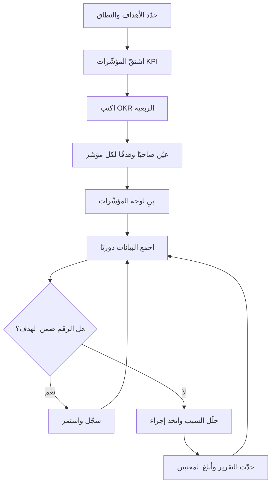

# 10 · الأداء (OKR/KPI)

> [!abstract] ماذا ستتعلّم هنا
> - الفرق العملي بين **الأهداف والنتائج الرئيسية (OKR — [[OKR|Objectives and Key Results]])** و**مؤشرات الأداء (KPI — [[KPI|Key Performance Indicator]])**، ومتى تستخدم كلًّا منهما.
> - كيف تبني **لوحة مؤشرات (Dashboard)** حيّة تربط كل مؤشر بصاحبه (Owner) وهدفه وتكراره.
> - كيف تصوغ نتيجة رئيسية (Key Result) قابلة للقياس بدل عبارات فضفاضة مثل "نحسّن".
> - كيف تربط الأداء بباقي أدوات المشروع: التقارير، الجودة، إدارة المخاطر.
> - أخطاء شائعة تُفشل أنظمة القياس، وكيف تتجنّبها في مشروع حقيقي مثل عافية.
>
> ابدأ رحلتك من الدور نفسه: [[مدير المشاريع البرمجية الحديث]].

## 🧭 المفهوم ببساطة

تخيّل أنك تقود سيّارة في رحلة طويلة. لديك **وجهة** على الخريطة ("نصل إلى الرياض قبل المغرب") — هذه هي فكرة **OKR**: أين تريد الوصول وكيف تعرف أنك اقتربت. وأمامك **لوحة القيادة (dashboard)**: عدّاد السرعة، مؤشّر الوقود، حرارة المحرّك — هذه هي فكرة **KPI**: هل السيّارة تعمل بصحّة الآن؟

الوجهة تتغيّر مع كل رحلة (كل ربع سنة). لوحة القيادة تبقى تعمل دائمًا، من أول لحظة تشغّل فيها المحرّك.

**مرحلة الأداء (OKR/KPI)** هي أن تقرّر: ما الأرقام التي ستقيسها لتعرف أن مشروعك يسير بشكل صحّي، وأنه يقترب من أهدافه الطموحة؟ ثم تبني نظامًا بسيطًا يجمع هذه الأرقام بانتظام، ويضعها أمام صاحب القرار قبل فوات الأوان. القياس ليس هدفًا في ذاته؛ هدفه أن تتّخذ قرارًا مبكّرًا بدل أن تكتشف المشكلة بعد أن تكبر.

## 🧩 قاموس سريع للمصطلحات

| المصطلح (عربي) | English | المعنى ببساطة |
|---|---|---|
| الأهداف والنتائج الرئيسية | OKR | هدف طموح + 3–5 نتائج رقمية تُثبت تحقيقه، تُراجَع كل ربع |
| مؤشّر الأداء | KPI | رقم مستمر يقيس صحّة عملية ما (سرعة، جودة، تكلفة) |
| النتيجة الرئيسية | Key Result | رقم واضح يقول "من كذا إلى كذا خلال مدة" |
| صاحب المؤشّر | Owner | الشخص المسؤول عن رقم المؤشّر وتحديثه |
| القيمة الأساس | [[Baseline]] | نقطة البداية التي نقيس منها التحسّن |
| المستهدف | Target | الرقم الذي نطمح للوصول إليه |
| هدف طموح | [[Stretch Goal]] | هدف يتجاوز المتوقّع تحقيقه بالكامل عمدًا (قاعدة تقييمه في قسم المعايير الحديثة) |
| اتفاقية مستوى الخدمة | SLA | التزام بزمن محدّد للاستجابة أو الحل |

## ⛓️ لماذا تأتي هنا وتقود للتالية

**ما تحتاجه قبل هذه المرحلة (المتطلّبات السابقة):** يجب أن يكون لديك **نطاق واضح** ومهام محدّدة (من مرحلة التخطيط)، و**تعريف الإنجاز ([[Definition of Done]])** من مرحلة الجودة، و**خط أساس** لسرعة الفريق ([[18 - Velocity]]). لا يمكنك قياس ما لم تعرّفه أولًا.

**ماذا تُغذّي المرحلة التالية؟** الأداء هو الوقود لـ**تقارير الحالة (Status Reports)** و**التواصل مع أصحاب المصلحة** ([[21 - Stakeholder Communication]]). المؤشّرات المنحرفة تُطلق **إدارة المخاطر** ([[19 - Risk Management]])، وتُغذّي **مراجعات الجودة** ([[20 - Quality Management]]) وقرارات **إعادة التخطيط**. باختصار: القياس هنا يصبح لغة اتخاذ القرار في كل مرحلة بعده.

## 📊 مخطّط سير العمل

> [!note] توضيح
> العقدة "حدّد الأهداف والنطاق" تعني أهداف الميثاق والنطاق العامة، وليست OKR الربعية. الوجهة (OKR) تُحدَّد أولًا، ثم تُشتقّ حولها المؤشّرات (KPI).

## 📂 مستندات هذه المرحلة — واحدًا واحدًا

### 1) دليل OKR و KPI

> [!info] ما هو ولماذا
> وثيقة مرجعية تشرح الفرق بين OKR و KPI، ومتى تستخدم كلًّا منهما في مشروع عافية، وتقدّم نماذج جاهزة لـ KPIs إدارة المشروع (الآن) و OKRs ما بعد الإطلاق. غايتها منع الخلط الشائع بين "الوجهة" و"لوحة القيادة".

- **📥 من أين تجمع معلوماته:**
  - من رؤية الإدارة العليا (المدير العام) للأهداف الطموحة.
  - من مدير المشروع (PM) لمؤشّرات التنفيذ.
  - من العقد و**[[ميثاق المشروع (Project Charter)|ميثاق المشروع]]** لمعايير النجاح.
  - من اجتماعات التخطيط الربعي.
- **🛠️ كيف ترتّبه:** قسّمه إلى ثلاثة أجزاء — مؤشّرات إدارة المشروع الآن، ثم OKRs بعد الإطلاق، ثم مؤشّرات تشغيلية. لكل بند: تعريف، طريقة قياس، هدف رقمي.
- **🎯 فائدته:** يوحّد فهم الفريق للقياس، ويمنع صياغة أهداف غامضة، ويحدّد التوقيت الصحيح لكل نوع من المؤشّرات.
- **مرتبط بالمفاهيم:** [[18 - Velocity]] · [[17 - Burndown Chart]] · [[20 - Quality Management]].

> [!example] من عافية
> الدليل يوصي بالبدء بـ KPIs إدارة المشروع فورًا (التزام الجدول، سرعة الإنجاز، معدّل إعادة العمل)، وتأجيل OKRs النمو الكاملة إلى ما قبل الإطلاق. مثال OKR: "إثبات قيمة المنصة في السوق السعودي" مع نتيجة "تسجيل 50 جهة صحية فعّالة خلال الربع الأول".

الملف: «01-دليل-OKR-و-KPI»

### 2) لوحة المؤشّرات

> [!info] ما هو ولماذا
> سجلّ بصيغة جدول (CSV) يحتوي كل مؤشّر مع فئته ونوعه وتعريفه وهدفه وقيمته الحالية وصاحبه وتكراره وحالته. هو "لوحة القيادة" الفعلية التي تُحدَّث دوريًا وتُقرأ في التقارير.

- **📥 من أين تجمع معلوماته:** القيم الفعلية من أدوات العمل (لوحة المهام، نظام التذاكر، تحليلات المنصة)؛ الأهداف من دليل OKR/KPI؛ أسماء الأصحاب من مدير المشروع.
- **🛠️ كيف ترتّبه:** صفوف = مؤشّرات، أعمدة = (الفئة، المؤشّر، النوع، التعريف، الهدف، القيمة الحالية، صاحب المؤشّر، التكرار، الحالة). استخدم Excel/CSV ليسهل الفرز والترشيح.
- **🎯 فائدته:** يعطي صورة لحظية عن صحّة المشروع، ويجعل المساءلة واضحة (لكل رقم صاحب)، ويكشف الانحراف مبكّرًا.
- **مرتبط بالمفاهيم:** [[16 - Task Boards]] · [[21 - Stakeholder Communication]].

> [!example] من عافية
> اللوحة تصنّف المؤشّرات إلى: إدارة المشروع، النمو، التفاعل، الإيراد، الاحتفاظ، الجودة، الدعم، وحتى SEO. مثال صف: "معدّل فشل الحجوزات — تشغيلي — حجوزات فاشلة/إجمالي — الهدف < 2% — صاحبه: تقني — أسبوعي — بعد الإطلاق".

الملف (CSV): «02-لوحة-المؤشرات»

📂 مستندات هذه المرحلة (في مستودع المشروع)

## ⏱️ إدارة وقت هذه المهمة

| حجم المشروع | الزمن التقريبي لإعداد نظام الأداء |
|---|---|
| صغير | ساعات إلى يوم — 3–5 مؤشّرات في جدول بسيط |
| متوسط | أيام إلى أسبوعان — لوحة مؤشّرات + جولة OKR ربعية |
| كبير | أسابيع إلى أشهر — أنظمة متعدّدة، تكامل مع أدوات، دورات مراجعة منتظمة |

**من يُنتج المستند وكيف يتعاونون:** عادةً يقود مدير المشروع (PM) الإعداد. يشارك المدير العام في صياغة OKR (الوجهة)، ويشارك قادة الفرق (تقني، جودة، تسويق، دعم) في تحديد مؤشّراتهم وأهدافهم. التعاون تكراري: PM يضع المسودّة → كل صاحب يراجع مؤشّره → اجتماع مواءمة قصير → اعتماد. جمع البيانات لاحقًا مسؤولية موزّعة على الأصحاب، والتجميع مسؤولية PM.

**أي ملفات تراجع:** راجع دليل OKR/KPI عند كل ربع سنة، ولوحة المؤشّرات أسبوعيًا/شهريًا حسب تكرار كل مؤشّر. راجع تعريف الإنجاز (Definition of Done) قبل احتساب "نسبة اجتياز DoD".

**صيغ الملفات:**

| الغرض | الصيغة المناسبة |
|---|---|
| سجلّ المؤشّرات / اللوحة | Excel / CSV |
| الدليل الإرشادي | Word / Markdown |
| التقرير الرسمي للإدارة | PDF |

> [!warning] الدقّة قبل السرعة
> رقم واحد خاطئ في اللوحة يقود إلى قرار خاطئ. تحقّق من مصدر البيانات وطريقة الحساب قبل النشر. مؤشّر بطيء وصحيح أفضل من مؤشّر سريع ومضلِّل.

## 🌐 ما تقوله المعايير الحديثة

> [!quote] من ممارسات 2026
> - **OKR للتغيير، KPI للصحّة:** الـ OKR تقود التحوّل والنمو (إطلاق منتج، دخول سوق)، بينما KPI تراقب استمرارية العمل اليومي (SLA، توافر الخدمة). الـ KPI يقول "أين نحن الآن"، والـ OKR يقول "إلى أين نتّجه وكم قطعنا".
> - **قاعدة 0.6–0.7:** تحقيق 60–70% من هدف طموح (stretch) علامة صحّية على أنك تمدّد الفريق. تحقيق 100% من هدف طموح يثير سؤالًا: هل كان الهدف سهلًا؟
> - **من المخرجات إلى النتائج:** المعايير الحديثة تنقلك من قياس "المهام المنجزة" (output) إلى قياس "الأثر" (outcome) مثل رضا العميل والإيراد.
> - **الأتمتة والتكامل:** أدوات 2026 تحدّث النتائج الرئيسية تلقائيًا من Jira/Asana/Slack، وتقدّم لوحات KPI وتقارير اتّجاهات عبر عدّة دورات.
> - **قلّل واختر:** 3 أهداف كحدّ أقصى للربع، و5–7 مؤشّرات جوهرية تغطّي الوقت والتكلفة والنطاق والجودة والمخاطر.
>
> هذا يتّصل مباشرةً بـ [[مدير المشاريع البرمجية الحديث|مثلث كفاءات PMI]] (الطرق + القيادة + الفطنة الاستراتيجية): القياس الجيّد هو حيث تلتقي الفطنة الاستراتيجية بالانضباط التنفيذي.

## ➕ لإكمال الصورة — تحسينات مقترحة

> [!todo] ما ينقص مقابل المعايير، وكيف تكمله
> - **عمود القيمة الأساس (Baseline) فارغ:** اللوحة تحدّد الأهداف لكن لا تسجّل نقطة البداية. أضف عمود Baseline لتقيس التحسّن الحقيقي، لا الرقم المطلق فقط.
> - **لا يوجد تعريف صريح للنتيجة الرئيسية بصيغة "من X إلى Y":** بعض النتائج مكتوبة كقيمة نهائية فقط. حسّنها إلى صيغة الفرق مع المدة الزمنية.
> - **ربط المؤشّرات بالمخاطر:** أي مؤشّر خارج الهدف يجب أن يفتح بندًا في سجلّ المخاطر. راجع [[19 - Risk Management]] لبناء هذا الجسر.
> - **ربط الأداء بالتواصل:** لا توجد قناة واضحة لعرض المؤشّرات للإدارة. اربطها بخطة التواصل عبر [[21 - Stakeholder Communication]].
> - **مؤشّرات الجودة تحتاج تعميقًا:** كثافة العيوب وتغطية الاختبار غير مذكورة. راجع [[20 - Quality Management]].
> - **مواءمة استراتيجية:** لكل KPI يجب أن يتّضح لأي OKR ينتمي. اربط كل مؤشّر بهدفه الأعلى.

## 🎬 سيناريوهان

> [!success] الطريق الصحيح
> **سلمى**، مديرة مشروع عافية، بدأت مبكّرًا: حدّدت 5 مؤشّرات إدارة مشروع فقط، وسجّلت لكل منها قيمة أساس وهدفًا وصاحبًا. راجعت اللوحة كل أسبوع في اجتماع قصير. في الأسبوع الرابع لاحظت أن "معدّل إعادة العمل" قفز من 12% إلى 22%. سألت الفريق فورًا، فاكتشفت غموضًا في متطلّبات وحدة الحجز. عالجت السبب مبكّرًا، فعاد المؤشّر إلى 13% خلال أسبوعين. النتيجة: بقي المشروع في مساره، والإدارة وثقت بتقاريرها لأنها مبنيّة على أرقام حيّة.

> [!failure] الطريق الخاطئ
> **ماجد**، مدير مشروع آخر، أنشأ لوحة ضخمة فيها 30 مؤشّرًا "ليبدو شاملًا"، بلا أصحاب وبلا قيمة أساس. لم يحدّثها إلا قبل اجتماع الإدارة بليلة، فملأ الأرقام تقديرًا. ربط OKRs الطموحة مباشرةً بمكافآت الأفراد، فبدأ الفريق يتجنّب الأهداف الصعبة. عند الإطلاق فوجئ بأن معدّل فشل الحجوزات 9% (الهدف < 2%)، لأن أحدًا لم يكن يراقبه فعلًا. النتيجة: إطلاق متعثّر، وفقدان ثقة الإدارة في كل الأرقام.

## 🧩 قرارات تفاعلية (فكّر ثم افتح)

> [!question]- الموقف: مؤشّر "الأخطاء الحرجة المفتوحة" = 3 قبل موعد الإطلاق بأسبوع. ماذا تفعل؟
> **الخيارات:** (أ) تُطلق في الموعد وتصلحها لاحقًا لأن التأخير مكلف · (ب) تؤجّل الإطلاق حتى تصبح 0 · (ج) تُطلق جزئيًا لمستخدمين محدودين.
>
> ✅ **الأفضل: (ب)** — الهدف المتّفق عليه في الدليل صريح: صفر أخطاء حرجة قبل أي إطلاق.
> **لماذا؟** الأخطاء الحرجة (Critical/High) تمسّ سلامة بيانات صحّية وثقة أوّل مستخدمين. تكلفة إطلاق فاشل أعلى بكثير من تكلفة تأجيل قصير.
> **السيناريو المثالي:** تبلّغ الإدارة فورًا بالمؤشّر ورقمه، تعرض خطة إصلاح بموعد واضح، وتؤجّل الإطلاق أيامًا معدودة مع تواصل شفّاف مع أصحاب المصلحة.

> [!question]- الموقف: الإدارة تريد ربط مكافآت الفريق بنسبة تحقيق OKRs الربعية. ما رأيك؟
> **الخيارات:** (أ) توافق لأنها تحفّز · (ب) ترفض تمامًا · (ج) تربط المكافآت بـ KPIs التشغيلية وتبقي OKRs للتطلّع.
>
> ✅ **الأفضل: (ج)** — كما ينصّ الدليل: لا تربط OKR الطموحة مباشرةً بمكافآت الأفراد.
> **لماذا؟** OKR هدفها طموح (تحقيق 70% نجاح)؛ ربطها بالمكافأة يدفع الفريق لاختيار أهداف سهلة. KPIs التشغيلية أنسب للمساءلة لأنها التزامات صحّية واضحة.
> **السيناريو المثالي:** تفصل النظامين — مساءلة على KPIs التشغيلية، وتطلّع مشترك على OKRs — وتشرح للإدارة الفرق بلغة بسيطة.

## 🧠 أسئلة تفكير ناقد وعصف ذهني (بلا إجابة واحدة)

> [!question] فكّر معنا
> - لو كان بإمكانك قياس **مؤشّر واحد فقط** لصحّة عافية قبل الإطلاق، فأيّها تختار ولماذا؟
> - متى يتحوّل المؤشّر من أداة قرار إلى "لعبة أرقام" يتلاعب بها الفريق؟ كيف تكتشف ذلك؟
> - هل يمكن أن ينجح مشروع بكل مؤشّراته خضراء ويفشل تجاريًا؟ ماذا يعني ذلك عن اختيارك للمؤشّرات؟
> - كم عدد المؤشّرات "الكثير جدًا"، ومن يقرّر متى نحذف مؤشّرًا؟

> [!tip] إطار الإجابة (4 خطوات)
> 1. **حدّد القرار أولًا:** أيّ قرار سيتغيّر بناءً على هذا الرقم؟ إن لم يتغيّر قرار، فالمؤشّر زائد.
> 2. **افحص السلوك الجانبي:** ما السلوك الذي سيحفّزه هذا المؤشّر؟ هل قد يدفع لتحسين الرقم على حساب الهدف الحقيقي؟
> 3. **وازن المخرجات مقابل النتائج:** هل تقيس نشاطًا (مهام) أم أثرًا (رضا/إيراد)؟ اسعَ للأثر.
> 4. **اختبر بالمثال:** طبّق السؤال على سيناريو عافية (مثلًا "MAU مرتفع لكن Churn 15%") وتتبّع النتيجة المنطقية.

## ❓ نقاط للمراجعة (استرجاع)

> [!question]- ما الفرق الجوهري بين OKR و KPI في جملة واحدة؟
> OKR يحدّد **الوجهة** (هدف طموح ربعي)، وKPI يقيس **الحركة والصحّة** المستمرّة. غالبًا يكون KPI جيّد "نتيجة رئيسية" داخل OKR.

> [!question]- كم هدف OKR وكم نتيجة رئيسية يُنصح بها للربع الواحد؟
> 3 أهداف كحدّ أقصى، و3–5 نتائج رئيسية لكل هدف. القلّة المركّزة أفضل من الكثرة المشتّتة.

> [!question]- ما العناصر التي يجب أن يحتويها كل صفّ في لوحة المؤشّرات؟
> الفئة، المؤشّر، النوع، التعريف/طريقة القياس، الهدف، القيمة الحالية، صاحب المؤشّر (Owner)، التكرار، الحالة.

> [!question]- لماذا لا نربط OKRs مباشرةً بمكافآت الأفراد؟
> لأنها أهداف طموحة (stretch) تحقيق 70% منها نجاح. ربطها بالمكافأة يدفع الناس لاختيار أهداف سهلة قابلة للضمان، فتفقد قيمتها التطلّعية.

> [!question]- ماذا يعني هدف "صفر أخطاء حرجة مفتوحة قبل الإطلاق"؟
> أنه لا يُسمح بإطلاق المنصة وبها أي خطأ من فئة Critical/High. هذا حدّ جودة صارم لأن المجال صحّي وحسّاس.

> [!question]- ما معنى تحقيق 0.7 على هدف طموح؟ هل هو فشل؟
> ليس فشلًا؛ بل مؤشّر صحّي على أن الهدف كان مُمدِّدًا بما يكفي. تحقيق 1.0 على هدف طموح قد يعني أن الهدف كان سهلًا.

## 💼 من أسئلة المقابلات

> [!question]- كيف تختار الـ KPIs المناسبة لمشروع جديد؟
> أبدأ من الأهداف: لكل هدف، ما الرقم الذي يثبت تحقّقه؟ أختار 5–7 مؤشّرات تغطّي الوقت والتكلفة والنطاق والجودة والمخاطر. أتأكّد أن كل مؤشّر قابل للقياس، له صاحب، وله هدف وقيمة أساس. أتجنّب المؤشّرات التي لا تغيّر قرارًا.

> [!question]- ما الفرق بين OKR و KPI، ومتى تستخدم كلًّا منهما؟
> KPI يقيس صحّة عملية مستمرّة (on-time delivery، budget variance). OKR يقيس التقدّم نحو تحسّن محدّد ضمن نافذة زمنية، وهو طموح وينتهي بانتهاء الربع. أستخدم KPI للتشغيل اليومي، وOKR للمبادرات الاستراتيجية مثل إطلاق منتج أو دخول سوق.

> [!question]- أخبرني عن مؤشّر انحرف عن هدفه وماذا فعلت؟ (STAR)
> **الموقف:** في مشروع، قفز معدّل إعادة العمل من 12% إلى 22%. **المهمّة:** إعادته تحت 15% دون تأخير الإطلاق. **الفعل:** حلّلت المهام المُعادة فوجدت غموضًا في المتطلّبات، فعقدت جلسة توضيح وحدّثت تعريف الإنجاز. **النتيجة:** عاد المؤشّر إلى 13% خلال دورتَي Sprint، وتحسّنت جودة التسليم.

> [!question]- كيف تربط مؤشّرات الفريق بأهداف الشركة؟
> أبني سلسلة واضحة: كل KPI ينتمي لنتيجة رئيسية، وكل نتيجة رئيسية تخدم هدفًا (Objective)، وكل هدف يخدم رؤية الشركة. في عافية، مؤشّر "المواعيد المكتملة" يصعد إلى هدف "إثبات قيمة المنصة"، الذي يخدم رؤية الريادة في الربط الصحّي.

> [!tip] إطار STAR
> في أسئلة الخبرة، أجب بترتيب: **الموقف (Situation) → المهمّة (Task) → الفعل (Action) → النتيجة (Result)**. اجعل النتيجة رقمية كلّما أمكن — المُقابِل يريد أثرًا قابلًا للقياس.

## 🧪 من مبتدئ إلى محترف

> [!success] مسار التدرّج
> **مبتدئ:** تعرف الفرق بين OKR و KPI، وتستطيع ملء لوحة مؤشّرات جاهزة، وتفهم أن لكل مؤشّر هدفًا وصاحبًا.
>
> **متوسّط:** تصوغ نتائج رئيسية بصيغة "من X إلى Y خلال مدة"، وتضبط قيمة أساس، وتربط المؤشّرات بالتقارير، وتكتشف الانحراف مبكّرًا وتتصرّف.
>
> **محترف:** تصمّم نظام أداء كامل يوائم مؤشّرات الفريق مع أهداف الشركة، يتجنّب سلوكيات "لعبة الأرقام"، يفصل المساءلة (KPI) عن التطلّع (OKR)، ويؤتمت جمع البيانات، ويحوّل الأرقام إلى قرارات استراتيجية موثوقة.

## 🔗 ربط بالمفاهيم

- [[16 - Task Boards]]
- [[18 - Velocity]]
- [[17 - Burndown Chart]]
- [[20 - Quality Management]]
- [[19 - Risk Management]]
- [[21 - Stakeholder Communication]]
- [[مدير المشاريع البرمجية الحديث]]

## 📌 بطاقة مرجعية سريعة

| البند | الخلاصة |
|---|---|
| ما هي المرحلة | تحديد وقياس أرقام صحّة المشروع وأهدافه الطموحة |
| OKR | الوجهة — هدف طموح + نتائج رئيسية ربعية |
| KPI | لوحة القيادة — أرقام صحّة مستمرّة |
| المستندات | دليل OKR/KPI · لوحة المؤشّرات (CSV) |
| لكل مؤشّر | تعريف + هدف + قيمة أساس + صاحب + تكرار |
| الأصحاب | PM · تقني · جودة · تسويق · دعم · GM |
| القاعدة الذهبية | قلّل المؤشّرات، افصل المساءلة عن التطلّع |

> [!tip] قواعد ذهبية
> - **لا مؤشّر بلا قرار:** إن لم يغيّر الرقمُ قرارًا، احذفه.
> - **لكل رقم صاحب:** المؤشّر بلا Owner رقم ميّت.
> - **الأثر قبل النشاط:** قِس النتائج (رضا/إيراد) لا مجرّد المهام المنجزة.

> [!quote] مصادر
> - [OKR Project Management: Examples, Steps, And Best Practices — monday.com](https://monday.com/blog/project-management/okr-project-management/)
> - [OKRs & Project Management: Best Practices — Celoxis](https://www.celoxis.com/article/okrs-project-management)
> - [OKR FAQs for Project Managers — OKR Institute](https://okrinstitute.org/okr-faqs-project-managers/)
> - [KPIs vs. OKRs: Measuring PMO Success — ManageMagazine](https://managemagazine.com/article-bank/project-leadership-management/kpi-vs-okr-how-do-you-measure-the-success-of-your-project-management-office/)

> [!tip] 💡 إثراء عملي — من مقابلة خبير
> طالع [[9.2 إدارة التغيير - نموذج ADKAR وتضخم النطاق|مقابلات أجايل بلا مساحيق]] لتجارب ونماذج ميدانية.
