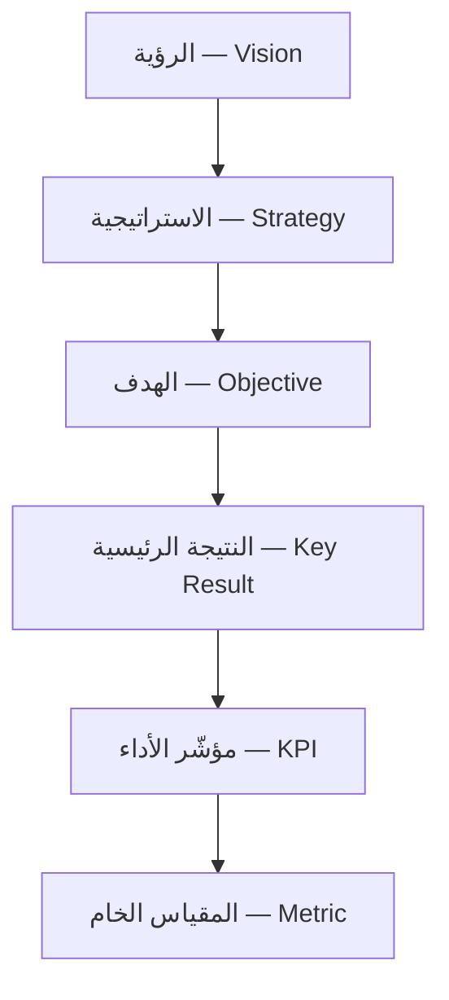
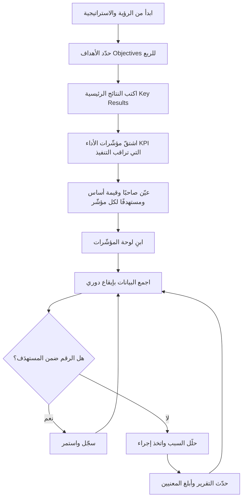
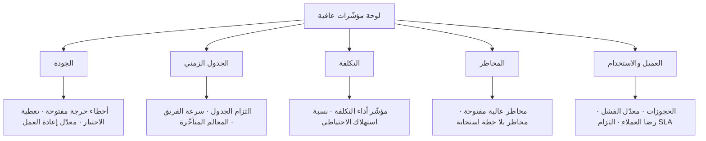

# 10 · الأداء (OKR/KPI)

> [!abstract] ماذا ستتعلّم هنا
> - الفرق العملي بين **الأهداف والنتائج الرئيسية (OKR — [[OKR|Objectives and Key Results]])** و**مؤشرات الأداء (KPI — [[KPI|Key Performance Indicator]])**، ومتى تستخدم كلًّا منهما.
> - **سُلَّم القياس** الذي يربط الرؤية بالرقم الخام، حتى تعرف أين انكسرت السلسلة حين تنكسر.
> - الفرق بين **المؤشّر المتقدّم** الذي تملك تحريكه اليوم و**المتأخّر** الذي يخبرك بما فات.
> - كيف تبني **لوحة مؤشرات (Dashboard)** حيّة تربط كل مؤشر بصاحبه (Owner) وهدفه وتكراره.
> - كيف تصوغ نتيجة رئيسية (Key Result) قابلة للقياس بدل عبارات فضفاضة مثل "نحسّن" — وكيف **تُقيَّم** في آخر الربع.
> - كيف تربط الأداء بباقي أدوات المشروع: التقارير، الجودة، إدارة المخاطر.
> - أخطاء شائعة تُفشل أنظمة القياس، وكيف تتجنّبها في مشروع حقيقي مثل عافية.
>
> ابدأ رحلتك من الدور نفسه: [[مدير المشاريع البرمجية الحديث]].

## 🧭 المفهوم ببساطة

تخيّل أنك تقود سيّارة في رحلة طويلة. لديك **وجهة** على الخريطة ("نصل إلى الرياض قبل المغرب") — هذه هي فكرة **OKR**: أين تريد الوصول وكيف تعرف أنك اقتربت. وأمامك **لوحة القيادة (dashboard)**: عدّاد السرعة، مؤشّر الوقود، حرارة المحرّك — هذه هي فكرة **KPI**: هل السيّارة تعمل بصحّة الآن؟

الوجهة تتغيّر مع كل رحلة (كل ربع سنة). لوحة القيادة تبقى تعمل دائمًا، من أول لحظة تشغّل فيها المحرّك.

**مرحلة الأداء (OKR/KPI)** هي أن تقرّر: ما الأرقام التي ستقيسها لتعرف أن مشروعك يسير بشكل صحّي، وأنه يقترب من أهدافه الطموحة؟ ثم تبني نظامًا بسيطًا يجمع هذه الأرقام بانتظام، ويضعها أمام صاحب القرار قبل فوات الأوان. القياس ليس هدفًا في ذاته؛ هدفه أن تتّخذ قرارًا مبكّرًا بدل أن تكتشف المشكلة بعد أن تكبر.

## 🪜 سُلَّم القياس — من الرؤية إلى الرقم

قبل أي مؤشّر، ثبّت في ذهنك الخريطة كلّها. فأكثر أنظمة القياس تفشل لا لأن أرقامها خاطئة، بل لأنها **معلّقة في الهواء**: رقمٌ يُجمع كل أسبوع ولا أحد يعرف أيّ هدف يخدمه.

| المستوى | ما هو | مثال من عافية | مداه الزمني |
|---|---|---|---|
| الرؤية | لماذا نوجد أصلًا | الريادة في الربط الصحّي الرقمي | سنوات |
| الاستراتيجية | كيف نصل | التوسّع في الاستشارات عن بُعد قبل التوسّع الجغرافي | سنة فأكثر |
| الهدف (Objective) | ما نريد تغييره هذا الربع | إثبات قيمة المنصّة في السوق السعودي | ربع |
| النتيجة الرئيسية (Key Result) | الرقم الذي يثبت التغيّر | رفع الجهات الفعّالة من 20 إلى 100 | ربع |
| مؤشّر الأداء (KPI) | صحّة العملية المستمرّة | معدّل فشل الحجوزات < 2% | مستمرّ |
| المقياس (Metric) | الرقم الخام قبل الحكم | عدد الحجوزات الفاشلة اليوم = 14 | لحظي |

> [!info] إضافة مرجعية — المقياس ليس مؤشّرًا
> **المقياس (Metric)** رقم خام يُجمع ولا يحكم على شيء: «14 حجزًا فاشلًا». و**المؤشّر (Indicator)** هو المقياس نفسه بعد أن أُلحق به **مستهدَف وحدُّ تفسير**: «نسبة الفشل 1.8%، والمستهدَف أقلّ من 2% — أخضر». والفرق عمليّ لا لفظيّ: المقياس لا يُنبّه أحدًا، والمؤشّر يُنبّه. ومن ملأ لوحته بمقاييس ظنّ أنه يراقب، وهو إنما يعرض.

**والسؤال الفاحص للسُّلَّم:** خذ أيّ رقم في لوحتك واصعد به درجةً درجة. فإن انقطعت السلسلة قبل أن تبلغ الهدف، فأنت أمام رقم يُجمَع بالعادة لا بالحاجة.

## 🧩 قاموس سريع للمصطلحات

| المصطلح (عربي) | English | المعنى ببساطة |
|---|---|---|
| الأهداف والنتائج الرئيسية | OKR | هدف طموح + 3–5 نتائج رقمية تُثبت تحقيقه، تُراجَع كل ربع |
| مؤشّر الأداء | KPI | رقم مستمر يقيس صحّة عملية ما (سرعة، جودة، تكلفة) |
| المقياس | Metric | الرقم الخام قبل أن يُلحق به مستهدَف وحدّ تفسير |
| النتيجة الرئيسية | Key Result | رقم واضح يقول "من كذا إلى كذا خلال مدة" |
| المؤشّر المتقدّم | [[Leading and Lagging Indicators\|Leading]] | يقيس سببًا **يسبق** النتيجة، وتملك تحريكه هذا الأسبوع |
| المؤشّر المتأخّر | [[Leading and Lagging Indicators\|Lagging]] | يقيس النتيجة **بعد** وقوعها — دقيق لكن لا يقبل التصحيح |
| صاحب المؤشّر | Owner | الشخص المسؤول عن رقم المؤشّر وتحديثه |
| القيمة الأساس | [[Baseline]] | نقطة البداية التي نقيس منها التحسّن |
| المستهدف | Target | الرقم الذي نطمح للوصول إليه |
| هدف طموح | [[Stretch Goal]] | هدف يتجاوز المتوقّع تحقيقه بالكامل عمدًا (قاعدة تقييمه في قسم المعايير الحديثة) |
| مستوى الثقة | Confidence Level | تقدير صاحب النتيجة لاحتمال بلوغها — ممارسة شائعة لا نصّ في إطار |
| النمط المضادّ | Anti-pattern | حلّ متكرّر يبدو صوابًا ويُنتج ضررًا |
| اتفاقية مستوى الخدمة | SLA | التزام بزمن محدّد للاستجابة أو الحل |

> [!warning] لفظان يحملان معنيين — فانتبه للسياق
> - **القيمة الأساس (Baseline) هنا** نقطة انطلاق **رقمٍ واحد** يُقاس منها التحسّن. وهي **ليست** خطّ أساس المشروع في [[08 - إدارة التكاليف]]، فذاك نسخة معتمدة من الخطة لا تتغيّر إلا عبر ضبط التغيير المعتمد.
> - **الهدف الطموح (Stretch Goal) هنا** بمعناه في OKR: هدف يُصاغ عمدًا فوق المتوقّع فيكون بلوغ 70% منه نجاحًا. أمّا في [[14 - Sprint|السبرنت]] فهو عنصر عمل إضافي «لو سمح الوقت» لا يُعدّ عدم إنجازه إخفاقًا. المعنى العامّ واحد — الطموح فوق الالتزام — والتطبيق مختلف.

## ⛓️ لماذا تأتي هنا وتقود للتالية

**ما تحتاجه قبل هذه المرحلة (المتطلّبات السابقة):** يجب أن يكون لديك **نطاق واضح** ومهام محدّدة (من مرحلة التخطيط)، و**تعريف الإنجاز ([[Definition of Done]])** من مرحلة الجودة، و**خط أساس** لسرعة الفريق ([[18 - Velocity]]). لا يمكنك قياس ما لم تعرّفه أولًا.

**ماذا تُغذّي المرحلة التالية؟** الأداء هو الوقود لـ**تقارير الحالة (Status Reports)** و**التواصل مع أصحاب المصلحة** ([[21 - Stakeholder Communication]]). المؤشّرات المنحرفة تُطلق **إدارة المخاطر** ([[19 - Risk Management]])، وتُغذّي **مراجعات الجودة** ([[20 - Quality Management]]) وقرارات **إعادة التخطيط**. باختصار: القياس هنا يصبح لغة اتخاذ القرار في كل مرحلة بعده.

## 📊 مخطّط سير العمل

> [!note] لماذا هذا الترتيب بعينه؟
> **الوجهة قبل لوحة القيادة.** يُخطئ كثيرون فيبدؤون باشتقاق المؤشّرات ثم يكتبون الأهداف حولها، فتخرج أهدافٌ فُصِّلت على ما يسهل قياسه لا على ما يستحقّ بلوغه. والترتيب السليم: رؤية ← هدف ← نتيجة رئيسية ← مؤشّر يراقب التنفيذ. فالمؤشّر **يخدم** الهدف ولا يسبقه.
>
> والعقدة الأولى تعني أهداف الميثاق والنطاق العامة، لا الأهداف الربعية نفسها.

## 🧲 المؤشّر المتقدّم والمؤشّر المتأخّر

هذا هو المفهوم الذي يفصل من يقرأ الأرقام عمّن يديرها. فالمؤشّرات نوعان بحسب موقعها من النتيجة:

| الوجه | المؤشّر المتأخّر (Lagging) | المؤشّر المتقدّم (Leading) |
|---|---|---|
| ماذا يقيس | النتيجة نفسها بعد وقوعها | سلوكًا أو حالة تسبق النتيجة |
| متى يظهر | بعد فوات وقت الفعل | أثناء العمل، هذا الأسبوع |
| دقّته | عالية ونهائية | أقلّ يقينًا — مبنيّ على فرضية سببية |
| قابليته للتحريك | يصعب التأثير فيه مباشرة | تملك رافعة تحرّكه الآن |
| مثال من عافية | الإيرادات · معدّل الانسحاب · رضا العملاء | عدد الجهات التي أتمّت التسجيل · زمن الاستجابة · تغطية الاختبارات |

**والقاعدة الحاكمة: لا تختر بينهما، بل أدِر بزوجٍ منهما.** لكل نتيجة رئيسية مؤشّر متأخّر واحد يعرّف النجاح، ومؤشّر متقدّم أو اثنان يمكن التحرّك عليهما قبل أن يُقفل الربع. فأنت لا تستطيع أن «تفعل» الإيراد — الإيراد نتيجة؛ لكنك تستطيع أن تفعل عدد العروض التوضيحية، وسرعة الردّ على طلب التسجيل.

> [!warning] العلاقة بينهما فرضية لا حقيقة
> كل مؤشّر متقدّم يحمل ادّعاءً ضمنيًّا: «إن ارتفع هذا، سيرتفع ذاك». وهذا الادّعاء **يُكتب صراحةً ويُراجَع دوريًّا**، لأن كثيرًا من الفرق تتعلّق بمؤشّر متقدّم سنواتٍ بعد أن انقطعت صلته بالنتيجة. وسؤال المراجعة واحد: هل ما زالت حركته تتنبّأ بحركة المؤشّر المتأخّر؟ التفصيل في [[Leading and Lagging Indicators]].

## ✍️ كيف تُصاغ نتيجة رئيسية سليمة؟

النتيجة الرئيسية الضعيفة هي أشيع سبب لموت نظام OKR في ربعه الأول. وثلاثة اختبارات تكفي للحكم عليها.

**أولًا: صيغة «من X إلى Y خلال مدة».** لا يكفي «تحسين رضا العملاء»، ولا حتى «رضا العملاء 4.7». الصياغة الكاملة: **«رفع رضا العملاء من 4.1 إلى 4.7 من 5 قبل نهاية الربع الأول»**. فالقيمة النهائية وحدها لا تقول كم قطعتَ، والقيمة الأساس هي ما يحوّل الرقم إلى مسافة.

**ثانيًا: معيار [[SMART Goals|سمارت (SMART)]].** وهو أقدم فحص للأهداف وأصلحها لهذا الموضع:

| الحرف | السؤال | تطبيقه على النتيجة الرئيسية |
|---|---|---|
| **S** — محدّدة | ماذا بالضبط؟ | «الجهات الصحية الفعّالة» لا «المستخدمون» |
| **M** — قابلة للقياس | من أين يأتي الرقم؟ | من لوحة تحليلات المنصّة، تعريف «الفعّالة» = أتمّت حجزًا واحدًا على الأقل |
| **A** — قابلة للتحقيق | هل الموارد تسمح؟ | في OKR **يُشدّ** هذا الحرف عمدًا حتى يبلغ حدّ الطموح، لا حدّ الاستحالة |
| **R** — ذات صلة | أيّ هدف تخدم؟ | تخدم «إثبات قيمة المنصّة» لا شيئًا آخر |
| **T** — محدّدة بزمن | متى؟ | نهاية الربع الأول — لا «قريبًا» |

> [!info] إضافة مرجعية — تعارض ظاهريّ بين سمارت وOKR
> يقول بعضهم إن حرف **A (قابلة للتحقيق)** يناقض طبيعة OKR الطموحة. والحقّ أنهما يعملان على مستويين: سمارت يضبط **الصياغة** (هل الجملة تصلح هدفًا أصلًا؟)، وOKR يضبط **مستوى الشدّ** (كم نرفع السقف؟). فالنتيجة الرئيسية الطموحة تبقى محدّدة وقابلة للقياس وذات صلة ومؤقّتة — وإنما يُرفع سقفها حتى يصير بلوغ 70% نجاحًا.

**ثالثًا: مثلّث القيمة الأساس والمستهدَف والحالي.** ولا يستقيم القياس بدونها مجتمعة:

| العنصر | الرقم | معناه |
|---|---|---|
| القيمة الأساس (Baseline) | معدّل إعادة العمل = **15%** | من أين انطلقنا |
| المستهدَف (Target) | **5%** | إلى أين نريد |
| القيمة الحالية (Current) | **8%** | أين نحن الآن |

**فالتقدّم = (15 − 8) ÷ (15 − 5) = 0.70** — أي أنجزنا **70%** من المسافة. ولاحظ ما يكشفه هذا الحساب: الرقم المطلق «8%» يبدو بعيدًا عن المستهدَف، بينما النسبة تقول إننا قطعنا أكثر من ثلثي الطريق. **ومن قاس بالرقم المطلق وحده أحبط فريقًا ناجحًا.**

> [!tip] مستوى الثقة (Confidence Level) — ممارسة لا نصّ
> شاع في بعض المؤسسات أن يُلحق بكل نتيجة رئيسية تقديرٌ ذاتيّ من صاحبها لاحتمال بلوغها، يُحدَّث أسبوعيًّا:
>
> | النتيجة الرئيسية | التقدّم | مستوى الثقة | القراءة |
> |---|---|---|---|
> | KR1 — الجهات الفعّالة | 65% | **مرتفع** | ماضٍ في مساره، لا تدخّل |
> | KR2 — رضا العملاء | 40% | **متوسّط** | راقب أسبوعين |
> | KR3 — زمن الحجز | 55% | **منخفض** | التقدّم مطمئن والثقة ليست كذلك — **افحص هنا أوّلًا** |
>
> وفائدتها في الصفّ الأخير بالضبط: **حين يتباعد التقدّم عن الثقة**، فذلك إنذار مبكّر لا يعطيه الرقم وحده — صاحب النتيجة يرى عائقًا لم يظهر في الأرقام بعد. **وهي ليست ركنًا في أيّ إطار رسميّ**، ولا تُطلب من فريق لم يبلغ بعدُ انضباطًا في الأرقام نفسها.

## 🎯 مثال كامل — OKR عافية للربع الأول

هذا المثال يجمع كل ما سبق في صفحة واحدة. اقرأه صاعدًا وهابطًا في سُلَّم القياس.

> [!example] الهدف (Objective)
> **أن تصبح عافية الوجهة الأولى للاستشارات الصحية عن بُعد في السوق السعودي.**
> — هدف نوعيّ مُلهِم، بلا أرقام. الأرقام وظيفة النتائج الرئيسية لا الهدف.

| # | النتيجة الرئيسية (Key Result) | القيمة الأساس | المستهدَف | نوعه |
|---|---|---|---|---|
| KR1 | رفع عدد مقدّمي الخدمة الفعّالين | 20 | **100** | متأخّر |
| KR2 | رفع رضا العملاء (من 5) | 4.1 | **4.7** | متأخّر |
| KR3 | خفض زمن إتمام الحجز | 4 دقائق | **60 ثانية** | متقدّم |

**ومؤشّرات الأداء اليومية التي تراقب التنفيذ** — وهي لا تنتهي بانتهاء الربع، بخلاف النتائج الرئيسية:

| المؤشّر | تعريفه | المستهدَف | صاحبه | يخدم |
|---|---|---|---|---|
| توافر الخدمة (Availability) | نسبة زمن عمل المنصّة | ≥ 99.5% | تقني | KR1 · KR2 |
| زمن الاستجابة (Latency) | زمن استجابة الحجز عند الشريحة 95 | < 800 مللي ثانية | تقني | KR3 |
| معدّل الأخطاء (Bug Rate) | أخطاء مكتشَفة لكل 100 نقطة | ≤ 3 | جودة | KR2 |
| معدّل التحويل (Conversion) | زوّار أتمّوا حجزًا ÷ إجمالي الزوّار | ≥ 6% | تسويق | KR1 |
| الحجوزات اليومية (Bookings) | عدد الحجوزات المكتملة | اتّجاه صاعد | تشغيل | KR1 |
| التزام SLA للدعم | تذاكر رُدّ عليها ضمن المهلة | ≥ 95% | دعم | KR2 |

**والقاعدة التي يوضّحها هذا الجدول:** كل مؤشّر في العمود الأخير يشير إلى نتيجة رئيسية. **والمؤشّر الذي يفشل في ملء هذا العمود مرشّح للحذف** — لا لأنه رقم رديء، بل لأنه لا يخدم شيئًا هذا الربع.

> [!warning] المؤشّرات ليست كلّها تشغيلية
> يشيع اختزال KPI في مؤشّرات التشغيل اليومي (توافر · زمن استجابة · تذاكر)، وهي في الواقع خمس عائلات: **استراتيجية** (الحصّة السوقية · معدّل الاحتفاظ) · **مالية** (تكلفة اكتساب العميل · هامش المساهمة) · **عميل** (رضا · صافي نقاط الترويج) · **امتثال** (بلاغات خرق البيانات · اكتمال متطلّبات [[PDPL]]) · **ابتكار** (نسبة الجهد المخصّص لتجارب جديدة). ومن اقتصر على العائلة التشغيلية بنى لوحةً تُطمئنه عن أمس ولا تقول له شيئًا عن السنة القادمة.

## 🧮 كيف تُقيَّم OKR في آخر الربع؟

تُقيَّم كل نتيجة رئيسية على مقياس من **0.0 إلى 1.0** (وهو ذاته نسبة إنجاز المسافة بين القيمة الأساس والمستهدَف)، ثم يكون تقييم الهدف متوسّط نتائجه:

| الدرجة | معناها | القراءة الإدارية |
|---|---|---|
| **0.0 – 0.3** | لم يتحرّك الرقم تقريبًا | إخفاق حقيقي — يُبحث عن سببه لا عن عذره |
| **0.4 – 0.6** | تقدّم جزئي | إمّا أن الهدف كان أكبر من الموارد، وإمّا أن العوائق لم تُرفع |
| **0.7** | **المنطقة الصحّية** | الهدف كان مشدودًا بالقدر الصحيح |
| **0.8 – 1.0** | بلوغ شبه كامل | يُطرح سؤال: هل كان الهدف سهلًا؟ |

> [!danger] وأخطر ما في التقييم ليس الرقم بل ما يليه
> الفريق الذي يبلغ 1.0 في كل نتائجه ثلاثة أرباع متتالية **لا يُهنَّأ** — بل يُسأل عن سقف أهدافه. والفريق الذي يبلغ 0.4 **لا يُعاقَب** — بل يُسأل عن العائق. ومتى صار التقييم بابًا للثواب والعقاب، انتقل الفريق من رفع السقف إلى خفضه، فانتهى النظام كلّه في ربعين.

**ودورة المراجعة التي تُبقي الأرقام حيّة** — والقياس بلا إيقاع دوري ورقٌ يُكتب مرّة ويُنسى:

| الإيقاع | مدّته | ماذا يحدث فيه |
|---|---|---|
| **متابعة أسبوعية (Check-in)** | 15 دقيقة | يحدّث كل صاحب رقمه ومستوى ثقته، ويُرفع عائق واحد |
| **مراجعة شهرية (Review)** | ساعة | قراءة الاتّجاه لا الرقم: هل الخطّ صاعد؟ وما الذي غيّرناه؟ |
| **تقييم ربعي (Scoring)** | نصف يوم | تُقيَّم النتائج من 0.0 إلى 1.0، وتُستخلص الدروس، وتُكتب أهداف الربع التالي |
| **تخطيط سنوي (Planning)** | يوم فأكثر | مراجعة الاستراتيجية نفسها، وتنقية المؤشّرات المستمرّة |

**فالمتابعة الأسبوعية للتصحيح، والمراجعة الشهرية للاتّجاه، والتقييم الربعي للحكم.** ومن اكتفى بالتقييم الربعي وحده اكتشف الانحراف بعد ثلاثة أشهر من وقوعه.

## 📂 مستندات هذه المرحلة — واحدًا واحدًا

### 1) دليل OKR و KPI

> [!info] ما هو ولماذا
> وثيقة مرجعية تشرح الفرق بين OKR و KPI، ومتى تستخدم كلًّا منهما في مشروع عافية، وتقدّم نماذج جاهزة لـ KPIs إدارة المشروع (الآن) و OKRs ما بعد الإطلاق. غايتها منع الخلط الشائع بين "الوجهة" و"لوحة القيادة".

- **📥 من أين تجمع معلوماته:**
  - من رؤية الإدارة العليا (المدير العام) للأهداف الطموحة.
  - من مدير المشروع (PM) لمؤشّرات التنفيذ.
  - من العقد و**[[ميثاق المشروع (Project Charter)|ميثاق المشروع]]** لمعايير النجاح.
  - من اجتماعات التخطيط الربعي.
- **🛠️ كيف ترتّبه:** قسّمه إلى ثلاثة أجزاء — مؤشّرات إدارة المشروع الآن، ثم OKRs بعد الإطلاق، ثم مؤشّرات تشغيلية. لكل بند: تعريف، طريقة قياس، هدف رقمي.
- **🎯 فائدته:** يوحّد فهم الفريق للقياس، ويمنع صياغة أهداف غامضة، ويحدّد التوقيت الصحيح لكل نوع من المؤشّرات.
- **مرتبط بالمفاهيم:** [[18 - Velocity]] · [[17 - Burndown Chart]] · [[20 - Quality Management]].

> [!example] من عافية
> الدليل يوصي بالبدء بـ KPIs إدارة المشروع فورًا (التزام الجدول، سرعة الإنجاز، معدّل إعادة العمل)، وتأجيل OKRs النمو الكاملة إلى ما قبل الإطلاق. مثال OKR: "إثبات قيمة المنصة في السوق السعودي" مع نتيجة "تسجيل 50 جهة صحية فعّالة خلال الربع الأول".

الملف: «01-دليل-OKR-و-KPI»

### 2) لوحة المؤشّرات

> [!info] ما هو ولماذا
> سجلّ بصيغة جدول (CSV) يحتوي كل مؤشّر مع فئته ونوعه وتعريفه وهدفه وقيمته الحالية وصاحبه وتكراره وحالته. هو "لوحة القيادة" الفعلية التي تُحدَّث دوريًا وتُقرأ في التقارير.

- **📥 من أين تجمع معلوماته:** القيم الفعلية من أدوات العمل (لوحة المهام، نظام التذاكر، تحليلات المنصة)؛ الأهداف من دليل OKR/KPI؛ أسماء الأصحاب من مدير المشروع.
- **🛠️ كيف ترتّبه:** صفوف = مؤشّرات، أعمدة = (الفئة، المؤشّر، النوع، التعريف، الهدف، القيمة الحالية، صاحب المؤشّر، التكرار، الحالة). استخدم Excel/CSV ليسهل الفرز والترشيح.
- **🎯 فائدته:** يعطي صورة لحظية عن صحّة المشروع، ويجعل المساءلة واضحة (لكل رقم صاحب)، ويكشف الانحراف مبكّرًا.
- **مرتبط بالمفاهيم:** [[16 - Task Boards]] · [[21 - Stakeholder Communication]] · [[Early Warning Dashboard]].

> [!example] من عافية
> اللوحة تصنّف المؤشّرات إلى: إدارة المشروع، النمو، التفاعل، الإيراد، الاحتفاظ، الجودة، الدعم، وحتى SEO. مثال صف: "معدّل فشل الحجوزات — تشغيلي — حجوزات فاشلة/إجمالي — الهدف < 2% — صاحبه: تقني — أسبوعي — بعد الإطلاق".

الملف (CSV): «02-لوحة-المؤشرات»

📂 مستندات هذه المرحلة (في مستودع المشروع)

## 📺 ممّا تتركّب لوحة المؤشّرات؟

اللوحة ليست قائمة أرقام مرصوصة، بل **خمسة أقسام يجيب كلٌّ منها عن سؤال واحد** لصاحب القرار. والذي يقرأها يجب أن يعرف في ثلاثين ثانية أين المشكلة، لا أن يفتّش عنها.

**والقاعدة في بناء اللوحة:** لكل قسم مؤشّر واحد أو اثنان لا أكثر. فالخمسة أقسام × مؤشّرين = **عشرة أرقام** — وهذا سقف ما يقرؤه إنسان في اجتماع أسبوعي. وما زاد عليها انتقل من لوحة قيادة إلى أرشيف.

## ✅ فحص جودة المؤشّر نفسه

قبل أن تُدخل مؤشّرًا إلى اللوحة، أجرِ عليه هذا الفحص. والمؤشّر الذي يسقط في واحد منها يُصلَح أو يُترك — ولا يُدخَل «مؤقّتًا» فالمؤقّت في اللوحات دائم:

1. **هل هو قابل للقياس فعلًا؟** أي: هل توجد طريقة حساب مكتوبة يتّفق عليها اثنان فيخرجان بالرقم نفسه؟
2. **هل هو مفهوم بلا شرح؟** فالمؤشّر الذي يحتاج فقرة ليُفهم لن يُقرأ في اجتماع.
3. **هل يملك أحدٌ التأثير فيه؟** فالرقم الذي لا يملك أحد تحريكه معلومةٌ لا مؤشّر.
4. **هل مصدر بياناته موثوق ومعروف؟** ومن أيّ نظام يُسحب، ومن يملك تعديله؟
5. **هل يُحدَّث تلقائيًّا أو بجهد يسير؟** فما احتاج جمعه ساعتين أسبوعيًّا سيُملأ تقديرًا بعد شهر.
6. **وهل يغيّر قرارًا؟** — وهذا آخرها وأشدّها. اسأل: لو صار هذا الرقم أحمر غدًا، ماذا سأفعل غير ما أفعله اليوم؟

**وقاعدة الحكم:** يكفي في الخمسة الأولى أن يكون الجواب «نعم» في أغلبها مع خطة لسدّ ما نقص. أمّا **السادس فلازم لا يُتسامح فيه**: مؤشّرٌ لا يغيّر قرارًا ليس مؤشّرًا ضعيفًا، بل ليس مؤشّرًا.

## ⏱️ إدارة وقت هذه المهمة

| حجم المشروع | الزمن التقريبي لإعداد نظام الأداء |
|---|---|
| صغير | ساعات إلى يوم — 3–5 مؤشّرات في جدول بسيط |
| متوسط | أيام إلى أسبوعان — لوحة مؤشّرات + جولة OKR ربعية |
| كبير | أسابيع إلى أشهر — أنظمة متعدّدة، تكامل مع أدوات، دورات مراجعة منتظمة |

**من يُنتج المستند وكيف يتعاونون:** عادةً يقود مدير المشروع (PM) الإعداد. يشارك المدير العام في صياغة OKR (الوجهة)، ويشارك قادة الفرق (تقني، جودة، تسويق، دعم) في تحديد مؤشّراتهم وأهدافهم. التعاون تكراري: PM يضع المسودّة → كل صاحب يراجع مؤشّره → اجتماع مواءمة قصير → اعتماد. جمع البيانات لاحقًا مسؤولية موزّعة على الأصحاب، والتجميع مسؤولية PM.

**أي ملفات تراجع:** راجع دليل OKR/KPI عند كل ربع سنة، ولوحة المؤشّرات أسبوعيًا/شهريًا حسب تكرار كل مؤشّر. راجع تعريف الإنجاز (Definition of Done) قبل احتساب "نسبة اجتياز DoD".

**صيغ الملفات:**

| الغرض | الصيغة المناسبة |
|---|---|
| سجلّ المؤشّرات / اللوحة | Excel / CSV |
| الدليل الإرشادي | Word / Markdown |
| التقرير الرسمي للإدارة | PDF |

> [!warning] الدقّة قبل السرعة
> رقم واحد خاطئ في اللوحة يقود إلى قرار خاطئ. تحقّق من مصدر البيانات وطريقة الحساب قبل النشر. مؤشّر بطيء وصحيح أفضل من مؤشّر سريع ومضلِّل.

## 🌐 ما تقوله المعايير الحديثة

> [!quote] من ممارسات 2026
> - **OKR للتغيير، KPI للصحّة:** الـ OKR تقود التحوّل والنمو (إطلاق منتج، دخول سوق)، بينما KPI تراقب استمرارية العمل اليومي (SLA، توافر الخدمة). الـ KPI يقول "أين نحن الآن"، والـ OKR يقول "إلى أين نتّجه وكم قطعنا".
> - **قاعدة 0.6–0.7:** تحقيق 60–70% من هدف طموح (stretch) علامة صحّية على أنك تمدّد الفريق. تحقيق 100% من هدف طموح يثير سؤالًا: هل كان الهدف سهلًا؟
> - **من المخرجات إلى النتائج:** المعايير الحديثة تنقلك من قياس "المهام المنجزة" (output) إلى قياس "الأثر" (outcome) مثل رضا العميل والإيراد.
> - **الأتمتة والتكامل:** أدوات 2026 تحدّث النتائج الرئيسية تلقائيًا من Jira/Asana/Slack، وتقدّم لوحات KPI وتقارير اتّجاهات عبر عدّة دورات.
> - **قلّل واختر:** 3 أهداف كحدّ أقصى للربع، و5–7 مؤشّرات جوهرية تغطّي الوقت والتكلفة والنطاق والجودة والمخاطر.
>
> هذا يتّصل مباشرةً بـ [[مدير المشاريع البرمجية الحديث|مثلث كفاءات PMI]] (الطرق + القيادة + الفطنة الاستراتيجية): القياس الجيّد هو حيث تلتقي الفطنة الاستراتيجية بالانضباط التنفيذي.

> [!info] إضافة مرجعية — ما هو نصّ وما هو ممارسة
> **لا يوجد «معيار OKR» رسميّ منشور** كما يوجد ISO للجودة. فالإطار نشأ في الصناعة (إنتل ثم جوجل)، واستقرّ في كتب وأدلّة ممارسة لا في مواصفة. وأثر ذلك عمليّ: قاعدة 0.7، ومستوى الثقة، ودورة المراجعة الأسبوعية — كلّها **ممارسات واسعة الانتشار** يجوز لفريقك أن يعدّلها بعلّة، لا نصوصًا يُحتجّ بها. أمّا ما هو مقيس ومعياريّ فعلًا فهو **مصطلحات القياس نفسها** (المقياس · المؤشّر · القيمة الأساس) في `ISO/IEC/IEEE 15939`.

## ☠️ الأنماط المضادّة في القياس

> [!failure] ستّ صور يبدو فيها النظام قائمًا وقد مات
> 1. **قياس كل شيء.** لوحة بثلاثين رقمًا لا يقرؤها أحد. والكثرة ليست شمولًا بل تعمية — إذ تتساوى فيها إشارة الخطر مع رقم روتينيّ.
> 2. **ربط كل هدف بالمكافأة.** فيهبط الفريق بسقف أهدافه إلى ما يضمن بلوغه، ويتحوّل OKR من أداة طموح إلى تفاوض على المستهدَفات.
> 3. **أكثر من صاحب للمؤشّر الواحد.** والرقم الذي يملكه اثنان لا يملكه أحد. **صاحب واحد لكل رقم** — وله أن يستعين بمن شاء.
> 4. **تغيير المؤشّر كل أسبوع.** فيضيع الاتّجاه، ولا يبقى تاريخٌ يُقارن به. والمؤشّر يُثبَّت ربعًا كاملًا ثم يُراجَع.
> 5. **غياب القيمة الأساس.** فتقرأ «8%» ولا تعرف: أهي تحسّن من 15% أم تدهور من 3%؟ **والرقم بلا قيمة أساس لا يُقرأ**.
> 6. **قياس النشاط بدل القيمة.** «عقدنا 40 اجتماعًا» و«أنجزنا 120 مهمّة» — أرقام تصف الحركة لا الأثر، وهي [[Vanity Metrics|مقاييس الغرور]] بعينها.
>
> **وأخفاها الثانية.** فالخمس الباقيات تُرى في اللوحة: تُعدّ الأرقام فتكشف الكثرة، ويُفتّش عن الصاحب فلا يوجد. أمّا ربط الهدف بالمكافأة **فيُنتج لوحةً خضراء كلّها**، والإدارة راضية والفريق مطمئنّ — ولا يظهر أثره إلا بعد سنة حين يُسأل: لماذا لم يتغيّر شيء وكلّ أهدافنا تتحقّق؟

> [!danger] قانون غودهارت — الأصل الذي تتفرّع عنه الستّ
> **«حين يصير المقياس هدفًا، يكفّ عن أن يكون مقياسًا جيّدًا»** ([[Goodhart's Law|قانون غودهارت]]). فالفريق الذي يُقاس بعدد الأخطاء المُصلَحة سيجد أخطاءً أكثر، والذي يُقاس بسرعة إغلاق التذاكر سيغلقها قبل حلّها. والعلاج ليس ترك القياس، بل **إلحاق كل مؤشّر بمقياس مضادّ** ([[Counter Metric]]) يحرس ما قد يُتلفه: مع سرعة الإغلاق، نسبة التذاكر المُعاد فتحها؛ ومع عدد الميزات المسلّمة، معدّل إعادة العمل.

## ➕ لإكمال الصورة — تحسينات مقترحة

> [!todo] ما ينقص مقابل المعايير، وكيف تكمله
> - **عمود القيمة الأساس (Baseline) فارغ:** اللوحة تحدّد الأهداف لكن لا تسجّل نقطة البداية. أضف عمود Baseline لتقيس التحسّن الحقيقي، لا الرقم المطلق فقط.
> - **لا يوجد تعريف صريح للنتيجة الرئيسية بصيغة "من X إلى Y":** بعض النتائج مكتوبة كقيمة نهائية فقط. حسّنها إلى صيغة الفرق مع المدة الزمنية.
> - **ربط المؤشّرات بالمخاطر:** أي مؤشّر خارج الهدف يجب أن يفتح بندًا في سجلّ المخاطر. راجع [[19 - Risk Management]] لبناء هذا الجسر.
> - **ربط الأداء بالتواصل:** لا توجد قناة واضحة لعرض المؤشّرات للإدارة. اربطها بخطة التواصل عبر [[21 - Stakeholder Communication]].
> - **مؤشّرات الجودة تحتاج تعميقًا:** كثافة العيوب وتغطية الاختبار غير مذكورة. راجع [[20 - Quality Management]].
> - **مواءمة استراتيجية:** لكل KPI يجب أن يتّضح لأي OKR ينتمي. اربط كل مؤشّر بهدفه الأعلى.
> - **لا يوجد مقياس مضادّ:** كل مؤشّر يمكن تحسينه بطريقة تُتلف غيره. ألحق بالمؤشّرات الحرجة مقاييس حراسة ([[Counter Metric]]).
> - **لا تصنيف متقدّم/متأخّر:** اللوحة كلّها مؤشّرات نتيجة، فلا يبقى فيها ما يُتحرَّك عليه هذا الأسبوع.

## 🎬 سيناريوهان

> [!success] الطريق الصحيح
> **سلمى**، مديرة مشروع عافية، بدأت مبكّرًا: حدّدت 5 مؤشّرات إدارة مشروع فقط، وسجّلت لكل منها قيمة أساس وهدفًا وصاحبًا. راجعت اللوحة كل أسبوع في اجتماع قصير. في الأسبوع الرابع لاحظت أن "معدّل إعادة العمل" قفز من 12% إلى 22%. سألت الفريق فورًا، فاكتشفت غموضًا في متطلّبات وحدة الحجز. عالجت السبب مبكّرًا، فعاد المؤشّر إلى 13% خلال أسبوعين. النتيجة: بقي المشروع في مساره، والإدارة وثقت بتقاريرها لأنها مبنيّة على أرقام حيّة.

> [!failure] الطريق الخاطئ
> **ماجد**، مدير مشروع آخر، أنشأ لوحة ضخمة فيها 30 مؤشّرًا "ليبدو شاملًا"، بلا أصحاب وبلا قيمة أساس. لم يحدّثها إلا قبل اجتماع الإدارة بليلة، فملأ الأرقام تقديرًا. ربط OKRs الطموحة مباشرةً بمكافآت الأفراد، فبدأ الفريق يتجنّب الأهداف الصعبة. عند الإطلاق فوجئ بأن معدّل فشل الحجوزات 9% (الهدف < 2%)، لأن أحدًا لم يكن يراقبه فعلًا. النتيجة: إطلاق متعثّر، وفقدان ثقة الإدارة في كل الأرقام.

> [!note] لماذا نجحت سلمى ولماذا فشل ماجد؟
> **نجحت سلمى** لأنها اختارت **القلّة** فاستطاعت متابعتها، وثبّتت **قيمة أساس** فعرفت أن 22% انحراف لا حالة، وراجعت **أسبوعيًّا** فأدركت الانحراف وهو في أوّله، وسألت عن **السبب** لا عن المسؤول.
>
> **وفشل ماجد** لأن أخطاءه الأربعة يغذّي بعضها بعضًا: الكثرة جعلت المتابعة مستحيلة، واستحالة المتابعة جعلت الأرقام تقديرية، والأرقام التقديرية جعلت اللوحة زينة، وربط المكافأة أقنع الفريق بأن الأمان في السكوت. **ولاحظ أن أشدّ ما آذاه لم يكن رقمًا خاطئًا، بل رقمًا لم ينظر إليه أحد.**

## 🧩 قرارات تفاعلية (فكّر ثم افتح)

> [!question]- الموقف: مؤشّر "الأخطاء الحرجة المفتوحة" = 3 قبل موعد الإطلاق بأسبوع. ماذا تفعل؟
> **الخيارات:** (أ) تُطلق في الموعد وتصلحها لاحقًا لأن التأخير مكلف · (ب) تؤجّل الإطلاق حتى تصبح 0 · (ج) تُطلق جزئيًا لمستخدمين محدودين.
>
> ✅ **الأفضل: (ب)** — الهدف المتّفق عليه في الدليل صريح: صفر أخطاء حرجة قبل أي إطلاق.
> **لماذا؟** الأخطاء الحرجة (Critical/High) تمسّ سلامة بيانات صحّية وثقة أوّل مستخدمين. تكلفة إطلاق فاشل أعلى بكثير من تكلفة تأجيل قصير.
> **السيناريو المثالي:** تبلّغ الإدارة فورًا بالمؤشّر ورقمه، تعرض خطة إصلاح بموعد واضح، وتؤجّل الإطلاق أيامًا معدودة مع تواصل شفّاف مع أصحاب المصلحة.

> [!question]- الموقف: الإدارة تريد ربط مكافآت الفريق بنسبة تحقيق OKRs الربعية. ما رأيك؟
> **الخيارات:** (أ) توافق لأنها تحفّز · (ب) ترفض تمامًا · (ج) تربط المكافآت بـ KPIs التشغيلية وتبقي OKRs للتطلّع.
>
> ✅ **الأفضل: (ج)** — كما ينصّ الدليل: لا تربط OKR الطموحة مباشرةً بمكافآت الأفراد.
> **لماذا؟** OKR هدفها طموح (تحقيق 70% نجاح)؛ ربطها بالمكافأة يدفع الفريق لاختيار أهداف سهلة. KPIs التشغيلية أنسب للمساءلة لأنها التزامات صحّية واضحة.
> **السيناريو المثالي:** تفصل النظامين — مساءلة على KPIs التشغيلية، وتطلّع مشترك على OKRs — وتشرح للإدارة الفرق بلغة بسيطة.

> [!question]- الموقف: كل مؤشّرات لوحتك خضراء منذ ثلاثة أشهر، والمشروع متأخّر شهرًا. أين الخلل؟
> **الخيارات:** (أ) الأرقام مغلوطة ويجب التدقيق فيها · (ب) اللوحة كلّها مؤشّرات متأخّرة تصف ما تمّ لا ما سيأتي · (ج) المؤشّرات تقيس نشاطًا لا قيمة.
>
> ✅ **الأفضل: (ب) و(ج) معًا** — وهما وجهان لعلّة واحدة.
> **لماذا؟** «المهامّ المنجزة» و«الاجتماعات المعقودة» أرقام تخضرّ كلّما تحرّك الفريق، ولو تحرّك في الاتّجاه الخطأ. ولا يوجد فيها مؤشّر متقدّم واحد ينذر قبل الوقوع.
> **السيناريو المثالي:** تُبقي مؤشّرات النتيجة، وتُلحق بكل واحد منها **مؤشّرًا متقدّمًا** تملك تحريكه هذا الأسبوع (عمر العمل الجاري · نسبة المتطلّبات المعتمدة · تغطية الاختبار)، و**مقياسًا مضادًّا** يحرس ما قد يُتلفه.

## 🧠 أسئلة تفكير ناقد وعصف ذهني (بلا إجابة واحدة)

> [!question] فكّر معنا
> - لو كان بإمكانك قياس **مؤشّر واحد فقط** لصحّة عافية قبل الإطلاق، فأيّها تختار ولماذا؟
> - متى يتحوّل المؤشّر من أداة قرار إلى "لعبة أرقام" يتلاعب بها الفريق؟ كيف تكتشف ذلك؟
> - هل يمكن أن ينجح مشروع بكل مؤشّراته خضراء ويفشل تجاريًا؟ ماذا يعني ذلك عن اختيارك للمؤشّرات؟
> - كم عدد المؤشّرات "الكثير جدًا"، ومن يقرّر متى نحذف مؤشّرًا؟
> - لو مُنعت من كل المؤشّرات المتأخّرة شهرًا كاملًا، فبأيّ ثلاثة مؤشّرات متقدّمة تدير المشروع؟

> [!tip] إطار الإجابة (4 خطوات)
> 1. **حدّد القرار أولًا:** أيّ قرار سيتغيّر بناءً على هذا الرقم؟ إن لم يتغيّر قرار، فالمؤشّر زائد.
> 2. **افحص السلوك الجانبي:** ما السلوك الذي سيحفّزه هذا المؤشّر؟ هل قد يدفع لتحسين الرقم على حساب الهدف الحقيقي؟
> 3. **وازن المخرجات مقابل النتائج:** هل تقيس نشاطًا (مهام) أم أثرًا (رضا/إيراد)؟ اسعَ للأثر.
> 4. **اختبر بالمثال:** طبّق السؤال على سيناريو عافية (مثلًا "MAU مرتفع لكن Churn 15%") وتتبّع النتيجة المنطقية.

## ❓ نقاط للمراجعة (استرجاع)

> [!question]- ما الفرق الجوهري بين OKR و KPI في جملة واحدة؟
> OKR يحدّد **الوجهة** (هدف طموح ربعي)، وKPI يقيس **الحركة والصحّة** المستمرّة. والأوّل ينتهي بانتهاء الربع، والثاني يستمرّ ما دامت العملية قائمة.

> [!question]- هل كل مؤشّر أداء يصلح أن يكون نتيجة رئيسية؟
> **لا.** يصلح المؤشّر نتيجةً رئيسية **بشرطين**: أن يقيس تقدّمًا نحو الهدف الربعيّ لا مجرّد صحّة عملية، وأن يكون قابلًا للتحريك خلال الربع. فمؤشّر مثل **«معدّل التحويل»** يصلح نتيجةً رئيسية لأنه يتقدّم نحو هدف نموّ؛ ومؤشّر مثل **«استهلاك المعالج (CPU Usage)»** لا يصلح — فهو مؤشّر صحّة تشغيلية يجب أن يبقى ضمن حدّ، ولا معنى «لتحسينه» نحو غاية ربعية. **والقاعدة: كل نتيجة رئيسية رقم، وليس كل رقم نتيجة رئيسية.**

> [!question]- ما الفرق بين المقياس (Metric) والمؤشّر (Indicator)؟
> المقياس **رقم خام** يُجمع بلا حكم: «14 حجزًا فاشلًا». والمؤشّر هو المقياس بعد أن أُلحق به **مستهدَف وحدّ تفسير**: «نسبة الفشل 1.8% والمستهدَف < 2% — أخضر». المقياس لا يُنبّه أحدًا، والمؤشّر يُنبّه.

> [!question]- ما الفرق بين المؤشّر المتقدّم والمتأخّر؟ وأيّهما أهمّ؟
> **المتأخّر** يقيس النتيجة بعد وقوعها (الإيراد · الرضا)، و**المتقدّم** يقيس سببًا يسبقها وتملك تحريكه الآن (تغطية الاختبار · عدد التسجيلات المكتملة). ولا أحدهما أهمّ: **المتأخّر يعرّف النجاح، والمتقدّم يتيح بلوغه.** ولذلك يُدار بزوجٍ منهما لكل نتيجة رئيسية.

> [!question]- كم هدف OKR وكم نتيجة رئيسية يُنصح بها للربع الواحد؟
> 3 أهداف كحدّ أقصى، و3–5 نتائج رئيسية لكل هدف. القلّة المركّزة أفضل من الكثرة المشتّتة.

> [!question]- ما العناصر التي يجب أن يحتويها كل صفّ في لوحة المؤشّرات؟
> الفئة، المؤشّر، النوع، التعريف/طريقة القياس، **القيمة الأساس**، الهدف، القيمة الحالية، صاحب المؤشّر (Owner)، التكرار، الحالة.

> [!question]- لماذا لا نربط OKRs مباشرةً بمكافآت الأفراد؟
> لأنها أهداف طموحة (stretch) تحقيق 70% منها نجاح. ربطها بالمكافأة يدفع الناس لاختيار أهداف سهلة قابلة للضمان، فتفقد قيمتها التطلّعية.

> [!question]- ماذا يعني هدف "صفر أخطاء حرجة مفتوحة قبل الإطلاق"؟
> أنه لا يُسمح بإطلاق المنصة وبها أي خطأ من فئة Critical/High. هذا حدّ جودة صارم لأن المجال صحّي وحسّاس.

> [!question]- ما معنى تحقيق 0.7 على هدف طموح؟ هل هو فشل؟
> ليس فشلًا؛ بل مؤشّر صحّي على أن الهدف كان مُمدِّدًا بما يكفي. تحقيق 1.0 على هدف طموح قد يعني أن الهدف كان سهلًا.

> [!question]- مؤشّر قيمته الحالية 8% ومستهدَفه 5%. هل هذا جيّد؟
> **لا جواب بلا القيمة الأساس.** إن كانت 15% فقد قطعتَ 70% من المسافة — أداء صحّي. وإن كانت 3% فأنت تتدهور. **والرقم بلا قيمة أساس لا يُقرأ.**

## 💼 من أسئلة المقابلات

> [!question]- كيف تختار الـ KPIs المناسبة لمشروع جديد؟
> أبدأ من الأهداف: لكل هدف، ما الرقم الذي يثبت تحقّقه؟ أختار 5–7 مؤشّرات تغطّي الوقت والتكلفة والنطاق والجودة والمخاطر. أتأكّد أن كل مؤشّر قابل للقياس، له صاحب، وله هدف وقيمة أساس. أتجنّب المؤشّرات التي لا تغيّر قرارًا.

> [!question]- ما الفرق بين OKR و KPI، ومتى تستخدم كلًّا منهما؟
> KPI يقيس صحّة عملية مستمرّة (on-time delivery، budget variance). OKR يقيس التقدّم نحو تحسّن محدّد ضمن نافذة زمنية، وهو طموح وينتهي بانتهاء الربع. أستخدم KPI للتشغيل اليومي، وOKR للمبادرات الاستراتيجية مثل إطلاق منتج أو دخول سوق. وأنبّه إلى أن مؤشّرات الأداء ليست تشغيلية كلّها: منها الاستراتيجي والمالي ومؤشّرات العميل والامتثال والابتكار.

> [!question]- أخبرني عن مؤشّر انحرف عن هدفه وماذا فعلت؟ (STAR)
> **الموقف:** في مشروع، قفز معدّل إعادة العمل من 12% إلى 22%. **المهمّة:** إعادته تحت 15% دون تأخير الإطلاق. **الفعل:** حلّلت المهام المُعادة فوجدت غموضًا في المتطلّبات، فعقدت جلسة توضيح وحدّثت تعريف الإنجاز. **النتيجة:** عاد المؤشّر إلى 13% خلال دورتَي Sprint، وتحسّنت جودة التسليم.

> [!question]- كيف تربط مؤشّرات الفريق بأهداف الشركة؟
> أبني سلسلة واضحة: كل KPI ينتمي لنتيجة رئيسية، وكل نتيجة رئيسية تخدم هدفًا (Objective)، وكل هدف يخدم رؤية الشركة. في عافية، مؤشّر "المواعيد المكتملة" يصعد إلى هدف "إثبات قيمة المنصة"، الذي يخدم رؤية الريادة في الربط الصحّي.

> [!question]- كيف تمنع الفريق من التلاعب بالمؤشّرات؟
> لا أعتمد على النيّات بل على البنية: أُلحق بكل مؤشّر **مقياسًا مضادًّا** يحرس ما قد يُتلفه (مع سرعة إغلاق التذاكر، نسبة المُعاد فتحها)، وأفصل **المساءلة** على مؤشّرات التشغيل عن **التطلّع** في الأهداف الربعية، وأجعل تقييم الربع بابًا للتعلّم لا للثواب والعقاب. وهذا تطبيق مباشر لقانون غودهارت: المقياس الذي يصير هدفًا يكفّ عن كونه مقياسًا.

> [!tip] إطار STAR
> في أسئلة الخبرة، أجب بترتيب: **الموقف (Situation) → المهمّة (Task) → الفعل (Action) → النتيجة (Result)**. اجعل النتيجة رقمية كلّما أمكن — المُقابِل يريد أثرًا قابلًا للقياس.

## 🧪 من مبتدئ إلى محترف

> [!success] مسار التدرّج
> **مبتدئ:** تعرف الفرق بين OKR و KPI، وتستطيع ملء لوحة مؤشّرات جاهزة، وتفهم أن لكل مؤشّر هدفًا وصاحبًا.
>
> **متوسّط:** تصوغ نتائج رئيسية بصيغة "من X إلى Y خلال مدة"، وتضبط قيمة أساس، وتربط المؤشّرات بالتقارير، وتكتشف الانحراف مبكّرًا وتتصرّف. وتميّز المؤشّر المتقدّم من المتأخّر فتوازن بينهما.
>
> **محترف:** تصمّم نظام أداء كامل يوائم مؤشّرات الفريق مع أهداف الشركة، يتجنّب سلوكيات "لعبة الأرقام" بمقاييس مضادّة، يفصل المساءلة (KPI) عن التطلّع (OKR)، ويؤتمت جمع البيانات، ويحوّل الأرقام إلى قرارات استراتيجية موثوقة.

## 🔗 ربط بالمفاهيم

- [[16 - Task Boards]]
- [[18 - Velocity]]
- [[17 - Burndown Chart]]
- [[20 - Quality Management]]
- [[19 - Risk Management]]
- [[21 - Stakeholder Communication]]
- [[Leading and Lagging Indicators]]
- [[Goodhart's Law]]
- [[Counter Metric]]
- [[Vanity Metrics]]
- [[SMART Goals]]
- [[مدير المشاريع البرمجية الحديث]]

## 📌 بطاقة مرجعية سريعة

| البند | الخلاصة |
|---|---|
| ما هي المرحلة | تحديد وقياس أرقام صحّة المشروع وأهدافه الطموحة |
| سُلَّم القياس | رؤية ← استراتيجية ← هدف ← نتيجة رئيسية ← مؤشّر ← مقياس |
| OKR | الوجهة — هدف طموح + نتائج رئيسية ربعية |
| KPI | لوحة القيادة — أرقام صحّة مستمرّة |
| المقياس مقابل المؤشّر | المقياس رقم خام · المؤشّر رقم أُلحق به مستهدَف وحدّ |
| متقدّم مقابل متأخّر | المتأخّر يعرّف النجاح · المتقدّم يتيح بلوغه — ويُدار بزوجٍ منهما |
| المستندات | دليل OKR/KPI · لوحة المؤشّرات (CSV) |
| لكل مؤشّر | تعريف + **قيمة أساس** + مستهدَف + صاحب واحد + تكرار |
| الإيقاع | متابعة أسبوعية · مراجعة شهرية · تقييم ربعي · تخطيط سنوي |
| التقييم | 0.7 هي المنطقة الصحّية · 1.0 يثير سؤال سهولة الهدف |
| الأصحاب | PM · تقني · جودة · تسويق · دعم · GM |
| القاعدة الذهبية | قلّل المؤشّرات، افصل المساءلة عن التطلّع |

> [!tip] قواعد ذهبية
> - **لا تَقِس كل شيء؛ قِس ما يغيّر قرارًا.** وهي أشهر قواعد الأداء وأكثرها انتهاكًا: إن لم يغيّر الرقمُ قرارًا، احذفه.
> - **لكل رقم صاحب واحد:** المؤشّر بلا Owner رقم ميّت، والذي له صاحبان لا صاحب له.
> - **لا رقم بلا قيمة أساس:** الرقم المطلق لا يقول اتّجاهًا.
> - **الأثر قبل النشاط:** قِس النتائج (رضا/إيراد) لا مجرّد المهام المنجزة.
> - **لكل مؤشّر حارس:** ألحق بالمؤشّرات الحرجة مقياسًا مضادًّا يمنع تحسينها على حساب غيرها.

## 🧠 كيف يفكر مدير المشروع في هذه المرحلة؟

لا يسأل مدير المشروع هنا «ما الأرقام التي أجمعها؟» بل «ما القرارات التي أحتاج أن أتّخذها مبكّرًا، وأيّ رقم ينذرني بها قبل فوات الأوان؟». وأربعة أسئلة تدور في رأسه طوال المرحلة:

1. **«أيّ قرار سيتغيّر بهذا الرقم؟»** — وهو السؤال الذي يحذف نصف اللوحة. فالرقم الذي لا يغيّر قرارًا معلومةٌ تُؤرشَف لا مؤشّرٌ يُراقَب.
2. **«ما الذي أراه اليوم ويخبرني عن الشهر القادم؟»** — أي: أين مؤشّراتي المتقدّمة؟ فمن أدار بالمؤشّرات المتأخّرة وحدها أدار بمرآة السيّارة الخلفية.
3. **«ما السلوك الذي أشتريه بهذا المؤشّر؟»** — فكل رقم تُعلنه يعيد تشكيل ما يفعله الفريق. والسؤال ليس «هل الرقم صحيح؟» بل «ماذا سيفعل الناس ليجعلوه أخضر؟».
4. **«ولو صار كل شيء أخضر، هل أنا مطمئنّ فعلًا؟»** — فاللوحة الخضراء إمّا دليل صحّة وإمّا دليل أن ما يهمّ ليس فيها.

> [!success] سطر المعيار العملي
> **إن مرّ ربعٌ كامل ولم يُغيّر رقمٌ واحدٌ في لوحتك قرارًا، فما بنيتَه تقريرٌ لا نظام قياس.** واللوحة التي تُقرأ ولا يليها فعل مصيرها واحد: أن تُملأ قبل الاجتماع بليلة، ثم تُملأ تقديرًا، ثم لا تُملأ.

> [!quote] مصادر
> - [OKR Project Management: Examples, Steps, And Best Practices — monday.com](https://monday.com/blog/project-management/okr-project-management/)
> - [OKRs & Project Management: Best Practices — Celoxis](https://www.celoxis.com/article/okrs-project-management)
> - [OKR FAQs for Project Managers — OKR Institute](https://okrinstitute.org/okr-faqs-project-managers/)
> - [KPIs vs. OKRs: Measuring PMO Success — ManageMagazine](https://managemagazine.com/article-bank/project-leadership-management/kpi-vs-okr-how-do-you-measure-the-success-of-your-project-management-office/)
> - **ISO/IEC/IEEE 15939 — Systems and software engineering: Measurement process.** المرجع المعياريّ لمصطلحات القياس نفسها (المقياس · المؤشّر · نموذج المعلومات)، وهو ما يُحسم به الخلط بين Metric وIndicator.
> - **John Doerr — *Measure What Matters*.** المرجع الذي أشاع OKR ووثّق أصلها في إنتل ثم جوجل، ومنه قاعدة التقييم والفصل بين الأهداف الطموحة والملتزم بها.
> - **Kaplan & Norton — *The Balanced Scorecard*.** أصل التمييز بين المؤشّرات المتقدّمة والمتأخّرة في إدارة الأداء المؤسّسي، وربطها بسلسلة سببية بدل عرضها قائمةً.
> - [Google re:Work — Guide: Set goals with OKRs](https://rework.withgoogle.com/guides/set-goals-with-okrs/) — دليل ممارسة يشرح دورة المتابعة والتقييم، **وهو ممارسة موثّقة لا معيارًا**.

> [!tip] 💡 إثراء عملي — من مقابلة خبير
> طالع [[9.2 إدارة التغيير - نموذج ADKAR وتضخم النطاق|مقابلات أجايل بلا مساحيق]] لتجارب ونماذج ميدانية.
