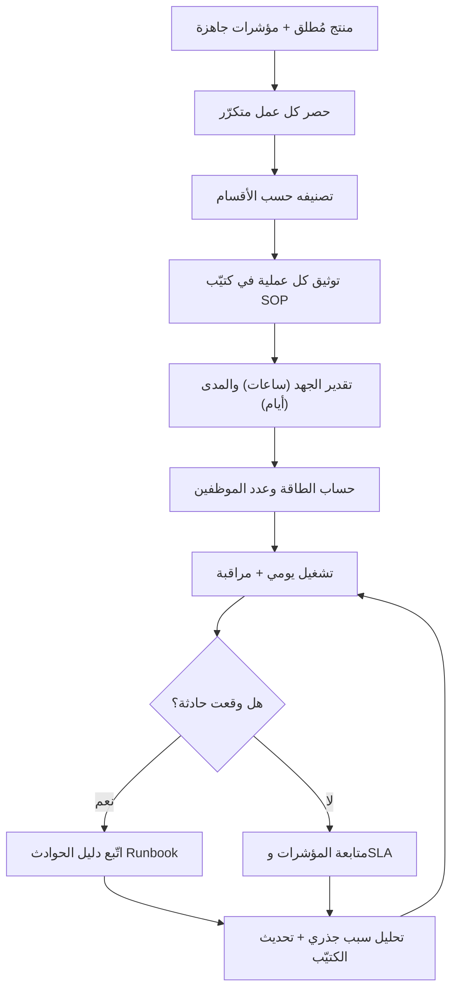

# 11 · العمليات

> [!abstract] ماذا ستتعلّم هنا
> - ما هي مرحلة العمليات (Operations)، ولماذا هي التي تحوّل المشروع من "تسليم لمرة واحدة" إلى "خدمة مستدامة".
> - كيف تبني كتيّب العمليات التشغيلية (SOP — [[SOP|Standard Operating Procedure]]) الذي يوثّق كل عمل متكرّر.
> - كيف تفرّق بين جهد العملية (ساعات) ومداها الزمني (أيام)، وكيف تستخدم ذلك لتقدير عدد الموظفين (Capacity).
> - كيف تكمّل الـ SOP بأدوات النضج التشغيلي: دليل استجابة الحوادث (Runbook) واتفاقية مستوى الخدمة (SLA).
> - أين تقف هذه المرحلة من رحلة [[مدير المشاريع البرمجية الحديث]] بين إغلاق المشروع وتشغيل المنتج.

## 🧭 المفهوم ببساطة

تخيّل أنك بنيت مطعمًا فاخرًا وافتتحته بحفل كبير. الحفل انتهى، والأضواء أُطفئت، والضيوف رحلوا. صباح الغد يفتح المطعم أبوابه للزبائن كل يوم. من يطبخ؟ من ينظّف؟ ماذا نفعل إذا انقطع الغاز؟ من يردّ على شكوى زبون؟

مرحلة **العمليات (Operations)** هي "اليوم التالي للحفل". بناء المنصة (تطوير، اختبار، إطلاق) كان الحفل. أما تشغيلها اليوميّ — الدعم، المحتوى، المالية، مراقبة الخوادم، متابعة المزوّدين — فهو العمليات.

ببساطة: العمليات هي **العمل المتكرّر المستمر الذي يبقي الخدمة حيّة بعد الإطلاق**. وأداتها الأساسية كتيّب العمليات (SOP): وثيقة تكتب فيها كل عمل متكرّر، من يفعله، كيف، كل كم مرة، وكم يأخذ من وقت. الهدف: أن تعمل الخدمة بانتظام دون أن تعتمد على شخص واحد "يعرف كل شيء في رأسه".

## 🧩 قاموس سريع للمصطلحات

| المصطلح (عربي) | English | المعنى ببساطة |
|---|---|---|
| كتيّب العمليات | SOP — Standard Operating Procedure | وثيقة تشرح خطوات كل عمل متكرّر ومن يفعله |
| العمليات | Operations | تشغيل الخدمة يوميًا بعد إطلاقها |
| دليل الاستجابة للحوادث | Runbook | بطاقة خطوات جاهزة للتصرّف وقت عطل طارئ |
| اتفاقية مستوى الخدمة | SLA — Service Level Agreement | وعد مقاس عن سرعة وجودة الخدمة |
| [[Capacity|الطاقة الاستيعابية]] | Capacity | كم عملًا يستطيع الفريق إنجازه (أساس التوظيف) |
| زمن الاستعادة | [[MTTR]] — [[Percentiles and Median vs Average|Mean]] Time To Recover | متوسّط الوقت لإصلاح عطل والعودة للعمل |
| [[Uptime|نسبة الإتاحة]] | Uptime | نسبة الوقت الذي تكون فيه المنصة تعمل |
| تأهيل الموظف الجديد | Onboarding | تسليم الموظف الجديد ما يحتاجه ليبدأ بسرعة |

## ⛓️ لماذا تأتي هنا وتقود للتالية

تأتي مرحلة العمليات **بعد** أن يكون لديك منتج جاهز للإطلاق أو مُطلق فعلًا (من مرحلة التنفيذ 04 والجودة 05). كما تأتي بعد أن تكون قد سلّمت المشروع رسميًا وأغلقت جوانبه القانونية والمالية (من مرحلتَي 07 و08). وتحتاج أيضًا مؤشرات الأداء ([[10 - الأداء OKR-KPI]])، لأنها هي ما ستُدار يوميًا داخل العمليات.

هذه المرحلة **تُغذّي الاستمرارية**: مؤشرات النمو والإيراد والاحتفاظ تُدار عبر عمليات الـ SOP الدورية. الطاقة المحسوبة من مجموع ساعات العمليات تُغذّي قرارات التوظيف والميزانية. والعمليات التقنية (OP-504) تُغذّي دورة التطوير القادمة (المراحل التالية بأسلوب [[02 - Scrum]]). باختصار: العمليات هي الحلقة التي تدور بلا نهاية بعد أن تتوقّف بقية المراحل الخطّية.

## 📊 مخطّط سير العمل

## 📂 مستندات هذه المرحلة — واحدًا واحدًا

📂 مستندات هذه المرحلة (في مستودع المشروع)

### 1) كتيّب العمليات التشغيلية (SOP)

> [!info] ما هو ولماذا
> سجلّ منظّم لكل عملية متكرّرة في المنصة بعد إطلاقها: لكل عملية كود ومسؤول وخطوات وتكرار ومدّة ومخرَج. هو "دماغ التشغيل" المكتوب: يحوّل العمل من اجتهاد فردي إلى عملية موثّقة قابلة للتكرار والقياس والتحسين. الملف الجاهز: `01-كتيّب-العمليات-التشغيلية-SOP.csv` و`01-كتيّب-العمليات-التشغيلية-SOP.xlsx`.

- **📥 من أين تجمع معلوماته:** من مدير كل قسم (ماذا يفعل فريقه أسبوعيًا)، من اجتماعات الفريق، ومن ملاحظة العمل الفعلي يومًا بيوم. المصدر الأصلي هنا كان ملف عمليات جاهز (مذكّرة داخلية) أُعيدت هيكلته على أقسام عافية.
- **🛠️ كيف ترتّبه:** جدول بأعمدة ثابتة — المعرّف (OP-xxx)، القسم المسؤول، المرحلة، العملية والخطوات، التكرار، المدة (ساعات)، الفترة (أيام)، المسؤول، المخرَج، ملاحظات. صنّف بأكواد: OP-0xx إدارة، OP-1xx تسويق، OP-2xx مستخدمون، OP-3xx طبي، OP-4xx مالية، OP-5xx تقني.
- **🎯 فائدته:** تأهيل سريع للموظف الجديد، استمرارية العمل عند غياب أحد، مساءلة واضحة (لكل عملية مسؤول ومخرَج)، وأساس رقمي لحساب كم موظفًا تحتاج.
- «01-كتيّب-العمليات-التشغيلية-SOP.csv» · نسخة Excel: `01-كتيّب-العمليات-التشغيلية-SOP.xlsx`

> [!example] من عافية
> الكتيّب يوثّق 28 عملية موزّعة على 6 أقسام. مثال OP-203 "إدارة الدعم الفني (التذاكر)": يومي، 4 ساعات، مسؤوله الدعم، مخرَجه "تذاكر محلولة"، وملاحظته "يرتبط بـ SLA". ومثال OP-502 "النسخ الاحتياطي": يومي، نصف ساعة فقط، لكنه حرج ومرتبط بحماية البيانات ([[PDPL]]).

### 2) دليل كتيّب العمليات التشغيلية

> [!info] ما هو ولماذا
> الوثيقة التعليمية التي تشرح لماذا نحتاج الـ SOP وكيف نستخدمه. تفسّر الأعمدة، ومنطق التقسيم، والفرق المهم بين "المدة بالساعات" (الجهد) و"الفترة بالأيام" (المدى الزمني). هي "دليل قراءة" الكتيّب.

- **📥 من أين تجمع معلوماته:** من خبرة إدارة العمليات ومن تحليل ملف الـ SOP نفسه؛ يشرح الفجوة التي يسدّها (تشغيل ما بعد الإطلاق).
- **🛠️ كيف ترتّبه:** أقسام واضحة — ما تعلّمناه، لماذا تحتاجه كمدير، كيف نظّمناه، شرح الأعمدة، كيف تستخدمه، ملاحظة الجهد مقابل المدى.
- **🎯 فائدته:** يمنع سوء استخدام الكتيّب (مثل الخلط بين الساعات والأيام)، ويجعله أداة تخطيط دقيقة لا مجرّد قائمة.
- «02-دليل-كتيّب-العمليات-التشغيلية.md»

> [!example] من عافية
> يضرب الدليل مثالًا دقيقًا: عملية قد تأخذ 8 ساعات عمل فعلي لكنها تمتدّ على 3 أيام بسبب الانتظار والمراجعات. لذلك الكتيّب يفصل العمودين: الساعات لحساب طاقة الفريق (كم موظفًا)، والأيام للجدولة (متى تبدأ وتنتهي).

> [!note] ملاحظة
> هذان المستندان هما أساس المرحلة، لكنهما ليسا كل شيء. أدوات النضج التشغيلي الأخرى — دليل الاستجابة للحوادث (Runbook)، واتفاقية مستوى الخدمة (SLA)، ومسار التصعيد — مفصّلة في قسم "لإكمال الصورة" أدناه.

## ⏱️ إدارة وقت هذه المهمة

| حجم المشروع | زمن بناء كتيّب العمليات الأولي |
|---|---|
| صغير (خدمة بسيطة، فريق قليل) | ساعات إلى يوم–يومين |
| متوسط (منصة بأقسام متعددة مثل عافية) | أيام إلى أسبوعين |
| كبير (منظومة مؤسسية، فرق كثيرة) | أسابيع إلى أشهر، ويُراجَع دوريًا |

**من يُنتج المستند وكيف يتعاونون:** ليس عمل شخص واحد. عادة 4-6 أشخاص: مدير المشروع يقود ويوحّد القالب، ومسؤول كل قسم (دعم، تسويق، مالية، تقني، طبي) يكتب عمليات قسمه. التدفّق: مدير المشروع يوزّع قالبًا موحّدًا ← كل مسؤول يملأ عمليات قسمه بأرقام واقعية ← مدير المشروع يدمج ويراجع الاتساق ← يُعتمد ويُنشر مركزيًا.

**أي ملفات تراجع:** [[مصفوفة المسؤوليات (RACI)]] (من مسؤول عن ماذا)، مؤشرات [[10 - الأداء OKR-KPI]] (لتغذية العمليات الدورية)، ووثائق الجودة (05) لربط العمليات بالمعايير.

**صيغ الملفات:**
| النوع | الصيغة المناسبة | لماذا |
|---|---|---|
| السجلّات والكتيّبات (عمليات، مؤشرات) | Excel / CSV | جداول تُفرز وتُحسب وتُحدّث بسهولة |
| الأدلّة الشارحة والـ Runbook | Word / Markdown | نصّ يُقرأ ويُحدّث بسرعة |
| الوثائق الرسمية (SLA مع مزوّد) | PDF | ثابتة ومعتمدة للتوقيع |

> [!warning] الدقّة قبل السرعة
> كتيّب عمليات مكتوب بسرعة بأرقام خيالية أسوأ من عدم وجوده — لأنك ستبني عليه قرارات توظيف وميزانية خاطئة. املأ الساعات والأيام بأرقام واقعية من تجربة الفريق، حتى لو أخذ ذلك وقتًا أطول.

## 🌐 ما تقوله المعايير الحديثة

> [!quote] معايير 2026 (ITIL 4 وممارسات التشغيل)
> [[ITIL 4|إطار ITIL 4]] تحوّل من "دورة حياة الخدمة" إلى نموذج أشمل بـ 34 ممارسة ضمن "نظام القيمة الخدمية". أبرز ما يخصّ العمليات:
> - الـ SOP يجب أن يُكتب بعقلية المستخدم النهائي، ويُقسّم إلى خطوات صغيرة مع مساعدات بصرية (مخطّطات).
> - يُخزَّن في مكان مركزي سهل الوصول لا مدفونًا في مجلدات شبكة.
> - الـ Runbook يجب أن يكون قصيرًا موجّهًا للفعل، بمالك وخطة تراجع، مربوطًا مباشرة من التنبيهات.
> - إدارة الحوادث تحتاج قائد حادثة واضحًا وتحديثات دورية وتقرير سبب جذري بعد كل حادثة.
> - في خدمات SaaS: قاعدة صريحة بأن تملك الجهة نفسها حساب النظام، مع مراجعة ربع سنوية للاشتراكات.
>
> هذا يتّصل مباشرة بـ [[مدير المشاريع البرمجية الحديث|مثلث كفاءات PMI]]: الجانب التقني (توثيق العمليات)، والقيادة (بناء استمرارية لا تعتمد على أفراد)، وإدارة الأعمال الاستراتيجية (تحويل مشروع إلى خدمة مستدامة مربحة).

## ➕ لإكمال الصورة — تحسينات مقترحة

> [!todo] ما الذي ينقص مقابل المعايير وكيف تكمله
> - **لا يوجد دليل استجابة للحوادث (Runbook):** الكتيّب يوثّق العمل الروتيني لكن لا يشرح كيف يتصرّف الفريق وقت عطل طارئ (توقّف، فشل دفع). أنشأتُ وثيقة تعليمية جاهزة: [[دليل الاستجابة للحوادث (Incident Runbook)]].
> - **الـ SLA مذكور دون تعريف:** العملية OP-203 تشير إلى "يرتبط بـ SLA" لكن لا توجد وثيقة تحدّد الأهداف المقاسة. أنشأتُ: [[اتفاقية مستوى الخدمة (SLA)]].
> - **لا مسار تصعيد واضح عند تجاوز الحدود:** ماذا يحدث حين يتجاوز عطل مدّة معيّنة؟ ارجع إلى [[مسار التصعيد (Escalation Path)]].
> - **متابعة المزوّدين دون أداة تقييم:** OP-302 يتابع المزوّدين لكن بلا معيار موحّد للحكم عليهم. استخدم [[بطاقة تقييم المورّد (Vendor Scorecard)]].
> - **العمليات الدورية غير مربوطة بلوحة متابعة حيّة:** أدرج العمليات اليومية/الأسبوعية كمهام متكرّرة في [[لوحة معلومات المشروع (Project Dashboard)]] وراقبها كما في [[16 - Task Boards]].
> - **إدارة المخاطر والجودة كمفاهيم عامة:** لتعميق البُعد الوقائي راجع [[19 - Risk Management]] و[[20 - Quality Management]].

## 🎬 سيناريوهان

> [!success] القصة الصحيحة
> **سارة**، مديرة عمليات عافية، أصرّت قبل الإطلاق على بناء كتيّب SOP كامل بمشاركة كل مسؤولي الأقسام، وأضافت Runbook لأخطر 6 حوادث وSLA للدعم. بعد شهرين غاب مسؤول الدعم فجأة أسبوعًا. الموظف البديل فتح الكتيّب، تابع التذاكر بنفس الخطوات، والتزم بـ SLA "رد خلال ساعة". لم يشعر أي مستشفى بأي خلل. النتيجة: خدمة مستقرّة لا تعتمد على الأشخاص، وثقة متزايدة من المزوّدين.

> [!failure] القصة الخاطئة
> **ماجد**، مدير مشروع آخر، اعتبر التوثيق "بيروقراطية مضيعة للوقت" واكتفى بأن "الفريق يعرف عمله". بعد الإطلاق ترك مبرمجًا وحيدًا يعرف كيفية استرجاع النسخ الاحتياطية. ليلة الجمعة تعطّلت المنصة، والمبرمج مسافر لا يردّ. لا Runbook ولا خطوات مكتوبة. بقيت المنصة معطّلة 14 ساعة، وفشلت حجوزات مواعيد كثيرة. النتيجة: انسحاب مزوّدَين غاضبَين وسمعة مهزوزة في أول أسبوع.

## 🧩 قرارات تفاعلية (فكّر ثم افتح)

> [!question]- الموقف: أطلقت المنصة وضغط العمل عالٍ. متى تبني كتيّب العمليات؟
> - **(أ)** تؤجّله حتى يهدأ الوضع
> - **(ب)** تبنيه قبل/مع الإطلاق مباشرة
> - **(ج)** تعتمد على ذاكرة الفريق مؤقتًا
>
> ✅ **الأفضل: (ب)**
> **لماذا؟** لحظات الإطلاق هي بالضبط حين تكثر الحوادث والأعمال المتكرّرة. تأجيل التوثيق يعني أن الخبرة تُبنى في رؤوس الأفراد لا في نظام، وأول غياب أو عطل يكشف الهشاشة.
> **السيناريو المثالي:** تبني SOP أوليًا قبل الإطلاق، ثم تحدّثه أسبوعيًا كلما نشأت عملية جديدة — فيكبر تدريجيًا لا دفعة واحدة متأخّرة.

> [!question]- الموقف: تريد تقدير عدد موظفي الدعم اللازمين. على أي رقم في الكتيّب تعتمد؟
> - **(أ)** الفترة بالأيام
> - **(ب)** المدة بالساعات
> - **(ج)** عدد العمليات فقط
>
> ✅ **الأفضل: (ب)**
> **لماذا؟** الطاقة الاستيعابية (Capacity) تُحسب من مجموع ساعات الجهد الفعلي، لا من المدى الزمني. عملية تمتدّ 3 أيام لكنها 8 ساعات جهد لا تستهلك موظفًا 3 أيام كاملة.
> **السيناريو المثالي:** اجمع كل ساعات العمليات المتكرّرة أسبوعيًا لكل قسم، اقسمها على ساعات عمل الموظف الأسبوعية، فتحصل على عدد الموظفين اللازم بدقّة.

> [!question]- الموقف: انقطعت المنصة وتجاوز العطل مدّة الـ SLA المتّفق عليها. ما الخطوة الأولى؟
> - **(أ)** الانتظار حتى يعود الفريق التقني من تلقاء نفسه
> - **(ب)** اتّباع الـ Runbook وتفعيل مسار التصعيد فورًا
> - **(ج)** إخفاء الحادثة عن المزوّدين حتى تُحل
>
> ✅ **الأفضل: (ب)**
> **لماذا؟** تجاوز الـ SLA يعني أن التأثير أصبح حرجًا. الـ Runbook يعطيك خطوات جاهزة للتشخيص والمعالجة تحت الضغط، ومسار التصعيد يضمن وصول القرار لمن يملك صلاحية أكبر بسرعة. الانتظار يطيل العطل، وإخفاء الحادثة يهدم الثقة ويخالف التزام الشفافية.
> **السيناريو المثالي:** فور تجاوز الحدّ، عيّن قائد حادثة، افتح قناة تواصل موحّدة، اتّبع الـ Runbook، وأبلغ المزوّدين بتحديثات دورية حتى استعادة الخدمة.

## 🧠 أسئلة تفكير ناقد وعصف ذهني (بلا إجابة واحدة)

> [!question] فكّر بعمق
> - متى يتحوّل التوثيق التشغيلي من "أداة تمكين" إلى "بيروقراطية تخنق"؟ أين الخط الفاصل؟
> - كيف توازن بين توحيد العمليات (لتكون قابلة للتكرار) وترك مساحة لاجتهاد الموظف الخبير في الحالات غير النمطية؟
> - إذا كان لكل عملية مسؤول واحد، فما مخاطر ذلك على الاستمرارية؟ وكيف تعالجها دون مضاعفة التكلفة؟
> - في منصة صحية، أيّ العمليات يجب أتمتتها فورًا وأيّها يبقى بشريًا رغم كلفته؟

> [!tip] إطار الإجابة (4 خطوات)
> 1. **حدّد المعيار:** ما القيمة التي نقيس عليها؟ (استمرارية، سرعة، جودة، تكلفة، مخاطرة).
> 2. **وازن الأطراف:** ما الذي تكسبه وما الذي تخسره في كل خيار؟ (مثال: الأتمتة تسرّع لكنها تفقد اللمسة الإنسانية في خدمة حسّاسة).
> 3. **اربط بالسياق:** ما طبيعة عافية تحديدًا؟ (صحّة = المخاطرة عالية = ميل نحو التوثيق والحذر).
> 4. **قرّر واختبر:** اتّخذ موقفًا مبدئيًا، طبّقه على نطاق صغير، وراجعه بالبيانات. مثال اتجاه: "نُوثّق كل شيء لكن نسمح بتجاوز موثّق (Documented Exception) عند الحالات الطارئة مع مراجعة لاحقة".

## ❓ نقاط للمراجعة (استرجاع)

> [!question]- ما الفرق بين مرحلة العمليات وبقية مراحل المشروع؟
> بقية المراحل خطّية لها بداية ونهاية (تنتهي بالتسليم). العمليات دورية مستمرة بلا نهاية — تبدأ بعد الإطلاق وتبقي الخدمة حيّة يوميًا. هي تحويل "المشروع" إلى "خدمة مستدامة".

> [!question]- ما الفرق بين "المدة بالساعات" و"الفترة بالأيام" في الكتيّب ولماذا يهمّ؟
> الساعات = الجهد الفعلي (أساس حساب الطاقة وعدد الموظفين). الأيام = المدى الزمني الذي تمتدّ عليه العملية (أساس الجدولة). قد تأخذ عملية 8 ساعات جهد لكنها تمتدّ 3 أيام بسبب الانتظار. الخلط بينهما يفسد تقدير الموارد.

> [!question]- لماذا يُعتبر الـ SOP أداة ضدّ "الاعتماد على الأشخاص"؟
> لأنه يوثّق كل عملية بخطواتها ومسؤولها ومخرَجها، فيصبح بإمكان أي بديل تنفيذها عند غياب صاحبها. الخبرة تنتقل من رأس فرد إلى نظام مكتوب، فتستمرّ الخدمة رغم الغياب أو الاستقالة.

> [!question]- كيف صُنّفت عمليات عافية، وكم عملية تقريبًا؟
> 28 عملية موزّعة على 6 أقسام بأكواد: OP-0xx إدارة عامة، OP-1xx تسويق وتصميم، OP-2xx شؤون المستخدمين، OP-3xx عمليات طبية، OP-4xx مالية، OP-5xx تقني.

> [!question]- ما الذي يضيفه الـ Runbook والـ SLA فوق الـ SOP؟
> الـ SOP للعمل الروتيني. الـ Runbook يضيف بُعد الاستجابة للطوارئ (خطوات عند عطل). الـ SLA يضيف بُعد الالتزام المقاس تجاه المستخدمين (سرعة الرد ونسبة الإتاحة). الثلاثة معًا تصنع نضجًا تشغيليًا.

> [!question]- كيف تحسب عدد موظفي قسم من الكتيّب؟
> اجمع ساعات كل العمليات المتكرّرة للقسم في الأسبوع، ثم اقسمها على ساعات عمل الموظف الأسبوعية (مع هامش للطوارئ). الناتج تقدير عدد الموظفين اللازم.

## 💼 من أسئلة المقابلات

> [!question]- كيف تكتب SOP فعّالًا لمهمة متكرّرة؟
> أبدأ بتحديد المستخدم النهائي وهدف العملية، ثم أقسّمها إلى خطوات قصيرة تبدأ بفعل أمر، أحدّد المسؤول والمخرَج والتكرار، أضيف مساعدات بصرية عند التعقيد، وأخزّنه في مكان مركزي سهل الوصول، ثم أراجعه دوريًا وأحدّثه كلما تغيّرت العملية.

> [!question]- ما الفرق بين SOP وRunbook؟ ومتى تستخدم كلًّا منهما؟
> SOP يوثّق العمل الروتيني المتكرّر (كيف ننشر محتوى أسبوعيًا). Runbook يوثّق الاستجابة لحادثة طارئة تحت ضغط (ماذا نفعل عند توقّف المنصة). الأول وقائي منتظم، الثاني علاجي طارئ بخطوات سريعة وخطة تراجع.

> [!question]- صف كيف تدير حادثة إنتاج حرجة من التنبيه حتى الإغلاق.
> أعيّن قائد حادثة فورًا، أصنّف الخطورة، أفتح قناة تواصل موحّدة، أتّبع الـ Runbook للتشخيص والمعالجة، أقدّم تحديثات دورية لأصحاب المصلحة، وبعد استعادة الخدمة أكتب تقرير سبب جذري ([[Root Cause Analysis|Root Cause]]) بخطة إصلاح تمنع التكرار.

> [!question]- كيف تحدّد أهداف SLA واقعية لخدمة جديدة؟
> أبدأ بأهداف متحفّظة مبنية على قدرة الفريق ومعايير القطاع، أعلن أنها مبدئية، أراقب الأداء الفعلي بضعة أشهر لأبني خط أساس، ثم أشدّها تدريجيًا. الوعد الأقلّ الذي يُوفى به أفضل من وعد كبير يُخرق.

> [!tip] إطار STAR للإجابة
> رتّب إجابتك بـ STAR: الموقف (Situation) ← المهمّة (Task) ← الفعل (Action) ← النتيجة (Result). اذكر رقمًا في النتيجة كلّما أمكن (مثل: "خفّضنا زمن حل التذاكر من 6 ساعات إلى ساعة").

## 🧪 من مبتدئ إلى محترف

> [!success] مسار التدرّج
> **مبتدئ:** تفهم أن العمليات = تشغيل ما بعد الإطلاق. تستطيع قراءة كتيّب SOP وتنفيذ عملية موثّقة خطوة بخطوة.
>
> **متوسّط:** تبني كتيّب SOP بنفسك لقسم، تفرّق بين الجهد والمدى، تحسب الطاقة اللازمة، وتربط العمليات الدورية بلوحة متابعة.
>
> **محترف:** تصمّم منظومة تشغيل ناضجة كاملة: SOP + Runbook + SLA + مسار تصعيد + مراجعة دورية للعمليات نفسها. تبني ثقافة "لا اعتماد على أفراد"، وتحوّل كل حادثة إلى تحسين موثّق، وتقود تحوّل المشروع إلى خدمة مستدامة مربحة.

## 🔗 ربط بالمفاهيم

- [[19 - Risk Management]]
- [[20 - Quality Management]]
- [[21 - Stakeholder Communication]]
- [[16 - Task Boards]]
- [[02 - Scrum]]
- [[15 - Roadmap]]
- [[مدير المشاريع البرمجية الحديث]]

## 📌 بطاقة مرجعية سريعة

| العنصر | الخلاصة |
|---|---|
| ما هي المرحلة | تشغيل الخدمة يوميًا بعد الإطلاق (العمل المتكرّر المستمر) |
| الأداة الأساسية | كتيّب العمليات SOP (28 عملية، 6 أقسام في عافية) |
| رقمان مهمّان | الساعات = الجهد (للطاقة) · الأيام = المدى (للجدولة) |
| أدوات النضج | Runbook (حوادث) · SLA (التزام) · مسار تصعيد |
| القيمة الكبرى | استمرارية لا تعتمد على أفراد + أساس لتقدير التوظيف |
| من ينتجه | مدير المشروع + مسؤولو الأقسام (تعاون 4-6 أشخاص) |

> [!tip] قواعد ذهبية
> - وثّق كل عملية متكرّرة فورًا؛ الخبرة في النظام لا في الرؤوس.
> - افصل الجهد (ساعات) عن المدى (أيام) لتقدير دقيق.
> - الدقّة قبل السرعة: أرقام واقعية تبني قرارات صحيحة.

> [!quote] مصادر
> - [ITIL Best Practices: How to Improve IT Service Management in 2026 — itsm.tools](https://itsm.tools/itil-best-practices/)
> - [Standard Operating Procedures: Practical Guide for Teams (2026) — VisualSP](https://www.visualsp.com/blog/standard-operating-procedures/)
> - [Standard Operating Procedures for IT — Kaseya](https://www.kaseya.com/blog/it-sops-guide/)
> - [Top 50+ IT Operations Interview Questions and Answers (2026) — Web Asha](https://www.webasha.com/blog/top-50-it-operations-interview-questions-and-answers)

> [!tip] 💡 إثراء عملي — من ورشة خبير
> طالع [[6. ما بعد الإطلاق - الأخطاء و SLA وخدمة العملاء|ورشة أجايل]] لتطبيق عملي وتجارب ميدانية.
