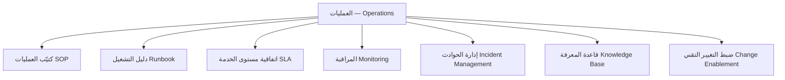
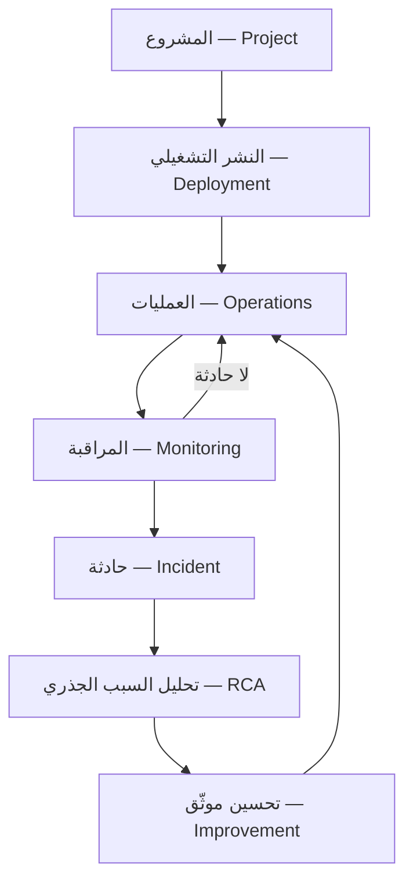
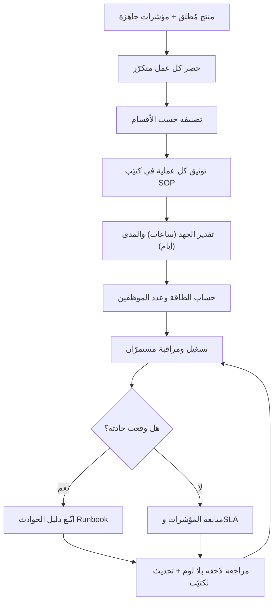
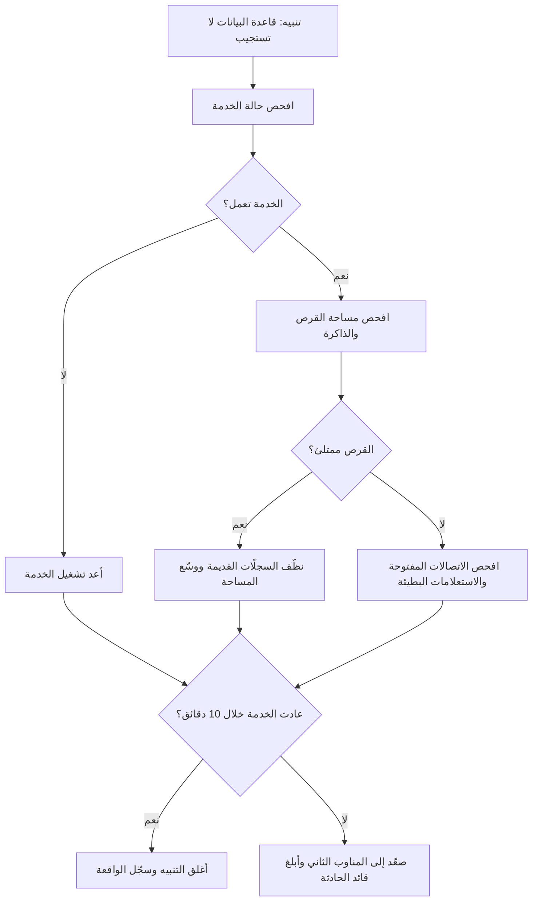

# 11 · العمليات

> [!abstract] ماذا ستتعلّم هنا
> - ما هي مرحلة العمليات (Operations)، ولماذا هي التي تحوّل المشروع من "تسليم لمرة واحدة" إلى "خدمة مستدامة".
> - **خريطة العمليات السبع** — وأن كتيّب العمليات ركنٌ فيها لا هي كلّها.
> - كيف تبني كتيّب العمليات التشغيلية (SOP — [[SOP|Standard Operating Procedure]]) الذي يوثّق كل عمل متكرّر، وكيف يختلف عن قائمة التحقّق وسير العمل ودليل التشغيل.
> - كيف **تستلم** الخدمة من فريق المشروع: تدريب الدعم، وقبول التشغيل، والصلاحيات، والمراقبة الأولى.
> - كيف تفرّق بين جهد العملية (ساعات) ومداها الزمني (أيام)، وكيف تستخدم ذلك لتقدير عدد الموظفين (Capacity) — **بمثال محسوب**.
> - كيف تُراقب الخدمة وتُناوب عليها وتُغيّرها بأمان، وكيف تُراجع الحادثة بلا لوم.
> - **بأيّ أرقام تُقاس العمليات نفسها** — وما مبادؤها السبعة التي تحكمها كلّها.
> - أين تقف هذه المرحلة من رحلة [[مدير المشاريع البرمجية الحديث]] بين إغلاق المشروع وتشغيل المنتج.

## 🧭 المفهوم ببساطة

تخيّل أنك بنيت مطعمًا فاخرًا وافتتحته بحفل كبير. الحفل انتهى، والأضواء أُطفئت، والضيوف رحلوا. صباح الغد يفتح المطعم أبوابه للزبائن كل يوم. من يطبخ؟ من ينظّف؟ ماذا نفعل إذا انقطع الغاز؟ من يردّ على شكوى زبون؟

مرحلة **العمليات (Operations)** هي "اليوم التالي للحفل". بناء المنصة (تطوير، اختبار، إطلاق) كان الحفل. أما تشغيلها اليوميّ — الدعم، المحتوى، المالية، مراقبة الخوادم، متابعة المزوّدين — فهو العمليات.

ببساطة: العمليات هي **العمل المتكرّر المستمر الذي يبقي الخدمة حيّة بعد الإطلاق**. وأداتها الأساسية كتيّب العمليات (SOP): وثيقة تكتب فيها كل عمل متكرّر، من يفعله، كيف، كل كم مرة، وكم يأخذ من وقت. الهدف: أن تعمل الخدمة بانتظام دون أن تعتمد على شخص واحد "يعرف كل شيء في رأسه".

> [!info] اصطلاح ثابت في هذا الفصل
> يجري في أدبيات التشغيل العربية ثلاثة أسماء لشيء واحد — «كتيّب العمليات» و«دليل العمليات» و«سجلّ العمليات» — فيظنّ القارئ أنها ثلاث وثائق. **والمعتمد هنا اسمان لا يتبادلان:**
>
> - **كتيّب العمليات (SOP)** — الوثيقة نفسها: جدول العمليات المتكرّرة بخطواتها ومسؤوليها. وهي ما يُستعمل يوميًّا.
> - **دليل الكتيّب** — الوثيقة التي تشرح **كيف يُقرأ الكتيّب ويُستعمل**. وهي تُقرأ مرّة ثم يُرجع إليها عند الالتباس.
>
> ولفظ «سجلّ» يبقى لما يُقيَّد فيه الوقائع بتواريخها — سجلّ الحوادث، سجلّ التغييرات — لا لوصف الكتيّب.

## 🗺️ خريطة العمليات — والكتيّب ركنٌ فيها لا هي كلّها

أشيع سوء فهم لهذه المرحلة أن يُقال: **العمليات = SOP**. وهذا يجعل مديرًا يظنّ أنه أنهى بناء منظومة التشغيل وقد كتب جدولًا. والحقيقة أن الكتيّب واحدٌ من سبعة أركان، كلٌّ منها يجيب عن سؤال لا يجيب عنه غيره:

| الركن | السؤال الذي يجيب عنه | ومتى يُفتح |
|---|---|---|
| كتيّب العمليات (SOP) | كيف نُنجز العمل **المتكرّر**؟ | كل يوم وأسبوع وشهر |
| دليل التشغيل (Runbook) | ماذا نفعل حين **يتعطّل** شيء؟ | وقت الحادثة |
| اتفاقية مستوى الخدمة (SLA) | بماذا **التزمنا** أمام المستخدم؟ | عند القياس والمساءلة |
| المراقبة (Monitoring) | كيف نعرف أن شيئًا انكسر **قبل** أن يخبرنا العميل؟ | باستمرار وتلقائيًّا |
| إدارة الحوادث | من يقود؟ ومن يُبلَّغ؟ وكيف نُغلق؟ | من التنبيه إلى الإغلاق |
| قاعدة المعرفة (Knowledge Base) | أين يجد الموظف الجواب **بنفسه**؟ | عند كل سؤال متكرّر |
| ضبط التغيير التقني | كيف نُغيّر نظامًا حيًّا بلا أن نكسره؟ | قبل كل نشر |

**والقاعدة التي تجمعها:** الأركان الثلاثة الأولى **وثائق**، والثلاثة التالية **عمليات جارية**، والسابع **بوّابة**. ومن بنى الوثائق وحدها بنى مكتبةً لا منظومة تشغيل.

## ⚖️ أربع وثائق يُخلط بينها — والفارق سؤال واحد

هذا الخلط أشيع ما يقع فيه الفريق الجديد، وأثره أن تُكتب وثيقة بغرض وتُستعمل بغرض آخر فتفشل في كليهما:

| الوثيقة | تجيب عن | صيغتها | مثال من عافية |
|---|---|---|---|
| **[[Workflow\|سير العمل (Workflow)]]** | **ما ترتيب** الخطوات ومن يستلم من مَن؟ | مخطّط · صورة كلّية | رحلة تذكرة الدعم من الفتح إلى الإغلاق مارّةً بثلاثة أقسام |
| **[[SOP\|كتيّب العمليات (SOP)]]** | **كيف نُنفّذ** هذه الخطوة بالضبط؟ | خطوات تفصيلية بفعل أمر | «كيف تُراجَع تذكرة دعم طبّي وتُصنَّف خطورتها» |
| **قائمة التحقّق (Checklist)** | **هل فعلناه** فعلًا؟ | مربّعات تُعلَّم | «قبل النشر: نسخة احتياطية ✔ · إشعار الفريق ✔ · خطة تراجع ✔» |
| **[[Runbook\|دليل التشغيل (Runbook)]]** | ماذا نفعل **حين يتعطّل**؟ | فروع قرار سريعة تحت الضغط | «إذا توقّفت قاعدة البيانات…» |

> [!tip] السؤال الفارق
> **سير العمل يرسم الطريق · والكتيّب يعلّم القيادة · وقائمة التحقّق تسأل: هل ربطت الحزام؟ · ودليل التشغيل يخبرك ماذا تفعل إذا انفجر الإطار.**
>
> والفرق بين الاثنين الأوسطين عمليّ لا لفظيّ: **الكتيّب يُقرأ لمن يتعلّم، وقائمة التحقّق تُستعمل لمن يعرف.** فالجرّاح المتمرّس لا يحتاج شرح الخطوات، ويحتاج من يسأله: هل عددتَ الأدوات قبل الإغلاق؟ ولهذا لا تُغني إحداهما عن الأخرى، والخطأ الشائع أن تُكتب قائمة التحقّق شرحًا مطوّلًا فتفقد سرعتها، أو يُكتب الكتيّب مربّعات فيفقد تعليمه.

## 🧩 قاموس سريع للمصطلحات

| المصطلح (عربي) | English | المعنى ببساطة |
|---|---|---|
| كتيّب العمليات | SOP — Standard Operating Procedure | وثيقة تشرح خطوات كل عمل متكرّر ومن يفعله |
| العمليات | Operations | تشغيل الخدمة يوميًا بعد إطلاقها |
| دليل الاستجابة للحوادث | Runbook | بطاقة خطوات جاهزة للتصرّف وقت عطل طارئ |
| اتفاقية مستوى الخدمة | SLA — Service Level Agreement | وعد مقاس عن سرعة وجودة الخدمة |
| [[Capacity\|الطاقة الاستيعابية]] | Capacity | كم عملًا يستطيع الفريق إنجازه (أساس التوظيف) |
| زمن الاستعادة | [[MTTR]] — [[Percentiles and Median vs Average\|Mean]] Time To Recover | متوسّط الوقت لإصلاح عطل والعودة للعمل |
| متوسّط الزمن بين الأعطال | MTBF | كم يصمد النظام بين عطل وآخر — يقيس الوقاية لا التعافي |
| [[Uptime\|نسبة الإتاحة]] | Uptime | نسبة الوقت الذي تكون فيه المنصة تعمل |
| المراقبة | Monitoring | نظام يخبرك أن شيئًا انكسر قبل أن يخبرك العميل |
| قابلية الرصد | Observability | صفةٌ في النظام تجعله يُسأل **لماذا** انكسر لا أنه انكسر فقط |
| المناوبة | On-call | ترتيب مجدوَل يحدّد من يستقبل التنبيه خارج الدوام |
| ضبط التغيير التقني | Change Enablement | بوّابة تحكم نشر أي تعديل على نظام حيّ |
| قاعدة المعرفة | Knowledge Base | مصدر بحث يجد فيه الموظف الجواب بنفسه |
| كتالوج الخدمات | Service Catalog | سجلّ الخدمات المقدَّمة بمالكها وساعاتها والتزامها |
| المراجعة اللاحقة بلا لوم | [[Blameless Postmortem\|Blameless Postmortem]] | تحليل حادثة يبحث عن العطل في النظام لا في الشخص |
| تأهيل الموظف الجديد | Onboarding | تسليم الموظف الجديد ما يحتاجه ليبدأ بسرعة |

## ⛓️ لماذا تأتي هنا وتقود للتالية

تأتي مرحلة العمليات **بعد** أن يكون لديك منتج جاهز للإطلاق أو مُطلق فعلًا (من مرحلة التنفيذ 04 والجودة 05). كما تأتي بعد أن تكون قد سلّمت المشروع رسميًا وأغلقت جوانبه القانونية والمالية (من مرحلتَي 07 و08). وتحتاج أيضًا مؤشرات الأداء ([[10 - الأداء OKR-KPI]])، لأنها هي ما ستُدار يوميًا داخل العمليات.

هذه المرحلة **تُغذّي الاستمرارية**: مؤشرات النمو والإيراد والاحتفاظ تُدار عبر عمليات الـ SOP الدورية. الطاقة المحسوبة من مجموع ساعات العمليات تُغذّي قرارات التوظيف والميزانية. والعمليات التقنية (OP-504) تُغذّي دورة التطوير القادمة (المراحل التالية بأسلوب [[02 - Scrum]]). باختصار: العمليات هي الحلقة التي تدور بلا نهاية بعد أن تتوقّف بقية المراحل الخطّية.

## 🔄 دورة حياة الخدمة — أين ينتهي الخطّ وتبدأ الحلقة

هذا المخطّط يلخّص الفصل كلّه. لاحظ أن الأربعة الأولى **خطّ** له نهاية، وما بعدها **حلقة** لا تنتهي:

**والقاعدة التي يوضّحها:** كل حادثة تعود إلى العمليات **بتحسين**، لا إلى ما كانت عليه. فالحلقة التي تدور بلا أن يتغيّر شيء ليست دورة حياة، بل تكرارٌ للعطل نفسه بأسماء مختلفة.

## 🚚 الانتقال إلى التشغيل — من يبني ليس من يُشغّل

بين «المشروع انتهى» و«الخدمة تعمل» فجوةٌ يسقط فيها كثير من المنتجات. فالفريق الذي بنى ينصرف إلى مشروع آخر، والفريق الذي سيُشغّل لم يُسلَّم شيئًا — فيصير أوّل شهرٍ في حياة المنتج أسوأ شهر فيه.

> [!info] وأين هذا من الفصل السابع؟
> [[07 - التسليم والقانوني]] يعالج **جانب المُسلِّم**: ماذا يجب أن يُنقل، وبأيّ محضر، وبأيّ معيار جاهزية. وهذا القسم يعالج **جانب المُستلِم**: بماذا يقبل فريق التشغيل أن يتسلّم، وكيف يعرف أنه صار قادرًا فعلًا. والوجهان لباب واحد.

**وستّ بوّابات لا يُقبل التشغيل بسقوط واحدة منها:**

1. **تدريب فريق الدعم.** لا محاضرة واحدة، بل جلسات على حالات حقيقية من فترة الاختبار. **والمعيار: أن يحلّ الموظف تذكرةً من فئة شائعة بلا أن يسأل أحدًا.**
2. **نقل المعرفة بدرجاته.** تدريب ← ظلّ (يراقب المنفّذ) ← **ظلّ عكسي** (ينفّذ ويراقبه الأصلي) ← تشغيل مستقلّ. والدرجة الثالثة هي المحكّ، وما قبلها لا يثبت شيئًا.
3. **قبول التشغيل رسميًّا.** بمعايير مكتوبة يوقّع عليها **مسؤول التشغيل** لا مدير المشروع — فالذي سيعيش مع النظام هو من يقرّر أنه صالح للعيش معه.
4. **صلاحيات الوصول.** لكل عضوٍ في التشغيل حسابه باسمه، وتُدوَّر الأسرار المشتركة، ويُوثَّق **جرد الوصول**: من يملك ماذا، وبأيّ صلاحية، ومن يراجعها.
5. **المراقبة الأولى مفعّلة.** لا تُسلَّم خدمةٌ بلا تنبيهات تعمل وقنوات تصلها. **والاختبار: أطلق تنبيهًا اصطناعيًّا وتأكّد أنه وصل إلى إنسان مستيقظ.**
6. **الرعاية المكثّفة (Hypercare) بمعيار خروج.** فترة يبقى فيها فريق البناء متاحًا، ولا تنتهي بالتاريخ بل **بمعيار**: أسبوعان بلا حادثة من الفئة الحرجة، وثلاث تذاكر متتالية حلّها التشغيل وحده.

> [!success] سطر المعيار العملي
> **إن كان فريق التشغيل ما يزال يتّصل بمن بنى النظام ليسأله سؤالًا شائعًا، فالانتقال لم يتمّ — مهما وُقّع من محاضر.**

## 📊 مخطّط سير العمل

> [!note] لماذا «مستمرّان» لا «يومي»؟
> لأن العمليات ليست كلّها يومية: منها اليومي (متابعة التذاكر)، والأسبوعي (تقرير الأداء)، والشهري (تسوية المدفوعات)، والربعي (مراجعة الاشتراكات والصلاحيات). **والوصف الدقيق أنها منتظمة لا يومية** — وتسميتها «يومية» تجعل الفريق يهمل ما تكراره أطول، وهو غالبًا أخطرها.

## 📂 مستندات هذه المرحلة — واحدًا واحدًا

📂 مستندات هذه المرحلة (في مستودع المشروع)

### 1) كتيّب العمليات التشغيلية (SOP)

> [!info] ما هو ولماذا
> جدول منظّم لكل عملية متكرّرة في المنصة بعد إطلاقها: لكل عملية كود ومسؤول وخطوات وتكرار ومدّة ومخرَج. هو "دماغ التشغيل" المكتوب: يحوّل العمل من اجتهاد فردي إلى عملية موثّقة قابلة للتكرار والقياس والتحسين. الملف الجاهز: `01-كتيّب-العمليات-التشغيلية-SOP.csv` و`01-كتيّب-العمليات-التشغيلية-SOP.xlsx`.

- **📥 من أين تجمع معلوماته:** من مدير كل قسم (ماذا يفعل فريقه أسبوعيًا)، من اجتماعات الفريق، ومن ملاحظة العمل الفعلي يومًا بيوم. المصدر الأصلي هنا كان ملف عمليات جاهز (مذكّرة داخلية) أُعيدت هيكلته على أقسام عافية.
- **🛠️ كيف ترتّبه:** جدول بأعمدة ثابتة — المعرّف (OP-xxx)، القسم المسؤول، المرحلة، العملية والخطوات، التكرار، المدة (ساعات)، الفترة (أيام)، المسؤول، المخرَج، ملاحظات. صنّف بأكواد: OP-0xx إدارة، OP-1xx تسويق، OP-2xx مستخدمون، OP-3xx طبي، OP-4xx مالية، OP-5xx تقني.
- **🎯 فائدته:** تأهيل سريع للموظف الجديد، استمرارية العمل عند غياب أحد، مساءلة واضحة (لكل عملية مسؤول ومخرَج)، وأساس رقمي لحساب كم موظفًا تحتاج.
- «01-كتيّب-العمليات-التشغيلية-SOP.csv» · نسخة Excel: `01-كتيّب-العمليات-التشغيلية-SOP.xlsx`

> [!example] من عافية
> الكتيّب يوثّق 28 عملية موزّعة على 6 أقسام. مثال OP-203 "إدارة الدعم الفني (التذاكر)": يومي، 4 ساعات، مسؤوله الدعم، مخرَجه "تذاكر محلولة"، وملاحظته "يرتبط بـ SLA". ومثال OP-502 "النسخ الاحتياطي": يومي، نصف ساعة فقط، لكنه حرج ومرتبط بحماية البيانات ([[PDPL]]).

### 2) دليل كتيّب العمليات التشغيلية

> [!info] ما هو ولماذا
> الوثيقة التعليمية التي تشرح لماذا نحتاج الـ SOP وكيف نستخدمه. تفسّر الأعمدة، ومنطق التقسيم، والفرق المهم بين "المدة بالساعات" (الجهد) و"الفترة بالأيام" (المدى الزمني). هي "دليل قراءة" الكتيّب.

- **📥 من أين تجمع معلوماته:** من خبرة إدارة العمليات ومن تحليل ملف الـ SOP نفسه؛ يشرح الفجوة التي يسدّها (تشغيل ما بعد الإطلاق).
- **🛠️ كيف ترتّبه:** أقسام واضحة — ما تعلّمناه، لماذا تحتاجه كمدير، كيف نظّمناه، شرح الأعمدة، كيف تستخدمه، ملاحظة الجهد مقابل المدى.
- **🎯 فائدته:** يمنع سوء استخدام الكتيّب (مثل الخلط بين الساعات والأيام)، ويجعله أداة تخطيط دقيقة لا مجرّد قائمة.
- «02-دليل-كتيّب-العمليات-التشغيلية.md»

> [!example] من عافية
> يضرب الدليل مثالًا دقيقًا: عملية قد تأخذ 8 ساعات عمل فعلي لكنها تمتدّ على 3 أيام بسبب الانتظار والمراجعات. لذلك الكتيّب يفصل العمودين: الساعات لحساب طاقة الفريق (كم موظفًا)، والأيام للجدولة (متى تبدأ وتنتهي).

> [!note] ملاحظة
> هذان المستندان هما أساس المرحلة، لكنهما ليسا كل شيء. أدوات النضج التشغيلي الأخرى — دليل الاستجابة للحوادث (Runbook)، واتفاقية مستوى الخدمة (SLA)، ومسار التصعيد — مفصّلة في الأقسام التالية وفي قسم "لإكمال الصورة" أدناه.

### 🗄️ ضبط النسخ والمراجعة الدورية

وثيقة تشغيلية بلا تاريخ ولا مالك **أخطر من عدمها**، لأنها تُتَّبع وهي قديمة. فيُثبَّت في رأس كل عملية أو وثيقة تشغيلية ستّة حقول:

| الحقل | مثاله | لماذا يلزم |
|---|---|---|
| رقم النسخة | `v2.3` | ليُعرف أيّ نسخة بين يدي الموظف |
| المالك | مسؤول الدعم | فالوثيقة بلا مالك لا تُحدَّث |
| تاريخ آخر مراجعة | 2026-06-01 | ليُقاس عمرها |
| **تاريخ المراجعة القادمة** | 2026-12-01 | وهو الحقل الذي يجعل المراجعة **تحدث** |
| المعتمِد | مدير العمليات | فالاعتماد يفصل المسوّدة عن المعمول به |
| سجلّ التغيير | «أُضيفت خطوة التحقّق من هوية المريض» | ليُعرف **ما** تغيّر لا أنه تغيّر |

**وقاعدة المراجعة:** تُراجَع كل عملية **كل ستّة أشهر على الأكثر**، **أو فور تغيّر العملية الفعلية** أيّهما أسبق. والثانية هي الحاكمة: فالتغيير الذي وقع في الواقع ولم يُنقل إلى الوثيقة يجعل الوثيقة **تكذب**، وكذبةٌ موثّقة أسوأ من فراغ.

> [!success] سطر المعيار العملي
> **افتح عمليةً واحدة على عشوائية واسأل منفّذها: هل هذا ما تفعله فعلًا؟ فإن قال «تقريبًا، لكننا غيّرنا الخطوة الثالثة من زمن»، فكتيّبك أرشيفٌ لا مرجع.**

## 🗂️ قاعدة المعرفة — أين يجد الناس الجواب بأنفسهم

الكتيّب لمن **ينفّذ** عملية، ودليل التشغيل لمن **يواجه** عطلًا. ويبقى ثالثٌ لا يغنيان عنه: **من عنده سؤال**. وقاعدة المعرفة (Knowledge Base) هي مصدر البحث الذي يجد فيه الموظف — والعميل أحيانًا — الجواب بلا أن يسأل إنسانًا.

**وثلاث طبقات لها:**

1. **الأسئلة الشائعة (FAQ) للمستخدم الخارجي** — «كيف ألغي موعدًا؟» · «لماذا فشل الدفع؟». وكل سؤال هنا **تذكرة دعم لم تُفتح**.
2. **دليل حلّ المشكلات (Troubleshooting) لفريق الدعم** — «العميل يقول إن الرسالة لم تصل: افحص هذه الثلاثة بهذا الترتيب».
3. **الويكي الداخلي (Internal Wiki)** — قرارات، وأسماء الأنظمة، ومن يملك ماذا، وسياقٌ لا يوجد في وثيقة رسمية.

> [!tip] القاعدة التي تجعلها تحيا
> **كل تذكرة تكرّرت ثلاث مرّات تصير مقالًا في قاعدة المعرفة، وحلّها يُستبدل برابط المقال.** فالدعم الذي يجيب عن السؤال نفسه أربعين مرّة لا يعمل، بل يُعوّض عن نقصٍ في التوثيق. وهذا هو الجسر بين العمليات و[[Knowledge Management|إدارة المعرفة]]: أن تتحوّل خبرة الأفراد إلى أصل للشركة.
>
> **والمقياس:** نسبة التذاكر التي حُلّت بإحالةٍ إلى مقال موجود. فإن كانت صفرًا، فقاعدة المعرفة موجودة ولا تُستعمل — وهو أشيع مصائرها.

## 📕 مثال دليل تشغيل مصغّر — «توقّفت قاعدة البيانات»

يبقى دليل التشغيل مفهومًا مجرّدًا حتى تراه. وهذا نموذج بحجمه الحقيقيّ — فدليل التشغيل الجيّد **يسع صفحة واحدة**، لأن من يقرؤه يقرؤه في الثالثة فجرًا:

**وأربعة شروط في كل دليل تشغيل** — يسقط الدليل بسقوط أحدها:

1. **مالك واسم** — من يملك هذا الدليل ويحدّثه.
2. **حدّ تصعيد بالزمن** — «إن لم تعد الخدمة خلال 10 دقائق فصعّد». وهذا الرقم هو الفرق بين دليلٍ يعمل وبطلٍ يحاول وحده حتى الصباح.
3. **خطة تراجع ([[Rollback]])** — ماذا نفعل إن أساءت الخطوةُ الحالة.
4. **رابط مباشر من التنبيه** — فالدليل الذي يُبحث عنه وقت الحادثة كأنه غير موجود.

## 📡 المراقبة — أن تعرف قبل أن يخبرك العميل

**المعيار الوحيد لنجاح المراقبة: ألّا يكون العميل هو نظام إنذارك.** وأربع طبقات تبنيها:

| الطبقة | ما تجمعه | مثال من عافية | ما تجيب عنه |
|---|---|---|---|
| **السجلّات (Logs)** | أحداث نصّية بتوقيتها | «فشل استعلام الحجز — رمز 500» | **ماذا حدث بالضبط؟** |
| **المقاييس (Metrics)** | أرقام مجمّعة عبر الزمن | زمن الاستجابة · نسبة الأخطاء · استهلاك الذاكرة | **هل الاتّجاه سليم؟** |
| **فحوص السلامة (Health Checks)** | نداء دوريّ يسأل الخدمة: أحيّة أنت؟ | فحص كل 30 ثانية لواجهة الحجز | **أتعمل الخدمة الآن؟** |
| **التنبيهات (Alerts)** | إشعار يوقظ إنسانًا | «نسبة فشل الحجوزات > 5% لخمس دقائق» | **من يجب أن يتحرّك؟** |

وتُعرض هذه كلّها في **لوحات (Dashboards)** — ولوحة التشغيل تختلف عن لوحة الإدارة في [[10 - الأداء OKR-KPI]]: تلك تُقرأ أسبوعيًّا لاتّخاذ قرار، وهذه تُقرأ في ثوانٍ لتشخيص عطل.

> [!info] إضافة مرجعية — المراقبة في مقابل قابلية الرصد
> **المراقبة (Monitoring)** أن تسأل النظام أسئلةً **أعددتَها سلفًا**: هل الذاكرة ممتلئة؟ هل زمن الاستجابة مرتفع؟ فهي تكشف الأعطال التي **توقّعتها**. و**قابلية الرصد (Observability)** صفةٌ في النظام تجعله يجيب عن أسئلة **لم تخطر لك** حين بنيته: لماذا بطؤت الحجوزات لمستخدمي مدينة واحدة بعد التحديث الأخير؟
>
> والفرق عمليّ: المراقبة تقول **أن** شيئًا انكسر، وقابلية الرصد تُمكّنك من معرفة **لماذا**. والنظام الذي يُراقَب ولا يُرصد يُنتج فرقًا تعرف أن لديها مشكلة ولا تعرف أين.

> [!danger] إرهاق التنبيهات — كيف تموت المراقبة وهي تعمل
> الفريق الذي يستقبل أربعين تنبيهًا في الليلة **يكفّ عن قراءتها بعد أسبوع**، ثم يفوته التنبيه الحقيقي بينها. **والقاعدة: كل تنبيه يوقظ إنسانًا يجب أن يكون له فعلٌ يفعله الآن.** وما لا فعل له فهو **لوحة** لا تنبيه. ومؤشّر الصحّة هنا: **نسبة التنبيهات التي أعقبها تدخّل فعليّ** — فإن كانت دون النصف، فأنت تدرّب فريقك على تجاهلك.

## 🌙 المناوبة (On-call) — من يردّ في الثالثة فجرًا؟

الخدمة التي تعمل على مدار الساعة تحتاج ترتيبًا يقول **بالاسم** من يستقبل التنبيه خارج الدوام. و«الفريق التقني» ليس جوابًا: **المسؤولية الموزّعة على الجميع لا يحملها أحد.**

| العنصر | القاعدة | مثال من عافية |
|---|---|---|
| **دورة المناوبة** | جدول معلن مسبقًا لأسابيع قادمة، لا ارتجالًا | أسبوع لكل مهندس، تسليم صباح الأحد |
| **المناوب الأول** | يستقبل التنبيه ويبدأ التشخيص | مهندس التشغيل |
| **المناوب البديل** | يُستدعى إن لم يردّ الأول خلال دقائق معدودة | مهندس ثانٍ من الدورة |
| **مسار التصعيد** | إلى من يُرفع الأمر إن تجاوز حدّه | [[مسار التصعيد (Escalation Path)]] |
| **حدّ الاستدعاء** | ما الذي يستحقّ إيقاظ إنسان أصلًا | تعطّل الحجز أو الدفع — لا بطء طفيف |
| **التعويض والراحة** | مقابلٌ للمناوبة، وراحة بعد ليلة حادثة | فالمناوبة عملٌ لا تطوّع |

> [!warning] ثلاثة تُفشل المناوبة
> **أن يناوب من لا يملك الصلاحية** فيوقَظ ليتّصل بغيره · **أن تُبنى على متطوّع دائم** فتنهار بمغادرته · **وأن يُناوَب بلا دليل تشغيل** فتصير المناوبة اختبار ذاكرة تحت الضغط. والثالثة أشيعها، وعلاجها القسم السابق لا جدول المناوبة.

## 🔁 ضبط التغيير التقني — كيف تُغيّر نظامًا حيًّا بلا أن تكسره

العمليات ليست تشغيلًا فقط، بل **تغييرًا مستمرًّا** لنظامٍ يعمل والناس عليه. وأكثر الأعطال في الأنظمة الناضجة لا يسبّبها عطل عشوائيّ، بل **تغييرٌ نُشر بلا ضبط**.

> [!warning] لا يُخلط بإدارة التغيير المؤسّسي
> اللفظ العربيّ «إدارة التغيير» يُستعمل لمفهومين متباعدين: **ضبط التغيير التقني** الذي هنا (نشر تعديل على نظام حيّ)، و**إدارة التغيير المؤسّسي** الذي يعالج انتقال **الناس** إلى طريقة عمل جديدة ومقاومتهم لها ([[ADKAR Model|نموذج ADKAR]]). فالأوّل يحرس نظامًا، والثاني يقود بشرًا — والخلط بينهما يجعل الجملة الواحدة تحتمل معنيين.

**وثلاث فئات للتغيير، لكلٍّ بوّابة بحجمها** — والخطأ الشائع أن تُعامل كلّها معاملة واحدة، فإمّا أن تُخنق التغييرات الصغيرة بالإجراءات، وإمّا أن تمرّ الكبيرة بلا فحص:

| الفئة | مثالها | من يعتمد | متى تُنشر |
|---|---|---|---|
| **قياسيّ (Standard)** | تحديث محتوى · إضافة مستخدم | معتمَدة **سلفًا**، لا تحتاج إذنًا كل مرّة | أيّ وقت |
| **عاديّ (Normal)** | نشر ميزة · ترقية مكتبة | لجنة التغيير ([[Change Control Board\|CAB]]) أو مسؤول التغيير | **نافذة الصيانة** |
| **طارئ (Emergency)** | إصلاح ثغرة أمنية مستغلَّة | مسؤول مخوَّل فورًا، **والاعتماد يُستكمل بعدها** | فورًا |

**وأربعة تُطلب في كل تغيير من الفئة العادية:**

1. **الأثر والمخاطر** — ما الذي قد ينكسر؟ ومن يتأثّر؟
2. **خطة التراجع ([[Rollback]])** — وهي **شرط لا توصية**: التغيير الذي لا يمكن التراجع عنه ليس تغييرًا بل مقامرة.
3. **نافذة الصيانة (Maintenance Window)** — موعد معلن للمستخدمين، يُختار في أخفّ ساعات الاستعمال. وفي منصّة صحّية: لا في ساعات العيادات.
4. **التحقّق بعد النشر** — فحوص محدَّدة تُجرى خلال دقائق من النشر، ومعيار يقول متى نتراجع.

> [!success] سطر المعيار العملي
> **إن كان آخر نشرٍ عندكم قد جرى بلا خطة تراجع مكتوبة، فأنتم لا تملكون ضبط تغيير — تملكون عادةً حسنة الحظّ حتى الآن.**

## 🧯 بعد الحادثة — المراجعة اللاحقة بلا لوم

تنتهي الحادثة باستعادة الخدمة، ولا تنتهي المعالجة. و**[[Blameless Postmortem|المراجعة اللاحقة بلا لوم]]** هي ما يحوّل العطل من خسارة إلى تحسين موثّق.

**ومعنى «بلا لوم» ليس التسامح، بل تغيير موضع السؤال:** لا «من أخطأ؟» بل «**ما الذي جعل الخطأ ممكنًا وغير مرئيّ؟**». فالمهندس الذي حذف جدولًا بأمر واحد ليس هو العطل — العطل أن أمرًا واحدًا كان قادرًا على ذلك بلا تأكيد ولا نسخة فورية.

**وستّة حقول لكل مراجعة:**

1. **الأثر** — كم دام العطل؟ ومن تأثّر؟ وبأيّ قدر؟ (لا «حدث خلل»).
2. **الخطّ الزمني** — من أوّل إشارة إلى الإغلاق، بالتوقيت.
3. **السبب الجذري** ([[Root Cause Analysis]]) — بأداة كسؤال «لماذا؟» خمس مرّات، لا بأوّل تفسير مقنع.
4. **ما الذي سار جيّدًا** — فالمراجعة التي لا تُثبت إلا الإخفاق تُدرَّب على إخفائه.
5. **إجراءات تصحيحية** — لكلٍّ **مالك وتاريخ**، وإلا فهي أمنيات.
6. **ما الذي منع اكتشافه أبكر؟** — وهذا الحقل أنفعها، لأن جوابه غالبًا **تنبيه ناقص**، فيعود بك إلى قسم المراقبة.

> [!danger] لماذا «بلا لوم» شرطٌ عمليّ لا خُلُقيّ
> الفريق الذي يُعاقَب على الحوادث **لا يُقلّلها، بل يُقلّل الإبلاغ عنها**. فتصير الحوادث الصغيرة تُخفى حتى تكبر، ويصير الخطّ الزمني ناقصًا، وتصير المراجعة تمثيلًا. **والمقياس المضادّ الذي يكشف هذا: عدد الحوادث المُبلَّغ عنها — فانخفاضه المفاجئ مع ثبات جودة النظام مؤشّر خطر لا نجاح.**

## 🛡️ استمرارية الأعمال والتعافي من الكوارث

النسخ الاحتياطي (OP-502) خطوة **واحدة** في منظومة أوسع، والاكتفاء به أشيع أوهام الأمان التشغيلي. فالمنظومة سؤالان:

- **استمرارية الأعمال (Business Continuity):** كيف نُبقي الخدمة قائمة — ولو جزئيًّا — أثناء الكارثة؟
- **التعافي من الكوارث (Disaster Recovery):** كيف نعود إلى الوضع الطبيعي بعدها؟

**ورقمان يحكمانهما، والخلط بينهما يقلب القرار:**

| الرقم | يقيس | سؤاله | مثال لعافية |
|---|---|---|---|
| **RTO** — زمن التعافي المستهدف | **زمنًا** | كم نحتمل أن تبقى الخدمة متوقّفة؟ | 4 ساعات |
| **RPO** — نقطة التعافي المستهدفة | **قدر بيانات** | كم من البيانات نحتمل فقدانه؟ | 15 دقيقة |

فـRTO يحدّد **قدرة الاستعادة**، وRPO يحدّد **تكرار النسخ**. ومن نسخ يوميًّا وهو يَعِد بـRPO خمس عشرة دقيقة يَعِد بما لا يملك.

> [!danger] النسخة التي لم تُستعد ليست نسخة
> **النسخ الاحتياطي الذي لم يُختبر استعادته ادّعاءٌ لا ضمان.** ويُختبر بجدولٍ معلن — كل ربع على الأقل — باستعادة فعلية إلى بيئة منفصلة، ويُقاس زمنها ويُقارن بـRTO. وقد وجد كثير من الفرق أن نسخها سليمة و**استعادتها تستغرق ثلاثة أضعاف** ما وعدوا به. والتفصيل في [[Operational Resilience|المرونة التشغيلية]].

## 📇 كتالوج الخدمات — ماذا نقدّم بالضبط؟

قبل أن تُقاس الخدمة يجب أن تُسمّى. و**كتالوج الخدمات (Service Catalog)** سجلٌّ يجيب عن سؤال يبدو بديهيًّا وتعجز عنه فرق كثيرة: **ما الخدمات التي نقدّمها، ومن يملك كلًّا منها؟**

| الخدمة | مالكها | ساعات تقديمها | التزامها (SLA) | تصنيف الحرجية |
|---|---|---|---|---|
| حجز الموعد | التقني | 24/7 | إتاحة ≥ 99.5% | حرجة |
| الاستشارة المرئية | التقني + الطبي | 8 ص – 10 م | إتاحة ≥ 99.9% وقت الجلسات | حرجة |
| الدعم الفني | الدعم | 8 ص – 8 م | ردّ أوّل خلال ساعة | مهمّة |
| التقارير الشهرية للمنشآت | المالية | أيام العمل | تسليم قبل الخامس من الشهر | عادية |

**وثلاث فوائد تجعله يستحقّ صفحته:** أنه يكشف **الخدمة اليتيمة** التي لا مالك لها (وهي أوّل ما يسقط في الحادثة)، وأنه يمنع الوعد بما لم يُلتزَم به، وأنه يفرز **ما يستحقّ المناوبة الليلية ممّا يحتمل الانتظار إلى الصباح** — فليس كل خدمة تستحقّ إيقاظ إنسان.

## 🤖 الأتمتة — السؤال الذهبي عند كل عملية

**عند كل عملية في الكتيّب، اسأل سؤالًا واحدًا: هل يمكن أتمتتها؟** فالعمل اليدويّ المتكرّر — [[Toil|الكدح التشغيلي]] — يستهلك طاقة الفريق ولا يزيد قيمة، ويكبر مع كبر الخدمة كبرًا خطّيًّا: ضعف المستخدمين يعني ضعف الساعات.

**وأربع علامات ترشّح العملية للأتمتة:** أن تكون **متكرّرة** · **يدوية** · **بلا حكم بشريّ** (خطواتها محدّدة سلفًا) · **قابلة للتوسّع مع الحمل**. فالنسخ الاحتياطي وفحص السلامة وتوليد التقارير الشهرية وإنشاء الحسابات كلّها تنطبق عليها الأربع.

**وثلاثة لا تُؤتمت** ولو تكرّرت:

1. **ما يحتاج حكمًا أو تعاطفًا** — كالردّ على شكوى مريض، أو تقدير خطورة حالة طبّية.
2. **ما لم يستقرّ بعد** — فأتمتة عملية تتغيّر كل أسبوع تُنتج آليًّا خاطئًا يصعب تصحيحه، والقاعدة: **ثبّتها يدويًّا مرّتين أو ثلاثًا قبل أن تُؤتمتها**.
3. **ما كلفة أتمتته أعلى من كلفة بقائه** — عملية نصف ساعة سنويًّا لا تستحقّ أسبوع برمجة.

> [!warning] الأتمتة تنقل المخاطرة ولا تُلغيها
> العملية المؤتمتة تصير **صامتة**: تعمل بلا أن يراها أحد — وتفشل بلا أن يراها أحد. فكل أتمتة تحتاج **تنبيهًا عند الفشل**، وإلا استبدلت خطأً مرئيًّا بخطأ خفيّ. وهذا صورةٌ من [[Automation Bias|انحياز الأتمتة]]: أن يُطمأنّ إلى الآلة لمجرّد أنها آلة.

## 📊 بماذا تُقاس العمليات نفسها؟

قسم [[10 - الأداء OKR-KPI]] يقيس **المشروع**، وهذه تقيس **التشغيل**. وسبعة مؤشّرات هي عمود هذا الباب:

| المؤشّر | ما يقيس | يجيب عن |
|---|---|---|
| **[[MTTR]]** — متوسّط زمن الاستعادة | من بدء العطل إلى عودة الخدمة | كم نصمد تحت العطل؟ — **يقيس التعافي** |
| **MTBF** — متوسّط الزمن بين الأعطال | المدّة بين عطل وآخر | كم نصمد بلا عطل؟ — **يقيس الوقاية** |
| **[[Uptime\|نسبة الإتاحة]]** | نسبة زمن عمل الخدمة | هل نفي بالتزامنا؟ |
| **معدّل التصعيد (Escalation Rate)** | نسبة التذاكر التي تجاوزت المستوى الأول | هل الصفّ الأول مؤهَّل ومزوَّد بالأدلّة؟ |
| **عمر التذاكر (Ticket Aging)** | كم بقيت التذاكر المفتوحة معلّقة | هل لدينا تذاكر تشيخ في الظلّ؟ |
| **معدّل فشل التغييرات (Change Failure Rate)** | نسبة عمليات النشر التي أوجبت تراجعًا | هل ضبط التغيير عندنا يعمل؟ |
| **زمن الاستجابة الأولى (First Response Time)** | من فتح التذكرة إلى أوّل ردّ بشريّ | هل يشعر المستخدم أن أحدًا سمعه؟ |

> [!tip] وثلاثة أزواج تُقرأ معًا لا منفردة
> - **MTTR مع MTBF:** فريق يصلح بسرعة وتتعطّل خدمته كل يومين ليس فريقًا ناجحًا — بل ماهرًا في الإطفاء. **والهدف رفع الثاني لا خفض الأول وحده.**
> - **زمن الاستجابة الأولى مع زمن الحلّ:** فالردّ السريع بلا حلّ يُنتج رضًا مؤقّتًا ثم غضبًا مضاعفًا.
> - **معدّل فشل التغييرات مع تكرار النشر:** فمن لا ينشر لا يفشل. والفريق الذي خفّض معدّل الفشل بالتوقّف عن النشر لم يتحسّن، بل تجمّد — وهذه مقايضة يقيسها بحث **DORA** بأربعة مؤشّرات مجتمعة لهذا السبب بعينه: تكرار النشر · زمن التغيير · معدّل فشل التغييرات · زمن الاستعادة.

## 🧮 حساب الطاقة الاستيعابية — مثال محسوب

الكتيّب لا يوثّق العمل فحسب، بل **يجيب عن سؤال التوظيف برقم**. وهذا حسابٌ كامل لقسم الدعم في عافية:

| الخطوة | الحساب | الناتج |
|---|---|---|
| ساعات الموظف الأسبوعية | — | **40 ساعة** |
| عدد الموظفين الحاليين | 5 | — |
| **الطاقة الخام** | 40 × 5 | **200 ساعة/أسبوع** |
| مجموع ساعات العمليات المتكرّرة | من عمود «المدة» في الكتيّب | **165 ساعة/أسبوع** |
| **نسبة الاستهلاك** | 165 ÷ 200 | **82%** |

**وكيف تُقرأ الـ82%؟** لا بوصفها «لدينا 18% فائض»، بل بأربعة أسئلة:

1. **ما الذي يملأ الـ18% الباقية؟** الاجتماعات، والتدريب، والحوادث غير المجدولة، والإجازات — وهذه **ليست فائضًا** بل عملٌ لم يدخل الكتيّب.
2. **هل الـ82% مستدامة؟** القاعدة العملية أن تُخطَّط الطاقة عند **70–80%**، لأن ما فوقها لا يترك متّسعًا لحادثة. **وفريق عند 100% ليس فريقًا مُستغَلًّا جيّدًا، بل فريقًا بلا قدرة على استقبال المفاجأة** — وأوّل حادثة تُسقط عمله المجدول كلّه.
3. **ماذا لو غاب واحد؟** الطاقة تهبط إلى 160 ساعة والحاجة 165، فيصير القسم **عاجزًا بغياب موظّف واحد**. وهذا كشفٌ لا يعطيه إلا الحساب.
4. **أيّ الساعات مرشّح للأتمتة؟** فخفض 20 ساعة بالأتمتة أرخص من توظيف السادس.

> [!warning] الخطأ الشائع في هذا الحساب
> أن تُجمع **الأيام** بدل **الساعات**. فعملية تمتدّ ثلاثة أيام وجهدها ثماني ساعات لا تشغل موظفًا ثلاثة أيام. **الساعات للطاقة، والأيام للجدولة** — والخلط بينهما يضاعف تقديرك للتوظيف بلا سبب. والتفصيل في [[Capacity|الطاقة الاستيعابية]].

## 👥 من يملك ماذا — مصفوفة مسؤوليات مصغّرة

كل عملية في الكتيّب لها **مسؤول واحد**، لكن العمليات الكبرى تعبر أقسامًا. ولهذا يُلحق بالكتيّب جدول [[مصفوفة المسؤوليات (RACI)|RACI]] مصغّر للعمليات العابرة:

| العملية | **R** المنفّذ | **A** المساءَل | **C** المستشار | **I** المُبلَّغ |
|---|---|---|---|---|
| النسخ الاحتياطي واستعادته | مهندس التشغيل | مدير التقني | الأمن السيبراني | مدير العمليات |
| حادثة انقطاع الخدمة | المناوب الأول | قائد الحادثة | التقني · الطبي | الإدارة · المنشآت |
| نشر تغيير على الإنتاج | المطوّر | مسؤول التغيير | الجودة · التشغيل | الدعم |
| الردّ على شكوى مريض | الدعم | مدير خدمة العملاء | الطبي | الإدارة |
| مراجعة الاشتراكات والصلاحيات | المالية | مدير العمليات | التقني | الإدارة |

**والقاعدتان الحاكمتان:** **`A` واحد لا غير في كل صفّ** — فالمساءَلان لا مساءَل معهما؛ و**`R` قد يتعدّد** فالتنفيذ يُقتسم. والصفّ الذي فيه `A` فارغ أو مكرّر هو بالضبط الصفّ الذي ستضيع فيه المسؤولية وقت الحادثة.

## ⏱️ إدارة وقت هذه المهمة

| حجم المشروع | زمن بناء كتيّب العمليات الأولي |
|---|---|
| صغير (خدمة بسيطة، فريق قليل) | ساعات إلى يوم–يومين |
| متوسط (منصة بأقسام متعددة مثل عافية) | أيام إلى أسبوعين |
| كبير (منظومة مؤسسية، فرق كثيرة) | أسابيع إلى أشهر، ويُراجَع دوريًا |

**من يُنتج المستند وكيف يتعاونون:** ليس عمل شخص واحد. عادة 4-6 أشخاص: مدير المشروع يقود ويوحّد القالب، ومسؤول كل قسم (دعم، تسويق، مالية، تقني، طبي) يكتب عمليات قسمه. التدفّق: مدير المشروع يوزّع قالبًا موحّدًا ← كل مسؤول يملأ عمليات قسمه بأرقام واقعية ← مدير المشروع يدمج ويراجع الاتساق ← يُعتمد ويُنشر مركزيًا.

**أي ملفات تراجع:** [[مصفوفة المسؤوليات (RACI)]] (من مسؤول عن ماذا)، مؤشرات [[10 - الأداء OKR-KPI]] (لتغذية العمليات الدورية)، ووثائق الجودة (05) لربط العمليات بالمعايير.

**صيغ الملفات:**

| النوع | الصيغة المناسبة | لماذا |
|---|---|---|
| السجلّات والكتيّبات (عمليات، مؤشرات) | Excel / CSV | جداول تُفرز وتُحسب وتُحدّث بسهولة |
| الأدلّة الشارحة والـ Runbook | Word / Markdown | نصّ يُقرأ ويُحدّث بسرعة |
| الوثائق الرسمية (SLA مع مزوّد) | PDF | ثابتة ومعتمدة للتوقيع |

> [!warning] الدقّة قبل السرعة
> كتيّب عمليات مكتوب بسرعة بأرقام خيالية أسوأ من عدم وجوده — لأنك ستبني عليه قرارات توظيف وميزانية خاطئة. املأ الساعات والأيام بأرقام واقعية من تجربة الفريق، حتى لو أخذ ذلك وقتًا أطول.

## 🌐 ما تقوله المعايير الحديثة

> [!quote] معايير 2026 (ITIL 4 وممارسات التشغيل)
> [[ITIL 4|إطار ITIL 4]] تحوّل من "دورة حياة الخدمة" إلى نموذج أشمل بـ 34 ممارسة ضمن "نظام القيمة الخدمية". أبرز ما يخصّ العمليات:
> - الـ SOP يجب أن يُكتب بعقلية المستخدم النهائي، ويُقسّم إلى خطوات صغيرة مع مساعدات بصرية (مخطّطات).
> - يُخزَّن في مكان مركزي سهل الوصول لا مدفونًا في مجلدات شبكة.
> - الـ Runbook يجب أن يكون قصيرًا موجّهًا للفعل، بمالك وخطة تراجع، مربوطًا مباشرة من التنبيهات.
> - إدارة الحوادث تحتاج قائد حادثة واضحًا وتحديثات دورية وتقرير سبب جذري بعد كل حادثة.
> - في خدمات SaaS: قاعدة صريحة بأن تملك الجهة نفسها حساب النظام، مع مراجعة ربع سنوية للاشتراكات.
>
> هذا يتّصل مباشرة بـ [[مدير المشاريع البرمجية الحديث|مثلث كفاءات PMI]]: الجانب التقني (توثيق العمليات)، والقيادة (بناء استمرارية لا تعتمد على أفراد)، وإدارة الأعمال الاستراتيجية (تحويل مشروع إلى خدمة مستدامة مربحة).

> [!info] إضافة مرجعية — ما هو معيار وما هو ممارسة
> - **معايير:** `ISO/IEC 20000` لإدارة الخدمات · `ISO 22301` لاستمرارية الأعمال · `ISO 27001` لأمن المعلومات. وهذه مواصفات منشورة يُشهَد بها.
> - **أطر وممارسات:** **ITIL 4** إطارٌ (Framework) لا معيار — وقد **غيّر اسم الممارسة** من `Change Management` في v3 إلى `Change Enablement`، فيلقى القارئ الاسمين في مصادر مختلفة. و**هندسة موثوقية المواقع ([[SRE]])** ممارسةٌ نشأت في جوجل، ومنها المراجعة بلا لوم وميزانية الأخطاء. و**DORA** بحثٌ يقيس أداء التسليم بأربعة مؤشّرات.
> - **ولا يُقال «يشترط ITIL»** — فالإطار يوصي ولا يشترط، والذي يُشترط هو ما في عقدك أو في مواصفة تُشهَد بها.

## 📜 مبادئ العمليات السبعة

> [!abstract] هويّة هذا الباب كلّه في سبع جمل
> ما سبق أدواتٌ وجداول، وهذه هي القواعد التي تُولَد منها. ومن حفظها استطاع أن يحكم على أداةٍ لم يقرأ عنها في هذا الفصل:
>
> 1. **لا تعتمد على الأشخاص.** الخبرة في النظام لا في الرؤوس — والموظف الذي «يعرف كل شيء» ليس أصلًا للشركة بل نقطة انهيار واحدة.
> 2. **كل عملية لها مالك واحد.** فما يملكه اثنان لا يملكه أحد، وما لا مالك له لا يُحدَّث ولا يُصلَح.
> 3. **كل حادثة تُوثَّق.** ولو حُلّت في خمس دقائق — فالحوادث الصغيرة المتكرّرة هي إنذار الحادثة الكبيرة.
> 4. **كل تغيير يمكن التراجع عنه.** فالتغيير بلا خطة تراجع مقامرة، والمقامرة ليست ممارسة تشغيلية.
> 5. **كل مهمّة متكرّرة مرشّحة للأتمتة.** والسؤال يُطرح على كل عملية دوريًّا لا مرّة واحدة، فما لم يستحقّ الأتمتة العام الماضي قد يستحقّها بعد أن تضاعف الحمل.
> 6. **ما لا يُقاس لا يمكن تحسينه.** ولا يُقاس ما لا يُعرَّف — فابدأ بتسمية الخدمة قبل أن تعدّ أرقامها.
> 7. **المعرفة المشتركة أقوى من المعرفة الفردية.** والسؤال الذي يُجاب عنه مرّتين يجب أن يُكتب في المرّة الثالثة.
>
> **وأشدّها الأولى، لأن الستّ الباقية تفاصيلها.** فالمالك المعلن، والحادثة الموثّقة، والتغيير القابل للتراجع، والأتمتة، والقياس، والمعرفة المشتركة — كلّها صورٌ لسؤال واحد: **ماذا يبقى من خدمتك لو غاب أشدّ الناس معرفةً بها غدًا؟**

## ➕ لإكمال الصورة — تحسينات مقترحة

> [!todo] ما الذي ينقص مقابل المعايير وكيف تكمله
> - **لا يوجد دليل استجابة للحوادث (Runbook):** الكتيّب يوثّق العمل الروتيني لكن لا يشرح كيف يتصرّف الفريق وقت عطل طارئ (توقّف، فشل دفع). أنشأتُ وثيقة تعليمية جاهزة: [[دليل الاستجابة للحوادث (Incident Runbook)]].
> - **الـ SLA مذكور دون تعريف:** العملية OP-203 تشير إلى "يرتبط بـ SLA" لكن لا توجد وثيقة تحدّد الأهداف المقاسة. أنشأتُ: [[اتفاقية مستوى الخدمة (SLA)]].
> - **لا مسار تصعيد واضح عند تجاوز الحدود:** ماذا يحدث حين يتجاوز عطل مدّة معيّنة؟ ارجع إلى [[مسار التصعيد (Escalation Path)]].
> - **متابعة المزوّدين دون أداة تقييم:** OP-302 يتابع المزوّدين لكن بلا معيار موحّد للحكم عليهم. استخدم [[بطاقة تقييم المورّد (Vendor Scorecard)]].
> - **العمليات الدورية غير مربوطة بلوحة متابعة حيّة:** أدرج العمليات اليومية/الأسبوعية كمهام متكرّرة في [[لوحة معلومات المشروع (Project Dashboard)]] وراقبها كما في [[16 - Task Boards]].
> - **إدارة المخاطر والجودة كمفاهيم عامة:** لتعميق البُعد الوقائي راجع [[19 - Risk Management]] و[[20 - Quality Management]].
> - **الكتيّب بلا حقول نسخة ومراجعة:** أضف الحقول الستّة في قسم «ضبط النسخ» أعلاه، فبدونها لا تُعرف الوثيقة القديمة من الجارية.
> - **لا كتالوج خدمات ولا تصنيف حرجية:** فتُعامَل الخدمات كلّها معاملة واحدة، ويُوقَظ المناوب لما يحتمل الصباح.

## 🎬 سيناريوهان

> [!success] القصة الصحيحة
> **سلمى**، مديرة عافية، أصرّت قبل الإطلاق على بناء كتيّب SOP كامل بمشاركة كل مسؤولي الأقسام، وأضافت Runbook لأخطر 6 حوادث وSLA للدعم. بعد شهرين غاب مسؤول الدعم فجأة أسبوعًا. الموظف البديل فتح الكتيّب، تابع التذاكر بنفس الخطوات، والتزم بـ SLA "رد خلال ساعة". لم يشعر أي مستشفى بأي خلل. النتيجة: خدمة مستقرّة لا تعتمد على الأشخاص، وثقة متزايدة من المزوّدين.

> [!failure] القصة الخاطئة
> **ماجد**، مدير مشروع آخر، اعتبر التوثيق "بيروقراطية مضيعة للوقت" واكتفى بأن "الفريق يعرف عمله". بعد الإطلاق ترك مبرمجًا وحيدًا يعرف كيفية استرجاع النسخ الاحتياطية. ليلة الجمعة تعطّلت المنصة، والمبرمج مسافر لا يردّ. لا Runbook ولا خطوات مكتوبة. بقيت المنصة معطّلة 14 ساعة، وفشلت حجوزات مواعيد كثيرة. النتيجة: انسحاب مزوّدَين غاضبَين وسمعة مهزوزة في أول أسبوع.

> [!note] المبدأ الذي تختبره القصّتان
> كلتاهما تختبر **المبدأ الأول** وحده: لا تعتمد على الأشخاص. غير أن ماجد لم يخالفه عمدًا — بل **لم يرَ أنه يخالفه**، لأن كل شيء عنده كان يعمل. فالاعتماد على الأشخاص **لا يُنتج أعراضًا حتى يقع الغياب**، وهذا ما يجعله أشدّ أخطاء التشغيل خفاءً وأكثرها كلفةً حين يظهر. **ولاحظ الفرق: عند سلمى غاب موظّف ولم يحدث شيء؛ وعند ماجد غاب موظّف فتوقّفت الخدمة أربع عشرة ساعة. والغياب واحد.**

## 🧩 قرارات تفاعلية (فكّر ثم افتح)

> [!question]- الموقف: أطلقت المنصة وضغط العمل عالٍ. متى تبني كتيّب العمليات؟
> - **(أ)** تؤجّله حتى يهدأ الوضع
> - **(ب)** تبنيه قبل/مع الإطلاق مباشرة
> - **(ج)** تعتمد على ذاكرة الفريق مؤقتًا
>
> ✅ **الأفضل: (ب)**
> **لماذا؟** لحظات الإطلاق هي بالضبط حين تكثر الحوادث والأعمال المتكرّرة. تأجيل التوثيق يعني أن الخبرة تُبنى في رؤوس الأفراد لا في نظام، وأول غياب أو عطل يكشف الهشاشة.
> **السيناريو المثالي:** تبني SOP أوليًا قبل الإطلاق، ثم تحدّثه أسبوعيًا كلما نشأت عملية جديدة — فيكبر تدريجيًا لا دفعة واحدة متأخّرة.

> [!question]- الموقف: تريد تقدير عدد موظفي الدعم اللازمين. على أي رقم في الكتيّب تعتمد؟
> - **(أ)** الفترة بالأيام
> - **(ب)** المدة بالساعات
> - **(ج)** عدد العمليات فقط
>
> ✅ **الأفضل: (ب)**
> **لماذا؟** الطاقة الاستيعابية (Capacity) تُحسب من مجموع ساعات الجهد الفعلي، لا من المدى الزمني. عملية تمتدّ 3 أيام لكنها 8 ساعات جهد لا تستهلك موظفًا 3 أيام كاملة.
> **السيناريو المثالي:** اجمع كل ساعات العمليات المتكرّرة أسبوعيًا لكل قسم، اقسمها على ساعات عمل الموظف الأسبوعية، فتحصل على عدد الموظفين اللازم بدقّة — ثم اترك هامشًا فلا تُخطَّط الطاقة فوق 80%.

> [!question]- الموقف: انقطعت المنصة وتجاوز العطل مدّة الـ SLA المتّفق عليها. ما الخطوة الأولى؟
> - **(أ)** الانتظار حتى يعود الفريق التقني من تلقاء نفسه
> - **(ب)** اتّباع الـ Runbook وتفعيل مسار التصعيد فورًا
> - **(ج)** إخفاء الحادثة عن المزوّدين حتى تُحل
>
> ✅ **الأفضل: (ب)**
> **لماذا؟** تجاوز الـ SLA يعني أن التأثير أصبح حرجًا. الـ Runbook يعطيك خطوات جاهزة للتشخيص والمعالجة تحت الضغط، ومسار التصعيد يضمن وصول القرار لمن يملك صلاحية أكبر بسرعة. الانتظار يطيل العطل، وإخفاء الحادثة يهدم الثقة ويخالف التزام الشفافية.
> **السيناريو المثالي:** فور تجاوز الحدّ، عيّن قائد حادثة، افتح قناة تواصل موحّدة، اتّبع الـ Runbook، وأبلغ المزوّدين بتحديثات دورية حتى استعادة الخدمة.

> [!question]- الموقف: مطوّر يطلب نشر إصلاح صغير مباشرةً على الإنتاج، ويقول إنه «سطر واحد لا يمكن أن يكسر شيئًا». ماذا تفعل؟
> - **(أ)** توافق، فالإجراءات للتغييرات الكبيرة
> - **(ب)** ترفض وتؤجّله إلى نافذة الصيانة القادمة مهما كان
> - **(ج)** تسأل عن فئة التغيير وخطة التراجع والتحقّق بعد النشر
>
> ✅ **الأفضل: (ج)**
> **لماذا؟** حجم التغيير لا يتناسب مع أثره — و«سطر واحد» أشهر مقدّمات الأعطال الكبرى. لكن الرفض المطلق (ب) يخنق التشغيل ويدفع الفريق إلى الالتفاف على البوّابة سرًّا، وهو أسوأ من غيابها. **والصواب أن تكون البوّابة بحجم الفئة**: قياسيّ يمرّ سلفًا، وعاديّ يمرّ بالاعتماد ونافذة الصيانة، وطارئ يمرّ فورًا ويُستكمل اعتماده بعدها.
> **السيناريو المثالي:** تسأل ثلاثة أسئلة — أيّ فئة هو؟ وما خطة التراجع؟ وبأيّ فحص نتحقّق بعد دقائق من النشر؟ فإن كان الجواب حاضرًا مرّ في دقيقة، وإن لم يكن فقد كشفتَ أنه لم يكن «سطرًا واحدًا».

> [!question]- الموقف: عدد الحوادث المُبلَّغ عنها انخفض إلى النصف هذا الربع. كيف تقرأ الرقم؟
> - **(أ)** إنجاز يُعلن للإدارة
> - **(ب)** إشارة تحتاج تحقّقًا قبل أن تُقرأ إنجازًا
> - **(ج)** خطأ في أداة القياس
>
> ✅ **الأفضل: (ب)**
> **لماذا؟** انخفاض البلاغات له تفسيران متناقضان: **أن النظام تحسّن**، أو **أن الناس كفّوا عن الإبلاغ**. والثاني يقع حين يُلام المبلّغ، أو حين يطول إجراء البلاغ، أو حين لا يتبع البلاغَ أثرٌ يراه صاحبه.
> **السيناريو المثالي:** تقرأ الرقم مع قرائنه — نسبة الإتاحة (هل تحسّنت فعلًا؟)، وشكاوى المستخدمين (هل انتقلت الحوادث إلى قناة أخرى؟)، وMTBF. فإن صعدت كلّها معًا فهو إنجاز؛ وإن انفرد رقم البلاغات بالهبوط فهو **إنذار متنكّر في هيئة نجاح**.

## 🧠 أسئلة تفكير ناقد وعصف ذهني (بلا إجابة واحدة)

> [!question] فكّر بعمق
> - متى يتحوّل التوثيق التشغيلي من "أداة تمكين" إلى "بيروقراطية تخنق"؟ أين الخط الفاصل؟
> - كيف توازن بين توحيد العمليات (لتكون قابلة للتكرار) وترك مساحة لاجتهاد الموظف الخبير في الحالات غير النمطية؟
> - إذا كان لكل عملية مسؤول واحد، فما مخاطر ذلك على الاستمرارية؟ وكيف تعالجها دون مضاعفة التكلفة؟
> - في منصة صحية، أيّ العمليات يجب أتمتتها فورًا وأيّها يبقى بشريًا رغم كلفته؟
> - إذا كان رفع نسبة الإتاحة من 99.9% إلى 99.99% يكلّف ضعف الميزانية التشغيلية، فمن يملك قرار «الكفاية»؟ وبأيّ حجّة؟

> [!tip] إطار الإجابة (4 خطوات)
> 1. **حدّد المعيار:** ما القيمة التي نقيس عليها؟ (استمرارية، سرعة، جودة، تكلفة، مخاطرة).
> 2. **وازن الأطراف:** ما الذي تكسبه وما الذي تخسره في كل خيار؟ (مثال: الأتمتة تسرّع لكنها تفقد اللمسة الإنسانية في خدمة حسّاسة).
> 3. **اربط بالسياق:** ما طبيعة عافية تحديدًا؟ (صحّة = المخاطرة عالية = ميل نحو التوثيق والحذر).
> 4. **قرّر واختبر:** اتّخذ موقفًا مبدئيًا، طبّقه على نطاق صغير، وراجعه بالبيانات. مثال اتجاه: "نُوثّق كل شيء لكن نسمح بتجاوز موثّق (Documented Exception) عند الحالات الطارئة مع مراجعة لاحقة".

## ❓ نقاط للمراجعة (استرجاع)

> [!question]- ما الفرق بين مرحلة العمليات وبقية مراحل المشروع؟
> بقية المراحل خطّية لها بداية ونهاية (تنتهي بالتسليم). العمليات دورية مستمرة بلا نهاية — تبدأ بعد الإطلاق وتبقي الخدمة حيّة يوميًا. هي تحويل "المشروع" إلى "خدمة مستدامة".

> [!question]- هل العمليات هي كتيّب الـ SOP؟
> **لا.** الكتيّب ركنٌ من سبعة: كتيّب العمليات · دليل التشغيل · اتفاقية مستوى الخدمة · المراقبة · إدارة الحوادث · قاعدة المعرفة · ضبط التغيير التقني. والثلاثة الأولى **وثائق**، والثلاثة التالية **عمليات جارية**، والسابع **بوّابة**. ومن بنى الوثائق وحدها بنى مكتبة لا منظومة تشغيل.

> [!question]- ما الفرق بين كتيّب العمليات وقائمة التحقّق وسير العمل ودليل التشغيل؟
> **سير العمل** يقول ما ترتيب الخطوات ومن يستلم من مَن · **الكتيّب** يقول كيف تُنفَّذ الخطوة · **قائمة التحقّق** تسأل هل نُفّذت · **ودليل التشغيل** يقول ماذا تفعل حين يتعطّل شيء. والفرق العملي بين الاثنين الأوسطين: الكتيّب لمن يتعلّم، وقائمة التحقّق لمن يعرف.

> [!question]- ما الفرق بين "المدة بالساعات" و"الفترة بالأيام" في الكتيّب ولماذا يهمّ؟
> الساعات = الجهد الفعلي (أساس حساب الطاقة وعدد الموظفين). الأيام = المدى الزمني الذي تمتدّ عليه العملية (أساس الجدولة). قد تأخذ عملية 8 ساعات جهد لكنها تمتدّ 3 أيام بسبب الانتظار. الخلط بينهما يفسد تقدير الموارد.

> [!question]- فريق من 5 موظفين بدوام 40 ساعة، ومجموع عملياته 165 ساعة أسبوعيًّا. ما نسبة الاستهلاك؟ وهل هي صحّية؟
> **165 ÷ (40 × 5) = 82%.** وهي **على حدّ الخطر**: القاعدة العملية أن تُخطَّط الطاقة عند 70–80% لتبقى سعةٌ للحوادث والإجازات والتدريب. وعند 82% يكفي **غياب موظّف واحد** (فتهبط الطاقة إلى 160 والحاجة 165) ليصير القسم عاجزًا.

> [!question]- ما الفرق بين MTTR وMTBF؟ ولماذا لا يُقرأ أحدهما وحده؟
> **MTTR** متوسّط زمن الاستعادة — يقيس **التعافي**. و**MTBF** متوسّط الزمن بين الأعطال — يقيس **الوقاية**. والفريق الذي يصلح في عشر دقائق وتتعطّل خدمته كل يومين ليس ناجحًا بل ماهرًا في الإطفاء. **والهدف رفع الثاني، لا خفض الأول وحده.**

> [!question]- ما الفرق بين المراقبة وقابلية الرصد؟
> **المراقبة** أن تسأل النظام أسئلة أعددتها سلفًا، فتكشف الأعطال التي توقّعتها. و**قابلية الرصد** صفةٌ فيه تجعله يجيب عن أسئلة لم تخطر لك حين بنيته. الأولى تقول **أن** شيئًا انكسر، والثانية تُمكّنك من معرفة **لماذا**.

> [!question]- ما الذي يعنيه «بلا لوم» في المراجعة اللاحقة؟ وهل هو تساهل؟
> **ليس تساهلًا بل تغييرًا لموضع السؤال:** من «من أخطأ؟» إلى «ما الذي جعل الخطأ ممكنًا وغير مرئيّ؟». وعلّته عملية لا خُلُقية: الفريق الذي يُعاقَب على الحوادث لا يُقلّلها بل **يُقلّل الإبلاغ عنها**، فتُخفى الصغيرة حتى تكبر.

> [!question]- لماذا يُعتبر الـ SOP أداة ضدّ "الاعتماد على الأشخاص"؟
> لأنه يوثّق كل عملية بخطواتها ومسؤولها ومخرَجها، فيصبح بإمكان أي بديل تنفيذها عند غياب صاحبها. الخبرة تنتقل من رأس فرد إلى نظام مكتوب، فتستمرّ الخدمة رغم الغياب أو الاستقالة.

> [!question]- كيف صُنّفت عمليات عافية، وكم عملية تقريبًا؟
> 28 عملية موزّعة على 6 أقسام بأكواد: OP-0xx إدارة عامة، OP-1xx تسويق وتصميم، OP-2xx شؤون المستخدمين، OP-3xx عمليات طبية، OP-4xx مالية، OP-5xx تقني.

> [!question]- ما الذي يضيفه الـ Runbook والـ SLA فوق الـ SOP؟
> الـ SOP للعمل الروتيني. الـ Runbook يضيف بُعد الاستجابة للطوارئ (خطوات عند عطل). الـ SLA يضيف بُعد الالتزام المقاس تجاه المستخدمين (سرعة الرد ونسبة الإتاحة). الثلاثة معًا تصنع نضجًا تشغيليًا.

> [!question]- متى تُراجع وثيقة تشغيلية؟
> **كل ستّة أشهر على الأكثر، أو فور تغيّر العملية الفعلية — أيّهما أسبق.** والثانية هي الحاكمة، لأن الوثيقة التي تخالف الواقع تُتَّبع وهي كاذبة، وذلك أسوأ من غيابها.

> [!question]- كيف تحسب عدد موظفي قسم من الكتيّب؟
> اجمع ساعات كل العمليات المتكرّرة للقسم في الأسبوع، ثم اقسمها على ساعات عمل الموظف الأسبوعية (مع هامش للطوارئ). الناتج تقدير عدد الموظفين اللازم.

## 💼 من أسئلة المقابلات

> [!question]- كيف تكتب SOP فعّالًا لمهمة متكرّرة؟
> أبدأ بتحديد المستخدم النهائي وهدف العملية، ثم أقسّمها إلى خطوات قصيرة تبدأ بفعل أمر، أحدّد المسؤول والمخرَج والتكرار، أضيف مساعدات بصرية عند التعقيد، وأخزّنه في مكان مركزي سهل الوصول، وأثبّت فيه رقم النسخة والمالك وتاريخ المراجعة القادمة، ثم أراجعه دوريًا وأحدّثه كلما تغيّرت العملية.

> [!question]- ما الفرق بين SOP وRunbook؟ ومتى تستخدم كلًّا منهما؟
> SOP يوثّق العمل الروتيني المتكرّر (كيف ننشر محتوى أسبوعيًا). Runbook يوثّق الاستجابة لحادثة طارئة تحت ضغط (ماذا نفعل عند توقّف المنصة). الأول وقائي منتظم، الثاني علاجي طارئ بخطوات سريعة وخطة تراجع.

> [!question]- صف كيف تدير حادثة إنتاج حرجة من التنبيه حتى الإغلاق.
> أعيّن قائد حادثة فورًا، أصنّف الخطورة، أفتح قناة تواصل موحّدة، أتّبع الـ Runbook للتشخيص والمعالجة، أقدّم تحديثات دورية لأصحاب المصلحة، وبعد استعادة الخدمة أعقد **مراجعة لاحقة بلا لوم** تنتهي بتقرير سبب جذري ([[Root Cause Analysis|Root Cause]]) وإجراءات تصحيحية **لكلٍّ مالك وتاريخ**.

> [!question]- كيف تنقل خدمة من فريق المشروع إلى فريق التشغيل؟
> بستّ بوّابات لا تُتخطّى: تدريب الدعم على حالات حقيقية · نقل معرفة يبلغ درجة **الظلّ العكسي** · قبول تشغيل يوقّعه مسؤول التشغيل لا مدير المشروع · صلاحيات باسم كل فرد مع تدوير الأسرار · مراقبة مفعّلة مختبَرة بتنبيه اصطناعيّ · ورعاية مكثّفة بمعيار خروج لا بتاريخ. والمعيار الجامع: أن يكفّ التشغيل عن الاتّصال بمن بنى.

> [!question]- كيف تدير نشر تغيير على نظام حيّ؟
> أصنّفه أوّلًا: قياسيّ معتمَد سلفًا، أو عاديّ يمرّ باعتماد ونافذة صيانة، أو طارئ يمرّ فورًا ويُستكمل اعتماده بعده. وأطلب في العاديّ أربعة: تقدير الأثر، وخطة تراجع مكتوبة، ونافذة صيانة معلنة في أخفّ ساعات الاستعمال، وفحوص تحقّق بعد النشر بمعيار يقول متى نتراجع. وأقيس النتيجة بـ**معدّل فشل التغييرات** مقروءًا مع تكرار النشر.

> [!question]- كيف تحدّد أهداف SLA واقعية لخدمة جديدة؟
> أبدأ بأهداف متحفّظة مبنية على قدرة الفريق ومعايير القطاع، أعلن أنها مبدئية، أراقب الأداء الفعلي بضعة أشهر لأبني خط أساس، ثم أشدّها تدريجيًا. الوعد الأقلّ الذي يُوفى به أفضل من وعد كبير يُخرق.

> [!tip] إطار STAR للإجابة
> رتّب إجابتك بـ STAR: الموقف (Situation) ← المهمّة (Task) ← الفعل (Action) ← النتيجة (Result). اذكر رقمًا في النتيجة كلّما أمكن (مثل: "خفّضنا زمن حل التذاكر من 6 ساعات إلى ساعة").

## 🧪 من مبتدئ إلى محترف

> [!success] مسار التدرّج
> **مبتدئ:** تفهم أن العمليات = تشغيل ما بعد الإطلاق. تستطيع قراءة كتيّب SOP وتنفيذ عملية موثّقة خطوة بخطوة، وتفرّق بينه وبين قائمة التحقّق ودليل التشغيل.
>
> **متوسّط:** تبني كتيّب SOP بنفسك لقسم، تفرّق بين الجهد والمدى، تحسب الطاقة اللازمة، وتربط العمليات الدورية بلوحة متابعة، وتقرأ مؤشّرات التشغيل أزواجًا لا منفردة.
>
> **محترف:** تصمّم منظومة تشغيل ناضجة كاملة: SOP + Runbook + SLA + مراقبة + مناوبة + ضبط تغيير + قاعدة معرفة + مسار تصعيد + مراجعة دورية للعمليات نفسها. تبني ثقافة "لا اعتماد على أفراد"، وتحوّل كل حادثة إلى تحسين موثّق عبر مراجعة بلا لوم، وتؤتمت ما استقرّ منها، وتقود تحوّل المشروع إلى خدمة مستدامة مربحة.

## 🔗 ربط بالمفاهيم

- [[19 - Risk Management]]
- [[20 - Quality Management]]
- [[21 - Stakeholder Communication]]
- [[16 - Task Boards]]
- [[02 - Scrum]]
- [[15 - Roadmap]]
- [[SOP]] · [[Runbook]] · [[Playbook]]
- [[Blameless Postmortem]] · [[Root Cause Analysis]]
- [[Change Control Board]] · [[Rollback]]
- [[Operational Resilience]] · [[Toil]] · [[SRE]]
- [[مدير المشاريع البرمجية الحديث]]

## 📌 بطاقة مرجعية سريعة

| العنصر | الخلاصة |
|---|---|
| ما هي المرحلة | تشغيل الخدمة بعد الإطلاق (العمل المتكرّر المنتظم) |
| أركانها السبعة | SOP · Runbook · SLA · مراقبة · حوادث · قاعدة معرفة · ضبط تغيير |
| الأداة الأساسية | كتيّب العمليات SOP (28 عملية، 6 أقسام في عافية) |
| أربع وثائق لا تُخلط | سير العمل (الترتيب) · الكتيّب (كيف) · قائمة التحقّق (هل فُعل) · دليل التشغيل (عند العطل) |
| رقمان مهمّان | الساعات = الجهد (للطاقة) · الأيام = المدى (للجدولة) |
| سقف الطاقة | تُخطَّط عند **70–80%** لا 100% |
| مؤشّراتها | MTTR · MTBF · الإتاحة · التصعيد · عمر التذاكر · فشل التغييرات · الاستجابة الأولى |
| الانتقال إلى التشغيل | ستّ بوّابات، ومحكّها **الظلّ العكسي** |
| بعد الحادثة | مراجعة لاحقة **بلا لوم** بستّة حقول وإجراءات لكلٍّ مالك وتاريخ |
| القيمة الكبرى | استمرارية لا تعتمد على أفراد + أساس لتقدير التوظيف |
| من ينتجه | مدير المشروع + مسؤولو الأقسام (تعاون 4-6 أشخاص) |

> [!tip] قواعد ذهبية
> - وثّق كل عملية متكرّرة فورًا؛ الخبرة في النظام لا في الرؤوس.
> - افصل الجهد (ساعات) عن المدى (أيام) لتقدير دقيق.
> - كل تنبيه يوقظ إنسانًا يجب أن يكون له فعلٌ يفعله الآن؛ وما لا فعل له فهو لوحة لا تنبيه.
> - لا نشر بلا خطة تراجع، ولا نسخة احتياطية بلا استعادة مختبَرة.
> - الدقّة قبل السرعة: أرقام واقعية تبني قرارات صحيحة.

## 🧠 كيف يفكر مدير المشروع في هذه المرحلة؟

لا يسأل مدير المشروع هنا «هل وثّقنا كل شيء؟» بل «**ما الذي يبقى واقفًا لو غبنا جميعًا أسبوعًا؟**». وأربعة أسئلة تدور في رأسه طوال المرحلة:

1. **«أين نقاط الفشل المفردة؟»** — أيّ عملية أو نظام أو **شخص** لو سقط سقطت معه الخدمة؟ وهذا السؤال يُطرح على البشر كما يُطرح على الخوادم.
2. **«كيف سنعرف؟»** — قبل أن يسأل «كيف سنُصلح». فالعطل الذي لا يُكتشف إلا ببلاغ عميل عطلان: عطلٌ في الخدمة وعطلٌ في المراقبة.
3. **«ما الذي يتكرّر؟»** — فالمتكرّر إمّا أن يُوثَّق فيصير عملية، أو يُؤتمت فيصير آليًّا، أو يُعالَج سببه فيختفي. **وأسوأ ما يُفعل به أن يُحتمَل.**
4. **«هل نتحسّن أم ندور؟»** — فالفريق الذي يغلق الحوادث نفسها كل شهر ليس فريقًا يعمل، بل حلقةً تدور.

> [!success] سطر المعيار العملي
> **اسحب موظّفًا واحدًا من قسم لأسبوع — دون أن يستعدّ له أحد — واقرأ ما حدث.** فإن سار العمل ولم يتّصل به أحد، فمنظومتك قائمة. وإن تعطّل شيء أو رنّ هاتفه، فقد عرفتَ **بالضبط** أيّ عملية لم تُوثَّق بعد. **وما لا يُختبر غيابه لا يُعرف حضوره.**

> [!quote] مصادر
> - [ITIL Best Practices: How to Improve IT Service Management in 2026 — itsm.tools](https://itsm.tools/itil-best-practices/)
> - [Standard Operating Procedures: Practical Guide for Teams (2026) — VisualSP](https://www.visualsp.com/blog/standard-operating-procedures/)
> - [Standard Operating Procedures for IT — Kaseya](https://www.kaseya.com/blog/it-sops-guide/)
> - [Top 50+ IT Operations Interview Questions and Answers (2026) — Web Asha](https://www.webasha.com/blog/top-50-it-operations-interview-questions-and-answers)
> - **ISO/IEC 20000-1 — Service management system requirements.** المواصفة التي يُشهَد بها في إدارة الخدمات، وهي **معيار** بخلاف ITIL.
> - **ISO 22301 — Business continuity management systems.** مرجع استمرارية الأعمال، ومنه تُشتقّ RTO وRPO واختبار الاستعادة.
> - [Google — Site Reliability Engineering (الكتاب الكامل مجّانًا)](https://sre.google/books/) — أصل المراجعة اللاحقة بلا لوم، والكدح التشغيلي، وميزانية الأخطاء. **ممارسة موثّقة لا معيار.**
> - **Atul Gawande — *The Checklist Manifesto*.** أصل التمييز بين الإجراء الذي يعلّم وقائمة التحقّق التي تسأل، ومنه انتقلت الفكرة من الطيران والجراحة إلى التشغيل.

> [!tip] 💡 إثراء عملي — من ورشة خبير
> طالع [[6. ما بعد الإطلاق - الأخطاء و SLA وخدمة العملاء|ورشة أجايل]] لتطبيق عملي وتجارب ميدانية.
