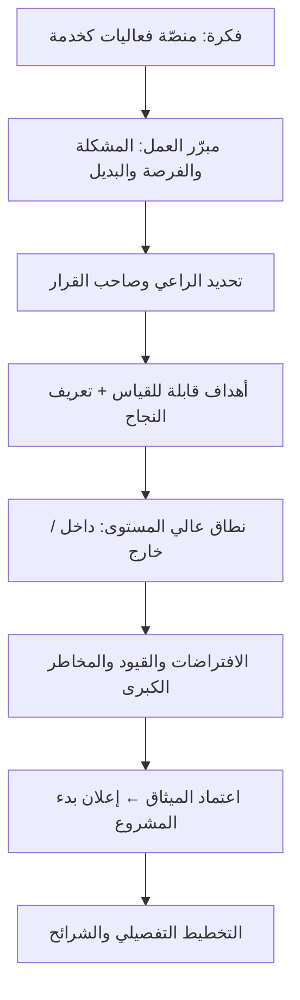

# 00 · التأسيس وميثاق المشروع

> [!abstract] ماذا ستتعلّم هنا
> - لماذا **الميثاق** أوّل وثيقة، ولماذا غيابه في مشروع منتج أخطر منه في مشروع عميل.
> - كيف نكتب ميثاقًا لمشروع **بدأ فعلًا** (لا لمشروع على الورق).
> - الفرق بين **مبرّر العمل** و«فكرة حلوة».
> - الفجوة الفعلية في ميقات والوثيقة العلاجية.

---

## 🧭 المفهوم ببساطة

**ميثاق المشروع** رخصة البناء: وثيقة من صفحة إلى ثلاث تُعلن أن المشروع موجود، وتمنح قائده صلاحيته، وتجيب عن: *لماذا؟ ما حدوده؟ من يقرّر؟ متى نقول إنه نجح؟*

> [!note] الفرق في مشروع منتج
> في مشروع عميل، الميثاق يحميك من العميل. في **مشروع منتج مثل ميقات**، الميثاق يحميك **من نفسك**: لا أحد يمنعك من إضافة ميزة جديدة كل أسبوع، ولا أحد يسألك «هل هذه ضمن النطاق؟». الميثاق هو الطرف الغائب الذي يسأل.

---

## 🔍 ماذا وجدنا في ميقات؟

| المكوّن | الحالة الفعلية |
| --- | --- |
| وثيقة معمارية مظلّة | ✅ موجودة ومعتمدة (`meeqat-architecture-design`) وتشير إلى **BRD v1.0** |
| ميثاق مشروع رسمي | ❌ غير موجود |
| راعٍ معلن ([[Sponsor]]) | ❌ غير معلن |
| معايير قبول | ✅ ثمانية معايير مرقّمة `AC-1…AC-8` مربوطة بالشرائح |
| ميزانية وجدول معتمدان | ❌ غير موجودين |
| تعريف نجاح المشروع | ⚠️ ضمنيّ: «الشرائح الخمس تعمل واختباراتها خضراء» |

> [!success] نقطة تُحسب للمشروع
> وجود **BRD** و**معايير قبول مرقّمة ومربوطة بالشرائح** يعني أن نصف وظيفة الميثاق موجود فعلًا — الناقص هو **الغلاف الحاكم**: من يملك، وبأي ميزانية، وضمن أي مدى زمني، وبأي تعريف نجاح قابل للقياس.

---

## ⚖️ المفارقة الإدارية

> [!danger] المفارقة
> مشروع يوثّق **قرار اختيار حزمة برمجية** بثلاث فقرات تشرح البدائل والأسباب… **ولا يوثّق سطرًا واحدًا** عن سبب وجود المشروع نفسه أو من يملك قرار إيقافه.
>
> هذا نمط شائع في المشاريع التي يقودها مهندس: **الانضباط يتركّز حيث يشعر بالخطر التقني**، ويغيب حيث يشعر أن «الأمر واضح». والحقيقة أن الوضوح موجود في **رأس شخص واحد** فقط.

---

## 📊 سير عمل التأسيس (كما كان يجب أن يكون)

---

## 🧩 مبرّر العمل لـ ميقات (مستخلص لا مخترَع)

> [!example] الصياغة المقترحة
> **المشكلة:** الجهات المنظِّمة تدير الفعاليات بجداول `Excel` وحضور ورقي، فتفقد بيانات المشاركين، وتصدر الشهادات يدويًّا، ولا تملك دليلًا على من حضر فعلًا.
> **الفرصة:** الجهات نفسها تنظّم فعاليات متكرّرة، فما يُبنى مرّة يُعاد استخدامه — أي **منتج** لا مشروعًا لمرّة واحدة.
> **البديل المرفوض:** بناء نظام مخصّص لكل جهة (تكلفة تتضاعف بلا تراكم) أو شراء منصّة أجنبية (لا تدعم العربية والاعتماد المهني المحلّي).
> **الرهان:** أن **التسجيل + الحضور + الشهادة** ثلاثي يكفي وحده لتبرير الاشتراك.

هذا نصّ **مبرّر عمل** كامل، ولا يوجد في المشروع. وهو تحديدًا ما يُراجَع عند أول سؤال: «هل نضيف الدفع الإلكتروني؟» — انظر [[03 - النطاق والمتطلبات]].

---

## 🕳️ الفجوة والعلاج

| الفجوة | الأثر إن بقيت | العلاج |
| --- | --- | --- |
| لا ميثاق | لا مرجع لحسم «هل هذا داخل المشروع؟» | [[ميثاق مشروع ميقات]] |
| لا راعٍ معلن | كل قرار يعود لشخص واحد بلا مساءلة | مصفوفة في [[سجل أصحاب المصلحة ومصفوفة المسؤوليات]] |
| نجاح غير معرَّف بالأرقام | «انتهينا» تصبح رأيًا لا حقيقة | [[لوحة مؤشرات الأداء OKR-KPI]] |

---

## 🔗 ربط بالمفاهيم

- المفاهيم: [[Business Case]] · [[Sponsor]] · [[Governance]] · [[SMART Goals]] · [[Delivery Charter]] · [[MVP]]
- الدورة: [[01 - من إدارة المهام إلى قيادة التسليم]] — الانتقال من «أنجز المهام» إلى «املك النتيجة».
- الورشة: [[1.1 الأساسيات وقيم أجايل]] — لماذا يبدأ العمل بالهدف لا بالمهمّة.
- المقارنة: [[00 - الوثائق التنفيذية]] في [[عافية - دراسة حالة]] — هناك كانت الفجوة نفسها.

## 📌 نقاط للمراجعة

> [!question]- 1. المشروع يعمل منذ شهور — هل يُكتب الميثاق بأثر رجعي؟
> نعم، ويُسمّى **تثبيت الأساس**. تكتبه بالحاضر: ما نبنيه، لمن، وبأي حدود من اليوم. قيمته ليست في التأريخ بل في **حسم القرارات القادمة**.

> [!question]- 2. لماذا لا يكفي وجود BRD ووثيقة معمارية؟
> لأنهما يجيبان عن **ماذا وكيف**، والميثاق يجيب عن **لماذا ومن ومتى نتوقّف** — وهي الأسئلة التي تنشأ عندها النزاعات.

> [!question]- 3. ما أخطر بند يُنسى في مواثيق المشاريع البرمجية؟
> **ما هو خارج النطاق صراحةً**. البند الوحيد الذي يوقف [[Scope Creep|تضخّم النطاق]] لاحقًا.

## 🎤 سؤال مقابلة (بصيغة STAR)

> [!example] «حدّثني عن مشروع بدأ بلا وثيقة تأسيس»
> **الموقف:** منتج SaaS ناضج تقنيًّا بلا ميثاق ولا راعٍ معلن.
> **المهمّة:** إنشاء مرجع حاكم دون تعطيل التطوير الجاري.
> **الإجراء:** كتبت ميثاقًا بأثر رجعي من الوثائق الموجودة (BRD، معايير القبول، الشرائح)، وحدّدت ما هو خارج النطاق صراحةً، واعتمدته مع صاحب القرار.
> **النتيجة:** صار لكل طلب ميزة جديدة مرجعٌ يُقاس عليه بدل النقاش الشخصي.

## ⏭️ التالي

[[01 - القيمة ونموذج المنتج]] — بعد أن عرفنا لماذا يوجد المشروع، نسأل: **لمن القيمة وكيف نقيسها؟**
