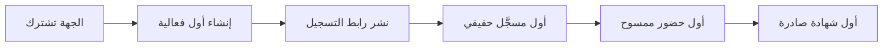

# 01 · القيمة ونموذج المنتج

> [!abstract] ماذا ستتعلّم هنا
> - الفرق العملي بين **المخرَج** و**النتيجة** على ميزات حقيقية.
> - كيف تُبنى [[Value Proposition Canvas|لوحة القيمة]] لمنتج قائم.
> - لماذا **الوقت حتى القيمة** أهمّ من عدد الميزات.
> - أين تسرّبت جهود إلى مخرجات بلا نتائج.

---

## 🧭 المفهوم ببساطة

**المخرَج (Output)** = ما بنيناه. **النتيجة (Outcome)** = ما تغيّر عند المستخدم بسببه.

> [!warning] السؤال القاتل
> «أطلقنا ماسح حضور» مخرَج. **النتيجة** هي: هل انخفض زمن دخول المشارك من 4 دقائق إلى 20 ثانية؟ وهل اختفى طابور البوّابة؟ إن لم نقس، فنحن نعدّ الميزات لا القيمة — وهذا جوهر [[Outcome vs Output]].

---

## 🎯 لوحة القيمة لـ ميقات

> [!example] الشريحة الأولى: الجهة المنظِّمة
> | آلامها ([[Pain Point]]) | ما يخفّفها في المنتج | النتيجة القابلة للقياس |
> | --- | --- | --- |
> | حضور ورقي وأرقام غير موثوقة | مسح QR بسجل حركة | نسبة حضور دقيقة لحظيًّا |
> | إصدار شهادات يدوي لأيام | إصدار تلقائي مشروط | من أيام إلى دقائق |
> | تسجيل مكرّر وبيانات فوضوية | قيد تفرّد على مستوى قاعدة البيانات | صفر تكرار |
> | لا رأي موثّق للمشاركين | نماذج تقييم مرنة | نسبة استجابة قابلة للقياس |
> | نظام لكل فعالية | منصّة متعدّدة الجهات | تكلفة حديّة قريبة من الصفر للفعالية التالية |

> [!example] الشريحة الثانية: المشارك
> | ألمه | ما يخفّفه | النتيجة |
> | --- | --- | --- |
> | طابور التسجيل عند الباب | تذكرة مسبقة + بطاقة | زمن دخول أقصر |
> | نسيان موعد الفعالية | تذكيرات مجدولة | حضور أعلى |
> | «أين شهادتي؟» | شهادة تلقائية + رابط تحقّق | صفر مكالمات متابعة |
> | خطأ في بياناته | تعديل ذاتي برمز | صفر تدخّل من الموظّف |

---

## ⏱️ الوقت حتى القيمة (Time to Value)

> [!success] المؤشّر الأهمّ لمنتج SaaS
> **كم يستغرق العميل الجديد من الاشتراك إلى أول شهادة صادرة؟** هذا هو [[Time to Value]]. إن تجاوز أسبوعًا، فمشكلتك ليست في الميزات بل في **زمن الإعداد**: بناء النموذج، تعريف المناطق، ضبط قالب الشهادة.
>
> ولهذا فإن ميزة مثل **نسخ نموذج جاهز** أو **تذكيرات افتراضية** قد تساوي — من حيث النتيجة — أكثر من ميزة تقنية ضخمة.

---

## 📈 هدف 2X مقابل 10X

> [!note] تطبيق [[2X and 10X Goals]] على المشروع
> - **هدف 2X (تحسين):** تقليل خطوات إنشاء الفعالية من 12 خطوة إلى 6.
> - **هدف 10X (إعادة تصوّر):** أن تنشئ الجهة فعالية كاملة **بنسخ فعالية سابقة** وتعديل التاريخ — فيصبح زمن الإعداد دقائق لا ساعات.
>
> التمييز مهمّ لأن الفريق يميل تلقائيًّا لأهداف 2X، بينما قفزة التبنّي تأتي غالبًا من 10X.

---

## 🕳️ أين تسرّبت الجهود؟

| الميزة | مخرَج واضح | نتيجة مقيسة؟ |
| --- | --- | --- |
| ماسح الحضور | ✅ | ⚠️ لا يوجد قياس لزمن الدخول قبل/بعد |
| الشهادات التلقائية | ✅ | ⚠️ لا قياس للزمن الموفَّر |
| بوّابة الخدمة الذاتية | ✅ | ❌ لا قياس لانخفاض طلبات الدعم |
| مصمّم قالب الشهادة | ✅ | ❌ لا نعرف كم جهة استخدمته |
| مبدّل اللغة العام | ✅ | ❌ لا نعرف نسبة الاستخدام الإنجليزي |

> [!danger] الخلاصة
> **كل ميزة في المشروع لها مخرَج موثّق، ولا ميزة لها نتيجة مقيسة.** هذه ليست مشكلة كود بل مشكلة **قيادة تسليم**: لم يُطلب من أي ميزة أن تثبت أثرها. العلاج في [[لوحة مؤشرات الأداء OKR-KPI]].

---

## 🔗 ربط بالمفاهيم

- المفاهيم: [[Outcome vs Output]] · [[Value Proposition Canvas]] · [[Time to Value]] · [[2X and 10X Goals]] · [[Product Thinking]] · [[Product-Market Fit]] · [[Adoption]] · [[Customer vs Client vs Consumer]]
- الدورة: [[01 - من إدارة المهام إلى قيادة التسليم]] · [[03 - من المديولات إلى تدفّقات القيمة]]
- الورشة: [[7.2 الأجايليّة لا الأجايل - الأعمال والثقة]] — القيمة قبل الطقوس.
- الوثيقة العلاجية: [[لوحة القيمة وتحديد الشرائح المستهدفة]]

## 📌 نقاط للمراجعة

> [!question]- 1. من «العميل» الحقيقي: الجهة أم المشارك؟
> **الجهة** تدفع، و**المشارك** يستخدم. تجاهل الثاني يقتل التبنّي، وتجاهل الأول يقتل الإيراد — انظر [[Customer vs Client vs Consumer]].

> [!question]- 2. ميزة استغرقت أسبوعين ولم يستخدمها أحد — ماذا نسمّيها؟
> [[Muda, Mura, Muri|هدرًا]] بلغة لين، و**مخرَجًا بلا نتيجة** بلغة قيادة التسليم. والدرس: تُقاس النتيجة **قبل** بناء التالي.

> [!question]- 3. كيف تختبر [[Product-Market Fit]] لهذا المنتج بأرخص تجربة؟
> جهة واحدة حقيقية، فعالية واحدة كاملة، وقياس: هل تعيد استخدام المنصّة في فعاليتها التالية دون أن تُذكَّر؟

## ⏭️ التالي

[[02 - الحوكمة وأصحاب المصلحة]] — من يقرّر أي قيمة نطاردها أولًا.
