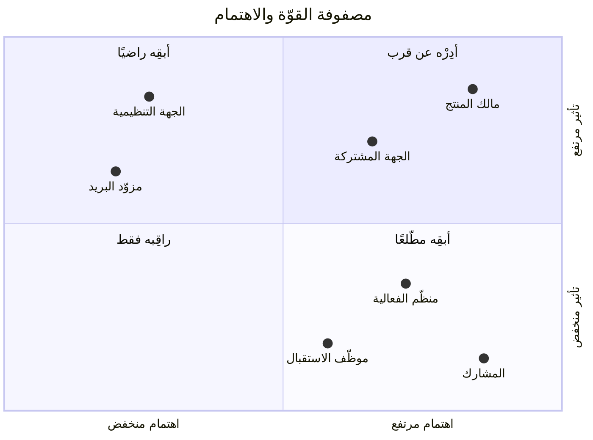
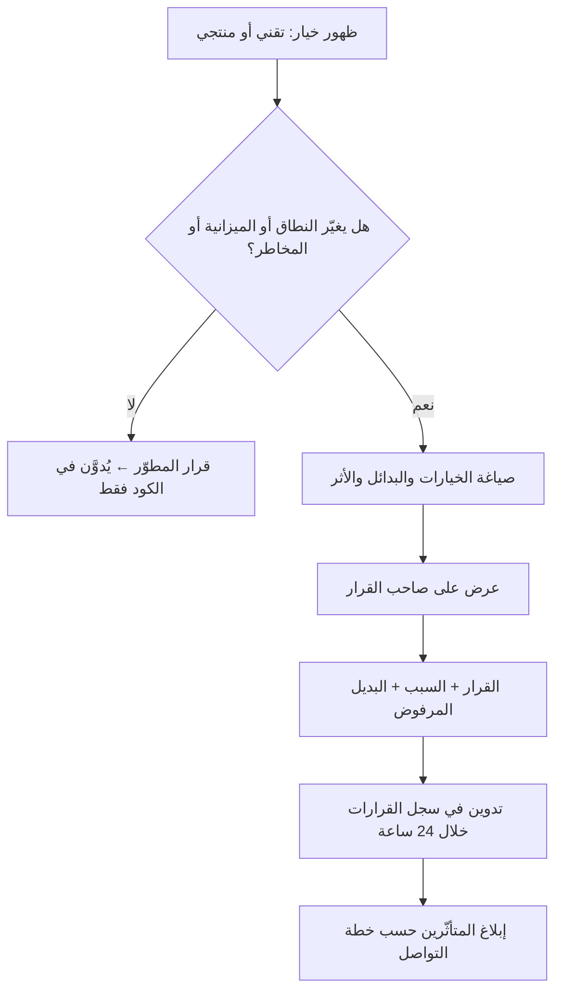

# 02 · الحوكمة وأصحاب المصلحة

> [!abstract] ماذا ستتعلّم هنا
> - لماذا تنهار **الحوكمة** في مشاريع الفريق الصغير رغم أنها الأرخص فيه.
> - كيف تُبنى مصفوفة مسؤوليات لمشروع منتج.
> - لماذا **سجل القرارات** أهمّ وثيقة في مشروع طويل العمر.
> - قراءة أصحاب المصلحة بمصفوفة القوّة والاهتمام.

---

## 🧭 المفهوم ببساطة

**الحوكمة** = القواعد قبل اللعبة: من يقرّر؟ من ينفّذ؟ من يُبلَّغ؟ كيف تُوثَّق القرارات؟ ([[Governance]])

> [!warning] الوهم الشائع
> «فريقنا صغير، لا نحتاج حوكمة». الحقيقة أن الفريق الصغير **يحتاجها أكثر** لأن كل قرار يعتمد على شخص واحد؛ فإن غاب أو نسي، ضاع السبب ولم يبقَ إلا الأثر. الحوكمة في فريق صغير لا تعني اجتماعات — تعني **سجلًّا مكتوبًا**.

---

## 👥 أصحاب المصلحة في ميقات

| الطرف | مصلحته | تأثيره | القناة |
| --- | --- | --- | --- |
| **مالك المنتج / المطوّر الرئيسي** | نجاح المنتج تقنيًّا وتجاريًّا | مرتفع جدًّا | مباشر |
| **الجهة المشتركة (مثل الجهة التجريبية)** | فعالية تُدار بلا فوضى | مرتفع | اجتماع دوري |
| **منظّم الفعالية داخل الجهة** | سهولة الإعداد | متوسط | تدريب ودعم |
| **موظّف الاستقبال** | ماسح سريع لا يتعطّل | منخفض التأثير عالي الحساسية | تدريب يوم الفعالية |
| **المشارك النهائي** | تجربة سلسة | منخفض فرديًّا، حاسم جماعيًّا | التطبيق والبريد |
| **الجهة التنظيمية (حماية البيانات)** | التزام [[PDPL]] | مرتفع عند التدقيق | وثائق |
| **مزوّد البريد** | التزام حدود الإرسال | مرتفع تشغيليًّا | إعدادات وحدود |

*المواضع قراءةٌ للجدول أعلاه لا قياسًا، والمهمّ فيها الرُّبع الذي يقع فيه الطرف لا إحداثيّته. ومنظّم الفعالية اهتمامه مرتفع وتأثيره على القرار محدود — فموضعه «أبقِه مطّلعًا»، وهو أكثر مواضع هذه المصفوفة إغفالًا في الفرق الصغيرة.*

---

## 🗂️ سجل القرارات — أهمّ ما ينقص

> [!success] المفارقة الإيجابية
> ميقات يوثّق قراراته التقنية **داخل الكود** بتعليقات تشرح السبب والبديل المرفوض — وهو سلوك نادر وممتاز. عندنا فعلًا **15 قرارًا معماريًّا موثّقًا** استخرجناها في [[18 - Architecture Decisions|القرارات المعمارية]].
>
> **المشكلة:** لا أحد خارج الكود يراها. المدير لا يقرأ `CheckInService.php`، والعميل لا يعرف لماذا صار الحضور «سجل حركة».

> [!danger] الأثر العملي لغياب السجل
> بعد ستّة أشهر يأتي مطوّر جديد ويقول: «لماذا لا نضع قيد تفرّد على المسجَّل في جدول الحضور؟» — فيكسر ميزة المناطق كلّها. السبب موجود، لكن في مكان لا يمرّ به.

العلاج: [[سجل القرارات - ميقات]] — سجلّ مقروء للإنسان يشير إلى الكود لا العكس.

---

## 📊 سير عمل اتّخاذ القرار المقترح

---

## 🧩 مصفوفة المسؤوليات لمشروع فردي — هل لها معنى؟

> [!note] نعم، ولكن بغرض مختلف
> في فريق كبير، [[RACI]] يمنع التضارب. في مشروع يقوده شخص، غرضها **كشف الأدوار المتراكمة على شخص واحد**: مالك منتج + معماري + مطوّر + مختبر + مشغّل + دعم.
>
> ملء المصفوفة يجعل الحمل مرئيًّا، ويجيب عن سؤال التوظيف: **أي دور نسنده أولًا؟** الإجابة عادةً هي الدور الذي يعطّل الباقي — غالبًا **الاختبار والتشغيل** لا التطوير.

التفصيل في [[سجل أصحاب المصلحة ومصفوفة المسؤوليات]].

---

## 🔗 ربط بالمفاهيم

- المفاهيم: [[Governance]] · [[Decision Log]] · [[Stakeholder Map]] · [[Steering Committee]] · [[Sponsor]] · [[SPOC]] · [[Single Source of Truth]] · [[21 - Stakeholder Communication]]
- الوثائق المكمّلة في دراسة عافية: [[مصفوفة المسؤوليات (RACI)]] · [[مصفوفة قوة–اهتمام أصحاب المصلحة (Power-Interest Grid)]] · [[مسار التصعيد (Escalation Path)]]
- الورشة: [[10.2 القيادة - Storming واتفاق الفريق و HR]] — الاتفاق المكتوب يمنع الصراع.
- المقارنة: [[01 - الحوكمة]] في [[عافية - دراسة حالة]].

## 📌 نقاط للمراجعة

> [!question]- 1. ما الفرق بين تعليق في الكود وسجل قرارات؟
> التعليق يخدم **من يقرأ ذلك الملف**؛ والسجل يخدم **من يسأل عن المشروع**. الأول تفصيل تنفيذ، والثاني ذاكرة مؤسسية.

> [!question]- 2. أخطر صاحب مصلحة في هذا المشروع؟
> **الجهة التنظيمية لحماية البيانات:** اهتمامها اليومي منخفض، لكن تأثيرها عند التدقيق قاتل — وهي بالضبط الحالة التي تُنسى.

> [!question]- 3. متى يتحوّل «قرار تقني» إلى «قرار حوكمة»؟
> حين يغيّر النطاق أو الكلفة أو المخاطر أو تجربة العميل. مثال: جعل ملفات الشهادات على قرص عام قرارٌ **أمني**، لا تفصيلًا تقنيًّا.

## 🎤 سؤال مقابلة (STAR)

> [!example] «كيف تدير الحوكمة في فريق من شخصين؟»
> **الموقف:** منتج بقرارات معمارية موثّقة في الكود فقط.
> **المهمّة:** جعل القرارات مرئية للأعمال بلا بيروقراطية.
> **الإجراء:** سجلّ قرارات من صفحة واحدة، سطر لكل قرار: التاريخ · القرار · السبب · البديل المرفوض · الأثر، وقاعدة: يُدوَّن كل قرار يمسّ النطاق أو المخاطر خلال 24 ساعة.
> **النتيجة:** انتقلت الذاكرة من رأس شخص إلى وثيقة، وصار تأهيل أي عضو جديد بقراءة صفحة.

## ⏭️ التالي

[[03 - النطاق والمتطلبات]] — بعد أن عرفنا من يقرّر، نحدّد ما الذي نبنيه وما الذي نرفضه.
