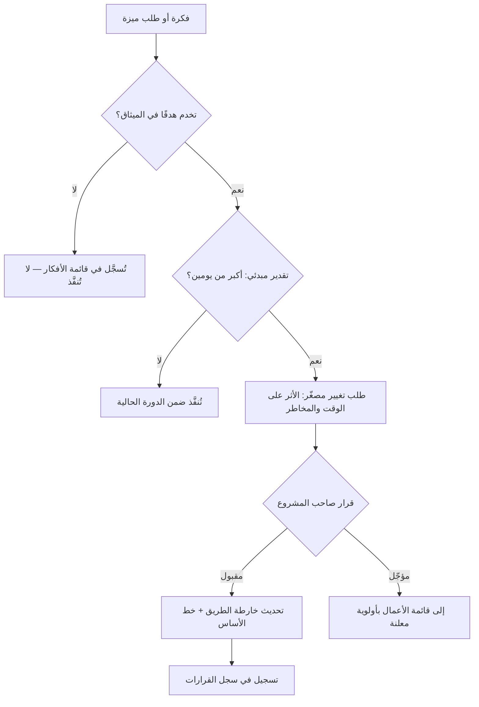

# 03 · النطاق والمتطلبات

> [!abstract] ماذا ستتعلّم هنا
> - كيف يتضخّم النطاق في مشروع **لا عميل يقاومه**.
> - قراءة الميزات اللاحقة بعين [[MoSCoW Prioritization|MoSCoW]].
> - لماذا **خارج النطاق** بند إلزامي لا تكميلي.
> - كيف يُدار التغيير بلا بيروقراطية.

---

## 🧭 المفهوم ببساطة

النطاق = خطّ يفصل ما نبنيه عمّا لا نبنيه. و[[Scope Creep|تضخّم النطاق]] هو زحف هذا الخطّ **بلا قرار معلن ولا تعديل في الوقت أو الكلفة**.

> [!danger] الحالة الأخطر: تضخّم بلا عميل
> في مشروع عميل، التضخّم يأتي من طلبات خارجية يمكن ردّها بالعقد. في **مشروع منتج**، يأتي من **داخلك**: «هذه ميزة صغيرة»، «ستأخذ ساعتين». ولا عقد يردّها.

---

## 🔍 قراءة النطاق الفعلي لـ ميقات

### النطاق الأصلي (الشرائح الخمس)

| الشريحة | المخرَج |
| --- | --- |
| S0 | الأساس: الحزم · الكيانات · اللوحتان · الأدوار |
| S1 | التسجيل + نموذج ديناميكي + منع تكرار + رمز QR |
| S2 | ماسح الحضور |
| S3 | التقييم + الشهادة المشروطة + رابط التحقّق |
| S4 | التحاليل والتصدير |

### ما أُضيف بعدها (خارج الخطّة الأصلية)

مناطق الحضور · الخروج التلقائي · محرّك النماذج المرن · مصمّم قالب الشهادة · الإصدار الجماعي · التذكيرات الهجينة · «أرسل الآن» · بوّابة الخدمة الذاتية بـرمز مؤقّت · الدعوات والأدوار المتقدّمة · بذور الأدوار · النسخ الاحتياطي · بطاقة الدخول · مبدّل اللغة · ترويسة وبريد بالهوية البصرية · صفحات أخطاء مخصّصة · أولوية طابور البريد · التعبئة التلقائية للتطوير.

> [!warning] الحكم المنصف
> **ليست هذه ميزات عبثية** — أغلبها ضروري وذكي، ولكلٍّ وثيقة تصميم. المشكلة الإدارية ليست في وجودها، بل في أن **الخطّة الأصلية لم تُحدَّث لتشملها**، فلم يعد لدينا خطّ أساس ([[Baseline]]) نقيس عليه الانحراف. النتيجة: يستحيل الإجابة عن سؤال «كم تأخّرنا؟» — لأننا لا نعرف عن أي خطّة نتحدّث.

---

## 🎚️ إعادة ترتيب بمنطق MoSCoW

| الفئة | الميزات |
| --- | --- |
| **يجب (Must)** | التسجيل · منع التكرار · رمز QR · المسح · الشهادة المشروطة · التحقّق · العزل بين الجهات |
| **ينبغي (Should)** | التذكيرات · المناطق · التحليلات · قوالب البريد · التصدير |
| **يمكن (Could)** | مصمّم قالب الشهادة · بطاقة الدخول · الخدمة الذاتية · الإصدار الجماعي · مبدّل اللغة |
| **لن (Won't — هذه الدورة)** | الدفع الإلكتروني · تطبيق جوّال أصلي · بثّ مباشر للفعاليات · تكامل أنظمة اعتماد خارجية |

> [!success] فائدة الصفّ الأخير
> صفّ **«لن»** هو أنفع صفوف الجدول: يجعل الرفض **قرارًا موثّقًا** لا مزاجًا، ويعطي جوابًا جاهزًا لأي طلب مستقبلي.

---

## 📊 سير عمل ضبط التغيير المقترح (خفيف الوزن)

> [!note] لماذا عتبة «يومين»؟
> لأن البيروقراطية التي تكلّف أكثر من العمل نفسه تُهجَر بعد أسبوع. الهدف ضبط ما يستحقّ الضبط فقط — وهذا تطبيق مباشر لدرس [[9.1 إدارة التغيير والنطاق - تكلفة التغيير]].

---

## 🧾 من BRD إلى وثيقة تصميم إلى خطة

> [!success] نقطة قوّة تستحقّ النقل لأي مشروع
> هذا التسلسل هو **[[Docs as Code|التوثيق ككود]]** بأنضج صوره: الوثيقة تسبق الكود، وتعيش في المستودع نفسه، وتُراجَع معه. الفجوة الوحيدة: **لا مصفوفة تتبّع** ([[RTM]]) تربط كل متطلّب في BRD بوثيقة تصميمه واختباره — فلا نستطيع إثبات أن كل متطلّب نُفِّذ واختُبِر.

---

## 🕳️ الفجوة والعلاج

| الفجوة | العلاج |
| --- | --- |
| لا خط أساس للنطاق | [[بيان النطاق وأولويات MoSCoW]] |
| لا سجل طلبات تغيير | قسم «سجل التغييرات» داخل الوثيقة نفسها |
| لا مصفوفة تتبّع متطلبات | جدول التتبّع في [[معايير القبول وخطة الاختبار]] |
| «خارج النطاق» غير معلن | صفّ **لن** في MoSCoW أعلاه |

## 🔗 ربط بالمفاهيم

- المفاهيم: [[Scope Statement]] · [[Scope Creep]] · [[Scope Freeze]] · [[Out of Scope]] · [[MoSCoW Prioritization]] · [[Change Request]] · [[BRD]] · [[PRD]] · [[RTM]] · [[Gold Plating]] · [[Baseline]] · [[11 - User Stories]] · [[13 - Backlog]]
- الدورة: [[04 - التقدير الواقعي وضبط النطاق]]
- المقابلات: [[9.1 إدارة التغيير والنطاق - تكلفة التغيير]] · [[9.2 إدارة التغيير - نموذج ADKAR وتضخم النطاق]]
- المقارنة: [[02 - النطاق والمتطلبات]] في [[عافية - دراسة حالة]]

## 📌 نقاط للمراجعة

> [!question]- 1. ميزة ممتازة وخارج النطاق — ماذا تفعل؟
> تُسجَّل في قائمة الأعمال بأولوية معلنة، **ولا تُنفَّذ الآن**. القرار ليس «جيدة أم لا» بل «الآن أم لاحقًا».

> [!question]- 2. ما الفرق بين [[Gold Plating|التذهيب]] وتضخّم النطاق؟
> التضخّم يأتي من **طلب خارجي**، والتذهيب من **الفريق نفسه**: تحسينات لم يطلبها أحد. الثاني هو الغالب في مشاريع المنتجات.

> [!question]- 3. لماذا لا يكفي وجود وثيقة تصميم لكل ميزة؟
> لأنها تجيب «كيف نبنيها»، ولا تجيب «**هل نبنيها الآن؟**». الأولوية قرار إداري لا تصميمي.

## ⏭️ التالي

[[04 - التخطيط والتقدير]] — كيف نحوّل نطاقًا مرتّبًا إلى جدول واقعي.
