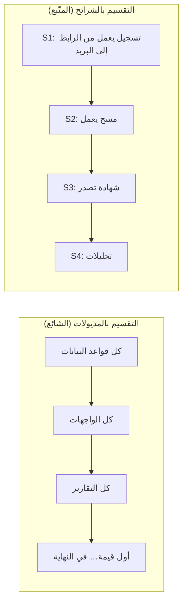
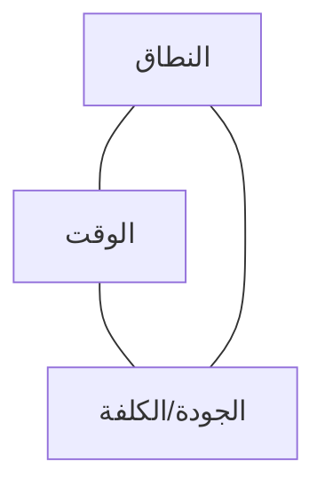

# 04 · التخطيط والتقدير

> [!abstract] ماذا ستتعلّم هنا
> - لماذا **الشريحة الرأسية** أفضل وحدة تخطيط من «المديول».
> - تطبيق [[WSJF]] على ترتيب ميزات حقيقية.
> - **معامل الواقعية** ولماذا التقدير الصادق يبدو متشائمًا.
> - المثلث الحديدي في مشروع بلا عميل.

---

## 🧭 الشريحة الرأسية: أذكى قرار تخطيطي في المشروع

قُسِّم المشروع إلى `S0 → S4`، وكل شريحة **دورة كاملة**: تصميم ← خطة ← تنفيذ ← اختبارات خضراء، قبل الانتقال للتالية.

> [!success] لماذا هذا صحيح؟
> لأن كل شريحة **تُنتج قيمة قابلة للعرض** وحدها. لو توقّف المشروع بعد `S2` لكان لديك منتج يعمل (تسجيل + حضور). أما التقسيم بالمديولات فلا يعطيك شيئًا صالحًا للاستخدام حتى آخر يوم. هذا هو جوهر [[03 - من المديولات إلى تدفّقات القيمة]] و[[Value Stream]].

---

## ⚖️ ترتيب الأولويات بـ WSJF

[[WSJF]] = **تكلفة التأخير ÷ حجم العمل**. تطبيقًا على ميزات حقيقية من المشروع (التقديرات اجتهاد للتمرين):

| الميزة | قيمة الأعمال | حساسية الوقت | تقليل المخاطر | تكلفة التأخير | الحجم | **WSJF** |
| --- | --- | --- | --- | --- | --- | --- |
| منع التسجيل المكرّر | 8 | 9 | 10 | 27 | 2 | **13.5** |
| الخروج التلقائي للحضور | 7 | 6 | 8 | 21 | 3 | **7.0** |
| دفتر إرسال التذكيرات | 6 | 8 | 10 | 24 | 4 | **6.0** |
| بوّابة الخدمة الذاتية | 8 | 5 | 4 | 17 | 8 | **2.1** |
| مصمّم قالب الشهادة | 7 | 3 | 2 | 12 | 8 | **1.5** |
| مبدّل اللغة العام | 4 | 2 | 2 | 8 | 3 | **2.7** |

> [!note] ماذا يكشف الجدول؟
> أن **الحمايات الصغيرة ضد الأخطاء الفادحة** (تكرار، بريد مكرّر، حضور مفتوح) تتصدّر القائمة دائمًا: كلفة تأخيرها عالية وحجمها صغير. بينما الميزات الجميلة كبيرة الحجم تتأخّر — **ولو رتّبنا بالحماس لانعكس الترتيب تمامًا**.

---

## 📏 التقدير الواقعي ومعامل الواقعية

> [!warning] لماذا يخطئ المطوّرون في التقدير؟
> لأنهم يقدّرون **زمن كتابة الكود** فقط، وينسون: المراجعة، الاختبار، إصلاح ما كسره التغيير، التوثيق، النشر، والانقطاعات. ولهذا يوجد [[Reality Factor|معامل الواقعية]].

| البند | مثال من ميقات |
| --- | --- |
| كتابة الكود | تنفيذ الخروج التلقائي |
| + الحالات الحافّة | مسح بعد وقت الإغلاق ⇒ مدّة سالبة |
| + الاختبارات | تشغيل متكرّر لا يُفسد النتائج |
| + التوثيق | وثيقة تصميم + شرح السبب في الكود |
| + الأثر الجانبي | تأثيره على حساب المدّة والتقارير |

> [!example] القاعدة العملية
> التقدير الصادق ≈ **تقدير الكود × 2 إلى 3** لميزة تمسّ بيانات قائمة، و**× 1.5** لميزة معزولة. من يقدّم رقمًا أصغر لا يقدّر — بل يتمنّى.

---

## 🔺 المثلث الحديدي بلا عميل

> [!danger] الخطر الخاص بالمشاريع الذاتية
> في مشروع العميل، الضغط يقع على **الوقت**، فتتنازل عن النطاق. في المشروع الذاتي، لا موعد نهائي، فيتمدّد **النطاق** بلا حدّ، وتصبح النتيجة: منتج ممتاز لا يصل إلى السوق أبدًا.
>
> **العلاج:** فرض موعد اصطناعي مرتبط بحدث حقيقي — «جاهز لفعالية الجهة الفلانية في تاريخ كذا». الموعد الخارجي هو ما يحوّل الأولويات من نقاش إلى قرار.

---

## 🗓️ خارطة الطريق المقترحة (بعد إعادة الضبط)

| الموجة | المحتوى | معيار الانتهاء |
| --- | --- | --- |
| **الموجة 1 — تثبيت** | إغلاق دليل QA · سدّ ثغرات الأخطاء · توثيق الإطلاق | كل بنود QA خضراء |
| **الموجة 2 — تشغيل حقيقي** | فعالية تجريبية كاملة مع جهة واحدة | شهادة صادرة لمشارك حقيقي |
| **الموجة 3 — قياس** | مؤشرات المشروع والتبنّي | لوحة مؤشرات تعمل |
| **الموجة 4 — توسّع** | جهة ثانية + حدود الخطط | جهتان تعملان بلا تدخّل يدوي |

التفصيل في [[خارطة الطريق وهيكل تجزئة العمل]].

## 🔗 ربط بالمفاهيم

- المفاهيم: [[WSJF]] · [[Cost of Delay]] · [[Reality Factor]] · [[Iron Triangle]] · [[MVP]] · [[Milestone]] · [[Critical Path]] · [[Estimation Variance]] · [[Original Estimate]] · [[Relative Estimation]] · [[15 - Roadmap]] · [[12 - Story Points]]
- الدورة: [[02 - التدفّق وكفاءته وترتيب الأولويات (WSJF)]] · [[04 - التقدير الواقعي وضبط النطاق]]
- الورشة: [[3.1 نقاط القصة والتقدير]] — لماذا نقدّر بالحجم النسبي لا بالساعات.
- الوثائق: [[هيكل تجزئة العمل (WBS)]]

## 📌 نقاط للمراجعة

> [!question]- 1. لماذا تصدّرت «منع التكرار» ترتيب WSJF رغم صغرها؟
> لأن **تكلفة تأخيرها** هائلة: بيانات ملوّثة يصعب تنظيفها لاحقًا، وحجمها صغير — وهذا بالضبط ما تكشفه المعادلة.

> [!question]- 2. مشروع بلا موعد نهائي — نعمة أم نقمة؟
> نقمة غالبًا. غياب القيد يزيل الضغط الذي يفرض الأولوية، فيتحوّل المشروع إلى تحسين لا نهائي.

> [!question]- 3. ما الفرق بين شريحة رأسية و«مرحلة»؟
> الشريحة تنتج **قيمة صالحة للاستخدام**؛ المرحلة قد تنتج مكوّنًا لا يُستخدم وحده.

## ⏭️ التالي

[[05 - التنفيذ والتدفّق]] — من الخطّة إلى العمل اليومي.
