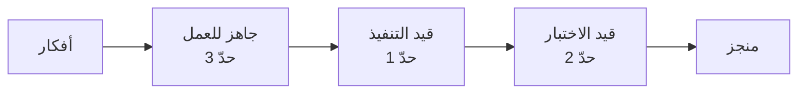

# 05 · التنفيذ والتدفّق

> [!abstract] ماذا ستتعلّم هنا
> - أي منهجية تناسب مشروعًا كهذا: سكرم أم كانبان أم مزيج؟
> - **كفاءة التدفّق** ولماذا الانشغال ليس إنتاجية.
> - حدود العمل الجاري في فريق من شخص واحد.
> - تعريف «جاهز» و«منجز» المستخرَج من ممارسات المشروع الفعلية.

---

## 🧭 أي منهجية تناسب؟

| المنهجية | ملاءمتها هنا |
| --- | --- |
| [[04 - Waterfall\|شلال]] | ❌ المتطلبات تتغيّر مع الاستخدام |
| [[02 - Scrum\|سكرم]] | ⚠️ طقوسه (تخطيط · استعراض · استرجاع) تفترض فريقًا؛ أغلبها بلا معنى لشخص واحد |
| [[03 - Kanban\|كانبان]] | ✅ الأنسب: تدفّق مستمر · حدود عمل جارٍ · بلا سبرنتات |
| [[Scrum-ban\|سكرم-بان]] | ✅✅ الأمثل: تدفّق كانبان + **إيقاع مراجعة دوري** يمنع الانجراف |

> [!success] ما يمارسه المشروع فعلًا (بلا أن يسمّيه)
> **دورة الشريحة الواحدة**: تصميم ← خطة ← تنفيذ ← اختبار ← إغلاق. هذه عمليًّا **حدّ عمل جارٍ = 1**، وهي أقوى ممارسة كانبان على الإطلاق. المشروع يطبّق المبدأ دون أن يستخدم المصطلح.

---

## ⏱️ كفاءة التدفّق

$$\text{Flow Efficiency} = \frac{\text{زمن العمل الفعلي}}{\text{الزمن الكلي من البداية للانتهاء}} \times 100$$

> [!warning] السؤال الذي يكشف الحقيقة
> ميزة استغرقت **أسبوعين** من الفكرة إلى الإطلاق — كم يومًا عُمل عليها فعليًّا؟ إن كان يومين، فكفاءة التدفّق **20%**، و80% من الزمن **انتظار**: انتظار قرار، انتظار مراجعة، انتظار توضيح.
>
> والدرس المزعج: **تسريع الكتابة يحسّن 20% فقط؛ أما تقليص الانتظار فيحسّن 80%.** هذا لبّ [[Flow Efficiency]] و[[02 - التدفّق وكفاءته وترتيب الأولويات (WSJF)]].

### مصادر الانتظار المرجّحة في هذا المشروع

| مصدر الانتظار | العلاج |
| --- | --- |
| انتظار قرار من صاحب المشروع (وهو نفسه المنفّذ) | تحديد وقت ثابت أسبوعيًّا للقرارات |
| انتظار اختبار يدوي متراكم | اختبار الشريحة فور انتهائها لا في النهاية |
| انتظار توضيح متطلّب من الجهة | سؤال واحد مجمّع بدل أسئلة متفرّقة |
| تبديل السياق بين ميزات متوازية | حدّ عمل جارٍ صارم |

---

## 🚦 حدود العمل الجاري لفريق فردي

> [!danger] المرض الأشهر
> ثلاث ميزات مفتوحة معًا: كلّها 80% ولا واحدة تصل للمستخدم. **العمل غير المنجز = مخزون = هدر** ([[WIP Limit]] · [[Muda, Mura, Muri]] · [[12.1 كانبان والتدفق - WIP ونظرية القيود]]).
>
> القاعدة: **أنهِ ما بدأت قبل أن تبدأ جديدًا.** وإن اضطررت للتوقّف، وثّق مكان توقّفك في سطر واحد.

---

## ✅ تعريف «جاهز» و«منجز» — مستخرَج من الممارسة

> [!example] تعريف الجاهز ([[Definition of Ready]])
> - وثيقة تصميم مكتوبة تشرح **لماذا** لا **ماذا** فقط.
> - أثر التغيير على الكيانات القائمة محدَّد.
> - معيار قبول واحد على الأقل قابل للاختبار.
> - لا انتظار قرار خارجي.

> [!example] تعريف المنجز ([[Definition of Done]])
> - الكود مكتوب وبأسلوب المشروع الموحّد.
> - **اختبار آلي** يغطّي المسار الأساسي والحالة الحافّة الأخطر.
> - بند مقابل في دليل الاختبار اليدوي.
> - وثيقة التصميم محدَّثة إن تغيّر القرار أثناء التنفيذ.
> - سبب أي قرار غير بديهي مكتوب في الكود.
> - لا يكسر ميزة قائمة (تشغيل مجموعة الاختبارات كاملة).

> [!success] لماذا هذا التعريف قويّ؟
> لأنه **مستخرَج من سلوك فعلي** لا منسوخ من كتاب: المشروع يفعل هذا بالفعل في أغلب الميزات. كتابته تحوّله من عادة شخصية إلى **معيار قابل للمساءلة والتوريث**.

---

## 🔗 ربط بالمفاهيم

- المفاهيم: [[Flow Efficiency]] · [[WIP Limit]] · [[Cycle Time]] · [[Lead Time]] · [[Little's Law]] · [[Throughput]] · [[Bottleneck]] · [[Theory of Constraints]] · [[Definition of Ready]] · [[Definition of Done]] · [[Technical Debt]] · [[16 - Task Boards]] · [[14 - Sprint]]
- الورش: [[4.1 كانبان عمليًا - المبادئ وحدود WIP]] · [[4.2 التدفق والمقاييس والهدر]] · [[5.1 كانبان بعمق و Scrum-ban]] · [[2.2 الانضباط والتقدير و DoR-DoD]]
- المقابلات: [[8.1 Lean - الهدر والقيمة]] · [[12.1 كانبان والتدفق - WIP ونظرية القيود]]
- الوثيقة العلاجية: [[اتفاقية عمل الفريق وسياسات التدفّق]]

## 📌 نقاط للمراجعة

> [!question]- 1. فريق من شخص — هل يحتاج حدّ عمل جارٍ؟
> نعم، وأكثر: لا أحد يمنعه من فتح ثلاث جبهات. الحدّ هنا **انضباط ذاتي مكتوب** لا أداة تنسيق.

> [!question]- 2. لماذا لا يُنصح بسكرم كامل هنا؟
> لأن نصف طقوسه أدوات **تنسيق بين أشخاص**. الاحتفاظ بها بلا فريق يجعلها شكليات — وهذا ما تحذّر منه [[7.1 واقع أجايل في السوق - لماذا فقد بريقه|ورشة نقد أجايل]].

> [!question]- 3. ما أول رقم تقيسه لتحسين التدفّق؟
> **زمن الدورة** ([[Cycle Time]]): من بدء العمل الفعلي إلى الإطلاق. ثم قارنه بالزمن الكلي لتعرف حجم الانتظار.

## ⏭️ التالي

[[06 - الجودة والاختبار]] — كيف نثبت أن ما أنجزناه يعمل فعلًا.
