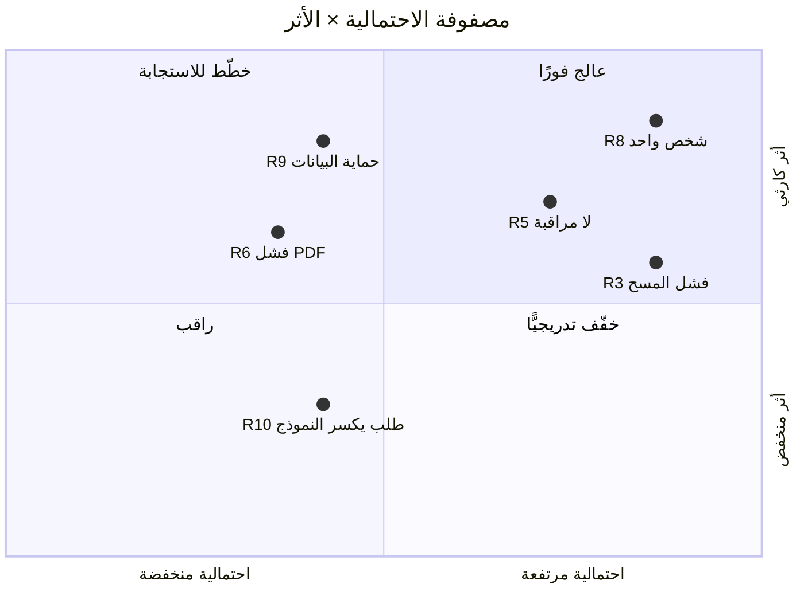

# 07 · المخاطر وسجل RAID

> [!abstract] ماذا ستتعلّم هنا
> - الفرق بين **خطر عولج في الكود** و**خطر مُدار**.
> - بناء سجل [[RAID Log|RAID]] حقيقي من مشروع قائم.
> - تصنيف المخاطر باحتمالية × أثر، واستراتيجيات الاستجابة.
> - المخاطر **غير التقنية** التي لا يراها المهندس.

---

## 🧭 المفهوم ببساطة

**RAID** أربعة سجلّات في وثيقة واحدة:

| الحرف | المعنى | الفرق الحاسم |
| --- | --- | --- |
| **R** — Risks | مخاطر | **قد** تحدث ⇒ نستعدّ |
| **A** — Assumptions | افتراضات | نبني عليها دون إثبات ⇒ نتحقّق |
| **I** — Issues | مشكلات | **حدثت فعلًا** ⇒ نعالج |
| **D** — Dependencies | تبعيات | خارج سيطرتنا ⇒ نتابع |

> [!warning] الخلط الأشهر
> «الخادم قد يتعطّل» = خطر. «الخادم متعطّل الآن» = مشكلة. الأول يحتاج خطّة، والثاني يحتاج تدخّلًا. وضعهما في سجل واحد بلا تمييز يجعل السجل بلا فائدة.

---

## 🔍 الحالة في ميقات

> [!success] المفارقة الإيجابية مرّة أخرى
> المشروع **عالج مخاطر حقيقية بذكاء داخل الكود**: التزامن، البريد المكرّر، الحضور المفتوح، تسريب الجهات، تسريب الملفات، تعداد الحسابات، حدود مزوّد البريد.

> [!danger] ولكن…
> **معالجة الخطر ≠ إدارة الخطر.** الخطر المُدار له: مالك، احتمالية، أثر، استجابة، ومراجعة دورية. الخطر المعالَج في الكود بلا سجل يعني:
> - لا أحد يعرف أنه كان خطرًا (فقد يُلغى الحلّ بجهل).
> - لا تُراجَع المخاطر التي **لم** تُعالَج بعد.
> - لا يستطيع صاحب القرار المفاضلة بين مخاطر يجهلها.

---

## 📋 سجل المخاطر المستخرَج (ملخّص)

| # | الخطر | احتمالية | أثر | الاستجابة الحالية | الحالة |
| --- | --- | --- | --- | --- | --- |
| R1 | تسريب بيانات جهة إلى أخرى | منخفضة | كارثي | عزل تلقائي على مستوى الاستعلام | 🟢 مخفَّف |
| R2 | بريد مكرّر لآلاف المسجّلين | متوسطة | مرتفع | دفتر إرسال + مطالبة ذرّية + نافذة سماح | 🟢 مخفَّف |
| R3 | فشل المسح يوم الفعالية (شبكة/كاميرا) | **مرتفعة** | مرتفع | بحث يدوي متاح | 🟠 جزئي — **لا خطّة طوارئ مكتوبة** |
| R4 | تجاوز حدّ مزوّد البريد | متوسطة | مرتفع | تنظيم إيقاع الإرسال | 🟢 مخفَّف |
| R5 | تعطّل عامل الطابور بلا ملاحظة | **مرتفعة** | مرتفع | لا يوجد | 🔴 **مكشوف — لا مراقبة** |
| R6 | فشل توليد ملفات PDF بعد تحديث بيئة | متوسطة | مرتفع | لا يوجد | 🔴 مكشوف |
| R7 | حضور مفتوح يفسد التقارير | مرتفعة | متوسط | إغلاق تلقائي مجدول | 🟢 مخفَّف |
| R8 | اعتماد المشروع على شخص واحد | **مرتفعة جدًّا** | **كارثي** | توثيق تقني جيّد | 🟠 جزئي |
| R9 | مخالفة حماية البيانات (سياسة احتفاظ غير معرَّفة) | متوسطة | مرتفع | لا يوجد | 🔴 مكشوف |
| R10 | جهة تطلب ميزة تكسر النموذج متعدّد الجهات | متوسطة | متوسط | لا يوجد | 🟠 |

> [!danger] أخطر ثلاثة
> **R8 (شخص واحد)** و**R5 (لا مراقبة تشغيل)** و**R9 (سياسة الاحتفاظ)** — وثلاثتها **غير تقنية**، ولهذا لم يلتقطها الكود. المهندس يرى مخاطر الكود؛ ومدير المشروع يرى مخاطر **النظام حول الكود**.

السجل الكامل بالافتراضات والمشكلات والتبعيات في [[سجل RAID - ميقات]].

---

## 🎲 مصفوفة الاحتمالية والأثر

*المرسوم هنا ستّة مخاطر: كل ما لم يُغلَق بعدُ في السجل أعلاه (🟠 و🔴). أما الأربعة المخفَّفة — R1 وR2 وR4 وR7 — فقد أخرجها التخفيف من دائرة القرار، وإبقاؤها على الرسم يُشغِل العين عمّا يحتاج قرارًا اليوم.*

---

## 🛡️ استراتيجيات الاستجابة الأربع

| الاستراتيجية | مثال من المشروع |
| --- | --- |
| **تجنّب** | عدم بناء بوّابة دفع الآن ⇒ تجنّب مخاطر مالية كاملة |
| **تخفيف** | دفتر إرسال التذكيرات ⇒ يقلّل احتمال البريد المكرّر لصفر تقريبًا |
| **نقل** | استخدام مزوّد بريد خارجي ⇒ نقل عبء التسليم إليه |
| **قبول** | قبول أن الجهة تصوّر QR البطاقة ⇒ قرار موثّق بحدوده |

> [!success] لاحظ
> **القبول الواعي الموثّق** استراتيجية مشروعة تمامًا — والمشروع يمارسها فعلًا في قرار «توكن القدرة». الفرق بين القبول والإهمال هو **أن تكون قد كتبته**.

---

## 🔗 ربط بالمفاهيم

- المفاهيم: [[RAID Log]] · [[Risk Register]] · [[Probability and Impact Matrix]] · [[Issue Log]] · [[Dependency]] · [[Contingency Reserve]] · [[Blocker]] · [[19 - Risk Management]] · [[PDPL]]
- الدورة: [[05 - بناء نظام التسليم الكامل]] — RAID كجزء من نظام لا كوثيقة معزولة.
- الوثائق: [[سجل RAID - ميقات]] · [[دليل الاستجابة للحوادث (Incident Runbook)]]

## 📌 نقاط للمراجعة

> [!question]- 1. لماذا خطر «شخص واحد» هو الأخطر؟
> لأن أثره **كارثي واحتماله يقترب من اليقين مع الزمن** (مرض، انشغال، انتقال). ولا يحلّه توثيق تقني وحده — بل مشاركة معرفة وتفويض تدريجي.

> [!question]- 2. كيف تُدار مخاطر بلا ميزانية طوارئ؟
> بـ**احتياطي زمني** بدل المالي: أبقِ 20% من طاقة كل موجة غير مخصَّصة. الوقت هو عملة المشروع الفردي.

> [!question]- 3. متى يُراجَع سجل RAID؟
> بإيقاع ثابت (أسبوعيًّا/عند كل موجة) **وعند كل حدث كبير**. السجل الذي لا يُراجَع يتحوّل إلى أرشيف.

## ⏭️ التالي

[[08 - التواصل والتقارير]] — من يجب أن يعرف بهذه المخاطر، ومتى؟
