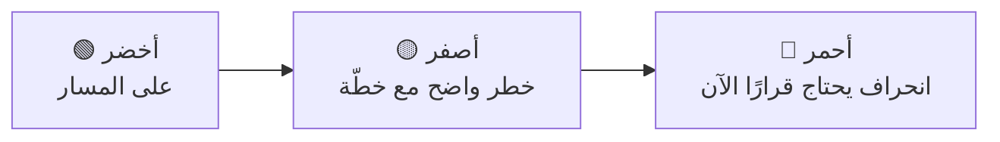

# 08 · التواصل والتقارير

> [!abstract] ماذا ستتعلّم هنا
> - لماذا يفشل التواصل في المشاريع التقنية رغم كثرة الرسائل.
> - كيف يُكتب **تقرير صحّة مشروع** يُقرأ في دقيقتين.
> - حالة RAG ولماذا «أصفر» أصدق من «أخضر».
> - التواصل مع جمهور غير تقني بلغته.

---

## 🧭 المفهوم ببساطة

التواصل ليس «إخبار الناس»، بل **إيصال ما يحتاجونه ليقرّروا**، بالقناة والإيقاع المناسبين.

> [!warning] المرض الأشهر في المشاريع التقنية
> تقارير **مليئة بالمخرجات وخالية من المعنى**: «أنجزت محرّك النماذج المرن ومعالجة الظهور الشرطي على الخادم». المتلقّي غير التقني يقرأ ولا يفهم ماذا يعني ذلك له.
>
> الصياغة الصحيحة: «صار بإمكانك بناء استبيان بأسئلة تظهر حسب إجابات سابقة، بدل أن تطلب منّا تعديله كل مرّة.» — نفس العمل، لكن بلغة **النتيجة** لا المخرَج ([[Outcome vs Output]]).

---

## 📡 خطة التواصل المقترحة

| الجمهور | ما يهمّه | القناة | الإيقاع |
| --- | --- | --- | --- |
| صاحب القرار / الراعي | التقدّم · المخاطر · القرارات المطلوبة | تقرير صحّة من صفحة | أسبوعي |
| الجهة المشتركة | ماذا يعمل الآن · ما القادم · ماذا يُطلب منها | اجتماع قصير + ملخّص مكتوب | كل أسبوعين |
| منظّم الفعالية | كيف يستخدم الميزة الجديدة | دليل قصير + تدريب | عند الإصدار |
| موظّف الاستقبال | كيف يعمل الماسح وماذا يفعل عند العطل | بطاقة تعليمات صفحة واحدة | قبل كل فعالية |
| المشارك | مواعيده وتذكرته وشهادته | بريد آلي | حسب الأحداث |

> [!note] القاعدة الذهبية
> **كل قرار رسمي يُوثَّق كتابةً خلال 24 ساعة**، مهما كانت قناة اتخاذه. الاتفاق الشفهي غير الموثّق يساوي صفرًا عند أول اختلاف.

---

## 📊 تقرير صحّة المشروع — القالب المختصر

> [!example] بنية من صفحة واحدة
> 1. **الحالة العامة:** 🟢 / 🟡 / 🔴 + جملة واحدة تفسّرها.
> 2. **أُنجز هذا الأسبوع:** 3 بنود بصيغة النتيجة.
> 3. **القادم:** 3 بنود.
> 4. **معطّلات تحتاج قرارًا:** ومن يملك القرار وتاريخ الاستحقاق.
> 5. **أهم مخاطر تغيّرت:** إشارة إلى [[سجل RAID - ميقات]].
> 6. **رقم واحد:** مؤشّر يعبّر عن الحالة (مثلًا: بنود QA المغلقة 46/120).

نموذج معبّأ في [[خطة التواصل وتقرير صحة المشروع]].

---

## 🚦 حالة RAG — ولماذا الأصفر أصدق

> [!danger] «متلازمة الأخضر»
> مشروع يبقى أخضر لأسابيع ثم ينقلب أحمر فجأة — دليل على أن التقارير **تجمّل** لا تُبلغ. [[RAG Status]] الصحّي يمرّ بالأصفر أولًا.
>
> وقاعدة عملية: **إن لم تُبلّغ بخبر سيّئ مبكرًا، فأنت تحوّل مشكلة إلى أزمة.** وهذا جوهر [[Radical Transparency|الشفافية الجذرية]].

---

## 🗣️ التواصل الخاص بهذا المشروع

> [!warning] مفارقة المشروع الفردي
> حين يكون المطوّر هو المدير هو المالك، يختفي التواصل تمامًا — **لأن كل شيء واضح في رأسه**. فلا تقارير ولا سجلّات، ثم يأتي أول سؤال من عميل أو شريك فلا يجد ما يُريه.
>
> **العلاج المتناسب:** تقرير من صفحة كل أسبوعين، لا حزمة تقارير أسبوعية. الانضباط الخفيف المستدام أفضل من الشامل المهجور.

## 🔗 ربط بالمفاهيم

- المفاهيم: [[Communication Plan]] · [[Project Health Report]] · [[RAG Status]] · [[Radical Transparency]] · [[Steering Committee]] · [[SPOC]] · [[Active Listening]] · [[21 - Stakeholder Communication]]
- الدورة: [[05 - بناء نظام التسليم الكامل]]
- الورش: [[3.2 المقاييس ولغة الأرقام]] — كيف تتكلّم بالأرقام لا بالانطباعات.
- المقابلات: [[11.1 قيمتك في سوق العمل - عشرة معايير]] — التواصل كمهارة قيمة سوقية.
- الوثائق: [[لوحة معلومات المشروع (Project Dashboard)]]

## 📌 نقاط للمراجعة

> [!question]- 1. تقرير أسبوعي لا يقرأه أحد — ما الحلّ؟
> اسأل القارئ عن **القرار** الذي يريد اتخاذه، واكتب التقرير ليخدمه. التقرير الذي لا يخدم قرارًا هو طقس بلا قيمة.

> [!question]- 2. كيف تُبلغ عن تأخير؟
> مبكرًا، بالسبب، **وبخيارين على الأقل**: (أ) نؤجّل النطاق الفلاني، (ب) نمدّد أسبوعًا. الإبلاغ بلا خيارات نقلٌ للقلق لا للمعلومة.

> [!question]- 3. ما أفضل رقم واحد يمثّل صحّة هذا المشروع اليوم؟
> **نسبة بنود دليل الاختبار المغلقة**: يعكس الجاهزية الحقيقية للإطلاق أكثر من أي عدّ للميزات.

## ⏭️ التالي

[[09 - الإطلاق والتشغيل]] — الانتقال من «يعمل عندي» إلى خدمة يعتمد عليها الناس.
