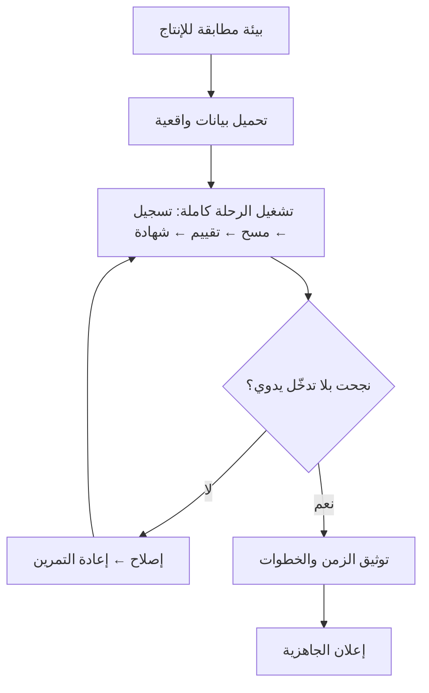

# 09 · الإطلاق والتشغيل

> [!abstract] ماذا ستتعلّم هنا
> - بوّابة **Go / No-Go** ولماذا تُكتب معاييرها قبل يوم القرار.
> - **الرعاية الفائقة** بعد الإطلاق ولماذا تُخطَّط مسبقًا.
> - التمرين الجاف للبيانات وخطّة التراجع.
> - ما بعد الإطلاق: SLA و SLE وخدمة العملاء.

---

## 🧭 المفهوم ببساطة

الإطلاق ليس لحظة نسخ الكود إلى الخادم — بل **انتقال مسؤولية**: من «مشروع قيد البناء» إلى **خدمة يعتمد عليها بشر في وقت محدّد**.

> [!danger] خصوصية ميقات
> يوم الفعالية **لا يقبل التأجيل**. لو تعطّل نظام محاسبة ساعتين، تُؤجَّل الفواتير. أما لو تعطّل الماسح والناس واقفون على الباب، فالضرر **فوري وعلني وأمام الجمهور**. ولهذا فإن معايير الإطلاق هنا أقسى من مشروع إداري عادي.

---

## ✅ بوّابة Go / No-Go

> [!example] معايير مقترحة (تُكتب قبل الإطلاق لا يومه)
> | # | المعيار | الحالة |
> | --- | --- | --- |
> | 1 | كل بنود دليل الاختبار اليدوي خضراء أو موثّقة كمقبولة | ⬜ |
> | 2 | مجموعة الاختبارات الآلية خضراء | ⬜ |
> | 3 | عامل الطابور يعمل ومراقَب | ⬜ |
> | 4 | المجدول يعمل ومُتحقَّق منه فعليًّا | ⬜ |
> | 5 | توليد ملفات PDF يعمل على بيئة الإنتاج | ⬜ |
> | 6 | نسخة احتياطية ناجحة **ومُختبَرة الاستعادة** | ⬜ |
> | 7 | مزوّد البريد مفعّل وحدوده معروفة | ⬜ |
> | 8 | فعالية تجريبية كاملة نجحت من التسجيل إلى الشهادة | ⬜ |
> | 9 | خطّة تراجع مكتوبة | ⬜ |
> | 10 | مسؤول متاح خلال ساعات الفعالية | ⬜ |
>
> **قاعدة القرار:** أي بند أحمر في 1–8 ⇒ **No-Go**، إلا بقبول مخاطرة موقّع من صاحب القرار.

> [!warning] الفخّ
> نسخة احتياطية غير مُختبَرة الاستعادة **ليست نسخة احتياطية**، بل شعور بالأمان. البند 6 مكتوب هكذا عمدًا.

---

## 🧪 التمرين الجاف والتراجع

> [!note] لماذا [[Data Dry Run|التمرين الجاف]]؟
> لأن أغلب مفاجآت الإطلاق ليست أخطاء برمجية بل **فروق بيئة**: متغيّر ناقص، صلاحية ملف، متصفّح غير مثبّت لتوليد PDF، حدّ إرسال غير مفعّل. التمرين يكشفها قبل أن يكشفها الجمهور.

و[[Rollback|خطّة التراجع]] تجيب في سطرين: **كيف نعود للنسخة السابقة، وماذا يحدث للبيانات التي دخلت بينهما؟**

---

## 🩺 الرعاية الفائقة (Hypercare)

> [!success] تعريفها
> فترة قصيرة بعد الإطلاق (يوم الفعالية + 3 أيام) بمستوى دعم **مرتفع مؤقّتًا**: استجابة أسرع، متابعة لصيقة، صلاحية إصلاح عاجل.

| البند | القيمة المقترحة |
| --- | --- |
| المدّة | من ساعة قبل الفعالية حتى 72 ساعة بعدها |
| زمن الاستجابة للعطل الحرج | ≤ 15 دقيقة أثناء الفعالية |
| قناة مباشرة | رقم/محادثة مخصّصة مع منظّم الفعالية |
| متابعة يومية | تقرير قصير: ماذا حدث · ماذا عولج |
| الخروج من الرعاية | صفر أعطال حرجة لـ48 ساعة |

> [!warning] الخطأ الشائع
> اعتبار الرعاية الفائقة «استعدادًا نفسيًّا» لا بندًا مخطَّطًا. النتيجة: تُستهلك طاقة الفريق بلا حدّ زمني معلن، ولا يعرف أحد **متى تنتهي**.

---

## 📞 ما بعد الإطلاق: من SLA إلى SLE

| المفهوم | المعنى | الاستخدام هنا |
| --- | --- | --- |
| [[SLA]] | **تعهّد تعاقدي** بزمن استجابة | مع الجهة المشتركة |
| [[SLO]] | هدف داخلي للأداء | 99% نجاح تسليم البريد |
| [[SLE]] | **توقّع احتمالي** («85% من الطلبات تُغلق خلال يومين») | أصدق من وعد مطلق |

> [!success] لماذا [[SLE]] أذكى من وعد مطلق؟
> لأنه يعترف بالتباين بدل إنكاره. «نصلح خلال 24 ساعة» وعدٌ يُكسر أول مرّة تظهر مشكلة معقّدة؛ أما «85% خلال يومين» فقابل للقياس والتحسين والدفاع عنه. راجع [[12.2 من SLA إلى SLE - الاحتمالات وقانون ليتل]] و[[6. ما بعد الإطلاق - الأخطاء و SLA وخدمة العملاء]].

---

## 🔧 ما هو موجود فعلًا في المشروع

| العنصر | الحالة |
| --- | --- |
| دليل إصدار (Release Runbook) | ✅ موجود |
| نسخ احتياطي مجدول + تنظيف + فحص | ✅ موجود بترتيب صحيح |
| متطلّبات تشغيل موثّقة (طابور · مجدول · متصفّح PDF) | ✅ |
| مراقبة (تنبيه عند توقّف الطابور/المجدول) | ❌ |
| بوّابة Go/No-Go رسمية | ❌ |
| خطّة رعاية فائقة | ❌ |
| اتفاقية مستوى خدمة مع الجهات | ❌ |
| دليل استجابة للحوادث | ❌ |

العلاج في [[خطة الإطلاق وقائمة Go-No-Go]] و[[دليل الاستجابة للحوادث (Incident Runbook)]] و[[اتفاقية مستوى الخدمة (SLA)]].

## 🔗 ربط بالمفاهيم

- المفاهيم: [[Go or No-Go Decision]] · [[Hypercare]] · [[Data Dry Run]] · [[Rollback]] · [[Pilot Launch]] · [[Staging vs Production Environment]] · [[MTTR]] · [[Uptime]] · [[RTO and RPO]] · [[SOP]] · [[ITIL 4]] · [[Hotfix]]
- الدورة: [[05 - بناء نظام التسليم الكامل]] · [[06 - الحالة العملية الشاملة والمسار المهني]]
- الورشة: [[6. ما بعد الإطلاق - الأخطاء و SLA وخدمة العملاء]]

## 📌 نقاط للمراجعة

> [!question]- 1. متى تُكتب معايير Go/No-Go؟
> **في بداية الموجة لا يوم الإطلاق.** كتابتها يوم القرار تجعلها تبريرًا لقرار متّخذ سلفًا.

> [!question]- 2. ما الفرق بين الإطلاق التجريبي والإطلاق الكامل؟
> [[Pilot Launch|التجريبي]] يقصر المخاطرة على جهة/فعالية واحدة قابلة للاحتواء، ويُنتج تعلّمًا قبل التوسّع.

> [!question]- 3. لماذا تُختبر الاستعادة لا النسخ فقط؟
> لأن النسخة تُثبت أن **ملفًا كُتب**، والاستعادة تثبت أن **النظام يعود للعمل**. الأول شعور، والثاني ضمان.

## ⏭️ التالي

[[10 - القياس والأداء]] — بعد التشغيل، كيف نعرف أننا نجحنا فعلًا؟
