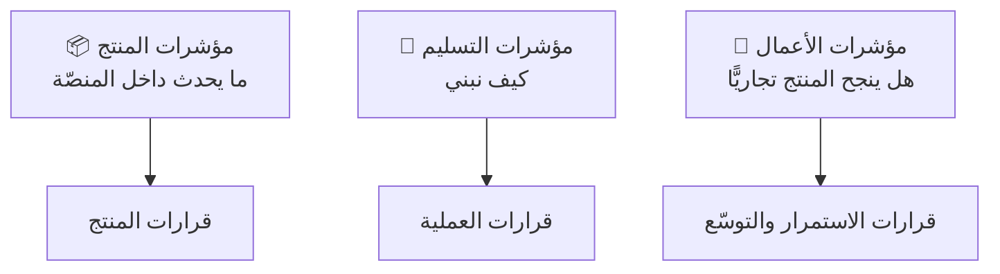

# 10 · القياس والأداء

> [!abstract] ماذا ستتعلّم هنا
> - الفرق بين **مؤشرات المنتج** و**مؤشرات المشروع** — والمشروع يملك الأولى فقط.
> - صياغة أهداف ونتائج رئيسة ([[OKR]]) لمنتج قائم.
> - لماذا **المتوسّط يكذب** والمئين يصدق.
> - مؤشرات التدفّق التي تكشف صحّة التسليم.

---

## 🧭 ثلاث طبقات من القياس

| الطبقة | الحالة في ميقات |
| --- | --- |
| **مؤشرات المنتج** | ✅ غنيّة: حضور · غياب · تقييم · شهادات · توزيعات · مؤشرات المناطق |
| **مؤشرات التسليم** | ❌ معدومة: لا زمن دورة · لا إنتاجية · لا نسبة إعادة عمل |
| **مؤشرات الأعمال** | ❌ معدومة: لا تبنّي · لا احتفاظ بالجهات · لا تكلفة تشغيل |

> [!danger] الخلاصة
> المشروع **يقيس فعاليات عملائه بدقّة، ولا يقيس نفسه إطلاقًا.** فإذا سُئل: «هل تحسّنت سرعة تسليمنا هذا الربع؟» — لا جواب.

---

## 🎯 أهداف ونتائج رئيسة مقترحة

> [!example] الهدف 1 — نُثبت أن المنتج يُستخدم بلا مساعدتنا
> - **ن.ر 1:** جهتان مختلفتان تنفّذان فعالية كاملة دون تدخّل تقني منّا.
> - **ن.ر 2:** زمن إعداد الفعالية من الاشتراك إلى نشر رابط التسجيل ≤ 60 دقيقة.
> - **ن.ر 3:** ≥ 70% من المشاركين يستلمون شهادتهم دون طلب دعم.

> [!example] الهدف 2 — نجعل يوم الفعالية بلا مفاجآت
> - **ن.ر 1:** صفر أعطال حرجة أثناء ساعات الفعالية.
> - **ن.ر 2:** ≥ 95% نجاح تسليم رسائل البريد.
> - **ن.ر 3:** ≤ 1% من عمليات المسح تحتاج تدخّلًا يدويًّا.

> [!example] الهدف 3 — نحوّل التسليم من مجهود فردي إلى نظام
> - **ن.ر 1:** زمن دورة الميزة المتوسّط ≤ 7 أيام (بمقياس المئين 85).
> - **ن.ر 2:** 100% من بنود دليل الاختبار مغلقة.
> - **ن.ر 3:** كل قرار جوهري مسجَّل في سجل القرارات خلال 24 ساعة.

> [!note] ملاحظة صياغة
> **الهدف** كيفيّ ملهم، و**النتيجة الرئيسة** رقمية قابلة للتحقّق. «نحسّن الأداء» ليست نتيجة رئيسة؛ «زمن الدورة ≤ 7 أيام» هي. راجع [[OKR]] و[[SMART Goals]] و[[KPI]].

---

## 📏 مؤشرات التدفّق المفقودة

| المؤشّر | ما يكشفه | كيف يُقاس هنا |
| --- | --- | --- |
| [[Cycle Time]] | سرعة التسليم الحقيقية | من بدء العمل إلى الإطلاق |
| [[Lead Time]] | تجربة طالب الميزة | من الطلب إلى الإطلاق |
| [[Throughput]] | عدد الميزات المنجزة في الفترة | عدّ الشرائح/الميزات شهريًّا |
| [[WIP Aging]] | عمل عالق يتعفّن | أقدم عنصر مفتوح |
| [[Rework Percentage]] | جودة العمل من أول مرّة | نسبة ما أُعيد فتحه |
| [[Escaped Defect Rate]] | فاعلية الاختبار | أخطاء اكتُشفت بعد الإطلاق |

> [!success] أرخص بداية ممكنة
> عمودان في أي جدول: **تاريخ البدء** و**تاريخ الإطلاق**. من هذين العمودين وحدهما تُشتقّ ثلاثة مؤشرات. لا تحتاج أداة، تحتاج **انضباط تسجيل**.

---

## 📉 لماذا يكذب المتوسّط؟

> [!warning] مثال ملموس
> خمس ميزات بأزمنة: 2 · 3 · 3 · 4 · **28** يومًا. المتوسّط = **8 أيام** — رقم لا يصف أي حالة حقيقية.
> **الوسيط = 3**، و**المئين 85 ≈ 28**.
>
> الصياغة الصادقة للعميل: «85% من الطلبات تُنجَز خلال 4 أيام» — لا «متوسّط الإنجاز 8 أيام». راجع [[Percentiles and Median vs Average]] و[[3.2 المقاييس ولغة الأرقام]].

---

## 🧮 مؤشرات المنتج الجاهزة (تُستثمر لا تُبنى)

المنصّة تحسب فعلًا: عدد المسجّلين · الحاضرين · المتغيّبين · نسبة الحضور · المقيّمين · الشهادات · توزيع المدن والتخصّصات والمؤهّلات · منحنى التسجيل عبر الزمن · متوسّطات التقييم · دخولات المناطق والزوّار الفريدين ومن هم بالداخل الآن.

> [!success] فرصة إدارية
> هذه المؤشرات **مبنية أصلًا**، وينقصها فقط أن تُقدَّم للجهة كتقرير دوري تلقائي بعد كل فعالية. تحويل بيانات موجودة إلى **تقرير يصل تلقائيًّا** هو من أرخص مصادر القيمة في المشروع كلّه.

## 🔗 ربط بالمفاهيم

- المفاهيم: [[OKR]] · [[KPI]] · [[SMART Goals]] · [[Cycle Time]] · [[Lead Time]] · [[Throughput]] · [[Little's Law]] · [[Percentiles and Median vs Average]] · [[Rework Percentage]] · [[Escaped Defect Rate]] · [[Adoption]] · [[NPS]] · [[Time to Value]] · [[18 - Velocity]] · [[17 - Burndown Chart]]
- الورش: [[3.2 المقاييس ولغة الأرقام]] · [[4.2 التدفق والمقاييس والهدر]] · [[5.2 السحب والجودة والمقاييس المتقدمة]]
- المقارنة: [[10 - الأداء OKR-KPI]] في [[عافية - دراسة حالة]]
- الوثيقة: [[لوحة مؤشرات الأداء OKR-KPI]]

## 📌 نقاط للمراجعة

> [!question]- 1. مؤشّر واحد فقط لهذا المشروع — أيّها؟
> **زمن الوصول للقيمة**: من اشتراك الجهة إلى أول شهادة صادرة. يلخّص سهولة المنتج وجاهزيته التشغيلية معًا.

> [!question]- 2. لماذا لا تصلح [[18 - Velocity|السرعة]] كمؤشّر هنا؟
> لأنها مقياس **تخطيط داخلي لفريق سكرم**، لا مقياس أداء. ولمشروع فردي بلا سبرنتات، زمن الدورة أنفع.

> [!question]- 3. كيف تمنع تحوّل المؤشّر إلى هدف يُتلاعب به؟
> اقرن كل مؤشّر سرعة بمؤشّر **جودة** مقابل (زمن الدورة مع نسبة إعادة العمل)، حتى لا يُشترى التسريع من رصيد الجودة.

## ⏭️ التالي

[[11 - الإغلاق والدروس المستفادة]] — ماذا نأخذ من هذه التجربة إلى ما بعدها؟
