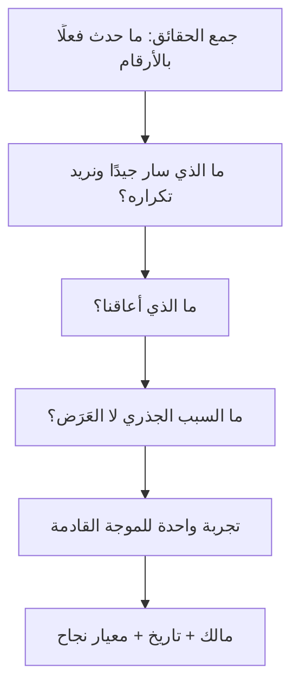

# 11 · الإغلاق والدروس المستفادة

> [!abstract] ماذا ستتعلّم هنا
> - الفرق بين **الإغلاق** و**التسليم** — ولماذا المنتج لا يُغلق بل تُغلق مراحله.
> - كيف تُدار جلسة استرجاع تُنتج قرارات لا شكاوى.
> - **سجل الدين التقني** كأداة إدارية لا تقنية.
> - الدروس القابلة للنقل من هذا المشروع إلى أي مشروع آخر.

---

## 🧭 المنتج لا يُغلق — تُغلق موجاته

> [!note] [[Closure vs Handover]]
> في مشروع العميل: تسليم ← قبول ← إغلاق ← انتهت العلاقة.
> في المنتج: **لا نهاية**، بل موجات متتابعة. فما الذي يُغلق إذن؟ **الموجة**: تُراجَع، تُوثَّق دروسها، ويُعاد ضبط الأولويات — وإلا انزلق المشروع في تحسين لا نهائي بلا محطّات تعلّم.

---

## 🔄 جلسة الاسترجاع — بصيغة تنفع فردًا أو فريقًا

> [!warning] الفارق بين استرجاع نافع وآخر عقيم
> العقيم ينتهي بقائمة شكاوى؛ النافع ينتهي بـ**تجربة واحدة قابلة للقياس** لها مالك وتاريخ. وتغيير واحد يُنفَّذ خير من عشرة تُكتب. راجع [[10 - Sprint Retrospective]] و[[Root Cause Analysis]] و[[Kaizen]].

---

## 📚 الدروس المستفادة من ميقات

### ✅ ما نجح — ويجب نقله لأي مشروع

| الدرس | لماذا نجح |
| --- | --- |
| **الشرائح الرأسية الكاملة** | كل شريحة تُنتج قيمة قابلة للعرض؛ التوقّف في أي نقطة يترك منتجًا صالحًا |
| **الضمان في قاعدة البيانات لا في الكود** | يصمد تحت التزامن؛ يمنع الخطأ بدل كشفه |
| **توثيق السبب لا الفعل** | التعليق يشرح **لماذا** والبديل المرفوض ⇒ يمنع نقض القرار بجهل |
| **تصميم ← خطة ← تنفيذ** | يمنع البناء قبل التفكير، ويترك أثرًا قابلًا للمراجعة |
| **دليل اختبار يدوي منظّم** | يحوّل «جرّبت وعمل» إلى تغطية مرئية قابلة للتتبّع |
| **بيانات تجريبية بأمر واحد** | يخفض كلفة كل اختبار ⇒ يُختبر أكثر |

### ⚠️ ما تعثّر — ويجب تفاديه

| الدرس | الأثر |
| --- | --- |
| **الانضباط التقني بلا انضباط إداري** | معرفة حبيسة شخص واحد ⇒ [[Vendor Lock-in\|اعتماد]] على فرد |
| **إضافة ميزات بلا تحديث خط الأساس** | استحالة قياس الانحراف أو الإجابة عن «كم تأخّرنا؟» |
| **مخاطر معالَجة لا مُدارة** | لا مراجعة دورية، ولا رؤية لما لم يُعالَج بعد |
| **قياس المنتج دون قياس التسليم** | لا نعرف هل نتحسّن كفريق |
| **تأجيل التشغيل الحقيقي** | كل يوم بلا مستخدم حقيقي = تعلّم مؤجّل ومخاطر متراكمة |
| **لا اختبار حِمل** | أخطر ما فيه أنه يظهر في **أسوأ لحظة**: يوم الفعالية |

---

## 💳 الدين التقني كقرار إداري

> [!success] إعادة التأطير
> [[Technical Debt|الدين التقني]] ليس «كودًا سيّئًا»، بل **قرض** أخذناه لتسريع التسليم، وله **فائدة** تُدفع في كل تعديل لاحق. وهذا يجعله بندًا إداريًّا لا تقنيًّا: يُسجَّل، ويُقدَّر، ويُجدوَل سداده.

| الدين | الفائدة التي ندفعها | خطّة السداد |
| --- | --- | --- |
| لا اختبار حِمل | قلق دائم عند كل فعالية كبيرة | تجربة حِمل قبل أول فعالية >500 مشارك |
| لا مراقبة للطابور والمجدول | اكتشاف الأعطال من شكوى المستخدم | تنبيه بسيط عند توقّف المعالجة |
| ملفات على قرص عام | قيد دائم على ما يوضع فيها | مراجعة عند أول محتوى حسّاس |
| بقايا ترحيل في الكود | ارتباك من يقرأ | تنظيف ضمن الموجة القادمة |
| لا سياسة احتفاظ بالبيانات | مخاطرة تنظيمية مفتوحة | قرار مكتوب قبل التوسّع |

السجل الكامل في [[سجل الدروس المستفادة والدين التقني]].

---

## 🎓 الدرس الأكبر

> [!danger] خلاصة الدراسة كلّها في سطرين
> **الانضباط الهندسي لا يعوّض غياب الانضباط الإداري.**
> مشروع بهذه الجودة التقنية يمكن أن يتوقّف لأسباب لا علاقة لها بالكود: لا أحد يعرف ما هو خارج النطاق، ولا سجلّ للمخاطر يُراجَع، ولا مؤشّر يثبت التحسّن، ولا وثيقة تُمكِّن شخصًا ثانيًا من الاستلام.
>
> والخبر الجيّد أن **كل هذه الفجوات تُسدّ بوثائق يمكن كتابتها في أيام** — وهذا ما فعلته الوثائق الإدارية الثلاث عشرة في هذه الدراسة.

## 🔗 ربط بالمفاهيم

- المفاهيم: [[Closure vs Handover]] · [[Sign-off]] · [[Technical Debt]] · [[Root Cause Analysis]] · [[Kaizen]] · [[PDCA]] · [[Organizational Process Assets]] · [[Snag List]] · [[10 - Sprint Retrospective]]
- الدورة: [[06 - الحالة العملية الشاملة والمسار المهني]]
- المقابلات: [[8.2 Lean - خريطة تدفق القيمة و Kaizen]] · [[11.2 اغتنام الفرص والإدارة بقيم راسخة]]
- الوثائق: [[سجل الدروس المستفادة (Lessons Learned Register)]] · [[محضر التسليم والاستلام (Handover Acceptance Certificate)]]

## 📌 نقاط للمراجعة

> [!question]- 1. متى يُوثَّق الدرس المستفاد؟
> **عند وقوعه**، لا في نهاية المشروع. الذاكرة تُجمّل، والتفاصيل التي تصنع الدرس تتبخّر خلال أسبوع.

> [!question]- 2. ما الفرق بين درس مستفاد وملاحظة؟
> الدرس له **سياق + سبب جذري + إجراء قابل للتكرار**. «كان يجب أن نختبر أكثر» ملاحظة؛ «اختبار الحِمل يسبق أول فعالية تتجاوز 500 مشارك» درس.

> [!question]- 3. كيف تُقنع بسداد الدين التقني؟
> بلغة الأعمال لا الكود: «هذا الدين يجعل كل ميزة جديدة أبطأ بيومين، ويعرّضنا لتوقّف يوم الفعالية». الفائدة المدفوعة هي الحجّة، لا جمال الكود.

## ⏭️ العودة

[[ميقات - دراسة حالة|الفهرس]] · [[لوحة مؤشرات الأداء OKR-KPI]] · [[سجل RAID - ميقات]]
