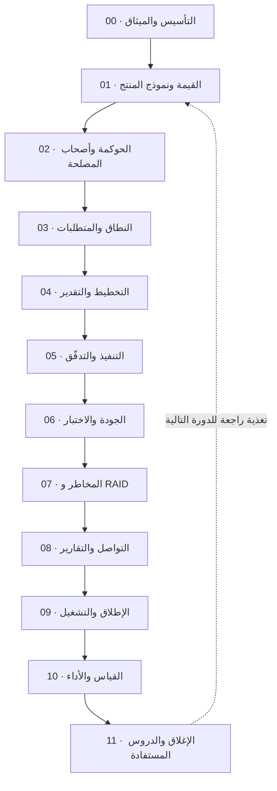

# ميقات — دراسة حالة إدارية

> [!note] حالة تعليمية مُصاغة
> «ميقات» (Meeqat) **اسم افتراضي**، وكذلك أسماء أصحاب المصلحة والتواريخ والأرقام المالية فيها. الحالة مبنيّة على **أنماط شائعة** في تسليم منتجات SaaS، لا على مشروع بعينه، والغرض منها التدريب لا التوثيق.

> [!abstract] القصة باختصار
> **ميقات** منصّة إدارة فعاليات كخدمة (`SaaS`) مبنيّة بـ`Laravel` و`Filament`، وتغطّي رحلة كاملة: تسجيل ← تذكرة QR ← حضور بالمناطق ← تقييم ← شهادة ← تحليلات.
> **هذه الدراسة تسأل سؤالًا مختلفًا:** لو نظرنا إلى المنتج نفسه بعين **مدير مشروع وقائد تسليم**، فماذا نرى؟ أين طُبِّقت المبادئ ضمنيًّا؟ وأين الفجوة الإدارية؟ وما **الوثائق الإدارية** التي كان يجب أن توجد — وهي هنا **معبّأة ببيانات الحالة كاملةً** لا كقوالب فارغة.

> [!info] المرجعان النظريان
> - المفاهيم: [[Project Management|قاعدة إدارة المشاريع البرمجية]] (21 موضوعًا) و[[معجم المصطلحات|المعجم]] (199 مصطلحًا).
> - المنهج: [[قيادة التسليم للمشاريع البرمجية|دورة قيادة التسليم]] (6 محاضرات: القيمة · التدفّق · تدفّقات القيمة · التقدير · نظام التسليم · الحالة الشاملة).

---

## 🎯 لماذا هذا المشروع صالح كدراسة حالة؟

> [!success] ثلاثة أسباب
> 1. **مشروع منتج لا مشروع عميل واحد** — فيفرض التفكير بـ[[Product Thinking|منطق المنتج]] لا بمنطق التسليم لمرّة واحدة، وهذا نادر في دراسات الحالة.
> 2. **تسليم على شرائح رأسية كاملة** (S0→S4) — تطبيق عملي مباشر لـ[[Value Stream|تدفّق القيمة]] و[[MVP]] و[[Increment|الزيادات]].
> 3. **انضباط توثيقي فعلي:** لكل ميزة **وثيقة تصميم ثم خطة تنفيذ** قبل الكود، ودليل اختبار يدوي منظَّم — وهذا يعطينا **مادّة حقيقية** لتقييم النضج الإداري، لا انطباعات.

---

## 🧭 التقييم الإداري السريع (بطاقة صحّة)

> [!warning] القراءة
> التقييم من عشرة لكل بُعد، مبنيّ على ما هو **موجود فعلًا** في مستودع الحالة (وثائق التصميم، الخطط، دليل QA، الكود وتعليقاته، المجدولات) لا على انطباع عامّ عن المنتج.

| البُعد | التقدير | لماذا |
| --- | --- | --- |
| **الهندسة وجودة التنفيذ** | 9 / 10 | قرارات موثّقة بأسبابها، حمايات ضد التزامن، اختبارات، معالجة حالات حافّة |
| **التوثيق التقني** | 9 / 10 | تصميم ← خطة ← تنفيذ لكل ميزة، وتعليقات تشرح **لماذا** لا **ماذا** |
| **إدارة الجودة** | 7 / 10 | اختبارات آلية + دليل QA يدوي ممتاز، لكن بلا تغطية كمّية معلنة ولا اختبار أداء/أمني رسمي |
| **إدارة النطاق** | 6 / 10 | الشرائح منضبطة، لكن الميزات اللاحقة تراكمت بلا **خط أساس نطاق** معلن ولا سجل تغيير |
| **إدارة المخاطر** | 4 / 10 | المخاطر معالَجة **في الكود** بذكاء، لكن **لا سجل مخاطر رسمي** يراه غير المطوّر |
| **الحوكمة وأصحاب المصلحة** | 3 / 10 | لا ميثاق، لا سجل قرارات، لا مصفوفة مسؤوليات، لا خطة تواصل |
| **القياس والأداء** | 5 / 10 | مؤشرات المنتج غنيّة، لكن **لا مؤشرات للمشروع نفسه** (زمن التسليم، الدين التقني، التبنّي) |
| **الإطلاق والتشغيل** | 6 / 10 | دليل إصدار + نسخ احتياطي مجدول، لكن بلا بوّابة [[Go or No-Go Decision\|Go/No-Go]] رسمية ولا خطة [[Hypercare\|رعاية فائقة]] موثّقة |

> [!danger] الخلاصة التي تحكم الدراسة كلّها
> **المشروع ناضج هندسيًّا وغير موثّق إداريًّا.** كثير من الضوابط الإدارية موجودة **ضمنيًّا داخل عقل المطوّر والكود** — وهذا يعمل ما دام الشخص موجودًا، وينهار لحظة انضمام عضو جديد أو مساءلة من عميل. مهمّة هذه الدراسة: **إخراج ما هو ضمني إلى وثائق صريحة**.

---

## 🗺️ المراحل — كل مرحلة تقود للتالية

| المرحلة | جوهرها | الوثيقة الإدارية الناتجة |
| --- | --- | --- |
| [[00 - التأسيس وميثاق المشروع\|00 · التأسيس والميثاق]] | لماذا المشروع موجود ومن يملك قراره | [[ميثاق مشروع ميقات]] |
| [[01 - القيمة ونموذج المنتج\|01 · القيمة ونموذج المنتج]] | مخرجات أم نتائج؟ ولمن القيمة؟ | [[لوحة القيمة وتحديد الشرائح المستهدفة]] |
| [[02 - الحوكمة وأصحاب المصلحة\|02 · الحوكمة وأصحاب المصلحة]] | من يقرّر ومن يُبلَّغ وكيف يُوثّق | [[سجل أصحاب المصلحة ومصفوفة المسؤوليات]] · [[سجل القرارات - ميقات]] |
| [[03 - النطاق والمتطلبات\|03 · النطاق والمتطلبات]] | ما الداخل وما الخارج وكيف يُضبط التغيير | [[بيان النطاق وأولويات MoSCoW]] |
| [[04 - التخطيط والتقدير\|04 · التخطيط والتقدير]] | الشرائح · التقدير الواقعي · الأولوية | [[خارطة الطريق وهيكل تجزئة العمل]] |
| [[05 - التنفيذ والتدفّق\|05 · التنفيذ والتدفّق]] | كيف يتحرّك العمل ولماذا يتعطّل | [[اتفاقية عمل الفريق وسياسات التدفّق]] |
| [[06 - الجودة والاختبار\|06 · الجودة والاختبار]] | ما تعريف «منجز» وكيف نثبته | [[معايير القبول وخطة الاختبار]] |
| [[07 - المخاطر وسجل RAID\|07 · المخاطر و RAID]] | ما الذي قد يفشل وماذا أعددنا له | [[سجل RAID - ميقات]] |
| [[08 - التواصل والتقارير\|08 · التواصل والتقارير]] | من يعرف ماذا ومتى | [[خطة التواصل وتقرير صحة المشروع]] |
| [[09 - الإطلاق والتشغيل\|09 · الإطلاق والتشغيل]] | كيف ننتقل من «يعمل عندي» إلى خدمة | [[خطة الإطلاق وقائمة Go-No-Go]] |
| [[10 - القياس والأداء\|10 · القياس والأداء]] | كيف نعرف أننا نجحنا | [[لوحة مؤشرات الأداء OKR-KPI]] |
| [[11 - الإغلاق والدروس المستفادة\|11 · الإغلاق والدروس]] | ماذا نأخذ للمشروع القادم | [[سجل الدروس المستفادة والدين التقني]] |

---

## 📁 الوثائق الإدارية (معبّأة ببيانات المشروع)

> [!example] الفرق عن «وثائق مكمّلة» في [[عافية - دراسة حالة]]
> هناك كانت الوثائق **تعليمية** تشرح القالب. هنا الوثائق **مُنفَّذة**: كل جدول معبّأ ببيانات الحالة كاملةً — أصحاب المصلحة، المخاطر التي عالجها الكود، معايير القبول الثمانية، مؤشرات الأداء المتاحة.

| # | الوثيقة | تخدم المرحلة |
| --- | --- | --- |
| 1 | [[ميثاق مشروع ميقات]] | 00 |
| 2 | [[لوحة القيمة وتحديد الشرائح المستهدفة]] | 01 |
| 3 | [[سجل أصحاب المصلحة ومصفوفة المسؤوليات]] | 02 |
| 4 | [[سجل القرارات - ميقات]] | 02 |
| 5 | [[بيان النطاق وأولويات MoSCoW]] | 03 |
| 6 | [[خارطة الطريق وهيكل تجزئة العمل]] | 04 |
| 7 | [[اتفاقية عمل الفريق وسياسات التدفّق]] | 05 |
| 8 | [[معايير القبول وخطة الاختبار]] | 06 |
| 9 | [[سجل RAID - ميقات]] | 07 |
| 10 | [[خطة التواصل وتقرير صحة المشروع]] | 08 |
| 11 | [[خطة الإطلاق وقائمة Go-No-Go]] | 09 |
| 12 | [[لوحة مؤشرات الأداء OKR-KPI]] | 10 |
| 13 | [[سجل الدروس المستفادة والدين التقني]] | 11 |

---

## ⚠️ حدود هذه الدراسة (نزاهة منهجية)

> [!warning] ما هو معطى الحالة وما هو مقترح الدراسة
> - **معطى الحالة (تقرؤه ولا تناقشه):** المعمارية، الميزات، الشرائح، معايير القبول، دليل QA، المجدولات، القرارات التقنية وأسبابها.
> - **مقترح ومصمَّم في هذه الدراسة:** الميثاق، الأدوار الإدارية، التواريخ، الميزانية، أسماء أصحاب المصلحة، الأوزان والأولويات، عتبات المؤشرات.
> - كل حقل يحتاج قرارًا من صاحب المشروع مُعلَّم بـ **`⬜ يُملأ`** — فلا يُقرأ افتراضٌ على أنه واقع.
> - وأسماء المشروع وأصحاب المصلحة والأرقام المالية **افتراضية** كما في التنبيه أعلاه؛ فلا تُنسب إلى جهة قائمة.

## 🚦 كيف تستخدم هذه الدراسة

> [!todo] ثلاثة استخدامات
> 1. **للمذاكرة:** اقرأ المراحل بالترتيب؛ كل مرحلة تربط المفهوم النظري ← بتطبيقه في المشروع ← بالفجوة ← بالوثيقة العلاجية.
> 2. **للعمل الفعلي:** انسخ الوثائق الإدارية كما هي إلى مستودع المشروع، واملأ حقول `⬜ يُملأ`.
> 3. **للمقابلات:** عدّة مراحل تنتهي بـ«سؤال مقابلة» بصيغة STAR (موقف · مهمّة · إجراء · نتيجة) مبنيّ على موقف حقيقي من المشروع.
>
> 📊 تتبّع تقدّمك في [[لوحة التقدّم.base]].
