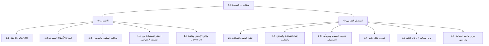

# 🗺️ خارطة الطريق وهيكل تجزئة العمل

## 1) خارطة الطريق (موجات لا تواريخ صلبة)

> [!note] لماذا موجات؟
> لأن التواريخ الصلبة في مشروع بطاقة متغيّرة تُخلق لتُكسر. الموجة تُعرَّف بـ**معيار انتهاء** لا بتاريخ، ويُربط التاريخ بحدث خارجي حقيقي عند وجوده.

| الموجة | الهدف | المحتوى | معيار الانتهاء | التاريخ المستهدف |
| --- | --- | --- | --- | --- |
| **W1 · تثبيت** | جاهزية الإطلاق | إغلاق دليل الاختبار · إصلاح الأخطاء المفتوحة · مراقبة المعالجة الخلفية · وثائق الإطلاق | 100% بنود QA + صفر خطأ حرج | ⬜ |
| **W2 · تشغيل حقيقي** | إثبات المنتج ميدانيًّا | فعالية تجريبية كاملة مع جهة واحدة · رعاية فائقة · جمع ملاحظات | شهادة صادرة لمشارك حقيقي بلا تدخّل يدوي | ⬜ |
| **W3 · قياس** | معرفة أين نحن | مؤشرات التسليم · تقرير فعالية تلقائي للجهة · لوحة صحّة المشروع | ثلاثة مؤشرات تُقاس أسبوعيًّا | ⬜ |
| **W4 · تجهيز التوسّع** | جهة ثانية | حدود الخطط · تحسين زمن الإعداد · سياسة الاحتفاظ بالبيانات | جهتان تعملان بالتوازي بلا تدخّل | ⬜ |
| **W5 · متانة** | تحمّل الأحمال | اختبار حِمل · تحسين الأداء · خطّة استمرارية | نجاح فعالية بـ500+ مشارك | ⬜ |

> [!warning] لماذا التشغيل الحقيقي في الموجة الثانية لا الخامسة؟
> لأن كل يوم بلا مستخدم حقيقي هو **تعلّم مؤجّل ومخاطرة متراكمة**. الفعالية الواحدة الحقيقية تكشف ما لا يكشفه شهر من التحسين الداخلي.

---

## 2) هيكل تجزئة العمل (للموجتين الأوليين)

| الرمز | الحزمة | المُخرَج | التقدير الأوّلي | المسؤول |
| --- | --- | --- | --- | --- |
| 1.1 | إغلاق دليل الاختبار | كل البنود بحالة نهائية | ⬜ | ⬜ |
| 1.2 | إصلاح الأخطاء | سجل أخطاء مغلق | ⬜ | ⬜ |
| 1.3 | المراقبة | تنبيه عند توقّف المعالجة | ⬜ | ⬜ |
| 1.4 | اختبار الاستعادة | محضر استعادة ناجحة | ⬜ | ⬜ |
| 1.5 | وثائق الإطلاق | قائمة معتمدة | ⬜ | ⬜ |
| 2.1–2.6 | التشغيل التجريبي | فعالية منفَّذة + تقرير | ⬜ | ⬜ |

> [!note] قاعدة التقدير
> قدّر **حزمة العمل** لا المشروع، وطبّق [[Reality Factor|معامل الواقعية]]: ×2 لما يمسّ بيانات قائمة، ×1.5 للمعزول. وسجّل التقدير الأصلي ([[Original Estimate]]) حتى تقيس انحرافك لاحقًا.

---

## 3) التبعيات والمسار الحرج

| التبعية | تحجب | نوعها |
| --- | --- | --- |
| اختيار الجهة التجريبية ⬜ | كل الموجة الثانية | قرار خارجي |
| توفّر بيئة إنتاج مستقرّة | التمرين الجاف | تقنية |
| موافقة الجهة على معالجة البيانات | استقبال مشاركين حقيقيين | قانونية |
| توفّر مزوّد بريد بحدّ كافٍ | إرسال جماعي حقيقي | تعاقدية |

> [!danger] المسار الحرج الحقيقي
> ليس تقنيًّا — بل **اختيار الجهة التجريبية وتحديد تاريخ فعاليتها**. كل شيء آخر يمكن العمل عليه بالتوازي، وهذا القرار وحده يحجب الموجة كاملة. وهذا نمط متكرّر: [[Critical Path|المسار الحرج]] في مشاريع المنتجات غالبًا **قرار مؤجَّل** لا مهمّة صعبة.

## 🔗 مراجع

[[04 - التخطيط والتقدير]] · [[هيكل تجزئة العمل (WBS)]] · [[15 - Roadmap]] · [[Critical Path]] · [[Dependency]] · [[Milestone]]
