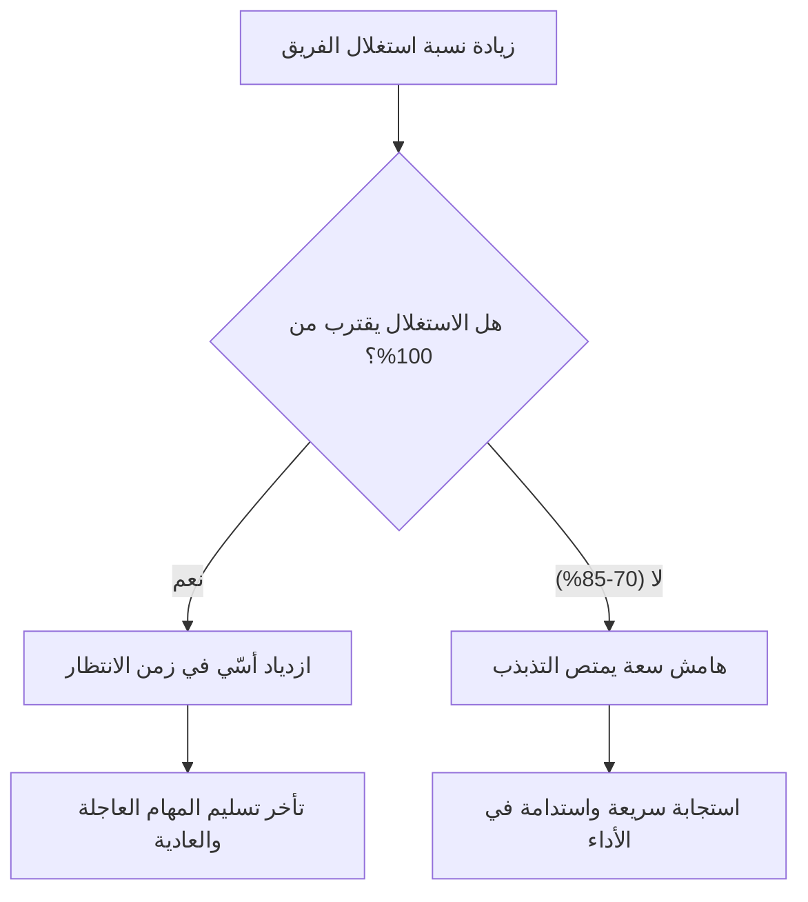

# مغالطة الاستغلال 100% (100 Percent Utilization Fallacy)
> [!info] تعريف مختصر
> مغالطة الاستغلال 100% هي الاعتقاد الخاطئ بأن إبقاء كل عضو في الفريق مشغولًا طوال الوقت بنسبة 100% يزيد الإنتاجية. الحقيقة أن الاستغلال الكامل للموارد يزيد زمن الانتظار (Queue Time) ويبطئ التسليم الفعلي.

## الشرح العلمي والاحترافي
- تعتمد هذه المغالطة على قياس نظرية الطوابير (Queueing Theory): عندما يقترب استغلال أي مورد (شخص أو آلة) من 100%، يزداد زمن الانتظار في الطابور بشكل غير خطي (أُسّي تقريبًا) وليس بشكل تدريجي بسيط.
- بمعنى آخر: نظام يعمل بطاقة 70% يكون فيه زمن الانتظار قصيرًا نسبيًا، لكن نفس النظام عند 95% يصبح زمن الانتظار طويلًا جدًا لأي طلب جديد يدخل، لأنه لا توجد سعة احتياطية (Reserve Capacity) لامتصاص التذبذب الطبيعي في تدفق العمل.
- في سياق الفرق البرمجية: عندما يُثقَل كل مطوّر بمهام متتالية بلا فراغ، فإن أي طلب عاجل (Blocker) أو خطأ حرج (Hotfix) يضطر للانتظار في الطابور، فيتأخر تسليم كل شيء آخر أيضًا.
- الاستغلال الكامل يقتل أيضًا المرونة اللازمة للتعلّم، ومراجعة الكود، والمساعدة المتبادلة بين الأعضاء، وهي أمور تحسّن الجودة على المدى الطويل.
- الحل العملي هو ترك هامش سعة (Slack/Buffer) مقصود، عادة بين 15% و30% من وقت الفريق، غير مخصص لمهام مجدولة.

## أين ومتى يُستخدم
- يُناقَش هذا المفهوم عند التخطيط للسعة (Capacity Planning) في سكرم (Scrum) وكانبان (Kanban) على حد سواء.
- يُستحضَر عندما يطلب مدير أو صاحب مصلحة "شغّل كل الفريق 100% من وقتهم" دون ترك أي هامش.
- يظهر أيضًا في نقاشات حد العمل الجاري (WIP Limit) وتحليل الاختناقات (Bottleneck) في تدفق العمل.

## مثال وسيناريو تطبيقي
> [!example] في شركة "تِك سولوشنز"، طلب مدير المشروع من فريق مكوّن من 5 مطورين أن يكون كل واحد منهم مشغولًا بنسبة 100% من وقته على مهام السباق (Sprint). بعد شهرين، لاحظ الفريق أن أي خطأ عاجل من العملاء كان يبقى بلا حل لأيام لأن لا أحد "لديه وقت فاضٍ"، وزمن الدورة (Cycle Time) للمهام العادية تضاعف. عندما خفّض المدير التخطيط إلى 75% من سعة الفريق فقط (وترك 25% هامشًا)، انخفض زمن حل الأخطاء العاجلة من 4 أيام إلى نصف يوم، وتحسّن الالتزام بمواعيد السباقات بشكل ملحوظ.

## خطوات أو مخطّط
1. لا تخطط لأكثر من 70-85% من السعة الكلية (Capacity) للفريق في أي سباق أو فترة.
2. اترك هامش سعة (Reserve Capacity) واضحًا في خطة العمل، لا هامشًا ضمنيًا مخفيًا.
3. راقب زمن الانتظار الفعلي للمهام العاجلة كمؤشر على مدى صحة مستوى الاستغلال.
4. إذا لاحظت تراكم طلبات عاجلة أو تأخرًا متكررًا، خفّض الالتزامات المخطط لها بدلًا من زيادة الضغط.

## ⚠️ مفاهيم خاطئة شائعة
> [!warning]
> - الاعتقاد أن "الوقت الفاضي" يعني هدرًا؛ في الحقيقة هو استثمار ضروري لامتصاص التذبذب وضمان الاستجابة السريعة.
> - الخلط بين "الانشغال الظاهري" و"الإنتاجية الفعلية"؛ فريق مشغول 100% ليس بالضرورة فريقًا ينتج قيمة أكثر.
> - الاعتقاد أن الحل هو تعيين المزيد من العمل عند رؤية "وقت فراغ"، بدلاً من فهم أن هذا الهامش وظيفي ومطلوب.

## ❌ ممارسات خاطئة في المشاريع
> [!failure]
> - تخطيط السباقات (Sprint Planning) بحيث تمتلئ كل ساعة عمل لكل عضو دون أي احتياط؛ الحل: خصص هامش سعة ثابتًا (مثلًا 20%) في كل تخطيط.
> - معاقبة أو ملاحظة عضو الفريق الذي يبدو "أقل انشغالًا" دون النظر إلى جودة وسرعة إنجازه؛ الحل: قِس النتائج (Outcome) لا مجرد الانشغال (Output).
> - تجاهل تكرار تأخر الأخطاء العاجلة كعرَض لمشكلة استغلال زائد؛ الحل: استخدم هذا التأخر كمؤشر إنذار مبكر لخفض الالتزامات المخطط لها.

## 🔗 مصطلحات ومفاهيم ذات صلة
[[Capacity]] | [[Reserve Capacity]] | [[WIP Limit]] | [[Bottleneck]] | [[Cycle Time]] | [[Sustainable Pace]] | [[Little's Law]] | [[Buffer]]

> [!tip] 💡 إثراء عملي — كورس الإنتاجية
> الأساس الكمّي للمغالطة في صيغة كينغمان، وجدول مضاعفات الانتظار: [[11 - العملية المتمركزة حول العميل وقانون كونواي]].
