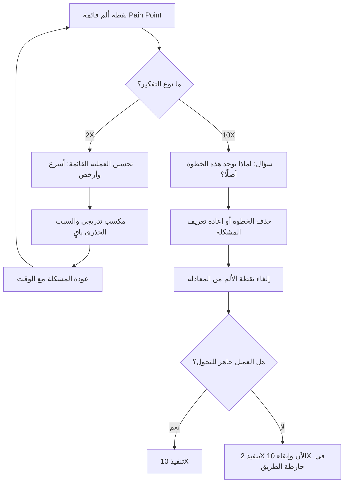

# الهدف المضاعف والهدف العشري (2X and 10X Goals)

> [!info] تعريف مختصر
> **الهدف المضاعف (2X)** هو تحسين تدريجي ينقل الوضع من (أ) إلى (ب): نجعل العملية القائمة أسرع أو أرخص أو أقل خطأً — دون المساس بسبب وجودها. أما **الهدف العشري (10X)** فهو إعادة تعريف المشكلة نفسها: لا نُحسّن الخطوة المؤلمة، بل نسأل لماذا هي موجودة أصلًا ونحذفها من المعادلة. الفرق ليس في حجم الطموح بل في **نوع التفكير**: الأول يُحسّن الطريق، والثاني يسأل إن كنا نحتاج هذا الطريق أصلًا.

## الشرح العلمي والاحترافي
- **2X — التفكير التحسيني (Incremental)**: يبدأ من الوضع الراهن ويسأل: كيف نجعله أفضل؟ خفض زمن دورة من 15 يومًا إلى 7، رفع كفاءة فريق بنسبة 30%، تقليل الأخطاء إلى النصف. هذا التفكير آمن وواقعي وقابل للبيع داخليًا، ويستخدم أدوات معروفة: إزالة الهدر، الأتمتة الجزئية، إعادة ترتيب الخطوات، التحسين المستمر ([[Kaizen]]).
- **حدّ 2X البنيوي**: لأنه يبقى داخل حدود العملية القائمة، فهو **يُخفّف العَرَض ولا يزيل السبب**. الخطوة التي كانت مؤلمة تبقى موجودة، فقط بصيغة أسرع. ومع الوقت — تغيّر الأحمال، دوران الموظفين، تراكم الاستثناءات — يعود الألم إلى ما كان عليه أو أسوأ. لهذا كثير من مشاريع "تحسين العملية" تُقاس ناجحة في تقاريرها وتُعاد بعد سنتين بالعنوان نفسه.
- **10X — التفكير التحويلي (Transformational)**: لا يسأل "كيف نُسرّع هذه الخطوة؟" بل "**لماذا هذه الخطوة موجودة؟**" و"ما الذي يجعلها ضرورية؟" و"ماذا لو أُلغيت تمامًا؟". حين تُلغى نقطة الألم ([[Pain Point]]) من المعادلة، لا يبقى شيء يُحسَّن فيها ولا تعود بعد سنتين.
- **الفكرة المضادّة للحدس**: في كتاب **Dan Sullivan**: «**10X is Easier than 2X**» يُطرح أن القفزة العشرية أسهل من المضاعفة، لأن هدف 2X يسمح لك بالاحتفاظ بكل ما تفعله اليوم وإضافة مجهود فوقه، بينما هدف 10X **مستحيل بالطريق القديم** — فيُجبرك على **حذف** 80% مما تفعله والتركيز على القليل الذي يصنع الأثر فعلًا. الصعوبة في 2X ليست تقنية بل هي عبء الاستمرار في حمل كل شيء؛ و10X يعمل كأداة **حذف** لا كأداة إضافة.
- **الأثر على صياغة الأهداف**: هدف 2X يُصاغ عادة كمؤشر تحسّن على مقياس قائم ويقع طبيعيًا ضمن [[SMART Goals]]. أما 10X فيُصاغ كسؤال إعادة تعريف، ويظهر عادة كـ[[Stretch Goal]] داخل [[OKR]] — هدف طموح يُقاس نجاحه بالتعلّم والتحول لا بنسبة إنجاز 100%.
- **العلاقة بالأثر**: التمييز بين 2X و10X امتداد مباشر لمنطق [[Outcome vs Output]]. الفريق الذي يقيس نفسه بالمخرجات يميل بطبعه إلى 2X (تحسينات مرئية قابلة للعدّ)، والفريق الذي يقيس نفسه بالأثر يفتح الباب أمام سؤال 10X: هل يمكن تحقيق الأثر نفسه بحذف العملية بدل تحسينها؟ وغالبًا ما ينعكس ذلك مباشرة على [[Time to Value]].

## أين ومتى يُستخدم
- في تحليل العمليات وإعادة هندستها: بعد رسم العملية الحالية، تُسأل كل خطوة سؤالين — كيف نُسرّعها (2X)؟ ولماذا هي موجودة أصلًا (10X)؟
- عند صياغة [[OKR]] الربعية أو السنوية: مزج أهداف تحسينية آمنة مع هدف تحويلي واحد على الأقل يمنع الفريق من الانحباس في التحسين الأبدي.
- في اكتشاف المنتج وتحديد نقاط الألم عبر [[Value Proposition Canvas]]: عند كل ألم يُطرح خيار الإلغاء قبل خيار التحسين.
- في مشاريع الأتمتة والتحول الرقمي: قبل أتمتة أي إجراء، يُسأل هل يستحق الوجود أصلًا — لأن أتمتة عملية عديمة القيمة تُنتج هدرًا أسرع فقط.
- في المفاوضات مع العميل حول النطاق: تحديد أي الأجزاء يحتمل تحولًا جذريًا وأيها يحتاج تحسينًا تدريجيًا بسبب قيود تنظيمية أو ثقافية.

## مثال وسيناريو تطبيقي
> [!example] **المثال الأول — موافقة الإجازات.**
> في شركة كبيرة، تستغرق الموافقة على طلب إجازة **15 يوم عمل**: الموظف يملأ نموذجًا، يوقّعه المدير المباشر، ثم مدير الإدارة، ثم الموارد البشرية، ثم يُؤرشَف.
> - **حل 2X**: تحويل النموذج الورقي إلى إلكتروني مع تنبيهات وتذكيرات آلية → المدة تنخفض من 15 يومًا إلى **48 ساعة**. تحسّن حقيقي ومقنع. لكن الموافقة الثلاثية ما زالت قائمة، والمديرون ما زالوا يقضون وقتهم في الضغط على "موافق"، وعند أي إجازة موسمية يعود التكدّس.
> - **حل 10X**: السؤال هو "لماذا نحتاج موافقة بشرية أصلًا؟". الإجابة عند التحليل: لضمان عدم تجاوز الرصيد وعدم تعارض الجدول. وكلا الشرطين يمكن للنظام التحقق منهما آليًا. فالحل: **إلغاء الحاجة للموافقة** — الطلب يُعتمد تلقائيًا إذا توفّرت الشروط (رصيد كافٍ، لا تعارض في الفريق، أقل من 5 أيام، خارج فترات الذروة)، وتُرفع للمدير الحالات الاستثنائية فقط. النتيجة: **دقائق بدل أيام**، وتحرير وقت المديرين بالكامل من مهمة لا تضيف قيمة. لم نُسرّع الموافقة — أزلناها من المعادلة.
>
> **المثال الثاني — طلب قرض في بنك.**
> - **2X**: تسريع المراجعة اليدوية بتوظيف مراجعين إضافيين وتبسيط النماذج → من 10 أيام إلى 4 أيام. التكلفة ترتفع، والطاقة الاستيعابية تظل محكومة بعدد الموظفين.
> - **10X**: تجزئة المشكلة حسب المخاطرة بدل معالجة كل الطلبات بالمسار نفسه: **موافقة تلقائية فورية** للطلبات تحت 10 آلاف لعملاء ذوي سجل ائتماني سليم، ومسار مبسّط للفئة المتوسطة، و**توجيه ما فوق 50 ألفًا للمختص** بمراجعة عميقة. الأثر: 70% من الطلبات تُنجز في دقائق، والخبرة البشرية تتركّز حيث تصنع فرقًا فعليًا. لم نُسرّع المراجعة — ألغينا الحاجة إليها في أغلب الحالات.
>
> **ومتى يكون 2X هو الخيار الصحيح؟** حين يكون العميل غير مستعد لتغيير طريقة عمله: قيود تنظيمية أو رقابية تفرض توقيعًا بشريًا، أو ثقافة مؤسسية لا تحتمل قفزة، أو نظام قديم لا يمكن استبداله هذا العام، أو حاجة إلى بناء ثقة عبر مكسب سريع أولًا. في هذه الحالات، فرض 10X يُنتج مقاومة ورفضًا وفشلًا في [[Adoption]]؛ والصواب تحقيق 2X الآن مع إبقاء سؤال 10X مفتوحًا في خارطة الطريق.

## خطوات أو مخطّط
1. توصيف الوضع الحالي بالأرقام: زمن، كلفة، عدد خطوات، معدل أخطاء.
2. تحديد نقطة الألم الحقيقية ([[Pain Point]]) لا العَرَض الظاهر.
3. طرح مسار 2X: ما التحسينات الممكنة داخل العملية القائمة وما حدّها الأقصى؟
4. طرح مسار 10X بسؤال الإلغاء: لماذا توجد هذه الخطوة؟ ما الشرط الذي تحققه؟ هل يمكن تحقيقه دونها؟
5. تجزئة الحالات حسب المخاطرة أو التعقيد: ما الذي يمكن أتمتته بالكامل، وما الذي يستحق فعلًا تدخلًا بشريًا؟
6. تقييم الجاهزية التنظيمية والثقافية والتنظيمية للعميل لتحمّل التحول.
7. اختيار المسار: 10X إن سمحت الجاهزية، و2X كخطوة انتقالية إن لم تسمح — بشرط تسجيل هدف 10X في خارطة الطريق لا دفنه.
8. القياس بمؤشر أثر لا بمؤشر نشاط، ومراجعة ما إذا كانت المشكلة قد أُزيلت فعلًا أم أُجّلت.

## ⚠️ مفاهيم خاطئة شائعة
> [!warning]
> - **الظن بأن 10X يعني ببساطة "هدفًا أكبر بعشر مرات"**: الرقم استعارة لتغيير نوع السؤال، لا وعد بمضاعفة عددية. 10X هو إعادة تعريف المشكلة، لا رفع سقف المؤشر نفسه.
> - **الاعتقاد بأن 10X أصعب دائمًا من 2X**: أطروحة Dan Sullivan أن العكس غالبًا صحيح، لأن 2X يُلزمك بحمل كل ما تفعله اليوم وإضافة جهد فوقه، بينما 10X يُجبرك على الحذف والتركيز.
> - **اعتبار 2X ممارسة رديئة**: التحسين التدريجي أساس [[Kaizen]] وهو الخيار الصحيح في بيئات مقيّدة أو عند الحاجة إلى مكسب سريع يبني الثقة. الخطأ هو أن يصبح **الخيار الوحيد** المطروح دائمًا.
> - **الخلط بين 10X والأتمتة**: أتمتة عملية لا قيمة لها ليست 10X، بل هي 2X سريع الأداء — لأن الخطوة العديمة القيمة ما زالت قائمة، فقط بلا بشر.
> - **افتراض أن 10X يتطلب تقنية جديدة**: كثير من القفزات العشرية تتحقق بقرار سياسة أو تغيير قاعدة عمل (مثل رفع حدّ الموافقة التلقائية)، لا بنظام جديد.

## ❌ ممارسات خاطئة في المشاريع
> [!failure]
> - **الانطلاق مباشرة إلى تحسين العملية دون سؤال جدوى وجودها**: يُنتج مشاريع تُسرّع الهدر وتُقاس ناجحة ثم تُعاد بعد سنتين بالعنوان نفسه. الحل: جعل سؤال "لماذا توجد هذه الخطوة؟" خطوة إلزامية في كل تحليل عملية قبل اقتراح أي تحسين.
> - **فرض حل 10X على عميل غير جاهز تنظيميًا أو ثقافيًا**: يُنتج مقاومة داخلية ورفضًا للنظام وضعفًا في [[Adoption]] مهما كان الحل صحيحًا تقنيًا. الحل: تقييم الجاهزية أولًا، وتقديم 2X كجسر مرحلي مع إبقاء هدف 10X معلنًا في خارطة الطريق.
> - **تحويل الهدف الطموح إلى التزام تعاقدي بنسبة إنجاز 100%**: يقتل روح التجريب ويدفع الفريق لتقزيم الطموح ضمانًا لعدم الفشل. الحل: التعامل مع 10X كـ[[Stretch Goal]] يُقاس بالتعلّم والتحول، وفصله عن أهداف الالتزام.
> - **قياس نجاح 10X بمقاييس العملية القديمة**: قياس "زمن الموافقة" بعد إلغاء الموافقة أصلًا لا معنى له ويُظهر التحول وكأنه فشل. الحل: إعادة تعريف مؤشرات النجاح مع إعادة تعريف المشكلة، والتركيز على [[Time to Value]] والأثر النهائي.
> - **الاكتفاء بأهداف 2X سنة بعد سنة**: يُراكم تحسينات صغيرة على بنية متهالكة ويخلق وهم التقدم بينما تتسع الفجوة مع المنافسين. الحل: تخصيص هدف تحويلي واحد على الأقل في كل دورة تخطيط، بميزانية ووقت محميّين.

## 🔗 مصطلحات ومفاهيم ذات صلة
[[Outcome vs Output]] | [[SMART Goals]] | [[OKR]] | [[Stretch Goal]] | [[Pain Point]] | [[Value Proposition Canvas]] | [[Time to Value]] | [[Kaizen]]
