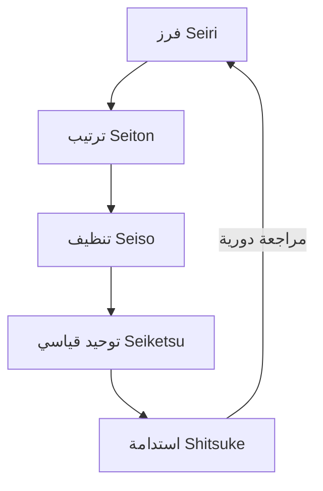

# نظام 5S (5S)

> [!info] تعريف مختصر
> نظام 5S هو منهجية يابانية لتنظيم مكان العمل (المادي أو الرقمي) عبر خمس خطوات مترابطة تبدأ بحروف S في اليابانية، هدفها تقليل الهدر (راجع [[Muda, Mura, Muri]])، وتحسين الكفاءة، وجعل المشكلات مرئية بسهولة.

## الشرح العلمي والاحترافي
- الحروف الخمسة هي: Seiri (الفرز/التصنيف)، Seiton (الترتيب)، Seiso (التنظيف)، Seiketsu (التوحيد القياسي)، Shitsuke (الاستدامة/الانضباط).
- نشأ النظام في نظام إنتاج تويوتا (راجع [[Toyota Production System]]) كأداة أساسية للتحسين المستمر (راجع [[Kaizen]]) في المصانع، ثم انتقل إلى المكاتب وبيئات تطوير البرمجيات.
- الفكرة الجوهرية: مكان عمل منظم ونظيف يقلل الوقت الضائع في البحث عن الأدوات أو المعلومات، ويجعل أي انحراف عن الوضع الطبيعي (مثل خطأ أو عطل) واضحاً فوراً للعين.
- في البرمجيات، يُطبَّق 5S على أشياء مثل: هيكلة المستودعات (repositories)، تنظيم الملفات، ترتيب لوحات كانبان، وتوحيد بيئات العمل (راجع [[Staging vs Production Environment]]).
- الخطوة الخامسة (الاستدامة) هي الأصعب عملياً، لأنها تتطلب تحويل الترتيب إلى عادة يومية وليس نشاطاً لمرة واحدة.

## أين ومتى يُستخدم
- يُستخدم في بيئات الإنتاج والتصنيع (Lean Manufacturing)، وفي المكاتب لتنظيم الوثائق والعمليات.
- في تطوير البرمجيات، يُستخدم عند تنظيف قواعد الشيفرة (codebase)، توحيد بنية المشاريع، وترتيب أدوات الفريق ولوحات العمل بشكل دوري.
- يُطبَّق غالباً كجزء من جولات جيمبا (راجع [[Gemba Walk]]) أو كنشاط دوري ضمن اجتماعات التحسين المستمر.

## مثال وسيناريو تطبيقي
> [!example] فريق تطوير في شركة "تِك-وير" يعاني من فوضى في مستودع الشيفرة: ملفات تجريبية قديمة، مجلدات مكررة، وتسميات غير متسقة.
> يقرر الفريق تطبيق 5S على مدى أسبوعين:
> 1. Seiri (فرز): يحذفون 40 ملفاً تجريبياً غير مستخدم منذ أكثر من ستة أشهر.
> 2. Seiton (ترتيب): يعيدون هيكلة المجلدات حسب طبقات التطبيق (واجهة، خدمات، قاعدة بيانات).
> 3. Seiso (تنظيف): يشغّلون أدوات فحص الشيفرة (linters) لإزالة الشيفرة الميتة والتعليقات القديمة.
> 4. Seiketsu (توحيد): يكتبون دليل أسلوب (style guide) وقالب معياري لأي مشروع جديد (راجع [[SOP]]).
> 5. Shitsuke (استدامة): يضيفون فحصاً آلياً في خط CI (راجع [[CI and CD]]) يرفض أي طلب دمج لا يتبع المعايير الجديدة.
> بعد شهر، ينخفض وقت البحث عن ملفات معينة بشكل ملحوظ، وتقل الأخطاء الناتجة عن الالتباس.

## خطوات أو مخطّط
1. **Seiri (فرز)**: تحديد ما هو ضروري والتخلص مما هو زائد.
2. **Seiton (ترتيب)**: تنظيم كل عنصر ضروري في مكان محدد وواضح.
3. **Seiso (تنظيف)**: تنظيف مستمر لكشف المشكلات مبكراً.
4. **Seiketsu (توحيد قياسي)**: توثيق المعايير حتى يتبعها الجميع بنفس الطريقة.
5. **Shitsuke (استدامة)**: ترسيخ العادة عبر المراجعة الدورية والانضباط الذاتي.

## ⚠️ مفاهيم خاطئة شائعة
> [!warning]
> - الاعتقاد أن 5S مجرد "تنظيف مكتب"؛ في الواقع هو نظام لكشف الهدر وتحسين تدفق العمل بشكل منهجي.
> - الظن أنه نشاط يُنجَز مرة واحدة وينتهي؛ الخطوة الأهم (الاستدامة) تتطلب تكراراً مستمراً وإلا تعود الفوضى سريعاً.
> - الخلط بين 5S وبين مجرد "قواعد صارمة" مفروضة من الإدارة، بينما جوهره هو انضباط ذاتي يتبناه الفريق نفسه.

## ❌ ممارسات خاطئة في المشاريع
> [!failure]
> - تنفيذ حملة تنظيف كبيرة لمرة واحدة ثم تركها دون متابعة، فتعود الفوضى خلال أسابيع. الحل: دمج المراجعة الدورية ضمن اجتماعات الفريق المنتظمة.
> - تطبيق 5S على الملفات فقط دون توحيد العمليات (مثل معايير التسمية أو إجراءات النشر)، فتبقى الفوضى في مكان آخر. الحل: تغطية العمليات والوثائق وليس فقط الملفات.
> - فرض 5S من الإدارة دون إشراك الفريق في تحديد ما هو "ضروري"، مما يولّد مقاومة. الحل: إشراك الفريق في كل خطوة، خصوصاً الفرز والتوحيد.

## 🔗 مصطلحات ومفاهيم ذات صلة
[[Muda, Mura, Muri]] | [[Kaizen]] | [[Toyota Production System]] | [[Gemba Walk]] | [[Value Stream Mapping]] | [[SOP]] | [[Explicit Policies]] | [[PDCA]]
