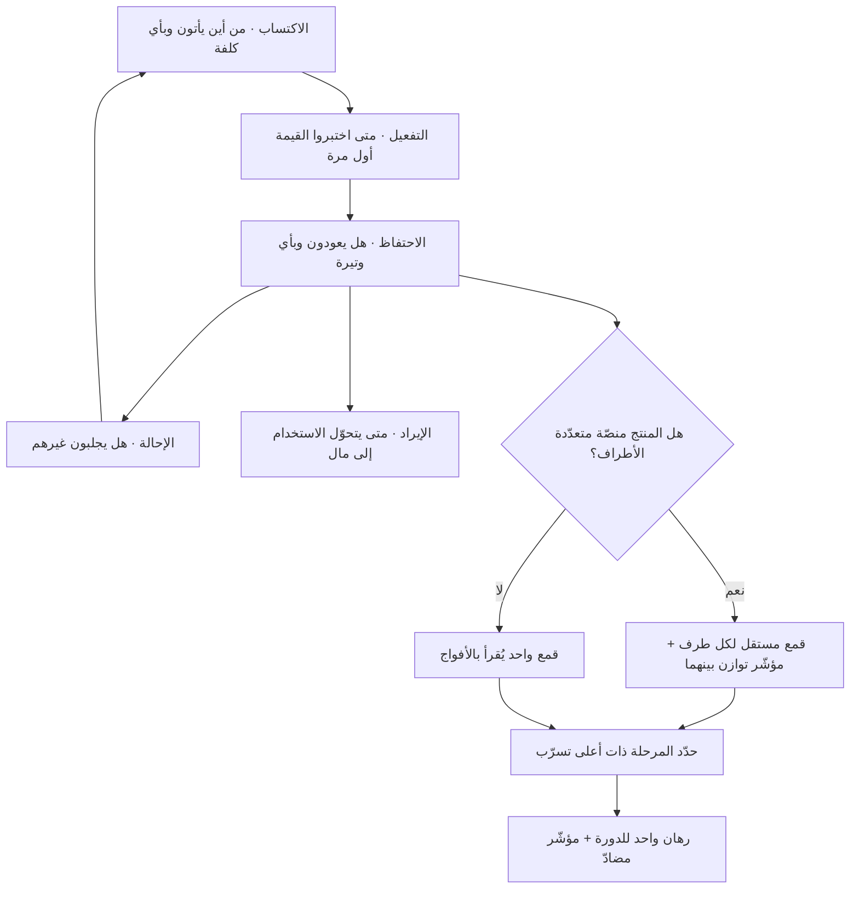

# قمع القرصان (AARRR)

> [!info] تعريف مختصر
> إطار لتنظيم مقاييس نمو المنتج في خمس مراحل متتابعة تمثّل رحلة المستخدم من أول احتكاك بالمنتج حتى تحوّله إلى مصدر إيراد ونموّ: **الاكتساب (Acquisition)** ثم **التفعيل (Activation)** ثم **الاحتفاظ (Retention)** ثم **الإحالة (Referral)** ثم **الإيراد (Revenue)**. سُمّي "قمع القرصان" لأن الحروف الأولى للمراحل تُنطق `AARRR` كصيحة القراصنة. قدّمه المستثمر **ديف مكلور (Dave McClure)** في عرض تقديمي شهير عام 2007 بعنوان *Startup Metrics for Pirates*. وظيفته الأساسية أنه يمنع الفريق من الحكم على صحّة المنتج برقم إجمالي واحد، ويجبره على تحديد **المرحلة التي يتسرّب عندها المستخدمون فعلًا** قبل صرف أي جهد على التحسين.

## الشرح العلمي والاحترافي
- **المشكلة التي وُلد لحلّها**: في سياق الشركات الناشئة المبكّرة، كان الحديث عن "النمو" يُختزل في رقم التسجيلات أو الزيارات. الإطار جاء ليقول إن هذه أرقام تجميعية تخفي أكثر مما تكشف، وإن الحدّ الأدنى المقبول هو تفكيك الرحلة إلى مراحل، وقياس معدّل الانتقال بين كل مرحلتين لا حجم كل مرحلة وحدها. النسبة بين المرحلتين هي المعلومة؛ العدد المطلق قريب من [[Vanity Metrics]].
- **المراحل الخمس ومعنى كل منها**:
  1. **الاكتساب**: كيف يصل الناس إلى المنتج ومن أي قناة، وبأي كلفة. المقياس المركزي هنا ليس عدد الزيارات بل **الكلفة والجودة لكل قناة**؛ فقناة تجلب آلافًا لا يُفعّلون أسوأ من قناة تجلب مئات يبقون.
  2. **التفعيل**: اللحظة التي يختبر فيها المستخدم القيمة الأساسية للمنتج لأول مرة. تعريف هذه اللحظة قرار تصميمي حاسم وليس معطى جاهزًا: هل التفعيل هو إنشاء الحساب؟ أم إتمام أول عملية حقيقية؟ التعريف المتساهل يُنتج قمعًا يبدو صحّيًّا ومنتجًا ميّتًا.
  3. **الاحتفاظ**: هل يعود المستخدم؟ وبأي وتيرة؟ وهذه المرحلة هي **صمّام النظام كلّه**، لأن الاكتساب فوق احتفاظ منخفض يشبه صبّ الماء في وعاء مثقوب: يزيد الإنفاق وتزيد الأرقام مؤقّتًا ثم يعود كل شيء إلى نقطة البداية.
  4. **الإحالة**: هل يجلب المستخدم غيره؟ وهي مرحلة مشروطة بما قبلها؛ فطلب الإحالة من مستخدم لم يختبر القيمة بعد يضرّ بالسمعة ولا يُنتج نموًّا.
  5. **الإيراد**: متى وكيف يتحوّل الاستخدام إلى مال، وما نسبة من يدفعون، وما قيمة العميل على مدى عمره.
- **الترتيب ليس تعاقبًا زمنيًّا صارمًا**: كثيرون يقرؤون الأحرف كخطّ زمني إجباري، والصواب أن الترتيب **أولوية عمل** لا تسلسل حتمي. في بعض المنتجات يسبق الإيراد التفعيلَ (اشتراك مدفوع قبل الاستخدام)، وفي أخرى تسبق الإحالةُ الاحتفاظَ (دعوة الزملاء شرط لإتمام أول مهمّة). المهم أن الفريق يعرف تسلسل قمعه هو، لا أن يفرض تسلسل الأحرف على منتجه.
- **علاقته بتحليل القمع عمومًا**: الإطار حالة خاصّة عالية المستوى من [[Funnel Analysis]]. الفرق أن قمع التحليل التفصيلي يقيس خطوات داخل شاشة أو تدفّق واحد، بينما AARRR يقيس مراحل دورة حياة العميل كاملة. والاثنان يُستخدمان معًا: AARRR ليحدّد **أين** تقع المشكلة، وتحليل القمع التفصيلي ليحدّد **ما** الخطوة الدقيقة التي تُسقط المستخدمين.
- **القياس الصحيح يكون بالأفواج لا بالإجمالي**: قراءة مراحل القمع على قاعدة المستخدمين كاملة تخلط بين الجدد والقدامى وتخفي التدهور. القراءة الصحيحة عبر [[Cohort Analysis]]: كل فوج مسجّل في فترة معيّنة يُتتبَّع عبر المراحل بمرور الوقت، فيظهر ما إن كان المنتج يتحسّن فعلًا أم أن حجم الاكتساب هو الذي يزيد فقط.
- **النقد الأول — يصلح لمنتج استهلاكي بسيط ذي طرف واحد**: نشأ الإطار في بيئة تطبيقات استهلاكية على الويب، حيث المستخدم هو المقرّر والمستفيد والدافع في شخص واحد، والقرار فردي وسريع ورخيص. في هذه البيئة تمثيله ممتاز.
- **النقد الثاني — يضلّل في المنصّات متعدّدة الأطراف**: في السوق ذي الجانبين (بائع/مشترٍ، مطعم/عميل/مندوب) لا يوجد قمع واحد بل **قمعان أو ثلاثة متشابكة**، ونجاح أحدها مشروط بالآخر: اكتساب مشترين على عرض ضعيف يرفع التسرّب لا الإيراد. قراءة قمع واحد مجمّع في هذه الحالة تعطي صورة متفائلة زائفة، وقد تدفع لضخّ التسويق في الجانب الخاطئ تمامًا. العلاج ليس هجر الإطار بل تشغيله مرتين — قمع مستقل لكل جانب — مع مؤشّر ثالث يقيس التوازن بينهما (كنسبة الطلب المُلبّى، أو زمن الاستجابة بين الجانبين).
- **النقد الثالث — يضلّل في البيع المؤسّسي (B2B / Enterprise)**: هنا تنهار الفرضية الأساسية للإطار وهي أن المستخدم شخص واحد. في الصفقة المؤسّسية: الشخص الذي يُكتسب (مستخدم نهائي مهتم) غير الذي يقرّر (لجنة أو راعٍ) غير الذي يدفع (المشتريات/المالية)، ودورة الشراء تمتدّ شهورًا وتمرّ بمراحل غير موجودة في الإطار أصلًا (تقييم أمني، مراجعة قانونية، تجربة محدودة، تجديد سنوي). كما أن "الإحالة" في هذا السياق ليست دعوة زميل بل مرجعية مؤسسية تُقدَّم في عملية بيع أخرى. والأهم: مقياس النمو الحاسم عادةً هو **التجديد والتوسّع داخل الحساب**، وهو مفهوم لا يوجد له موضع طبيعي في الأحرف الخمسة.
- **النقد الرابع — إغفال الأثر السلبي وما بعد الإيراد**: الإطار لا يتضمّن مرحلة للانسحاب ([[Churn]]) ولا لكلفة الخدمة ولا للرضا؛ فقد ترتفع كل مراحله بينما تتآكل قيمة العميل بسبب ارتفاع كلفة الدعم أو تسرّب متأخّر. لذلك تُضاف إليه عمليًّا مؤشّرات موازية من خارج الأحرف الخمسة.
- **قابليته للتحوّل إلى صنم قياس**: حين تُربط حوافز الفرق بمرحلة واحدة من القمع، تظهر تشوّهات متوقّعة تمامًا وفق [[Goodhart's Law]]: فريق تسويق يُكافأ على التسجيلات يجلب حسابات غير مؤهّلة، وفريق يُكافأ على التفعيل يخفّض تعريف التفعيل حتى يفقد معناه.

## أين ومتى يُستخدم
- **في تشخيص تعثّر النمو**: حين تتوقّف الأرقام عن التحسّن ولا يعرف الفريق أين المشكلة، يوفّر الإطار خريطة فحص سريعة تنتقل من مرحلة إلى مرحلة بدل الحدس.
- **عند بناء لوحة مؤشّرات المنتج الأولى**: كهيكل لتنظيم [[Product Analytics]] وتصنيف الأحداث المُتتبَّعة، بحيث يُعرف قبل التنفيذ ما الحدث الذي يمثّل كل مرحلة.
- **في نقاش توزيع ميزانية التسويق**: مقارنة القنوات ليس بحجم الزيارات بل بجودة ما تُنتجه في المراحل اللاحقة، وهو مدخل مباشر لحساب [[Opportunity Cost]] لكل قناة.
- **مع فرق النمو عند اختيار الرهان القادم**: يُوجَّه الجهد إلى المرحلة ذات أعلى تسرّب لا إلى الأسهل تنفيذًا؛ وهو منطق شبيه بمعالجة [[Bottleneck]] في نظرية القيود.
- **في تحديد [[North Star Metric]]**: مراحل القمع تصلح كطبقة تشخيصية تحت المؤشّر الشمالي الواحد، فتُفسّر لماذا تحرّك أو لم يتحرّك.
- **عند التحقّق من ملاءمة المنتج للسوق** ([[Product-Market Fit]]): منحنى [[Retention]] المستقر عبر الأفواج هو الإشارة الأقوى، وهو بالضبط ما يُقرأ في المرحلة الثالثة من القمع.
- **في مراجعة ما بعد الإطلاق** ([[Post-Launch Review]]): لتحديد ما إن كان الإطلاق قد حرّك مرحلة بعينها أم غيّر توزيع القمع فقط.

## مثال وسيناريو تطبيقي
> [!example] **تطبيق حجز خدمات منزلية في مدينة خليجية.** بعد حملة تسويقية بميزانية 180 ألف ريال في شهرين، احتفل الفريق بارتفاع التنزيلات إلى 62,000 والتسجيلات إلى 41,000. لكن الإيراد الشهري لم يتغيّر تقريبًا (من 240 ألفًا إلى 258 ألفًا).
> فكّك الفريق الأرقام على مراحل AARRR بمنهج الأفواج:
> — **الاكتساب**: 62,000 تنزيل، بكلفة وسطية نحو 2.9 ريال للتنزيل.
> — **التفعيل**: الفريق كان يعرّف التفعيل بـ«إنشاء حساب» (41,000 = 66%)، فأعاد تعريفه إلى «إتمام أول حجز فعلي». بهذا التعريف الأدقّ سقط الرقم إلى 4,300 مستخدم فقط، أي 6.9% من التنزيلات.
> — **الاحتفاظ**: من الـ4,300، عاد للحجز مرة ثانية خلال 60 يومًا 1,120 (26%).
> — **الإحالة**: كود الدعوة استُخدم 380 مرة، لكن 71% من مستخدميه لم يُتمّوا حجزًا.
> — **الإيراد**: متوسط قيمة الحجز 165 ريالًا، وهامش المنصّة 18%.
> صار التشخيص واضحًا: العطل الأكبر بين الاكتساب والتفعيل، لا في الاكتساب. وعند تشغيل [[Funnel Analysis]] تفصيليًّا داخل مسار الحجز الأول ظهر أن 58% من المتسرّبين يخرجون عند شاشة اختيار الموعد، لأن أقرب موعد متاح كان بعد 4 أيام في أغلب الأحياء.
> وهنا ظهر الخلل المنهجي الأعمق: المنصّة سوق ذو جانبين، والقمع الذي كان يُقاس هو قمع العملاء فقط. الجانب الآخر — الفنيّون — لم يكن له قمع أصلًا؛ عدد الفنيّين النشطين كان 190 فقط مقابل الطلب الجديد. فأي ريال إضافي في تسويق الجانب الأول كان يزيد التسرّب لا الإيراد.
> أوقف الفريق الحملة، ووجّه جزءًا من الميزانية إلى اكتساب وتأهيل الفنيّين، وبنى قمعًا ثانيًا لهم (تسجيل ← اجتياز التحقّق ← أول مهمّة منجزة ← الاستمرار الأسبوعي)، مع مؤشّر ثالث يقيس التوازن: «نسبة الطلبات التي وجدت موعدًا خلال 24 ساعة». بعد ربع كامل ارتفع عدد الفنيّين النشطين إلى 460، وارتفع التفعيل من 6.9% إلى 15.4% دون أي إنفاق تسويقي إضافي على جانب العملاء.

## خطوات أو مخطّط
1. ارسم رحلة العميل الواقعية في منتجك أولًا، ثم اسقط عليها المراحل الخمس — لا العكس. بعض المنتجات تحتاج مرحلة إضافية (كالتحقّق أو الموافقة التنظيمية) وبعضها يدمج مرحلتين.
2. حدّد لكل مرحلة **حدثًا واحدًا لا لبس فيه** يمثّلها في نظام التحليلات، ووثّق تعريفه كتابةً. أشدّها حساسية تعريف التفعيل: اختر أقرب فعل يدلّ على أن المستخدم اختبر القيمة فعلًا.
3. تحقّق من أن التتبّع التقني يسجّل هذه الأحداث فعليًّا وبدقّة قبل بناء أي لوحة؛ القمع المبني على أحداث ناقصة أسوأ من غياب القياس.
4. احسب **معدّل الانتقال** بين كل مرحلتين متتاليتين، لا الأعداد المطلقة.
5. اقرأ الأرقام بالأفواج عبر [[Cohort Analysis]]، وقارن الأفواج ببعضها لا بالمجموع.
6. إن كان منتجك منصّة متعدّدة الأطراف، ابنِ قمعًا مستقلًّا لكل طرف، وأضف مؤشّر توازن بينهما.
7. إن كان بيعك مؤسّسيًّا، أعد تصميم المراحل حول دورة الشراء الفعلية (تأهيل ← تجربة ← موافقات ← تفعيل ← اعتماد داخلي ← تجديد وتوسّع) واستعمل الأحرف الخمسة كإلهام لا كقالب.
8. حدّد المرحلة ذات أكبر تسرّب نسبي، واجعلها الرهان الوحيد للدورة القادمة.
9. عيّن [[Counter Metric]] لكل تحسين تنوي إجراءه، لحماية النظام من تحسين مرحلة على حساب أخرى.
10. راجع تعريفات المراحل كل ربع؛ نضج المنتج يغيّر معنى "التفعيل" و"الاحتفاظ" معه.

## ⚠️ مفاهيم خاطئة شائعة
> [!warning]
> - **قراءة الحروف كتسلسل زمني إجباري**: الترتيب اقتراح أولوية لا قانون. كثير من المنتجات يحدث فيها الدفع قبل التفعيل، أو الإحالة قبل الاحتفاظ. فرض التسلسل الحرفي يجعل الفريق يقيس مراحل لا وجود لها في منتجه.
> - **الظنّ بأنه إطار قياس شامل لصحّة المنتج**: هو إطار **نمو** فقط. لا يقيس جودة التجربة، ولا كلفة الخدمة، ولا رضا المستخدم، ولا الدَّين التقني. منتج ممتاز الأرقام في مراحله الخمس قد يكون في طريقه للانهيار بسبب كلفة دعم مرتفعة لا يظهرها القمع.
> - **اعتبار الاكتساب هو مرحلة النمو الحقيقية**: النمو المستدام يبدأ من الاحتفاظ. الاستثمار في الاكتساب فوق احتفاظ ضعيف يُنتج ارتفاعًا مؤقّتًا يتبعه هبوط، ويُخفي ضعف المنتج تحت إنفاق متزايد.
> - **الخلط بين التفعيل والتسجيل**: التسجيل التزام إداري، والتفعيل اختبار للقيمة. جعلهما شيئًا واحدًا هو أسهل طريقة لصنع قمع يبدو صحّيًّا ومنتج لا أحد يستخدمه.
> - **الظنّ بأنه صالح كما هو للبيع المؤسّسي**: الإطار يفترض مستخدمًا-مقرّرًا-دافعًا في شخص واحد. في المؤسّسات هؤلاء ثلاثة أشخاص على الأقل، والمقياس الحاسم (التجديد والتوسّع) ليس له موضع في الأحرف الخمسة أصلًا.
> - **افتراض أن مرحلة واحدة تكفي لتفسير النتيجة**: المراحل مترابطة؛ تحسين التفعيل قد يخفض الاحتفاظ إن جاء بجذب مستخدمين غير مناسبين. قراءة مرحلة بمعزل عن جاراتها تنتج قرارات معكوسة.
> - **الاعتقاد بأن نسب "معيارية" للقمع موجودة يمكن مقارنة النفس بها**: النسب تختلف اختلافًا هائلًا بين نوع المنتج والقناة والسوق ونموذج التسعير. المقارنة المفيدة هي مع خطّ الأساس التاريخي لمنتجك ([[Baseline]])، لا مع أرقام مقتبسة من سياق مختلف.

## ❌ ممارسات خاطئة في المشاريع
> [!failure]
> - **الخطأ: تعريف "التفعيل" بأسهل حدث متاح تقنيًّا (فتح التطبيق أو إنشاء حساب).** لماذا يضرّ: يرسم قمعًا متفائلًا يخفي المشكلة الحقيقية، فيصرف الفريق شهورًا على تحسين مراحل لاحقة بينما العطل في البداية. الحل: عرّف التفعيل بأقرب فعل يثبت اختبار القيمة (أول عملية مكتملة، أول نتيجة يراها المستخدم)، ووثّق التعريف وتاريخ تغييره.
> - **الخطأ: ربط مكافآت فرق التسويق بعدد التسجيلات وحده.** لماذا يضرّ: يُنتج ضغطًا على جلب أعداد لا جودة، وترتفع الكلفة مع بقاء الإيراد ثابتًا، وينطبق [[Goodhart's Law]] حرفيًّا. الحل: اربط الحافز بمقياس مركّب يمتدّ إلى مرحلة لاحقة على الأقل (مثل: مستخدم مفعَّل عاد خلال 30 يومًا).
> - **الخطأ: تشغيل قمع واحد على منصّة متعدّدة الأطراف.** لماذا يضرّ: يُخفي أن العنق الحقيقي في الجانب الآخر، فيُضخّ التسويق في الجانب المشبع ويرتفع التسرّب. الحل: قمع مستقل لكل طرف، ومؤشّر توازن صريح (نسبة الطلب المُلبّى، زمن المطابقة) يُراجع مع القمعين.
> - **الخطأ: قراءة القمع على قاعدة المستخدمين الإجمالية بدل الأفواج.** لماذا يضرّ: نمو الاكتساب يُجمّل المتوسّطات ويخفي تدهورًا حقيقيًّا في الأفواج الحديثة، فيُكتشف الخلل بعد ربعين. الحل: اجعل عرض الأفواج هو العرض الافتراضي في لوحة المؤشّرات، ومنع قراءة المرحلة إجماليًّا في المراجعات.
> - **الخطأ: تفعيل برنامج إحالة قبل استقرار الاحتفاظ.** لماذا يضرّ: يدفع مستخدمين لم يختبروا القيمة إلى دعوة معارفهم، فيتضرّر الانطباع عن المنتج وتُهدر حوافز الإحالة على مستخدمين ينسحبون. الحل: اشترط عتبة احتفاظ محدّدة قبل إطلاق الإحالة، واستهدف الدعوة بمن أتمّ سلوكًا يدلّ على الرضا.
> - **الخطأ: مطاردة كل مراحل القمع في الوقت نفسه.** لماذا يضرّ: يوزّع الجهد فيصبح كل تحسّن صغيرًا وغير قابل للعزو، ويتحوّل الفريق إلى منفّذ لتحسينات متفرّقة بلا فرضية. الحل: رهان واحد لكل دورة على المرحلة ذات أعلى تسرّب نسبي، مع فرضية مكتوبة ومدّة قياس محدّدة.
> - **الخطأ: إسقاط الإطار كما هو على منتج مؤسّسي بدورة بيع طويلة.** لماذا يضرّ: تُقاس مراحل بلا معنى (كـ"الإحالة" الفردية) ويُهمَل المقياس الأهمّ (التجديد والتوسّع داخل الحساب)، فتُبنى استراتيجية نمو على خريطة لا تشبه الواقع. الحل: أعد تصميم المراحل حول دورة الشراء الفعلية واحتفظ بروح الإطار (قياس الانتقال بين مراحل) لا بحروفه.
> - **الخطأ: بناء لوحة القمع قبل التحقّق من صحّة تتبّع الأحداث.** لماذا يضرّ: قرارات كبيرة تُبنى على أحداث ناقصة أو مكرّرة، وحين يُكتشف الخلل تُفقد الثقة بكل الأرقام لا بالخطأ وحده. الحل: نفّذ تدقيقًا للأحداث ([[Data Dry Run]]) قبل اعتماد اللوحة، وثبّت مالكًا لمخطّط الأحداث.

## 🔗 مصطلحات ومفاهيم ذات صلة
[[Funnel Analysis]] | [[Retention]] | [[Cohort Analysis]] | [[Churn]] | [[North Star Metric]] | [[Vanity Metrics]] | [[Product Analytics]] | [[Goodhart's Law]] | [[Counter Metric]] | [[Product-Market Fit]] | [[HEART Framework]] | [[Impact Mapping]]
