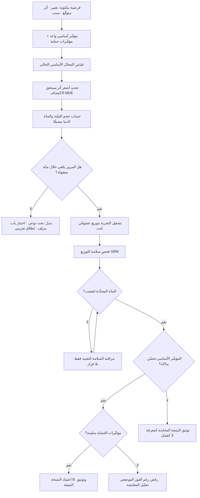

# اختبار A/B (A/B Testing)

> [!info] تعريف مختصر
> تجربة مضبوطة عشوائيًّا تُجرى على **مستخدمين حقيقيين في الإنتاج**: يُقسَّم المرور إلى مجموعتين أو أكثر بشكل عشوائي، تُعرَض على الأولى النسخة الحالية (Control / A) وعلى الثانية النسخة المعدَّلة (Variant / B)، ثم يُقارَن مؤشّر واحد محدَّد سلفًا بين المجموعتين. قيمة الاختبار الحقيقية ليست في «معرفة أيّ تصميم أجمل»، بل في أنه — بفضل التوزيع العشوائي — يمنح **استدلالًا سببيًّا** لا ارتباطيًّا: الفرق المرصود بين المجموعتين يُنسب إلى التغيير نفسه لأن كل ما عداه موزَّع بالتساوي بين المجموعتين في المتوسّط. وهذه الخاصية بالذات هي ما لا تستطيع أي لوحة تحليلات وصفية أن تعطيه مهما كبر حجم بياناتها.

## الشرح العلمي والاحترافي
- **الأساس المنهجي مستعار من التجارب السريرية**: البنية المفاهيمية للاختبار (مجموعة ضابطة، تخصيص عشوائي، فرضية صفرية، مستوى دلالة محدَّد سلفًا) تعود إلى تقاليد التصميم التجريبي والإحصاء الاستدلالي التي تبلورت في النصف الأول من القرن العشرين على يد رواد الإحصاء الزراعي والطبي، ثم انتقلت إلى الويب في أواخر التسعينيات وأوائل الألفية حين صار قياس السلوك رخيصًا وفوريًّا. لذلك فإن كل تحذير إحصائي كلاسيكي — من الاختبارات المتعدّدة إلى الإيقاف المبكر — ينطبق حرفيًّا على اختبارات المنتج، ولا يُعفى المنتجيّون منه بحجّة أن «هذه مجرّد واجهة».
- **الفرضية الصفرية والدلالة (Significance)**: يفترض الاختبار ابتداءً أن لا فرق بين النسختين (الفرضية الصفرية). ثم يُحسب احتمال ملاحظة فرق بهذا الحجم أو أكبر لو كانت الفرضية الصفرية صحيحة — وهو ما يُعرف بقيمة `p`. المتعارف عليه هو اعتماد عتبة `α = 0.05`، أي القبول بخطر 5% أن نعلن فوزًا وهميًّا (خطأ من النوع الأول). والفهم الدقيق مهم: `p = 0.03` **لا تعني** أن احتمال صحّة الفرق 97%، بل تعني أن بيانات بهذه الغرابة كانت ستظهر بنسبة 3% لو لم يكن هناك فرق أصلًا. الخلط بين الأمرين من أكثر أخطاء التفسير شيوعًا في اجتماعات المنتج.
- **القوّة الإحصائية (Power) وخطأ النوع الثاني**: القوّة هي احتمال أن يكتشف الاختبار فرقًا حقيقيًّا موجودًا فعلًا، ويُتعارف على استهداف 80% منها. أي أن تجربة مصمَّمة جيّدًا تحمل — بالتصميم — احتمال 20% أن تُفوّت تحسينًا حقيقيًّا (خطأ من النوع الثاني). ومن هنا تأتي قاعدة عملية مهمّة: **نتيجة «غير دالّة» ليست إثباتًا لانعدام الأثر**، بل غالبًا إثبات أن العيّنة كانت أصغر من أن ترى الأثر. الفرق بين «لم نجد فرقًا» و«أثبتنا التساوي» فرق جوهري في القرار.
- **حجم العيّنة يُشتقّ ولا يُخمَّن**: حجم العيّنة اللازم لكل مجموعة يُحسب قبل بدء التجربة من أربعة مدخلات: معدّل التحويل الأساسي الحالي (Baseline)، وأصغر أثر يستحق الاكتشاف (MDE — Minimum Detectable Effect)، ومستوى الدلالة، والقوّة. والعلاقة الحاسمة عمليًّا هي أن حجم العيّنة يتناسب عكسًا مع **مربّع** الأثر المطلوب اكتشافه: أي أن اكتشاف تحسّن نسبي بمقدار 2% يحتاج تقريبًا **أربعة أضعاف** العيّنة اللازمة لاكتشاف 4%. ولهذا فإن اختبار «تغيير لون زرّ» — الذي يُتوقّع أن يعطي أثرًا ضئيلًا — يتطلّب في الواقع أضخم عيّنة، وهو عكس الحدس الشائع الذي يعتبره «اختبارًا صغيرًا».
- **المدّة الدنيا محكومة بدورة السلوك لا بحجم العيّنة وحده**: حتى لو اكتمل حجم العيّنة خلال يومين بسبب مرور عالٍ، فإن إيقاف التجربة عندها خطأ. سلوك المستخدمين دوري بطبيعته: أيام الأسبوع تختلف عن العطلة، وبداية الشهر تختلف عن نهايته، والمستخدم الجديد يختلف عن العائد. القاعدة المهنية المستقرّة هي تشغيل التجربة **دورات أسبوعية كاملة** (أسبوع، أسبوعان…) لا أجزاء منها، بحدّ أدنى أسبوع كامل، حتى لا يكون «الفوز» مجرّد انعكاس لتركيبة أيام مختلفة بين البداية والنهاية. وفي السياق الخليجي تحديدًا تُضاف دورات موسمية قويّة: رمضان، والأعياد، ومواسم التخفيضات، وبداية العام الدراسي — وكلها تجعل نتيجة تجربة أُجريت داخلها غير قابلة للتعميم على غيرها.
- **مشكلة الاختلاس البصري (Peeking) والإيقاف المبكر**: أخطر خطأ عملي على الإطلاق. إذا نظرت إلى نتيجة التجربة كل يوم وأوقفتها في أول لحظة تعبر فيها `p` عتبة 0.05، فأنت لا تُجري اختبارًا واحدًا بمستوى خطأ 5%، بل سلسلة اختبارات متتالية يتراكم فيها الخطأ. الفرق بين المجموعتين يتذبذب بشدّة في البداية بحكم الصدفة وحدها، فيكاد يكون مؤكّدًا أن أي تجربة — حتى بين نسختين متطابقتين تمامًا — ستعبر عتبة الدلالة في لحظة ما لو نُظر إليها بما يكفي من التكرار. النتيجة: معدّل الإنذارات الكاذبة يرتفع كثيرًا فوق الـ5% المعلنة. العلاج أحد أمرين: **الالتزام الصارم بحجم عيّنة ومدّة محدَّدين سلفًا** ثم النظر مرّة واحدة، أو استخدام منهجيات تسمح صراحةً بالمراقبة المستمرة (اختبارات تسلسلية / حدود إنفاق ألفا / أساليب بايزية مع قواعد إيقاف معلنة مسبقًا). المحرَّم ليس النظر بحد ذاته، بل **النظر بقاعدة قرار غير معلنة مسبقًا**.
- **مشكلة المقارنات المتعدّدة**: كل مؤشّر إضافي تفحصه، وكل شريحة إضافية تقطّع بها النتيجة (حسب المنصّة، المدينة، نوع الحساب، حداثة التسجيل)، هو اختبار إضافي يرفع احتمال العثور على «فائز» بالصدفة. فحص 20 شريحة عند عتبة 5% يعني توقّع نتيجة كاذبة واحدة في المتوسّط لا أكثر. العلاج: تحديد **مؤشّر أساسي واحد (Primary Metric)** قبل البدء، واعتبار كل ما عداه استكشافيًّا مولِّدًا لفرضيات لاحقة لا حاسمًا لقرار، مع تصحيح إحصائي عند الحاجة.
- **مقاييس الحماية (Guardrail Metrics)**: التجربة تُحسم بمؤشّر أساسي واحد، لكنها تُراقَب بمجموعة مؤشّرات حماية لا يُسمح لها بالتدهور مهما تحسّن المؤشّر الأساسي: زمن التحميل، معدّل الأخطاء، معدّل الشكاوى، الإلغاء، الإيراد لكل مستخدم. وجودها ضروري لأن أكثر «الانتصارات» إغراءً هي التي تشتري تحسّنًا موضعيًّا بثمن كلّي — كإعلان مزعج يرفع النقرات ويرفع معه [[Churn|الفقدان]].
- **صحّة التجربة (Validity) تُهدَّد بأمور تقنية لا إحصائية**: تسرّب بين المجموعتين (المستخدم يرى النسختين من جهازين)، وعدم توازن أحجام المجموعات عن المتوقّع (SRM — Sample Ratio Mismatch) وهو مؤشّر إنذار خطير يعني وجود خلل في آلية التوزيع نفسها ويُبطل التجربة كليًّا، وأثر الحداثة (Novelty) حيث يتفاعل المستخدمون مع أي تغيير لمجرّد جدّته ثم يعود السلوك لطبيعته، وأثر الرفض المؤقّت (Change Aversion) وهو العكس تمامًا لدى المستخدمين المعتادين. الأثران الأخيران يجعلان قراءة نتيجة الأيام الأولى مضلّلة في الاتجاهين معًا.

## أين ومتى يُستخدم
- **في تحسين مسارات التحويل داخل [[User Flow|مسار المستخدم]]**: صفحات التسجيل، خطوات الدفع، شاشة التهيئة الأولى (Onboarding) — وهي أكثر المواضع صلاحية لأن الأثر يظهر بسرعة والمرور فيها كثيف.
- **في حسم الخلاف بين بديلين تصميميين بعد مرحلة [[Wireframe|الإطار السلكي]]**: حين يتساوى البديلان منطقيًّا ويستحيل الحسم بالرأي، تكون التجربة أرخص من جدل ثلاثة اجتماعات.
- **في اختبار فرضيات [[Product Discovery|اكتشاف المنتج]] وتحويل [[Hypothesis|الفرضية]] إلى دليل سلوكي**: كل تجربة A/B هي عمليًّا فرضية مكتوبة بعتبة ومدّة ومقياس.
- **في التحقّق من أن تحسّنًا في مؤشّر موضعي لم يضرّ [[North Star Metric|المؤشّر الشمالي]]**: عبر مقاييس الحماية ([[Guard Rails]]).
- **في تقليل مخاطر الإطلاق تدريجيًّا**: التوزيع التدريجي على نسبة صغيرة من المرور قبل التعميم، بما يشبه منطق [[Pilot Launch|الإطلاق التجريبي]] و[[Shift-Left and Shift-Right|الاختبار في الإنتاج]].
- **في ترشيد الجدل حول الأولويات**: نتيجة تجربة واحدة قد تُلغي بندًا كاملًا من قائمة الأعمال، وهو ما يُترجم مباشرة إلى وفر في [[Cost of Experimentation|كلفة التجريب]] مقارنة ببنائه كاملًا.

## مثال وسيناريو تطبيقي
> [!example] متجر إلكتروني سعودي يبيع مستلزمات منزلية. معدّل إتمام الشراء الحالي من صفحة السلّة = **4.0%**، والمرور اليومي إلى السلّة ≈ **5,000 زائر**. اقترح الفريق إضافة خيار «الدفع عند الاستلام» بشكل بارز في أعلى صفحة الدفع بدل إخفائه في قائمة منسدلة.
> **قبل البدء** حدّد الفريق أربعة أشياء كتابةً: المؤشّر الأساسي = نسبة إتمام الطلب؛ أصغر أثر يستحق الاكتشاف (MDE) = تحسّن نسبي 10% (أي من 4.0% إلى 4.4%)؛ الدلالة `α = 0.05`؛ القوّة 80%. أعطى حساب حجم العيّنة نحو **15,600 زائر لكل مجموعة**، أي 31,200 إجمالًا ≈ **6.2 يوم** من المرور — فقُرِّبت المدّة إلى **أسبوعين كاملين** لتغطية دورتين أسبوعيتين كاملتين، لا لأن العيّنة ناقصة بل لتفادي تحيّز أيام الأسبوع.
> **في اليوم الثالث** ظهرت النسخة B متقدّمة بـ 4.9% مقابل 3.9%، و`p = 0.04`. ضغط أحد المسؤولين لإطلاق التغيير فورًا «ما دام ثبت النجاح». رفض الفريق استنادًا إلى قاعدة الإيقاف المتّفق عليها مسبقًا، وأشار إلى أن يومي الجمعة والسبت — وهما مختلفان سلوكيًّا — لم يدخلا العيّنة بعد.
> **عند اليوم 14**: A = 4.02% (628 طلبًا من 15,620)، B = 4.41% (690 طلبًا من 15,640). الفرق النسبي +9.7%، `p = 0.037`. المؤشّرات الحمائية سليمة: زمن التحميل دون تغيير، ومعدّل إلغاء الطلبات بعد التأكيد ارتفع من 6.1% إلى 6.4% (فرق غير دالّ، لكنه سُجّل للمراقبة لأن الدفع عند الاستلام معروف بارتباطه بالإلغاء).
> **القرار**: اعتُمدت B، مع رصد مؤشّر الإلغاء لثلاثة أشهر لأن أثره الحقيقي على [[Retention|الاحتفاظ]] وعلى تكلفة التوصيل المرتجع لا يظهر داخل نافذة تجربة قصيرة.
> **الدرس المفصلي**: لو أُوقفت التجربة في اليوم الثالث لاتُّخذ القرار نفسه — لكن **بالحظّ لا بالدليل**. والفرق يظهر في التجربة التالية التي يُوقفها الفريق مبكّرًا فتكون كاذبة، ولا أحد يكتشف ذلك أبدًا لأن النسخة الخاسرة صارت هي الواقع.

## خطوات أو مخطّط
1. صياغة فرضية مكتوبة: «نعتقد أن [التغيير] سيؤدّي إلى [أثر] على [المؤشّر الأساسي]، لأن [سبب مبني على بحث أو بيانات]».
2. اختيار **مؤشّر أساسي واحد** فقط، وتحديد قائمة مؤشّرات الحماية التي لا يُسمح بتدهورها.
3. قياس المعدّل الأساسي الحالي (Baseline) من بيانات [[Product Analytics|تحليلات المنتج]] الفعلية لا من التقدير.
4. تحديد أصغر أثر يستحق الاكتشاف (MDE) بناءً على **الجدوى الاقتصادية** لا على التفاؤل: ما أقل تحسّن يبرّر كلفة البناء والصيانة؟
5. حساب حجم العيّنة والمدّة الدنيا قبل البدء، وتقريب المدّة لأعلى إلى دورات أسبوعية كاملة.
6. التحقّق من سلامة التوزيع: عشوائية حقيقية، ثبات المستخدم على مجموعته عبر الجلسات والأجهزة، وفحص تطابق نسب الأحجام (SRM).
7. تشغيل التجربة دون تعديل أي شيء آخر في المنتج أو الحملات التسويقية خلال المدّة.
8. عدم اتخاذ أي قرار قبل انقضاء المدّة المحدَّدة — ويُسمح بالمراقبة لأغراض السلامة التقنية فقط (أعطال، أخطاء).
9. قراءة النتيجة مع فترة الثقة لا مع الرقم المجرّد، والتفريق بين «فرق دالّ» و«فرق ذي أثر عملي».
10. توثيق النتيجة في سجلّ تجارب دائم — بما فيها التجارب الخاسرة والمحايدة، فهي أثمن ما يمنع تكرار الجهد.

## ⚠️ مفاهيم خاطئة شائعة
> [!warning]
> - **«قيمة p تساوي احتمال صحّة النتيجة»**: خطأ تفسيري جذري. `p = 0.03` تعني: لو لم يكن هناك فرق حقيقي، لظهرت بيانات بهذه الغرابة في 3% من الحالات. لا تقول شيئًا مباشرًا عن احتمال أن يكون تغييرك ناجحًا. **التصحيح**: اقرأ **فترة الثقة** إلى جانب `p`؛ فترة مثل «التحسّن بين +1% و+18%» تنقل حالة عدم اليقين بصدق أكبر من رقم واحد.
> - **«النتيجة غير الدالّة تعني أن التغيير لا أثر له»**: الأصح أنها تعني أن التجربة لم تملك قوّة كافية لرؤية أثر بهذا الحجم. **التصحيح**: افحص فترة الثقة — إن كانت واسعة جدًّا فالتجربة لم تحسم شيئًا، وإن كانت ضيّقة حول الصفر فهذا وحده دليل معقول على انعدام الأثر العملي.
> - **«ما دامت العيّنة اكتملت فيمكن الإيقاف فورًا»**: اكتمال العيّنة شرط ضروري لا كافٍ. **التصحيح**: أضف شرط الدورات الأسبوعية الكاملة، لأن تركيبة الأيام نفسها متغيّر مربك (Confounder).
> - **«اختبار A/B يصلح لكل قرار منتج»**: لا يصلح حين يكون المرور قليلًا (فالعيّنة المطلوبة تحتاج شهورًا)، ولا للتغييرات الاستراتيجية الكبرى كإعادة تموضع المنتج أو تغيير نموذج التسعير جذريًّا (فالأثر يتشابك مع العلامة والسوق ولا يُعزل)، ولا لما أثره طويل المدى كالثقة والولاء والسمعة (فنافذة أسبوعين تقيس ردّ الفعل لا الأثر)، ولا حين يكون التغيير التزامًا قانونيًّا أو أمنيًّا لا خيارًا. **التصحيح**: في هذه الحالات استخدم بحثًا نوعيًّا، أو [[Pilot Launch|إطلاقًا تجريبيًّا]] على سوق كامل، أو تجارب على مستوى المجموعات الزمنية بدل الأفراد.
> - **«التجربة الفائزة تعني تحسّنًا دائمًا»**: أثر الحداثة يجعل بعض المكاسب تتبخّر خلال أسابيع. **التصحيح**: أعد قياس المؤشّر بعد شهر إلى ثلاثة من التعميم، خصوصًا للتغييرات البصرية اللافتة.
> - **«يمكن تشغيل عشر تجارب متزامنة بلا مشكلة»**: ممكن تقنيًّا، لكن التجارب المتداخلة على المسار نفسه قد تتفاعل فتُفسد قراءة بعضها. **التصحيح**: افصل التجارب على مسارات مختلفة، أو استخدم تصميمًا عامليًّا معلنًا يقيس التفاعل بدل تجاهله.
> - **«الفرق الدالّ إحصائيًّا = فرق مهم للعمل»**: مع عيّنة ضخمة يصير فرق 0.05% دالًّا إحصائيًّا وعديم القيمة اقتصاديًّا. **التصحيح**: احسم مسبقًا حدّ الأهمية العملية (Practical Significance) بالريال لا بالنسبة.

## ❌ ممارسات خاطئة في المشاريع
> [!failure]
> - **الخطأ: النظر اليومي إلى لوحة التجربة وإيقافها عند أول لحظة فوز** → **لماذا يضرّ**: يرفع معدّل الإنذارات الكاذبة أضعافًا فوق الـ5% المعلنة، فتتراكم في المنتج «تحسينات» بعضها في الواقع مضرّ، ولا تُكتشف أبدًا لأن أحدًا لا يعيد اختبار قرار قديم → **الحل**: اكتب قاعدة الإيقاف (حجم العيّنة + المدّة) في وثيقة التجربة قبل تشغيلها، واحجب لوحة النتائج عن أصحاب القرار حتى انقضاء المدّة، أو تبنَّ منهجية تسلسلية تسمح بالمراقبة رسميًّا.
> - **الخطأ: تشغيل تجربة على منتج مروره ضئيل (بضع مئات زيارة أسبوعيًّا)** → **لماذا يضرّ**: تحتاج التجربة شهورًا لتصل إلى قوّة كافية، فتُقرأ نتيجة ضعيفة على أنها حسم، ويُبنى قرار على ضجيج محض → **الحل**: احسب المدّة المطلوبة قبل الالتزام؛ إن تجاوزت 6–8 أسابيع فانتقل إلى أدوات أخرى: [[User Interview|مقابلات المستخدمين]]، [[Fake Door Test|اختبار الباب المزيّف]]، أو اختبار قابلية استخدام على 5 مستخدمين.
> - **الخطأ: تغيير خمسة عناصر في النسخة B دفعة واحدة** → **لماذا يضرّ**: تحصل على نتيجة بلا تفسير — تعرف أن الحزمة فازت ولا تعرف أي عنصر فيها هو السبب، وقد يكون فيها عنصر ضارّ عوّضه آخر نافع → **الحل**: إمّا عزل التغييرات في تجارب متتابعة، أو استخدام تصميم عاملي مقصود مع عيّنة كافية لقياس كل عامل، مع الاعتراف بأن حزمة كاملة تصلح كاختبار «مفهوم» لا كاختبار «سبب».
> - **الخطأ: تقطيع النتيجة إلى شرائح بعد ظهورها بحثًا عن فوز** → **لماذا يضرّ**: هو تنقيب انتقائي (p-hacking)؛ مع 15 شريحة ستجد بالضرورة شريحة «فائزة» بالصدفة، فتُبنى استراتيجية على وهم → **الحل**: أعلن الشرائح المهمّة قبل التجربة، واعتبر أي اكتشاف لاحق **فرضية جديدة** تُختبر بتجربة مستقلّة قبل أن تصير قرارًا.
> - **الخطأ: إهمال فحص تطابق نسب المجموعات (SRM)** → **لماذا يضرّ**: انحراف التوزيع عن 50/50 بشكل غير عشوائي يعني خللًا في آلية التخصيص (كاستبعاد صامت لمستخدمي متصفّح معيّن)، وأي نتيجة عندها باطلة مهما بدت جميلة → **الحل**: اجعل فحص SRM بوّابة آلية إلزامية في أداة التجريب، تُبطل التجربة تلقائيًّا عند تجاوز العتبة.
> - **الخطأ: عدم توثيق التجارب الخاسرة والمحايدة** → **لماذا يضرّ**: يعيد الفريق التالي التجربة نفسها بعد عام، وتُهدر الميزانية مرّتين، ويترسّخ انطباع بأن «التجريب لا يعطي نتائج» لأن المرئي منه هو الانتصارات فقط → **الحل**: سجلّ تجارب دائم يوثّق الفرضية والتصميم والنتيجة والقرار، تُراجع أرشيفه قبل اقتراح أي تجربة جديدة.
> - **الخطأ: مطاردة المؤشّر الأساسي وحده وتجاهل مقايضاته** → **لماذا يضرّ**: يُنتج مكاسب موضعية على حساب الكل — كنافذة اشتراك عدوانية ترفع التسجيلات وترفع معها [[Churn|الفقدان]] في الشهر الثاني → **الحل**: اربط قرار الاعتماد بشرط مزدوج: تحسّن المؤشّر الأساسي **و** سلامة مؤشّرات الحماية، واجعل الشرط الثاني حقّ نقض لا توصية.
> - **الخطأ: استخدام التجربة لتبرير قرار مُتّخذ سلفًا** → **لماذا يضرّ**: يتحوّل التجريب إلى طقس شكلي يغذّي [[Confirmation Bias|انحياز التأكيد]]، فتُقبل النتائج الموافقة وتُشكَّك النتائج المخالفة بحجج منهجية انتقائية → **الحل**: اشترط التزامًا مكتوبًا مسبقًا بما سيُفعل في كل من حالتي الفوز والخسارة، ووقّع عليه صاحب القرار قبل التشغيل.

## 🔗 مصطلحات ومفاهيم ذات صلة
[[Hypothesis]] | [[Statistical Significance]] | [[Product Analytics]] | [[Retention]] | [[Churn]] | [[User Flow]] | [[Wireframe]] | [[Fake Door Test]] | [[Cost of Experimentation]] | [[North Star Metric]] | [[Guard Rails]] | [[Pilot Launch]] | [[Product Discovery]] | [[Confirmation Bias]] | [[Percentiles and Median vs Average]] | [[Outcome vs Output]]
