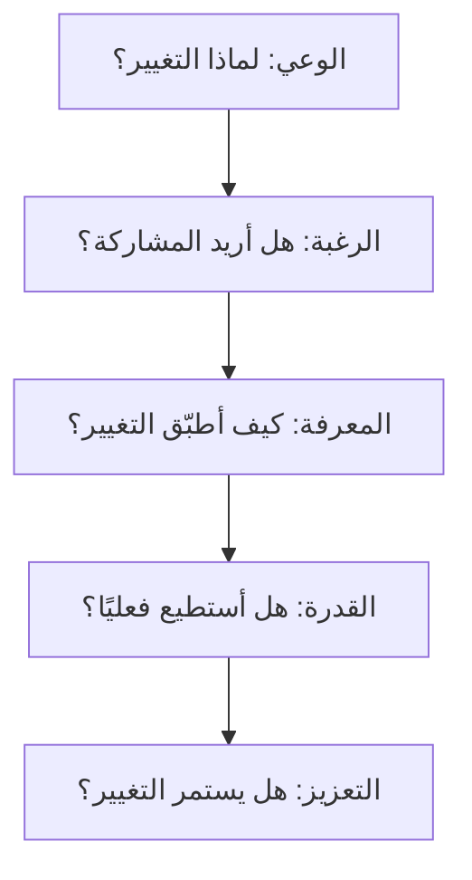

# نموذج ADKAR (ADKAR Model)

> [!info] تعريف مختصر
> نموذج ADKAR هو إطار عمل لإدارة التغيير (Change Management) يركّز على الفرد، ويتكوّن من خمس مراحل متسلسلة يجب أن يمر بها كل شخص متأثر بالتغيير: الوعي (Awareness)، الرغبة (Desire)، المعرفة (Knowledge)، القدرة (Ability)، والتعزيز (Reinforcement).

## الشرح العلمي والاحترافي
- طوّرت النموذج شركة Prosci، واسمه اختصار للمراحل الخمس بالإنجليزية: Awareness, Desire, Knowledge, Ability, Reinforcement.
- على عكس نماذج إدارة التغيير التي تركز على المؤسسة ككل، يركز ADKAR على "الفرد" كوحدة أساسية للتغيير: التغيير الناجح مؤسسيًا يبدأ بنجاح كل موظف في اجتياز المراحل الخمس.
- **الوعي**: هل يفهم الشخص لماذا يحدث التغيير؟ بدون فهم السبب، تظهر مقاومة طبيعية.
- **الرغبة**: هل يريد الشخص المشاركة في هذا التغيير ودعمه؟ تتأثر بالمكاسب والمخاوف الشخصية.
- **المعرفة**: هل يعرف الشخص كيف يتغيّر، وما المهارات والمعلومات اللازمة؟
- **القدرة**: هل يستطيع الشخص تطبيق المعرفة فعليًا في عمله اليومي؟ المعرفة النظرية لا تكفي دون تدريب عملي.
- **التعزيز**: هل توجد آليات (حوافز، متابعة، تغذية راجعة) تُبقي التغيير مستمرًا ولا يتراجع الناس إلى العادات القديمة؟
- يُستخدم النموذج لتشخيص "أين تحديدًا يتعثر التغيير"؛ فإذا فشل مشروع تغيير، غالبًا ما يكون السبب توقفًا عند إحدى هذه المراحل الخمس، وليس فشلًا شاملًا.

## أين ومتى يُستخدم
- يُستخدم عند إدخال أداة أو عملية جديدة داخل المؤسسة، مثل الانتقال من منهجية الشلال ([[04 - Waterfall]]) إلى المنهجية الرشيقة ([[01 - Agile]])، أو تطبيق نظام إدارة مشاريع جديد.
- مناسب في مرحلة التخطيط للتغيير التنظيمي، وأيضًا أثناء التنفيذ لتشخيص أسباب المقاومة.
- يُستخدم من قِبل مديري المشاريع، ومسؤولي الموارد البشرية، والقيادات في التحول الرقمي (Digital Transformation).
- يُكمِّل أدوات أخرى مثل خريطة أصحاب المصلحة ([[Stakeholder Map]]) وخطة التواصل ([[Communication Plan]]) التي تحدد كيفية الوصول لكل مرحلة من مراحل ADKAR.

## مثال وسيناريو تطبيقي
> [!example] قررت شركة "نقلة" للخدمات اللوجستية الانتقال من إدارة المهام عبر البريد الإلكتروني وملفات إكسل إلى نظام كانبان رقمي. عند القياس بعد أسبوعين، وجد مدير المشروع أن 80% من الموظفين يعرفون "لماذا" يحدث التغيير (وعي مرتفع)، لكن نصفهم فقط أبدى حماسًا للمشاركة (رغبة منخفضة) لأنهم قلقون من أن النظام الجديد سيكشف بطء أدائهم أمام المدراء. بدلًا من الانتقال مباشرة لمرحلة التدريب، عقد المدير جلسات فردية لشرح أن الهدف تحسين التدفق وليس المراقبة الفردية، ثم أشرك الموظفين في اختيار إعدادات النظام. بعد تحسّن الرغبة، انتقل الفريق لمرحلة التدريب العملي (المعرفة والقدرة)، وأخيرًا خصص "بطل تغيير" (Change Champion) في كل فريق لمتابعة الالتزام أسبوعيًا (التعزيز).

## خطوات أو مخطّط
1. تقييم مستوى الوعي: هل يفهم الجميع سبب التغيير وأهدافه؟
2. بناء الرغبة: التواصل الشخصي، معالجة المخاوف، إشراك الأفراد في القرار.
3. نقل المعرفة: تدريب، ورش عمل، أدلة استخدام.
4. تطوير القدرة: تمارين عملية، دعم مباشر أثناء التطبيق الفعلي، فترة تجريبية.
5. التعزيز: متابعة دورية، مكافآت، قياس مؤشرات الالتزام، تصحيح الانتكاسات.
6. تكرار التقييم في كل مرحلة قبل الانتقال للتالية، لأن التقدم غير الحقيقي في مرحلة يعرقل كل ما بعدها.

## ⚠️ مفاهيم خاطئة شائعة
> [!warning]
> - الاعتقاد أن الوعي وحده كافٍ لدفع الناس للتغيير؛ الوعي بالسبب لا يعني بالضرورة وجود الرغبة في التغيير.
> - الظن بأن المراحل الخمس تحدث دفعة واحدة لكل الفريق بنفس الوتيرة؛ في الواقع كل فرد يتقدم بسرعته الخاصة، وبعضهم قد يتعثر في مرحلة مختلفة عن الآخرين.
> - إهمال مرحلة "التعزيز" باعتبار أن التغيير انتهى بمجرد التدريب؛ بدون تعزيز مستمر يعود الناس تدريجيًا للعادات القديمة.

## ❌ ممارسات خاطئة في المشاريع
> [!failure]
> - القفز مباشرة إلى التدريب (المعرفة) دون بناء الوعي والرغبة أولًا، فيحضر الموظفون التدريب دون اقتناع ويهملون التطبيق. **الحل:** التأكد من اجتياز مرحلتي الوعي والرغبة قبل تخصيص ميزانية التدريب.
> - الاعتماد فقط على إعلان عام (بريد إلكتروني أو اجتماع واحد) لبناء الوعي دون متابعة الأفراد المتأثرين مباشرة. **الحل:** استخدام قنوات متعددة وجلسات فردية مع أصحاب المصلحة المهمين ([[Stakeholder Map]]).
> - عدم قياس أي من المراحل الخمس، والافتراض أن التغيير "نجح" لمجرد إطلاق الأداة الجديدة رسميًا. **الحل:** قياس كل مرحلة عبر استبيانات أو مقابلات قصيرة قبل الإعلان عن نجاح التغيير.

## 🔗 مصطلحات ومفاهيم ذات صلة
[[Evolutionary Change]] | [[Stakeholder Map]] | [[Communication Plan]] | [[Psychological Safety]] | [[Leadership at Every Level]] | [[Alignment]] | [[01 - Agile]]
