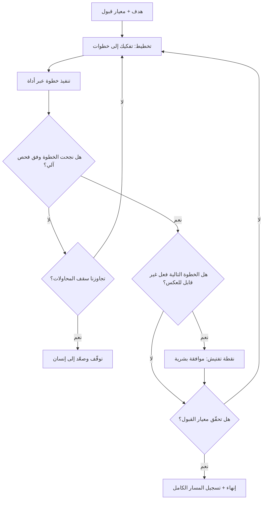

# الوكيل الذكي (AI Agent)

> [!info] تعريف مختصر
> نظام يتلقّى **هدفًا** لا أمرًا مفردًا، فيقرّر بنفسه كيف يصل إليه: يفكّك الهدف إلى خطوات، ويستدعي أدوات خارجية (بحث، قاعدة بيانات، ملفات، واجهات برمجية، تنفيذ شيفرة)، وينفّذ الخطوة تلو الأخرى، ويقرأ نتيجة كل خطوة ليقرّر الخطوة التالية، ثم يقيّم هل بلغ الهدف أم يعيد المحاولة. الفارق الجوهري عن أي استخدام آخر للذكاء الاصطناعي ليس «الذكاء» بل **انتقال ملكية الحلقة**: في الوكيل، النظام هو من يقرّر متى تنتهي المهمّة وأي خطوة تليها، بينما في [[AI Copilot|المساعد الذكي]] يبقى الإنسان مالك كل دورة. ولأن الوكيل يعمل بسلسلة خطوات متتابعة، فإن دقّته الكلّية ليست دقّة الخطوة الواحدة، بل **حاصل ضرب دقّات الخطوات** — وهذه الحقيقة الحسابية البسيطة هي السبب التقني الأول لتقييد استقلاليته.

## الشرح العلمي والاحترافي
- **البنية العامّة لأي وكيل تتكوّن من خمسة عناصر**: ① **هدف** يُصاغ نصًّا أو معيارًا؛ ② **قدرة تخطيط** تفكّك الهدف إلى خطوات وتعيد الترتيب عند الفشل؛ ③ **أدوات** (Tools) هي منافذه إلى العالم — بحث، استعلام، كتابة ملف، استدعاء واجهة، إرسال رسالة؛ ④ **ذاكرة** تحمل سياق ما جرى داخل المهمّة وأحيانًا عبر المهام؛ ⑤ **حلقة تقييم** تقارن النتيجة بالهدف وتقرّر: انتهِ، أعِد المحاولة، أم اطلب المساعدة. وحين يُقال «هذا وكيل» فالمقصود عمليًّا وجود العنصرين الثالث والخامس معًا: أدوات تُحدث أثرًا في العالم، وحلقة تكرار يملكها النظام.
- **تراكم الخطأ عبر الخطوات (Error Compounding) هو الظاهرة المركزية**: إذا كان احتمال أن تُنفَّذ خطوة واحدة تنفيذًا صحيحًا هو `p`، وكانت المهمّة تتطلّب `n` خطوة متسلسلة يعتمد كلٌّ منها على سابقتها، فاحتمال نجاح السلسلة كاملة يقارب `p^n`. ولنترجم ذلك بأرقام: عند دقّة خطوة 95% تكون دقّة سلسلة من 5 خطوات ≈ 77%، ومن 10 خطوات ≈ 60%، ومن 20 خطوة ≈ 36%. وعند دقّة 99% للخطوة الواحدة، تظلّ سلسلة الـ20 خطوة عند ≈ 82%. الخلاصة العملية: **إطالة السلسلة تستهلك الجودة أسرع بكثير ممّا يحدسه الفريق**، وتحسين دقّة الخطوة بمقدار طفيف لا يعوّض عن سلسلة طويلة. ولهذا فإن أول رافعة هندسية لتحسين الوكيل ليست «نموذجًا أذكى» بل **تقصير السلسلة** وتقسيم المهمّة إلى وحدات مستقلّة قابلة للتحقّق.
- **الأخطر من انخفاض الاحتمال هو أن الخطأ لا يقف بل يُبنى عليه**: في السلسلة، لا يُلغى خطأ الخطوة الثالثة بل يصير **مُدخلًا** للرابعة، فيولّد الوكيل بقيّة العمل على أساس فاسد ويقدّمه بصياغة واثقة ومتّسقة داخليًّا. وهذا يجعل الخطأ الوكيلي أصعب اكتشافًا من الخطأ المفرد: المخرَج يبدو مكتملًا ومنسجمًا، والانحراف مدفون في خطوة وسطى لم يرها أحد. ومن هنا فإن مراجعة المخرَج النهائي وحدها ليست ضابطة كافية، ويجب أن يكون **مسار الخطوات نفسه مرئيًّا وقابلًا للتدقيق** (Trace).
- **الأفعال غير القابلة للعكس تغيّر طبيعة المخاطرة كلّيًّا**: وكيل يقرأ ويلخّص يخطئ فيُهدر وقتًا. وكيل يملك صلاحية الإرسال أو الحذف أو الدفع أو التعديل في نظام إنتاج يخطئ فيُحدث ضررًا لا يُلغى بالضغط على «تراجع». لذلك القاعدة التصميمية: **افصل أدوات القراءة عن أدوات الكتابة**، وامنح الوكيل الأولى بسخاء والثانية بحساب، وضع نقطة إشراف بشري **قبل أول فعل غير قابل للعكس** لا بعد اكتمال المهمّة — وهذا تطبيق مباشر لمنطق [[Human in the Loop]].
- **الاستقلالية طيف لا مفتاح**: من الأدنى إلى الأعلى: ① يقترح خطة ولا ينفّذ؛ ② ينفّذ خطوة واحدة ثم يقف؛ ③ ينفّذ سلسلة كاملة في بيئة معزولة (Sandbox) ويعرض النتيجة؛ ④ ينفّذ في بيئة حقيقية بأدوات قراءة فقط؛ ⑤ ينفّذ بأدوات كتابة ضمن حدود مُعرَّفة (سقف مالي، نطاق بيانات، عدد خطوات، مهلة زمنية)؛ ⑥ يعمل مستمرًّا بمراقبة بعدية. واختيار الدرجة قرار حوكمة مبني على كلفة الخطأ، لا على قدرة النموذج المتاح.
- **اللاحتمية تضاعف صعوبة الاختبار في الوكلاء تحديدًا**: لأن الوكيل قد يسلك **مسارًا مختلفًا** لنفس الطلب بين تشغيلين ([[Non-determinism]])، فإن اختباره لا يصحّ بمقارنة نصّ المخرَج حرفيًّا. البديل المتّبع: تقييم على مستوى **النتيجة والقيود** — هل تحقّق الشرط النهائي؟ هل بقي عدد الخطوات ضمن السقف؟ هل استُدعيت أدوات محظورة؟ هل خُرقت حدود التكلفة؟ — وتشغيل مجموعة حالات تقييم متكرّرة (Evaluation Set) وقياس **معدّل النجاح عبر تشغيلات متعدّدة** لا نجاح تشغيلة واحدة.
- **تكلفة التشغيل ليست خطّية بل تصاعدية**: الوكيل يعيد قراءة سياقه في كل خطوة، فتنمو الكلفة والزمن مع طول السلسلة أسرع من نموّ عدد الخطوات نفسه، ويتفاقم ذلك مع محاولات إعادة المحاولة عند الفشل. ومن هنا تصبح **سقوف التنفيذ** (حدّ أقصى للخطوات، حدّ أقصى للزمن، حدّ أقصى للإنفاق) ضوابط تشغيلية إلزامية لا تحسينات اختيارية؛ فوكيل بلا سقف قد يدخل حلقة إعادة محاولة صامتة ويستهلك ميزانية كاملة قبل أن ينتبه أحد.
- **الوكيل يغيّر شكل العمل التنظيمي لا حجمه فقط**: حين تُفوَّض سلسلة تنفيذية إلى نظام، ينتقل ثقل عمل الفريق من **الإنجاز** إلى **تحديد المطلوب ومعيار القبول والمراجعة**. وهذا يعني أن مهارات الصياغة الدقيقة للمهمّة، وكتابة معايير القبول القابلة للفحص، وتصميم نقاط التفتيش — تصبح مهارة أساسية في الفريق، وهي جوهر [[AI Orchestration]]. الفرق الذي يُدخل وكلاء دون أن ينقل ثقله إلى هذه المهارات يحصد سرعة ظاهرية مع [[Rework Percentage|نسبة إعادة عمل]] مرتفعة.
- **تعدّد الوكلاء ليس حلًّا تلقائيًّا لتراكم الخطأ**: شاع تصميم يوزّع المهمّة على عدّة وكلاء متخصّصين مع وكيل منسّق. هذا مفيد حين يقلّل من طول السلسلة لكل وكيل ويضيف تحقّقًا متبادلًا، لكنه يضرّ حين يضيف طبقات تسليم جديدة بينها فقد للسياق — فتتحوّل نقاط التسليم إلى مصدر خطأ إضافي بدل أن تكون ضابطًا. المعيار الحاسم: هل زاد التصميم عدد **نقاط التحقّق الحقيقية** أم زاد عدد **نقاط النقل** فقط؟

## أين ومتى يُستخدم
- **في المهام متعدّدة الخطوات ذات معيار قبول واضح وقابل للفحص آليًّا**: مثل تجميع بيانات من عدّة مصادر وإخراج تقرير بصيغة محدّدة — حيث يمكن التحقّق من النتيجة دون قراءة كل خطوة.
- **في الأعمال التشغيلية المتكرّرة منخفضة الأثر**: فرز الطلبات الواردة، تصنيف التذاكر، استخراج حقول من مستندات، تحديث سجلّات روتينية — مع بقاء الأفعال الحسّاسة خلف موافقة بشرية.
- **في دورة التطوير والاختبار**: توليد حالات اختبار انحدارية، وفحص التغطية، وإعداد بيانات تجريبية — ويتقاطع ذلك مع [[Regression Testing]] و[[Shift-Left and Shift-Right]].
- **في الاستقصاء والبحث الداخلي**: البحث عبر مستودعات المعرفة وتجميع الشواهد قبل قرار — بشرط أن يُعرَض **مع مصادره** لا كخلاصة مجرّدة، وإلّا صار مصدرًا لخطأ واثق.
- **عند تصميم عمليات جديدة ضمن [[AI Orchestration]]**: حيث يُقرَّر أي خطوات تُفوَّض لوكيل، وأيها تبقى مساعدة بشرية، وأيها لا يُؤتمت أصلًا.
- **مع سقوف تشغيل وحدود صلاحية مكتوبة**: أي استخدام إنتاجي للوكلاء يقتضي ضوابط ضمن [[Guard Rails]] و[[Explicit Policies]] وتسجيلًا في [[Risk Register]].

## مثال وسيناريو تطبيقي
> [!example] شركة تجارة إلكترونية في جدّة تريد أتمتة **إعداد ملفات المنتجات الجديدة**. العملية اليدوية تستغرق 22 دقيقة للمنتج الواحد وتشمل 7 خطوات: قراءة ملف المورّد، استخراج المواصفات، كتابة وصف تسويقي، اقتراح تصنيف، اقتراح سعر بحسب سياسة الهامش، تجهيز الصور، ثم الرفع إلى المتجر. المنتجات الجديدة شهريًّا ≈ 900.
> **المحاولة الأولى (وكيل كامل الصلاحية):** أُعطي الوكيل الهدف «جهّز المنتج وارفعه» مع صلاحية الكتابة المباشرة في المتجر. على عيّنة 50 منتجًا: 31 صحيحة تمامًا (62%)، و19 بها خلل. تحليل الأخطاء كشف النمط المتوقّع: الخلل غالبًا وقع في خطوة **استخراج المواصفات** من ملفات مورّدين غير منتظمة، لكنه لم يقف هناك — بل انتقل إلى الوصف التسويقي (فوصف حجمًا خاطئًا) وإلى التصنيف (فوضع المنتج في فئة أخرى) وإلى السعر (لأن الهامش يُحسب على أساس فئة خاطئة). أي أن **خطأً واحدًا في الخطوة الثانية أفسد أربع خطوات لاحقة**، وخرجت النتيجة متّسقة ومقنعة ظاهريًّا. والأسوأ: 6 منتجات نُشرت فعلًا بأسعار أقلّ من التكلفة قبل أن ينتبه أحد.
> **إعادة التصميم:** قسّم الفريق السلسلة إلى ثلاث وحدات لكل منها معيار قبول قابل للفحص، وأزال صلاحية النشر من الوكيل:
> ① **الاستخراج** → مخرَج منظّم يُفحص آليًّا (كل حقل إلزامي موجود؟ الوحدات ضمن نطاق معقول؟ السعر أعلى من التكلفة؟). ما يفشل الفحص يُحوَّل لبشري.
> ② **التوليد** (وصف + تصنيف + سعر مقترح) → يعمل فقط على مواصفات اجتازت الفحص الأول.
> ③ **النشر** → لا يملكه الوكيل إطلاقًا؛ يُنفَّذ عبر مراجعة دفعية، ومنتجات فئة معيّنة تُنشر آليًّا فقط إذا كان سعرها ضمن نطاق تاريخي معروف.
> أُضيفت سقوف صريحة: 12 خطوة كحدّ أقصى، ومهلة 4 دقائق، وتوقّف إلزامي عند فشل أداة مرّتين متتاليتين بدل إعادة المحاولة المفتوحة.
> **النتيجة بعد شهرين:** نسبة الملفّات المقبولة دون تعديل ارتفعت إلى 88%، وزمن المراجعة البشرية للمنتج نزل من 22 دقيقة إلى نحو 4، وصفر منتجات منشورة بسعر خاطئ. **الدرس الذي وثّقه الفريق: لم يتحسّن النموذج، بل قُصِّرت السلسلة ووُضع فحص آلي بين الوحدات، وسُحبت الأفعال غير القابلة للعكس من يد الوكيل.**

## خطوات أو مخطّط
1. اكتب الهدف ومعيار القبول قبل أي شيء: كيف نعرف — بشكل قابل للفحص — أن المهمّة نجحت؟
2. ارسم السلسلة المتوقّعة وعُدّ خطواتها، وقدّر دقّة كل خطوة تقديرًا أوّليًّا؛ إن كان `p^n` منخفضًا فأعد التقسيم قبل البناء.
3. اقسم السلسلة الطويلة إلى وحدات مستقلّة، وضع بين كل وحدتين **فحصًا آليًّا** يمنع انتقال الخطأ.
4. صنّف الأدوات: قراءة (سخاء) مقابل كتابة (تقييد)، وحدّد ما هو غير قابل للعكس.
5. ضع نقطة إشراف بشري قبل أول فعل غير قابل للعكس، لا في نهاية المهمّة.
6. اضبط السقوف: أقصى عدد خطوات، أقصى زمن، أقصى تكلفة، وسلوك واضح عند الفشل المتكرّر (توقّف وصعِّد، لا تُعِد بلا حدّ).
7. فعّل تسجيلًا كاملًا لمسار الخطوات (Trace) بحيث يمكن تشريح أي فشل لاحقًا عبر [[Root Cause Analysis]].
8. ابنِ مجموعة حالات تقييم ثابتة وشغّلها عدّة مرّات، وقِس **معدّل النجاح** لا نتيجة تشغيلة واحدة.
9. ابدأ بنطاق ضيّق ([[Pilot Launch]])، ووسّع الاستقلالية تدريجيًّا بناءً على بيانات مقيسة لا انطباعات.

## ⚠️ مفاهيم خاطئة شائعة
> [!warning]
> - **«الوكيل مجرّد نموذج أذكى»**: الفارق ليس في النموذج بل في **من يملك حلقة القرار**. تسمية أداة تُجيب عن سؤال «وكيلًا» تضخيم تسويقي؛ الوكيل يستدعي أدوات ويكرّر ويقرّر متى ينتهي.
> - **«الوكيل الذي نجح في العرض التجريبي جاهز للإنتاج»**: العرض يُظهر تشغيلة واحدة موفّقة على مثال منتقى. الحكم الصحيح يحتاج تشغيلات متعدّدة على حالات متنوّعة، لأن السلوك غير حتمي أصلًا ([[Non-determinism]]).
> - **«زيادة الخطوات تعني ذكاءً أعمق»**: العكس غالبًا. كل خطوة إضافية تضرب الاحتمال الكلّي وتزيد الكلفة والزمن. السلسلة القصيرة المدعومة بفحص آلي تتفوّق عادة على سلسلة طويلة «ذكية».
> - **«مراجعة المخرَج النهائي كافية»**: خطأ الخطوة الوسطى يُبنى عليه وينتج مخرَجًا متّسقًا ومقنعًا. الضبط الفعّال يحتاج فحوصًا بين الخطوات ومسارًا قابلًا للتدقيق.
> - **«تعدّد الوكلاء يقلّل الخطأ تلقائيًّا»**: يقلّله فقط إن أضاف تحقّقًا حقيقيًّا وقصّر السلاسل؛ وإلّا فقد أضاف نقاط تسليم يُفقَد فيها السياق ويتضخّم فيها الخطأ.
> - **«الفشل الصامت مستبعد»**: أخطر أوضاع الوكيل ليس التوقّف بخطأ ظاهر، بل الاستمرار بنجاح ظاهري على أساس فاسد. لذلك تُصمَّم الفحوص لتكشف **صحّة المحتوى** لا مجرّد اكتمال التنفيذ.
> - **«الوكيل يقلّل الحاجة إلى دقّة التوصيف»**: بالعكس، كلّما زادت الاستقلالية زادت الحاجة إلى معيار قبول صريح؛ فالغموض الذي كان يعالجه الموظّف بحسّه يصير الآن انحرافًا يُنفَّذ بلا توقّف.

## ❌ ممارسات خاطئة في المشاريع
> [!failure]
> - **الخطأ: منح الوكيل صلاحيات كتابة واسعة في أنظمة الإنتاج منذ اليوم الأول.** لماذا يضرّ: يحوّل أي خطأ في خطوة وسطى إلى ضرر غير قابل للعكس على بيانات حقيقية. الحل: ابدأ بأدوات قراءة وبيئة معزولة ([[Staging vs Production Environment]])، وامنح الكتابة تدريجيًّا وبحدود.
> - **الخطأ: تشغيل الوكيل بلا سقف للخطوات أو التكلفة أو الزمن.** لماذا يضرّ: حلقات إعادة محاولة صامتة تستهلك ميزانية وتُعطّل مسارات أخرى دون إنذار. الحل: سقوف صريحة، وسلوك محدّد عند بلوغها هو التوقّف والتصعيد.
> - **الخطأ: قياس النجاح بعدد المهام المنجَزة آليًّا.** لماذا يضرّ: يخفي إعادة العمل والتصحيح اللاحق، فيبدو المشروع ناجحًا وهو ينقل الكلفة إلى مرحلة أخرى — وهو منطق [[Feature Factory]]. الحل: قِس النتيجة النهائية ونسبة إعادة العمل ([[Rework Percentage]]) و[[Escaped Defect Rate]].
> - **الخطأ: غياب تسجيل لمسار الخطوات.** لماذا يضرّ: عند وقوع خلل يستحيل معرفة الخطوة التي انحرفت، فتُلقى التهمة على «الذكاء الاصطناعي» عمومًا ولا يُصلَح شيء. الحل: سجّل كل استدعاء أداة ومُدخلاته ومخرجاته، واجعل التسجيل شرط إطلاق.
> - **الخطأ: بناء وكيل لعملية غير موصوفة أصلًا.** لماذا يضرّ: أتمتة الفوضى تنتج فوضى أسرع، والخلاف على «ما الصحيح» ينتقل من الموظّفين إلى النظام دون حسم. الحل: وثّق العملية ومعايير قبولها ([[SOP]]) قبل أتمتتها.
> - **الخطأ: افتراض ثبات الأدوات والمصادر الخارجية.** لماذا يضرّ: تغيّر واجهة أو تنسيق ملف مورّد يكسر السلسلة كلها بصمت. الحل: تحقّق من صحّة مخرجات كل أداة قبل استعمالها، وأدرج الاعتماد الخارجي في [[Dependency]] و[[Risk Register]].
> - **الخطأ: إلغاء الدور البشري بدل نقله.** لماذا يضرّ: تُفقد الخبرة التي تكتشف الشذوذ، ولا يبقى من يحكم على معيار القبول. الحل: انقل الفريق من التنفيذ إلى تعريف المطلوب والمراجعة الموجّهة بالمخاطرة.

## 🔗 مصطلحات ومفاهيم ذات صلة
[[AI Copilot]] | [[Human in the Loop]] | [[AI Orchestration]] | [[Automation Bias]] | [[Non-determinism]] | [[Guard Rails]] | [[Explicit Policies]] | [[Risk Register]] | [[Root Cause Analysis]] | [[Staging vs Production Environment]] | [[Rework Percentage]]
