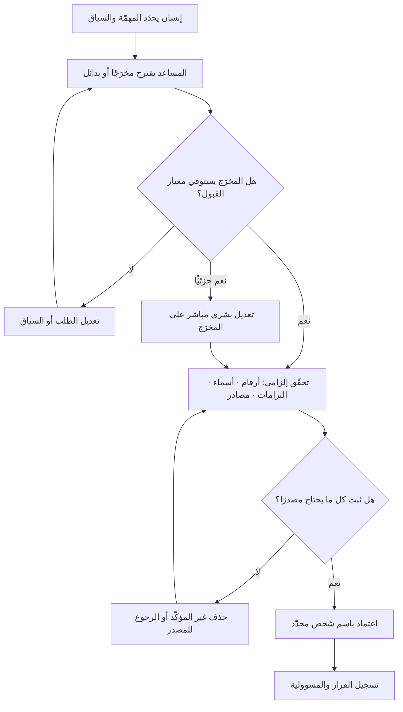

# المساعد الذكي (AI Copilot)

> [!info] تعريف مختصر
> نمط استخدام للذكاء الاصطناعي يعمل **داخل حلقة يملكها الإنسان**: الإنسان يطلب، والنظام يقترح مخرَجًا، والإنسان يقرّر — يقبل أو يعدّل أو يرفض أو يعيد الطلب — ثم يتحمّل هو نتيجة ما اعتمده. المساعد لا يبادر ولا ينفّذ سلسلة خطوات من تلقاء نفسه، ولا يقرّر متى انتهت المهمّة؛ بل يبقى ضمن دورة قصيرة: **طلب ← مخرَج ← قرار بشري**. والاستعارة مقصودة: المساعد في قمرة القيادة يقترح ويحسب ويحذّر، لكن مسؤولية القيادة لا تنتقل إليه. وقيمته الأساسية ليست في «إنجاز العمل بدلًا عنك» بل في **ضغط زمن المسودة الأولى** وتوسيع البدائل المطروحة أمام قرار بشري يظلّ هو الحاسم.

## الشرح العلمي والاحترافي
- **الفارق الفاصل هو ملكية الحلقة لا قدرة النموذج**: قد يعمل المساعد والوكيل على النموذج نفسه تمامًا. ما يفرّق بينهما هو **من يقرّر الخطوة التالية ومتى تنتهي المهمّة**. في المساعد، كل دورة تنتهي عند إنسان، ولا شيء يقع في العالم الخارجي دون فعله. في [[AI Agent|الوكيل]]، النظام يكرّر ويستدعي أدوات ويحدث أثرًا حتى يبلغ هدفه. لذلك فإن سؤال «هل هذا مساعد أم وكيل؟» هو في جوهره سؤال حوكمة: **أين تقع نقطة المسؤولية الأخيرة؟**
- **جدول التمييز الجوهري**:

| المحور | [[AI Copilot\|المساعد الذكي]] | [[AI Agent\|الوكيل الذكي]] |
|---|---|---|
| مالك الحلقة | الإنسان: يطلب ويقرّر في كل دورة | النظام: يقرّر الخطوة التالية بنفسه |
| المُدخل | طلب محدّد أو سياق مباشر | هدف عام يُفكَّك ذاتيًّا |
| عدد الخطوات | دورة قصيرة، غالبًا خطوة واحدة | سلسلة متعدّدة الخطوات متتابعة |
| الأدوات والأثر الخارجي | محدود أو معدوم؛ لا ينفّذ دون الإنسان | يستدعي أدوات ويُحدث أثرًا فعليًّا |
| من ينهي المهمّة | الإنسان حين يرضى عن المخرَج | النظام حين يرى أن الهدف تحقّق |
| تراكم الخطأ | لا يتراكم: كل مخرَج يُفحص فور صدوره | يتراكم عبر الخطوات ويُبنى عليه |
| موضع الإشراف | داخل الحلقة بحكم التصميم | يحتاج نقاط تفتيش مصمَّمة عمدًا |
| الخطر الأساسي | [[Automation Bias\|انحياز الأتمتة]] وقبول ما لا يُفحص | فعل غير قابل للعكس على أساس فاسد |
| قابلية التوسّع | محدودة بسعة الإنسان | عالية، والقيد حوكمي لا تقني |
| المسؤولية عن المخرَج | على من اعتمده — بلا التباس | تحتاج تعريفًا صريحًا مسبقًا |

- **المساعد يقع بطبيعته عند مستوى «إنسان داخل الحلقة»**: هذه ميزته الأمنية الكبرى ولا تحتاج هندسة إضافية — فلا شيء يُنشر أو يُرسل أو يُنفَّذ إلّا بفعل بشري. لكن الميزة قد تكون وهمية إن كان الإنسان يقبل كل شيء آليًّا؛ فالإشراف الشكلي ([[Human in the Loop]]) يُفرغ النمط من قيمته الضابطة تمامًا.
- **قيمته الحقيقية في المسودة الأولى وفي كسر الصفحة البيضاء**: أكبر مكسب مقيس في الاستخدام المؤسّسي للمساعدات هو تقليص زمن الوصول إلى **مسودة قابلة للنقد**. والفارق بين مسودة يراجعها خبير وبين مخرَج نهائي يُعتمد كما هو هو الفارق بين استخدام ناضج وآخر خطر. ومن هنا القاعدة العملية المفيدة: **استخدم المساعد حيث يكون نقد المخرَج أسهل من إنتاجه**. إذا كان التحقّق من صحّة الإجابة أصعب من كتابتها ابتداءً، فالمساعد يزيد العبء ولا ينقصه.
- **يوسّع الخيارات ويغيّر شكل الاجتماعات**: قيمة أقلّ ذكرًا لكنها معتبرة: قدرة المساعد على توليد **بدائل متعدّدة سريعًا** (ثلاث صياغات، ثلاثة سيناريوهات، قائمة مخاطر محتملة) تنقل النقاش من «هل نبدأ من فراغ؟» إلى «أيّ البدائل أفضل ولماذا؟». وهذا يفيد في مقاومة التثبيت على أول فكرة، بشرط ألّا تتحوّل البدائل الآلية إلى وهم بالشمول — فالنظام يقترح ما هو شائع لا ما هو غائب عن المألوف.
- **مخاطره تنظيمية وسلوكية أكثر منها تقنية**: الوكيل يخطئ فيُحدث ضررًا ظاهرًا؛ المساعد يخطئ فيمرّ الخطأ عبر إنسان مطمئنّ. أبرز ثلاثة أخطار: ① **قبول بلا فحص** بفعل [[Automation Bias]]؛ ② **تسريب معلومات** حين تُلصق بيانات حسّاسة أو أسرار عملاء في أداة خارجية دون سياسة، وهو موضوع [[Explicit Policies]] وحوكمة البيانات؛ ③ **تآكل المهارة** حين يفقد الفريق قدرته على الإنتاج والنقد المستقلّ فيصير عاجزًا عن الحكم على ما يقترحه النظام.
- **معيار القبول ما يزال ضروريًّا رغم بساطة النمط**: لأن الفحص هنا يجري في رأس فرد وبسرعة، تكثر التفاوتات بين الأشخاص. الفرق الناضجة تكتب قاعدة صريحة: ما الذي يُقبل بمراجعة سريعة؟ وما الذي يستوجب تحقّقًا من مصدر؟ وما الذي لا يُستخدم فيه المساعد أصلًا (بيانات عملاء، التزامات تعاقدية، أرقام تُقدَّم لجهة خارجية)؟
- **الحدّ الفاصل يتلاشى تدريجيًّا في الأدوات الحديثة**: كثير من الأدوات المسوَّقة بوصفها «Copilot» صارت تنفّذ سلاسل وتستدعي أدوات، فتقع عمليًّا في منطقة الوكلاء. الحكم الصحيح لا يؤخذ من الاسم التجاري بل من ثلاثة أسئلة: هل يبادر بلا طلب؟ هل يستدعي أدوات تُحدث أثرًا؟ هل يقرّر متى ينتهي؟ فإن كان الجواب «نعم» في أيٍّ منها، فالحوكمة المطلوبة حوكمة وكلاء لا مساعدين — بغضّ النظر عن التسمية.
- **اللاحتمية موجودة هنا أيضًا لكن أثرها أخفّ**: نفس الطلب قد يعطي مخرَجًا مختلفًا بين مرّة وأخرى ([[Non-determinism]])، وهذا يربك التوقّعات ويصعّب توحيد المخرجات بين أفراد الفريق. لكنه أقلّ خطرًا من اللاحتمية في الوكلاء، لأن كل مخرَج يمرّ بفحص بشري فوري قبل أن يُبنى عليه شيء.

## أين ومتى يُستخدم
- **في صياغة المستندات والمسودات الأولى**: مسودة [[PRD]] أو [[BRD]] أو [[SOW]] أو خطة تواصل ([[Communication Plan]]) — يكتبها المساعد بسرعة، ويحمل الخبير عبء التصحيح والحذف والحسم.
- **في تفكيك العمل وصياغته**: توليد قصص مستخدم مبدئية، واقتراح تقسيمات ([[Task and Story Slicing]])، وصياغة معايير قبول بأسلوب [[Given When Then]] لتُنقَّح بشريًّا وفق [[INVEST Criteria]].
- **في اكتشاف الحالات المهملة**: استخراج [[Edge Cases]] المحتملة، واقتراح مخاطر أوّلية تُغذّي [[Risk Register]]، وطرح أسئلة ما قبل مراجعة التصميم.
- **في تلخيص المدخلات الكثيفة**: محاضر الاجتماعات، ملاحظات المستخدمين، تقارير الحوادث — بشرط الرجوع إلى المصدر عند أي رقم أو التزام، لا الاكتفاء بالملخّص.
- **في مراجعة الشيفرة والاختبارات**: اقتراح حالات اختبار ونقاط ضعف محتملة كطبقة إضافية لا كبديل عن [[Quality Assurance]] و[[Regression Testing]].
- **حين تكون كلفة الخطأ منخفضة والمراجعة سهلة**: هذا هو المجال الطبيعي للمساعد. وكلّما ارتفع الأثر ارتفعت متطلّبات التحقّق، ولو بقي النمط شكليًّا هو نفسه.

## مثال وسيناريو تطبيقي
> [!example] جهة حكومية في الدمّام تُطلق برنامج تحوّل رقمي فيه 9 مبادرات. مكتب إدارة المشاريع فيه 4 محلّلين، ويستهلك إعداد **وثيقة متطلّبات أعمال** لكل مبادرة نحو 3 أسابيع، معظمها في الصياغة والتنسيق لا في التفكير.
> **الاستخدام الأول (خاطئ):** طلب أحد المحلّلين من المساعد توليد وثيقة متطلّبات كاملة لمبادرة «الخدمات الميدانية»، فأنتج 26 صفحة مصقولة. عُرضت على اللجنة فمرّت، ثم انكشفت في ورشة التصميم ثلاث مشكلات: ذكرت الوثيقة تكاملًا مع نظام لا تملكه الجهة، وافترضت دورة اعتماد من مستويين بينما الواقع ثلاثة، وقدّرت حجم المستخدمين برقم لا مصدر له. كلّف التصحيح 11 يوم عمل ونقاشًا مع جهة أخرى بُني على افتراض خاطئ. **السبب لم يكن ضعف المخرَج بل أن أحدًا لم يعامله كمسودة.**
> **الاستخدام الثاني (منضبط):** أعاد المكتب تعريف طريقة العمل في ثلاث قواعد: ① المساعد يُستخدم لتوليد **الهيكل وقائمة الأسئلة والفجوات**، لا لتوليد محتوى نهائي؛ ② كل رقم أو اسم نظام أو التزام تعاقدي يجب أن يُشار إلى مصدره داخل الوثيقة وإلّا يُحذف؛ ③ لا تُعرض وثيقة على لجنة قبل مرور المحلّل على قائمة فحص من 8 بنود موقّعة باسمه.
> بعد تطبيق ذلك على 6 مبادرات: نزل زمن إعداد الوثيقة من ~3 أسابيع إلى ~8 أيام عمل، وارتفع عدد الأسئلة المطروحة على أصحاب المصلحة قبل الاعتماد من متوسط 12 إلى 30 سؤالًا لكل وثيقة — وهي زيادة مرغوبة لأنها كشفت فجوات مبكرًا بدل اكتشافها في التنفيذ. وسجّل المكتب ملاحظة مهمّة: **المكسب لم يكن في الكتابة بل في إتاحة وقت المحلّل للتحقّق والمقابلات**، أي أن الأداة لم تستبدل التفكير بل أزاحت عنه العمل الكتابي.

## خطوات أو مخطّط
1. حدّد المهام المرشّحة بمعيار واحد: هل نقد المخرَج أسهل من إنتاجه؟ إن كان الجواب لا، فاستبعد المهمّة.
2. اكتب سياسة بيانات صريحة: ما الذي يُسمح بإدخاله في الأداة وما الذي يُمنع منعًا باتًّا.
3. عامل كل مخرَج بوصفه مسودة، وحدّد سلفًا ما الذي يجب التحقّق منه بالضرورة: الأرقام، الأسماء، الالتزامات، المراجع.
4. اطلب بدائل متعدّدة لا خيارًا واحدًا حين يكون القرار تصميميًّا، لتوسيع مساحة النقاش.
5. عرّف معيار قبول مكتوبًا يوحّد حكم أفراد الفريق على المخرجات.
6. سجّل باسم من اعتمد المخرَج؛ فالمسؤولية على المعتمِد لا على الأداة.
7. قِس الأثر بالنتيجة لا بالنشاط: زمن الإنجاز، وإعادة العمل لاحقًا، وجودة القرار — لا عدد المخرجات المولّدة.
8. راجع دوريًّا: أي المهام تستحقّ الترقية إلى وكيل بضوابط؟ وأيها يجب سحبه من الأداة كليًّا؟

## ⚠️ مفاهيم خاطئة شائعة
> [!warning]
> - **«المساعد نسخة أضعف من الوكيل»**: ليس ترتيبًا في القوّة بل **اختلاف في موضع المسؤولية**. في مهام عالية الأثر يكون المساعد هو الخيار الصحيح لا الناقص، لأن الإشراف فيه مضمون بالتصميم.
> - **«ما دام الإنسان يراجع فلا خطر»**: المراجعة تحت ضغط الوقت ومع مخرَج مصقول لغويًّا تتحوّل إلى قبول سريع. الخطر لا يزول بوجود مراجع، بل يقلّ بوجود معيار قبول وتحقّق إلزامي من عناصر بعينها.
> - **الحكم بالاسم التجاري**: أدوات كثيرة تحمل اسم «Copilot» وتنفّذ سلاسل وتستدعي أدوات — فهي عمليًّا وكلاء. احكم بالسلوك: هل يبادر؟ هل يُحدث أثرًا؟ هل يقرّر النهاية؟
> - **«المخرَج المصقول لغويًّا مخرَج صحيح»**: الطلاقة اللغوية ليست دليل دقّة؛ بل هي أحد أسباب تراخي المراجعة. الصياغة الجيّدة تخفي الفجوة المعرفية بدل أن تُظهرها.
> - **«الفائدة تُقاس بعدد ما وُلِّد»**: عدد المستندات أو الأسطر المولّدة مقياس نشاط لا نتيجة، وهو منزلق [[Outcome vs Output]] بعينه. المقياس الصحيح هو أثر مقيس على الزمن أو الجودة أو القرار.
> - **«الاستخدام الفردي لا يحتاج سياسة»**: أخطر التسريبات تحدث في الاستخدام الفردي العفوي — لصق عقد أو بيانات عميل أو مفتاح وصول في أداة خارجية. غياب السياسة ليس حيادًا بل إذنٌ ضمني.

## ❌ ممارسات خاطئة في المشاريع
> [!failure]
> - **الخطأ: اعتماد مخرَج المساعد كوثيقة نهائية دون تحقّق من الأرقام والأسماء.** لماذا يضرّ: يدخل افتراض خاطئ إلى وثيقة معتمَدة فيُبنى عليه تخطيط وميزانية وعقد. الحل: قاعدة صريحة بأن كل رقم أو التزام يحتاج مصدرًا، وما لا مصدر له يُحذف قبل العرض.
> - **الخطأ: إدخال بيانات عملاء أو أسرار تعاقدية دون سياسة مكتوبة.** لماذا يضرّ: تسريب لا يمكن التراجع عنه، ومخاطرة امتثالية مباشرة. الحل: سياسة تصنيف بيانات معلنة ضمن [[Explicit Policies]]، وتدريب قصير إلزامي، وبدائل معتمدة داخليًّا.
> - **الخطأ: استخدام المساعد في مهام يصعب التحقّق من صحّتها.** لماذا يضرّ: يُنتج ثقة زائفة في مجال لا يملك الفريق فيه قدرة على النقد. الحل: اقصر الاستخدام على ما يستطيع الفريق الحكم عليه، أو أضف مصدرًا مرجعيًّا يُقارَن به.
> - **الخطأ: توحيد المخرجات دون توحيد المعيار.** لماذا يضرّ: تتفاوت جودة الوثائق بين الأفراد تفاوتًا يصعب تفسيره، ويفقد المخرَج قابلية المقارنة. الحل: قوالب ومعايير قبول مشتركة على غرار [[Definition of Ready]] و[[Definition of Done]].
> - **الخطأ: إسقاط مرحلة المراجعة الجماعية اعتمادًا على جودة المسودة.** لماذا يضرّ: المراجعة الجماعية تكشف افتراضات لا يراها كاتب واحد مهما كانت مسودته أنيقة. الحل: أبقِ المراجعة، لكن وجّهها إلى الافتراضات والفجوات بدل التدقيق اللغوي.
> - **الخطأ: عدم تسجيل من اعتمد المخرَج.** لماذا يضرّ: عند الخلل تُنسب المسؤولية إلى «الأداة» فلا يتعلّم أحد ولا يُصحَّح إجراء. الحل: اسم معتمِد صريح لكل مخرَج، وتوثيق في [[Decision Log]].
> - **الخطأ: إهمال أثر الاستخدام المكثّف على مهارة الفريق.** لماذا يضرّ: يفقد الفريق تدريجيًّا القدرة على إنتاج المخرَج ونقده، فيصير قبوله للمقترحات اضطراريًّا لا اختياريًّا. الحل: احتفظ بمهام تُنجَز بلا مساعدة، وأدرج نقد المخرجات في المراجعات كمهارة مقصودة.

## 🔗 مصطلحات ومفاهيم ذات صلة
[[AI Agent]] | [[Human in the Loop]] | [[AI Orchestration]] | [[Automation Bias]] | [[Non-determinism]] | [[Definition of Done]] | [[Given When Then]] | [[Explicit Policies]] | [[Decision Log]] | [[Outcome vs Output]] | [[Edge Cases]]
