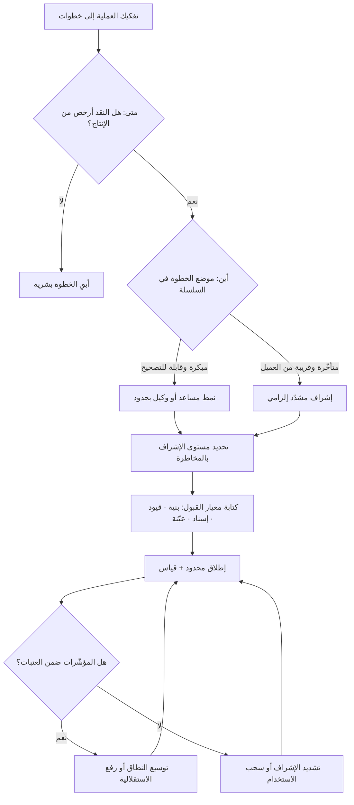

# إدارة الذكاء الاصطناعي (AI Orchestration)

> [!info] تعريف مختصر
> المهارة — والممارسة التنظيمية — التي تجيب عن أربعة أسئلة قبل أي استخدام للذكاء الاصطناعي: **متى** يُستخدم أصلًا ومتى لا يُستخدم، و**أين** يُوضع بالضبط داخل سلسلة العمل، و**بأي مستوى إشراف** بشري يُشغَّل، و**بأي معيار قبول** تُفحص مخرجاته قبل أن يُبنى عليها شيء. جوهرها أن أثر الذكاء الاصطناعي في المؤسّسة لا تحدّده قدرة النموذج بل **تصميم الحلقة المحيطة به**: من يستقبل مخرَجه، وبأي شرط يُقبل، وماذا يحدث حين يخطئ. وهي بهذا المعنى مهارة قيادة وتصميم عمليات أكثر منها مهارة تقنية؛ الشخص الماهر فيها ليس أعرفَ الناس بالنماذج، بل أقدرهم على تفكيك العمل وتحديد أين تُوضع نقاط التحقّق.

## الشرح العلمي والاحترافي
- **الوحدة التي تُدار ليست «الأداة» بل «الخطوة»**: الخطأ التنظيمي الشائع هو طرح السؤال بصيغة «أي أداة نشتري؟» أو «هل نستخدم الذكاء الاصطناعي في قسم خدمة العملاء؟». الصيغة الصحيحة هي تفكيك العملية إلى خطوات مفردة ثم الحكم على كل خطوة على حدة: هذه الخطوة تُترك للبشر، وهذه تُدعم بـ[[AI Copilot|مساعد ذكي]]، وهذه تُفوَّض إلى [[AI Agent|وكيل]] بحدود، وهذه لا تُؤتمت أبدًا. المؤسّسة التي تقرّر على مستوى «القسم» تحصد نتائج متذبذبة لأنها خلطت خطوات متباينة الأثر في قرار واحد.
- **الأسئلة الأربعة بالترتيب — ولا يصحّ القفز عن أوّلها**:
  ① **متى؟** معيار الاختيار العملي: هل نقد المخرَج أرخص من إنتاجه؟ وهل المهمّة متكرّرة بما يبرّر كلفة التصميم والضبط؟ وهل يوجد معيار للصواب أصلًا؟ إن غاب معيار الصواب فما نبنيه ليس أتمتة بل مولّد آراء.
  ② **أين؟** موضع الإدخال داخل السلسلة يحدّد كلفة الخطأ. وضع الذكاء الاصطناعي **مبكرًا** (توليد مسودات وفرضيات) رخيص التصحيح، ووضعه **متأخّرًا** (عند نقطة الإصدار أو التواصل مع العميل) مكلف لأن ما بعده لا يمرّ بفحص. القاعدة: كلّما تأخّر الموضع في السلسلة، ارتفع مستوى الإشراف المطلوب.
  ③ **بأي مستوى إشراف؟** وهو التمييز الثلاثي: داخل الحلقة / فوق الحلقة / خارجها ([[Human in the Loop]])، ويُختار بدلالة جسامة الأثر وقابلية العكس وقابلية اكتشاف الخطأ — لا بدلالة انبهار الفريق بجودة النموذج.
  ④ **بأي معيار قبول؟** وهو أكثر الأسئلة إهمالًا وأشدّها أثرًا. بلا معيار مكتوب يصير القبول ذوقًا فرديًّا متقلّبًا، ويستحيل قياس التحسّن أو تدريب موظّف جديد أو تدقيق ما جرى.
- **معيار القبول للمخرجات الذكية يختلف عن معيار القبول التقليدي**: لأن السلوك غير حتمي ([[Non-determinism]])، لا يصحّ أن يكون المعيار «يطابق الناتج المرجعي». المعايير العملية المستخدمة أربعة أنواع مجتمعة: **معيار بنيوي** (هل المخرَج بالشكل والحقول المطلوبة؟ يُفحص آليًّا)، و**معيار قيود** (هل التزم بالسقوف: التكلفة، النطاق، الصلاحيات، المحظورات؟ يُفحص آليًّا)، و**معيار إسناد** (هل كل ادّعاء أو رقم مرتبط بمصدر يمكن التحقّق منه؟)، و**معيار حكم بشري بعيّنة** (تقييم جودة على مقياس محدّد لعيّنة تُسحب دوريًّا). الاعتماد على النوع الأخير وحده لا يتوسّع، والاعتماد على الأولين وحدهما يمرّر مخرجات صحيحة الشكل فاسدة المضمون.
- **الإشراف مورد له سعة، وتصميم الإدارة هو توزيع هذه السعة**: سعة المراجعة البشرية محدودة ([[Capacity]])، وتوزيعها بالتساوي على كل المخرجات هو أسوأ توزيع ممكن — لأنه يهدرها على الروتيني ويجعلها ضحلة في الخطر. المنطق الصحيح **توجيه بالمخاطرة**: مراجعة كاملة لعالي الأثر ومنخفض الثقة، وعيّنة إحصائية لبقيّة الحالات، وأتمتة كاملة لما هو منخفض الأثر سريع العكس — وهو منطق [[Risk-Based Testing]] نفسه منقولًا إلى الإشراف.
- **الفشل الشائع ليس في النموذج بل في نقاط التسليم**: حين تُدخل المؤسّسة الذكاء الاصطناعي في خطوة واحدة دون إعادة تصميم ما قبلها وما بعدها، ينتج غالبًا **إزاحة للعمل لا إلغاء له**: تنخفض ساعات الكتابة وترتفع ساعات المراجعة والتصحيح، فيبدو التحسّن في مؤشّر محلّي بينما الزمن الكلّي للعملية ثابت أو أسوأ. لذلك يجب أن يُقاس الأثر على **الزمن من الطلب إلى القيمة** ([[Lead Time]] و[[Time to Value]]) لا على سرعة الخطوة المؤتمتة وحدها.
- **الإدارة تشمل قرار الامتناع**: جزء أصيل من هذه المهارة هو تحديد **قائمة استخدامات ممنوعة** صراحةً: قرارات تمسّ الأفراد مباشرة، والتزامات تعاقدية أو مالية نهائية، ومخرجات تُقدَّم لجهة تنظيمية، والحالات التي تُدخَل فيها بيانات محظورة. غياب قائمة الممنوع يعني أن كل شيء مسموح ضمنًا حتى يقع الحادث الأول.
- **البنية التنظيمية الداعمة ثلاثية**: ① **سياسات مكتوبة** تحدّد المسموح والممنوع ومستويات الإشراف ([[Explicit Policies]] و[[Guard Rails]])؛ ② **ملكية معلنة** لكل عملية مؤتمتة — شخص مسمّى يملك المخرجات ويتحمّل التبعة، لا «الفريق» على وجه العموم؛ ③ **حلقة تعلّم** تجمع الأخطاء المرصودة وتحوّلها إلى تحسين في الفحوص أو التوصيف أو مستوى الإشراف عبر [[Root Cause Analysis]] وتغذية راجعة منتظمة ([[Feedback Loop]]).
- **الإدارة الجيّدة تجعل الاستقلالية مكتسبة بالأدلّة**: النمط الناضج ليس قرارًا واحدًا دائمًا، بل **مسار تدرّج**: يبدأ الاستخدام بإشراف مشدّد ونطاق ضيّق ([[Pilot Launch]])، ويُرفع القيد تدريجيًّا لفئات محدّدة كلّما أثبتت البيانات استقرار الأداء دون عتبة إنذار، مع إبقاء مسار عودة فوري إلى المستوى الأشدّ. أي أن الاستقلالية **تُمنح بالقياس وتُسحب بالقياس**.
- **مقاييس الإدارة تختلف عن مقاييس النموذج**: مؤشّرات مثل «دقّة النموذج» لا تكفي إداريًّا. المؤشّرات المفيدة تشغيليًّا: **معدّل التدخّل البشري** (نسبة الحالات التي عُدّلت أو رُفضت)، و**نسبة إعادة العمل** ([[Rework Percentage]])، و**الخطأ المتسرّب إلى ما بعد المراجعة** ([[Escaped Defect Rate]])، و**زمن الدورة الكلّي** ([[Cycle Time]])، و**كلفة الوحدة المنجَزة**. وانخفاض معدّل التدخّل البشري إلى صفر ليس نجاحًا تلقائيًّا — قد يكون أول أعراض [[Automation Bias]].

## أين ومتى يُستخدم
- **عند إدخال الذكاء الاصطناعي إلى عملية قائمة**: قبل اختيار الأداة، تُفكَّك العملية وتُحدَّد الخطوات المرشّحة ومستوى الإشراف لكل منها، ويُوثَّق ذلك في [[SOP]].
- **في الحوكمة وسياسات الاستخدام المؤسّسي**: صياغة المسموح والممنوع وحدود البيانات وصلاحيات الأنظمة، ضمن [[Governance]] و[[Explicit Policies]].
- **في تصميم معايير القبول وضبط الجودة**: مواءمة [[Definition of Done]] وأساليب الفحص مع طبيعة المخرجات غير الحتمية، وربطها بـ[[Quality Assurance]].
- **في التخطيط والتقدير**: لأن إدخال الأتمتة يغيّر توزيع الجهد بين الإنتاج والمراجعة، ويؤثّر على [[Capacity]] و[[Estimation Variance]].
- **في إدارة المخاطر**: تسجيل مخاطر الأتمتة ونقاط الفشل والاعتماد على مزوّد خارجي ([[Vendor Lock-in]]) ضمن [[Risk Register]].
- **في تدرّج التبنّي**: من تجربة محدودة ([[Pilot Launch]]) إلى توسّع مضبوط بمعايير خروج واضحة وقرار [[Go or No-Go Decision]] في كل مرحلة.

## مثال وسيناريو تطبيقي
> [!example] بنك متوسّط الحجم في الخليج يعالج **طلبات دعم العملاء عبر القنوات المكتوبة**: 3,400 رسالة يوميًّا، 22 موظّفًا، متوسط زمن الاستجابة 6 ساعات.
> **القرار الأول (خاطئ):** «سنُدخل الذكاء الاصطناعي في خدمة العملاء» — فأُطلق ردّ آلي كامل على كل الرسائل. بعد 3 أسابيع: انخفض زمن الاستجابة إلى دقائق، لكن ارتفعت إعادة فتح التذاكر ([[Reopen]]) من 8% إلى 27%، وظهرت 4 شكاوى رسمية بسبب معلومات خاطئة عن رسوم. المشكلة لم تكن في جودة الردود عمومًا، بل في أن **كل الرسائل عوملت معاملة واحدة**: سؤال عن ساعات العمل عومل كسؤال عن قسط قرض.
> **إعادة التصميم بمنطق الإدارة:** فكّك الفريق العملية إلى أربع خطوات (فرز → استخراج بيانات الحساب → صياغة الرد → إرسال)، وصنّف الرسائل إلى ثلاث فئات:
> ① **معلوماتية عامّة** (~46%): وكيل يردّ آليًّا، بإشراف **فوق الحلقة**، ومعيار قبول آلي يمنع أي ردّ يذكر رقمًا ماليًّا أو التزامًا زمنيًّا، مع مراجعة عيّنة 5% أسبوعيًّا.
> ② **متعلّقة بحساب العميل** (~39%): **مساعد** يصوغ مسودة الرد ويعرض المصدر داخل النظام، والموظّف يعتمد أو يعدّل — إشراف **داخل الحلقة** إلزاميًّا، ولا يملك النظام صلاحية الإرسال.
> ③ **شكاوى ونزاعات ورسوم متنازع عليها** (~15%): **لا يُستخدم فيها توليد آلي للردّ إطلاقًا**؛ الذكاء الاصطناعي يُستخدم فقط في التلخيص وتجميع سجلّ العميل للموظّف.
> وأُضيفت قائمة ممنوعات صريحة: لا وعود زمنية، لا أرقام رسوم من التوليد، لا إشارة إلى منتج غير مفعّل للعميل.
> **النتيجة بعد ربعين:** متوسط زمن الاستجابة 41 دقيقة، وإعادة فتح التذاكر 6% (أقل من خط الأساس اليدوي)، ومعدّل تعديل الموظّفين لمسودات الفئة الثانية 23% — وهو رقم راقبه الفريق عمدًا: لو نزل قرب الصفر لاعتبروه إنذار إشراف شكلي لا دليل نضج. **الخلاصة: لم يتغيّر النموذج بين المحاولتين؛ تغيّر التصنيف، وموضع الإدخال، ومستوى الإشراف، ومعيار القبول.**

## خطوات أو مخطّط
1. فكّك العملية إلى خطوات مفردة، وارسم من يستلم مخرَج كل خطوة.
2. لكل خطوة، احكم بالاستحقاق: هل نقد المخرَج أرخص من إنتاجه؟ هل يوجد معيار صواب؟ هل التكرار يبرّر الكلفة؟
3. حدّد لكل خطوة مرشّحة **النمط**: مساعد بشري، أم وكيل محدود، أم أتمتة كاملة، أم لا شيء.
4. صنّف بالمخاطرة: جسامة الأثر × قابلية العكس × قابلية اكتشاف الخطأ، واختر مستوى الإشراف على أساسها.
5. اكتب معيار القبول بأنواعه الأربعة: بنيوي، قيود، إسناد، حكم بشري بعيّنة.
6. اكتب قائمة الممنوعات صراحةً — الاستخدامات والبيانات والقرارات التي لا تُمرّر عبر النظام.
7. عيّن مالكًا مسمّى لكل عملية مؤتمتة، ووثّق من ينفّذ ومن يوافق ومن يتحمّل التبعة.
8. أطلق على نطاق ضيّق أولًا، وقِس: معدّل التدخّل، إعادة العمل، الخطأ المتسرّب، زمن الدورة الكلّي، الكلفة.
9. راجع دوريًّا وعدّل مستوى الإشراف صعودًا أو نزولًا بالأدلّة، مع مسار عودة فوري ومفتاح إيقاف مختبَر.

## ⚠️ مفاهيم خاطئة شائعة
> [!warning]
> - **«الإدارة مسألة اختيار الأداة المناسبة»**: الأداة أصغر عناصر المعادلة وأسرعها تغيّرًا. القيمة الباقية في تفكيك العملية ومعايير القبول ومستويات الإشراف — وهذه تصمد حتى لو تبدّلت الأدوات كلّها.
> - **«هذه مهارة تقنية تخصّ فريق التقنية»**: من يحدّد أثر الخطأ وقابلية العكس ومعيار القبول هو مالك العملية، لا المهندس. حصر الإدارة في الفريق التقني يُنتج أتمتة صحيحة تقنيًّا وخاطئة تنظيميًّا.
> - **«كلّما زاد الاستخدام زاد النضج»**: الاستخدام الواسع بلا معايير قبول ينتج تباينًا وإعادة عمل. النضج يُقاس بجودة التصميم حول النموذج لا بحجم الاستهلاك.
> - **الخلط بين تسريع خطوة وتسريع عملية**: تسريع الكتابة مع مضاعفة المراجعة قد يترك [[Lead Time]] الكلّي كما هو أو أسوأ. القياس الصحيح على مستوى السلسلة كاملة.
> - **«معيار القبول يُكتب لاحقًا بعد أن نجرّب»**: تأجيله يعني أن أول القرارات تُتّخذ بلا مرجع، ثم يُكتب المعيار بأثر رجعي ليطابق ما جرى. اكتبه قبل الإطلاق ولو مبدئيًّا.
> - **«صفر تدخّل بشري = نضج»**: قد يكون العكس تمامًا: مؤشّر على أن المراجعة صارت شكلية بفعل [[Automation Bias]]. راقب معدّل التدخّل بوصفه إشارة صحّة لا إشارة تكلفة.
> - **«ما دام النموذج تحسّن فالحوكمة يمكن تخفيفها»**: تحسّن النموذج يغيّر توزيع الخطأ لا يلغيه، وقد يجعل الخطأ النادر أشدّ خفاءً وأصعب اكتشافًا.

## ❌ ممارسات خاطئة في المشاريع
> [!failure]
> - **الخطأ: القرار على مستوى القسم بدل مستوى الخطوة.** لماذا يضرّ: يخلط حالات متباينة الأثر في معاملة واحدة، فتُعامَل الشكوى الحسّاسة كسؤال روتيني. الحل: صنّف الحالات وصمّم مسارًا لكل فئة.
> - **الخطأ: الإطلاق بلا معيار قبول مكتوب.** لماذا يضرّ: يتفاوت الحكم بين الأفراد، ويستحيل قياس التحسّن أو تدقيق ما حدث. الحل: معيار مكتوب يجمع الفحص الآلي والإسناد وحكم العيّنة.
> - **الخطأ: غياب مالك مسمّى للعملية المؤتمتة.** لماذا يضرّ: عند الخلل تتوزّع المسؤولية فلا يُصحَّح شيء وتتكرّر الحادثة. الحل: مالك واحد معلن، وتوثيق التبعة في [[Decision Log]] و[[RAID Log]].
> - **الخطأ: قياس النجاح بمؤشّر محلّي (سرعة الخطوة المؤتمتة).** لماذا يضرّ: يخفي انتقال العبء إلى المراجعة والتصحيح ويُنتج نجاحًا ورقيًّا. الحل: قِس [[Cycle Time]] و[[Lead Time]] وإعادة العمل والخطأ المتسرّب.
> - **الخطأ: توزيع سعة الإشراف بالتساوي على كل المخرجات.** لماذا يضرّ: يهدرها على الروتيني ويجعلها ضحلة عند الخطر. الحل: وجّه الإشراف بالمخاطرة، وراجع عيّنات لا كل شيء.
> - **الخطأ: عدم كتابة قائمة الممنوعات.** لماذا يضرّ: كل شيء مسموح ضمنًا حتى تقع الحادثة الأولى، ثم يُمنع كل شيء بردّ فعل. الحل: قائمة ممنوعات صريحة ومحدّثة ضمن [[Guard Rails]].
> - **الخطأ: عدم وجود مفتاح إيقاف مختبَر ومسار عودة.** لماذا يضرّ: عند اكتشاف خلل نمطي تستمرّ الأخطاء ساعات لأن أحدًا لا يعرف كيف يوقف المسار. الحل: عرّف الإيقاف والمخوَّل به، واختبره دوريًّا كما يُختبر [[Rollback]].
> - **الخطأ: معاملة التبنّي كمشروع تقني بلا إدارة تغيير.** لماذا يضرّ: يقاوم الفريق الأداة أو يستخدمها بطرق غير مقصودة، فتنهار الضوابط عمليًّا. الحل: أدرج التدريب والتواصل وتعديل الأدوار ضمن الخطة على غرار [[ADKAR Model]].

## 🔗 مصطلحات ومفاهيم ذات صلة
[[Human in the Loop]] | [[AI Agent]] | [[AI Copilot]] | [[Automation Bias]] | [[Non-determinism]] | [[Governance]] | [[Explicit Policies]] | [[Guard Rails]] | [[Definition of Done]] | [[Risk-Based Testing]] | [[Lead Time]] | [[Pilot Launch]]
