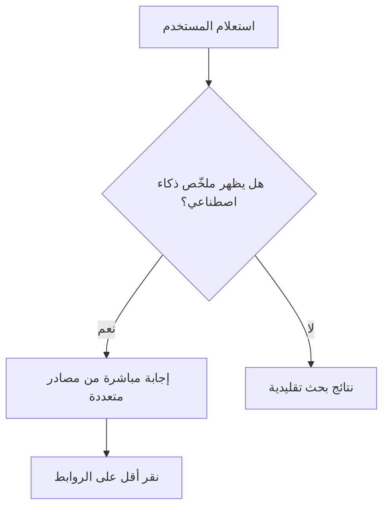

# ملخّصات الذكاء الاصطناعي في نتائج البحث (AI Overviews)
> [!info] تعريف مختصر
> ميزة في محرّك بحث Google تعرض ملخّصًا يُنشئه الذكاء الاصطناعي في أعلى نتائج البحث، يجيب مباشرة على سؤال المستخدم مستندًا إلى عدّة مصادر ويب، قبل أن يصل المستخدم إلى الروابط التقليدية.

## الشرح العلمي والاحترافي
- تعتمد ملخّصات الذكاء الاصطناعي (المعروفة سابقًا باسم SGE - Search Generative Experience) على نماذج لغوية كبيرة تجمع معلومات من عدّة صفحات ويب وتصوغها في إجابة موحّدة مباشرة داخل صفحة نتائج البحث.
- تُغيّر هذه الميزة سلوك المستخدم بشكل جذري: كثير من المستخدمين يحصلون على إجابتهم من الملخّص مباشرة دون النقر على أي رابط، وهو ما يُعرف بظاهرة "البحث بلا نقرات" (Zero-Click Search).
- من منظور إدارة المشاريع الرقمية، هذا يعني أن قياس النجاح لم يعد يعتمد فقط على عدد الزيارات (Traffic)، بل أيضًا على الظهور داخل هذه الملخصات (AI Visibility) كمقياس أداء جديد.
- لكي يُقتبس المحتوى داخل هذه الملخصات، يجب أن يكون واضحًا وبنيويًا (Structured)، ويجيب مباشرة على الأسئلة الشائعة، ويحمل بيانات وشواهد يمكن التحقق منها.
- هذا المفهوم مرتبط بشكل وثيق بتحسين الظهور التوليدي (GEO - Generative Engine Optimization)، وهو التطوّر الطبيعي لتحسين محركات البحث التقليدي (SEO).

## أين ومتى يُستخدم
- في مشاريع استراتيجية المحتوى الرقمي، عند تخطيط كيفية كتابة المقالات لتُقتبس داخل ملخّصات الذكاء الاصطناعي.
- في تقارير أداء فرق التسويق الرقمي، كمقياس جديد إلى جانب الترتيب التقليدي (Ranking) ونسبة النقر (CTR).
- عند إعادة تقييم استراتيجية SEO لمشروع قائم بسبب انخفاض حركة الزيارات الناتج عن انتشار هذه الميزة.
- في اجتماعات تخطيط خارطة الطريق (Roadmap) لفرق المحتوى والمنتج التي تعتمد على الزيارات العضوية كمصدر رئيسي للعملاء.

## مثال وسيناريو تطبيقي
> [!example] سيناريو ملموس
> فريق تسويق شركة "دِلتا سوفت" يلاحظ خلال الربع الثاني انخفاضًا في زيارات المدونة بنسبة 25% رغم ثبات الترتيب في نتائج البحث. عند التحقيق، يكتشفون أن Google أصبح يعرض ملخّص ذكاء اصطناعي يجيب مباشرة على استعلامات مثل "ما هي منهجية سكرم؟" باستخدام محتوى الفريق كأحد المصادر، لكن دون أن ينقر المستخدمون على الرابط. يقرر مدير المشروع تعديل استراتيجية المحتوى: إعادة كتابة الفقرات الافتتاحية لتكون إجابات مباشرة وواضحة (لزيادة فرصة الاقتباس والظهور كمصدر)، مع إضافة دعوات أقوى لاتخاذ إجراء (Call to Action) داخل الملخص نفسه، وقياس مقياس جديد اسمه "معدل الظهور في الملخصات" شهريًا.

## خطوات أو مخطّط
1. تحليل الاستعلامات التي تُظهر ملخّصات ذكاء اصطناعي في مجال المشروع.
2. إعادة هيكلة المحتوى بإجابات مباشرة وواضحة في بداية كل قسم.
3. إضافة بيانات منظّمة (Structured Data / Schema) لتسهيل استخراج المعلومة.
4. قياس ظهور المحتوى داخل الملخّصات ومقارنته بحركة الزيارات التقليدية.
5. تعديل خطة المحتوى بناءً على النتائج (تحسين الأسئلة الشائعة، تحديث البيانات).

## ⚠️ مفاهيم خاطئة شائعة
> [!warning]
> - الاعتقاد بأن ملخّصات الذكاء الاصطناعي تعني نهاية أهمية المحتوى الجيد؛ في الحقيقة أهمية الجودة والدقة ازدادت لأن الاقتباس يعتمد على مصداقية المصدر.
> - الخلط بين هذه الميزة ونتائج الإعلانات المدفوعة؛ الملخصات مبنية على محتوى عضوي وليست مساحة إعلانية.
> - الظن بأن الظهور في الملخص يضمن زيارات؛ في الغالب يقلّل النقرات لكنه يبني الوعي بالعلامة التجارية (Brand Awareness).

## ❌ ممارسات خاطئة في المشاريع
> [!failure]
> - الاستمرار في قياس نجاح المحتوى بعدد الزيارات فقط دون احتساب الظهور داخل الملخصات. الحل: إضافة مؤشرات أداء (KPI) جديدة تقيس الظهور والاقتباس.
> - كتابة محتوى غامض أو مطوّل دون إجابة مباشرة، مما يقلّل فرصة الاقتباس. الحل: تنظيم المحتوى بإجابات موجزة وواضحة في بداية كل فقرة.
> - إهمال البيانات المنظّمة (Schema Markup) التي تساعد الذكاء الاصطناعي على فهم المحتوى بدقة. الحل: تضمين البيانات المنظّمة ضمن قائمة تحقق النشر (Publishing Checklist).

## 🔗 مصطلحات ومفاهيم ذات صلة
[[GEO]] | [[Hub and Spoke Content Model]] | [[YMYL]] | [[KPI]] | [[NPS]] | [[21 - Stakeholder Communication]]
