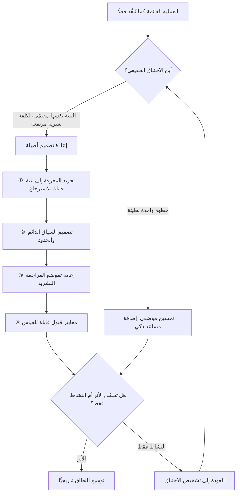

# أصيل الذكاء الاصطناعي (AI-Native)

> [!info] تعريف مختصر
> وصف لمنتج أو فريق أو مؤسّسة صُمّمت بنيتها **من نقطة الصفر** على افتراض أن النموذج اللغوي والوكيل الذكي عنصر أساسي في تركيبة العمل، لا إضافة تُركَّب لاحقًا على عملية بشرية قائمة. الفارق ليس في نسبة استخدام الذكاء الاصطناعي، بل في **مَن يُصمَّم النظام حوله**: في النظام الأصيل تُعاد كتابة توزيع الأدوار، وشكل المخرجات، ومواضع المراجعة البشرية، ومقاييس النجاح، بحيث تفترض وجود قدرة احتمالية سريعة ورخيصة نسبيًّا لكنها غير مضمونة. أمّا «إضافة AI إلى عملية قائمة» فتُبقي البنية القديمة كما هي وتستبدل خطوة أو خطوتين داخلها — فتحصد تسريعًا موضعيًّا محدودًا، وغالبًا تُنشئ اختناقًا جديدًا عند نقطة المراجعة البشرية التي لم يُعَد تصميمها.

## الشرح العلمي والاحترافي
- **الأصل الاصطلاحي — قياسًا على "Cloud-Native"**: انتقل اللاحق `-Native` إلى أدبيات الذكاء الاصطناعي من مصطلح **Cloud-Native** الذي شاع في منتصف عقد 2010 مع صعود الحاويات والخدمات المصغّرة. وقد كان التمييز هناك مطابقًا في منطقه: تطبيق «مرحَّل إلى السحابة» (Lift and Shift) يعمل على خوادم سحابية لكنه يحتفظ ببنية أحادية تفترض خادمًا ثابتًا وحالة محلّية، فلا يجني مرونة التوسّع ولا التعافي التلقائي؛ بينما التطبيق «الأصيل سحابيًّا» يُبنى على افتراض أن الخادم قابل للاستبدال في أي لحظة. النقل المفاهيمي هنا مقصود: **AI-Native تعني إعادة بناء الافتراضات، لا تغيير مكان التشغيل**.
- **الفارق البنيوي: أين تقع الكلفة الحدّية؟** في العملية التقليدية، الكلفة الحدّية لإنتاج نسخة إضافية من مخرَج معرفي (تقرير، مسودّة عقد، تصميم بديل، ترجمة) مرتفعة لأنها كلفة وقت بشري. في النظام الأصيل تنخفض هذه الكلفة انخفاضًا حادًّا، فتتغيّر معها قرارات التصميم نفسها: يصبح من المعقول توليد خمسة بدائل بدل بديل واحد، واختبار فرضيات كان اختبارها سابقًا مكلفًا، وإعادة الإنتاج بدل الترقيع. الفرق الأصيلة تعيد بناء عملياتها حول هذا الانخفاض، أما الفرق المضيفة للـ AI فتُبقي عمليات مصمَّمة لعالم الكلفة المرتفعة.
- **إعادة توزيع الدور البشري من التنفيذ إلى المواصفة والحكم**: حين ينتقل جزء من التنفيذ إلى النموذج، تنتقل القيمة البشرية إلى ثلاثة مواضع: **تحديد المشكلة بدقّة** (وهو ما يجعل [[Problem Statement]] وثيقة حرجة لا شكلية)، و**تصميم السياق والمعايير** التي يعمل ضمنها النموذج، و**الحكم على المخرَج** وتحمّل مسؤوليته. الفريق الأصيل يكتب توصيفات الأدوار على هذا الأساس، لا على أساس عدد ساعات التنفيذ.
- **التصميم للاحتمالية لا للحتمية**: البرمجيات التقليدية حتمية — المدخل نفسه يعطي المخرج نفسه. النموذج اللغوي ليس كذلك ([[Non-determinism]])، وقد يُنتج مخرجًا واثق النبرة وخاطئ المضمون ([[Hallucination]]). النظام الأصيل يعالج هذا بنيويًّا: طبقة تحقّق آلي، ومعايير قبول قابلة للقياس ([[Evals]])، وحدود صريحة لما يُسمح للنموذج بفعله ([[Guard Rails]])، ومواضع محدّدة سلفًا لتدخّل الإنسان ([[Human in the Loop]]). الأنظمة المضيفة تكتفي غالبًا بـ«راجعوا المخرَج قبل الإرسال»، وهي سياسة تنهار عند الحجم.
- **المعرفة بوصفها بنية تحتية لا أرشيفًا**: النظام الأصيل يفترض أن الوكيل سيحتاج إلى معرفة المؤسّسة ليعمل، فيجعل هذه المعرفة **مكتوبة ومهيكلة وقابلة للاسترجاع** بدل بقائها في رؤوس الأفراد ورسائلهم. لذلك ترتبط الأصالة ارتباطًا وثيقًا بـ[[Knowledge Management]] وبـ[[Context Engineering]] وبأنماط الاسترجاع مثل [[Retrieval-Augmented Generation]] وبروتوكولات ربط الأدوات مثل [[MCP]]. مؤسّسة لا تملك [[Single Source of Truth]] لا يمكنها أن تكون أصيلة مهما اشترت من نماذج.
- **مقاييس النجاح تتغيّر**: حين ينخفض ثمن إنتاج المخرجات، يفقد قياس «الإنتاج» معناه تمامًا، ويصبح قياس **الأثر** هو المعيار الوحيد المعقول ([[Outcome vs Output]]). مؤسّسة تقيس نجاح تبنّيها للذكاء الاصطناعي بعدد الرسائل المُولَّدة أو أسطر الكود المكتوبة تكون قد بنت [[Feature Factory]] أسرع فحسب. المقاييس الأصيلة تنظر إلى زمن الوصول إلى القيمة ([[Time to Value]])، ونسبة إعادة العمل ([[Rework Percentage]])، وكلفة الاستدلال مقابل العائد ([[Inference Cost]]).
- **الأصالة طيف لا ثنائية، وليست دائمًا الخيار الصحيح**: من الخطأ تقديم المصطلح كوسام أخلاقي. إعادة بناء عملية ناضجة ومستقرّة ومحكومة تنظيميًّا قد تكون أعلى كلفة ومخاطرة من إدخال تحسينات موضعية. المعيار العملي هو: **هل المشكلة الأساسية في سرعة خطوة بعينها، أم في بنية العملية كلها؟** الأولى تُعالَج بالإضافة، والثانية وحدها تستدعي الأصالة. وهذا سؤال [[Systems Thinking]] بامتياز.

## أين ومتى يُستخدم
- **عند تأسيس فريق أو خط منتج جديد**: حيث لا توجد عملية موروثة يجب حمايتها، فتكون كلفة التصميم الأصيل أدنى ما يمكن. هنا تُكتب [[Product Principles]] و[[Team Working Agreement]] منذ اليوم الأول على افتراض وجود الوكلاء.
- **في تقييم مبادرات التحوّل الذكي داخل المؤسّسة**: كأداة تشخيص تفصل بين مبادرة ستُنتج تسريعًا موضعيًّا ومبادرة ستغيّر بنية القيمة — وهو تمييز يحسم كثيرًا من نقاشات [[Business Case]] و[[Steering Committee]].
- **في رسم خرائط تدفّق القيمة**: عند إعادة تصميم [[Value Stream]] بمنهج [[Value Stream Mapping]]، يكشف السؤال الأصيل أن كثيرًا من الخطوات كانت موجودة فقط لأن الكلفة البشرية للتنفيذ كانت مرتفعة — فتسقط الخطوة لا تُسرَّع.
- **في تحديد شكل التنسيق بين الوكلاء**: النظام الأصيل يحتاج إلى تصميم واعٍ لـ[[AI Orchestration]] وتحديد أي المهام يؤدّيها [[AI Agent]] مستقلًّا وأيّها يبقى في نمط [[AI Copilot]] المساعد.
- **في قرارات التوظيف وبناء القدرات**: يغيّر التصنيف الأصيل شكل الفريق المتعدّد التخصّصات ([[Cross-functional Team]])، فيُدخل أدوارًا مثل مهندس المعرفة ومصمّم السياق، ويعيد تعريف نسبة المنفّذين إلى المراجعين.
- **في حوكمة المخاطر والامتثال**: لأن الأصالة تنقل قرارات كانت بشرية إلى نظام احتمالي، فتستدعي تحديثًا صريحًا لـ[[Governance]] و[[RAID Log]] وسياسات معالجة البيانات مثل [[Controller vs Processor]].

## مثال وسيناريو تطبيقي
> [!example] شركة خدمات قانونية في الرياض تُعدّ مذكّرات تعاقدية لعملاء تجاريين. العملية القائمة: يستقبل منسّق الطلب نموذجًا من العميل، ثم يُسند إلى محامٍ مبتدئ يبحث في أرشيف العقود السابقة (مجلّد مشترك فيه أكثر من 6,000 ملف) ويُعدّ مسودّة، ثم يراجعها محامٍ أول، ثم تعود للتنقيح. متوسّط زمن الدورة 9 أيام عمل، وطاقة الفريق 40 مذكّرة شهريًّا، ونسبة إعادة العمل بعد المراجعة الأولى 45%.
> **المحاولة الأولى — إضافة AI إلى العملية القائمة**: زُوّد المحامون المبتدئون باشتراك مساعد ذكي عام يكتبون فيه ما يريدون. انخفض زمن كتابة المسودّة من يومين إلى ساعتين — لكن زمن الدورة الكلّي نزل من 9 أيام إلى 8 فقط. السبب أن الاختناق لم يكن في الكتابة أصلًا، بل في طابور مراجعة المحامي الأول؛ بل إن نسبة إعادة العمل ارتفعت إلى 58% لأن المسودّات صارت أطول وأكثر لمعانًا لغويًّا وأقل التزامًا بصيغ الشركة المعتمدة، فصار على المراجع أن يقرأ أكثر ليكتشف انحرافًا أخفى.
> **إعادة التصميم الأصيلة**: أعاد الفريق بناء العملية حول ثلاثة قرارات. الأول: تحويل أرشيف العقود من ملفات نصّية إلى مكتبة بنود مهيكلة، كل بند فيها موصوف بغرضه وشروط استخدامه والصيغ الممنوعة — أي بناء طبقة معرفة قابلة للاسترجاع بدل أرشيف قابل للقراءة. الثاني: كتابة سياق دائم للنظام يتضمّن سياسة الصياغة المعتمدة وقائمة ما لا يجوز الالتزام به نيابةً عن العميل. الثالث — وهو الحاسم: نقل المراجعة البشرية من «قراءة المسودّة كاملة» إلى **مراجعة قائمة الانحرافات فقط**؛ إذ يُلزَم النظام بأن يُخرج مع كل مسودّة جدولًا يبيّن أي بند خرج عن المكتبة المعتمدة ولماذا.
> **بعد ربعين**: زمن الدورة 2.5 يوم عمل، الطاقة 130 مذكّرة شهريًّا بنفس عدد الأفراد، إعادة العمل بعد المراجعة الأولى 12%. والتغيّر الأهم أنه لم يكن في سرعة الكتابة، بل في **إلغاء خطوة البحث في الأرشيف كليًّا وإعادة تصميم خطوة المراجعة**. تحوّل دور المحامي المبتدئ من كاتب مسودّات إلى مسؤول عن صيانة مكتبة البنود — وهي وظيفة لم تكن موجودة في التنظيم قبل عام.

## خطوات أو مخطّط
1. ارسم العملية الحالية كما هي فعلًا لا كما هي موثّقة، وحدّد لكل خطوة: ما الذي يدخلها، وما الذي يخرج منها، ولماذا وُجدت أصلًا.
2. اسأل عن كل خطوة سؤال الأصالة: هل وُجدت هذه الخطوة لأن التنفيذ البشري كان مكلفًا؟ إن كان الجواب نعم، فهي مرشّحة للحذف لا للتسريع.
3. حدّد الاختناق الحقيقي بمنهج [[Theory of Constraints]] قبل أي استثمار — فتسريع خطوة قبل الاختناق يزيد المخزون ولا يزيد [[Throughput]].
4. جرِّد المعرفة الضمنية إلى معرفة مكتوبة ومهيكلة قابلة للاسترجاع، وحدّد مالكًا لصيانتها.
5. صمّم السياق الدائم والحدود: ما الذي يعرفه النظام دائمًا؟ وما الممنوع عليه؟ وما الذي يجب أن يعترف بجهله به؟
6. أعد تصميم موضع الإنسان: لا «راجِع كل شيء»، بل نقطة قرار محدّدة يراجع فيها الإنسان ما يستحق المراجعة، بمعايير مكتوبة.
7. ضع معايير قبول قابلة للقياس واختبرها على حالات حقيقية سابقة معروفة النتيجة قبل التشغيل.
8. اختر مقاييس أثر لا مقاييس نشاط، وارصد خط الأساس ([[Baseline]]) قبل التغيير حتى يكون القياس ذا معنى.
9. شغّل على نطاق محدود ([[Pilot Launch]])، وراقب ما ينهار عند الحجم لا عند العيّنة.

## ⚠️ مفاهيم خاطئة شائعة
> [!warning]
> - **الخلط بين الأصالة وكثافة الاستخدام**: فريق يستخدم الذكاء الاصطناعي في كل مهمّة قد يكون غير أصيل تمامًا إن بقيت بنية عمله ومقاييسه وأدواره كما كانت. الأصالة صفة **بنيوية**، وتُقاس بتغيّر شكل العملية لا بعدد الاستدعاءات.
> - **افتراض أن الأصالة تعني إزالة الإنسان**: النظام الأصيل لا يقلّل المراجعة البشرية بالضرورة، بل **يعيد توزيعها** — يزيلها من حيث لا تضيف قيمة ويكثّفها عند نقاط القرار عالية الأثر. تصميم يزيل الإنسان من نقطة قرار مصيرية ليس أصيلًا، بل متهوّر.
> - **الظنّ بأن الأصالة قرار تقني يخصّ فريق الهندسة**: القرارات الحاسمة في التحوّل الأصيل تنظيمية بالدرجة الأولى — من يملك أي قرار، وكيف تُقاس الأقسام، وما شكل الأدوار. اختيار النموذج تفصيل بالمقارنة.
> - **اعتبار "AI-First" مرادفًا دقيقًا**: يُستعمل التعبيران تبادليًّا في كثير من الكتابات، لكن `First` يوحي بأولوية في ترتيب الاختيار (جرّب الذكاء الاصطناعي أولًا)، بينما `Native` يصف افتراضًا معماريًّا في التصميم. الفرق ليس لفظيًّا: مؤسّسة تجرّب الذكاء الاصطناعي أولًا في كل مهمّة قد تكون بنيتها تقليدية بالكامل.
> - **الاعتقاد بأن الأصالة تُلغي الحاجة إلى العمليات والانضباط**: العكس هو الصحيح. كلّما زاد ما يُنتَج بسرعة، زادت الحاجة إلى سياسات صريحة ([[Explicit Policies]]) وحدود عمل جارٍ ([[WIP Limit]])، وإلّا تحوّلت السرعة إلى فوضى موثّقة.
> - **الترويج للأصالة بوصفها حالة نهائية تُبلَغ مرّة**: قدرات النماذج وحدودها تتغيّر باستمرار، فما كان تصميمًا أصيلًا هذا العام قد يصير موروثًا في العام التالي. الأصالة ممارسة مراجعة دورية أقرب إلى [[Kaizen]] منها إلى مشروع له تاريخ إغلاق.

## ❌ ممارسات خاطئة في المشاريع
> [!failure]
> - **البدء بشراء الأداة قبل تشخيص الاختناق**: تُشترى تراخيص لكل الموظفين ثم يُبحث عن استخدام لها. لماذا يضرّ: ينفق ميزانية ويخلق انطباعًا بالفشل حين لا يظهر أثر، لأن التسريع وقع قبل الاختناق لا عنده. الحل: ابدأ من خريطة تدفّق القيمة وحدّد القيد، ثم اختر الأداة للقيد تحديدًا.
> - **إبقاء المراجعة البشرية على شكلها القديم**: يُطلب من المراجع أن يقرأ كل مخرَج كاملًا كما كان يفعل حين كانت المخرجات قليلة. لماذا يضرّ: يتحوّل المراجع إلى الاختناق الجديد، ثم يبدأ — تحت ضغط الحجم — في الموافقة السطحية، فينشأ [[Automation Bias]] ويصير التوقيع شكليًّا. الحل: صمّم مراجعة قائمة على الاستثناءات والانحرافات، بمعايير مكتوبة وعيّنات تدقيق.
> - **إهمال طبقة المعرفة والاكتفاء بجودة النموذج**: يُتوقَّع من النموذج أن «يعرف» سياسات الشركة وسوابقها. لماذا يضرّ: يُنتج مخرجات معقولة عمومًا وخاطئة مؤسّسيًّا، وهي أخطر أنواع الخطأ لأنها تمرّ من المراجعة السريعة. الحل: استثمر في تهيئة المعرفة والسياق أولًا؛ فهي غالبًا مصدر معظم التحسّن الحقيقي.
> - **قياس النجاح بحجم الإنتاج**: تُعرض لوحات بعدد المستندات المولَّدة أو ساعات العمل الموفَّرة نظريًّا. لماذا يضرّ: يشجّع على توليد عمل بلا طلب حقيقي، ويخفي ارتفاع إعادة العمل والدين التقني. الحل: اربط كل مبادرة بمقياس أثر واحد متّفق عليه مسبقًا، وارصد معه مقياسًا مضادًّا للجودة.
> - **تجاهل البعد الإنساني والتنظيمي للتحوّل**: يُعلن التحوّل الأصيل دون معالجة قلق الأفراد على أدوارهم. لماذا يضرّ: تنشأ مقاومة صامتة تظهر في صورة استخدام شكلي أو التفاف على النظام، وهي أصعب من المقاومة المعلنة. الحل: عالج التحوّل بمنهج تغيير صريح مثل [[ADKAR Model]]، وأعلن مبكرًا كيف تتغيّر الأدوار لا هل ستتغيّر.
> - **إعادة بناء كل شيء دفعة واحدة باسم الأصالة**: يُوقَف العمل بالعملية القائمة ويُراهَن على تصميم جديد كامل. لماذا يضرّ: يجمع مخاطرة التصميم غير المجرَّب مع فقدان القدرة على التراجع. الحل: أعد تصميم مسار واحد كامل من طرفه إلى طرفه، وأثبت الأثر عليه قبل التعميم.
> - **نسخ تصميم مؤسّسة أخرى دون سياقها**: تُقلَّد بنية فريق أو نمط تشغيل عُرض في مؤتمر. لماذا يضرّ: التصميم الأصيل مشتقّ من طبيعة القيد والمخاطر والتنظيم في مؤسّسة بعينها، ونقله ينقل الشكل دون السبب. الحل: انقل السؤال والمنهج، واشتقّ الجواب من قيدك أنت.

## 🔗 مصطلحات ومفاهيم ذات صلة
[[Systems Thinking]] | [[Workflow]] | [[Knowledge Management]] | [[Context Engineering]] | [[Leverage Points]] | [[AI Agent]] | [[AI Orchestration]] | [[AI Copilot]] | [[Human in the Loop]] | [[Guard Rails]] | [[Evals]] | [[Outcome vs Output]] | [[Value Stream Mapping]] | [[Theory of Constraints]]
