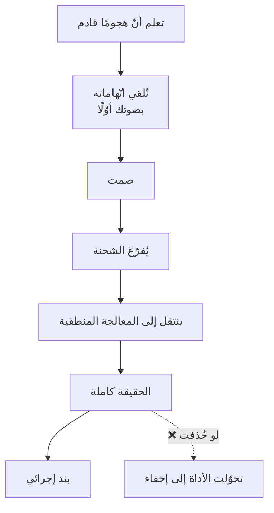

# تدقيق الاتّهام (Accusation Audit)
> [!info] تعريف مختصر
> تدقيق الاتّهام هو أن تقول بصوتك، في مفتتح اللقاء، كلّ ما جاء الطرف الآخر ليتّهمك به — قبل أن يقوله هو — ثم تصمت، ثم تعرض الحقيقة كاملة. غرضه تفريغ الشحنة التي دخل بها كي يستقبل ما ستقول.

## الشرح العلمي والاحترافي
التقنية لـ**كريس فوس**، وهي أقوى صيغ [[Labeling|التسمية]]، وتُستخدَم في حالة واحدة محدّدة: **حين تعلم مسبقًا أنّ هجومًا قادم ولا تستطيع الصمت.**

**والفرق بينها وبين التبرير هو محور الأداة:**

| | التبرير | تدقيق الاتّهام |
|---|---|---|
| الصياغة | «واجهتنا مشكلات فلن نُسلّم اليوم» | «يبدو أنّك تشعر أنّ هذا المشروع ليس ضمن أولوياتنا» |
| موقعك | **متّهم** يشرح | **فاهم** يصف |
| من يتكلّم أوّلًا | أنت عن نفسك | **أنت عنه** |
| حالته بعدها | يُكمل الهجوم الذي جاء به | فُرّغت الشحنة فينتقل إلى المنطق |
| مصير الحقيقة | تُقدَّم دفاعًا فتُقرأ عذرًا | تُقدَّم بعد التهدئة فتُقرأ معلومة |

**وشروطها ثلاثة:**
① **الدقّة** — أن تُصيب ما سيقوله فعلًا لا اتّهامًا مُتخيَّلًا.
② **الاستيعاب** — أن تذكر **أشدّ** ما سيقوله لا أخفّه؛ وإلّا أكمل بما لم تذكره فتُضاعف الضرر.
③ **إتباعه بالحقيقة** — وهو **الفاصل الأخلاقي**: الأداة تُهيّئ لاستقبال الحقيقة، فإن استُخدمت **بدلًا** منها صارت خداعًا مُتقنًا.

## أين ومتى يُستخدم
- اجتماع طارئ مع مدير أو صاحب مصلحة يفتتح بهجوم — تسبقه أنت.
- بعد تحويل بريد غاضب إلى مكالمة (انظر ⚠️ أدناه).
- قبل إبلاغ خبر سيّئ متوقّع: تأخّر تسليم · تجاوز ميزانية · عيب في الإنتاج.
- عند دخولك على علاقة سبقتك فيها سمعة سيّئة لجهتك أو فريقك.

## مثال وسيناريو تطبيقي
> [!example] عميل يُرسل بريدًا: «هذا غير مقبول. ندفع منذ ستّة أشهر ولم نرَ شيئًا.» — والردّ المكتوب كارثة لسببين: الصمت لا يُقرأ في النصّ، **والبريد يُحفَظ ويُعاد توجيهه**، فتصير اتّهاماته الثقيلة مكتوبةً بقلمك أنت بلا سياقها. فالإجراء: سطر واحد — *«موضوع مهمّ ونحتاج أن نتناوله معًا — أتناسبك مكالمة اليوم في الرابعة؟»* ثم تُفتتَح المكالمة بـ: **«بصراحة يا سيّدي، يبدو أنّك تشعر أنّنا مُقصّرون، وأنّ مشروعك ليس ضمن أولوياتنا، وأنّ هناك تراكمات لم تُعالَج.»** ← صمت ← *(يُفرّغ)* ← **ثم الحقيقة كاملة:** «الواقع أنّنا سلّمنا ثلاث وحدات وتأخّرنا في الرابعة أحد عشر يومًا بسبب كذا، وهذه خطّة التعويض.» وبعدها يُوثَّق **ما اتُّفق عليه فقط** — لا التسميات.

## خطوات أو مخطّط
1. اكتب قبل اللقاء **قائمة بما سيقوله** — بصيغته لا بصيغتك المخفّفة.
2. اختر أشدّ ثلاثة بنود واصغها في جملة واحدة تبدأ بـ«يبدو أنّك تشعر أنّ…».
3. قلها **في أوّل عشرين ثانية** قبل أن يبدأ.
4. **اصمت** حتى يُفرّغ.
5. **اعرض الحقيقة كاملة** — بما فيها ما يضرّك.
6. أغلِق ببند إجرائي: من · ماذا · متى.

## ⚠️ مفاهيم خاطئة شائعة
> [!warning]
> - **ليست اعتذارًا ولا إقرارًا بالذنب.** أنت تصف ما **يشعر** به لا ما تُقرّ بصحّته؛ ولم توافق على شيء.
> - **ليست استباقًا للتخفيف.** ذكر أخفّ الاتّهامات فقط يُنتج عكس المراد: سيُكمل بما لم تذكره وقد ارتفع لديه شعور بأنّك تُراوغ.
> - **لا تُؤدَّى كتابةً أبدًا.** فوق أنّ الصمت لا يُقرأ، النصّ يُحفَظ ويُعاد توجيهه؛ فتُقرأ اتّهاماتك عن نفسك بلا ما تلاها.

## ❌ ممارسات خاطئة في المشاريع
> [!failure]
> - **استخدامها بدلًا من الإفصاح** — تُهدّئ الاجتماع وتخرج بلا ذكر التأخير. الحل: الشرط الثالث ملزم؛ وإلّا سقطت في [[Transparency Test]].
> - **تدقيق اتّهام برصيد صفر** — الأداة تُدير موقفًا داخل علاقة قائمة ولا تصنع علاقة من عدم. فمن تأخّر ثلاث مرّات متتالية سينقل الطرف الآخر من غضب غير مُبرهَن إلى **اتّهام مُبرهَن**.
> - **التكرار حتى يصير إشارة** — إن افتتحتَ كلّ اجتماع صعب بالجملة نفسها، ربط الطرف الآخر بينها وبين «خبر سيّئ قادم» فصارت إنذارًا لا تهدئة.
> - **الخلط بينها وبين [[Labeling|التسمية]] العادية** — التسمية تُلقى داخل الحوار عند الحاجة؛ وتدقيق الاتّهام يُلقى **استباقيًّا في المفتتح** وبصيغة مُستوعِبة.

## 🔗 مصطلحات ومفاهيم ذات صلة
[[Labeling]] | [[Tactical Empathy]] | [[Tactical Silence]] | [[Transparency Test]] | [[Displacement Strategy]] | [[Stakeholder Map]] | [[Project Health Report]] | [[Radical Transparency]]

> [!tip] 💡 إثراء عملي — كورس لعبة العقل
> الشروط الثلاثة، وحالات فشل الأداة، وقاعدة الوسيط المكتوب: [[04 - التسمية - صناعة الجملة المحايدة]].
