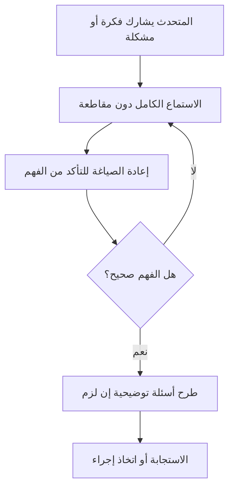

# الاستماع الفعّال (Active Listening)
> [!info] تعريف مختصر
> الاستماع الفعّال (Active Listening) هو مهارة الإصغاء الكامل والواعي لما يقوله الطرف الآخر، بهدف الفهم الحقيقي قبل الرد، مع تأكيد هذا الفهم عبر إعادة الصياغة أو الأسئلة التوضيحية. يختلف عن الاستماع السلبي الذي يكتفي بسماع الكلمات دون استيعاب المعنى أو المشاعر خلفها.

## الشرح العلمي والاحترافي
- الاستماع الفعّال يتضمن عناصر ملموسة: الانتباه الكامل (عدم تعدد المهام أثناء الحديث)، لغة الجسد الداعمة، عدم المقاطعة، إعادة الصياغة (Paraphrasing) للتأكد من الفهم، وطرح أسئلة مفتوحة لاستكشاف المعنى الأعمق.
- يميّز بين الاستماع لـ"الرد" (الاستعداد للجواب أثناء استماعك) والاستماع لـ"الفهم" (التركيز الكامل على رسالة المتحدث قبل صياغة أي رد).
- في إدارة المشاريع، يُعد الاستماع الفعّال أحد أعمدة الذكاء العاطفي (Emotional Intelligence) وأساس بناء الثقة والأمان النفسي (Psychological Safety) داخل الفريق.
- يساعد الميسّر (Facilitator) وسكرم ماستر على اكتشاف العوائق (Blockers) الحقيقية التي قد لا يصرّح بها الفريق مباشرة، لأنها تظهر أحيانًا في نبرة الصوت أو التردد أكثر من الكلمات.
- من تقنياته: الصمت المتعمد لإعطاء المتحدث وقتًا لإكمال فكرته، وتلخيص ما قيل بجملة قصيرة ("إذن ما تقصده هو...")، والتحقق من المشاعر وليس فقط الحقائق.

## أين ومتى يُستخدم
- في الوقفة اليومية (Daily Scrum) عندما يذكر عضو فريق تعثرًا غامضًا؛ الاستماع الفعّال يكشف العائق الحقيقي خلف عبارة عامة مثل "الأمور بطيئة قليلًا".
- في اجتماعات المراجعة (Sprint Retrospective) لفهم مشاعر الفريق الحقيقية تجاه ما حدث، لا فقط سرد الأحداث.
- في التواصل مع أصحاب المصلحة (Stakeholders) لفهم احتياجاتهم الفعلية خلف طلباتهم المعلنة، وهو أساس تجنّب سوء الفهم الذي يؤدي إلى زحف النطاق (Scope Creep).
- في حل النزاعات بين أعضاء الفريق، وفي مقابلات جمع المتطلبات مع العميل.

## مثال وسيناريو تطبيقي
> [!example] في الاجتماع اليومي لفريق تطوير تطبيق مصرفي، قالت المهندسة سارة: "انتهيت من واجهة الدفع، لكن فيه شوية تفاصيل عالقة". مدير المشروع عمر، بدل أن ينتقل مباشرة للعضو التالي، توقف وسأل: "ممكن توضحي أكثر، أي نوع من التفاصيل؟". سارة أوضحت أن فريق الأمن لم يرد على استفسارها بخصوص تشفير رقم البطاقة منذ 3 أيام، وهي مترددة في تصعيد الأمر. عمر أعاد صياغة ما فهمه: "إذن أنتِ بانتظار رد من فريق الأمن، وهذا يعطّل إغلاق المهمة، صحيح؟". سارة أكدت. بفضل الاستماع الفعّال، اكتشف عمر عائقًا (Blocker) حقيقيًا كان سيبقى مخفيًا لو اكتفى بسماع "شوية تفاصيل عالقة" والانتقال للعضو التالي. تدخّل عمر فورًا وتواصل مع مدير فريق الأمن، فحُلّت المشكلة خلال ساعتين.

## خطوات أو مخطّط
1. إعطاء المتحدث انتباهًا كاملًا (إيقاف الهاتف، التواصل البصري).
2. عدم المقاطعة حتى ينهي المتحدث فكرته.
3. إعادة صياغة ما فُهم بجملة قصيرة للتأكد من صحة الفهم.
4. طرح أسئلة مفتوحة لاستكشاف التفاصيل والمشاعر الكامنة.
5. تأجيل الحكم أو الرد السريع حتى اكتمال الفهم.
6. تلخيص الاتفاق أو الخطوة التالية بوضوح قبل إنهاء الحوار.

## ⚠️ مفاهيم خاطئة شائعة
> [!warning]
> - الاعتقاد بأن الاستماع الفعّال يعني مجرد الصمت وعدم الكلام؛ هو في الواقع مشاركة نشطة عبر إعادة الصياغة والأسئلة.
> - الخلط بينه وبين الموافقة على كل ما يُقال؛ يمكن أن تفهم موقف شخص فهمًا تامًا دون أن توافق عليه.
> - الظن بأنه مهارة فطرية لا تحتاج تدريبًا؛ في الواقع هي مهارة تُكتسب وتتحسن بالممارسة الواعية.

## ❌ ممارسات خاطئة في المشاريع
> [!failure]
> - **الاستماع للرد بدل الفهم**: يجهّز المستمع رده أثناء حديث الآخر بدل التركيز على المعنى. الحل: تأجيل صياغة الرد حتى انتهاء المتحدث تمامًا.
> - **مقاطعة أعضاء الفريق في الاجتماعات لتسريع الوقت**: يُفقد الفريق تفاصيل مهمة وقد يخفي عوائق حقيقية. الحل: تخصيص وقت كافٍ، واستخدام أسئلة متابعة قصيرة بدل القطع.
> - **الاكتفاء بالاستماع للكلمات دون قراءة لغة الجسد أو النبرة**: يفوت إشارات مهمة عن التوتر أو التردد. الحل: الانتباه للإشارات غير اللفظية إلى جانب المحتوى.

## 🔗 مصطلحات ومفاهيم ذات صلة
[[Psychological Safety]] | [[Emotional Intelligence]] | [[Facilitator]] | [[Blocker]] | [[Feedback Loop]] | [[Servant Leadership]] | [[07 - Daily Standup]] | [[10 - Sprint Retrospective]] | [[21 - Stakeholder Communication]]

> [!tip] 💡 إثراء عملي — كورس لعبة العقل
> الاستماع **للتحليل لا للردّ** بوصفه استراتيجية سيطرة، وضغط الفراغ، وأرقام الصمت الثلاثة: [[Silent Leadership]] · [[Tactical Silence]] · [[10 - كاريزما القائد الصامت والقيادة البيولوجية]].
