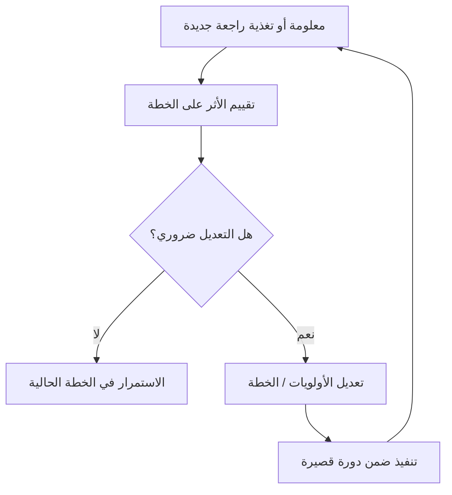

# القابلية للتكيّف (Adaptability)
> [!info] تعريف مختصر
> القابلية للتكيّف (Adaptability) هي قدرة الفرد أو الفريق أو المنظمة على تعديل خططه وسلوكه وأولوياته بسرعة استجابةً لمعلومات جديدة أو تغيّر في الظروف، دون أن يفقد فعاليته. وهي إحدى القيم الجوهرية التي يقوم عليها التفكير الرشيق (Agile).

## الشرح العلمي والاحترافي
- تنبع القابلية للتكيّف من الإقرار بأن كثيرًا من المشاريع، خصوصًا في تطوير البرمجيات، تعمل في بيئة معقدة (Complex) يصعب التنبؤ الكامل بها مسبقًا؛ لذلك يصبح التعلّم المستمر والتعديل أهم من الالتزام الصارم بخطة أولية.
- تظهر على ثلاثة مستويات: الفرد (تعلّم مهارة جديدة أو تغيير أسلوب عمله)، والفريق (تعديل عملياته الداخلية)، والمنظمة (تغيير استراتيجيتها استجابة للسوق).
- ترتبط بشكل مباشر بحلقة التغذية الراجعة (Feedback Loop): كلما كانت الحلقة أقصر (مثل مراجعة السبرنت كل أسبوعين)، كانت القابلية للتكيّف أسرع وأكثر فعالية.
- تختلف عن "التغيير من أجل التغيير"؛ التكيّف الجيد مبني على بيانات وملاحظات فعلية (من العميل، من الأداء، من السوق)، وليس رد فعل عشوائي.
- من أدواتها العملية: تخصيص احتياطي زمني أو مالي (Contingency Reserve) لمواجهة المجهول، واستخدام دورات عمل قصيرة (Timeboxing) تتيح إعادة التقييم بشكل متكرر، وإبقاء الوثائق والخطط قابلة للتعديل بدل تجميدها مبكرًا.

## أين ومتى يُستخدم
- جوهري في إطار Scrum وKanban حيث تُعاد أولويات الـ Backlog باستمرار بناءً على أحدث المعلومات.
- ضروري عند إدارة التغيير التنظيمي (انظر ADKAR Model) حيث يحتاج الأفراد قدرة على تقبّل عمليات أو أدوات جديدة.
- مهم بشكل خاص عند مواجهة مخاطر غير متوقعة (انظر Risk Register) أو طلبات تغيير (Change Request) من العميل في منتصف المشروع.
- أقل حضورًا (لكنه لا يزال مهمًا) في مشاريع الشلال (Waterfall) ذات النطاق الثابت، حيث يُدار التكيّف رسميًا عبر عمليات التحكم بالتغيير بدل التعديل الحر.

## مثال وسيناريو تطبيقي
> [!example] فريق تطوير في شركة "تِك واي" كان يبني ميزة "الدفع بالتقسيط" بناءً على خطة ربع سنوية. بعد شهر واحد، أظهرت بيانات السوق (Customer and Market Validation) أن 70% من المستخدمين المستهدفين يفضلون خيار "الدفع عند الاستلام" بدل التقسيط. بدل الاستمرار في الخطة الأصلية بصلابة، اجتمع صاحب المنتج مع الفريق، وأعاد ترتيب أولويات الـ Backlog: أوقف العمل على تفاصيل التقسيط المتقدمة، ووجّه سبرنتين لبناء "الدفع عند الاستلام" كحل أسرع وأقل تكلفة. الفريق استطاع تسليم الميزة الجديدة خلال 3 أسابيع بدل الانتظار حتى نهاية الربع للاكتشاف بأن الخطة الأصلية كانت خاطئة. هذا التكيّف السريع وفّر للشركة نحو شهرين من العمل الضائع، وهو مثال مباشر على قيمة "الاستجابة للتغيير أكثر من اتباع خطة ثابتة" في بيان Agile.

## خطوات أو مخطّط
1. جمع معلومات جديدة باستمرار (بيانات مستخدمين، نتائج اختبار، تغذية راجعة من العميل).
2. تقييم أثر هذه المعلومات على الخطة الحالية بصدق وسرعة.
3. اتخاذ قرار واضح: الاستمرار، التعديل، أو التوقف.
4. تعديل الأولويات (Backlog) أو الخطة رسميًا وبشفافية مع الفريق وأصحاب المصلحة.
5. تنفيذ التعديل ضمن دورة عمل قصيرة لإعادة التقييم سريعًا.
6. توثيق الدرس المستفاد لتحسين سرعة التكيّف مستقبلًا.

## ⚠️ مفاهيم خاطئة شائعة
> [!warning]
> - الاعتقاد بأن القابلية للتكيّف تعني غياب التخطيط تمامًا؛ في الواقع التكيّف الجيد يبدأ من خطة واضحة تُعدَّل بذكاء عند الحاجة، لا من غياب الخطة.
> - الخلط بين التكيّف والتذبذب: تغيير الاتجاه كل يوم دون سبب وجيه ليس تكيّفًا بل عدم استقرار يضر بالفريق.
> - الظن بأن التكيّف مسؤولية الفرد وحده؛ في الواقع هو يتطلب أيضًا عمليات ومنظمة تسمح بالتغيير (مثل مرونة الميزانية والجدول).

## ❌ ممارسات خاطئة في المشاريع
> [!failure]
> - **تغيير الأولويات باستمرار دون تثبيت أي هدف قصير المدى**: يُنهك الفريق ويمنعه من إنجاز أي شيء كامل. الحل: تثبيت هدف السبرنت (Sprint Goal) خلال فترته، وتوجيه التغييرات الجديدة للسبرنت القادم.
> - **تجاهل إشارات السوق أو التغذية الراجعة تمسكًا بالخطة الأصلية**: يؤدي لبناء منتج لا يحتاجه أحد. الحل: مراجعة دورية للفرضيات الأساسية بناءً على بيانات حقيقية.
> - **معاملة كل طلب تغيير كأنه طارئ يجب تنفيذه فورًا**: يُغرق الفريق ويشتت تركيزه. الحل: تقييم كل تغيير عبر عملية واضحة (Change Request) قبل قبوله.

## 🔗 مصطلحات ومفاهيم ذات صلة
[[VUCA]] | [[Feedback Loop]] | [[Change Request]] | [[Contingency Reserve]] | [[ADKAR Model]] | [[Risk Register]] | [[Timeboxing]] | [[Alignment]] | [[Agile Manifesto]] | [[01 - Agile]] | [[13 - Backlog]]
