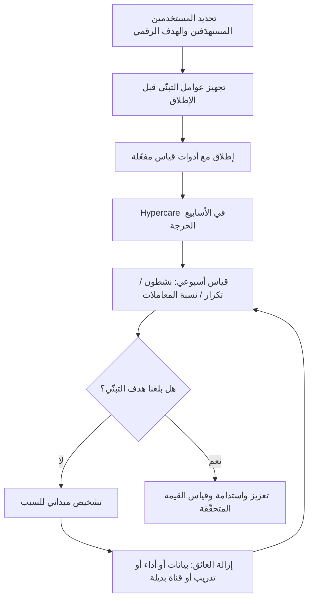

# التبنّي (Adoption)

> [!info] تعريف مختصر
> التبنّي (Adoption) هو الاستخدام **الفعلي والمستدام** للنظام من قِبَل المستخدمين المستهدَفين في عملهم اليومي، لا مجرد إتاحته لهم أو تدريبهم عليه. وهو المعيار الحقيقي لنجاح المشروع، إذ تختصره القاعدة: **لا يكفي أن نبني، لا بدّ أن يُستخدَم؛ وإلا فلا قيمة**. نظام مُطلَق بنسبة إنجاز ١٠٠٪ وتبنٍّ ١٥٪ هو مشروع فاشل مهما كان انضباطه في الجدول والميزانية.

## الشرح العلمي والاحترافي

- **التبنّي مقابل الإتاحة**: الإتاحة (Availability) حدث تقني: النظام منشور ويمكن الدخول إليه. التبنّي حالة سلوكية مستمرة: الناس يستخدمونه فعلًا لإنجاز عملهم، ويستمرون في ذلك بعد زوال الحماس الأول وبعد رفع الإشراف. الفجوة بين الاثنين هي المكان الذي تموت فيه معظم المشاريع بصمت.
- **موقعه في سلسلة القيمة**: في تسلسل `Output → Outcome → Value` (انظر [[Outcome vs Output]] و[[Product Thinking]])، التبنّي هو الجسر الإلزامي بين المخرَج والأثر. لا يمكن لأي أثر أن يتحقّق دون سلوك استخدام فعلي. لذلك تُصاغ معادلة القيمة عمليًا على النحو: **القيمة المتحقّقة = (الأثر لكل مستخدم × نسبة التبنّي) ÷ زمن الوصول إلى القيمة ([[Time to Value]])**. ومعناها العملي أن مضاعفة التبنّي من ٣٠٪ إلى ٦٠٪ تضاعف القيمة تمامًا كما لو ضاعفنا أثر النظام نفسه — لكنها غالبًا أرخص وأسرع.
- **كيف يُقاس**: لا يوجد مقياس واحد كافٍ؛ تُستخدم عادةً مجموعة مؤشرات:
  1. **نسبة المستخدمين النشطين إلى المستهدَفين**: عدد من استخدم النظام خلال فترة (شهريًا MAU أو أسبوعيًا WAU) مقسومًا على العدد الكلي للمستخدمين المستهدَفين.
  2. **تكرار الاستخدام (Frequency / Depth)**: كم مرة يستخدمه الموظف أسبوعيًا، وكم وظيفة من وظائفه الأساسية يلمس فعلًا؟ مستخدم يدخل مرة شهريًا ليطبع تقريرًا ليس متبنّيًا.
  3. **نسبة المعاملات المنفَّذة داخل النظام مقابل خارجه**: أقوى مؤشر في الأنظمة المؤسسية — كم من الطلبات مرّت عبر النظام مقابل ما نُفِّذ عبر البريد أو الورق أو ملفات Excel الموازية؟
  4. **الاستمرارية (Retention / Sustained Use)**: هل بقي المستخدم بعد ٣٠ و٦٠ و٩٠ يومًا، أم استخدمه مرة ثم انسحب؟
- **مؤشرات الفشل الصامت**: أخطر أشكال ضعف التبنّي لا تظهر في تقارير الحالة، لأن النظام "مُطلَق" ولا شكاوى رسمية. علاماتها: استمرار الطريقة القديمة بالتوازي (ملفات Excel ظِلّية، رسائل بريد بديلة عن الطلبات)، وتركّز الاستخدام في عدد صغير من "الأبطال" بينما بقية الفريق لا يدخل، وارتفاع طلبات "أرسل لي التقرير" بدل استخراجه ذاتيًا، وطلبات تصدير البيانات إلى Excel فور دخول النظام، وسكوت المستخدمين تمامًا — فالنظام الذي لا يُشتكى منه ولا يُستخدم أسوأ من نظام تُرفع عنه شكاوى.
- **أسباب ضعف التبنّي**: أغلبها إداري وسلوكي لا تقني:
  - **تدريب متأخّر أو نظري**: تدريب قبل الإطلاق بأسابيع أو بمحتوى عام غير مرتبط بمهام المستخدم الفعلية يُنسى قبل الحاجة إليه.
  - **مقاومة التغيير**: خوف من الشفافية والمساءلة، أو من فقدان سلطة معلوماتية كانت قائمة على احتكار البيانات (تعالجها أطر مثل [[ADKAR Model]]).
  - **بيانات غير موثوقة**: أول تقرير خاطئ يكفي لتدمير الثقة؛ والمستخدم الذي لا يثق بالرقم سيعيد حسابه يدويًا إلى الأبد.
  - **بطء الأداء أو تعقيد الرحلة**: عملية تستغرق ٧ نقرات و٤٠ ثانية بدل نموذج ورقي في ١٠ ثوانٍ لن تُتبنّى مهما كانت مزاياها الاستراتيجية.
  - **غياب سبب مُلزِم**: بقاء القناة القديمة مفتوحة يجعل التبنّي اختياريًا، والاختياري لا يحدث.
- **علاقته بـ [[Hypercare]] ورحلة التمكين**: النافذة الحاسمة للتبنّي هي الأسابيع الأربعة إلى الثمانية الأولى بعد الإطلاق. الدعم المكثّف والحضور الميداني والاستجابة السريعة خلالها تحدّد المنحنى بأكمله؛ إذ إن المستخدم الذي فشلت محاولته الأولى ولم يجد دعمًا يعود إلى الطريقة القديمة، واستعادته لاحقًا تكلّف أضعاف كسبه ابتداءً. رحلة التمكين تمتد بعد ذلك: مرجعيات محلية داخل كل إدارة، ومحتوى مساعدة داخل النظام، وتحسينات مستمرة مبنية على بيانات الاستخدام.

## أين ومتى يُستخدم

- **في تعريف معايير نجاح المشروع**: كتابة هدف تبنٍّ رقمي في ميثاق المشروع منذ البداية (مثال: ٧٠٪ من المستهدَفين نشطون أسبوعيًا خلال ٩٠ يومًا من الإطلاق)، لا الاكتفاء بمعيار التسليم.
- **في بوابة قرار الإطلاق**: التحقق من جاهزية عوامل التبنّي (التدريب، جودة البيانات المُرحَّلة، خطة إغلاق القنوات القديمة) لا الجاهزية التقنية فقط.
- **في تقارير ما بعد الإطلاق**: استبدال سؤال "هل أطلقنا؟" بسؤال "كم نسبة الاستخدام هذا الأسبوع، وأي إدارة متأخرة ولماذا؟" في تقارير ٣٠ و٦٠ و٩٠ يومًا.
- **في إدارة التغيير التنظيمي**: التبنّي هو الناتج القابل للقياس لعمل إدارة التغيير، ويُربط بمراحل [[ADKAR Model]] لتشخيص أين تحديدًا تتعثّر الرحلة (وعي؟ رغبة؟ معرفة؟ قدرة؟ تعزيز؟).
- **في تحديد أولويات التطوير بعد الإطلاق**: بيانات التبنّي تكشف نقاط الهجر في الرحلة، فتوجّه الـ Backlog نحو ما يزيل العوائق الحقيقية بدل إضافة ميزات جديدة فوق نظام لا يُستخدم.
- **في تقييم العائد على الاستثمار**: أي حساب ROI مبني على افتراض استخدام كامل يكون مضلّلًا؛ يُعاد حسابه بضرب الأثر في نسبة التبنّي الفعلية.

## مثال وسيناريو تطبيقي

> [!example] **نظام إدارة طلبات الصيانة في مجموعة صناعية**
>
> أُطلق النظام لخدمة ٨٤٠ فنيًا ومشرفًا في ٦ مواقع، بميزانية ١.٤ مليون ريال، وسُلّم في موعده. بعد ٤٥ يومًا من الإطلاق أظهرت لوحة القياس:
> - **المستخدمون النشطون أسبوعيًا**: ٢٦٣ من ٨٤٠ = **٣١٪**.
> - **نسبة المعاملات داخل النظام**: من إجمالي ٣١٠٠ طلب صيانة شهريًا، سُجِّل ١١٥٠ فقط في النظام (**٣٧٪**)، بينما استمر ١٩٥٠ طلبًا عبر الهاتف ومجموعات الواتساب وملف Excel مشترك يحدّثه منسّق كل موقع.
> - **الاستمرارية**: من ٦٠٢ مستخدم دخلوا في الأسبوع الأول، بقي ٢٦٣ فقط بعد ٦ أسابيع — أي **هجر بنسبة ٥٦٪**.
> - **العمق**: ٨٩٪ من الجلسات اقتصرت على شاشة عرض الطلبات فقط، دون استخدام وحدة قطع الغيار ولا إغلاق أمر العمل.
>
> **التشخيص الميداني** (٢٢ مقابلة خلال أسبوع): (١) التدريب نُفِّذ قبل الإطلاق بـ ٧ أسابيع وكان نظريًا في قاعة، فنسي أغلب الفنيين خطوات الإغلاق؛ (٢) الشبكة اللاسلكية ضعيفة داخل الورش فيستغرق فتح الشاشة ١٤ ثانية مقابل مكالمة هاتفية في ٥ ثوانٍ؛ (٣) البيانات المُرحَّلة تضم ١٧٠٠ أصل بأسماء مكرّرة أو خاطئة، فبحث الفني عن المعدّة يفشل فيلجأ للهاتف؛ (٤) القناة القديمة بقيت مفتوحة رسميًا، فلا يوجد سبب مُلزِم للتحوّل.
>
> **خطة العلاج على ٩٠ يومًا**: تنظيف سجل الأصول (خُفِّض إلى ٩٤٠ سجلًا صحيحًا)؛ تحسين زمن التحميل إلى ٢.٨ ثانية ونمط عمل دون اتصال؛ تدريب ميداني قصير عند محطة العمل نفسها (١٥ دقيقة لكل فني) مع ١٢ مرجعية محلية داخل الورش؛ إغلاق تدريجي للقناة الهاتفية بعد إشعار ٣ أسابيع مع بقاء استثناء للطوارئ فقط؛ ولوحة تبنٍّ أسبوعية تُعرض على مديري المواقع باسم كل موقع.
>
> **النتيجة بعد ٩٠ يومًا**: المستخدمون النشطون أسبوعيًا **٧٤٪** (٦٢٢ من ٨٤٠)، ونسبة المعاملات داخل النظام **٨٨٪**، ومتوسط زمن إغلاق أمر العمل انخفض من ٤.١ يوم إلى ١.٦ يوم. لم تُضَف ميزة واحدة جديدة إلى النظام خلال هذه الفترة — كل المكاسب جاءت من إزالة عوائق التبنّي.

## خطوات أو مخطّط

1. **تحديد المستخدمين المستهدَفين بدقة**: تعريف المقام (Denominator) قبل الإطلاق — من الذي يُفترض أن يستخدم النظام، وبأي وتيرة، ولأي مهام؟
2. **وضع هدف تبنٍّ رقمي وزمني**: مثل ٧٠٪ نشطون أسبوعيًا خلال ٩٠ يومًا، مع أهداف مرحلية عند ٣٠ و٦٠ يومًا.
3. **تجهيز عوامل التبنّي قبل الإطلاق**: جودة البيانات المُرحَّلة، أداء مقبول، تدريب عملي قريب من موعد الاستخدام، ومرجعيات محلية في كل وحدة.
4. **الإطلاق مع أدوات قياس مفعّلة**: لا إطلاق دون تتبّع استخدام على مستوى الوحدة التنظيمية والوظيفة.
5. **[[Hypercare]] في الأسابيع الحرجة**: دعم مكثّف وحضور ميداني واستجابة خلال ساعات، لأن الانطباع الأول يحدّد المنحنى.
6. **القياس الأسبوعي وتشخيص الفجوات**: قراءة الأرقام حسب الوحدة والوظيفة لتحديد **أين** يضعف التبنّي و**لماذا**، بمقابلات ميدانية لا بالتخمين.
7. **إزالة العوائق قبل إضافة الميزات**: توجيه التطوير أولًا نحو ما يمنع الاستخدام (بطء، بيانات، خطوات زائدة).
8. **إغلاق القنوات القديمة تدريجيًا**: مع إشعار مسبق واستثناءات محدودة، فبقاء البديل السهل يبقي التبنّي اختياريًا.
9. **التعزيز والاستدامة**: ربط التبنّي بمؤشرات أداء المديرين، ومتابعة [[NPS]] ورضا المستخدم، ومراجعة دورية لمنع التراجع.

## ⚠️ مفاهيم خاطئة شائعة

> [!warning]
> - **اعتبار عدد الحسابات المُنشأة مقياسًا للتبنّي**: إنشاء ٨٤٠ حسابًا لا يعني شيئًا؛ المقياس هو الاستخدام المتكرر لإنجاز عمل حقيقي، لا الدخول مرة واحدة لتغيير كلمة المرور.
> - **الظن بأن التدريب وحده يصنع التبنّي**: التدريب يعالج نقص المعرفة فقط؛ أما بطء الأداء وضعف الثقة بالبيانات وبقاء القناة القديمة فلا يعالجها أي عدد من الجلسات التدريبية.
> - **تفسير غياب الشكاوى بأنه رضا**: الصمت غالبًا علامة انسحاب لا قبول — فالمستخدم الذي عاد إلى Excel لا يشتكي من نظام لم يعد يستخدمه.
> - **الاعتقاد بأن التبنّي مسؤولية فريق التقنية**: التبنّي نتيجة قرارات تنظيمية (إغلاق القنوات، حوافز المديرين، جودة البيانات) يملكها العمل لا التقنية؛ ولذلك يجب أن يكون له مالك من جانب الأعمال.
> - **الظن بأن التبنّي يبدأ بعد الإطلاق**: يبدأ فعليًا من مرحلة التصميم؛ فالنظام الذي لم يُشرَك مستخدموه في تصميم رحلته سيقاوَم مهما كانت خطة التغيير لاحقًا.
> - **قياس التبنّي مرة واحدة ثم إغلاق الملف**: التبنّي منحنى قابل للتراجع بعد رحيل الأبطال أو تغيّر العمليات؛ ويحتاج قياسًا دوريًا لا لقطة واحدة.

## ❌ ممارسات خاطئة في المشاريع

> [!failure]
> - **إعلان نجاح المشروع فور الإطلاق دون قياس استخدام**: يُغلق التمويل والاهتمام الإداري في اللحظة الحاسمة لبناء التبنّي، فيتحوّل الاستثمار كله إلى كلفة غارقة. **الحل**: ربط إغلاق المشروع ببلوغ هدف تبنٍّ محدد بعد ٩٠ يومًا، لا بتاريخ النشر.
> - **إبقاء القناة القديمة مفتوحة إلى أجل غير مسمّى**: يجعل التحوّل اختياريًا، فيبقى النظامان يعملان بالتوازي وتتضاعف الكلفة وتتشتّت البيانات. **الحل**: خطة إغلاق تدريجي معلَنة بتواريخ ملزِمة، مع استثناءات محدودة وموثّقة للطوارئ فقط.
> - **ترحيل بيانات غير منقّاة إلى النظام الجديد**: أول نتيجة بحث خاطئة أو تقرير غير مطابق يدمّر ثقة المستخدم بشكل يصعب استعادته. **الحل**: اعتبار جودة البيانات المُرحَّلة معيار قبول ملزِمًا في بوابة الإطلاق، مع تدقيق عيّنة مستقلة قبل النشر.
> - **جدولة التدريب مبكرًا جدًا وبأسلوب نظري جماعي**: تُنسى المهارة قبل الحاجة إليها، ويُستهلك بند الميزانية دون أثر. **الحل**: تدريب قريب من موعد الاستخدام الفعلي (خلال أسبوع)، عملي وقصير وعند محطة العمل، مع محتوى مساعدة داخل النظام ومرجعيات محلية.
> - **قياس التبنّي على مستوى المؤسسة فقط**: يخفي المتوسط تفاوتًا حادًّا بين وحدة عند ٩٥٪ وأخرى عند ٨٪، فتضيع فرصة التدخل الموجَّه. **الحل**: تفصيل المؤشر حسب الوحدة والوظيفة والموقع، وعرضه أسبوعيًا على المديرين بالاسم.
> - **تجاهل مقاومة التغيير بوصفها "موقفًا سلبيًا"**: تتحوّل المقاومة إلى امتناع منظّم يصعب اختراقه لاحقًا. **الحل**: تشخيص منهجي عبر [[ADKAR Model]]، ومعالجة السبب الحقيقي (خوف من المساءلة، فقدان دور، عبء إضافي) بدل الاكتفاء بالتعميمات الإدارية.
> - **الاستجابة لضعف التبنّي ببناء ميزات جديدة**: تُضاف طبقات فوق نظام لا يُستخدَم أصلًا، فيزداد التعقيد وتنخفض النسبة أكثر. **الحل**: تشخيص ميداني أولًا، وإعطاء أولوية مطلقة لإزالة العوائق (أداء، بيانات، عدد الخطوات) قبل أي إضافة وظيفية.

## 🔗 مصطلحات ومفاهيم ذات صلة
[[Outcome vs Output]] | [[Hypercare]] | [[ADKAR Model]] | [[NPS]] | [[Time to Value]] | [[UAT]] | [[Product Thinking]] | [[KPI]]
