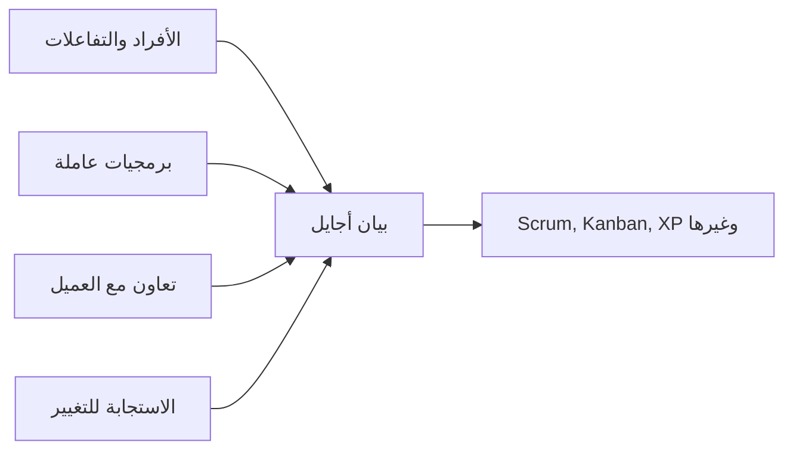

# بيان أجايل (Agile Manifesto)
> [!info] تعريف مختصر
> بيان أجايل هو وثيقة قصيرة كتبها 17 خبيرًا في تطوير البرمجيات عام 2001 في ولاية يوتاه الأمريكية، تحدد أربع قيم أساسية واثني عشر مبدأً لتطوير برمجيات أكثر مرونة وتفاعلية مع التغيير، وهي الأساس الفكري لكل منهجيات [[01 - Agile]].

## الشرح العلمي والاحترافي
جاء البيان كرد فعل على فشل مشاريع كثيرة اتبعت منهجيات تسليم تقليدية جامدة مثل [[04 - Waterfall]]، حيث كانت المتطلبات تُجمَّد مبكرًا والتغيير يُعامل كخطر يجب منعه. القيم الأربع الأساسية هي:
1. الأفراد والتفاعلات أهم من العمليات والأدوات.
2. البرمجيات العاملة أهم من التوثيق الشامل.
3. التعاون مع العميل أهم من التفاوض على العقود.
4. الاستجابة للتغيير أهم من اتباع خطة ثابتة.

المهم هنا أن البيان لا يلغي الجانب الأيمن من كل جملة (الأدوات، التوثيق، العقود، الخطط)، بل يقول إن الجانب الأيسر أكثر أهمية عند التعارض. هذا الفارق الدقيق كثيرًا ما يُساء فهمه. إلى جانب القيم، هناك 12 مبدأ تفصيلي يشمل: إرضاء العميل عبر تسليم مبكر ومستمر، الترحيب بالتغيير حتى في مراحل متأخرة، تسليم برمجيات عاملة بشكل متكرر (أسابيع لا أشهر)، تعاون يومي بين رجال الأعمال والمطورين، بناء المشاريع حول أفراد متحمسين وموثوقين، التواصل وجهًا لوجه كأفضل وسيلة، البرمجيات العاملة كمقياس رئيسي للتقدم، الوتيرة المستدامة ([[Sustainable Pace]])، الاهتمام المستمر بالتميز التقني، البساطة، [[Self-Organizing Team|الفرق ذاتية التنظيم]]، والتأمل الدوري لتحسين الأداء (وهو أساس [[10 - Sprint Retrospective]]).

## أين ومتى يُستخدم
- يُعتبر الأساس الفلسفي وراء كل الأطر العملية مثل Scrum و Kanban و Extreme Programming.
- يُرجع إليه عند اتخاذ قرارات صعبة حول كيفية التعامل مع التغيير أو مقدار التوثيق المطلوب.
- يُستخدم في تدريب الفرق الجديدة على عقلية Agile قبل تعلم أي إطار عملي محدد.

## مثال وسيناريو تطبيقي
> [!example] شركة ناشئة تبني تطبيق توفير مواقف سيارات "بارك لي". في البداية كتب فريق المشروع خطة تفصيلية لستة أشهر بكل الميزات محددة سلفًا على طريقة Waterfall. بعد شهرين، اكتشفوا أن المستخدمين لا يريدون حجز المواقف مسبقًا بل يريدون معرفة الموقف الأقرب فورًا. بتطبيق قيم بيان أجايل، بدل الفريق أولوياته فورًا (الاستجابة للتغيير أهم من اتباع خطة ثابتة)، وبدل الاستمرار في توثيق شامل لميزات قد لا تُستخدم، ركّز على تسليم نسخة عاملة صغيرة (تحديد الموقف الأقرب) خلال أسبوعين وعرضها على مستخدمين حقيقيين لأخذ رأيهم (التعاون مع العميل).

## خطوات أو مخطّط
1. اقرأ القيم الأربع وافهم أن كل قيمة توازن بين عنصرين لا تلغي أحدهما.
2. راجع المبادئ الاثني عشر التفصيلية لفهم كيفية تطبيق القيم عمليًا.
3. اختر إطارًا عمليًا (Scrum، Kanban، XP) يترجم هذه القيم إلى ممارسات يومية.
4. راجع دوريًا (عبر الاستعادة) هل ما زال الفريق يعيش هذه القيم فعليًا أم تحوّلت إلى شعارات فقط.

## ⚠️ مفاهيم خاطئة شائعة
> [!warning]
> - يظن كثيرون أن البيان يعني "بدون توثيق نهائيًا" أو "بدون خطة إطلاقًا"، بينما هو يفضّل التوازن لصالح البرمجيات العاملة والمرونة دون إلغاء التوثيق أو التخطيط الضروري.
> - يخلط البعض بين البيان (فلسفة وقيم) والإطار العملي مثل Scrum (ممارسات وأدوات محددة)؛ البيان لا يفرض اجتماعات أو أدوارًا معينة.
> - يعتقد البعض أن "الأجايل" تعني غياب الانضباط أو الالتزام بالمواعيد، بينما الوتيرة المستدامة والجودة التقنية المستمرة هما من صميم مبادئه.

## ❌ ممارسات خاطئة في المشاريع
> [!failure]
> - تطبيق "أجايل" شكليًا (اجتماعات يومية وسباقات) دون تبني القيم الفعلية، وهو ما يُعرف أحيانًا بـ"Agile زائف" أو Cargo Cult Agile.
> - استخدام "الاستجابة للتغيير" كذريعة لتغيير الأولويات كل يوم دون أي التزام بهدف سباق، مما يشتت الفريق ويمنع أي تسليم فعلي.
> - إهمال التواصل المباشر لصالح أدوات وتقارير فقط، بينما البيان يشدد على أن التواصل وجهًا لوجه أكثر فعالية من التوثيق الطويل.

## 🔗 مصطلحات ومفاهيم ذات صلة
[[01 - Agile]] | [[04 - Waterfall]] | [[Extreme Programming]] | [[Self-Organizing Team]] | [[Sustainable Pace]] | [[10 - Sprint Retrospective]] | [[Evolutionary Change]] | [[Radical Transparency]]
