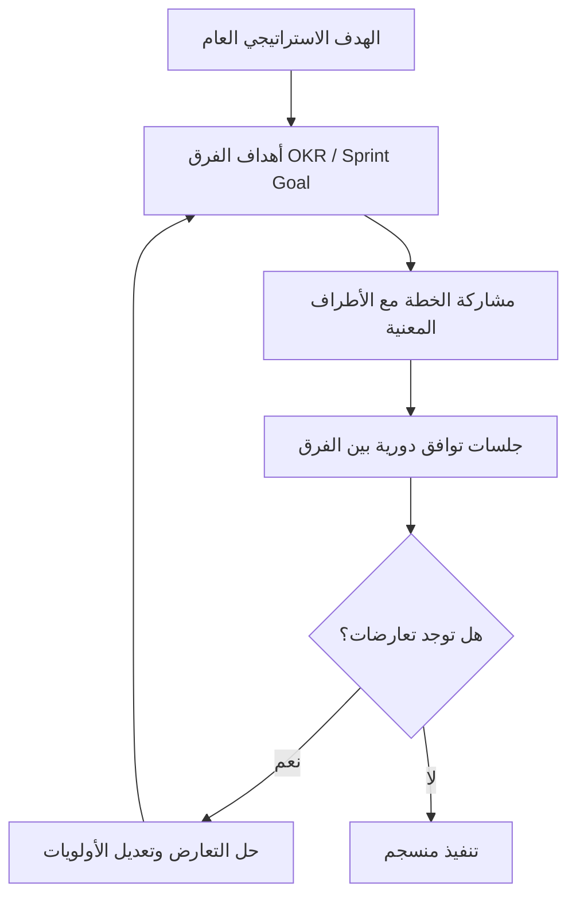

# التوافق (Alignment)
> [!info] تعريف مختصر
> التوافق (Alignment) هو حالة يكون فيها فهم الأفراد والفرق لأهداف المشروع وأولوياته واحدًا ومتّسقًا مع استراتيجية المنظمة، بحيث يتجه الجميع نحو نفس الاتجاه رغم استقلالية كل فريق في طريقة عمله.

## الشرح العلمي والاحترافي
- التوافق لا يعني توحيد الطريقة أو فرض تفاصيل التنفيذ؛ بل يعني اتفاق الجميع على "لماذا" العمل و"إلى أين" يتجه، مع ترك "كيف" للفرق المنظّمة ذاتيًا (Self-Organizing Team).
- يعمل التوافق على مستويات متعددة: توافق استراتيجي (رؤية الشركة)، توافق تكتيكي (أهداف الأرباع/الأهداف والنتائج الرئيسية OKR)، وتوافق تشغيلي يومي (هدف السبرنت Sprint Goal).
- بدون توافق واضح، تعمل الفرق بجد لكن في اتجاهات متضاربة، وهي حالة تُعرف أحيانًا بـ"الهدر التنظيمي" رغم أن كل فرد منتج على المستوى الفردي.
- أدوات بناء التوافق تشمل: خارطة الطريق (Roadmap) التي تُظهر الاتجاه العام، وبيان النطاق (Scope Statement) الذي يوضّح الحدود، وخطة الاتصال (Communication Plan) التي تضمن وصول المعلومة الصحيحة للجميع في الوقت المناسب.
- التوافق مفهوم ديناميكي وليس حدثًا لمرة واحدة؛ يحتاج تكرارًا (في اجتماعات المراجعة، وتحديثات خارطة الطريق) لأن الأولويات والظروف تتغير باستمرار (انظر Adaptability).

## أين ومتى يُستخدم
- في بداية المشروع عند صياغة حالة العمل (Business Case) وبيان النطاق، للتأكد من أن جميع أصحاب المصلحة (Stakeholders) يفهمون الهدف بنفس الطريقة.
- عند تحديد الأهداف الفصلية (OKR) على مستوى الشركة ثم اشتقاق أهداف الفرق منها.
- في التخطيط للسبرنت (Sprint Planning) عند صياغة هدف السبرنت بحيث يخدم أهدافًا أكبر من المنتج.
- عند وجود فرق متعددة تعمل على نفس المنتج (Scaled Agile)، حيث يصبح التوافق بين الفرق أهم عامل لنجاح التسليم المشترك، ولتفادي بناء ميزات متضاربة أو مكررة.

## مثال وسيناريو تطبيقي
> [!example] في شركة "أفق" لتطوير حلول السحابة، كان فريق الواجهة الأمامية يعمل على تحسين سرعة تحميل الصفحة، بينما كان فريق البنية التحتية يركز على تقليل تكلفة الخوادم، دون أن يعرف أي منهما هدف الآخر. اكتشف مدير المنتج في اجتماع ربع سنوي أن الفريقين يعملان على حلول متعارضة: فريق الواجهة يريد تحميل بيانات مسبقًا (Pre-fetching) لزيادة السرعة، وهو ما يرفع استهلاك الخوادم الذي يحاول الفريق الآخر تقليله. عقد مدير المنتج جلسة توافق (Alignment Session) جمعت الفريقين، وصاغ هدفًا ربعيًا موحدًا (OKR): "تحسين تجربة المستخدم دون رفع تكلفة التشغيل بأكثر من 5%". بناءً عليه، اتفق الفريقان على حل وسط: تحميل مسبق ذكي يعتمد على سلوك المستخدم بدل التحميل الشامل. النتيجة: تحسّنت السرعة 30% مع ارتفاع التكلفة 2% فقط، بفضل التوافق المبكر بدل اكتشاف التعارض بعد التنفيذ.

## خطوات أو مخطّط
1. توثيق الهدف الاستراتيجي العام بوضوح (رؤية أو حالة عمل).
2. اشتقاق أهداف الفرق (OKR أو Sprint Goal) بحيث تخدم الهدف العام.
3. مشاركة خارطة الطريق (Roadmap) وبيان النطاق مع جميع الأطراف المعنية.
4. عقد جلسات توافق دورية بين الفرق المترابطة لكشف التعارضات مبكرًا.
5. تحديث التوافق كلما تغيّرت الأولويات أو الظروف (Adaptability).
6. التحقق من التوافق في مراجعات دورية (Sprint Review، مراجعات الأرباع).

## ⚠️ مفاهيم خاطئة شائعة
> [!warning]
> - الاعتقاد بأن التوافق يعني أن الجميع يعملون بنفس الطريقة تمامًا؛ في الواقع التوافق في "الهدف" لا يلغي استقلالية الفريق في "الأسلوب".
> - الظن بأن التوافق يتحقق بمجرد اجتماع أو إعلان واحد؛ هو عملية مستمرة تحتاج تذكيرًا ومراجعة دورية.
> - الخلط بين التوافق والإجماع الكامل على كل قرار صغير؛ التوافق يخص الاتجاه العام لا كل تفصيلة تنفيذية.

## ❌ ممارسات خاطئة في المشاريع
> [!failure]
> - **إعلان الاستراتيجية من الإدارة العليا دون شرح "لماذا" للفرق التنفيذية**: يجعل الفرق تنفذ دون فهم حقيقي، فتتخذ قرارات محلية متعارضة مع الهدف. الحل: شرح السبب (Why) وليس فقط "ماذا" في كل تواصل استراتيجي.
> - **ترك فرق مترابطة تعمل بمعزل عن بعضها دون قنوات تواصل منتظمة**: يؤدي لتعارضات تُكتشف متأخرًا وتكلف إعادة عمل. الحل: جلسات تزامن دورية بين الفرق المترابطة (مثل Scrum of Scrums).
> - **صياغة أهداف فرق منفصلة دون ربطها بأهداف الشركة**: يُنتج فرقًا فعّالة لكنها تعمل في اتجاهات مشتتة. الحل: اشتقاق كل هدف فريق بوضوح من هدف أعلى موثّق.

## 🔗 مصطلحات ومفاهيم ذات صلة
[[OKR]] | [[Adaptability]] | [[Self-Organizing Team]] | [[Communication Plan]] | [[Stakeholder Map]] | [[Business Case]] | [[Scope Statement]] | [[08 - Sprint Planning]] | [[15 - Roadmap]] | [[21 - Stakeholder Communication]]
