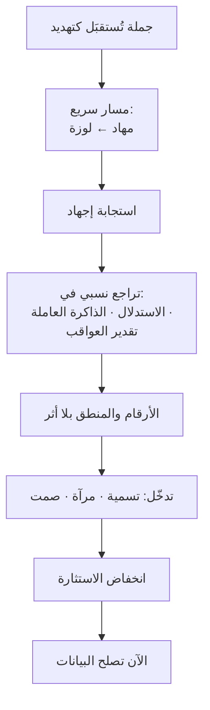

# اختطاف اللوزة (Amygdala Hijack)
> [!info] تعريف مختصر
> وصف مبسّط لما يحدث تحت التهديد المُدرَك: تُقيّم **اللوزة الدماغية** الموقف تقييمًا سريعًا فتُطلق استجابة إجهاد، **فتتراجع نسبيًّا** وظائف **القشرة الجبهية الأمامية** المسؤولة عن الاستدلال والتخطيط وتقدير العواقب. والنتيجة العملية: **من يبدأ بعرض الأرقام على شخص مُستثار يُخاطب عضوًا مُعطَّلًا الآن.**

## الشرح العلمي والاحترافي
عمّم العبارة **دانيال غولمان** في *Emotional Intelligence* (1995). وتستند إلى نتيجتين مُوثَّقتين:

① **المسار السريع.** أظهر **جوزيف لودو (Joseph LeDoux)** في *The Emotional Brain* (1996) وجود مسارين للمعلومة الحسّية: سريع **مهاد ← لوزة** يستجيب قبل اكتمال المعالجة الواعية، وأبطأ **مهاد ← قشرة ← لوزة** يُنتج تقييمًا دقيقًا. **ولهذا تشعر بالتوتّر قبل أن تعرف سببه.**

② **كبح الأداء التنفيذي.** أظهرت مراجعة **أرنستن (Amy Arnsten)** في *Nature Reviews Neuroscience* (2009) أنّ الإجهاد الحادّ يُضعف وظائف القشرة الجبهية عبر مسارات كاتيكولامينية، مع تحوّل السيطرة نحو دوائر أسرع وأكثر آليّة.

**وما يتعطّل ليس «المزاج» بل قدرات محدّدة**، وهذا يُفسّر سلوكيات تبدو غير مفهومة:

| القدرة المتراجعة | السلوك الناتج |
|---|---|
| الذاكرة العاملة | يُكرّر النقطة ثلاث مرّات؛ لا يتذكّر ما قلتَه قبل دقيقتين |
| تقدير العواقب | يُهدّد بإلغاء المشروع — وهو ما يضرّه أوّلًا |
| التفكير المجرّد | يفشل مع النِّسَب والاحتمالات؛ لا يستجيب إلّا للملموس |
| التمييز والتفصيل | **يُعمّم**: «كلّ»، «دائمًا»، «أبدًا» |

> [!warning] حدّ علميّ: العبارة تبسيط تجاوزته الأدبيات
> **① اللوزة ليست «مركز الخوف»** فحسب؛ تستجيب للبروز والأهمّية الدافعية عمومًا بما فيها المحفّزات الإيجابية. **② العلاقة تبادلية لا أحادية**: القشرة تُنظّم اللوزة كما تتأثّر بها، والقدرة على ذلك تختلف بالأفراد **وبالتدريب**. **③ لا يوجد «إغلاق»** — بل تحوّل نسبي وتدريجي في موازين المعالجة.
> **وهذا لا يُبطل الوصفة العملية** — تأجيل البيانات وخفض الاستثارة أوّلًا يبقى صحيحًا. لكنّه يُبطل الاستخدام **الاعتذاري**: «لوزتي هي التي تكلّمت» ليس عذرًا؛ التنظيم قابل للتدريب.

## أين ومتى يُستخدم
- تفسير لماذا فشل عرض بيانات مُحكم أمام صاحب مصلحة غاضب.
- اختيار توقيت طرح الأرقام والخيارات في اجتماع أزمة.
- تصميم الاستجابة للحظة الهجوم — انظر [[Tactical Silence]].
- تشخيص الفرق بين خلاف على المحتوى وحالة استثارة عابرة.

## مثال وسيناريو تطبيقي
> [!example] صاحب مصلحة يقول: «كلّ إصدار لديكم مليء بالأخطاء، دائمًا.» ولديك بيانات تُثبت انخفاض معدّل العيوب 40%. **لا تعرضها الآن** — لسببين: **الأوّل** أنّ «كلّ» و«دائمًا» تعميمان، ومؤشّران على أنّ المعالجة التمييزية (التي تُميّز 40% من 100%) هي بالضبط ما تراجع؛ **والثاني** أنّ عرض بيانات مضادّة يُقرأ **تكذيبًا** فيُنتج تصعيدًا. والتسلسل: أربع ثوانٍ صمت ← [[Mirroring|مرآة]] «كلّ إصدار؟» ← صمت ← يُفصّل (وغالبًا سيتّضح أنّه يقصد إصدارًا واحدًا) ← ثم، وقد صار يسأل بدل أن يحكم: **«ما رأيك أن ننظر معًا في أرقام آخر ثلاثة إصدارات؟»** — دعوة للنظر معًا لا عرضٌ للتفنيد.

## خطوات أو مخطّط
1. **اقرأ المؤشّر**: تعميم · تكرار · نبرة · نظر متنقّل.
2. **لا تعرض بيانات** ولا تُصحّح معلومة الآن.
3. **اصمت أربع ثوانٍ** لتهدئة استثارتك أنت — انظر [[Cognitive Reappraisal]].
4. **اخفض استثارته** بتسمية أو مرآة ثم صمت.
5. **راقب علامة العودة**: يسأل بدل أن يحكم · يُميّز بدل أن يُعمّم.
6. **الآن اعرض البيانات** — بصيغة «ننظر معًا» لا «أُثبت لك».

## ⚠️ مفاهيم خاطئة شائعة
> [!warning]
> - **ليس عذرًا للسلوك.** التنظيم الانفعالي قابل للتدريب، وهذا أصل الطلب بالممارسة.
> - **التعميم مؤشّر لا ادّعاء.** «دائمًا تتأخّرون» ليست مبالغة بلاغية تُفنَّد، بل **علامة قياس** على ارتفاع الاستثارة.
> - **ليس مقصورًا على الغضب.** يحدث في الخوف من فقدان المنصب، وفي الحرج أمام الفريق، وفي التهديد على المكانة — انظر [[SCARF Model]].

## ❌ ممارسات خاطئة في المشاريع
> [!failure]
> - **بدء اجتماع الأزمة بعرض تقديمي** فيه أرقام ورسوم — يُنفَق أفضل تحضير في أسوأ لحظة.
> - **مجادلة التعميم** («هذا غير صحيح، في السبرنت الماضي…») — تُنتج دفاعًا عن التعميم بدل التخلّي عنه.
> - **الردّ الفوري على الهجوم** — يُنتج قتالًا أو هروبًا؛ وكلاهما يُفقدك الموقف.
> - **استخدام المفردات العصبية بديلًا عن التشخيص** — إن لم يُغيّر قولك «كورتيزوله مرتفع» ما ستفعله، فهو إعادة وصف لا تفسير.

## 🔗 مصطلحات ومفاهيم ذات صلة
[[Fight Flight Freeze]] | [[Tactical Silence]] | [[Cognitive Reappraisal]] | [[Labeling]] | [[Mirroring]] | [[SCARF Model]] | [[Biological Leadership]] | [[Emotional Contagion]] | [[Emotional Intelligence]]

> [!tip] 💡 إثراء عملي — كورس لعبة العقل
> النموذج الكامل بحدوده، ومُطلِقات الكورتيزول الأربعة ونصفها نظاميّ: [[02 - بيولوجيا اللحظة - اللوزة والقشرة الجبهية]].
