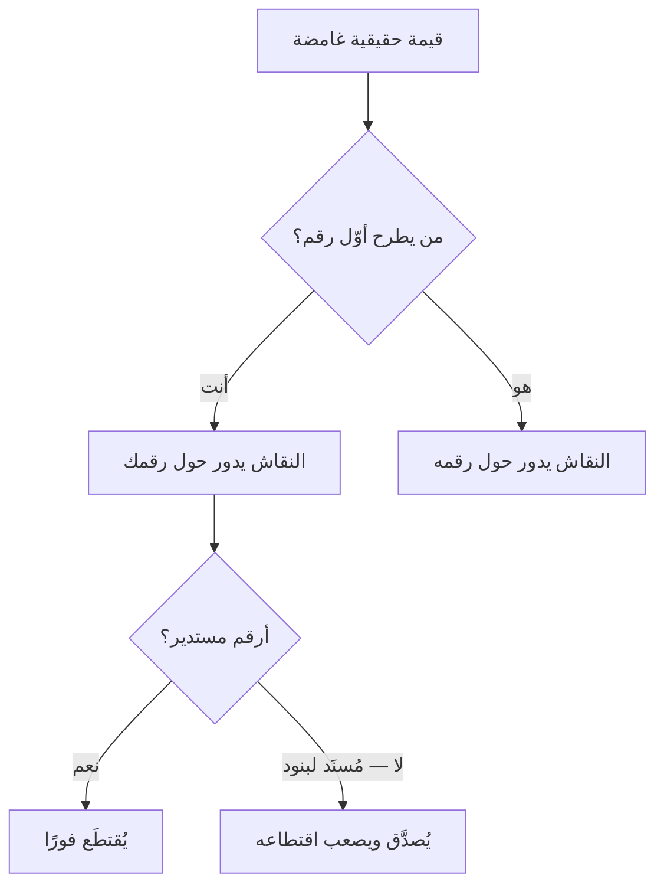

# التثبيت (Anchoring)
> [!info] تعريف مختصر
> التثبيت هو أنّ **أوّل رقم يُطرَح في نقاش يحكم مجاله كلّه**: تُقدَّر القيم المجهولة بالانطلاق منه والتعديل عنه — والتعديل يكون دائمًا غير كافٍ. وهو تحيّز معرفي مُوثَّق، ويُستخدَم استراتيجيةً في التقدير والتفاوض.

## الشرح العلمي والاحترافي
وثّقه **كانمان وتفيرسكي (Kahneman & Tversky)** في *Judgment under Uncertainty* (1974). وثلاث نتائج تهمّ إدارة المشاريع تحديدًا:

① **يعمل حتى مع أرقام لا صلة لها بالموضوع** — في التجربة الأصلية أثّرت نتيجة عجلة أرقام عشوائية في تقديرات المشاركين.
② **يعمل حتى مع الخبراء** — أظهرت دراسات على وكلاء عقارات ومحامين وأطبّاء أنّ الخبرة **لا تُحصّن** منه.
③ **يعمل حتى مع من يعرفه** — ومعرفتك بالتحيّز لا تُلغيه؛ **فالحماية إجرائية لا معرفية**: أن تُحدّد رقمك وتكتبه **قبل** دخول الغرفة.

**وحدّ مهمّ:** الأثر أقوى ما يكون حين تكون القيمة الحقيقية **غامضة** — وهو ما ينطبق تمامًا على تقدير الجهد البرمجي، **ولا ينطبق** على راتب له نطاق سوقي منشور أو خدمة لها سعر مرجعي معروف؛ فوجود مرجع مستقلّ وبدائل قوية لدى الطرف الآخر يُضعف الأثر كثيرًا.

**وقاعدة الأرقام غير المستديرة** من أرخص تطبيقاته وأعلاها عائدًا: «أحد عشر يومًا ونصف» تُرسل إشارة **دراسة**، و«أسبوعان» تُرسل إشارة **تقدير تقريبي** فيُقابَل فورًا بـ«اجعلها أسبوعًا». ورصدت دراسات (Janiszewski & Uy, 2008؛ Mason et al., 2013) أنّ العروض الافتتاحية الدقيقة تُنتج عروضًا مضادّة **أقرب إليها**.

## أين ومتى يُستخدم
- عرض تقدير أو سعر أو مدّة في مفاوضة **متباعدة وكبيرة**: عقد · نطاق إصدار · راتب.
- الدفاع ضدّه: كتابة رقمك قبل الاجتماع، وطلب معطيات الطرف الآخر قبل سماع رقمه.
- في تقدير سبرنت ← **لا** (انظر ❌ أدناه).

## مثال وسيناريو تطبيقي
> [!example] الإدارة تطلب تسليم حزمة ميزات في «10 أيّام». وتقدير الفريق المدروس **15 يومًا**. من يفتتح الاجتماع بذكر تقديره أوّلًا يحكم النقاش؛ ومن ينتظر حتى يُذكَر رقم الإدارة يجد نفسه يُدافع من موقع «لماذا ضِعف ما نريد؟». والصياغة الفارقة ليست «خمسة عشر يومًا» بل: **«تقديرنا أحد عشر يومًا ونصف للجزء الأساسي، وثلاثة أيّام ونصف لتكامل الدفع — بمجموع خمسة عشر.»** فالرقم دقيق ومُفصَّل ومُسنَد إلى بنود، فيصعب اقتطاعه اعتباطًا. ولو سُئل «من أين جاء النصف؟» لكان الجواب حاضرًا — **وهذا هو اختبار صدق الرقم.**

## خطوات أو مخطّط
1. **احسب رقمك الحقيقي أوّلًا** — التثبيت يُضاعف مصداقية التقدير المدروس **ويكشف** غير المدروس.
2. اطرحه **قبل** أن يُطرَح رقم آخر — إن كان الموقف يسمح.
3. اجعله **غير مستدير** ومُسنَدًا إلى بنود.
4. عند التنازل، **تنازل متناقصًا** لا متساويًا — انظر [[Ackerman Model]].
5. **دفاعًا:** اكتب رقمك قبل الغرفة، وإن سمعت رقمًا صادمًا فلا تُعدّل منه — عُد إلى معطياتك.

## ⚠️ مفاهيم خاطئة شائعة
> [!warning]
> - **المرساة الخيالية تُبطل نفسها.** من يبني رقمه على تقدير اعتباطي يُنتج رقمًا يُقارنه الطرف الآخر بمرجعه فيستنتج أنّ أرقامك لا تُؤخَذ بجدّية — **فيتجاهل مرساتك ويضع مرساته هو**.
> - **الدقّة إشارة، والإشارات قابلة للتزييف.** «أحد عشر يومًا ونصف» عن تقدير لم يُحسَب **إشارة كاذبة عن وجود دراسة**، وتُكشَف عند أوّل سؤال تفصيلي. الاختبار: **من أين جاء الكسر؟**
> - **ليست حكرًا على السعر.** تعمل في المدّة والنطاق وعدد الموارد وحدود الجودة.

## ❌ ممارسات خاطئة في المشاريع
> [!failure]
> - **نقلها إلى التقديرات المتكرّرة** — وهذا أخطر سوء استخدام. من يرفع كلّ تقدير سبرنت بهامش سيتعلّم مالك المنتج خصمه خلال ثلاثة أشهر، فينشأ **سباق تضخّم** ويفقد التقدير وظيفته التخطيطية. الحل: المرساة للتفاوضات المتباعدة الكبيرة؛ **أمّا التقديرات المتكرّرة فتُبنى عليها الثقة، والثقة لا تحتمل هامشًا.**
> - **الأرقام المستديرة في العروض الرسمية** — «شهر» · «100 ألف» — تدعو إلى المساومة بحكم شكلها.
> - **التنازل السريع بعد المرساة** — النزول من 15 إلى 8 عند أوّل ضغطة يُقدّم معلومة عن **كيفية بناء أرقامك**: أنّها استجابة لضغط لا نتيجة حساب.
> - **قبول رقم الطرف الآخر إطارًا للنقاش** بلا مرجع مستقلّ — الحل: «قبل أن نتحدّث في الرقم، ما البنود التي يشملها من وجهة نظرك؟»

## 🔗 مصطلحات ومفاهيم ذات صلة
[[Ackerman Model]] | [[Loss Framing]] | [[Smart Bartering]] | [[BATNA]] | [[Cognitive Bias]] | [[Estimation Variance]] | [[Original Estimate]] | [[Relative Estimation]] | [[Planning Poker]]

> [!tip] 💡 إثراء عملي — كورس لعبة العقل
> سلّم أكرمان، وقاعدة الأرقام غير المستديرة، وخطر نقلها إلى تقديرات السبرنت: [[09 - التفاوض على القيمة - التثبيت والخسارة والمقايضة]].
