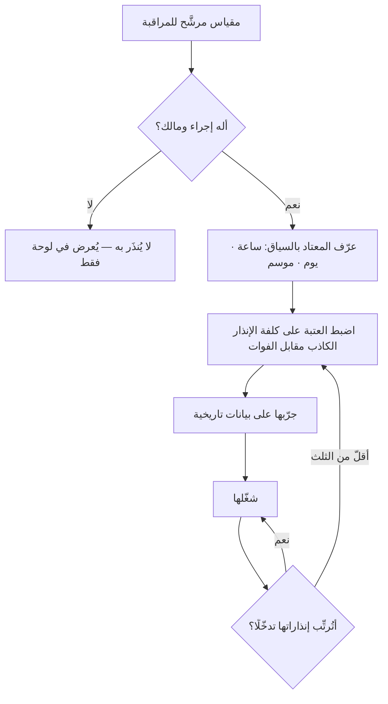

# كشف الشذوذ (Anomaly Detection)

> [!info] تعريف مختصر
> **كشف الشذوذ** تمييز القياس الذي **يخرج عن المتوقَّع خروجًا يستحقّ فعلًا** عن التذبذب المعتاد الذي لا يستحقّ. وجوهره ليس في اكتشاف الغريب، بل في **تعريف المألوف أوّلًا**: فلا معنى لكلمة «شاذّ» قبل أن يُقال ما المعتاد، ومن أي فترة أُخذ، وهل يتغيّر باختلاف الساعة واليوم والموسم. ولهذا فأصعب ما فيه ليس الخوارزمية بل **المفاضلة**: كل تشديد يزيد الإنذارات الكاذبة، وكل تخفيف يزيد ما يفوت — والاختيار بينهما قرار عمل لا قرار تقني.

## الشرح العلمي والاحترافي

### 1. ثلاث طبقات، وكلٌّ منها يحلّ عيب سابقتها

| الطبقة | كيف تعمل | عيبها الذي تحلّه التالية |
|---|---|---|
| **العتبة الثابتة** | «أنذِر إن تجاوز زمن الاستجابة ثانيتين» | لا تعرف السياق: الثانيتان طبيعيتان وقت الذروة، وكارثة في الثالثة فجرًا |
| **العتبة الإحصائية** | «أنذِر إن ابتعد عن المعتاد بأكثر من ثلاثة انحرافات» | تحسب المعتاد رقمًا واحدًا للأربع والعشرين ساعة، فتُنذر كل صباح عند بدء الدوام |
| **الواعية بالسياق** | تقارن كل لحظة بنظيرتها: هذا الاثنين بالاثنينات، والذروة بالذروات | كلفتها وتعقيدها، وحاجتها إلى تاريخ طويل نظيف قبل أن تعمل |

**والترقّي بينها ليس هدفًا في ذاته.** فأكثر الفرق تصلح لها الطبقة الأولى على مقياسين أو ثلاثة تعمل بها فعلًا، خير من الثالثة على أربعين مقياسًا لا يقرؤها أحد.

### 2. المفاضلة التي لا مهرب منها

كل نظام كشف يقع في خطأين متضادّين، ولا يمكن تقليلهما معًا:

- **الإنذار الكاذب** (False Positive): ينبّه على ما لا شيء فيه. وكلفته وقتُ الفريق وثقتُه بالنظام.
- **الفوات** (False Negative): يصمت على ما كان يجب أن يُنبَّه عليه. وكلفته الحادثة نفسها.

**والسؤال الذي يحسم الضبط ليس تقنيًّا:** *أيّهما أغلى عندنا؟* فنظام الدفع يحتمل عشر إنذارات كاذبة مقابل ألّا يفوته تعطّل واحد؛ ولوحة تحليلات داخلية لا تحتمل ذلك، لأن ثمن إنذاراتها الكاذبة أن يتوقّف الناس عن قراءتها.

### 3. مشكلة معدّل الأساس: لماذا يكذب الكاشف الدقيق؟

هذا أهمّ ما في الباب وأقلّه انتباهًا: **الكاشف الدقيق على حدث نادر يُنتج إنذارات أغلبها كاذب** — وليس هذا عيبًا فيه بل حسابًا.

فكاشفٌ يلتقط 95% من الأعطال الحقيقية ويخطئ في 1% من الحالات السليمة، إذا شُغّل على عشرة آلاف قياس فيها عشرة أعطال حقيقية: التقط تسعةً منها، **وأنذر كاذبًا نحو مئة مرّة**. أي أن تسعة من كل عشرة إنذارات لا شيء فيها — والنظام يعمل كما صُمّم تمامًا.

**والدرس العملي:** لا يُحكَم على كاشف بدقّته المعلنة، بل بـ**نسبة الإنذارات الصحيحة من مجموع ما أنذر به فعلًا** في بيئتك أنت. وتفصيل المنطق في [[Base Rate|معدّل الأساس]].

### 4. إجهاد الإنذار: كيف يموت النظام وهو يعمل

النظام الذي يُنذر كثيرًا لا يُوقَف، بل يُتجاهَل — وهذا أسوأ. فتُنشأ له قاعدة تحويل إلى مجلّد جانبي، ويُصمَت جرسه، ويصير مروره على الشاشة جزءًا من الخلفية. **ثم يقع العطل الحقيقي فيمرّ في الصفّ نفسه.**

وعلامته التي تُقاس بلا نقاش: **نسبة الإنذارات التي تُرتِّب فعلًا.** فإن كان أقلّ من ثلثها يقود إلى تدخّل، فالنظام في طريقه إلى الموت وإن بدت لوحاته عامرة.

**والقاعدة المانعة هي قاعدة [[KRI|مؤشّر الخطر]] نفسها:** لكل إنذار **إجراءٌ ومالكٌ**. فالإنذار الذي لا يُعرف من يستقبله ولا ماذا يفعل عنده ليس إنذارًا بل ضجيجًا مجدولًا.

### 5. موضعه من أخواته

يُقرأ هذا مع الجدول الثلاثي في [[Trend Analysis|تحليل الاتجاه]]: مخطّط التحكّم يسأل عن **انضباط العملية**، وتحليل الاتجاه عن **وجهتها**، وكشف الشذوذ عن **هذه النقطة الآن**. وأفقه الزمني أقصرها، والفعل الذي يطلبه أعجلها.

## أين ومتى يُستخدم

- في مراقبة الخدمات الحيّة: زمن الاستجابة، ومعدّل الأخطاء، وحجم الطلبات، وطوابير المعالجة.
- في رصد الاحتيال والمعاملات المالية، حيث الحدث نادر ومشكلة معدّل الأساس في أشدّها.
- في مقاييس التدفّق: مهمّة زمن دورتها يفوق المعتاد كثيرًا — وهي إشارة إلى عائق لا إلى بطء.
- في بيانات الاستخدام: هبوط مفاجئ في تفعيل ميزة قد يكون عطلًا في التتبّع لا في الميزة.
- في مراجعة البيانات قبل التحليل، إذ تُكشف القيم الشاذّة **لتُفهم** لا لتُحذف صمتًا ([[Descriptive and Inferential Statistics]]).

## مثال وسيناريو تطبيقي

> [!example] سيناريو ملموس
> منصّة تعليمية ضبطت إنذارًا: **«أنذِر إن تجاوز زمن الاستجابة ثانيتين.»**
>
> **بعد شهر:** 340 إنذارًا، تدخّل الفريق في 11 منها. وأغلب الباقي في نافذتين معلومتين: الثامنة صباحًا حين يدخل الطلاب دفعةً واحدة، ومساء الأحد قبل موعد التسليم. فأنشأ الفريق قاعدة تحويل، وصار المجلّد لا يُفتح.
>
> **ثم وقع العطل الحقيقي** ليلة امتحان: تعطّلت خدمة الدفع، فارتفع زمن الاستجابة إلى 12 ثانية. ومرّ الإنذار في الصفّ نفسه، فاكتُشف بعد ساعتين من شكاوى الطلاب.
>
> **والإصلاح لم يكن خوارزمية أذكى**، بل ثلاثة قرارات إدارية: أن تُقارَن كل ساعة بنظيرتها من الأسابيع الأربعة الماضية بدل العتبة الواحدة؛ وأن يُقلَّص عدد المقاييس المُنذِرة من تسعة عشر إلى أربعة **لكلٍّ منها مالكٌ باسمه وإجراءٌ مكتوب**؛ وأن تُراجَع شهريًّا **نسبة الإنذارات التي رتّبت تدخّلًا**، وتُعامَل مقياسًا لصحّة نظام المراقبة نفسه.
>
> فصارت الإنذارات 22 في الشهر، تدخّل الفريق في 14 منها.

## خطوات أو مخطّط

1. عرّف المعتاد قبل الشاذّ: من أي فترة يُؤخذ، وهل يتغيّر بالساعة واليوم والموسم؟
2. اختر لكل مقياس **مالكًا وإجراءً** قبل ضبط عتبته — فما لا إجراء له لا يُنذَر به أصلًا.
3. اضبط العتبة على كلفة الخطأين في هذا المقياس بالذات، لا على قاعدة واحدة لكل اللوحة.
4. جرّبها على بيانات تاريخية قبل تشغيلها: كم كانت ستُنذر الشهر الماضي، وكم منها كان حقيقيًّا؟
5. قِس شهريًّا **نسبة الإنذارات المُرتِّبة**، واحذف ما لا يبلغ الحدّ بدل تجاهله.
6. وثّق ما استُبعد ولماذا، حتى لا يُعاد اكتشاف الإنذار الميّت بعد عام بوصفه ثغرة.

## ⚠️ مفاهيم خاطئة شائعة

> [!warning]
> - **الظنّ أن دقّة الكاشف المعلنة هي نسبة صدق إنذاراته.** على الأحداث النادرة تكون أغلب الإنذارات كاذبة مع كاشف دقيق جدًّا — وهو حساب لا عيب ([[Base Rate]]).
> - **حسبان القيمة الشاذّة خطأً في البيانات.** فقد تكون **أصدق ما فيها**: العميل الذي انتظر تسع دقائق واقعةٌ لا خلل قياس، وحذفه يُجمّل المتوسّط ويُخفي المشكلة.
> - **الخلط بينه وبين [[Trend Analysis|تحليل الاتجاه]].** الشذوذ نقطة لها سبب خاصّ، والاتّجاه نقاط متتالية لها سبب مستمرّ — والعلاجان مختلفان تمامًا.
> - **الظنّ أن الذكاء الاصطناعي يُغني عن تعريف المعتاد.** فالنموذج يتعلّم المعتاد من تاريخك أنت؛ وتاريخٌ فيه أعطال غير موسومة يعلّمه أن العطل معتاد.
> - **حسبان كثرة الإنذارات دليل يقظة.** بل هي عدّاد تنازليّ إلى اليوم الذي يُتجاهَل فيه النظام كلّه.

## ❌ ممارسات خاطئة في المشاريع

> [!failure]
> - **إنشاء إنذار لكل مقياس متاح** لأن الأداة تسمح بذلك، فتنشأ لوحة لا تُقرأ ونظامٌ يموت بإجهاد الإنذار.
> - **إسكات إنذار متكرّر بدل إصلاح سببه أو حذفه.** فالإسكات يترك في النظام إنذارًا يبدو عاملًا وهو معطَّل، وهي أسوأ حالتيه.
> - **توحيد العتبة على كل البيئات** — فما هو شذوذ في الإنتاج قد يكون طبيعيًّا في بيئة الاختبار، والعتبة الواحدة تُغرق الفريق بإنذارات لا تعنيه.
> - **الاكتفاء بالكشف بلا [[Runbook|دليل تشغيل]].** فالإنذار الذي يصل إلى من لا يعرف الخطوة الأولى يضيّع الوقت الذي كُسب باكتشافه.
> - **حذف القيم الشاذّة قبل التحليل صمتًا**، فيصير التقرير وصفًا لعالم لم يقع.

## 🔗 مصطلحات ومفاهيم ذات صلة

[[Trend Analysis]] | [[Control Chart]] | [[Base Rate]] | [[KRI]] | [[Early Warning Dashboard]] | [[Descriptive and Inferential Statistics]] | [[Statistical Significance]] | [[Runbook]] | [[Cycle Time]] | [[SLO]] | [[Blameless Postmortem]] | [[Root Cause Analysis]] | [[Percentiles and Median vs Average]]
