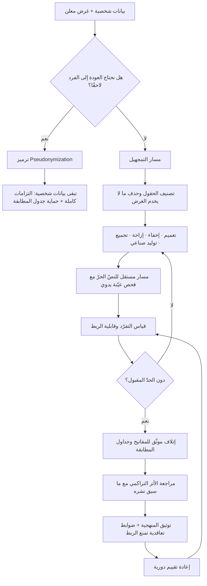

# تمجهيل البيانات (Anonymization)

> [!info] تعريف مختصر
> معالجة تُزيل من البيانات قدرتها على الدلالة على شخص طبيعي معيّن، **إزالة لا رجعة فيها**، بحيث يستحيل — بالوسائل المعقولة المتاحة — ربط السجلّ بصاحبه من جديد. والمعيار الفاصل الذي يُغفَل غالبًا ليس ما حُذف من الحقول، بل **ما إذا كانت الاستعادة ممكنة**: فإن بقي في مكان ما مفتاح أو جدول أو تركيبة سمات تسمح بالعودة إلى الفرد، فما جرى ليس تمجهيلًا بل **إخفاء هوية بالترميز (Pseudonymization)**، والبيانات تبقى بيانات شخصية بكل التزاماتها التنظيمية. التمجهيل الحقيقي هو الإجراء الوحيد الذي يُخرج البيانات من نطاق تنظيمات مثل [[PDPL]] و[[GDPR]] — ولهذا بالذات فإن ادّعاءه دون تحقّق من أخطر الأخطاء الشائعة في المشاريع.

## الشرح العلمي والاحترافي
- **التمييز الجوهري عن Pseudonymization** — وهو أهمّ ما في هذا المصطلح:
  • **الترميز (Pseudonymization)**: يُستبدَل المعرّف المباشر برمز أو مفتاح بديل، ويُحفظ جدول المطابقة في مكان منفصل ومحمي. النتيجة أن الاستعادة **ممكنة ومقصودة** لمن يملك المفتاح. هذا **إجراء أمني مطلوب ومحمود**، لكنه لا يغيّر التصنيف القانوني: البيانات تبقى شخصية، وتبقى عليها الالتزامات كاملةً — الأساس القانوني، وحقوق أصحاب البيانات، وقيود النقل عبر الحدود ([[Data Residency]])، والإبلاغ عند الاختراق.
  • **التمجهيل (Anonymization)**: تُدمَّر الصلة نهائيًّا، ويُتلَف أي مفتاح، ويُخفَّض التفرّد إلى حدّ لا يسمح بالتمييز. النتيجة أن الاستعادة **مستحيلة عمليًّا**، ومن ثمّ تخرج البيانات من نطاق التنظيم.
  والخلط بينهما ليس خطأ لغويًّا بل خطأ في تقدير المخاطرة والامتثال معًا: فريق يظنّ أنه أنجز الأول وهو في الثاني سيشارك بيانات بلا الضوابط الواجبة، وسيصف في مراسلاته الرسمية بيانات شخصية بأنها مجهولة.
- **التمجهيل ليس حدثًا بل خاصّية مقيسة**: لا يوجد إجراء واحد يُقال بعده «تمّ التمجهيل». ما يوجد هو مستوى مخاطرة يُقاس بمقاييس التفرّد وقابلية الربط ([[Re-identification]])، ويُقارَن بحدّ مقبول محدّد مسبقًا. ولهذا يُطلب دائمًا في التوثيق **رقم** لا وصف.
- **الأساليب الأساسية وحدود كل منها**:
  ① **الحذف (Suppression)**: إزالة حقول أو سجلّات كاملة — بسيط لكنه يفقد المعلومة.
  ② **التعميم (Generalization)**: رفع مستوى التجريد — سنة بدل تاريخ، منطقة بدل حيّ، فئة بدل قيمة.
  ③ **الإخفاء والاستبدال (Masking / Substitution)**: استبدال القيم بقيم واقعية الشكل لكنها غير حقيقية — مفيد جدًّا لبيانات الاختبار.
  ④ **الإزاحة والاضطراب (Perturbation / Noise)**: إضافة ضوضاء مضبوطة تحافظ على الخصائص الإحصائية وتُتلف الدقّة الفردية.
  ⑤ **التجميع (Aggregation)**: عدم إخراج بيانات على مستوى الفرد أصلًا، بل إحصاءات — مع الانتباه إلى الخلايا الصغيرة.
  ⑥ **البيانات الصناعية (Synthetic Data)**: توليد مجموعة جديدة تحاكي التوزيعات دون أن تتضمّن أفرادًا حقيقيين — وهي الأقوى لبيئات الاختبار، لكنها تحتاج تحقّقًا من ألّا تكون قد استنسخت سجلّات نادرة كما هي.
  ⑦ **الخصوصية التفاضلية (Differential Privacy)**: إطار رياضي يضيف ضوضاء معايَرة ويقدّم **ضمانًا كمّيًّا** لحدّ ما يمكن استنتاجه عن أي فرد؛ وهو المقاربة الأكثر صرامة نظريًّا، وكلفتها تعقيد وخسارة في الدقّة يجب أن تكون مقبولة للغرض.
- **مفاضلة الفائدة مقابل الخصوصية (Utility–Privacy Trade-off)**: كل خطوة تمجهيل تُتلف قدرًا من القيمة التحليلية. والخطأ الإداري الشائع أن تُدار المفاضلة ضمنيًّا في مستوى تقني، فينتهي الأمر إمّا ببيانات آمنة عديمة الفائدة أو ببيانات مفيدة غير آمنة. الصواب أن تُحسم صراحةً بسؤال معلن: **ما أدنى دقّة تكفي للسؤال التحليلي المطروح؟** فالتمجهيل يُصمَّم للغرض لا على إطلاقه.
- **حدود التمجهيل — ولماذا لا يُعامَل كحلّ نهائي**:
  • **حدّ التفرّد**: بعض السجلّات فريدة بطبيعتها (مريض بحالة نادرة، عميل بحجم تعامل استثنائي)، ولا يمكن إبقاؤها مع الحفاظ على المجهولية؛ يبقى الخيار الحذف أو التجميع.
  • **الحدّ التراكمي**: مجموعتان آمنتان منفردتين قد تكشفان الهوية عند دمجهما، فالتقييم لا يصحّ بمعزل عمّا سبق نشره.
  • **الحدّ الزمني**: المجهولية تتآكل مع ظهور مصادر عامة وتسريبات جديدة؛ فما كان آمنًا قبل سنتين قد لا يكون كذلك اليوم.
  • **حدّ النصّ الحرّ**: الأوصاف السياقية في الملاحظات والتذاكر تحدّد الأشخاص دون ذكر أسماء، ولا تكفي فيها المرشّحات الآلية.
  • **الحدّ الأخلاقي**: التمجهيل يعالج الضرر الفردي ولا يعالج أضرار المجموعات — فقرار يُبنى على بيانات مجهولة قد يميّز ضدّ فئة كاملة دون أن يُعرف فرد واحد.
- **تطبيقه في سياق الذكاء الاصطناعي**: التمجهيل هو الضابط العملي الذي يجعل استخدام النماذج الخارجية ممكنًا دون تصدير بيانات شخصية، وهو البديل البنّاء الوحيد الذي يُجفّف [[Shadow AI]] فعلًا: فمنع الموظّف من لصق بيانات حقيقية بلا توفير أداة تمويه معتمدة يترك المشكلة قائمة. ويُطبَّق كذلك عند إعداد بيانات تدريب أو تقييم ([[Evals]])، وقبل إدخال أي محتوى في قواعد المعرفة التي تغذّي [[Retrieval-Augmented Generation]].
- **البُعد التعاقدي والتنظيمي**: حين يُشارَك ملف موصوف بأنه مجهول، يجب أن يرافقه: توثيق منهجية التمجهيل، ونتيجة قياس التفرّد، ومنع تعاقدي صريح لمحاولة إعادة التحديد أو الربط بمصادر خارجية، وحدّ للاحتفاظ والتزام بالإتلاف. وغياب هذه العناصر يجعل وصف «مجهول» ادّعاءً غير قابل للدفاع أمام أي مدقّق ([[Vendor Management]] و[[Controller vs Processor]]).

## أين ومتى يُستخدم
- **قبل استخدام أي نموذج أو أداة خارجية على بيانات حقيقية**: التمجهيل هو ما ينقل الاستخدام من مخالفة محتملة إلى ممارسة معتمدة، ويجب أن يكون متاحًا كأداة سهلة لا كإجراء بيروقراطي.
- **في تجهيز بيئات الاختبار والتطوير ([[Staging vs Production Environment]])**: بيانات صناعية أو مموّهة بدل نسخ الإنتاج، وهو من أعلى بنود المخاطرة عائدًا على الجهد.
- **عند مشاركة البيانات مع باحثين أو شركاء أو مورّدين ([[Vendor Management]])**: مع توثيق المنهجية ونتيجة قياس التفرّد والضوابط التعاقدية.
- **في تصميم التحليلات ولوحات المؤشّرات ([[Product Analytics]])**: التجميع وحدود الخلايا الدنيا يمنعان كشف الأفراد من تقارير تبدو إحصائية.
- **في تقييم أثر الخصوصية وتوثيق المعالجة ([[ROPA]])**: يُسجَّل مستوى التمجهيل لكل تدفّق، ويُبنى عليه تحديد ما يخضع للتنظيم وما لا يخضع.
- **عند النقل عبر الحدود ([[Data Residency]] و[[Standard Contractual Clauses]])**: التمجهيل الحقيقي يغيّر طبيعة الالتزام جذريًّا، والترميز وحده لا يغيّره.
- **في تعريف الجاهزية للإطلاق ([[Definition of Done]])**: بند إلزامي بإرفاق نتيجة قياس لا وصف نصّي.

## مثال وسيناريو تطبيقي
> [!example] شركة تقنية مالية في المنطقة أرادت استخدام نموذج لغوي خارجي لتصنيف شكاوى العملاء تلقائيًّا وتوجيهها إلى الفرق المختصّة. حجم البيانات: 140,000 شكوى سنويًّا، ومتوسّط زمن التوجيه اليدوي 6 ساعات، والهدف خفضه إلى دقائق.
> اعترض فريق الالتزام على تمرير نصوص الشكاوى إلى مزوّد خارجي، فاقترح فريق المنتج حلًّا بدا كافيًا: استبدال اسم العميل ورقم حسابه برمز ثابت قبل الإرسال، والاحتفاظ بجدول المطابقة داخليًّا لإعادة ربط النتيجة بالعميل. سُمّي الحل في العرض التقديمي «تمجهيل البيانات».
> رفضه فريق الالتزام لسببين محدّدين: ① وجود جدول المطابقة يعني أن الاستعادة ممكنة ومقصودة، فهذا **ترميز لا تمجهيل**، والبيانات تبقى شخصية وتنطبق عليها قيود النقل عبر الحدود كاملةً. ② الأخطر: نصّ الشكوى نفسه لم يُمسّ. وأظهر فحص عيّنة من 300 شكوى أن 41% منها تتضمّن داخل النصّ ما يعرّف صاحبه بلا حاجة إلى اسم — رقم الحوالة، أو اسم التاجر مع تاريخ العملية، أو عبارات مثل «تحويل راتبي من جهة عملي الجديدة».
> ما نُفِّذ بعد إعادة التصميم: ① بُنيت طبقة معالجة **داخل** نطاق الشركة تنقّي النصّ من أنماط محدّدة (أرقام الحسابات والحوالات والهواتف والمبالغ الدقيقة)، مع فحص يدوي دوري على عيّنة لقياس معدّل التسرّب. ② حُدّد أن ما يُرسَل خارجًا هو النصّ المنقّى فقط، بلا أي معرّف ولا رمز، مع رقم دفعة عابر يُتلَف بعد استلام النتيجة. ③ للتدريب والتقييم، وهو ما كان يحتاج بيانات دائمة، وُلِّدت مجموعة صناعية من 12,000 شكوى تحاكي التوزيعات اللغوية والفئات دون أن تتضمّن حالة حقيقية واحدة، ومرّت بتحقّق يستبعد التطابق الحرفي مع أي سجلّ أصلي. ④ وُقّع مع المزوّد ملحق يمنع استخدام المدخلات في التدريب ويحدّد الاحتفاظ بصفر يوم. ⑤ سُجّل التدفّق كاملًا في [[ROPA]] بوصفه معالجة لبيانات **منقّاة لا مجهولة**، تجنّبًا لأي ادّعاء لا يمكن الدفاع عنه.
> النتيجة: انخفض زمن التوجيه إلى 4 دقائق، ومرّ التدقيق التنظيمي في العام التالي دون ملاحظات على هذا التدفّق. والدرس الذي دوّنه الفريق في [[Decision Log]]: **الفارق بين تسمية الإجراء تمجهيلًا وتسميته ترميزًا لم يكن فرقًا في المصطلح، بل هو ما حدّد ما إذا كان المشروع قانونيًّا أصلًا.**

## خطوات أو مخطّط
1. اكتب الغرض التحليلي بدقّة أولًا؛ فالتمجهيل يُصمَّم للغرض، وما لا يخدمه يُحذف بلا نقاش.
2. اسأل السؤال الفاصل: هل نحتاج إمكان العودة إلى الفرد؟ فإن كانت الإجابة نعم، فأنت في **الترميز** والتزاماته، وسمّه باسمه في كل مستند.
3. صنّف الحقول: معرّفات مباشرة، شبه معرّفات، سمات حسّاسة، غير ذي صلة.
4. اختر الأسلوب المناسب لكل حقل: حذف، تعميم، إخفاء، إزاحة، تجميع، أو توليد صناعي.
5. عالج النصّ الحرّ بمسار مستقلّ، وافحص عيّنة يدويًّا لقياس معدّل التسرّب قبل الاعتماد على أي أداة آلية.
6. قِس النتيجة كمّيًّا: نسبة السجلّات الفريدة، وقابلية الربط بالمصادر المتاحة للطرف المتلقّي ([[Re-identification]]).
7. أتلف المفاتيح وجداول المطابقة إتلافًا موثّقًا إن كان الهدف تمجهيلًا حقيقيًّا؛ فبقاؤها ينقض الوصف كله.
8. راجع الأثر التراكمي مع ما سبق نشره أو مشاركته من البيانات نفسها.
9. وثّق المنهجية والنتيجة والحدّ المقبول المتّفق عليه، وأرفقها بأي مشاركة.
10. أضف الضوابط التعاقدية: منع الربط، وحدّ الاحتفاظ، والالتزام بالإتلاف، وقيود إعادة المشاركة.
11. أعد التقييم دوريًّا، فالمجهولية تتآكل بمرور الوقت.

## ⚠️ مفاهيم خاطئة شائعة
> [!warning]
> - **«الترميز والتمجهيل مترادفان.»** الفارق هو إمكان الاستعادة: الترميز يُبقيها بحفظ مفتاح، والتمجهيل يُلغيها. وعليه فالمرمَّز يبقى بيانات شخصية بكل التزاماتها، والمُمجهَل يخرج من نطاق التنظيم. التصحيح: احسم التسمية في أول مستند للمشروع، فهي تحدّد المسار القانوني كله.
> - **«حذف المعرّفات المباشرة يكفي.»** التفرّد ينشأ من تقاطع شبه المعرّفات، وقد يبقى ثلث السجلّات مميَّزًا بثلاثة حقول لا يعدّها أحد معرّفات. التصحيح: قِس التفرّد بدل الاستدلال بغياب حقول الاسم والهوية.
> - **«التمجهيل حالة نهائية دائمة.»** المجهولية تتآكل مع ظهور مصادر عامة وتسريبات ودمج مجموعات لاحقة. التصحيح: عامله كتقييم مخاطرة يُعاد دوريًّا، لا شهادة تُمنَح مرة.
> - **«التشفير يعني تمجهيلًا.»** التشفير يحمي البيانات أثناء التخزين والنقل، والبيانات تعود كاملة لمن يملك المفتاح — فهو ضابط حماية لا إزالة هوية. التصحيح: لا تخلط ضوابط السرّية بضوابط تصنيف البيانات.
> - **«البيانات الصناعية آمنة تلقائيًّا.»** قد يستنسخ المولّد سجلّات نادرة كما هي إن لم تُضبط عملية التوليد، فتتسرّب حالات فريدة بعينها. التصحيح: أضف تحقّقًا يستبعد التطابق القريب مع السجلّات الأصلية، وقِسه.
> - **«ما دامت البيانات مجهولة فلا اعتبارات أخلاقية.»** التمجهيل يعالج الضرر على الفرد لا على المجموعة؛ فنموذج مبني على بيانات مجهولة قد يُنتج قرارات تمييزية ضدّ فئة كاملة. التصحيح: أبقِ مراجعة الأثر على الفئات قائمة بصرف النظر عن حالة التمجهيل.
> - **«التمجهيل عبء يبطئ المشروع.»** توفير أداة تمويه سهلة هو غالبًا ما يفتح الباب لاستخدامات كانت ممنوعة كليًّا، ويقلّص [[Shadow AI]] أكثر من أي سياسة منع. التصحيح: عامله ممكّنًا لا عائقًا، واستثمر في جعله أمرًا بضغطة واحدة.

## ❌ ممارسات خاطئة في المشاريع
> [!failure]
> - **وصف الترميز بأنه تمجهيل في مستندات المشروع والعروض.** الخطأ: تسمية استبدال المعرّف برمز «تمجهيلًا» مع الاحتفاظ بجدول المطابقة. لماذا يضرّ: يُسقط التزامات كاملة عن التدفّق ويمرّ من الموافقات على أساس غير صحيح، وينكشف عند أول تدقيق. الحل: افصل المصطلحين في القاموس الداخلي، واشترط في مراجعة الالتزام سؤالًا واحدًا: هل يوجد مفتاح؟ وأين؟
> - **معالجة النصّ الحرّ بالأداة نفسها المستخدمة للحقول المنظّمة.** الخطأ: تمرير الملاحظات على مرشّح أنماط ثم اعتبارها نظيفة. لماذا يضرّ: تُلتقط الأرقام والأسماء وتبقى الأوصاف السياقية التي تحدّد الشخص بلا لبس. الحل: افحص عيّنة يدويًّا وقِس معدّل التسرّب، واستبعد الحقل إن تجاوز الحدّ.
> - **تنفيذ التمجهيل خارج نطاق الشركة.** الخطأ: إرسال البيانات الخام إلى خدمة خارجية لتمويهها. لماذا يضرّ: يقع النقل غير المصرّح به قبل التمويه لا بعده، فيُنقض الغرض كله. الحل: نفّذ المعالجة داخل النطاق المصرّح به، ولا يخرج إلا الناتج.
> - **تمجهيل شامل بلا ربط بالغرض التحليلي.** الخطأ: تطبيق أعلى مستوى تمويه على كل الحقول احتياطًا. لماذا يضرّ: يُتلف قيمة البيانات فيهجرها المستخدمون ويعودون إلى النسخ الحقيقية سرًّا. الحل: صمّم مستوى التمويه للسؤال التحليلي المحدّد، وحاور أصحاب المصلحة في المفاضلة صراحةً.
> - **الاحتفاظ بجدول المطابقة «احتياطًا» بعد انتهاء الحاجة.** الخطأ: إبقاء المفتاح في نسخة احتياطية أو ملف لدى أحد الفرق. لماذا يضرّ: ينقض صفة التمجهيل بأثر رجعي ويحوّل كل ما بُني عليها إلى ادّعاء باطل. الحل: أدرج إتلاف المفاتيح كخطوة موثّقة بمالك وتاريخ، وتحقّق من النسخ الاحتياطية.
> - **الاكتفاء بوصف نصّي بدل نتيجة قياس.** الخطأ: عبارة «تمّ تمجهيل البيانات» في محضر التسليم. لماذا يضرّ: لا يمكن مراجعته ولا الطعن فيه ولا إعادة إنتاجه، ويغلق باب التدقيق اللاحق. الحل: اشترط إرفاق منهجية ونسبة تفرّد مقيسة وحدًّا مقبولًا متّفقًا عليه.
> - **إغفال الضوابط التعاقدية عند المشاركة.** الخطأ: تسليم ملف مجهول بلا اتفاق يمنع محاولة إعادة التحديد أو الربط. لماذا يضرّ: التمجهيل التقني وحده لا يمنع طرفًا لديه بيانات مكمّلة من كسره، ولا يترك للمؤسّسة أي سند عند الخرق. الحل: اجعل بند منع إعادة التحديد وحدّ الاحتفاظ شرطًا لا يُتنازل عنه في أي مشاركة.

## 🔗 مصطلحات ومفاهيم ذات صلة
[[Re-identification]] | [[Shadow AI]] | [[Least Privilege]] | [[Grounding]] | [[PDPL]] | [[GDPR]] | [[Data Residency]] | [[ROPA]] | [[Controller vs Processor]] | [[Standard Contractual Clauses]] | [[Staging vs Production Environment]] | [[Evals]]
