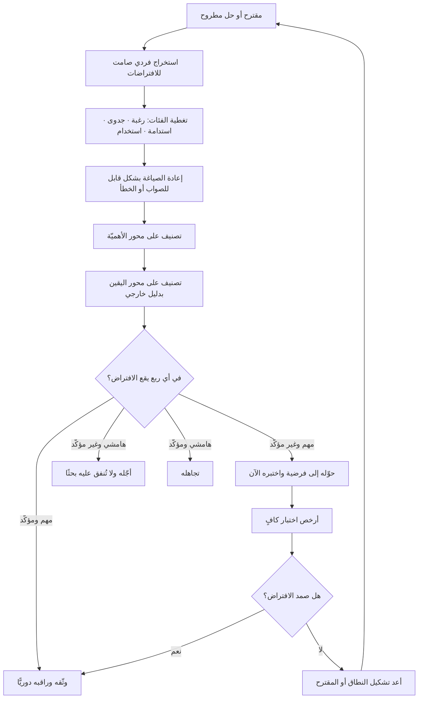

# رسم الافتراضات (Assumption Mapping)

> [!info] تعريف مختصر
> ممارسة منظَّمة تُستخرج فيها **كل** الاعتقادات غير المُثبتة التي يتوقّف عليها نجاح مقترح ما، ثم تُصنَّف على بُعدين: **مدى أهميّتها** (لو تبيّن أنها خاطئة، هل ينهار المقترح أم يتأثّر قليلًا؟) و**مدى يقيننا فيها** (كم لدينا من دليل حقيقي، لا انطباع؟). الافتراضات التي تجتمع فيها الأهميّة العالية واليقين المنخفض هي **مناطق الخطر** التي يجب اختبارها أولًا وبأرخص وسيلة ممكنة. المخرَج ليس لوحة جميلة، بل **ترتيب أولويات البحث والتجارب** مبنيًّا على المخاطرة لا على الحماس.

## الشرح العلمي والاحترافي
- **الفرضية المركزية للأداة**: الفرق نادرًا ما تفشل لأنها بنت الشيء بشكل رديء، بل لأنها بنت الشيء الصحيح ظاهريًّا فوق افتراض خاطئ لم ينتبه أحد إلى أنه افتراض أصلًا. الافتراض الأخطر هو ذاك الذي لا يُصرَّح به لأنه يبدو بديهيًّا للجميع داخل الغرفة — وهذا بالضبط ما يجعل عملية الاستخراج الشكلية (كتابة الافتراضات على الورق واحدًا واحدًا) ذات قيمة تفوق ما تبدو عليه.
- **البُعدان وشبكة الأرباع**: يُرسم مستوى مربّع، المحور الرأسي **الأهميّة** (من هامشي إلى «ينهار المشروع بدونه») والأفقي **اليقين** (من «لا دليل إطلاقًا» إلى «مُثبت ببيانات»). ينتج عن ذلك أربعة أرباع: **مهم/غير مؤكّد** — اختبِر الآن؛ **مهم/مؤكّد** — وثّق وراقب ولا تُنفق عليه بحثًا؛ **هامشي/غير مؤكّد** — أجّل ولا تشغل به الفريق؛ **هامشي/مؤكّد** — تجاهل. أغلب قيمة الأداة تأتي من الربع الأول وحده، وأكبر هدر في الفرق يقع في الربع الثالث حيث تُنفَق شهور بحث على تفاصيل لا تغيّر قرارًا.
- **الأنواع الأربعة للافتراضات**: يُستحسن استخراجها بحسب فئات لضمان التغطية: **افتراضات الرغبة (Desirability)** — هل يريد أحد هذا فعلًا؟ **افتراضات الجدوى التقنية (Feasibility)** — هل نستطيع بناءه وتشغيله بموثوقية؟ **افتراضات الاستدامة (Viability)** — هل يُحقّق قيمة تفوق كلفته على المدى المطلوب؟ **افتراضات القابلية للاستخدام (Usability)** — هل يستطيع الناس فعلًا استعماله دون تدريب مكلف؟ إغفال فئة كاملة أمر شائع، وأكثر الفئات إغفالًا في المؤسسات الكبيرة هي الرغبة، لأنها تُفترض ضمنًا بحكم أن الإدارة طلبت المشروع.
- **مصطلح «افتراضات القفزة الإيمانية» (Leap of Faith Assumptions)**: يُستخدم في أدبيات الشركات الناشئة الرشيقة للدلالة على الافتراضات التي يقوم عليها كامل المشروع، والتي إن سقطت سقط كل ما بُني فوقها. رسم الافتراضات هو الإجراء العملي الذي يجعل هذه القفزات مرئية بدل أن تظل ضمنية.
- **التمييز الحاسم بين «دليل» و«اقتناع»**: المحور الأفقي يُخرّبه الفريق عادةً بوضع افتراضات في خانة اليقين لمجرّد أن الجميع متّفق عليها. القاعدة الضابطة: لا يرتفع افتراض على محور اليقين إلا بدليل **خارجي** — سلوك مرصود، بيانات استخدام، عقد موقّع، اختبار فعلي — لا برأي داخلي مهما علت رتبة قائله. الاتفاق داخل الغرفة ليس دليلًا؛ بل هو غالبًا مؤشّر على أن الجميع يشترك في العمى نفسه.
- **علاقتها بالفرضيات والاختبار**: كل افتراض في الربع الخطِر يتحوّل إلى [[Hypothesis]] بشرط إبطال، ثم يُختار له أرخص اختبار كافٍ. هذا الترتيب هو ما يمنع الفريق من إنفاق ميزانية بناء كاملة للإجابة عن سؤال كان يمكن حسمه بخمس مقابلات ([[User Interview]]) أو صفحة تسجيل مسبق.
- **صلتها بإدارة المخاطر**: الافتراض غير المُختبَر عالي الأثر هو تعريف عملي للمخاطرة، ولذلك تنتقل مخرجات الرسم مباشرة إلى [[Risk Register]] و[[RAID Log]]. الفرق الجوهري أن سجلّ المخاطر يميل إلى رصد ما قد يسوء أثناء التنفيذ، بينما رسم الافتراضات يستهدف ما قد يكون خاطئًا في **أساس الفكرة** — وهو أخطر لأنه لا يظهر في مؤشّرات التنفيذ إطلاقًا: قد يسير المشروع في الوقت والميزانية تمامًا وينتهي بمنتج لا يحتاجه أحد.
- **إعادة الرسم دورية**: الخريطة ليست حدثًا مرة واحدة. مع كل موجة بحث تنتقل افتراضات من الخطر إلى اليقين، وتظهر افتراضات جديدة لم تكن مرئية. الفرق الناضجة تعيد الرسم عند كل نقطة قرار كبرى ([[Go or No-Go Decision]]) وعند كل تغيّر في النطاق.

## أين ومتى يُستخدم
- **قبل اعتماد ميزانية أي مبادرة**: مرفقًا بـ[[Business Case]]، بحيث يرى الراعي ([[Sponsor]]) على أي افتراضات بالضبط تقوم الأرقام المعروضة، وما الذي سيُختبر قبل صرف الدفعة الكبرى.
- **في تخطيط جولات الاكتشاف**: لتحديد ما الذي يستحق البحث هذا الأسبوع ضمن [[Continuous Discovery]] و[[Product Discovery]]، فيتحوّل البحث من نشاط عام إلى استهداف مقصود لأخطر مجهول.
- **عند تحديد نطاق [[MVP]]**: الحد الأدنى الصالح هو الأصغر الذي يكفي لاختبار أخطر افتراض، لا الأصغر الذي يمكن برمجته.
- **في مراجعة مقترحات الموردين**: عند تقييم عرض خارجي ([[Vendor Management]])، يكشف رسم افتراضات العرض ما بناه المورّد على وعود غير مُثبتة — كجاهزية البيانات أو توفّر واجهات تكامل.
- **في مشاريع الترحيل والتكامل**: كثير من افتراضات الجدوى تتعلّق بجودة البيانات القائمة، وتُختبر عمليًّا عبر [[Data Dry Run]] و[[Fit-Gap Analysis]] قبل الالتزام بجدول زمني.
- **في مراجعات ما بعد الحوادث**: عند تحليل سبب جذري ([[Root Cause Analysis]])، يكون السؤال المفيد: أي افتراض كان قائمًا ولم يُختبر، وكيف نجعله مرئيًّا في المرة القادمة؟

## مثال وسيناريو تطبيقي
> [!example] جهة حكومية خليجية تعتزم إطلاق خدمة رقمية تتيح للمنشآت الصغيرة تجديد رخصها ذاتيًّا بدل مراجعة الفروع. الميزانية المقترحة 2.4 مليون ريال ومدّة 11 شهرًا. قبل الاعتماد، عقد الفريق جلسة رسم افتراضات مدّتها ثلاث ساعات وحضرها ممثّلون عن التقنية والعمليات والامتثال ومركز الاتصال، فاستُخرج 34 افتراضًا.
> بعد التصنيف وقعت أربعة افتراضات في ربع «مهم جدًّا / يقين منخفض»:
> ① **الرغبة**: أصحاب المنشآت الصغيرة يفضّلون الإنجاز الذاتي على إرسال مُعقّب (وسيط) يتولّى المعاملة نيابة عنهم.
> ② **الجدوى**: سجلّ العناوين الوطني متطابق مع بيانات الرخص القائمة بنسبة تكفي للتحقّق الآلي.
> ③ **القابلية للاستخدام**: صاحب المنشأة يستطيع إتمام التحقّق من الهوية على الجوال دون مساعدة.
> ④ **الاستدامة**: تحوّل 60% من المعاملات إلى القناة الرقمية سيخفض الضغط على الفروع فعليًّا.
> رتّب الفريق الاختبارات بحسب الكلفة. الافتراض ② كان الأرخص اختبارًا: مطابقة عيّنة 5,000 سجلّ استغرقت ثلاثة أيام، وأظهرت تطابقًا في 71% فقط — أي أن نحو ثلث المعاملات ستتعثّر في التحقّق الآلي، وهو ما كان سيظهر في مرحلة القبول ([[UAT]]) بعد تسعة أشهر لو لم يُختبر مبكّرًا.
> أما الافتراض ① فاختُبر بـ12 مقابلة ميدانية. النتيجة صدمت الفريق: 9 من 12 قالوا إنهم سيستمرّون في استخدام المُعقّب حتى مع وجود خدمة ذاتية، لا لصعوبة تقنية بل لأن الوسيط يتحمّل مسؤولية الخطأ ويتابع حتى الإنجاز. الافتراض الحقيقي المكشوف لم يكن عن الواجهة بل عن **من يتحمّل المخاطرة**.
> النتيجة: أُعيد تشكيل النطاق. أُدرج مسار تحقّق يدوي احتياطي للثلث المتعثّر، وأُضيفت واجهة تفويض تسمح لصاحب المنشأة بتوكيل طرف ثالث داخل النظام نفسه بدل محاربة سلوك قائم. تأجّل جزء من النطاق الأصلي، وانخفضت الميزانية المعتمدة للمرحلة الأولى إلى 1.3 مليون. الجلسة التي كلّفت ثلاث ساعات وثلاثة أسابيع اختبار غيّرت هيكل مشروع بملايين.

## خطوات أو مخطّط
1. اكتب المقترح أو الحل في جملة واحدة، وضع أمامه [[Problem Statement]] الذي يدّعي حلّه.
2. اجمع فريقًا متعدّد التخصّصات ([[Cross-functional Team]]) يشمل من يعرف القيود التشغيلية والقانونية، لا فريق المنتج وحده.
3. استخرج الافتراضات بصمت أولًا وبشكل فردي، لتفادي انسياق المجموعة خلف أول رأي يُطرح.
4. غطِّ الفئات الأربع صراحة: رغبة، جدوى تقنية، استدامة، قابلية للاستخدام — واسأل عن كل فئة على حدة.
5. أعد صياغة كل افتراض بصيغة قابلة للصواب أو الخطأ، لا بصيغة سؤال أو تمنٍّ.
6. صنّف كل افتراض على محور الأهميّة: لو ثبت خطؤه، ما الذي ينهار؟
7. صنّفه على محور اليقين، مشترطًا دليلًا خارجيًّا لا اتفاقًا داخليًّا.
8. اختر أعلى ثلاثة إلى خمسة افتراضات في ربع الخطر — لا أكثر، لأن قائمة طويلة تعني عمليًّا غياب أولوية.
9. حوّل كلًّا منها إلى [[Hypothesis]] بعتبة وشرط إبطال.
10. صمّم أرخص اختبار كافٍ لكل منها، وحدّد له موعدًا ومسؤولًا.
11. سجّل الافتراضات التي بقيت غير مختبرة في [[Risk Register]] بوصفها مخاطر معلنة لا مسكوتًا عنها.
12. أعد الرسم عند كل نقطة قرار كبرى وبعد كل موجة بحث.

## ⚠️ مفاهيم خاطئة شائعة
> [!warning]
> - **«الافتراضات هي المخاطر نفسها»**: ليس تمامًا. المخاطرة حدث محتمل قد يقع أثناء التنفيذ ويُدار باحتمال وأثر؛ الافتراض اعتقاد قائم **الآن** قد يكون خاطئًا من الأساس. المشروع قد ينجح في إدارة كل مخاطره ويفشل لأن افتراضًا في جذر الفكرة كان باطلًا.
> - **«اتفاق الفريق دليل على صحّة الافتراض»**: خطأ خطير. الاتفاق قد يعني اشتراكًا في المصدر نفسه من المعلومات المغلوطة. اليقين يُشترى بالدليل الخارجي وحده، ورأي المدير الأعلى ليس دليلًا بل افتراضًا برتبة أعلى.
> - **«الجلسة مفيدة كتمرين تفكير حتى لو لم تُغيّر شيئًا»**: خطأ. رسم الافتراضات بلا اختبارات لاحقة يُنتج لوحة مؤرشفة وشعورًا زائفًا بالانضباط. المخرَج الوحيد الذي يُعتدّ به هو قائمة اختبارات لها مواعيد ومسؤولون.
> - **«كلما زاد عدد الافتراضات المستخرجة كانت الجلسة أنجح»**: خطأ. العدد الكبير قيمته في التغطية فقط؛ أما القيمة الحقيقية فتتحقّق عند التركيز على حفنة صغيرة في ربع الخطر. قائمة بمئة افتراض «مهم» تساوي قائمة بلا أولويات.
> - **«الافتراضات التقنية وحدها هي المهمّة لأنها ملموسة»**: خطأ شائع في الفرق الهندسية. أكثر المشاريع فشلًا تُبنى بجودة تقنية عالية على افتراض رغبة باطل — أي منتج يعمل بإتقان ولا يريده أحد.
> - **«الرسم مناسب لبداية المشروع فقط»**: خطأ. مع كل تغيّر في النطاق أو السوق أو التنظيم تنشأ افتراضات جديدة، وقد تنقلب افتراضات كانت مؤكّدة إلى مشكوك فيها.

## ❌ ممارسات خاطئة في المشاريع
> [!failure]
> - **تصنيف الافتراضات «مؤكّدة» استنادًا إلى خبرة الفريق**: الخطأ أن يُقال «نحن نعرف هذا السوق منذ عشر سنوات». لماذا يضرّ: يُخرج أخطر الافتراضات من دائرة الاختبار تحديدًا لأنها الأقدم والأكثر رسوخًا، والسوق يتغيّر أسرع من القناعات. الحل: اشترط ذكر مصدر الدليل وتاريخه بجانب كل افتراض في الربع المؤكّد؛ الدليل الذي يزيد عمره على عام يُعاد فحصه.
> - **إجراء الجلسة بحضور فريق المنتج وحده**: الخطأ أن تُستبعد العمليات والامتثال والدعم. لماذا يضرّ: تُغفل فئات كاملة من افتراضات الجدوى والاستدامة، فتظهر متأخّرة على شكل عوائق ([[Blocker]]) في مرحلة التنفيذ. الحل: اجعل حضور من يشغّل الخدمة ومن يجيب على مكالمات عملائها شرطًا لانعقاد الجلسة.
> - **اختبار الافتراضات السهلة بدل الخطرة**: الخطأ أن يبدأ الفريق بما يجيد اختباره لا بما يهدّد المشروع. لماذا يضرّ: يستهلك وقت البحث في تأكيد ما هو مؤكّد أصلًا، ويصل المشروع إلى نقطة اللاعودة والافتراض القاتل لم يُمَس. الحل: رتّب حسب حاصل (الأهميّة × عدم اليقين)، ثم ضمن الترتيب اختر الأرخص أولًا — لا العكس.
> - **تحويل كل افتراض إلى مشروع بحثي كامل**: الخطأ أن يُطلَب لكل بند دراسة سوق مفصّلة. لماذا يضرّ: يتوقّف الاكتشاف بسبب كلفته وينهار الالتزام به بعد الجولة الأولى. الحل: التزم بقاعدة «أرخص اختبار كافٍ»؛ خمس مقابلات أو مطابقة عيّنة بيانات قد تكفي تمامًا للحسم.
> - **إغفال افتراضات «عدم الفعل»**: الخطأ أن تُختبر افتراضات الحل الجديد فقط دون افتراض أن الوضع الحالي سيّئ فعلًا. لماذا يضرّ: قد يكون البديل القائم — ولو كان يدويًّا — أكفأ مما يُظن، فيُبنى حل يزيح شيئًا يعمل. الحل: أدرج صراحة افتراضًا بصيغة «الطريقة الحالية مكلفة بمقدار كذا» واختبره ببيانات فعلية.
> - **إخفاء الافتراضات الباطلة عن الرعاة بعد ظهور نتائجها**: الخطأ أن يُعرض على اللجنة ما صمد فقط. لماذا يضرّ: يفقد الرعاة القدرة على تعديل النطاق مبكّرًا وتُتّخذ قرارات على صورة زائفة، وحين تنكشف تُدمَّر الثقة بكل البحث السابق. الحل: اجعل «الافتراضات التي بطلت» بندًا ثابتًا في [[Project Health Report]] وفي كل مراجعة توجيهية.
> - **ترك ربع الخطر بلا مالك ولا موعد**: الخطأ أن تُختم الجلسة بلوحة ملوّنة دون تكليف. لماذا يضرّ: تعود الأولويات اليومية للسيطرة خلال أسبوع وتُنسى الخريطة. الحل: لا تُغلق الجلسة قبل أن يكون لكل افتراض خطِر اسم مسؤول وتاريخ حسم مُدرَج في [[Decision Log]].

## 🔗 مصطلحات ومفاهيم ذات صلة
[[Problem Statement]] | [[Hypothesis]] | [[User Interview]] | [[The Mom Test]] | [[Confirmation Bias]] | [[Risk Register]] | [[RAID Log]] | [[MVP]] | [[Product Discovery]] | [[Continuous Discovery]] | [[Business Case]] | [[Go or No-Go Decision]]
