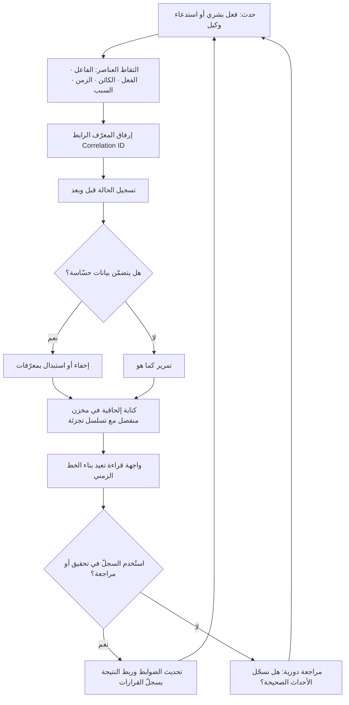

# سجلّ التدقيق (Audit Trail)

> [!info] تعريف مختصر
> سجلّ زمنيّ مرتّب وغير قابل للتلاعب، يوثّق **ما حدث، ومن فعله، ومتى، ولماذا، وبأي بيانات ونتيجة**، بحيث يمكن لطرف ثالث لم يحضر الحدث أن يعيد بناء مسار العمل كاملًا بعد وقوعه ويحكم عليه. وهو في سياق الأنظمة التقليدية سجلّ للعمليات على البيانات (إنشاء، تعديل، حذف، وصول)، أما في سياق الأنظمة الوكيلة (Agentic) والذكاء الاصطناعي فيتّسع ليشمل **نيّة التشغيل وسياقه**: الهدف المُعطى للوكيل، والسياق الذي اطّلع عليه، وسلسلة الخطوات التي نفّذها، والأدوات التي استدعاها بأي مُدخلات، ونقطة المصادقة البشرية إن وُجدت، والمخرَج النهائي. الفارق الجوهري بينه وبين "اللوق" (Log) التقني أن سجلّ التدقيق مكتوب **ليُقرأ من إنسان يحاسِب**، لا ليُستهلك من مهندس يصحّح خطأ.

## الشرح العلمي والاحترافي
- **الأصل محاسبي لا تقني**: مصطلح Audit Trail وُلد في مهنة المحاسبة والمراجعة، حيث يعني القدرة على تتبّع أي رقم في القوائم المالية رجوعًا إلى المستند الأصلي الذي أنشأه (فاتورة، إذن صرف، عقد)، وتقدّمًا من المستند إلى موضعه في القوائم. هذه الفكرة — «التتبّع في الاتجاهين» — هي جوهر المصطلح حتى بعد انتقاله إلى أنظمة المعلومات: سجلّ التدقيق الجيّد يسمح لك أن تبدأ من نتيجة وتصل إلى سببها، وأن تبدأ من فعل وتصل إلى أثره.
- **العناصر السبعة لأي قيد سليم**: القيد الناقص لا يقلّ ضررًا عن غيابه لأنه يعطي وهم التوثيق. القيد المكتمل يجيب عن: **من (Actor** — إنسان أم وكيل أم خدمة، وبأي هوية)، **ماذا (Action)**، **على ماذا (Object** — المورد المتأثّر ومعرّفه)، **متى (Timestamp** بتوقيت موحّد وليس بتوقيت الجهاز المحلّي)، **من أين (Origin** — الجلسة، النظام، القناة)، **لماذا (Reason/Correlation** — الطلب أو التذكرة أو الهدف الذي يربط الفعل بسياقه)، و**ما النتيجة (Outcome** — نجاح أم فشل، وما الحالة قبل وبعد).
- **معيار "الحالة قبل وبعد" (Before/After State)**: أشهر عيوب سجلّات التدقيق أنها تسجّل «فلان عدّل السجل رقم 402» دون تسجيل ما كانت قيمته وما صارت. عمليًّا، هذا القيد عديم القيمة عند النزاع. السجلّ الجاد يحفظ القيمة السابقة والقيمة الجديدة (أو على الأقل بصمة تشفيرية تثبتها) لكل حقل حسّاس.
- **عدم القابلية للتعديل (Immutability) وفصل الصلاحيات**: سجلّ التدقيق الذي يستطيع الفاعل نفسه حذفه أو تعديله ليس سجلّ تدقيق. الضوابط المعتادة: كتابة الإلحاق فقط (Append-only)، وتخزين منفصل عن قاعدة البيانات التشغيلية، وصلاحيات قراءة/كتابة مفصولة عن صلاحيات الإدارة، وتسلسل تجزئة (Hash chain) يجعل حذف قيد وسطي مكتشَفًا. وهذا يرتبط مباشرة بـ[[Governance]] لأن مالك السجلّ يجب ألّا يكون هو الجهة الخاضعة للتدقيق.
- **الفرق بينه وبين ثلاثة مفاهيم مجاورة**: **الـLog التقني** غرضه التشخيص، عمره قصير، ولغته للمهندس. **الـ[[Decision Log]]** غرضه توثيق القرارات وبدائلها ومبرّراتها، وهو بشريّ المصدر ومنخفض التواتر. **الـ[[Issue Log]]** غرضه تتبّع المشكلات المفتوحة. أما سجلّ التدقيق فغرضه **إثبات ما جرى فعلًا** بصورة يقبلها طرف محايد. الأنظمة الناضجة تربط الثلاثة: قيد التدقيق يشير إلى القرار الذي أذن به، والقرار يشير إلى المشكلة التي استدعته.
- **البُعد التنظيمي والقانوني**: كثير من الأطر الرقابية تشترط سجلّات تدقيق صراحةً أو ضمنًا — من متطلبات إثبات المعالجة والوصول إلى البيانات الشخصية في [[GDPR]] و[[PDPL]] (ويتقاطع ذلك مع [[ROPA]] كسجلّ لأنشطة المعالجة)، إلى ممارسات إدارة الخدمة في [[ITIL 4]] التي تربط كل تغيير بسجلّ يوثّقه. القاعدة العملية: **إن لم تستطع إثباته فلم يحدث** — من منظور المدقّق، غياب الدليل يعادل غياب الضابط.
- **الاتساع في الأنظمة الوكيلة**: حين ينفّذ [[AI Agent]] سلسلة خطوات بنفسه، لا يكفي تسجيل المخرَج. ما يحتاجه المدقّق: الهدف (Prompt/Goal) كما وصل، والسياق المُسترجَع (مصادره ونسخته — انظر [[Retrieval-Augmented Generation]])، وقائمة استدعاءات الأدوات بمُدخلاتها ومخرجاتها (عبر واجهات مثل [[MCP]])، والنموذج ونسخته وإعداداته، ونقطة توقّف الوكيل لطلب مصادقة إنسان ([[Human in the Loop]]) ومن صادق. سبب هذا التشدّد أن مخرجات النماذج غير حتمية ([[Non-determinism]])، فإعادة تشغيل الطلب نفسه قد لا تُنتج المسار نفسه؛ ومن ثمّ فالسجلّ هو **النسخة الوحيدة القابلة للتدقيق** من الحدث.
- **التوتّر مع الخصوصية**: السجلّ الذي يخزّن كل شيء يتحوّل إلى مستودع بيانات حسّاسة عالي الخطورة، ويصبح هدفًا أمنيًّا في ذاته. الحل ليس تقليل التوثيق بل **هندسته**: تخزين المعرّفات بدل المحتوى الكامل حين يكفي، وإخفاء الحقول الشخصية (Redaction/Masking)، وسياسة احتفاظ زمنية صريحة، وضوابط وصول على السجلّ نفسه — مع تسجيل من قرأ السجلّ أيضًا.

## أين ومتى يُستخدم
- **عند تشغيل وكلاء أو أتمتة تنفّذ إجراءات ذات أثر**: كل إجراء يمسّ بيانات أو مالًا أو عميلًا يحتاج قيدًا يربطه بهدفه ومصادقته، خصوصًا مع [[Guard Rails]] و[[Human in the Loop]].
- **في إدارة التغيير والإصدارات**: ربط كل [[Change Request]] و[[Hotfix]] و[[Rollback]] بقيد يوضّح من أجاز ومتى ولماذا — وهو الأساس الذي يقوم عليه تحقيق ما بعد الحادث و[[Root Cause Analysis]].
- **في الالتزام التنظيمي والمراجعة الخارجية**: إثبات الوصول إلى البيانات الشخصية ومعالجتها بما يتوافق مع [[GDPR]] و[[PDPL]]، وإثبات عمليات التحقّق من الهوية في [[KYC]].
- **عند النزاع التعاقدي مع مورّد أو عميل**: سجلّ التدقيق هو ما يحسم «متى سُلّم؟ ومن وافق؟» ويسند [[Sign-off]] و[[SOW]] و[[Milestone-based Payment]].
- **في تحليل الحوادث وقياس الموثوقية**: بناء الخط الزمني للحادث لتقصير [[MTTR]] ودعم ممارسة [[SRE]]، لأن غياب السجلّ يحوّل التحقيق إلى تخمين.
- **في تدريب الفريق وبناء الأصول التنظيمية**: تحويل مسارات التشغيل المتكرّرة إلى [[SOP]] موثّق ضمن [[Organizational Process Assets]].

## مثال وسيناريو تطبيقي
> [!example] شركة تقنية مالية في الرياض تشغّل وكيلًا آليًّا لمعالجة طلبات استرداد المبالغ (Refunds) الصغيرة. القاعدة المعلنة: الوكيل يوافق تلقائيًّا حتى 500 ريال، وما فوقها يرفعه لموظف خدمة عملاء.
> في الربع الأول عملت الأتمتة على 6,200 طلب، وبدا كل شيء سليمًا: لوحة المؤشرات تُظهر معدّل معالجة 94% دون تدخّل بشري، ومتوسط زمن الاستجابة انخفض من 19 ساعة إلى 40 دقيقة. ثم وردت شكوى واحدة: عميل يؤكّد أنه لم يطلب استردادًا أصلًا، وأن مبلغًا حُوّل إلى حساب ليس حسابه.
> عند التحقيق تبيّن أن ما يُسجَّل هو سطر واحد فقط لكل طلب: «refund_processed | amount | timestamp». لا هوية الفاعل، ولا نص الطلب الذي وصل الوكيل، ولا الحساب المستفيد قبل التعديل وبعده، ولا أي أثر لاستدعاءات الأدوات. استغرق التحقيق 11 يومًا، وانتهى دون قدرة على تحديد ما إذا كانت الحالة خطأ في استخراج البيانات أم إساءة استخدام من داخل النظام. الأسوأ أن الشركة لم تستطع أن تُثبت للجهة الرقابية أن الحالات الـ6,199 الأخرى سليمة، لأن المستوى نفسه من التوثيق ينطبق عليها كلها.
> أعاد الفريق تصميم السجلّ: صار كل طلب يُنتج قيدًا يحتوي معرّف الطلب الأصلي ونصّه، ومعرّف العميل، والحساب المستفيد قبل وبعد، وسلسلة استدعاءات الأدوات بمُدخلاتها، ونسخة النموذج وإعداداته، وقاعدة القرار التي طُبّقت (تحت الحدّ / فوقه)، ومعرّف الموظف المصادق حين يتجاوز الحدّ، ومدة كل خطوة. حُفظت السجلّات في مخزن إلحاقي منفصل مع تسلسل تجزئة، وأُخفيت أرقام البطاقات، وحُدّدت مدة احتفاظ بـ7 سنوات وفق متطلبات القطاع.
> في الربع التالي وردت 3 شكاوى مشابهة، وأُغلقت الثلاث خلال أقل من ساعتين لكل واحدة، وكشف تحليل السجلّ نمطًا حقيقيًّا: صياغة معيّنة في نص الطلب كانت تدفع الوكيل إلى قراءة رقم حساب من توقيع الرسالة بدل ملف العميل. أُصلح الخلل بقاعدة واحدة، وبقي القيد الذي كشفه دليلًا على أن الضابط يعمل.

## خطوات أو مخطّط
1. حدّد **الأحداث الجديرة بالتدقيق** بدل تسجيل كل شيء: كل فعل يغيّر بيانات، أو يصرف مالًا، أو يمسّ بيانات شخصية، أو يتّخذ قرارًا نيابة عن إنسان.
2. اكتب **مخطّط القيد (Schema)** موحّدًا عبر الأنظمة: الفاعل، الفعل، الكائن، الزمن، المصدر، السبب/المعرّف الرابط، النتيجة، الحالة قبل وبعد.
3. أضف **معرّفًا رابطًا (Correlation ID)** يمرّ عبر كل الخطوات والخدمات، فيتحوّل السجلّ من سطور متناثرة إلى قصّة واحدة قابلة للقراءة.
4. اجعل التخزين **إلحاقيًّا ومنفصلًا**، مع سلسلة تجزئة وصلاحيات مفصولة، وسجّل عمليات القراءة على السجلّ نفسه.
5. طبّق **الإخفاء والتقليل**: احفظ ما يكفي للإثبات لا ما يكفي لإعادة التسريب؛ وأخفِ الحقول الشخصية والأسرار.
6. حدّد **سياسة احتفاظ** صريحة (مدة، أرشفة، إتلاف) متوافقة مع [[GDPR]] و[[PDPL]] ومتطلبات القطاع.
7. أضف **واجهة قراءة بشرية**: بحث بالزمن وبالعميل وبالفاعل، وعرض يعيد بناء الخط الزمني — فسجلّ لا يمكن قراءته إلا باستعلام يدوي لن يُقرأ.
8. اختبر السجلّ بتمرين محاكاة: أعطِ زميلًا حادثة مفتعلة واطلب منه إثبات ما جرى اعتمادًا على السجلّ وحده، وقِس كم استغرق وما الذي عجز عنه.
9. راجع السجلّ دوريًّا ضمن [[Governance]]، واربط نتائجه بـ[[Decision Log]] وبتحديث [[SOP]].

## ⚠️ مفاهيم خاطئة شائعة
> [!warning]
> - **«عندنا لوقات، إذًا عندنا سجلّ تدقيق»**: اللوق التقني مصمَّم للتشخيص، غالبًا قابل للحذف، ومحدود العمر، ولغته غير مفهومة لغير المهندس. سجلّ التدقيق يشترط الثبات والاكتمال والقابلية للقراءة من جهة محاسِبة. اجتماعهما في مكان واحد لا يعني تكافؤهما.
> - **الخلط بينه وبين [[Decision Log]]**: سجلّ القرارات يوثّق **لماذا اخترنا هذا الطريق** والبدائل التي رُفضت، وهو منخفض التواتر وبشريّ المصدر. سجلّ التدقيق يوثّق **ماذا حدث فعلًا** آليًّا وبكثافة. أحدهما لا يغني عن الآخر، والصحيح أن يشير كل منهما إلى الآخر.
> - **الظنّ أن تسجيل «من ومتى» كافٍ**: بدون الحالة قبل وبعد، وبدون السبب الرابط، يعجز القيد عن الإجابة عن السؤال الوحيد الذي يُطرح وقت الأزمة: هل كان هذا الفعل مشروعًا؟
> - **افتراض أن السجلّ دليل قاطع بذاته**: قيمته الإثباتية تعتمد على ضوابط تحميه — الفصل، والإلحاق فقط، وسلامة التوقيت. سجلّ يستطيع المشرف تحريره يمنح ثقة زائفة أخطر من غياب التوثيق.
> - **اعتباره عبئًا رقابيًّا فقط**: في الواقع هو أداة تشغيلية تختصر زمن التحقيق وتقلّل [[MTTR]] وتغذّي [[Root Cause Analysis]]، وتحمي الفريق نفسه من الاتهام غير الدقيق.
> - **الظنّ أن الوكلاء تُدقَّق مثل البشر**: مخرجات النماذج غير حتمية، فلا يمكن «إعادة تشغيل» الحادثة للتأكّد. لذلك يجب أن يُلتقط السياق ونسخة النموذج والأدوات لحظة التنفيذ، وإلا فُقد الدليل نهائيًّا.
> - **التسجيل الشامل بلا تمييز**: تسجيل كل شيء يُنتج ضوضاء تُخفي الحدث المهم، ويرفع الكلفة، ويوسّع سطح الخطر الأمني.

## ❌ ممارسات خاطئة في المشاريع
> [!failure]
> - **تأجيل سجلّ التدقيق إلى ما بعد الإطلاق**: الخطأ أنه يُعامَل كميزة إضافية تُضاف لاحقًا. لماذا يضرّ؟ لأن الأحداث التي وقعت قبل تفعيله ضاعت إلى الأبد، وأول تدقيق أو حادث سيقع في الفترة نفسها التي لا تغطية فيها. الحل: اعتبر السجلّ جزءًا من [[Definition of Done]] لأي ميزة تمسّ بيانات أو مالًا.
> - **منح فريق التشغيل صلاحية تعديل السجلّ**: الخطأ شائع بذريعة «تنظيف البيانات الخاطئة». لماذا يضرّ؟ لأنه يهدم قيمة السجلّ كدليل بالكامل، ويجعل كل قيوده محلّ شك. الحل: منع التعديل تمامًا، وتصحيح الخطأ بقيد جديد يشير إلى السابق (Compensating entry) لا بمحوه.
> - **تسجيل هوية الخدمة بدل هوية الإنسان**: كثير من الأنظمة تسجّل كل الأفعال باسم حساب خدمة واحد (service account). لماذا يضرّ؟ لأن المساءلة تختفي، ويصبح 40 موظفًا فاعلًا واحدًا. الحل: تمرير هوية المستخدم الأصلي عبر الطبقات، وتسجيل الهويتين معًا (المنفِّذ والمُفوِّض).
> - **إهمال توثيق نقطة المصادقة البشرية في الأتمتة**: الخطأ أن يُسجَّل «تمّت الموافقة» دون من ومتى وما الذي عُرض عليه. لماذا يضرّ؟ لأنه يحوّل [[Human in the Loop]] إلى ادّعاء غير قابل للإثبات، ويشجّع الموافقة الشكلية تحت أثر [[Automation Bias]]. الحل: سجّل هوية المصادق، والمعلومات التي عُرضت عليه بالضبط، والزمن المستغرق قبل الموافقة.
> - **الاحتفاظ بالسجلّات بلا سياسة زمنية**: الخطأ إمّا حذف مبكّر يفقد الدليل، أو تكديس أبديّ. لماذا يضرّ؟ الأول يكسر الالتزام، والثاني يراكم بيانات شخصية بلا مبرّر ويخالف مبدأ تقليل البيانات. الحل: سياسة احتفاظ مكتوبة لكل نوع قيد، منفّذة آليًّا ومُوثّقة في [[Governance]].
> - **بناء سجلّ لا يستطيع قراءته إلا مهندس**: الخطأ ترك السجلّ في صورة نصوص خام تحتاج استعلامات متخصّصة. لماذا يضرّ؟ لأن من يحتاجه فعلًا — مدير المشروع، الالتزام، خدمة العملاء — لن يستخدمه، فيبقى ضابطًا نظريًّا. الحل: واجهة بحث بسيطة تعيد بناء الخط الزمني لعميل أو طلب أو حالة.
> - **تخزين الأسرار والبيانات الحسّاسة داخل القيود**: الخطأ نسخ نص الطلب كاملًا بما فيه من مفاتيح وأرقام هوية. لماذا يضرّ؟ لأنه يحوّل مخزن التدقيق إلى أخطر مستودع في المؤسسة. الحل: إخفاء وتشفير الحقول الحسّاسة، وتخزين بصمة تشفيرية تُثبت المطابقة دون كشف القيمة.

## 🔗 مصطلحات ومفاهيم ذات صلة
[[Decision Log]] | [[Governance]] | [[Human in the Loop]] | [[Guard Rails]] | [[AI Agent]] | [[Non-determinism]] | [[Issue Log]] | [[Root Cause Analysis]] | [[Change Request]] | [[GDPR]] | [[PDPL]] | [[ROPA]] | [[SOP]] | [[MTTR]] | [[Single Source of Truth]] | [[Toil]]
