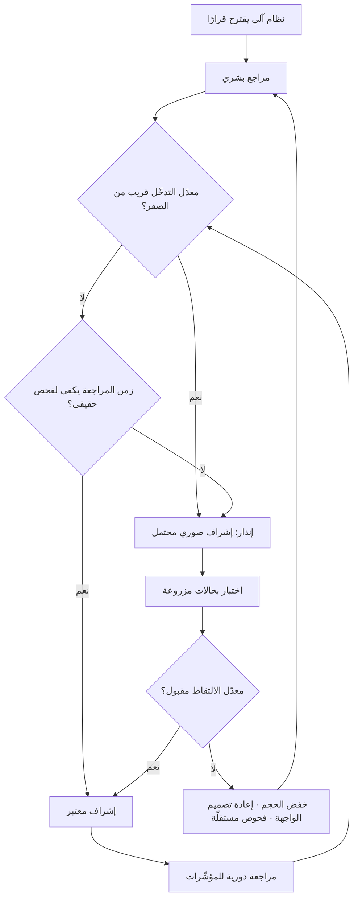

# انحياز الأتمتة (Automation Bias)

> [!info] تعريف مختصر
> ميل الإنسان إلى **ترجيح ما يقترحه النظام الآلي** على حكمه الخاص وعلى الأدلّة المتاحة أمامه، حتى حين تكون تلك الأدلّة كافية لكشف الخطأ. وله وجهان متمايزان: **خطأ الارتكاب (Commission)** حين ينفّذ الإنسان اقتراحًا آليًّا خاطئًا رغم وجود إشارات معارضة، و**خطأ الإغفال (Omission)** حين يفوّت الإنسان مشكلة حقيقية لأن النظام لم ينبّه إليها فافترض سلامة الوضع. وأهمّيته الإدارية أنه **الآلية النفسية التي تُفرغ [[Human in the Loop|الإشراف البشري]] من مضمونه**: يظلّ المشرف موجودًا في المخطّط التنظيمي، وموقّعًا على القرار، بينما هو عمليًّا خارج الحلقة — والمؤسّسة تملك غطاءً وهميًّا للمسؤولية بدل ضابط حقيقي.

## الشرح العلمي والاحترافي
- **أصل الدراسة في عوامل بشرية لا في الذكاء الاصطناعي**: دُرس الانحياز أوّلًا في مجالات الطيران والتحكّم الصناعي والأنظمة الطبّية المساعدة على التشخيص، حين لوحظ أن إدخال أنظمة تنبيه ومساعدة عالية الموثوقية غيّر شكل الأخطاء بدل أن يلغيها: قلّت الأخطاء الروتينية وظهرت أخطاء جديدة مصدرها **الاعتماد المفرط** على النظام. وينتمي هذا إلى حقل أوسع اسمه «سخريات الأتمتة» (Ironies of Automation): كلّما حسّنت الأتمتة أداء النظام في الحالات العادية، ضعف استعداد المشغّل البشري لحالة الشذوذ النادرة — وهي بالضبط الحالة التي أُبقي فيها لأجلها.
- **مفارقة الموثوقية**: كلّما ارتفعت دقّة النظام، **زاد** الانحياز لا نقص. نظام يخطئ في 30% من الحالات يبقي المراجع يقظًا لأن الخطأ متوقّع ومألوف. نظام يخطئ في 1% ينشئ عادة راسخة بالقبول، فتصير الحالة الخاطئة النادرة هي الأصعب اكتشافًا على الإطلاق. وهذه نتيجة مضادّة للحدس الإداري السائد، ولها أثر مباشر على التصميم: **الأنظمة الأدقّ تحتاج ضوابط إشراف أقوى لا أضعف**.
- **الآليات النفسية التي تُنتجه** — وفهمها ضروري لأن العلاج يختلف باختلاف الآلية:
  ① **إزاحة الجهد المعرفي (Cognitive Offloading)**: وجود مصدر جاهز للإجابة يقلّل الدافع لبذل جهد التفكير المستقلّ، وهو سلوك اقتصادي عقلاني لا كسل.
  ② **الإرساء (Anchoring)**: الاقتراح الآلي يصير نقطة انطلاق التفكير، فيتحوّل عمل الإنسان من «ما الصواب؟» إلى «هل أقبل هذا؟» — وهو سؤال أضيق بكثير وأميل إلى الإيجاب.
  ③ **الانحياز التأكيدي**: بعد ظهور الاقتراح، يميل الإنسان إلى البحث عمّا يؤيّده لا عمّا ينقضه.
  ④ **الغطاء الاجتماعي للمسؤولية**: قرار مدعوم بالنظام أسهل تبريرًا أمام المدير من قرار فردي مخالف؛ فمخالفة النظام تُكلّف الموظّف شخصيًّا إن أخطأ، بينما موافقته تُوزّع اللوم.
  ⑤ **ضغط الوقت والحجم**: عند 300 حالة يوميًّا لا يوجد وقت لفحص حقيقي، فيصبح القبول السريع استراتيجية بقاء لا اختيارًا.
  ⑥ **الطلاقة اللغوية**: المخرَج المصقول والواثق يُقرأ بوصفه مخرَجًا دقيقًا، رغم انعدام العلاقة بين جودة الصياغة وصحّة المضمون.
- **الوجه المهمَل: خطأ الإغفال**: تركّز أغلب النقاشات على قبول اقتراح خاطئ، بينما الأخطر عمليًّا هو **الاطمئنان إلى صمت النظام**. حين يعتاد الفريق أن النظام «ينبّه إن كان هناك خلل»، يتوقّف عن الفحص المستقلّ؛ فإن كانت المشكلة من نوع لا يرصده النظام أصلًا مرّت دون أن يراها أحد. وهذا يفسّر لماذا تكون الحوادث في الأنظمة المؤتمتة قليلة العدد لكنها كبيرة الأثر: ما يُكتشف يُكتشف مبكرًا وما لا يُكتشف يستمرّ طويلًا.
- **الأثر التراكمي: تآكل الكفاءة (Skill Degradation)**: الاعتماد الطويل يُضعف قدرة الفريق على أداء المهمّة يدويًّا وعلى نقد المخرَج. وهذه حلقة مغلقة خبيثة: الاعتماد يُضعف المهارة، وضعف المهارة يزيد الاعتماد، حتى يصبح الإشراف مستحيلًا واقعًا لا مجرّد ضعيف — إذ لا يستطيع المشرف الحكم على ما لم يعد قادرًا على إنتاجه أو تقييمه.
- **قياسه ممكن ولا يحتاج أدوات معقّدة**: أبسط مؤشّر عملي هو **معدّل التدخّل البشري**: نسبة الحالات التي عدّلها المراجع أو رفضها. اقترابه من الصفر على مدى مئات الحالات ليس دليل جودة بل إنذار انحياز يستوجب تحقيقًا. ومؤشّرات مساعدة: **متوسط زمن المراجعة للحالة** (إن نزل عن حدّ يستحيل معه القراءة الجادّة فالمراجعة صورية)، و**توزّع القرارات بين المراجعين** (تطابق تامّ بين أشخاص مختلفين مؤشّر مريب)، و**نسبة الأخطاء التي عبرت المراجعة** ([[Escaped Defect Rate]]). ومن الوسائل المتقدّمة إدخال **حالات اختبار مزروعة** معروفة الخطأ ضمن التدفّق لقياس معدّل التقاطها.
- **درجة الثقة المعروضة سلاح ذو حدّين**: عرض «نسبة ثقة» بجانب الاقتراح يحسّن التمييز البشري **بشرط أن تكون معايَرة** — أي أن ما يُعلَن عنه بثقة 90% يصحّ فعلًا في نحو 90% من الحالات. أما الثقة غير المعايَرة فتزيد الضرر: نظام يعلن ثقة عالية وهو مخطئ يُنتج انحيازًا أعمق ممّا لو لم يُعرض رقم إطلاقًا.
- **العلاج تصميمي وتنظيمي، لا تحذيري**: تذكير الموظّفين بأن «النظام قد يخطئ» أثره ضئيل وقصير الأجل. ما يعمل فعليًّا: **تقليل الحجم المعروض على المراجع** ليتّسع الوقت لفحص حقيقي؛ و**عرض السبب والمصدر والبدائل** لا النتيجة وحدها؛ و**مساواة كلفة الرفض بكلفة القبول** في الواجهة؛ و**طلب حكم بشري قبل عرض الاقتراح** في الحالات الحرجة (فيُكسر أثر الإرساء)؛ و**حماية من يخالف النظام** تنظيميًّا حتى لو أخطأ في اجتهاده، وهو ما يتّصل مباشرة بـ[[Psychological Safety]]؛ و**فحوص آلية مستقلّة** لا تعتمد على النظام نفسه، لأن مراجعة النظام بنظام من العائلة نفسها تكرّر الخطأ ولا تكشفه.

## أين ومتى يُستخدم
- **عند تصميم أي عملية فيها إشراف بشري على مخرجات آلية**: تحديد الحجم والواجهة والحوافز جزء من [[AI Orchestration]]، وإغفاله يجعل الإشراف اسميًّا.
- **في تقييم فعالية الضوابط أثناء التدقيق والحوكمة ([[Governance]])**: السؤال التدقيقي الصحيح ليس «هل يوجد مراجع؟» بل «ما معدّل رفضه وتعديله وكم يستغرق في الحالة الواحدة؟».
- **في تحليل الحوادث بعد وقوعها ([[Root Cause Analysis]])**: كثير من الحوادث تُنسب إلى «خطأ بشري» بينما سببها الحقيقي تصميم يجعل القبول التلقائي هو المسار الأسهل والأقلّ كلفة على الموظّف.
- **في تصميم لوحات المؤشّرات والتنبيهات**: كثرة التنبيهات تُنتج تبلّدًا (Alert Fatigue) ثم إغفالًا، وقلّتها تُنتج اطمئنانًا زائفًا؛ وكلاهما وجه من الانحياز يؤثّر على [[MTTR]].
- **في إدارة جودة المخرجات غير الحتمية**: حين يتغيّر السلوك بين التشغيلات ([[Non-determinism]])، يصير الاعتماد على «نجحت آخر مرّة» مصدرًا مباشرًا للانحياز.
- **في تخطيط القدرات والتدريب**: الحفاظ على مهارة يدوية احتياطية داخل الفريق قرار [[Capacity]] واستمرارية أعمال، لا ترفًا تدريبيًّا.

## مثال وسيناريو تطبيقي
> [!example] شركة مقاولات في الرياض أدخلت نظامًا آليًّا لمطابقة **فواتير الموردين** مع أوامر الشراء والاستلام. النظام يقترح: مطابقة سليمة → اعتماد للصرف، أو تعارض → إحالة. حجم الفواتير 620 شهريًّا، ويراجعها محاسبان.
> **الأشهر الأربعة الأولى:** بدا كل شيء ممتازًا. زمن دورة الاعتماد نزل من 9 أيام إلى 2. لكن مراجع الحسابات الداخلي لاحظ رقمًا مقلقًا في تقرير الأداء: **نسبة الفواتير التي عدّلها أو رفضها المحاسبان = 0.6%** خلال 2,400 فاتورة، بينما كان معدّل الاعتراضات في النظام اليدوي السابق نحو 7%. ولاحظ أيضًا أن **متوسط زمن مراجعة الفاتورة 19 ثانية** — وهو زمن لا يكفي لفتح مرفق الاستلام أصلًا.
> **الاختبار:** أدخل المراجع 20 فاتورة اختبارية تحمل أخطاء متعمّدة من ثلاثة أنواع: كمّية مستلمة أقلّ من المفوترة، وسعر وحدة يخالف العقد، ومورّد ذي اسم قريب جدًّا من مورّد معتمد. النظام صنّف 14 منها «مطابقة سليمة» (لأن أخطاءها من نوع لا يفحصه)، واعتمد المحاسبان **13 من هذه الـ14** دون اعتراض. لم يُلتقط سوى واحدة، ومن باب المصادفة.
> **التشخيص:** لم تكن المشكلة إهمالًا فرديًّا. الحجم اليومي كان يفوق سعة المراجعة الجادّة، والواجهة تعرض كلمة «مطابقة سليمة» بلون أخضر دون إظهار سطور المقارنة، وزر الاعتماد الجماعي يعتمد 50 فاتورة بضغطة واحدة، وأي اعتراض يستلزم نموذجًا من 6 حقول. أي أن **التصميم كان يجعل القبول أرخص من الفحص بفارق هائل** — وهذا خطأ الارتكاب. والأخطر أن المحاسبَين توقّفا عن فحص ما لم ينبّه إليه النظام، وهو خطأ الإغفال بعينه.
> **إعادة التصميم:** ① توجيه بالمخاطرة: الفواتير تحت 5,000 ريال ومن موردين متكرّرين تُعتمد آليًّا مع مراجعة عيّنة 10% لاحقًا، فانخفض الحجم المعروض للمراجعة اليدوية بنسبة 71%؛ ② الواجهة صارت تعرض جدول المقارنة سطرًا سطرًا مع تظليل الفروق، وأُلغي الاعتماد الجماعي للفواتير فوق حدّ معيّن؛ ③ الاعتراض صار بضغطة وحقل سبب اختياري؛ ④ فحوص آلية مستقلّة أُضيفت لأنواع الخطأ الثلاثة التي فاتت النظام؛ ⑤ استمرّت الفواتير الاختبارية المزروعة كإجراء دوري ربع سنوي.
> **بعد ربعين:** معدّل التدخّل البشري 5.2%، ومتوسط زمن المراجعة للفاتورة المعروضة 2.4 دقيقة، ومعدّل التقاط الفواتير المزروعة 17 من 20. **الملاحظة الجوهرية التي وثّقها الفريق: لم يتغيّر مستوى مهارة المحاسبَين ولا نيّتهما؛ تغيّر ما عُرض عليهما وكم عُرض وبأي كلفة للرفض.**

## خطوات أو مخطّط
1. قِس أولًا: معدّل التدخّل البشري، ومتوسط زمن المراجعة للحالة، وتطابق القرارات بين المراجعين.
2. قارن معدّل التدخّل بخط أساس معروف (الوضع اليدوي السابق أو مراجعة مستقلّة لعيّنة).
3. إن كان المعدّل قريبًا من الصفر أو الزمن أقصر من زمن الفحص الممكن، افترض انحيازًا حتى يثبت العكس.
4. اختبر بحالات مزروعة معروفة الخطأ، وقِس معدّل الالتقاط.
5. عالج الحجم قبل كل شيء: وجّه الإشراف بالمخاطرة وأتمت المنخفض الأثر بالكامل.
6. أعد تصميم الواجهة: أظهر السبب والمصدر والفروق، وساوِ كلفة الرفض بكلفة القبول.
7. أضف فحوصًا آلية مستقلّة عن النظام المُراجَع نفسه لتغطية أنواع الخطأ التي لا يرصدها.
8. احمِ المخالف تنظيميًّا واعرض حالات «رفض صائب» في المراجعات الدورية بوصفها إنجازًا لا اعتراضًا.
9. حافظ على مهارة يدوية احتياطية عبر تدوير المهام وتمارين دورية بلا مساعدة النظام.

## ⚠️ مفاهيم خاطئة شائعة
> [!warning]
> - **«الانحياز مشكلة انضباط شخصي»**: ليس كذلك. هو نتيجة متوقّعة لتصميم يجعل القبول أرخص من الفحص، ويقع فيه الخبراء المتمرّسون كما يقع فيه المبتدئون. العلاج تصميمي وتنظيمي لا وعظي.
> - **«التدريب والتحذير يكفيان»**: أثرهما حقيقي لكنه قصير الأمد ويتلاشى مع ضغط الحجم. ما يدوم هو تغيير الحجم والواجهة والحوافز والفحوص المستقلّة.
> - **«النظام الأدقّ يقلّل الانحياز»**: العكس. الدقّة العالية تُرسّخ عادة القبول وتجعل الخطأ النادر أشدّ خفاءً. الأنظمة الأدقّ تحتاج ضوابط أقوى.
> - **«انخفاض الاعتراضات دليل نضج»**: قد يكون دليل انهيار الإشراف. معدّل التدخّل مؤشّر صحّة يجب أن يبقى ضمن نطاق معقول لا أن يُدفع إلى الصفر.
> - **قصر المفهوم على قبول اقتراح خاطئ**: الشقّ الآخر — إغفال مشكلة حقيقية لأن النظام لم ينبّه — أكثر شيوعًا وأصعب اكتشافًا، لأنه لا يترك أثرًا في السجل.
> - **«يكفي أن نضع مراجعًا ثانيًا»**: المراجع الثاني يقع في الانحياز نفسه، وقد يزيده بافتراض أن الأول فحص. الحل تنويع **آلية** الفحص لا مضاعفة عدد المراجعين المتشابهين.
> - **«الحلّ أن نراجع مخرجات النظام بنظام آخر»**: إن كان النظام المُراجِع من العائلة نفسها فقد يشترك في الخطأ نفسه. الفحص الفعّال يحتاج آلية مستقلّة، ولو كانت قاعدة منطقية بسيطة.

## ❌ ممارسات خاطئة في المشاريع
> [!failure]
> - **الخطأ: تحميل المراجع حجمًا يفوق سعته ثم مساءلته عن الأخطاء.** لماذا يضرّ: يجعل الإشراف مستحيلًا واقعيًّا ويحوّله إلى ختم، ثم يُلقى اللوم على الفرد بدل التصميم. الحل: طابق الحجم المعروض مع [[Capacity]] الفعلية، وأتمت أو أسقط الباقي بالمخاطرة.
> - **الخطأ: واجهة تعرض النتيجة فقط دون الأساس والفروق.** لماذا يضرّ: يستحيل الفحص الحقيقي فيتحوّل المراجع إلى زرّ موافقة. الحل: اعرض المقارنة والمصدر والبدائل، وظلّل مواضع الاختلاف.
> - **الخطأ: جعل الاعتراض مكلفًا إجرائيًّا (نماذج، تبريرات، تصعيد).** لماذا يضرّ: التصميم يفرض النتيجة قبل أن يفكّر الإنسان. الحل: ساوِ كلفة الرفض بكلفة القبول، واجعل تسجيل السبب مفيدًا للتحسين لا عبئًا على المعترض.
> - **الخطأ: مكافأة السرعة في المراجعة.** لماذا يضرّ: يحوّل الحافز إلى قبول أسرع ويعاقب التدقيق الجادّ. الحل: اجعل معدّل الاكتشاف والخطأ المتسرّب جزءًا من تقييم الأداء، لا عدد الحالات المُنجَزة.
> - **الخطأ: معاقبة من خالف النظام وأخطأ في اجتهاده.** لماذا يضرّ: يُعلّم الفريق أن الموافقة هي المسار الآمن دائمًا، فينتهي الإشراف عمليًّا. الحل: افصل تقييم جودة الاجتهاد عن نتيجته، وعزّز [[Psychological Safety]].
> - **الخطأ: عدم قياس معدّل التدخّل أصلًا.** لماذا يضرّ: تفقد المؤسّسة المؤشّر الوحيد البسيط الذي يكشف انهيار الإشراف مبكرًا. الحل: اجعله مؤشّرًا ثابتًا في تقرير الأداء، مع عتبة إنذار متّفق عليها.
> - **الخطأ: إلغاء المسار اليدوي كليًّا بعد نجاح الأتمتة.** لماذا يضرّ: تتآكل المهارة فيصبح التدخّل مستحيلًا وقت الحاجة، وتنهار استمرارية العمل عند تعطّل النظام. الحل: أبقِ مسارًا يدويًّا مختبَرًا ودرّب عليه دوريًّا ضمن خطة الاستمرارية ([[RTO and RPO]]).
> - **الخطأ: نسبة الحوادث إلى «خطأ بشري» في تقرير الحادثة.** لماذا يضرّ: يوقف التحليل عند الفرد ويترك السبب النظامي قائمًا فتتكرّر الحادثة. الحل: اسأل في [[Root Cause Analysis]] لماذا كان القبول هو المسار الأسهل، وعالج ذلك.

## 🔗 مصطلحات ومفاهيم ذات صلة
[[Human in the Loop]] | [[AI Agent]] | [[AI Copilot]] | [[AI Orchestration]] | [[Non-determinism]] | [[Psychological Safety]] | [[Root Cause Analysis]] | [[Escaped Defect Rate]] | [[Guard Rails]] | [[Governance]] | [[Capacity]]
