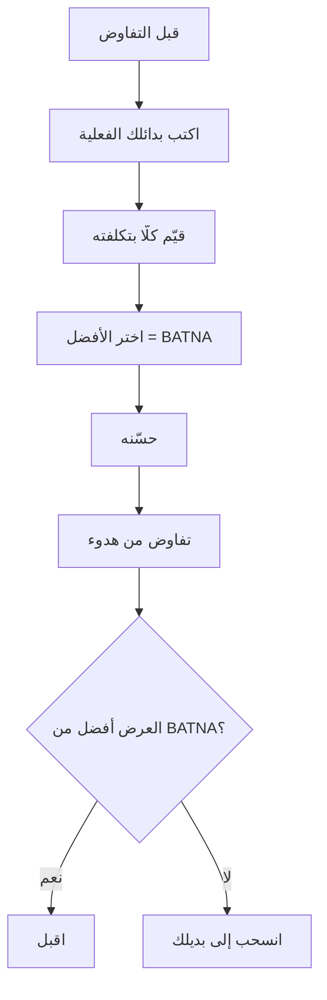

# البديل الأفضل للاتفاق المتفاوَض عليه (BATNA)
> [!info] تعريف مختصر
> BATNA هو **أفضل ما ستفعله إن فشل التفاوض كلّه** — لا ما تتمنّاه، بل ما ستنفّذه فعلًا. وهو الذي يُحدّد **متى تنسحب**؛ وقوّتك التفاوضية دالّة عليه لا على مهارتك.

## الشرح العلمي والاحترافي
صاغه **روجر فيشر وويليام يوري** في *Getting to Yes* (1981) ضمن مشروع هارفارد للتفاوض. وأطروحته أنّ الحدّ الأدنى الذي تقبله **لا يُحدَّد بما تريده بل بما تملكه من بديل**: فمن يملك عرضًا آخر يستطيع رفض عرض ضعيف؛ ومن لا يملك شيئًا يقبل مضطرًّا مهما أتقن التقنيات.

**والفرق عن [[Smart Bartering|حزمة البدائل]] جوهري ويُخلَط كثيرًا:**

| | **BATNA** | **حزمة البدائل** |
|---|---|---|
| موقعه | **خارج** التفاوض | **داخل** التفاوض |
| متى يُستخدَم | إن انهار كلّ شيء | أثناء النقاش |
| مثاله | عرض عمل آخر · مورّد بديل · بناء الحلّ داخليًّا | مسمّى · عمل عن بُعد · تدريب |
| وظيفته | **متى تنسحب** | **بمَ تخرج** |

**ونتيجة عملية مهمّة:** BATNA **لا يُذكَر على الطاولة إلّا نادرًا وبحساب**. فذكره صراحةً يُحوّل التفاوض إلى مواجهة قوّة؛ وقيمته الأساسية في **أثره عليك أنت**: من يعلم أنّ لديه بديلًا يتفاوض بهدوء وثبات، وهما شرطان لكلّ أدوات التأثير.

## أين ومتى يُستخدم
- قبل أيّ تفاوض على راتب أو عقد أو مورّد.
- قبل التفاوض مع مورّد وحيد — حيث انعدام البديل هو المشكلة الحقيقية (انظر [[Vendor Lock-in]]).
- في تقييم عرض: هل هذا أفضل من بديلي، أم أقبله لأنّي لا أملك بديلًا؟

## مثال وسيناريو تطبيقي
> [!example] شركة تتفاوض على تجديد عقد مع مورّد نظام أساسي، والمورّد يرفع السعر 40%. الفريق يُتقن التسميات والمرايا وتأطير الخسارة — **ولا يُفيد شيء**، لأنّ المورّد يعلم أنّ الهجرة تحتاج ثمانية أشهر ولا بديل جاهزًا. **المشكلة ليست في مهارة التفاوض بل في انعدام BATNA.** والعمل الحقيقي كان يجب أن يبدأ قبل عام: تقييم بديلين، وعزل التبعية في طبقة تجريد، وتقدير كلفة الهجرة بدقّة. وحينها لا تحتاج أن تُلوّح بالبديل — **يكفي أنّك تعرفه، فتتفاوض من هدوء بدل أن تتفاوض من اضطرار.**

## خطوات أو مخطّط
1. **حدّد بدائلك الفعلية** — لا الأمنيات. اكتبها.
2. **قيّم كلّ بديل بتكلفته الحقيقية**: مالًا ووقتًا ومخاطرة.
3. **اختر الأفضل** — هذا هو BATNA.
4. **حسّنه قبل التفاوض** — تحسين البديل يرفع قوّتك أكثر من أيّ تقنية تفاوضية.
5. **قدّر BATNA الطرف الآخر** — ما بديله إن لم يتّفق معك؟ فهو يُحدّد مرونته.
6. **لا تُصرّح به** إلّا حين يكون الانسحاب قرارًا اتّخذتَه فعلًا.

## ⚠️ مفاهيم خاطئة شائعة
> [!warning]
> - **ليس أسوأ ما تقبله** — ذلك هو «سعر التحفّظ»؛ و BATNA هو **ما ستفعله إن لم تتّفق أصلًا**، ومنه يُشتقّ سعر التحفّظ.
> - **ليس تهديدًا يُلوَّح به.** التلويح المتكرّر ببديل لا تنوي استخدامه يُكشَف مرّة واحدة ويُدمّر مصداقيتك.
> - **ليس حكرًا على المفاوضات المالية.** لكلّ قرار BATNA: بديل هذا المورّد، وبديل هذه التقنية، وبديل هذا الموظّف.

## ❌ ممارسات خاطئة في المشاريع
> [!failure]
> - **الدخول في تفاوض حاسم بلا بديل** ثم لوم مهارات التفاوض على النتيجة — القوّة تُبنى **قبل** الغرفة لا فيها.
> - **الاعتماد على مورّد وحيد** بلا خطّة خروج ولا تقدير لكلفة الهجرة — انظر [[Vendor Lock-in]] و[[TCO]].
> - **المبالغة في تقدير بديلك** — «سأجد موظّفًا آخر بسهولة» بلا حساب زمن التوظيف والتأهيل وفقد المعرفة السياقية.
> - **إهمال تقدير BATNA الطرف الآخر** — قد يكون بديله أسوأ من بديلك بكثير وأنت لا تعلم، فتتنازل بلا حاجة.

## 🔗 مصطلحات ومفاهيم ذات صلة
[[Smart Bartering]] | [[Anchoring]] | [[Vendor Lock-in]] | [[Vendor Management]] | [[TCO]] | [[Opportunity Cost]] | [[Reversible vs Irreversible Decisions]] | [[Kill Criteria]]

> [!tip] 💡 إثراء عملي — كورس لعبة العقل
> الفرق بينه وبين حزمة البدائل، وأثره على من لا يملك ترف الانتظار: [[09 - التفاوض على القيمة - التثبيت والخسارة والمقايضة]].
