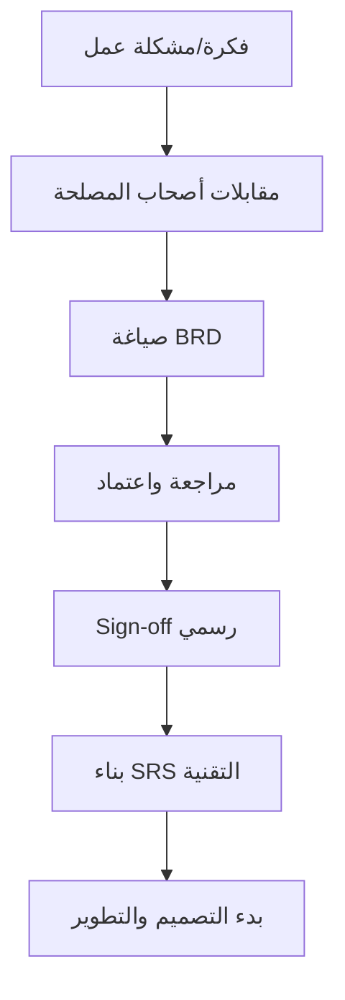

# وثيقة متطلبات العمل (BRD)

> [!info] تعريف مختصر
> وثيقة متطلبات العمل (Business Requirements Document - BRD) هي وثيقة رسمية تشرح ما تحتاجه المؤسسة من مشروع معيّن ولماذا، من منظور العمل (Business) لا من منظور تقني. تُعتمد قبل بدء التصميم التفصيلي أو التطوير.

## الشرح العلمي والاحترافي
- BRD تجيب على سؤال "ما المشكلة التي نحلّها وما الهدف من المشروع؟" بلغة يفهمها أصحاب المصلحة غير التقنيين، وتشمل عادة: خلفية المشكلة، الأهداف، نطاق العمل، المتطلبات الوظيفية وغير الوظيفية على مستوى عالٍ، المعايير التي تُحدَّد بها نجاح المشروع، والقيود (زمنية، مالية، تنظيمية).
- تختلف BRD عن المواصفات التقنية التفصيلية مثل [[Software Requirements Specification]]؛ فالأولى تصف "ماذا ولماذا" من زاوية العمل، بينما الثانية تصف "كيف" من زاوية تقنية دقيقة تستخدمها فرق التطوير مباشرة.
- تُعِدّها عادة إدارة العمل أو محلل الأعمال (Business Analyst) بالتعاون مع أصحاب المصلحة، وتُستخدم كأساس لبناء [[Business Case]] الذي يبرر الاستثمار في المشروع من الناحية المالية والاستراتيجية.
- بمجرد اعتماد BRD، تصبح مرجعاً رسمياً (Baseline) يُقاس عليه أي تغيير لاحق عبر [[Change Request]]، وتُستخدم لبناء [[RTM]] الذي يتتبّع تنفيذ كل متطلب حتى التسليم.
- في المشاريع الكبيرة أو التنظيمية، توقيع BRD يمثل نقطة تحوّل رسمية (Milestone) تنتقل بعدها المسؤولية من "تعريف الحاجة" إلى "تصميم الحل".

## أين ومتى يُستخدم
- يُستخدم بكثرة في مشاريع الشلال ([[04 - Waterfall]]) وفي المؤسسات الكبيرة (بنوك، حكومة، مؤسسات تنظيمية) حيث التوثيق الرسمي المسبق شرط أساسي قبل تخصيص الميزانية.
- يُعَدّ في مرحلة مبكرة من دورة حياة المشروع، بعد الموافقة المبدئية على الفكرة وقبل بدء التصميم التقني أو كتابة [[Software Requirements Specification]].
- في بيئات أجايل الخالصة، قد لا يوجد BRD رسمي منفصل؛ إذ تُستبدل غالباً بوثيقة رؤية مختصرة (Vision Document) و[[13 - Backlog]] حيّ يتطوّر تدريجياً، لكن كثيراً من الفرق الهجينة (مثل [[Scrum-ban]]) تبقي BRD مختصراً كمرجع أولي.
- يُستخدم أصحاب المصلحة (Stakeholders) والإدارة العليا لمراجعة الوثيقة والموافقة عليها قبل الالتزام بالميزانية والجدول الزمني.

## مثال وسيناريو تطبيقي
> [!example] سيناريو ملموس في مشروع برمجي حقيقي
> بنك محلي يريد إطلاق خدمة "فتح حساب بنكي عن بُعد عبر التطبيق" بدل زيارة الفرع. يكتب محلل الأعمال وثيقة BRD تتضمن: المشكلة (40% من العملاء المحتملين يتخلّون عن فتح حساب بسبب ضرورة زيارة الفرع)، الهدف (رفع معدل إتمام فتح الحسابات إلى 80% خلال 6 أشهر)، النطاق (التحقق من الهوية عبر الكاميرا، التوقيع الإلكتروني، ربط مع نظام [[KYC]])، والقيود (يجب الالتزام بتنظيمات البنك المركزي ومعايير [[PDPL]] لحماية بيانات العملاء).
> تُعرض الوثيقة على لجنة تنفيذية من 5 أعضاء، تُناقش لمدة أسبوعين، ثم تُعتمد رسمياً عبر [[Sign-off]]. بعدها فقط يبدأ فريق التصميم التقني بكتابة [[Software Requirements Specification]] المفصّلة بناءً على هذه الوثيقة المعتمدة.

## خطوات أو مخطّط
1. جمع احتياجات أصحاب المصلحة عبر مقابلات وورش عمل، وتحديد المشكلة الجوهرية.
2. صياغة الأهداف ومعايير النجاح بشكل قابل للقياس (غالباً بمنهج [[SMART Goals]]).
3. تحديد نطاق العمل بوضوح، بما يشمل ما هو [[Out of Scope]] أيضاً.
4. توثيق المتطلبات الوظيفية وغير الوظيفية على مستوى عالٍ، والقيود والافتراضات.
5. مراجعة الوثيقة مع أصحاب المصلحة والحصول على [[Sign-off]] رسمي قبل الانتقال للتصميم التقني.

## ⚠️ مفاهيم خاطئة شائعة
> [!warning]
> - الخلط بين BRD والمواصفات التقنية ([[Software Requirements Specification]])؛ الأولى تصف الحاجة من منظور العمل، والثانية تصف الحل من منظور تقني تفصيلي.
> - الاعتقاد أن BRD وثيقة جامدة لا تتغيّر أبداً بعد اعتمادها؛ في الواقع يمكن تعديلها عبر [[Change Request]] رسمي عند ظهور معلومات جديدة، لكن ليس بشكل عشوائي.
> - الظن أن أجايل لا يحتاج أي وثيقة مماثلة؛ الصحيح أن أغلب الفرق الهجينة تحتفظ بنسخة مختصرة منها لتأطير الرؤية العامة قبل بناء الـ Backlog التفصيلي.

## ❌ ممارسات خاطئة في المشاريع
> [!failure]
> - كتابة BRD مطوّلة جداً ومليئة بتفاصيل تقنية لا تخص أصحاب المصلحة، فتفقد وضوحها وتصبح صعبة القراءة. التجنب: إبقاء BRD على مستوى العمل، وترك التفاصيل التقنية لوثيقة [[Software Requirements Specification]] منفصلة.
> - البدء بالتطوير قبل اعتماد BRD رسمياً، مما يسبب إعادة عمل كبيرة عند اكتشاف خلاف على الأهداف لاحقاً. التجنب: الالتزام بـ [[Sign-off]] رسمي قبل تخصيص الموارد التقنية.
> - تجاهل تحديث BRD عند تغيّرات جوهرية في السوق أو التنظيمات، فيصبح مرجعاً مضللاً للفريق. التجنب: مراجعة الوثيقة دورياً وربط أي تعديل بـ [[Change Request]] موثّق.

## 🔗 مصطلحات ومفاهيم ذات صلة
[[Software Requirements Specification]] | [[Business Case]] | [[RTM]] | [[Change Request]] | [[Sign-off]] | [[Out of Scope]] | [[04 - Waterfall]] | [[SMART Goals]] | [[Stakeholder Map]]
